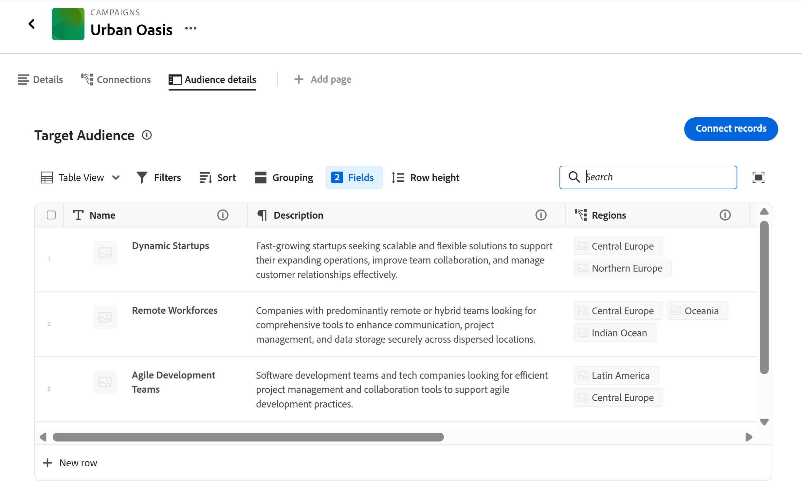

# Hinzufügen einer Seite „Verbundene Einträge“ zu einem Eintrag

<!--
The highlighted information on this page refers to functionality not yet generally available. It is available only in the Preview environment for all customers. After the monthly releases to Production, the same features are also available in the Production environment for customers who enabled fast releases.    

For information about fast releases, see [Enable or disable fast releases for your organization](/help/quicksilver/administration-and-setup/set-up-workfront/configure-system-defaults/enable-fast-release-process.md). 
-->

Sie können Informationen aus verbundenen Datensätzen oder Objekten anzeigen, indem Sie in Adobe Workfront Planning eine Registerkarte für eine Seite „Verbundene Datensätze“ zu einem Datensatz hinzufügen. Dadurch werden die verbundenen Datensätze in einer Tabellenansicht zur Registerkarte hinzugefügt.

Beachten Sie beim Hinzufügen einer Seite „Verbundene Datensätze“ zu einem Datensatz Folgendes:

* Sie können eine Seite „Verbundene Datensätze“ zu einem Datensatz hinzufügen, nachdem Sie über die Tabellenansicht Datensätze oder Objekttypen mit dem Datensatztyp verbunden haben.

* Sie können eine Seite „Verbundene Datensätze“ aus dem Vorschaubereich eines Datensatzes oder aus der Seite des Datensatzes hinzufügen.

* Für einen bestimmten Datensatztyp kann nur eine verbundene Datensatzseite verwendet werden.

  Wenn Sie beispielsweise eine Seite mit verbundenen Datensätzen für eine Kampagne erstellen und die zugehörigen Personas anzeigen möchten, können Sie für Personas nur eine einzige Seite mit verbundenen Datensätzen haben.

* Verbundene Datensatzseiten zeigen nur die verbundenen Objekte oder Datensätze eines Objekts oder Datensatztyps an. Auf der Seite werden nicht alle Datensätze dieses Typs angezeigt.

* Je nachdem, welches Objekt oder welcher Datensatztyp auf der Seite Verbundene Datensätze angezeigt wird, können Sie diese mithilfe der folgenden Ansichten anzeigen:

   * Sie können verbundene Planungsdatensätze in den folgenden Ansichten anzeigen:
      * Tabelle
      * Timeline
      * Kalender
   * Sie können verbundene Workfront-Projekte in einer Listenansicht anzeigen.

* Sie können Seiten mit verbundenen Datensätzen für die folgenden verbundenen Datensatz- oder Objekttypen hinzufügen:

   * Workfront-Planungs-Datensatztypen
   * Workfront-Projekte

     Sie können die verbundenen Workfront-Projekte anzeigen, selbst wenn Sie nicht über die erforderlichen Zugriffsberechtigungen für sie in Workfront verfügen.

## Zugriffsanforderungen

+++ Erweitern Sie , um die Zugriffsanforderungen für die Funktion in diesem Artikel anzuzeigen. 

<table style="table-layout:auto"> 
<col> 
</col> 
<col> 
</col> 
<tbody> 
    <tr> 
<tr> 
</tr>   
<tr> 
   <td role="rowheader">
Adobe Workfront-Paket
</td> 
   <td> 

Beliebiges Workfront und beliebiges Planungspaket

Beliebiger Workflow und beliebiges Planungspaket

Weitere Informationen zu den einzelnen Workfront-Planungspaketen erhalten Sie von Ihrem Workfront-Kundenbetreuer. 
 
   </td> 
<tr>
<td> 
   
 Zusätzliche Produkte
 </td> 
   <td> 
   
 Zusätzlich zu Adobe Workfront müssen Sie über Folgendes verfügen, wenn Sie eine verbundene Datensatzseite für Objekte aus den folgenden Programmen hinzufügen möchten:

   <ul><li>
Eine Adobe Experience Manager-Lizenz und eine Integration zwischen Adobe Experience Manager und Workfront, um AEM-Objekte mit Planungs-Datensatztypen zu verbinden.

   
Weitere Informationen finden Sie unter <a href="/help/quicksilver/documents/adobe-workfront-for-experience-manager-assets-essentials/workfront-for-aem-asset-essentials.md">Adobe Workfront für Experience Manager Assets und Assets Essentials: Artikelindex</a>. 
</li>
   <li>
 Eine Adobe GenStudio for Performance Marketing-Lizenz zum Verbinden von Datensatztypen mit GenStudio Brands

   
Weitere Informationen finden Sie <a href="https://experienceleague.adobe.com/de/docs/genstudio-for-performance-marketing/user-guide/get-started">Erste Schritte mit Adobe GenStudio for Performance Marketing</a>.
</li></ul>
   </td> 
  </tr>

<tr> 
   <td role="rowheader">
Adobe Workfront-Lizenz
</td> 
   <td>
Standard

   </td> 
  </tr> 
  <tr>
   <td role="rowheader">
Objektberechtigungen
</td>
   <td>
   
Beitragen von oder höhere Berechtigungen für einen Arbeitsbereich und einen Datensatztyp 
  
   
Systemadministratoren haben Berechtigungen für alle Arbeitsbereiche, einschließlich der nicht erstellten
 
  </td>
  </tr>   
</tbody> 
</table>

Weitere Informationen zu Zugriffsanforderungen für Workfront finden Sie unter [Zugriffsanforderungen in der Dokumentation zu Workfront](/help/quicksilver/administration-and-setup/add-users/access-levels-and-object-permissions/access-level-requirements-in-documentation.md).

+++   

## Hinzufügen einer Seite „Verbundene Einträge“ zu einem Eintrag

Sie müssen zunächst Datensatztypen mit anderen Datensatztypen oder Workfront-Projekten verbinden, bevor Sie einem Datensatz eine verbundene Datensatzseite hinzufügen.

1. Klicken Sie auf den Namen des Datensatzes, um ihn in jeder Ansicht einer Datensatztypseite zu öffnen.
1. Klicken Sie **einem der** Bereiche auf „Seite hinzufügen“:

   * Das Vorschaufenster des Datensatzes
   * Die Detailseite des Datensatzes, nachdem Sie auf das Symbol **In neuer Registerkarte öffnen** ( in der oberen rechten Ecke der Vorschauseite geklickt haben.

   Das **Seite erstellen** wird geöffnet.

   

1. Fügen Sie den **Seitennamen** hinzu, klicken Sie auf **Seite „Verbundene Datensätze** für den **Seitentyp** und klicken Sie dann auf **Erstellen**.
1. (Optional) Klicken Sie auf den Namen eines verbundenen Datensatzes oder Objekttyps in der Liste, oder suchen Sie nach dem Datensatz oder Objekttyp. Klicken Sie dann auf den Datensatz oder Objekttyp, wenn er in der Liste angezeigt wird, um die Seite für diesen Datensatz oder Objekttyp zu erstellen.

   >[!TIP]
   >
   >Sie können für jeden Datensatztyp eine verbundene Datensatzseite erstellen. Wenn ein verbundener Datensatztyp bereits über eine Seite verfügt, wird sie nicht mehr als Option angezeigt.
   >

1. (Optional und bedingt) Wenn mehr als ein verbundenes Feld des Datensatz- oder Objekttyps angezeigt wird, für den Sie die Seite erstellen, klicken Sie in der Liste „Referenzfeld **&quot; auf das Feld, dessen Datensätze oder Objekte Sie auf der Seite „Verbundene Datensätze“ anzeigen**.

   

   Eine der folgenden Seiten wird der Seite „Verbundene Datensätze“ hinzugefügt:

   * Die Tabellenansicht eines Datensatztyps
   * Die Listenansicht eines Projektobjekttyps

   Die Datensätze oder Projekte, die mit dem aktuellen Datensatz verbunden sind, werden in der Tabellen- oder Listenansicht angezeigt.

   >[!TIP]
   >
   >Sie müssen verbundene Datensätze im Tabellen- oder Detailbereich eines Datensatzes hinzufügen, bevor Sie sie auf einer Seite mit verbundenen Datensätzen anzeigen können. Andernfalls ist die Tabelle oder Liste leer.

   Die ersten fünf Felder der verbundenen Datensätze werden standardmäßig angezeigt. Standardmäßig werden keine Suchfelder angezeigt.

   

1. (Bedingt) Führen Sie je nachdem, welche Art von Datensätzen Sie auf der Seite „Verbundener Datensatz“ anzeigen, einen der folgenden Schritte aus:

   * Verwalten von Planungsdatensätzen
Weitere Informationen finden Sie im Abschnitt [Verwalten der Seite „Verbundene Datensätze“ für Planungsdatensätze](#manage-the-connected-records-page-for-planning-records) in diesem Artikel.
   * Verwalten von Workfront-Projekten
Weitere Informationen finden Sie im Abschnitt [Verwalten der Seite „Verbundene Datensätze“ für Workfront-Projekte](#manage-the-connected-records-page-for-workfront-projects) in diesem Artikel.

1. (Optional) Doppelklicken Sie auf den Namen der Registerkarte **Seite „Verbundene Datensätze**

   ODER

   Bewegen Sie den Mauszeiger über den Namen der Registerkarte und klicken Sie dann auf **Mehr**  und klicken Sie dann auf **Umbenennen**, um die Registerkarte in neue verbundene Datensatzerseite umzubenennen.

1. (Optional) Bewegen Sie den Mauszeiger über den Namen der Registerkarte „Verbundene Datensatzerseite“ und klicken Sie auf **Mehr**  und dann auf **Löschen**, um die Registerkarte zu entfernen.

### Verwalten der Seite „Verbundene Datensätze“ für Planungsdatensätze

<!--

#### Manage the connected records page for Planning records in the Production environment

When you create a connected records page for  connected Planning records in the Production environment, do the following: (****or AEM Assets - AEM is not available yet?? see note below********)

1. Go to a record type page and click the name of a record. This opens the record's preview page.
1. Click the tab for a connected records page that display Planning records.
   The records connected to the record you selected display in the table view. 
1. Click **Connect** at the bottom of the table view to connect existing records, select them from the connection box, then click outside the box to close it. The records are automatically added to the table and connected to the record you selected. The records must exist before you can add them.

   For more information, see [Connect records](/help/quicksilver/planning/records/connect-records.md).

1. Edit any information from the connected records inline in the table view. 
1. Hover over a connected record's name, then click the **More** menu 

   Or 
   
   Select one of the records, then click one of the following options in the blue bar at the bottom of the list: 

   * **View** to open the record page in a new tab
   * **Copy link** to copy a link to the record page
   * **Edit thumbnail** to open the **Record thumbnail** box and edit the record's thumbnail image
   * **Duplicate** to duplicate the connected record. The duplicated record is also connected to the current record.
   * **Insert record above or below** to add new records to the connected record type. New records added here are also connected to the current record. This option is not available in the blue bar when selecting a record in the table.
   * **Delete** to delete the record. Deleting a connected record deletes it from its record type and from everywhere where the record is connected. The deleted records move to the **Recently deleted** bin of their record type.

      For information about editing records in the table view, see [Edit records](/help/quicksilver/planning/records/edit-records.md). 

      >[!TIP]
      >
      >You can select more than one record or object to delete them.
      >

1. Inline edit any of the records in the table on the connected records page.
1. Use any of the following view elements in the toolbar of a connected record page to manage the table view:

   * **Filters**
   * **Sort**
   * **Grouping**
   * **Fields**, to display, hide, or rearrange fields
   * **Row height**
   * **Search**

   For information, see [Manage the table view](/help/quicksilver/planning/views/manage-the-table-view.md). 

   >[!NOTE]
   >
   >You cannot create, edit, or delete fields in the table view of a connected record's tab.
   >

#### Manage the connected records page for Planning records in the Preview environment

When you create a connected records page for connected Planning records in the Preview environment, do the following: (***********or AEM Assets -- AEM is not available yet?? see note below**********)

-->

1. Wechseln Sie zu einer Seite vom Typ Datensatz und klicken Sie auf den Namen eines Datensatzes. Dadurch wird die Vorschauseite des Datensatzes geöffnet.
1. Klicken Sie auf die Registerkarte für eine Seite mit verbundenen Datensätzen, auf der Planungsdatensätze angezeigt werden.
Die mit dem ausgewählten Datensatz verbundenen Datensätze werden in der Tabellenansicht angezeigt.
1. Klicken Sie **Datensätze verbinden** oben rechts auf der Seite „Verbundene Datensätze“, um vorhandene Datensätze zu verbinden, wählen Sie sie aus dem Feld „Verbindung“ aus und klicken Sie dann außerhalb des Felds, um sie zu schließen. Die Datensätze werden automatisch der Tabelle hinzugefügt und mit dem ausgewählten Datensatz verbunden. Die Datensätze müssen vorhanden sein, bevor Sie sie hinzufügen können.

   Weitere Informationen finden Sie unter [Datensätze verbinden](/help/quicksilver/planning/records/connect-records.md).

1. Klicken Sie **Neue Zeile** unten in der Tabelle, um neue Datensätze hinzuzufügen. Die neuen Datensätze werden automatisch mit den ausgewählten Datensätzen verbunden.
1. Bearbeiten Sie alle Informationen aus den verbundenen Datensätzen inline in der Tabellenansicht.
1. Bewegen Sie den Mauszeiger über den Namen eines verbundenen Datensatzes und klicken Sie dann auf das Menü **Mehr** 

   ODER

   Wählen Sie einen der Datensätze aus und klicken Sie dann auf eine der folgenden Optionen in der blauen Leiste unten in der Liste:

   * **Anzeigen**, um die Datensatzseite in einer neuen Registerkarte zu öffnen
   * **Link kopieren**, um einen Link auf die Datensatzseite zu kopieren
   * **Miniaturansicht bearbeiten** um das Feld **Miniaturansicht aufzeichnen** zu öffnen und das Miniaturbild des Datensatzes zu bearbeiten
   * **Duplizieren** um den verbundenen Datensatz zu duplizieren. Der duplizierte Datensatz ist auch mit dem aktuellen Datensatz verbunden.
   * **Datensatz oberhalb oder unterhalb einfügen**, um dem verbundenen Datensatztyp neue Datensätze hinzuzufügen. Neue hier hinzugefügte Datensätze sind auch mit dem aktuellen Datensatz verbunden. Diese Option ist bei der Auswahl eines Datensatzes in der Tabelle in der blauen Leiste nicht verfügbar.
   * **Löschen**, um den Datensatz zu löschen. Wenn Sie einen verbundenen Datensatz löschen, wird er aus seinem Datensatztyp und überall dort, wo der Datensatz verbunden ist, gelöscht. Die gelöschten Datensätze werden in den **kürzlich gelöschte** Bin ihres Datensatztyps verschoben.

     Weitere Informationen zum Bearbeiten von Datensätzen in der Tabellenansicht finden Sie unter [Datensätze bearbeiten](/help/quicksilver/planning/records/edit-records.md).

     >[!TIP]
     >
     >Sie können mehrere Datensätze oder Objekte auswählen, um sie zu löschen.

1. Inline-Bearbeitung eines beliebigen Datensatzes in der Tabelle auf der Seite „Verbundene Datensätze“.
1. Verwenden Sie eines der folgenden Ansichtselemente in der Symbolleiste einer verbundenen Datensatzseite, um die Tabellenansicht zu verwalten:

   * **Filter**
   * **sort**
   * **Gruppierung**
   * **Felder**, zum Anzeigen, Ausblenden oder Neuanordnen von Feldern
   * **Zeilenhöhe**
   * **Suche**

   Weitere Informationen finden Sie unter [Verwalten der Tabellenansicht](/help/quicksilver/planning/views/manage-the-table-view.md).

   >[!NOTE]
   >
   >Sie können keine Felder in der Tabellenansicht der Registerkarte eines verbundenen Datensatzes erstellen, bearbeiten oder löschen.
   >

1. Klicken Sie auf das Dropdown-Menü „Ansichten“ in der oberen rechten Ecke der Seite „Verbundene Datensätze“ und klicken Sie auf **Neue Ansicht**, um eine neue Ansicht für die Seite hinzuzufügen. Gehen Sie dann wie folgt vor:

   1. Fügen Sie einen **Ansichtsnamen“**.
   1. Wählen Sie im Bereich **Ansichtstyp** einen der folgenden Ansichtstypen aus:

      * Tabelle
Weitere Informationen finden Sie unter [Verwalten der Tabellenansicht](/help/quicksilver/planning/views/manage-the-table-view.md)
      * Zeitleiste
Weitere Informationen finden Sie unter [Verwalten der Zeitleisten-Ansicht](/help/quicksilver/planning/views/manage-the-timeline-view.md).
      * Kalender
Weitere Informationen finden Sie unter [Verwalten der Kalenderansicht](/help/quicksilver/planning/views/manage-the-calendar-view.md).

        Weitere Informationen finden Sie im Abschnitt [Verwalten mehrerer Ansichten auf der Seite „Verbundene Datensätze](#manage-multiple-views-from-the-connected-records-page) in diesem Artikel.

   1. Klicken Sie **Erstellen**.
Dem Dropdown-Menü „Ansichten“ wird eine neue Ansicht hinzugefügt.

   1. (Optional) Bewegen Sie den Mauszeiger über den Namen einer von Ihnen erstellten Ansicht und klicken Sie auf das Menü **Mehr**  und dann auf eine der folgenden Optionen:

      * **Umbenennen**, um einen neuen Namen für die Ansicht hinzuzufügen.
      * **Freigeben**

        Weitere Informationen finden Sie unter [Freigeben von Ansichten](/help/quicksilver/planning/access/share-views.md).
      * **Exportieren**

      * **Löschen**
Weitere Informationen finden Sie [Löschen von Datensatzansichten](/help/quicksilver/planning/views/delete-record-views.md).

        

        >[!NOTE]
        >
        >Sie können eine von Workfront erstellte Systemansicht nicht löschen.

### Verwalten der verbundenen Datensatzseite für Workfront-Projekte

Wenn Sie eine Seite mit verbundenen Datensätzen für verbundene Workfront-Projekte erstellen, gehen Sie folgendermaßen vor, um die Seite zu verwalten:

1. Wechseln Sie zu einer Seite vom Typ Datensatz und klicken Sie auf den Namen eines Datensatzes. Dadurch wird die Vorschauseite des Datensatzes geöffnet.
1. Klicken Sie auf die Registerkarte für eine Seite mit verbundenen Datensätzen, auf der Workfront-Projekte angezeigt werden.

   

   Die mit dem ausgewählten Datensatz verbundenen Projekte werden in der Listenansicht angezeigt.

   Informationen zum Verwalten oder Bearbeiten von Objekten in der Listenansicht finden Sie unter [Verwalten der Listenansicht](/help/quicksilver/planning/views/manage-the-list-view.md).

<!-- 
removed this part, so we won't have to have duplicate information to keep up with for the list view in Planning: 
1. Click **Connect records** in the upper-right corner of the connected record page to connect existing projects.

   For information, see [Connect records](/help/quicksilver/planning/records/connect-records.md).
1. Double-click inside a cell in the list view to edit a project's fields. Some fields are read-only. 
1. Do one of the following to edit the list view: 

   * Click **New row** to create a project without a template. The new project is automatically connected to the current record.

      For more information, see [Create Workfront objects from Workfront Planning as you connect them to records](/help/quicksilver/planning/records/create-workfront-objects-from-workfront-planning.md).
   * Click **Create records **in the upper-right corner of the view to add existing projects. Projects are immediately connected to the selected record. 

   * Hover over a project name in the list and click the **More** menu [More menu](assets/more-menu.png) and click **View** to open the project in another tab
     
      Or

      Select one or more projects, and from the actions bar at the bottom of the list, click **Delete** or **Disconnect** to remove the item from the list.
      

   * Click the views dropdown menu, and click **New view** to add a new view for the page, then do the following, or click the **More** menu  to the right of a new name, then **Rename**, **Share**, or **Delete** the view. 

      You cannot rename, share or delete System Views or views you do not have Manage permissions to.

      

   * Click one of the following to update the view's elements: 

      * **Filter** to limit the amount of information in the list
      * **Columns** to hide columns or change their order
      * The **+** icon in the upper-right corner of the table view to add existing fields to the list. Fields must exist before you can add them. 

   For more information about managing objects in a list view, see [Manage the list view](/help/quicksilver/planning/views/manage-the-list-view.md).
-->

<!--
 this is repetitive from an earlier section above: 

## Manage multiple views from the connected records page

You can add and manage multiple view types from the connected records page of a record. 

The views you create in the Connected records page of a record type are available everywhere in Workfront Planning where that record type page displays. Views created for the same record type anywhere else in Workfront Planning are also accessible in all connected records pages of that record type. 

To manage multiple views from the connected records page: 

1. (Conditional) When displaying Planning records in the connected records page, click the dropdown menu to the right of the view name, then click **New view** to add a view, then select from the following options: 

   * **Table**. For more information, see [Manage the table view](/help/quicksilver/planning/views/manage-the-table-view.md). 
   * **Timeline**. For more information, see [Manage the timeline view](/help/quicksilver/planning/views/manage-the-timeline-view.md).
   * **Calendar**. For more information, see [Manage the calendar view](/help/quicksilver/planning/views/manage-the-calendar-view.md). 

1. (Optional) Hover over the name of a view in the Connected records page, then click the **More** menu , then click one of the following: 

   * **Rename**
   * **Share**. For more information, see [Share views](/help/quicksilver/planning/access/share-views.md).

   >[!TIP]
   >
   >Sharing views from Connected records pages makes them accessible to users in all areas of Workfront Planning where the view displays. 
   >Also, if a view is shared from any other area of Workfront Planning, it is also available to the same users in Connected records pages. 

   * **Export** 
   * **Delete**

   <!--
   not possible right now: * **Duplicate**. For more information, see [Duplicate record views](/help/quicksilver/planning/views/duplicate-record-views.md).
      >[!TIP]
      >
      >Duplicating a view from Connected records pages makes it available in all other areas of Workfornt planning, when viewing the same record types.
      -->

<!--
No longer possible: 1. (Optional and conditional) When you create a connected records page for the following Workfront object types:
         * Portfolios
         * Programs
         * Groups
         * Companies
      Do any of the following in the table view of the connected records page: 
      * Click the name of a object. This opens the object's page in a new tab. 
      * Click **Connect** at the bottom of the table view to connect existing objects, select them from the connection box, then click outside the box to close it. The objects are automatically added to the table. The objects must exist before you can add them.
      For more information, see [Connect records](/help/quicksilver/planning/records/connect-records.md).
      * Select one of the objects in the table view, then click one of the following options in the blue bar at the bottom of the list: 
      * **View** to open the record page in a new tab
      * **Copy link** to copy a link to the record page
      * **Disconnect** to disconnect the object from the record you are viewing. 
      TIP      
      You can select more than one record or object to disconnect them.
      -->
