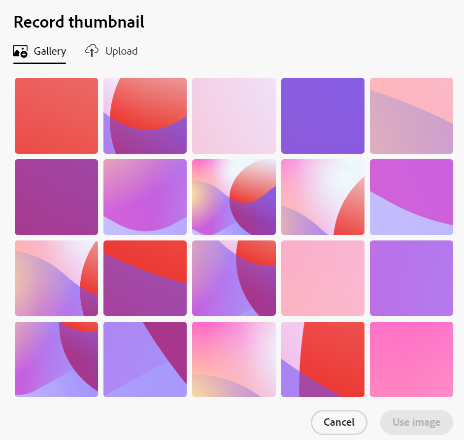

# Hinzufügen einer Miniaturansicht zu einem Datensatz

<!--The highlighted information on this page refers to functionality not yet generally available. It is available only in the Preview environment for all customers. After the monthly releases to Production, the same features are also available in the Production environment for customers who enabled fast releases.    

For information about fast releases, see [Enable or disable fast releases for your organization](/help/quicksilver/administration-and-setup/set-up-workfront/configure-system-defaults/enable-fast-release-process.md). -->

{{planning-important-intro}}

Sie können in Adobe Workfront Planning Datensätze mit eindeutigen Miniaturansichten verknüpfen, um sie leicht erkennbar zu machen.

Sie müssen Datensatztypen erstellen, bevor Sie Datensätze erstellen und bearbeiten können.
Weitere Informationen finden Sie [Datensatztypen erstellen](/help/quicksilver/planning/architecture/create-record-types.md).

## Zugriffsanforderungen

<!--************double-check permissions here - asking Isk and Lilit what permissions users need for adding thumbnails-->

+++ Erweitern Sie , um die Zugriffsanforderungen für die Funktion in diesem Artikel anzuzeigen. 

<table style="table-layout:auto"> 
<col> 
</col> 
<col> 
</col> 
<tbody> 
    <tr> 
<tr> 
</tr>   
<tr> 
   <td role="rowheader">
Adobe Workfront-Paket
</td> 
   <td> 

Beliebiges Workfront und beliebiges Planungspaket
 
Beliebiger Workflow und beliebiges Planungspaket

Weitere Informationen zu den einzelnen Workfront-Planungspaketen erhalten Sie von Ihrem Workfront-Kundenbetreuer. 
 
   </td> 
  <tr> 
   <td role="rowheader">
Adobe Workfront-Lizenz
</td> 
   <td>
Standard

   </td> 
  </tr> 
  <tr> 
   <td role="rowheader">
Objektberechtigungen
</td> 
   <td>   
Beitragen von oder höhere Berechtigungen für einen Arbeitsbereich und einen Datensatztyp  
  
   
Systemadministratoren haben Berechtigungen für alle Arbeitsbereiche, einschließlich der nicht erstellten
 </td> 
  </tr>   
</tbody> 
</table>

Weitere Informationen zu Zugriffsanforderungen für Workfront finden Sie unter [Zugriffsanforderungen in der Dokumentation zu Workfront](/help/quicksilver/administration-and-setup/add-users/access-levels-and-object-permissions/access-level-requirements-in-documentation.md).

+++   

<!--Old:

<table style="table-layout:auto"> 
<col> 
</col> 
<col> 
</col> 
<tbody> 
    <tr> 
<tr> 
<td> 
   
 Products
 </td> 
   <td> 
   <ul><li>
 Adobe Workfront
</li> 
   <li>
 Adobe Workfront Planning
</li></ul></td> 
  </tr>   
<tr> 
   <td role="rowheader">
Adobe Workfront plan*
</td> 
   <td> 

Any of the following Workfront plans:
 
<ul><li>Select</li> 
<li>Prime</li> 
<li>Ultimate</li></ul> 

Workfront Planning is not available for legacy Workfront plans
 
   </td> 
<tr> 
   <td role="rowheader">
Adobe Workfront Planning package*
</td> 
   <td> 

Any 
 

For more information about what is included in each Workfront Planning plan, contact your Workfront account manager. 
 
   </td> 
 <tr> 
   <td role="rowheader">
Adobe Workfront platform
</td> 
   <td> 

Your organization's instance of Workfront must be onboarded to the Adobe Unified Experience to be able to access Workfront Planning.
 

For more information, see <a href="/help/quicksilver/workfront-basics/navigate-workfront/workfront-navigation/adobe-unified-experience.md">Adobe Unified Experience for Workfront</a>. 
 
   </td> 
   </tr> 
  </tr> 
  <tr> 
   <td role="rowheader">
Adobe Workfront license*
</td> 
   <td>
 Standard 

   
Workfront Planning is not available for legacy Workfront licenses
 
  </td> 
  </tr> 
  <tr> 
   <td role="rowheader">
Access level configuration
</td> 
   <td> 
There are no access level controls for Adobe Workfront Planning
   
</td> 
  </tr> 
<tr> 
   <td role="rowheader">
Object permissions
</td> 
   <td>   
Contribute or higher permissions to a workspace and record type  
  
   
System Administrators have permissions to all workspaces, including the ones they did not create
 </td> 
  </tr> 
</tbody> 
</table> -->

## Überlegungen zu Datensatzminiaturansichten

Um Datensätze in einer Tabellenansicht visuell unterscheiden zu können, können Sie jedem Datensatz ein eindeutiges Miniaturbild zuordnen.

Beachten Sie Folgendes:

* Eine Miniaturansicht ist für einen Datensatz eindeutig und gilt nicht für alle Datensätze desselben Typs.
* Sie können nur Bilddateien als Miniaturen hinzufügen.
  <!--above: when you know exactly what type of files are allowed, add the exact extensions above-->
* Sie können einzelnen Datensätzen in der Tabellenansicht oder über die Seite oder das Vorschaufeld des Datensatzes ein Miniaturbild hinzufügen.
* Workfront lädt bei jeder Erstellung eines Datensatzes automatisch ein Miniaturbild hoch. Sie können dieses Bild später ändern.
* Miniaturansichten gehören zu den Datensatzinformationen und werden in Bereichen angezeigt, in denen Datensätze angezeigt werden. Beispielsweise werden Miniaturansichten neben Datensatzinformationen in den folgenden Bereichen angezeigt:

   * Das primäre Feld eines Datensatzes in der Tabellenansicht
   * Die Datensatzleiste in der Zeitleisten -Ansicht.
   * Details und Vorschau des Datensatzes.

## Hinzufügen einer Miniaturansicht zu einem Datensatz

Sie können eine Miniaturansicht wie folgt hinzufügen:

* [Hinzufügen einer Miniaturansicht zu einem Datensatz aus der Tabellenansicht](#add-a-thumbnail-to-a-record-from-the-table-view)
* [Hinzufügen einer Miniaturansicht zu einem Datensatz über die Detailseite](#add-a-thumbnail-to-a-record-from-the-details-page)

### Hinzufügen einer Miniaturansicht zu einem Datensatz aus der Tabellenansicht

{{step1-to-planning}}

1. Klicken Sie auf den Arbeitsbereich, für dessen Datensätze Sie Miniaturansichten hinzufügen möchten, und klicken Sie dann auf die Karte „Datensatztyp“.

   Dadurch wird die Seite „Datensatztyp“ geöffnet.
1. Wählen Sie eine Tabellenansicht aus dem Dropdown **Menü** Ansicht“ aus. Alle Datensätze des ausgewählten Typs werden in einer Tabelle angezeigt.
1. Bewegen Sie den Mauszeiger über die Primärfeldinformationen und klicken Sie auf das Menü **Mehr**  und dann auf **Miniatur**.

   

   >[!TIP]
   >
   >   Das primäre Feld ist das Feld, das in der ersten Spalte einer Tabellenansicht angezeigt wird. Das primäre Feld ist immer eingefroren und kann nicht ausgeblendet oder verschoben werden. Die Option „Miniaturansicht“ ist im Menü Mehr nicht verfügbar, wenn das primäre Feld ein Formelfeld ist.

   Die **Hochladen** wird standardmäßig im Feld **Miniaturansicht aufzeichnen** geöffnet.

   Weitere Informationen zum Hochladen der Miniaturansicht finden Sie im Abschnitt [Hinzufügen einer Miniaturansicht zu einem Datensatz auf der Detailseite](#add-a-thumbnail-to-a-record-from-the-details-page) in diesem Artikel, beginnend mit Schritt 6. <!--see if this is accurate-->

<!--
    

  *****update screen shot with correct casing****

1. Drag and drop a file to add as a thumbnail
   
   Or
   
   Click **Browse images**, then browse for an image file to add. The file must be saved on your computer. 
1. (Optional) After the image uploads in the **Record thumbnail** box, use the sizing tool to crop and resize the image.
1. (Optional) Click the **Upload new image** icon  to upload another image. 
1. (Optional) To remove a thumbnail before it is saved, click  **Remove uploaded image** icon  to the right of the image. 
1. (Optional) Click the **Gallery** tab, then click an image. The gallery of images cannot be modified.

   
1. Click **Use image** to add the image as a thumbnail. 
   This closes the **Record thumbnail** box.
   The thumbnail displays in areas of Workfront Planning where the record displays. 

   >[!TIP]
   >
   >   You must enable the Thumbnail field in the table view to display thumbnails in this view. It is disabled by default.

1. (Optional) To remove the thumbnail after it is saved, hover over the primary field and click the **More** menu > **Thumbnail** > the **Remove** icon , then click **Save changes**. -->

### Hinzufügen einer Miniaturansicht zu einem Datensatz über die Detailseite

{{step1-to-planning}}

1. Klicken Sie auf den Arbeitsbereich, für dessen Datensätze Sie Miniaturansichten hinzufügen möchten, und klicken Sie dann auf die Karte „Datensatztyp“.

   Dadurch wird die Seite „Datensatztyp“ geöffnet.
1. Klicken Sie in einer beliebigen Ansicht auf einen Datensatz, um ihn zu öffnen.

   Das Vorschaufeld Details wird angezeigt.
1. (Optional) Klicken Sie auf **In neuer Registerkarte öffnen** Symbol  in der oberen rechten Ecke.

   Die Detailseite des Datensatzes wird geöffnet.

1. (Bedingt) Bewegen Sie auf der Seite „Datensatzvorschau“ oder „Details“ den Mauszeiger über das Miniaturbild oder Symbol  bewegen Sie dann den Mauszeiger über den Bereich über dem Datensatznamen und klicken Sie dann auf **Miniaturansicht hinzufügen** oder **Miniaturansicht bearbeiten**.

   Die **Hochladen** wird standardmäßig im Feld **Miniaturansicht aufzeichnen** geöffnet.

   

1. Datei per Drag-and-Drop ziehen, um sie als Miniatur hinzuzufügen

   Oder

   Klicken Sie **Bilder durchsuchen** und suchen Sie dann nach einer Bilddatei, die Sie hinzufügen möchten. Die Datei muss auf Ihrem Computer gespeichert werden.

1. (Optional) Verwenden Sie nach dem Hochladen des Bildes im Feld **Miniaturansicht aufzeichnen** das Größenänderungswerkzeug, um das Bild zuzuschneiden und seine Größe zu ändern.
1. (Optional) Klicken Sie auf das Symbol **Neues Bild hochladen** (, um ein anderes Bild hochzuladen.
1. (Optional) Klicken Sie auf die **Galerie** und dann auf ein Bild. Die Bildergalerie kann nicht geändert werden.

   

1. (Optional) Um die Miniaturansicht vor dem Speichern zu entfernen, klicken Sie auf das Symbol **Entfernen**  rechts neben dem Bild.

1. Klicken Sie **Bild verwenden**, um das Bild als Miniatur hinzuzufügen.
Dadurch wird das Feld **Miniaturansicht aufzeichnen** geschlossen.
Die Miniaturansicht wird in den Bereichen von Workfront Planning angezeigt, in denen der Datensatz angezeigt wird.

   >[!TIP]
   >
   >   Sie müssen das Feld Miniaturansicht in der Tabellenansicht aktivieren, um Miniaturansichten in dieser Ansicht anzuzeigen. Sie ist standardmäßig deaktiviert.

1. (Optional) Um die Miniaturansicht nach dem Speichern zu entfernen, klicken Sie auf einen Datensatz in einer beliebigen Ansicht, um die Detailseite zu öffnen. Bewegen Sie dann den Mauszeiger über das Miniaturbild und klicken Sie auf das **Mehr**-Menü > **Entfernen**-Symbol . Das Miniaturbild wird entfernt.

<!--
### Generate a thumbnail for a record

{{step1-to-planning}}

1. Click the workspace for whose records you want to add thumbnails, then click the record type card. 

   This opens the record type page. 
1. Select a table view from the **View** drop-down menu. All records of the type you selected display in a table. 
1. Hover over the primary field information, click the **More** menu , then click **Thumbnail**. 

   

      >[!TIP]
      >
      >   The primary field is the field that displays in the first column of a table view. The primary field is always frozen and cannot be hidden or relocated. 

   The **Record thumbnail** box opens.

(*************** update the screenshot below*************)
    

1. Click the **Generate** tab, and type a prompt describing the type of image you want to add in the space provided. 
1. Click **Generate**. 

   A set of four suggested images displays. 

1. Click an image to select it, then click **Use image**. 

   The Record thumbnail box closes and the thumbnail is attached to the record. All users who can view the records can now see the selected thumbnail. 
1. (Optional) Click the **More** menu  to the right of the record name in the table view, then click **Thumbnail**. 

   The generated image opens in the **Upload** tab where you can modify or remove it, as described in the section [Upload a thumbnail to a record](#upload-a-thumbnail-to-a-record) in this article. 
-->
