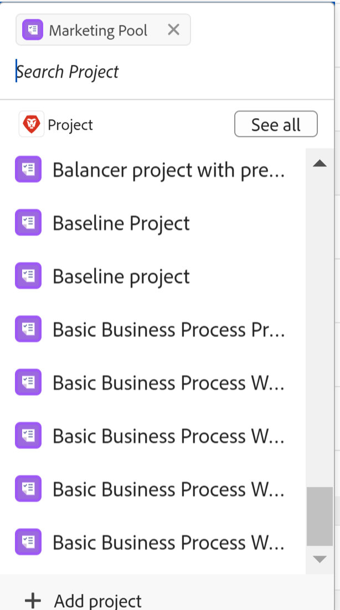

# Datensätze verbinden

Die hervorgehobenen Informationen auf dieser Seite beziehen sich auf Funktionen, die noch nicht allgemein verfügbar sind. Sie ist nur in der Vorschau -Umgebung für alle Kunden verfügbar. Nach den monatlichen Releases in der Produktion stehen dieselben Funktionen auch in der Produktionsumgebung für Kunden zur Verfügung, die schnelle Releases aktiviert haben. 

Informationen zu Schnellversionen finden Sie unter [Aktivieren oder Deaktivieren von Schnellversionen für Ihre Organisation](/help/quicksilver/administration-and-setup/set-up-workfront/configure-system-defaults/enable-fast-release-process.md). 

{{planning-important-intro}}

Sie können Adobe Workfront-Planungsdatensätze miteinander oder mit Objekten aus anderen Programmen verbinden. Sie können Informationen von einem Datensatz auf einem anderen Datensatz anzeigen, wenn Sie sie verbinden.

In diesem Artikel wird beschrieben, wie Sie Datensätze verbinden können. Weitere allgemeine Informationen zum Verbinden von Datensätzen finden Sie unter [Übersicht über verbundene Datensätze](/help/quicksilver/planning/records/connected-records-overview.md).

Sie müssen zunächst zwei Datensatztypen miteinander oder einen Datensatztyp mit einem Objekttyp aus einer anderen Anwendung verbinden. Dadurch werden verbundene Datensatzfelder erstellt. Sie können dann Datensätze miteinander oder mit anderen Objekten aus anderen Anwendungen in den verbundenen Datensatzfeldern verbinden.

Das Verbinden von Datensätzen ähnelt dem Verbinden von Datensätzen mit Objekten aus einer anderen Anwendung.

Informationen zum Verbinden von Datensatztypen miteinander oder mit Objekttypen aus anderen Anwendungen finden Sie unter [Verbinden von Datensatztypen](/help/quicksilver/planning/architecture/connect-record-types.md).

Ein Beispiel für das Verbinden von Datensatztypen finden Sie unter [Beispiel für das Verbinden von Datensatztypen und Datensätzen](/help/quicksilver/planning/architecture/example-connect-record-types-and-records.md).

Sie können Folgendes verbinden:

* Adobe Workfront-Planungsdatensätze miteinander
* Adobe Workfront-Planungsdatensätze mit Objekten aus anderen Programmen.

  Sie können Datensätze mit Objekten der unten aufgeführten Typen aus den folgenden Programmen verbinden:

   * Adobe Workfront

      * Projekte
      * Portfolios
      * Programme
      * Firmen
      * Gruppen

   * Adobe Experience Manager Assets

      * Bilddateien
      * Ordner

  <!--when you add more objects, fix the Access Requirements below which right now refer only to projects-->

## Zugriffsanforderungen

+++ Erweitern Sie , um die Zugriffsanforderungen anzuzeigen.

Sie müssen über folgenden Zugriff verfügen, um die Schritte in diesem Artikel ausführen zu können:

<table style="table-layout:auto"> 
<col> 
</col> 
<col> 
</col> 
<tbody> 
    <tr> 
<tr> 
<td> 
   
 Produkte
 </td> 
   <td> 
   <ul><li>
 Adobe Workfront
</li> 
   <li>
 Adobe Workfront-Planung
</li>
   <li>
Adobe Experience Manager Assets, wenn Sie AEM-Assets mit Planungsdatensätzen verbinden möchten

   
Sie müssen über eine Adobe Experience Manager Assets-Lizenz und eine Integration zwischen AEM Assets und Workfront verfügen.
    Weitere Informationen finden Sie unter <a href="/help/quicksilver/documents/adobe-workfront-for-experience-manager-assets-essentials/workfront-for-aem-asset-essentials.md">Adobe Workfront für Experience Manager Assets und Assets Essentials: Artikelindex</a>. 

   </li>  
   </ul></td> 
  </tr>   
<tr> 
   <td role="rowheader">
Adobe Workfront-Plan*
</td> 
   <td> 

Einer der folgenden Workfront-Pläne:
 
<ul><li>Auswählen</li> 
<li>Erstklassig</li> 
<li>Ultimativ</li></ul> 

Workfront Planning ist nicht für ältere Workfront-Pläne verfügbar
 
   </td> 
<tr> 
   <td role="rowheader">
Adobe Workfront-Planungspaket*
</td> 
   <td> 

Beliebig 
 

Weitere Informationen zu den einzelnen Workfront-Planungsplänen erhalten Sie von Ihrem Workfront Account Manager. 
 
   </td> 
 <tr> 
   <td role="rowheader">
Adobe Workfront-Plattform
</td> 
   <td> 

Um auf alle Funktionen von Workfront zugreifen zu können, muss die Workfront-Instanz Ihres Unternehmens in das einheitliche Adobe-Erlebnis integriert sein.
 

Weitere Informationen finden Sie unter <a href="/help/quicksilver/workfront-basics/navigate-workfront/workfront-navigation/adobe-unified-experience.md">Adobe Unified Experience for Workfront</a>. 
 
   </td> 
   </tr> 
  </tr> 
  <tr> 
   <td role="rowheader">
Adobe Workfront-Lizenz*
</td> 
   <td> Standard
   
Workfront Planning ist nicht für ältere Workfront-Lizenzen verfügbar
 
  </td> 
  </tr> 
  <tr> 
   <td role="rowheader">
Konfiguration der Zugriffsebene
</td> 
   <td> 
Es gibt keine Steuerelemente für Zugriffsebenen für Adobe Workfront Planning-Objekte
 
   
Zeigen Sie Berechtigungen für die Objekttypen an, die Sie von Workfront aus verknüpfen möchten, oder höhere Berechtigungen.
   
</td> 
  </tr> 
<tr> 
   <td role="rowheader">
Objektberechtigungen
</td> 
   <td>   
Tragen Sie Berechtigungen oder höhere Berechtigungen zu einem Arbeitsbereich ( Datensatztyp) , um Datensätze zu verbinden 
  
   
Zeigen Sie oder höhere Berechtigungen für einen Arbeitsbereich ( Datensatztyp) an um alle Verbindungen zu Objekten und Feldern aus anderen Anwendungen anzuzeigen, unabhängig von Ihrem Zugriff in der anderen Anwendung. 

   
Zeigen Sie Berechtigungen zum Anzeigen oder höhere Berechtigungen für die Objekte an, die Sie von Workfront oder Experience Manager Assets aus verknüpfen möchten. 

   
Systemadministratoren haben Berechtigungen für alle Arbeitsbereiche, einschließlich der nicht erstellten.
 </td> 
  </tr> 
<tr> 
   <td role="rowheader">
Layout-Vorlage
</td> 
   <td> 
In der Produktionsumgebung müssen alle Benutzer, einschließlich der Systemadministratoren, einer Layoutvorlage zugewiesen werden, die Planning enthält.

In der Vorschau-Umgebung ist für Standardbenutzer und Systemadministratoren „Planung“ standardmäßig aktiviert.
 </td> 
  </tr> 
</tbody> 
</table>

*Weitere Informationen zu Zugriffsanforderungen für Workfront finden Sie unter [Zugriffsanforderungen in der Dokumentation zu Workfront](/help/quicksilver/administration-and-setup/add-users/access-levels-and-object-permissions/access-level-requirements-in-documentation.md).

+++

## Überlegungen zum Verbinden von Datensätzen

* Um Datensätze mit anderen Datensätzen oder Objekten zu verbinden, benötigen Sie Folgendes:

   * Mindestens ein Arbeitsbereich, Datensatztyp und Datensatz.

     Weitere Informationen finden Sie in den folgenden Artikeln:

      * [Erstellen von Arbeitsbereichen](/help/quicksilver/planning/architecture/create-workspaces.md)
      * [Datensatztypen erstellen](/help/quicksilver/planning/architecture/create-record-types.md)
      * [Erstellen von Datensätzen](/help/quicksilver/planning/records/create-records.md)

   * Verbindungen zwischen Datensatztypen oder zwischen Datensatztypen und Objekten aus anderen Anwendungen. Weitere Informationen finden Sie unter [Verbinden von Datensatztypen](/help/quicksilver/planning/architecture/connect-record-types.md).

* Sie können ein oder mehrere Datensätze oder Objekte miteinander verbinden. Dies hängt vom Verbindungstyp ab, den Sie beim Verbinden der Datensatz- oder Objekttypen ausgewählt haben. Weitere Informationen finden Sie unter [Übersicht über Datensatztypen verbinden](/help/quicksilver/planning/architecture/connect-record-types-overview.md).

## Verbinden von Datensätzen aus Workfront Planning

Sie können Datensätze aus Workfront Planning in den folgenden Bereichen eines Planning-Datensatzes verbinden:

* Die verbundenen Datensatzfelder in der Tabellenansicht.
* Das Vorschaufeld oder die Seite des Datensatzes in den verbundenen Datensatzfeldern auf der Registerkarte Details .
* Das Vorschaufeld oder die Seite des Datensatzes auf der Registerkarte Verbindungen .
* Die Seite des Datensatzes auf einer Registerkarte Verbundene Datensatzseite.

### Verbinden von Workfront-Planungsdatensätzen über die Tabellenansicht oder den Detailbereich eines Datensatzes

{{step1-to-planning}}

1. Klicken Sie auf den Arbeitsbereich, dessen Datensätze Sie verbinden möchten.

   Der Arbeitsbereich wird geöffnet und die Datensatztypen werden als Karten angezeigt.
1. Klicken Sie auf die Karte eines Datensatztyps, um die Seite „Datensatztyp“ zu öffnen.
1. Klicken Sie auf den Namen einer Tabellenansicht, um sie zu öffnen.
1. (Optional) Fügen Sie dem ausgewählten Datensatztyp Datensätze hinzu, indem Sie der Tabelle eine neue Zeile hinzufügen. Weitere Informationen finden Sie unter [Erstellen von Datensätzen](/help/quicksilver/planning/records/create-records.md).
1. (Bedingt) Nachdem Sie den ausgewählten Datensatztyp mit einem anderen Datensatztyp verbunden haben, wechseln Sie zum verbundenen Feld eines Datensatzes und klicken Sie in das Feld oder klicken Sie auf **Verbinden**, um einen Datensatz hinzuzufügen.

   

1. Führen Sie einen der folgenden Schritte aus:

   * Klicken Sie in der Liste auf den Namen eines verbundenen Datensatzes, um ihn dem ausgewählten Datensatz hinzuzufügen. Der Datensatz wird automatisch hinzugefügt.
   * Beginnen Sie, den Namen eines Datensatzes einzugeben, und klicken Sie darauf, wenn er in der Liste angezeigt wird. Der Datensatz wird automatisch hinzugefügt.

   >[!TIP]
   >
   >Wenn beim Verbinden der Datensatztypen nur das Bild des Datensatzes zur Anzeige ausgewählt wurde, wird im verbundenen Feld nur die Miniaturansicht oder das Symbol des Datensatzes angezeigt. Weitere Informationen finden Sie unter [Verbinden von Datensatztypen](/help/quicksilver/planning/architecture/connect-record-types.md).
   >

1. (Bedingt) Wenn Sie beim Verbinden der Datensatztypen die Option Eins zu viele oder Eins zu eins für den Verbindungstyp ausgewählt haben und versuchen, einen Datensatz oder ein Objekt, das bereits an anderer Stelle verbunden ist, zu verbinden, erhalten Sie eine Warnung, dass beim erneuten Verbinden der Datensatz aus der ursprünglichen Verbindung entfernt wird. Klicken Sie auf **Verbinden**, um das Entfernen zuzulassen und den Datensatz zu verbinden, oder auf **Abbrechen**, um zum Feld zurückzukehren und einen anderen Datensatz auszuwählen.
1. (Optional) Wenn Sie ein Objekt zum Verbinden nicht finden können und Sie es hinzufügen möchten, klicken Sie auf **+ Hinzufügen**

   Oder

   Geben Sie einen Namen für das Objekt ein und klicken Sie dann auf **+ Hinzufügen** um es zu erstellen und hinzuzufügen.

   Weitere Informationen finden Sie im Abschnitt „Erstellen von Datensätzen, während Sie sie mit anderen Datensätzen verbinden“ im Artikel [Erstellen von Datensätzen](/help/quicksilver/planning/records/create-records.md).

   >[!TIP]
   >
   >    Sie können die Seite eines Datensatzes öffnen und andere Datensätze verbinden, indem Sie Folgendes in der Tabellenansicht tun:
   >1. Klicken Sie auf den Namen des Datensatzes in der Ansicht.
   >1. Suchen Sie das verknüpfte Datensatzfeld und doppelklicken Sie auf das Feld (wenn bereits Datensätze verbunden sind)
   >Oder
   >Klicken Sie auf **Datensätze verbinden** (wenn das Feld leer ist), um Datensätze aus dem verbundenen Datensatz oder Objekttyp hinzuzufügen.
   >
   >

1. (Optional) Klicken Sie auf **Alle anzeigen**, um alle Datensätze anzuzeigen.

1. (Bedingt) Wenn Sie im vorherigen Schritt auf **Alle anzeigen** geklickt haben, wird das Feld **Objekte verbinden** angezeigt.

   

1. Beginnen Sie, den Namen eines Datensatzes in das Suchfeld einzugeben, und wählen Sie ihn aus, wenn er in der Liste angezeigt wird

   Oder

   Wählen Sie den Namen eines oder mehrerer Datensätze im Feld aus und klicken Sie dann auf **Objekte verbinden**.

   Folgendes wird angefügt:

   * Die verknüpften Datensätze werden im Feld Verknüpfter Datensatz des Datensatzes angezeigt, den Sie in einem vorherigen Schritt ausgewählt haben.
   * Die verknüpften Felder werden mit den Informationen aus den verknüpften Datensätzen gefüllt, wenn Sie verknüpfte Suchfelder hinzugefügt haben, als Sie die Datensatztypen verbunden haben.

   Durch Aktualisieren der verknüpften Datensätze werden die verknüpften Felder für die Datensätze aktualisiert, aus denen Sie automatisch verknüpfen. Verknüpfte Felder können nicht manuell bearbeitet werden.

   >[!TIP]
   >
   >* Wir verwenden „verknüpfte Felder“ und „Lookup-Felder“ synonym.
   >
   >* Wenn Sie beim Verbinden der Datensatztypen die Verbindung mehrerer Datensätze herstellen, werden die Feldwerte der verschiedenen Objekte entweder durch Kommas getrennt angezeigt oder entsprechend dem Aggregator aggregiert, den Sie beim Verbinden der Datensatztypen ausgewählt haben.

1. (Optional) Schließen Sie die Seite für den Datensatztyp und wechseln Sie zum ausgewählten Arbeitsbereich.
1. Klicken Sie auf die Karte für den Datensatztyp, mit dem Sie verknüpft haben.

   Wenn Sie beispielsweise den Datensatz **Kampagne** mit dem Produktdatensatz verbunden haben, klicken Sie auf die Karte **Produkt**.

   Die Karte für den Datensatztyp sollte in der Tabellenansicht geöffnet werden. Andernfalls wählen Sie eine Tabellenansicht aus.

   Beachten Sie, dass **verknüpfte Datensatzfeld** Kampagne“ die Namen der Kampagnen anzeigt, die Sie auf der Seite „Produktdatensatztyp“ mit Produkten verknüpft haben. Durch die Aktualisierung der Kampagneninformationen wird automatisch das Feld Verknüpfter Kampagnendatensatz für den Produktdatensatztyp aktualisiert.

### Verbinden von Workfront-Planungsdatensätzen mit Workfront-Objekten über die Tabellenansicht oder den Detailbereich eines Datensatzes

<!--when we will have more applications to link to from Planning, change the title to something like: Connect Workfront Planning records to objects from other applications-->

Nachdem Sie eine Verbindung zwischen einem Datensatztyp und einem Workfront-Objekttyp hergestellt haben, können Sie einzelne Datensätze mit Objekten in Workfront verbinden. Die Workfront-Felder, mit denen Sie eine Verbindung hergestellt haben, werden automatisch mit den Datensätzen ausgefüllt, mit denen Sie die Objekte verknüpfen.

>[!NOTE]
>
>Sie können Workfront-Objekttypen nicht mit Workfront Planning-Datensatztypen aus Workfront verbinden.

{{step1-to-planning}}

1. Klicken Sie auf den Arbeitsbereich, dessen Datensätze Sie verbinden möchten.

   Der Arbeitsbereich wird geöffnet und die Datensatztypen werden als Karten angezeigt.
1. Klicken Sie auf die Karte eines Datensatztyps, um die Seite „Datensatztyp“ zu öffnen.
1. Wählen Sie **Dropdown** Menü **Ansicht** eine Tabellenansicht aus.

1. Klicken Sie **Neuer Datensatz**, um dem ausgewählten Datensatztyp einzelne Datensätze hinzuzufügen. Weitere Informationen finden Sie unter [Erstellen von Datensätzen](/help/quicksilver/planning/records/create-records.md).

1. (Bedingt) Nachdem Sie den ausgewählten Datensatztyp mit einem Workfront-Objekttyp verbunden haben, wechseln Sie zum verbundenen Feld eines Datensatzes und klicken Sie entweder auf das Feld oder auf **Verbinden**, um Workfront-Objekte hinzuzufügen.

   

1. Führen Sie einen der folgenden Schritte aus:

   * Klicken Sie auf ein Objekt in der Liste, um es dem ausgewählten Datensatz hinzuzufügen. Objekte werden alphabetisch aufgelistet. Das -Objekt wird automatisch hinzugefügt.
   * Beginnen Sie mit der Eingabe des Namens eines Objekts und klicken Sie darauf, wenn es in der Liste angezeigt wird. Das -Objekt wird automatisch hinzugefügt.

   >[!TIP]
   >
   >Sie können die Seite eines Datensatzes aus der Ansicht öffnen, auf das verknüpfte Datensatzfeld doppelklicken oder im Feld auf **Verbinden** klicken, um Objekte aus dem verknüpften Objekttyp hinzuzufügen.

1. (Optional) Wenn Sie ein Objekt zum Verbinden nicht finden können und Sie es hinzufügen möchten, klicken Sie auf **+ Hinzufügen**

   Oder

   Beginnen Sie mit der Eingabe eines Namens für das Objekt und klicken Sie dann auf **+ Hinzufügen**, um ein neues Projekt, Portfolio oder Programm zu erstellen und hinzuzufügen.

   Weitere Informationen finden Sie unter [Erstellen von Workfront-Objekten aus Workfront Planning](/help/quicksilver/planning/records/create-workfront-objects-from-workfront-planning.md)

1. (Optional) Klicken Sie auf **Alle anzeigen**, um alle Objekte anzuzeigen, für die Sie mindestens über die Berechtigung zum Anzeigen verfügen.

   Wenn Sie im vorherigen Schritt **Alle anzeigen** geklickt haben, wird das **„Objekte**&quot; angezeigt.

   

1. Beginnen Sie, den Namen eines Workfront-Objekts in das Suchfeld einzugeben, und wählen Sie es aus, wenn es in der Liste angezeigt wird

   Oder

   Wählen Sie den Namen eines oder mehrerer Objekte im Feld aus und klicken Sie dann auf **Objekte verbinden**.

   >[!IMPORTANT]
   >
   >* Sie können nur Workfront-Objekte hinzufügen, auf die Sie Zugriff haben.
   >
   >* Nachdem Sie Workfront-Objekte hinzugefügt haben, kann jeder Benutzer mit der Berechtigung Anzeigen oder höher die Workfront-Objekte und deren Feldinformationen anzeigen, unabhängig von seinen Berechtigungen oder Zugriffsrechten in Workfront.

   Folgendes wird angefügt:

   * Die ausgewählten Workfront-Objekte werden dem verknüpften Datensatzfeld hinzugefügt.
   * Wenn Sie sie hinzugefügt haben, als Sie den Datensatztyp mit Workfront verbunden haben, werden die verknüpften Felder (oder die Suchfelder) der Workfront-Objekte automatisch mit Informationen aus Workfront ausgefüllt.

   Weitere Informationen zum Verbinden von Datensatztypen mit Objekten aus einer anderen Anwendung finden Sie unter [Verbinden von Datensatztypen](/help/quicksilver/planning/architecture/connect-record-types.md).

1. (Optional) Klicken Sie auf den Namen eines Workfront-Objekts, das mit einem Workfront Planning-Datensatz verbunden ist, entweder im verknüpften Feld einer Tabellenansicht oder im verknüpften Feld auf der Datensatzseite.

   Dadurch wird das Workfront-Objekt in Workfront geöffnet, wenn Sie mindestens über Anzeigeberechtigungen für das Objekt verfügen.

   >[!TIP]
   >
   >* Wenn Sie beim Verbinden der Datensatztypen festlegen, dass mehrere Datensätze verbunden werden sollen, werden die Werte der Suchfelder entweder durch Kommas getrennt angezeigt oder entsprechend dem ausgewählten Aggregator aggregiert.
   >
   >* Für die verknüpften Workfront-Objekte in Workfront wird kein verknüpftes Datensatzfeld erstellt.

1. (Optional) Bewegen Sie in der Tabellenansicht des Datensatztyps den Mauszeiger über die Spaltenüberschrift des verknüpften Workfront-Objekts, klicken Sie auf das Dropdown-Menü und dann auf **Suchfelder bearbeiten**.

1. Hinzufügen von Workfront-Objektfeldern aus dem Bereich **Nicht ausgewählte Felder**

   Oder

   Entfernen Sie Workfront-Objektfelder aus dem Bereich **Ausgewählte Felder**.

   Dadurch werden verknüpfte Felder zu den Workfront-Planungsdatensätzen hinzugefügt oder daraus entfernt. Die mit den entfernten Feldern verknüpften Informationen verbleiben in Workfront.

### Verbinden von Workfront-Planungsdatensätzen mit Adobe Experience Manager-Objekten über die Tabellenansicht oder den Detailbereich eines Datensatzes

<!--when we will have more applications to link to from Planning, change the title to something like: Connect Workfront Planning records to objects from other applications-->

>[!IMPORTANT]
>
>Sie müssen über eine Adobe Experience Manager Assets-Lizenz verfügen und die Workfront-Instanz Ihres Unternehmens muss in die Adobe Business Platform oder die Adobe Admin Console integriert sein, damit Sie Workfront-Planungsdatensätze mit Adobe Experience Manager Assets verbinden können.
>
>Wenn Sie Fragen zum Onboarding in der Adobe Admin Console haben, lesen Sie die häufig gestellten Fragen zu [Adobe Unified Experience](/help/quicksilver/workfront-basics/navigate-workfront/workfront-navigation/unified-experience-faq.md).

Nachdem Sie eine Verbindung zwischen einem Datensatztyp und Adobe Experience Manager Assets hergestellt haben, können Sie einzelne Datensätze mit Experience Manager Assets verbinden. Die Asset-Felder, mit denen Sie sich über Experience Manager Assets verbunden haben, als Sie die Verbindung erstellt haben, werden automatisch mit dem Datensatztyp ausgefüllt, über den Sie eine Verknüpfung hergestellt haben.

>[!NOTE]
>
>Auf Planungsdatensätze und deren Felder kann über Experience Manager Assets zugegriffen werden, wenn Ihr Workfront-Administrator die Metadatenzuordnung durch die Integration zwischen Workfront und Adobe Experience Manager Assets konfiguriert. Weitere Informationen finden Sie unter &quot;[ der Asset-Metadatenzuordnung zwischen Adobe Workfront und Experience Manager Assets ](https://experienceleague.adobe.com/en/docs/experience-manager-cloud-service/content/assets/integrations/configure-asset-metadata-mapping).

Verbinden von Datensätzen mit Experience Manager-Assets:

{{step1-to-planning}}

1. Klicken Sie auf den Arbeitsbereich, dessen Datensätze Sie verbinden möchten.

   Der Arbeitsbereich wird geöffnet und die Datensatztypen werden angezeigt.
1. Klicken Sie auf die Karte eines Datensatztyps, um die Seite „Datensatztyp“ zu öffnen.
1. Wählen Sie **Tabellenansicht** aus dem Dropdown **Menü „Ansicht** in der rechten oberen Ecke der Seite „Datensatztyp“ aus.

1. (Optional) Klicken Sie auf **Neuer Datensatz**, um dem ausgewählten Datensatztyp neue Datensätze hinzuzufügen. Weitere Informationen finden Sie unter [Erstellen von Datensätzen](/help/quicksilver/planning/records/create-records.md).
1. (Bedingt) Nachdem Sie den ausgewählten Datensatztyp mit Experience Manager Assets verbunden haben, wechseln Sie zum verbundenen Feld eines Datensatzes und klicken Sie entweder auf das Feld oder klicken Sie auf **Verbinden**, um dem Datensatz Experience Manager-Assets hinzuzufügen, und klicken Sie dann auf das Symbol **+**.

   >[!TIP]
   >
   >  Sie können hinzufügen, indem Sie auf der Datensatzseite im Feld Verknüpftes Objekt auf das Symbol **+** klicken, um Assets mit dem Datensatz zu verbinden.

   Das **Assets auswählen** wird angezeigt. <!--we might change this to Connect assets-->

   

1. Klicken Sie, um einige der folgenden Asset-Typen auszuwählen:

   * Bilder
   * Ordner

   Sie können mehrere Assets auswählen.

   >[!IMPORTANT]
   >
   > Sie können nur Assets verbinden, auf die Sie in Experience Manager Zugriff haben. Sobald die Verbindung hergestellt ist, können alle Workfront Planning-Benutzer die Assets in Workfront Planning anzeigen, unabhängig von ihrem Zugriff in Experience Manager Assets.

1. Klicken Sie **Auswählen**. <!-- we might change this to Connect-->

   Folgendes wird angefügt:

   * Die ausgewählten Experience Manager-Assets werden dem Feld Verknüpfter Datensatz hinzugefügt.
   * Die verknüpften Felder (oder Lookup-Felder) werden mit Informationen aus den Experience Manager Connected Assets gefüllt.

     Alle vorhandenen Informationen aus den Feldern der Experience Manager-Assets werden automatisch in den verknüpften Feldern oder den Suchfeldern angezeigt.

     >[!TIP]
     >
     >* Wenn Sie beim Verbinden der Datensatztypen auswählen, dass mehrere Datensätze verbunden werden sollen, werden die Werte der verschiedenen Objekte entweder durch Kommas getrennt oder entsprechend dem gewählten Aggregator aggregiert angezeigt.
     >
     >* Für die verknüpften Experience Manager-Assets in der Experience Manager Assets-Anwendung wird kein verknüpftes Datensatzfeld mit den verknüpften Workfront Planning-Datensätzen erstellt.

1. (Optional) Wechseln Sie zu dem Datensatztyp, von dem aus Sie eine Verknüpfung mit Experience Manager Assets hergestellt haben, und klicken Sie auf den Namen eines Assets im Feld Verknüpfter Datensatz . Die Experience Manager-Details des Assets werden in einem Popup-Fenster angezeigt.

   

   Die folgenden Felder werden für eine Bilddatei angezeigt:

   * Eine Miniaturansicht des Bildes
   * Der Name der Bilddatei
   * Dimensionen
   * Größe
   * Beschreibung
   * Der Dateipfad in Experience Manager
   * Der Asset-Typ
   * Erstellungsdatum
   * Änderungsdatum

1. (Optional) Um die Datensatzseite für Experience Manager Assets in Experience Manager zu öffnen, klicken Sie auf die Datensatztypseite des Datensatzes, von dem aus Sie eine Verknüpfung herstellen, klicken Sie auf den Namen eines Assets im verknüpften Datensatzfeld, um das Popup-Fenster zu öffnen. Klicken Sie dann auf das Symbol **In AEM öffnen** , um das Asset zu öffnen.

   Dadurch wird das Experience Manager-Asset in Adobe Experience Manager Assets geöffnet.

1. (Optional) Bewegen Sie in der Tabellenansicht des Datensatztyps den Mauszeiger über die Spaltenüberschrift des verknüpften Experience Manager-Assets, klicken Sie auf das Dropdown-Menü und dann auf &quot;**bearbeiten**.

1. Hinzufügen von Experience Manager Assets-Objektfeldern aus dem Bereich **Nicht ausgewählte Felder**

   Oder

   Entfernen Sie Workfront-Objektfelder aus dem Bereich **Ausgewählte Felder**.

   Dadurch werden verknüpfte Felder aus den Datensätzen hinzugefügt oder entfernt. Die mit den entfernten Feldern verknüpften Informationen verbleiben in Adobe Experience Assets.

### Verbinden von Workfront Planning-Datensätzen mit anderen Datensätzen oder Objekten über die Registerkarte Verbindungen der Datensatzseite

1. Navigieren Sie zu einer beliebigen Ansicht eines Datensatztyps, der mit anderen Planungs-Datensatztypen oder Objekttypen aus anderen Anwendungen verbunden ist.
1. Führen Sie die in den vorherigen Unterabschnitten beschriebenen Schritte aus, um einen Datensatz in der Ansicht zu finden, die Sie mit anderen Datensätzen oder Objekten verbinden möchten.
1. Klicken Sie auf den Namen eines Datensatzes.

   Die Vorschauseite wird geöffnet.
1. (Optional) Klicken Sie auf das Symbol **In neuer Registerkarte öffnen** (, um die Seite des Datensatzes zu öffnen.
1. Klicken Sie auf **Registerkarte** Verbindungen“ in der Vorschau oder Seite des Datensatzes.

   

   Alle Datensatz- oder Objekttypen, die mit dem ausgewählten Datensatztyp verknüpft sind, werden als Abschnitte angezeigt. Verbundene Datensätze oder Objekte werden unter ihren Datensatz- oder Objekttyp-Namen auf Karten angezeigt.

   >[!TIP]
   >
   >    Standardmäßig werden nur verbundene Datensätze angezeigt, bei denen einzelne Datensätze verbunden sind.

1. (Optional) Klicken Sie auf **Alle Verbindungen anzeigen** um alle verbundenen Datensatztypen anzuzeigen, einschließlich der Typen ohne verbundene Datensätze.

1. (Optional) Klicken Sie auf den nach unten zeigenden Pfeil links neben einem Abschnitt, um ihn zu reduzieren.

1. (Bedingt) Klicken Sie auf **Verbinden**, um weitere Datensätze oder Objekte desselben Typs hinzuzufügen.
1. (Optional) Wenn Sie einen Datensatz oder ein Objekt zum Verbinden nicht finden können und Sie ihn hinzufügen möchten, klicken Sie auf **+ Hinzufügen**

   Oder

   Beginnen Sie mit der Eingabe eines Namens für das Objekt und klicken Sie dann auf **+ Hinzufügen**, um es zu erstellen und zum Datensatz hinzuzufügen.

   Weitere Informationen finden Sie im Abschnitt „Erstellen von Datensätzen, während Sie sie mit anderen Datensätzen verbinden“ im Artikel [Erstellen von Datensätzen](/help/quicksilver/planning/records/create-records.md).
1. Führen Sie die in den vorherigen Abschnitten beschriebenen Schritte aus, um Datensätze aus Workfront Planning oder Objekte aus Workfront oder Experience Manager Assets zu verbinden.
Die Datensätze und Objekte werden sofort hinzugefügt.
1. (Optional) Bewegen Sie den Mauszeiger über die verbundene Karte eines Datensatzes oder Objekts und klicken Sie dann auf das Symbol **Datensatz trennen** , um ihn vom ausgewählten Datensatz zu trennen.

   

   Der Datensatz wird sofort von allen Bereichen von Workfront Planning oder von anderen Anwendungen getrennt, in denen er möglicherweise als verbunden angezeigt wird. Alle Werte der Suchfelder werden ebenfalls entfernt.

### Verbinden von Datensätzen über die Seite „Verbundene Datensätze eines Datensatzes

1. Navigieren Sie zu einer beliebigen Ansicht eines Datensatztyps, der mit anderen Planungs-Datensatztypen oder Objekttypen aus anderen Anwendungen verbunden ist.
1. Führen Sie die in den vorherigen Unterabschnitten beschriebenen Schritte aus, um einen Datensatz in der Ansicht zu finden, die Sie mit anderen Datensätzen oder Objekten verbinden möchten.
1. Klicken Sie auf den Namen eines Datensatzes.

   Die Vorschauseite wird geöffnet.
1. Klicken Sie auf **Symbol** In neuer Registerkarte öffnen, um die Seite des Datensatzes zu öffnen.
1. Klicken Sie auf  vorhandene Registerkarte „Verbundene &quot; auf der Seite des Datensatzes. Sie müssen zunächst eine Seite Verbundene Datensätze“ . Weitere Informationen finden Sie unter [Seitenlayout für Einträge verwalten](/help/quicksilver/planning/records/manage-the-record-page.md).

   In der Tabellenansicht wird eine verbundene Datensatztypseite angezeigt.

   In der Tabelle werden alle verbundenen Datensätze eines Typs angezeigt.
1. Klicken Sie auf **Verbinden**, um Datensätze hinzuzufügen oder zu entfernen.

   
1. (Optional) Wenn Sie einen verbundenen Datensatz nicht finden können, klicken Sie auf **+ Hinzufügen** um ihn zu erstellen und zu verbinden.

## Verbinden von Datensätzen aus Workfront-Objekten

Sie müssen über Folgendes verfügen, um Workfront-Planungsdatensätze mit Workfront-Objekten zu verbinden:

* Verbindungen zwischen Datensatztypen und Workfront-Objekttypen, die in Workfront Planning hergestellt werden.
* Ihr Workfront- oder Gruppenadministrator muss Folgendes zu einem Workfront-Objekttyp hinzufügen:

   * Der Abschnitt „Planung“ enthält Informationen zu den Workfront-Projekten, -Portfolios und -Programmen in Ihrer Layout-Vorlage.

   * Das benutzerdefinierte Feld Planning Connections zu einem benutzerdefinierten Formular für eines der folgenden Objekte:

      * Projekt
      * Portfolio
      * Programm
      * Gruppe
      * Firma

  Weitere Informationen finden Sie unter [Verwalten von Datensatzverbindungen aus Workfront-Objekten](/help/quicksilver/planning/records/manage-records-in-planning-section.md).
