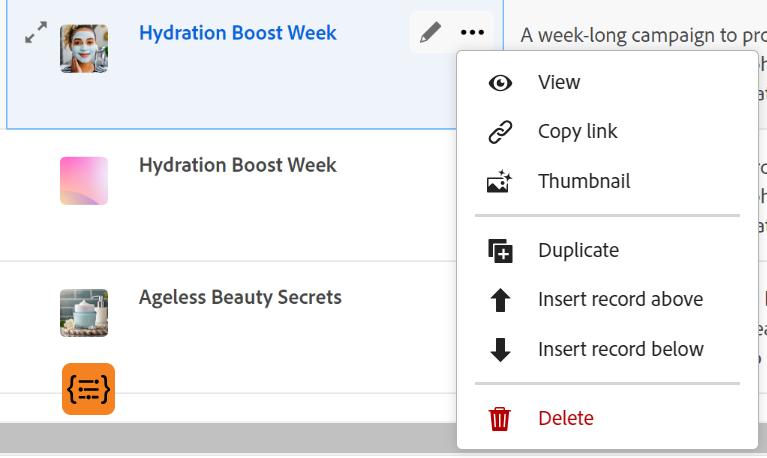

# Datensätze duplizieren

{{planning-important-intro}}

In der Adobe Workfront-Planung ist ein Datensatz eine Instanz eines Datensatztyps.

Sie können einen vorhandenen Datensatz in der Tabellenansicht duplizieren. Der Seite vom Typ Datensatz wird eine identische Kopie des vorhandenen Datensatzes hinzugefügt.

## Zugriffsanforderungen

+++ Erweitern Sie , um die Zugriffsanforderungen für die Workfront-Planung anzuzeigen.

Für den Zugriff auf die Workfront-Planung benötigen Sie Folgendes:

<table style="table-layout:auto"> 
<col> 
</col> 
<col> 
</col> 
<tbody> 
    <tr> 
<tr> 
<td> 
   
 Produkte
 </td> 
   <td> 
   <ul><li>
 Adobe Workfront
</li> 
   <li>
 Adobe Workfront-Planung
</li></ul></td> 
  </tr>   
<tr> 
   <td role="rowheader">
Adobe Workfront-Plan*
</td> 
   <td> 

Die folgenden Workfront-Pläne:
 
<ul><li>Auswählen</li> 
<li>Erstklassig</li> 
<li>Ultimativ</li></ul> 

Die Workfront-Planung ist für veraltete Workfront-Pläne nicht verfügbar
 
   </td> 
<tr> 
   <td role="rowheader">
Adobe Workfront-Planungsplan*
</td> 
   <td> 

Alle 
 

Weitere Informationen zu den einzelnen Workfront-Planungsplänen finden Sie unter <a href="https://business.adobe.com/products/workfront/pricing.html">Preise und Verpackung für Adobe Workfront</a>. 
 
   </td> 
 <tr> 
   <td role="rowheader">
Adobe Workfront-Plattform
</td> 
   <td> 

Die Workfront-Instanz Ihres Unternehmens muss in das Adobe Unified Experience integriert sein, damit Sie auf alle Funktionen der Workfront-Planung zugreifen können.
 

Weitere Informationen finden Sie unter <a href="/help/quicksilver/workfront-basics/navigate-workfront/workfront-navigation/adobe-unified-experience.md">Adobe Unified Experience for Workfront</a>. 
 
   </td> 
   </tr> 
  </tr> 
  <tr> 
   <td role="rowheader">
Adobe Workfront-Lizenz*
</td> 
   <td>
 Standard

   
Für ältere Workfront-Lizenzen ist die Workfront-Planung nicht verfügbar.
 
  </td> 
  </tr> 
  <tr> 
   <td role="rowheader">
Konfiguration der Zugriffsebene
</td> 
   <td> 
Für die Adobe Workfront-Planung gibt es keine Zugriffssteuerungselemente
   
</td> 
  </tr> 
<tr> 
   <td role="rowheader">
Objektberechtigungen
</td> 
   <td>   
Contribute oder höhere Berechtigungen für einen Arbeitsbereich</a> 
  
   
Systemadministratoren haben Berechtigungen für alle Arbeitsbereiche, einschließlich derjenigen, die sie nicht erstellt haben
 </td> 
  </tr> 
<tr> 
   <td role="rowheader">
Layout-Vorlage
</td> 
   <td> 
Allen Benutzern, einschließlich Workfront-Administratoren, muss eine Layoutvorlage zugewiesen werden, die den Planungsbereich im Hauptmenü enthält. 
 </td> 
  </tr> 
</tbody> 
</table>

*Weitere Informationen zu den Zugriffsanforderungen für Workfront finden Sie unter [Zugriffsanforderungen in der Workfront-Dokumentation](/help/quicksilver/administration-and-setup/add-users/access-levels-and-object-permissions/access-level-requirements-in-documentation.md).

+++

<!--
OLD:

<table style="table-layout:auto">
 <col>
 </col>
 <col>
 </col>
 <tbody>
    <tr>
<tr>
<td>
   
 Product
 </td>
   <td>
   
 Adobe Workfront
 </td>
  </tr>  
 <td role="rowheader">
Adobe Workfront agreement
</td>
   <td>

Your organization must be enrolled in the early access stage for Workfront Planning 

   </td>
  </tr>
  <tr>
   <td role="rowheader">
Adobe Workfront plan
</td>
   <td>

Any

   </td>
  </tr>
  <tr>
   <td role="rowheader">
Adobe Workfront license*
</td>
   <td>
   
New: Standard

   
Current: Plan
  
  </td>
  </tr>
  
  <tr>
   <td role="rowheader">
Access level configurations
</td>
   <td> 
There are no access controls for Adobe Workfront Planning 
  
</td>
  </tr>
<tr>
   <td role="rowheader">
Permissions
</td>
   <td> 
Contribute or higher permissions to a workspace</a> 
  
   
System Administrators have permissions to all workspaces, including the ones they did not create

</td>
  </tr>
<tr>
   <td role="rowheader">
Layout template
</td>
   <td> 
Your Workfront or group administrator must add the Planning area in your layout template. For information, see <a href="/help/quicksilver/planning/access/access-overview.md">Access overview</a>. 
  
</td>
  </tr>

 </tbody>
</table>

*For more information, see [Access requirements for Workfront documentation](/help/quicksilver/administration-and-setup/add-users/access-levels-and-object-permissions/access-level-requirements-in-documentation.md). 

-->

## Datensatz duplizieren <!--in a record type table (I don't think you can create them elsewhere right now)-->

Sie können Datensätze in der Tabellenansicht einer Seite vom Typ Datensatz erstellen, indem Sie eine existierende Seite duplizieren. Ein Datensatz, der mit dem vorhandenen identisch ist, wird erstellt und unter dem ursprünglichen Datensatz hinzugefügt.

{{step1-to-planning}}

1. Klicken Sie auf den Arbeitsbereich, in den Sie Datensätze hinzufügen möchten.

   Der Arbeitsbereich wird geöffnet und die Datensatztypen werden als Karten angezeigt.

1. Klicken Sie auf eine Karte vom Typ Datensatz. Informationen zum Erstellen eines Datensatztyps finden Sie unter [Erstellen von Datensatztypen](/help/quicksilver/planning/architecture/create-record-types.md).

   Die Seite mit dem Datensatztyp wird in der Ansicht geöffnet, auf die Sie zuletzt zugegriffen haben. Standardmäßig wird eine Seite vom Typ Datensatz in der Tabellenansicht geöffnet.
Alle Datensätze des ausgewählten Typs werden in der Ansicht angezeigt.

1. (Bedingt) Wählen Sie eine Tabellenansicht aus.

1. Führen Sie einen der folgenden Schritte aus:

   * Bewegen Sie den Mauszeiger über den Namen eines Datensatzes und klicken Sie auf das Menü **Mehr** , das dem Datensatznamen entspricht, und klicken Sie dann auf das Symbol **Duplizieren**  .

     

   * Wählen Sie einen Datensatz aus und klicken Sie dann in der Symbolleiste am unteren Rand der Seite auf das Symbol **Duplizieren**  .

     

   Unter dem ursprünglichen Datensatz wird ein identischer Datensatz mit identischem Namen erstellt. Alle Felder des neuen Datensatzes werden mit denselben Informationen wie im ursprünglichen Datensatz ausgefüllt.

1. (Optional) Beginnen Sie mit der Aktualisierung der Informationen zum neuen Datensatz in den in der Tabellenansicht verfügbaren Feldern oder klicken Sie auf den Datensatz und aktualisieren Sie die Informationen in der Datensatzvorschau oder -seite.

   >[!NOTE]
   >
   >  * Es gibt keine Pflichtfelder für Datensätze. Es wird jedoch empfohlen, Informationen für das primäre Feld eines Datensatzes hinzuzufügen, da es beim Verknüpfen von Datensätzen hilfreich ist, Datensätze zu identifizieren. Weitere Informationen zu Primärfeldern finden Sie unter [Tabellenansicht verwalten](/help/quicksilver/planning/views/manage-the-table-view.md) und [Übersicht über Primäre Felder](/help/quicksilver/planning/fields/primary-field-overview.md).
   >
   >  * Felder, die auf andere Datensatztypen oder berechnete Felder verweisen, sind schreibgeschützte Felder.

   Weitere Informationen zum Bearbeiten von Datensätzen finden Sie unter [Datensätze bearbeiten](/help/quicksilver/planning/records/edit-records.md).

1. (Optional) Verwenden Sie die folgenden Tastaturbefehle, um das Hinzufügen neuer Datensätze oder ihrer Informationen rückgängig zu machen oder wiederherzustellen, wenn Sie sie in der Tabellenansicht hinzufügen:

   * STRG + Z ( ⌘ + Z für Mac) zum Rückgängigmachen einer Änderung
   * STRG + Umschalt + Z ( ⌘ + Umschalt + Z für Mac), um eine Änderung erneut vorzunehmen.