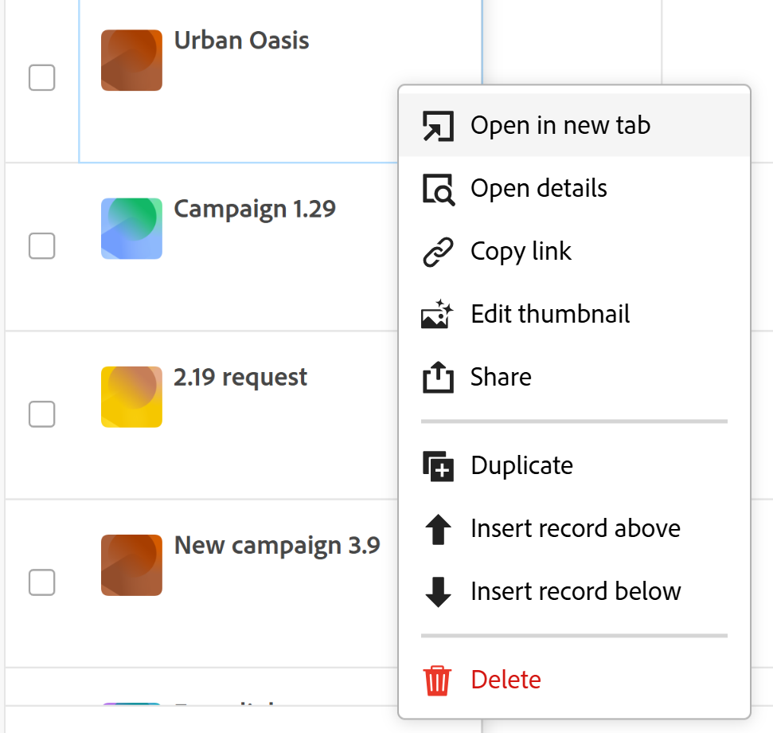
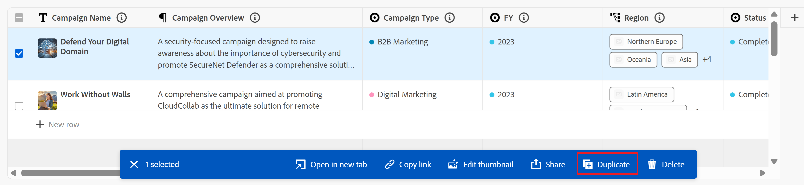

# Duplizieren von Einträgen

Die hervorgehobenen Informationen auf dieser Seite beziehen sich auf Funktionen, die noch nicht allgemein verfügbar sind. Sie ist nur in der Vorschau -Umgebung für alle Kunden verfügbar. Nach den monatlichen Releases in der Produktion stehen dieselben Funktionen auch in der Produktionsumgebung für Kunden zur Verfügung, die schnelle Releases aktiviert haben. 

Informationen zu Schnellversionen finden Sie unter [Aktivieren oder Deaktivieren von Schnellversionen für Ihre Organisation](/help/quicksilver/administration-and-setup/set-up-workfront/configure-system-defaults/enable-fast-release-process.md). 

{{planning-important-intro}}

In Adobe Workfront Planning ist ein Datensatz eine Instanz eines Datensatztyps.

Sie können einen vorhandenen Datensatz in der Tabellenansicht duplizieren. Der Seite „Datensatztyp“ wird eine identische Kopie des vorhandenen Datensatzes hinzugefügt.

## Zugriffsanforderungen

+++ Erweitern Sie , um die Zugriffsanforderungen für die Funktion in diesem Artikel anzuzeigen. 

<table style="table-layout:auto"> 
<col> 
</col> 
<col> 
</col> 
<tbody> 
    <tr> 
<tr> 
</tr>   
<tr> 
   <td role="rowheader">
Adobe Workfront-Paket
</td> 
   <td> 

Beliebiges Workfront und beliebiges Planungspaket
 
Beliebiger Workflow und beliebiges Planungspaket

Weitere Informationen zu den einzelnen Workfront-Planungspaketen erhalten Sie von Ihrem Workfront-Kundenbetreuer. 
 
   </td> 
  <tr> 
   <td role="rowheader">
Adobe Workfront-Lizenz
</td> 
   <td>
Standard

   </td> 
  </tr> 
  <tr> 
   <td role="rowheader">
Objektberechtigungen
</td> 
   <td>   
Tragen Sie Berechtigungen oder höhere Berechtigungen zu einem Arbeitsbereich, einem Datensatztyp und Verwalten von Berechtigungen für einen Datensatz)  

   
Systemadministratoren haben Berechtigungen für alle Arbeitsbereiche, einschließlich der nicht erstellten
 </td> 
  </tr>   
</tbody> 
</table>

Weitere Informationen zu Zugriffsanforderungen für Workfront finden Sie unter [Zugriffsanforderungen in der Dokumentation zu Workfront](/help/quicksilver/administration-and-setup/add-users/access-levels-and-object-permissions/access-level-requirements-in-documentation.md).

+++   

<!--
Old:

<table style="table-layout:auto"> 
<col> 
</col> 
<col> 
</col> 
<tbody> 
    <tr> 
<tr> 
<td> 
   
 Products
 </td> 
   <td> 
   <ul><li>
 Adobe Workfront
</li> 
   <li>
 Adobe Workfront Planning
</li></ul></td> 
  </tr>   
<tr> 
   <td role="rowheader">
Adobe Workfront plan*
</td> 
   <td> 

Any of the following Workfront plans:
 
<ul><li>Select</li> 
<li>Prime</li> 
<li>Ultimate</li></ul> 

Workfront Planning is not available for legacy Workfront plans
 
   </td> 
<tr> 
   <td role="rowheader">
Adobe Workfront Planning package*
</td> 
   <td> 

Any 
 

For more information about what is included in each Workfront Planning plan, contact your Workfront account manager. 
 
   </td> 
 <tr> 
   <td role="rowheader">
Adobe Workfront platform
</td> 
   <td> 

Your organization's instance of Workfront must be onboarded to the Adobe Unified Experience to be able to access Workfront Planning.
 

For more information, see <a href="/help/quicksilver/workfront-basics/navigate-workfront/workfront-navigation/adobe-unified-experience.md">Adobe Unified Experience for Workfront</a>. 
 
   </td> 
   </tr> 
  </tr> 
  <tr> 
   <td role="rowheader">
Adobe Workfront license*
</td> 
   <td>
 Standard

   
Workfront Planning is not available for legacy Workfront licenses
 
  </td> 
  </tr> 
  <tr> 
   <td role="rowheader">
Access level configuration
</td> 
   <td> 
There are no access level controls for Adobe Workfront Planning
   
</td> 
  </tr> 
<tr> 
   <td role="rowheader">
Object permissions
</td> 
   <td>   
Contribute or higher permissions to a workspace and record type</a> 
  
   
System Administrators have permissions to all workspaces, including the ones they did not create
 </td> 
  </tr> 
</tbody> 
</table>
-->

## Duplizieren einer <!--in a record type table (I don't think you can create them elsewhere right now)-->

Sie können Datensätze in der Tabellenansicht einer Datensatztypseite durch Duplizieren einer vorhandenen Seite erstellen. Ein mit dem vorhandenen identischer Datensatz wird erstellt und unter dem ursprünglichen Datensatz hinzugefügt.

{{step1-to-planning}}

1. Klicken Sie auf den Arbeitsbereich, in dem Sie Datensätze hinzufügen möchten.

   Der Arbeitsbereich wird geöffnet und die Datensatztypen werden als Karten angezeigt.

1. Klicken Sie auf eine Karte vom Typ Datensatz. Weitere Informationen zum Erstellen eines Datensatztyps finden Sie unter [Erstellen von Datensatztypen](/help/quicksilver/planning/architecture/create-record-types.md).

   Die Seite Datensatztyp wird in der Ansicht geöffnet, auf die Sie zuletzt zugegriffen haben. Standardmäßig wird eine Seite mit dem Datensatztyp in der Tabellenansicht geöffnet.
Alle Datensätze des ausgewählten Typs werden in der Ansicht angezeigt.

1. (Bedingt) Tabellenansicht auswählen.

1. Führen Sie einen der folgenden Schritte aus:

   * Bewegen Sie den Mauszeiger über den Namen eines Datensatzes und klicken Sie dann auf das Menü **Mehr** inline mit dem Datensatznamen. Klicken Sie dann auf das **Duplizieren**-Symbol  .

     

   * Wählen Sie einen Datensatz aus und klicken Sie dann auf **Symbol &quot;** Duplizieren in der Symbolleiste am unteren Seitenrand.

     

   Unterhalb des ursprünglichen Datensatzes wird ein identischer Datensatz mit identischem Namen erstellt. Alle Felder des neuen Datensatzes werden mit denselben Informationen wie im ursprünglichen Datensatz ausgefüllt.

1. (Optional) Starten Sie die Aktualisierung der Informationen zum neuen Datensatz in den Feldern, die in der Tabellenansicht verfügbar sind, oder klicken Sie auf den Datensatz und aktualisieren Sie die Informationen in der Datensatzvorschau oder -seite.

   >[!NOTE]
   >
   >  * Es gibt keine Pflichtfelder für Datensätze. Es wird jedoch empfohlen, Informationen für das Primärfeld eines Datensatzes hinzuzufügen, da es hilfreich ist, Datensätze zu identifizieren, wenn Datensätze miteinander verknüpft werden. Weitere Informationen zu Primärfeldern finden Sie unter [Verwalten der Tabellenansicht](/help/quicksilver/planning/views/manage-the-table-view.md) und [Übersicht über Primäre Felder](/help/quicksilver/planning/fields/primary-field-overview.md).
   >
   >  * Felder, die auf andere Datensatztypen oder berechnete Felder verweisen, sind schreibgeschützt.

   Weitere Informationen zum Bearbeiten von Datensätzen finden Sie unter [Datensätze bearbeiten](/help/quicksilver/planning/records/edit-records.md).

1. (Optional) Verwenden Sie die folgenden Tastaturbefehle, um das Hinzufügen neuer Datensätze oder deren Informationen rückgängig zu machen oder wiederherzustellen, wenn Sie sie in der Tabellenansicht hinzufügen:

   * STRG + Z (⌘ + Z für Mac), um eine Änderung rückgängig zu machen
   * Strg+Umsch+Z (⌘+Umschalt+Z für Mac), um eine Änderung wiederherzustellen.
