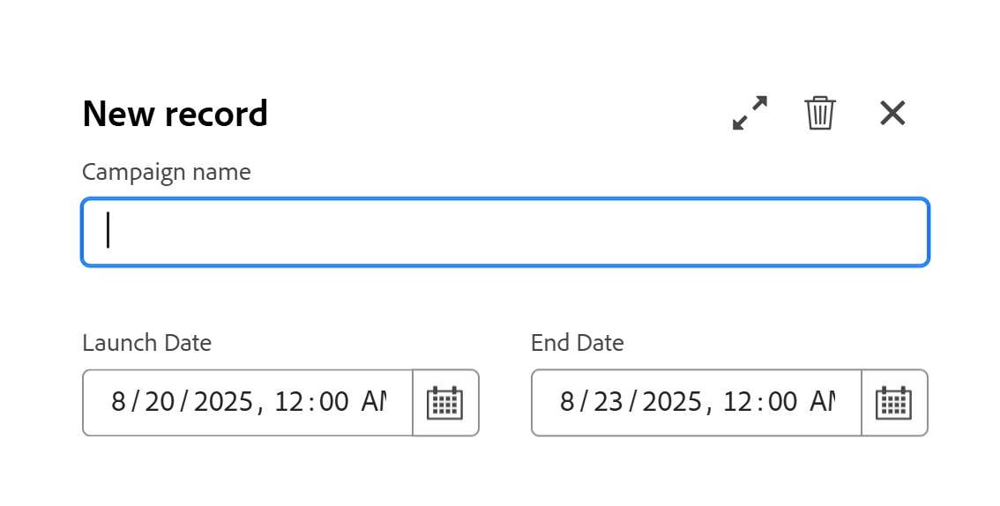

# Erstellen von Datensätzen

<!--
The highlighted information on this page refers to functionality not yet generally available. It is available only in the Preview environment for all customers. After the monthly releases to Production, the same features are also available in the Production environment for customers who enabled fast releases.    

For information about fast releases, see [Enable or disable fast releases for your organization](/help/quicksilver/administration-and-setup/set-up-workfront/configure-system-defaults/enable-fast-release-process.md). 

-->

{{planning-important-intro}}

In Adobe Workfront Planning ist ein Datensatz eine Instanz eines Datensatztyps.

Sie können Datensätze wie folgt erstellen:

* [Verwenden Sie die Schaltfläche Neuer Datensatz oder Datensatz anfragen in einer beliebigen Datensatztypansicht.](#create-records-using-the-new-record-or-request-record-button-from-any-record-type-view)
* [Fügen Sie sie inline über die Tabellenansicht vom Typ Datensatz hinzu](#create-records-by-adding-them-inline-from-the-record-type-table-view)
* [Fügen Sie sie in der Zeitleisten-Ansicht des Datensatztyps hinzu](#create-records-by-adding-them-in-the-record-type-timeline-view)
* [Fügen Sie sie in der Kalenderansicht des Datensatztyps hinzu](#create-records-by-adding-them-in-the-record-type-calendar-view)
* [Kopieren und Einfügen einer Liste von Datensätzen aus einer externen Liste](#create-records-by-copying-and-pasting-them-from-an-external-list)
* [Duplizieren von Datensätzen aus einer Tabellenansicht](#create-records-by-duplicating-them)
* [Aus anderen Datensätzen verbinden](#create-records-as-you-connect-them)
* [Senden eines Anfrageformulars an einen Datensatztyp](#create-records-by-submitting-a-request-form-to-a-record-type)
* [Informationen aus einer CSV- oder Excel-Datei importieren](#create-records-by-importing-records-from-a-csv-or-excel-file)
* [Automatisierungen verwenden](#create-records-by-using-automations)

Informationen zum Verwalten von Datensätzen in der Tabellen- oder Zeitleisten -Ansicht finden Sie in den folgenden Artikeln:

* [Verwalten der Tabellenansicht](/help/quicksilver/planning/views/manage-the-table-view.md)
* [Zeitleisten-Ansicht verwalten](/help/quicksilver/planning/views/manage-the-timeline-view.md)

## Zugriffsanforderungen

+++ Erweitern Sie , um die Zugriffsanforderungen für die Funktion in diesem Artikel anzuzeigen. 

<table style="table-layout:auto"> 
<col> 
</col> 
<col> 
</col> 
<tbody> 
    <tr> 
<tr> 
</tr>   
<tr> 
   <td role="rowheader">
Adobe Workfront-Paket
</td> 
   <td> 

Beliebiges Workfront und beliebiges Planungspaket
 
Beliebiger Workflow und beliebiges Planungspaket

Weitere Informationen zu den einzelnen Workfront-Planungspaketen erhalten Sie von Ihrem Workfront-Kundenbetreuer. 
 
   </td> 
  <tr> 
   <td role="rowheader">
Adobe Workfront-Lizenz
</td> 
   <td>
Standard

   </td> 
  </tr> 
  <tr> 
   <td role="rowheader">
Objektberechtigungen
</td> 
   <td> 
Tragen Sie Berechtigungen oder höhere Berechtigungen zum Arbeitsbereich und Datensatztyp bei, dem Sie Datensätze hinzufügen möchten. 

   
Zeigen Sie Berechtigungen für den Arbeitsbereich und den Datensatztyp an oder erhöhen Sie diese, um Datensätze mithilfe der Schaltfläche Datensatz anfragen auf der Datensatzseite zu erstellen

   
Systemadministratoren haben Berechtigungen für alle Arbeitsbereiche, einschließlich der nicht erstellten

   
Verwalten Sie Berechtigungen für Workfront-Objekte (Portfolios), um untergeordnete Objekte (Projekte) hinzuzufügen.

   </td> 
  </tr>  
</tbody> 
</table>

Weitere Informationen zu Zugriffsanforderungen für Workfront finden Sie unter [Zugriffsanforderungen in der Dokumentation zu Workfront](/help/quicksilver/administration-and-setup/add-users/access-levels-and-object-permissions/access-level-requirements-in-documentation.md).

+++   

<!--Old:
<table style="table-layout:auto"> 
<col> 
</col> 
<col> 
</col> 
<tbody> 
    <tr> 
<tr> 
<td> 
   
 Products
 </td> 
   <td> 
   <ul><li>
 Adobe Workfront
</li> 
   <li>
 Adobe Workfront Planning
</li></ul></td> 
  </tr>   
<tr> 
   <td role="rowheader">
Adobe Workfront plan*
</td> 
   <td> 

Any of the following Workfront plans:
 
<ul><li>Select</li> 
<li>Prime</li> 
<li>Ultimate</li></ul> 

Workfront Planning is not available for legacy Workfront plans
 
   </td> 
<tr> 
   <td role="rowheader">
Adobe Workfront Planning package*
</td> 
   <td> 

Any 
 

For more information about what is included in each Workfront Planning plan, contact your Workfront account manager. 
 
   </td> 
 <tr> 
   <td role="rowheader">
Adobe Workfront platform
</td> 
   <td> 

Your organization's instance of Workfront must be onboarded to the Adobe Unified Experience to be able to access Workfront Planning.
 

For more information, see <a href="/help/quicksilver/workfront-basics/navigate-workfront/workfront-navigation/adobe-unified-experience.md">Adobe Unified Experience for Workfront</a>. 
 
   </td> 
   </tr> 
  </tr> 
  <tr> 
   <td role="rowheader">
Adobe Workfront license*
</td> 
   <td> Standard
   
Workfront Planning is not available for legacy Workfront licenses
 
  </td> 
  </tr> 
  <tr> 
   <td role="rowheader">
Access level configuration
</td> 
   <td> 
There are no access level controls for Adobe Workfront Planning
 
   
Edit access in Workfront for the object types that you want to create (projects, programs, and portfolios) as you connect the records to them. 
  
</td> 
  </tr> 
<tr> 
   <td role="rowheader">
Object permissions
</td> 
   <td> 
Contribute or higher permissions to the workspace and record type where you want to add records. 

   
View or higher permissions to the workspace and record type to create records using the Request record button on the record page

   
System Administrators have permissions to all workspaces, including the ones they did not create

   
Manage permissions to Workfront objects (portfolios) to add children objects (projects).

   </td> 
  </tr> 

</tbody> 
</table> -->

## Überlegungen beim Erstellen von Datensätzen

* Je nachdem, aus welchem Arbeitsbereich sie hinzugefügt werden, sind Datensätze, die zu globalen Datensatztypen hinzugefügt wurden, für die folgenden Benutzertypen sichtbar:

   * Datensätze, die zum ursprünglichen Arbeitsbereich eines globalen Datensatztyps hinzugefügt wurden, sind vom ursprünglichen Arbeitsbereich aus sichtbar.
   * Datensätze, die zu einem sekundären Arbeitsbereich eines globalen Datensatztyps hinzugefügt wurden, sind nur in dem Arbeitsbereich sichtbar, in dem sie erstellt wurden, sowie im ursprünglichen Arbeitsbereich des globalen Datensatztyps.
Weitere Informationen finden Sie unter [Übersicht über Workspace-Datensatztypen](/help/quicksilver/planning/architecture/cross-workspace-record-types-overview.md).

* Je nach ihren Berechtigungen für den Arbeitsbereich und die Datensatztypen können Benutzer Datensätze wie folgt erstellen:

   * Benutzende mit der Berechtigung Anzeigen für den Arbeitsbereich und den Datensatztyp können Datensätze nur mithilfe der Schaltfläche Datensatz anfordern auf der Seite Datensatztyp erstellen.
   * Benutzende mit den Berechtigungen Beitragen und Verwalten für den Arbeitsbereich und den Datensatztyp können mithilfe der Schaltfläche Neuer Datensatz auf der Seite Datensatztyp Datensätze erstellen.

  >[!IMPORTANT]
  >
  >Ein Workspace-Manager muss ein Anfrageformular für den Datensatztyp erstellen, damit Benutzer mit der Berechtigung Anzeigen Datensätze mithilfe eines Anfrageformulars hinzufügen können. Andernfalls können Benutzer mit Anzeigeberechtigung keine Datensätze erstellen.

## Erstellen von Datensätzen mithilfe der Schaltfläche Neuer Datensatz oder Datensatz anfragen in einer beliebigen Datensatztypansicht

{{step1-to-planning}}

1. Klicken Sie auf den Arbeitsbereich, in dem Sie Datensätze hinzufügen möchten.

   Der Arbeitsbereich wird geöffnet und die Datensatztypen werden als Karten angezeigt.

1. Klicken Sie auf eine Karte vom Typ Datensatz. Weitere Informationen zum Erstellen eines Datensatztyps finden Sie unter [Erstellen von Datensatztypen](/help/quicksilver/planning/architecture/create-record-types.md).

   Die Seite Datensatztyp wird in der Ansicht geöffnet, auf die Sie zuletzt zugegriffen haben. Standardmäßig wird eine Seite mit dem Datensatztyp in der Tabellenansicht geöffnet.
Alle Datensätze des ausgewählten Typs werden in der Ansicht angezeigt.

1. (Bedingt) Klicken Sie in einer beliebigen Ansicht in der oberen rechten Ecke Ihres Bildschirms auf eines der folgenden Elemente, je nach den Berechtigungen für den Arbeitsbereich und den Datensatztyp:

   * Klicken Sie **Neuer Datensatz**, wenn Sie für den Arbeitsbereich und den Datensatztyp die Berechtigung Beitragen oder eine höhere Berechtigung haben

     ODER

   * Klicken Sie **Datensatz anfordern**, wenn Sie über Anzeigeberechtigungen für den Arbeitsbereich und den Datensatztyp verfügen.

1. (Bedingt) Wenn Sie auf **Neuer Datensatz** geklickt haben, führen Sie folgende Schritte aus:

   1. Klicken Sie auf eine der folgenden Möglichkeiten, um einen Datensatz zu erstellen, und klicken Sie dann auf **Weiter**:

      * **Manuell hinzufügen**. Das Vorschaufeld des Datensatzes wird geöffnet.\
        Fügen Sie Informationen über den Datensatz hinzu, wie im Abschnitt [Erstellen von Datensätzen durch Hinzufügen inline über die Tabellenansicht des Datensatztyps](#create-records-by-adding-them-inline-from-the-record-type-table-view) in diesem Artikel beschrieben, beginnend mit Schritt 6. <!--insure this stays accurate-->
      * **Aus Datei hochladen**
Fügen Sie Datensätze hinzu, wie im Artikel [Erstellen von Datensätzen durch Importieren von Informationen aus einer CSV- oder Excel-Datei](/help/quicksilver/planning/records/import-file-to-create-records.md) beschrieben, beginnend mit Schritt 6. <!--ensure this stays accurate-->
      * **Anforderung einreichen**
Das Anfrageformular des Datensatztyps wird geöffnet.

        Ein Workspace-Manager muss ein Anfrageformular erstellen, um einen Datensatz mithilfe eines Anfrageformulars hinzufügen zu können.

        >[!TIP]
        >
        >Einige Datensatztypen können mehrere Formulare aufweisen. Klicken Sie auf eines, um es zu öffnen.

        Fügen Sie den Datensatz hinzu, wie im Artikel [Senden von Adobe Workfront-Planungsanfragen zum Erstellen von Datensätzen](/help/quicksilver/planning/requests/submit-requests.md) beschrieben, beginnend mit Schritt 6. <!--ensure this stays accurate-->

      

1. (Bedingt) Wenn Sie auf **Eintrag anfragen** klicken, führen Sie folgende Schritte aus:

   1. (Bedingt) Wenn der Datensatztyp über mehr als ein Anfrageformular verfügt, klicken Sie auf eines, um es auszuwählen.
   2. Fahren Sie mit dem Hinzufügen von Informationen im Formular fort, um den Datensatz zu erstellen, wie im Artikel [Senden von Adobe Workfront-Planungsanfragen zum Erstellen von Datensätzen](/help/quicksilver/planning/requests/submit-requests.md) beschrieben, beginnend mit Schritt 6. <!--ensure this stays accurate-->

1. (Bedingt) Überprüfen Sie die neuen Datensätze.

   Je nachdem, wie Sie den Datensatz hinzugefügt haben, können einige der folgenden Probleme auftreten:

   * Ein neuer Datensatz wird dem Datensatztyp hinzugefügt, es sei denn, Sie haben sich dafür entschieden, ihn über ein Anfrageformular mit einem Genehmigungsprozess hinzuzufügen. Die Genehmigung muss von allen genehmigenden Personen erteilt werden, bevor der Datensatz erstellt wird.
   * Mehrere Datensätze werden dem Datensatztyp hinzugefügt, wenn Sie Datensätze mithilfe einer CSV- oder Excel-Tabelle hinzugefügt haben.
   * Im Bereich Anfragen von Workfront wird eine neue Anfrage hinzugefügt, wenn Sie die Anfrage durch Senden eines Anfrageformulars hinzugefügt haben.

<!-- this is not possible anymore: 

## Create records by connecting them from another application

You can import records from other applications by linking them to existing records. This creates a linked record for the other application's connected object. 

1. Create a record type, as described in the [Create record types](/help/quicksilver/planning/architecture/create-record-types.md).

1. Create records for the record type you created in the previous step. For information, see the section [Create records by manually adding them to a record type](#create-records-by-manually-adding-them-to-a-record-type) in this article. 

1. Create a connection to an object type from another application for the record type you created. For information, see [Connect record types](/help/quicksilver/planning/architecture/connect-record-types.md).

1. Add objects from another application to the records you created above using the linked record field you created in the previous step. For information, see [Connect records](/help/quicksilver/planning/records/connect-records.md). 

    The following items are created in Workfront Planning:

    * A read-only record type that refers to the other application's record type you linked to in the connected record field. 

      For example, if you connect a Planning record type to Workfront project, a read-only record type named "Workfront project" is created in the same workspace. You can access the read-only Workfront record types from the table view of the Planning records you're linking from. 
   
-->

## Erstellen Sie Datensätze, indem Sie sie inline über die Tabellenansicht des Datensatztyps hinzufügen

Sie können Datensätze in der Tabellenansicht einer Datensatztypseite erstellen, indem Sie sie inline hinzufügen.

Informationen zum Bearbeiten von Datensatzinformationen finden Sie unter [Bearbeiten von Datensätzen](/help/quicksilver/planning/records/edit-records.md).

{{step1-to-planning}}

1. Klicken Sie auf den Arbeitsbereich, in dem Sie Datensätze hinzufügen möchten.

   Der Arbeitsbereich wird geöffnet und die Datensatztypen werden als Karten angezeigt.

1. Klicken Sie auf eine Karte vom Typ Datensatz. Weitere Informationen zum Erstellen eines Datensatztyps finden Sie unter [Erstellen von Datensatztypen](/help/quicksilver/planning/architecture/create-record-types.md).

   Die Seite Datensatztyp wird in der Ansicht geöffnet, auf die Sie zuletzt zugegriffen haben. Standardmäßig wird eine Seite mit dem Datensatztyp in der Tabellenansicht geöffnet.
Datensätze des ausgewählten Typs werden in der Ansicht angezeigt.

1. (Bedingt) Führen Sie in der Tabellenansicht einen der folgenden Schritte aus:

   * Klicken Sie **Neuer Datensatz** in der letzten Zeile der Tabelle oder nach dem letzten Datensatz in einer Gruppierung

     >[!TIP]
     >
     >Wenn Sie in einer Gruppierung oder Untergruppierung nach dem letzten Datensatz einen neuen Datensatz hinzufügen, füllt Workfront automatisch die in den Gruppierungen enthaltenen Felder. Sie können diese Felder bei Bedarf manuell bearbeiten, und die Datensätze können aus der Gruppierung entfernt werden.

   * Klicken Sie **einer beliebigen Spalte oder Zeile** Tabelle auf der Tastatur auf „Umschalt+Eingabe“. Dadurch wird eine leere Zeile unter dem Datensatz hinzugefügt, von dem aus Sie beginnen.
   * Bewegen Sie den Mauszeiger über das Primärfeld eines Datensatzes und klicken Sie auf das Menü **Mehr**  rechts neben dem Feld und dann auf **Datensatz oben einfügen** oder **Datensatz unten einfügen**.

   

   Workfront lädt für jeden neuen Datensatz automatisch eine Miniaturansicht hoch. Sie können diese Bilder später ändern. Weitere Informationen finden Sie [Hinzufügen eines Cover-Bildes zu einem Datensatz](/help/quicksilver/planning/records/add-a-cover-image-to-a-record.md).

   Der Tabelle wird ein neuer Datensatz hinzugefügt.

1. Klicken Sie auf das primäre Feld des neuen Datensatzes

   ODER

   Klicken Sie auf **Details öffnen**-Symbol Tabellenname“ links neben dem Datensatznamen.

   Das Vorschaufeld wird in der Tabelle geöffnet.

1. Beginnen Sie mit der Eingabe von Informationen über den neuen Datensatz in die Felder, die Sie im Vorschaufeld sehen.

   >[!NOTE]
   >
   >  * Es gibt keine Pflichtfelder für Datensätze. Es wird jedoch empfohlen, Informationen für das Primärfeld eines Datensatzes hinzuzufügen, da es hilfreich ist, Datensätze zu identifizieren, wenn Datensätze miteinander verknüpft werden. Weitere Informationen zu Primärfeldern finden Sie unter [Verwalten der Tabellenansicht](/help/quicksilver/planning/views/manage-the-table-view.md) und [Übersicht über Primäre Felder](/help/quicksilver/planning/fields/primary-field-overview.md).
   >
   >  * Felder, die auf andere Datensatztypen oder berechnete Felder verweisen, sind schreibgeschützt.

1. (Bedingt) Fügen Sie beim Hinzufügen von Datensätzen in der Tabelle vor dem Öffnen des Vorschaufelds des Datensatzes weitere Informationen in jeder Zeile hinzu und klicken Sie dann auf der Tastatur auf **Eingabetaste** um die Änderungen zu speichern.

   ODER

   Klicken Sie auf den Namen des neuen Datensatzes oder auf das Symbol **Details öffnen** &quot; links neben dem Datensatznamen, um das Vorschaufeld zu öffnen und die Datensatzinformationen im Detailbereich zu bearbeiten.

   >[!TIP]
   >
   >Sie können auf das Symbol **Details öffnen** nur über das Namensfeld des Datensatzes zugreifen, wenn das Namensfeld ein primäres Feld ist.

1. (Optional) Klicken Sie im Vorschaufeld des Datensatzes auf das Symbol **In neuer Registerkarte öffnen**  in der oberen rechten Ecke, um die Seite des Datensatzes in einer neuen Registerkarte zu öffnen. Bearbeitung des Datensatzes auf der Datensatzseite fortsetzen. Weitere Informationen finden Sie unter [Datensätze bearbeiten](/help/quicksilver/planning/records/edit-records.md).

   Workfront speichert Ihre Änderungen automatisch.

1. (Optional) Schließen Sie das Vorschaufeld oder klicken Sie auf den Rückwärtspfeil links neben dem Datensatznamen, wenn Sie die Seite des Datensatzes geöffnet haben.

1. (Optional) Verwenden Sie in der Tabellenansicht die folgenden Tastaturbefehle, um das Hinzufügen neuer Datensätze oder deren Informationen rückgängig zu machen oder wiederherzustellen, wenn Sie sie in der Tabellenansicht hinzufügen:

   * STRG + Z (⌘ + Z für Mac), um eine Änderung rückgängig zu machen
   * Strg+Umsch+Z (⌘+Umschalt+Z für Mac) zum Wiederherstellen einer Änderung

## Erstellen von Datensätzen durch Hinzufügen in der Zeitleisten-Ansicht vom Datensatztyp

Sie können Datensätze in der Zeitleisten-Ansicht einer Datensatztypseite erstellen, indem Sie in die Zeitleiste doppelklicken.

Weitere Informationen zum Erstellen einer Zeitleistenansicht finden Sie unter [Verwalten der Zeitleistenansicht](/help/quicksilver/planning/views/manage-the-timeline-view.md).

{{step1-to-planning}}

1. Klicken Sie auf den Arbeitsbereich, in dem Sie Datensätze hinzufügen möchten.

   Der Arbeitsbereich wird geöffnet und die Datensatztypen werden als Karten angezeigt.

1. Klicken Sie auf eine Karte vom Typ Datensatz.

   Die Seite Datensatztyp wird in der Ansicht geöffnet, auf die Sie zuletzt zugegriffen haben.

1. Klicken Sie, um zuerst eine Zeitleisten-Ansicht zu öffnen oder eine Zeitleisten-Ansicht zu erstellen.

   >[!NOTE]
   >
   >Sie können eine Zeitleisten -Ansicht nur erstellen, wenn mindestens zwei Datumsfelder mit dem Datensatztyp verknüpft sind.
1. Doppelklicken Sie auf eine beliebige Stelle in der Zeitleiste.

   Das Feld **Neuer Datensatz** wird geöffnet. <!--might need a new screen shot for Production - might add a title etc-->

   

   >[!NOTE]
   >
   >Sie können keine Datensätze in der Zeitleisten -Ansicht erstellen, wenn die Datensatzleisten in einer benannten Gruppierung angezeigt werden.
1. Aktualisieren Sie die folgenden Informationen:

   * **Name**: Geben Sie den Namen des Datensatzes ein. Wenn Sie es leer lassen, benennt Workfront es **mit &quot;**&quot;.

     >[!TIP]
     >
     >Wenn Sie den Namen des Datensatzes in den Datensatzleisten entsprechend den Zeitleisteneinstellungen anzeigen, ist der Name nicht in der Datensatzleiste sichtbar, wenn er leer gelassen wird.

   * **Datensatzdatumsfelder**: Aktualisieren Sie die Daten des Datensatzes.

     Die Namen der Datumsfelder werden entsprechend den Feldern angepasst, die zum Zeitpunkt der Erstellung der Zeitleisten-Ansicht für das Start- und Enddatum ausgewählt wurden.

     Standardmäßig sind Datumswerte vorab ausgewählt, je nachdem, wie Sie die Zeitleisten -Ansicht anzeigen. Die folgenden Szenarien sind vorhanden:

      * Nach **Jahr**: Das Start- und Enddatum des Datensatzes erstrecken sich über einen Monat.
      * Nach **Quartal**: Das Start- und Enddatum des Datensatzes erstrecken sich über eine Woche.
      * Nach **Monat**: Das Start- und Enddatum des Datensatzes erstrecken sich über drei Tage.

1. (Optional) Klicken Sie auf eines der folgenden Symbole:

   * **Erweitern** , um die Datensatzdetails im Vorschaufenster zu öffnen.
   * **Löschen** , um den Datensatz zu löschen.
   * **Schließen** , um das neue Datensatzfeld zu schließen.

   Der Datensatz wird sofort zur Zeitleiste sowie zur Tabellen- und Kalenderansicht hinzugefügt, es sei denn, Sie haben auf das Symbol **Löschen** geklickt.

1. (Optional) Bewegen Sie den Mauszeiger über einen Rand der Datensatzleiste in der Zeitleiste und ziehen Sie die Enden der Leiste per Drag-and-Drop an ein anderes Datum. Dadurch werden das Start- und Enddatum des Datensatzes automatisch geändert.

   Weitere Informationen finden Sie unter [Datensätze bearbeiten](/help/quicksilver/planning/records/edit-records.md).

1. (Optional) Klicken Sie auf die Datensatzleiste in der Zeitleiste, um das Detailfenster des Datensatzes zu öffnen und seine Informationen zu aktualisieren, zu löschen oder Kommentare hinzuzufügen.

   >[!TIP]
   >
   >Standardmäßig verknüpft Workfront den Datensatz mit einer Miniaturansicht und einem Titelbild.
   >
   >Die Miniaturansicht wird nur in der Zeitleisten -Ansicht angezeigt, wenn sie in den Einstellungen der Ansicht aktiviert ist.

## Erstellen Sie Datensätze, indem Sie sie in der Kalenderansicht des Datensatztyps hinzufügen

Sie können Datensätze in der Kalenderansicht einer Datensatztypseite erstellen, indem Sie auf eine beliebige Stelle im Kalender doppelklicken.

Weitere Informationen zum Erstellen einer Kalenderansicht finden Sie unter [Verwalten der Kalenderansicht](/help/quicksilver/planning/views/manage-the-calendar-view.md).

{{step1-to-planning}}

1. Klicken Sie auf den Arbeitsbereich, in dem Sie Datensätze hinzufügen möchten.

   Der Arbeitsbereich wird geöffnet und die Datensatztypen werden als Karten angezeigt.

1. Klicken Sie auf eine Karte vom Typ Datensatz.

   Die Seite Datensatztyp wird in der Ansicht geöffnet, auf die Sie zuletzt zugegriffen haben.

1. Klicken Sie, um eine Kalenderansicht zu öffnen, oder erstellen Sie eine Kalenderansicht.

   >[!NOTE]
   >
   >Sie können eine Kalenderansicht nur erstellen, wenn mindestens zwei Datumsfelder mit dem Datensatztyp verknüpft sind.
1. Doppelklicken Sie auf eine beliebige Stelle im Kalender.

   Das Feld **Neuer Datensatz** wird geöffnet. <!--(********might need a new screen shot for Production - might add a title etc*********ALSO CHECK IF THE SAME ONE NEEDS REPLACING FOR TIMELINE?????)-->

   

1. Aktualisieren Sie die folgenden Informationen:

   * **Name**: Geben Sie den Namen des Datensatzes ein. Wenn Sie es leer lassen, benennt Workfront es **mit &quot;**&quot;.

     >[!TIP]
     >
     >Wenn Sie den Namen des Datensatzes in den Datensatzleisten gemäß den Kalendereinstellungen anzeigen, ist der Name nicht in der Datensatzleiste sichtbar, wenn er leer gelassen wird.

   * **Datensatzdatumsfelder**: Aktualisieren Sie die Daten des Datensatzes.

     Die Namen der Datumsfelder werden entsprechend den Feldern angepasst, die zum Zeitpunkt der Erstellung der Kalenderansicht für das Start- und Enddatum ausgewählt wurden.

     Standardmäßig sind Datumswerte abhängig von der Anzeige der Kalenderansicht vorab ausgewählt. Die folgenden Szenarien sind vorhanden:

      * Nach **Monat**: Das Start- und Enddatum des Datensatzes erstrecken sich über einen Tag.
      * Nach **Woche**: Das Start- und Enddatum des Datensatzes erstrecken sich über zwei Tage.

1. (Optional) Klicken Sie auf eines der folgenden Symbole:

   * **Erweitern** , um die Datensatzdetails im Vorschaufenster zu öffnen.
   * **Löschen** , um den Datensatz zu löschen.
   * **Schließen** , um das neue Datensatzfeld zu schließen.

   Der Datensatz wird sofort zum Kalender sowie zu den Tabellen- und Zeitleisten-Ansichten hinzugefügt, es sei denn, Sie haben auf das Symbol **Löschen** geklickt.
1. (Optional und bedingt) Wählen Sie **Monat** aus dem Dropdown-Menü in der oberen Ecke aus, bewegen Sie den Mauszeiger über einen der Ränder der Datensatzleiste im Kalender und ziehen Sie die Enden der Leiste dann auf ein anderes Datum. Dadurch werden das Start- und Enddatum des Datensatzes automatisch geändert.

   Weitere Informationen finden Sie unter [Datensätze bearbeiten](/help/quicksilver/planning/records/edit-records.md).
1. (Optional) Klicken Sie auf die Datensatzleiste im Kalender, um das Detailfenster des Datensatzes zu öffnen und seine Informationen zu aktualisieren, zu löschen oder Kommentare hinzuzufügen.

   >[!TIP]
   >
   >Standardmäßig verknüpft Workfront den Datensatz mit einer Miniaturansicht und einem Titelbild.
   >
   >Die Miniaturansicht wird nur dann in der Kalenderansicht angezeigt, wenn sie in den Einstellungen der Ansicht aktiviert ist.

   <!--(*********when this is available in both monthly and weekly, add more steps to show resizing the timeline and dragging and dropping the record in the calendar*******)-->

## Erstellen von Datensätzen durch Kopieren und Einfügen aus einer externen Liste

1. Beginnen Sie mit der Erstellung von Datensätzen in der Tabellenansicht, wie im Abschnitt [Erstellen von Datensätzen durch manuelles Hinzufügen zu einem Datensatztyp](#create-records-by-manually-adding-them-to-a-record-type) in diesem Artikel beschrieben.

   Stellen Sie sicher, dass die Tabellenansicht über die Spalten (oder Felder) verfügt, die Sie mit den neuen Datensatzinformationen füllen möchten.

1. Klicken Sie **Neu &lt; Name des Datensatztyps >** in der letzten Zeile der Tabelle, um der Tabelle so viele neue Zeilen hinzuzufügen, wie Sie möchten.

   Fügen Sie beispielsweise 10 Zeilen zur Tabellenansicht hinzu, wenn Sie die Informationen für 10 neue Datensätze aus einer anderen Anwendung einfügen möchten.

1. Erstellen Sie in einem anderen Programm eine Liste von Datensätzen, die Sie importieren möchten.

   Sie können beispielsweise eine Excel-Tabelle verwenden, um Ihre Liste zu erstellen.

   Die Liste sollte Informationen in tabellarischer Form enthalten.

   >[!TIP]
   >
   > Die Spalten der Liste sollten Informationen zu den vorhandenen Feldern enthalten, die Sie in Workfront haben.
   >
   > Stellen Sie sicher, dass Sie die gewünschten Felder bereits in Workfront erstellt haben und dass die Informationen im Blatt im richtigen Format angezeigt werden, das dem Format der einzelnen Felder in Workfront entspricht.

1. Wählen Sie in einer anderen Anwendung mehrere Zeilen und Spalten aus und fügen Sie dann die Informationen in die Tabellenansicht „Datensatztyp“ ein, beginnend mit dem ersten neuen Datensatz.

   Die folgenden Informationen werden in den Workfront Planning-Bereich importiert:

   * Die Zeilen enthalten die neuen Datensätze
   * Die Spalten füllen Informationen für die Felder der Datensätze aus.

## Erstellen von Datensätzen durch Duplizieren

Informationen zum Duplizieren von Datensätzen finden Sie unter [Duplizieren von Datensätzen](/help/quicksilver/planning/records/copy-or-duplicate-records.md).

## Datensätze erstellen, während Sie sie verbinden

Sie können die folgenden Objekttypen erstellen, während Sie sie aus anderen Datensätzen verbinden:

* Workfront-Planungsdatensätze
* Workfront-Objekte

In diesem Abschnitt wird beschrieben, wie Sie Workfront Planning-Datensätze erstellen, während Sie sie mit anderen Datensätzen verbinden.

>[!NOTE]
>
>Das Erstellen von Workfront-Projekten und -Portfolios beim Verbinden mit Workfront-Planungsdatensätzen ähnelt dem Erstellen von Planungsdatensätzen beim Verbinden aus anderen Datensätzen.
>
>Informationen zum Erstellen von Workfront-Objekten in Workfront Planning finden Sie unter [Erstellen von Workfront-Objekten in Workfront Planning beim Verbinden mit Datensätzen](/help/quicksilver/planning/records/create-workfront-objects-from-workfront-planning.md).

Sie müssen über Folgendes verfügen, bevor Sie neue Datensätze hinzufügen können, indem Sie sie mit vorhandenen Datensätzen verbinden:

* Verbundene Datensatztypen Weitere Informationen finden Sie unter [Verbinden von Datensatztypen](/help/quicksilver/planning/architecture/connect-record-types.md).
* Einträge.
* Die richtigen Zugriffsberechtigungen in Workfront Planning und Workfront, wie im Abschnitt [Zugriffsanforderungen“ in &#x200B;](#access-requirements) Artikel beschrieben.

So erstellen Sie Datensätze, während Sie sie mit anderen Datensätzen verbinden:

1. Verbinden Sie Workfront-Planungsdatensätze, wie im Artikel [Verbinden von Datensätzen](/help/quicksilver/planning/records/connect-records.md) beschrieben. Sie können Datensätze aus den folgenden Bereichen verbinden:

   * Ein Verbindungsfeld in den folgenden Bereichen von Workfront Planning:

      * Die Tabellenansicht
      * Die Detailseite oder das Vorschaufeld eines Datensatzes

   * Ein Verbindungsfeld im Abschnitt Planung eines Projekts, Portfolios oder Programms in Workfront.

     Weitere Informationen finden Sie unter [Verwalten von Datensatzverbindungen aus Workfront-Objekten](/help/quicksilver/planning/records/manage-records-in-planning-section.md).

1. (Bedingt) Wenn Sie beim Versuch, eine Verbindung herzustellen, einen Datensatz nicht finden können, klicken Sie auf **+ Hinzufügen**

   oder
Geben Sie einen Namen ein und klicken Sie dann auf **+ Hinzufügen**. Auf die Schaltfläche **+ Hinzufügen** folgt der Name des Datensatztyps, mit dem Sie eine Verbindung herstellen. Beispiel: „Hinzufügen von Marken“, wenn eine Marke zu einer bestehenden Kampagne hinzugefügt wird. Der eingegebene Name folgt auch der Schaltfläche Hinzufügen .

   

   Der Datensatz wird erstellt und dem verbundenen Datensatzfeld hinzugefügt.

   >[!IMPORTANT]
   >
   >* Sie können nur Projekte, Portfolios und Programme in Workfront erstellen, wenn Sie sie über einen Datensatz verbinden.
   >
   >* Sie können keine Gruppen oder Unternehmen erstellen, wenn Sie sie über einen Datensatz in Workfront Planning verbinden.
   > 

1. (Optional) Wechseln Sie zur Tabellenansicht des Datensatztyps, dessen Datensatz Sie erstellt haben. Ein neuer Datensatz wird in der letzten Zeile der Ansicht angezeigt.
1. (Optional) Mit dem Hinzufügen von Informationen für den neuen Datensatz in der Tabellenansicht beginnen
oder
Klicken Sie auf den Namen, um die Detailseite zu öffnen und dort Informationen hinzuzufügen.

## Erstellen von Datensätzen durch Senden eines Anforderungsformulars an einen Datensatztyp

Nachdem jemand ein Anfrageformular für einen Datensatztyp erstellt und es entweder im Bereich Anfragen veröffentlicht oder einen Link zum Anfrageformular für Sie freigegeben hat, können Sie eine Anfrage senden, die einen Datensatz für diesen Datensatztyp erstellt.

Weitere Informationen finden Sie unter [Erstellen und Verwalten eines Anfrageformulars in Adobe Workfront Planning](/help/quicksilver/planning/requests/create-request-form.md).

Sowohl Workfront-Benutzer als auch externe Benutzer Ihres Unternehmens können Anfragen an Planning-Datensatztypen senden und Datensätze erstellen, wenn sie einen Link zum Anfrageformular haben.

Nur Workfront-Benutzende können Anfragen hinzufügen, die Datensätze aus dem Bereich Anfragen von Workfront erstellen.

Weitere Informationen finden Sie unter [Senden von Adobe Workfront-Planungsanfragen zum Erstellen von Datensätzen](/help/quicksilver/planning/requests/submit-requests.md).

## Erstellen von Datensätzen beim Importieren von Datensatztypen aus einer CSV- oder Excel-Datei

Sie können Datensätze importieren, wenn Sie Datensatztypen mithilfe einer CSV- oder Excel-Datei importieren.

Weitere Informationen finden Sie [Datensatztypen erstellen](/help/quicksilver/planning/architecture/create-record-types.md).

## Erstellen von Datensätzen durch Importieren von Datensätzen aus einer CSV- oder Excel-Datei

Sie können Datensätze für vorhandene Datensatztypen importieren, wenn Sie Informationen aus einer CSV- oder Excel-Datei importieren.

Weitere Informationen finden Sie unter [Erstellen von Datensätzen durch Importieren von Informationen aus einer CSV- oder Excel-Datei](/help/quicksilver/planning/records/import-file-to-create-records.md).

## Erstellen von Datensätzen mithilfe von Automatisierungen

Sie können Automatisierungen in Workfront Planning konfigurieren, die Datensätze erstellen, wenn sie aktiviert sind, sobald sie aus einem Planungsdatensatz ausgelöst werden. Die erstellten Datensätze werden automatisch mit den Datensätzen verbunden, für die Sie die Automatisierung auslösen.

Sie können die Automatisierung auf der Seite des Datensatzes in Workfront Planning konfigurieren und aktivieren. Der verknüpfte Datensatz, der erstellt wird, wird in das Feld „Verbunden“ des Datensatztyps eingefügt, von dem aus die Automatisierung ausgeführt wird.

Weitere Informationen finden Sie unter [Erstellen von Objekten mithilfe von Adobe Workfront Planning-Datensatzautomatisierungen](/help/quicksilver/planning/records/create-wf-objects-using-planning-automations.md).

