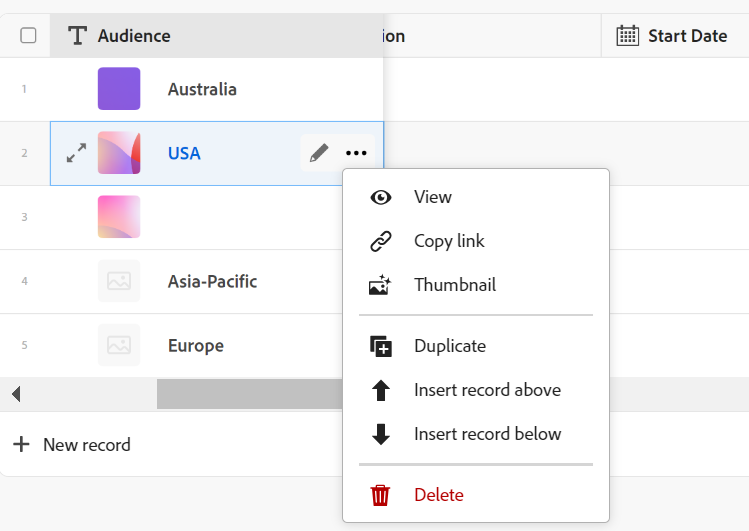

<!--update the metadata with real information when making this available in TOC and in the left nav-->

# Datensätze erstellen

{{planning-important-intro}}

In der Adobe Workfront-Planung ist ein Datensatz eine Instanz eines Datensatztyps.

Sie können Datensätze anhand einer der folgenden Methoden erstellen:

* Fügen Sie sie von der Seite mit dem Datensatztyp in der Tabellenansicht hinzu
* Datensätze aus einer externen Liste kopieren und einfügen
* Duplizieren Sie sie
  <!--* Create them as you connect them from other records-->

In diesem Artikel wird beschrieben, wie Sie Datensätze erstellen können. Informationen zum Verwalten von Datensätzen in der Tabellen- oder Timeline-Ansicht finden Sie in den folgenden Artikeln:

* [Tabellenansicht verwalten](/help/quicksilver/planning/views/manage-the-table-view.md)
* [Verwalten der Timeline-Ansicht](/help/quicksilver/planning/views/manage-the-timeline-view.md)

## Zugriffsanforderungen

+++ Erweitern Sie , um die Zugriffsanforderungen für die Workfront-Planung anzuzeigen.

<table style="table-layout:auto">
 <col>
 </col>
 <col>
 </col>
 <tbody>
    <tr>
<tr>
<td>
   
 Produkt
 </td>
   <td>
   
 Adobe Workfront
 </td>
  </tr>  
 <td role="rowheader">
Adobe Workfront-Abkommen
</td>
   <td>

Ihr Unternehmen muss in der Phase des frühen Zugriffs für die Workfront-Planung eingeschrieben sein 

   </td>
  </tr>
  <tr>
   <td role="rowheader">
Adobe Workfront-Abo
</td>
   <td>

Alle

   </td>
  </tr>
  <tr>
   <td role="rowheader">
Adobe Workfront-Lizenz*
</td>
   <td>
   
Neu: Standard

   
Aktuell: Plan
  
  </td>
  </tr>

<tr>
   <td role="rowheader">
Konfigurationen auf Zugriffsebene
</td>
   <td> 
Es gibt keine Zugriffskontrollen für die Adobe Workfront-Planung 
  
</td>
  </tr>
<tr>
   <td role="rowheader">
Berechtigungen
</td>
   <td> 
Contribute oder höhere Berechtigungen für einen Arbeitsbereich</a> 
  
   
Systemadministratoren haben Berechtigungen für alle Arbeitsbereiche, einschließlich derjenigen, die sie nicht erstellt haben

</td>
  </tr>
<tr>
   <td role="rowheader">
Layout-Vorlage
</td>
   <td> 
Ihr Workfront- oder Gruppenadministrator muss den Planungsbereich in Ihre Layoutvorlage einfügen. Weitere Informationen finden Sie unter <a href="/help/quicksilver/planning/access/access-overview.md">Zugriffsübersicht</a>. 
  
</td>
  </tr>

</tbody>
</table>

*Weitere Informationen finden Sie unter [Zugriffsanforderungen für die Workfront-Dokumentation](/help/quicksilver/administration-and-setup/add-users/access-levels-and-object-permissions/access-level-requirements-in-documentation.md).

+++

<!--For the release of in-context record creation - add this to the table above for permissions and access:

* Manage permissions to the workspace you want to add records to. 
* Edit access in Workfront for the object types that you want to add (projects and portfolios.)
* Manage permissions to Workfront objects (portfolios) to add children objects (projects).-->

## Erstellen von Datensätzen durch Hinzufügen zu einem Datensatztyp <!--in a record type table (I don't think you can create them elsewhere right now)-->

Sie können Datensätze in der Tabellenansicht einer Seite vom Typ Datensatz erstellen.

Informationen zum Bearbeiten von Datensatzinformationen finden Sie unter [Datensätze bearbeiten](/help/quicksilver/planning/records/edit-records.md).

{{step1-to-planning}}

1. Klicken Sie auf den Arbeitsbereich, in den Sie Datensätze hinzufügen möchten.

   Der Arbeitsbereich wird geöffnet und die Datensatztypen werden als Karten angezeigt.

1. Klicken Sie auf eine Karte vom Typ Datensatz. Informationen zum Erstellen eines Datensatztyps finden Sie unter [Erstellen von Datensatztypen](/help/quicksilver/planning/architecture/create-record-types.md).

   Die Seite mit dem Datensatztyp wird in der Ansicht geöffnet, auf die Sie zuletzt zugegriffen haben. Standardmäßig wird eine Seite vom Typ Datensatz in der Tabellenansicht geöffnet.
Alle Datensätze des ausgewählten Typs werden in der Ansicht angezeigt.

1. (Bedingt) Führen Sie je nach angezeigter Ansicht einen der folgenden Schritte aus:

   * In der Tabellenansicht:

      * Klicken Sie in der letzten Zeile der Tabelle auf **Neuer Datensatz** .

      * Klicken Sie in einer beliebigen Spalte oder Zeile der Tabelle auf die Tastenkombination **Umschalt + Eingabetaste**. Dadurch wird eine leere Zeile unter dem Datensatz hinzugefügt, aus dem Sie beginnen.
      * Bewegen Sie den Mauszeiger über das Primärfeld eines Datensatzes, klicken Sie auf das Menü **Mehr** Menü  rechts neben dem Feld und klicken Sie dann auf **Datensatz über** einfügen oder **Datensatz unter** einfügen .

     

   * Aus jeder Sicht:

      * Klicken Sie oben rechts auf der Seite auf **Neuer Datensatz** . Das Vorschaufeld für Datensätze wird geöffnet.

     Workfront lädt automatisch eine Miniaturansicht und ein Titelbild in jeden neuen Datensatz hoch. Sie können diese Bilder später ändern. Weitere Informationen finden Sie in den folgenden Artikeln:

      * [Hinzufügen eines Titelbilds zu einem Datensatz](/help/quicksilver/planning/records/add-a-cover-image-to-a-record.md)
      * [Hinzufügen einer Miniaturansicht zu einem Datensatz](/help/quicksilver/planning/records/add-thumbnails-to-records.md)

1. Geben Sie in die im Vorschaufenster angezeigten Felder Informationen zum neuen Datensatz ein.

   >[!NOTE]
   >
   >  * Es gibt keine Pflichtfelder für Datensätze. Es wird jedoch empfohlen, Informationen für das primäre Feld eines Datensatzes hinzuzufügen, da es beim Verknüpfen von Datensätzen hilfreich ist, Datensätze zu identifizieren. Weitere Informationen zu Primärfeldern finden Sie unter [Tabellenansicht verwalten](/help/quicksilver/planning/views/manage-the-table-view.md) und [Übersicht über Primäre Felder](/help/quicksilver/planning/fields/primary-field-overview.md).
   >
   >  * Felder, die auf andere Datensatztypen oder berechnete Felder verweisen, sind schreibgeschützte Felder.

1. (Bedingt) Wenn Sie Datensätze in die Tabelle einfügen, fügen Sie weiterhin Informationen zu jeder Zeile hinzu und klicken Sie dann auf der Tastatur auf **Enter** , um Ihre Änderungen zu speichern.

   Oder

   Klicken Sie auf den Namen des neuen Datensatzes oder auf das Symbol **Details öffnen**  links neben dem Datensatznamen. Eine Vorschau mit den detaillierten Informationen des Datensatzes wird in der Tabelle geöffnet.

   >[!TIP]
   >
   >Sie können nur dann auf das Symbol **Details öffnen** zugreifen, wenn das Feld &quot;Name&quot;ein primäres Feld ist.

1. Bearbeiten Sie die Datensatzinformationen in der Vorschau des Datensatzes. Workfront speichert Ihre Änderungen automatisch.
1. (Optional) Klicken Sie oben rechts in der Vorschau des Datensatzes auf das Symbol **In neuer Registerkarte öffnen**  , um die Seite des Datensatzes in einer neuen Registerkarte zu öffnen. Bearbeiten Sie den Datensatz auf der Datensatzseite weiter. Weitere Informationen finden Sie unter [Datensätze bearbeiten](/help/quicksilver/planning/records/edit-records.md).

1. (Optional) Verwenden Sie die folgenden Tastaturbefehle, um das Hinzufügen neuer Datensätze oder ihrer Informationen rückgängig zu machen oder wiederherzustellen, wenn Sie sie in der Tabellenansicht hinzufügen:

   * STRG + Z ( ⌘ + Z für Mac) zum Rückgängigmachen einer Änderung
   * STRG + Umschalt + Z ( ⌘ + Umschalt + Z für Mac) zum Wiederholen einer Änderung

<!-- this is not possible anymore: 

## Create records by connecting them from another application

You can import records from other applications by linking them to existing records. This creates a linked record for the other application's connected object. 

1. Create a record type, as described in the [Create record types](/help/quicksilver/planning/architecture/create-record-types.md).

1. Create records for the record type you created in the previous step. For information, see the section [Create records by manually adding them to a record type](#create-records-by-manually-adding-them-to-a-record-type) in this article. 

1. Create a connection to an object type from another application for the record type you created. For information, see [Connect record types](/help/quicksilver/planning/architecture/connect-record-types.md).

1. Add objects from another application to the records you created above using the linked record field you created in the previous step. For information, see [Connect records](/help/quicksilver/planning/records/connect-records.md). 

    The following items are created in Workfront Planning:

    * A read-only record type that refers to the other application's record type you linked to in the connected record field. 

      For example, if you connect a Planning record type to Workfront project, a read-only record type named "Workfront project" is created in the same workspace. You can access the read-only Workfront record types from the table view of the Planning records you're linking from. 
   
-->

## Datensätze durch Kopieren und Einfügen aus einer externen Liste erstellen

1. Beginnen Sie mit der Erstellung von Datensätzen in der Tabellenansicht, wie im Abschnitt [Erstellen von Datensätzen beschrieben, indem Sie sie manuell zu einem Datensatztyp hinzufügen](#create-records-by-manually-adding-them-to-a-record-type) in diesem Artikel.

   Stellen Sie sicher, dass die Tabellenansicht über die Spalten (oder Felder) verfügt, die mit den neuen Datensatzinformationen gefüllt werden sollen.

1. Klicken Sie in der letzten Zeile der Tabelle auf **Neu &lt; Name des Datensatztyps >** , um der Tabelle so viele neue Zeilen hinzuzufügen, wie die neuen Datensätze sein sollen.

   Fügen Sie der Tabellenansicht beispielsweise 10 Zeilen hinzu, wenn Sie die Informationen für 10 neue Datensätze aus einer anderen Anwendung einfügen möchten.

1. Erstellen Sie in einer anderen Anwendung eine Liste von Datensätzen, die Sie importieren möchten.

   Sie können beispielsweise eine Excel-Tabelle verwenden, um Ihre Liste zu erstellen.

   Die Liste sollte Informationen im Tabellenformat enthalten.

   >[!TIP]
   >
   > Die Spalten der Liste sollten Informationen zu den in Workfront vorhandenen Feldern enthalten.
   >
   > Vergewissern Sie sich, dass die gewünschten Felder bereits in Workfront erstellt wurden und dass die Informationen in Ihrem Arbeitsblatt im richtigen Format angezeigt werden, das dem der Felder in Workfront entspricht.

1. Wählen Sie in einer anderen Anwendung mehrere Zeilen und Spalten aus und fügen Sie dann die Informationen in die Tabellenansicht des Datensatztyps ein, beginnend mit dem ersten neuen Datensatz.

   Die folgenden Informationen werden in den Workfront-Planungsbereich importiert:

   * Die Zeilen enthalten die neuen Datensätze
   * Die Spalten enthalten Informationen zu den Feldern der Datensätze.

## Datensätze durch Duplizierung erstellen

Informationen zum Duplizieren von Datensätzen finden Sie unter [Duplizieren von Datensätzen](/help/quicksilver/planning/records/copy-or-duplicate-records.md).

<!--check the steps with the release of in-context record types epic: 

## Create records as you connect them

You can create records or Workfront objects as you connect them from other records. 

You must have the following before you can add new records or Workfront objects by connecting them from existing records:

* Connected record types. For information, see [Connect record types](/help/quicksilver/planning/architecture/connect-record-types.md).
* Connected records. For information, see [Connect records](/help/quicksilver/planning/records/connect-records.md).
* The correct access and permissions in Workfront Planning and Workfront, as described in the section [Access requirements](#access-requirements) in this article. 

>[!NOTE]
>
>Creating Workfront projects and portfolios as you connect them to Workfront Planning records is similar to creating Planning records as you connect them from other records.

To create records as you are connecting them from other records: 

1. Start connecting Workfront Planning records, as described in the article [Connect records](/help/quicksilver/planning/records/connect-records.md). 
1. (Conditional) If you cannot find a record when trying to add it from the connected record field of another record, search for a record, then click **+ Add**. The **+ Add** button is followed by the name of the record type you are connecting from. 

    

    The record is created and added to the connected record field. 
1. (Optional) Go to the table view of the record type whose record you created. A new record displays in the last row of the view. 
1. (Optional) Start adding information for the new record in the table view, or click its name to open the details page and add information there. 

-->