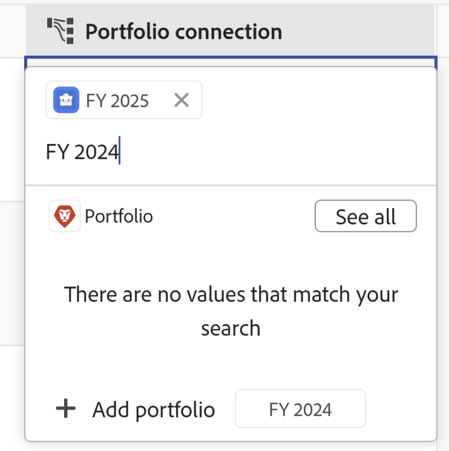

<!--update the metadata with real information when making this available in TOC and in the left nav-->

# Erstellen von Workfront-Objekten aus Workfront Planning, während Sie sie mit Datensätzen verbinden

<!-- update the title (and all the links to this article) at preview, to be this: Create Workfront objects from Workfront Planning as you connect them to records-->
<!-- remove preview and production at release time-->

Die auf dieser Seite hervorgehobenen Informationen beziehen sich auf Funktionen, die noch nicht allgemein verfügbar sind. Sie ist nur in der Vorschau -Umgebung für alle Kunden verfügbar. Nach den monatlichen Releases in der Produktion stehen dieselben Funktionen auch in der Produktionsumgebung für Kunden zur Verfügung, die schnelle Releases aktiviert haben. 

Informationen zu Schnellversionen finden Sie unter [Aktivieren oder Deaktivieren von Schnellversionen für Ihre Organisation](/help/quicksilver/administration-and-setup/set-up-workfront/configure-system-defaults/enable-fast-release-process.md). 

{{planning-important-intro}}

Sie können Adobe Workfront-Objekte aus Workfront Planning wie folgt erstellen:

* Beim Verbinden von Workfront-Objekten aus Planungsdatensätzen

  In diesem Artikel wird beschrieben, wie Sie Workfront-Objekte aus Workfront Planning erstellen, während Sie sie aus Planning-Datensätzen verbinden.
* Wenn Sie Automatisierungen von der Datensatzseite aus verwenden.

  Informationen zum Erstellen von Workfront-Objekten mithilfe von Automatisierungen finden Sie unter [Erstellen von Objekten mithilfe von Adobe Workfront Planning-Datensatzautomatisierungen](/help/quicksilver/planning/records/create-wf-objects-using-planning-automations.md).

Sie können die folgenden Typen von Workfront-Objekten aus Workfront Planning erstellen, wenn Sie einen Workfront Planning-Datensatz mit den folgenden Workfront-Objekttypen verbinden:

* Projekte
* Portfolios
* Programme

>[!IMPORTANT]
>
>* Sie können nur Projekte, Portfolios und Programme in Workfront erstellen, wenn Sie sie über einen Datensatz verbinden.
>
>* Sie können keine Gruppen oder Unternehmen erstellen, wenn Sie sie über einen Datensatz in Workfront Planning verbinden.
>

Sie können Projekte, Portfolios und Programme über ein Verbindungsfeld in folgenden Bereichen von Workfront Planning verbinden:

* Die Tabellenansicht eines Datensatztyps
* Die Detailseite oder das Vorschaufeld eines Datensatzes
* Registerkarte „Verbindungen“ eines Datensatzes

Informationen zum Verbinden von Planning-Datensätzen mit Workfront-Objekten finden Sie unter [Verbinden von Datensätzen](/help/quicksilver/planning/records/connect-records.md).

## Zugriffsanforderungen

+++ Erweitern Sie , um die Zugriffsanforderungen anzuzeigen.

Sie müssen über folgenden Zugriff verfügen, um die Schritte in diesem Artikel ausführen zu können:

<table style="table-layout:auto"> 
<col> 
</col> 
<col> 
</col> 
<tbody> 
    <tr> 
<tr> 
<td> 
   
 Produkte
 </td> 
   <td> 
   <ul><li>
 Adobe Workfront
</li> 
   <li>
 Adobe Workfront-Planung
</li></ul></td> 
  </tr>   
<tr> 
   <td role="rowheader">
Adobe Workfront-Plan*
</td> 
   <td> 

Einer der folgenden Workfront-Pläne:
 
<ul><li>Auswählen</li> 
<li>Erstklassig</li> 
<li>Ultimativ</li></ul> 

Workfront Planning ist nicht für ältere Workfront-Pläne verfügbar
 
   </td> 
<tr> 
   <td role="rowheader">
Adobe Workfront-Planungspaket*
</td> 
   <td> 

Beliebig 
 

Weitere Informationen zu den einzelnen Workfront-Planungsplänen erhalten Sie von Ihrem Workfront Account Manager. 
 
   </td> 
 <tr> 
   <td role="rowheader">
Adobe Workfront-Plattform
</td> 
   <td> 

Um auf alle Funktionen von Workfront zugreifen zu können, muss die Workfront-Instanz Ihres Unternehmens in das einheitliche Adobe-Erlebnis integriert sein.
 

Weitere Informationen finden Sie unter <a href="/help/quicksilver/workfront-basics/navigate-workfront/workfront-navigation/adobe-unified-experience.md">Adobe Unified Experience for Workfront</a>. 
 
   </td> 
   </tr> 
  </tr> 
  <tr> 
   <td role="rowheader">
Adobe Workfront-Lizenz*
</td> 
   <td> Standard
   
Workfront Planning ist nicht für ältere Workfront-Lizenzen verfügbar
 
  </td> 
  </tr> 
  <tr> 
   <td role="rowheader">
Konfiguration der Zugriffsebene
</td> 
   <td> 
Es gibt keine Zugriffssteuerungsebenen für Adobe Workfront Planning
 
   
Bearbeiten Sie den Zugriff in Workfront für die Objekttypen, die Sie erstellen möchten (Projekte, Programme und Portfolios), während Sie die Datensätze mit ihnen verbinden. 
  
</td> 
  </tr> 
<tr> 
   <td role="rowheader">
Objektberechtigungen
</td> 
   <td> 
Verwalten Sie die Berechtigungen für den Arbeitsbereich und den Datensatztyp in dem Sie Datensätze hinzufügen möchten. 
  
   
Systemadministratoren haben Berechtigungen für alle Arbeitsbereiche, einschließlich der nicht erstellten

   
Verwalten Sie Berechtigungen für Workfront-Objekte (Portfolios), um untergeordnete Objekte (Projekte) hinzuzufügen.

   </td> 
  </tr> 
<tr> 
   <td role="rowheader">
Layout-Vorlage
</td> 
   <td> 
In der Produktionsumgebung müssen alle Benutzer, einschließlich der Systemadministratoren, einer Layoutvorlage zugewiesen werden, die Planning enthält.

In der Vorschau-Umgebung ist für Standardbenutzer und Systemadministratoren „Planung“ standardmäßig aktiviert.
 </td> 
  </tr> 
</tbody> 
</table>

*Weitere Informationen zu Zugriffsanforderungen für Workfront finden Sie unter [Zugriffsanforderungen in der Dokumentation zu Workfront](/help/quicksilver/administration-and-setup/add-users/access-levels-and-object-permissions/access-level-requirements-in-documentation.md).

+++

## Voraussetzungen für das Erstellen von Workfront-Objekten beim Verbinden dieser Objekte mit Datensätzen aus Workfront Planning

Sie müssen über Folgendes verfügen, bevor Sie neue Projekte oder Portfolios hinzufügen können, indem Sie sie mit vorhandenen Datensätzen verbinden:

* Datensatztypen, die mit Workfront-Projekten, -Portfolios oder -Programmen verbunden sind. Weitere Informationen finden Sie unter [Verbinden von Datensatztypen](/help/quicksilver/planning/architecture/connect-record-types.md).
* Einträge. Weitere Informationen finden Sie unter [Erstellen von Datensätzen](/help/quicksilver/planning/records/create-records.md).
* Die richtigen Zugriffsberechtigungen in Workfront Planning und Workfront, wie im Abschnitt [Zugriffsanforderungen“ in ](#access-requirements) Artikel beschrieben.

## Erstellen Sie Projekte, während Sie sie mit Datensätzen aus Workfront Planning verbinden

So erstellen Sie Projekte, während Sie sie mit anderen Datensätzen verbinden:

1. Wechseln Sie zur Detailseite eines Datensatzes oder zur Tabelle des Datensatztyps und verbinden Sie Workfront Planning-Datensätze mit Workfront-Projekten, wie im Artikel [Verbinden von Datensätzen](/help/quicksilver/planning/records/connect-records.md) beschrieben.

1. (Bedingt) Klicken Sie auf **Projekt hinzufügen**
oder
Geben Sie den Namen eines Projekts ein und klicken Sie dann auf **Projekt hinzufügen**, wenn Sie es nicht finden können. Auf die Schaltfläche Hinzufügen folgt der von Ihnen eingegebene Projektname.

   

   Das **Projekt erstellen** wird geöffnet.

1. (Optional) Aktualisieren Sie den **Projektnamen**. Standardmäßig wird das Projekt nach dem benannt, was Sie beim Verbinden aus dem Datensatz als Suchelement hinzugefügt haben.
1. (Optional) Wählen Sie eine **Projektvorlage** aus. Wenn Sie keine Vorlage auswählen, erstellt Workfront ein leeres Projekt ohne Aufgaben.
1. Klicken Sie auf **Erstellen**.
1. (Bedingt) Wenn Sie ausgewählt haben, ein Projekt aus einer Vorlage zu erstellen, befolgen Sie die Schritte im Artikel [Erstellen eines Projekts mit einer Vorlage](/help/quicksilver/manage-work/projects/create-projects/create-project-from-template.md), um das Hinzufügen des Projekts abzuschließen.

   Das neue Projekt wird erstellt und dem verbundenen Feld des ausgewählten Datensatzes hinzugefügt.

1. (Optional) Klicken Sie in Workfront Planning auf den Namen des neuen Projekts, um die Projektseite in Workfront zu öffnen und zusätzliche Aktualisierungen am Projekt vorzunehmen.

## Erstellen Sie Portfolios, während Sie sie mit Datensätzen aus Workfront Planning verbinden

So erstellen Sie Portfolios, während Sie sie mit Planungsdatensätzen verbinden:

1. Wechseln Sie zur Detailseite eines Datensatzes oder zur Tabelle des Datensatztyps und verbinden Sie Workfront Planning-Datensätze mit Workfront-Portfolios, wie im Artikel [Datensätze verbinden](/help/quicksilver/planning/records/connect-records.md) beschrieben.

1. (Bedingt) Klicken Sie auf **Portfolio hinzufügen**

   Oder

   Geben Sie den Namen eines Portfolios ein und klicken Sie auf **Portfolio hinzufügen** wenn Sie es nicht finden können. Auf die Schaltfläche Hinzufügen folgt der von Ihnen eingegebene Portfolioname.

   

   Das Portfolio wird erstellt und zum Verbindungsfeld des ausgewählten Datensatzes hinzugefügt.

1. (Optional) Klicken Sie in Workfront Planning auf den Namen des neuen Portfolios, um die Portfolioseite in Workfront zu öffnen und zusätzliche Aktualisierungen am Portfolio vorzunehmen.

## Erstellen Sie Programme, während Sie sie mit Datensätzen aus Workfront Planning verbinden

So erstellen Sie Programme, während Sie sie aus Planungsdatensätzen verbinden:

1. Wechseln Sie zur Detailseite eines Datensatzes oder zur Tabelle des Datensatztyps und verbinden Sie Workfront Planning-Datensätze mit Workfront-Portfolios, wie im Artikel [Datensätze verbinden](/help/quicksilver/planning/records/connect-records.md) beschrieben.

1. Klicken Sie **Programm hinzufügen**

   Oder

   Geben Sie den Namen eines Programms ein und klicken Sie auf **Programm hinzufügen**, wenn Sie es nicht finden können. Auf die Schaltfläche Hinzufügen folgt der von Ihnen eingegebene Programmname.

   

   Das **Programm erstellen** wird geöffnet.

1. Aktualisieren Sie den **Programmnamen**. Dies ist ein Pflichtfeld.
1. Wählen Sie eine **Portfolio** aus der Dropdown-Liste aus oder tippen Sie den Namen eines Portfolios und wählen Sie es aus, wenn es in der Liste angezeigt wird. Dies ist ein Pflichtfeld.
1. Klicken Sie auf **Erstellen**.

   Das Programm wird erstellt und dem Feld Verbindung des ausgewählten Datensatzes hinzugefügt.

1. (Optional) Klicken Sie in Workfront Planning auf den Namen des neuen Programms, um die Programmseite in Workfront zu öffnen und zusätzliche Aktualisierungen vorzunehmen.

