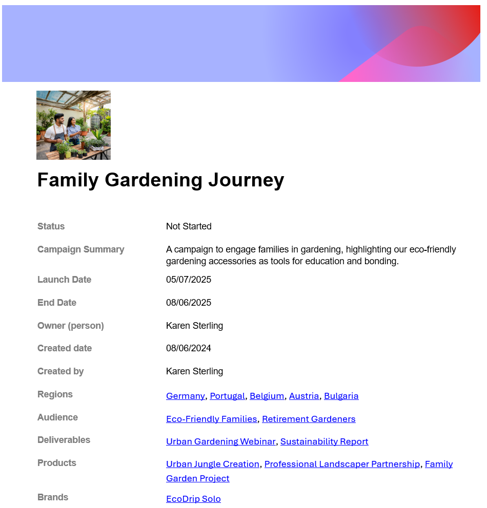

# Datensatzdetails exportieren

Um effizienter mit anderen zusammenzuarbeiten, die möglicherweise kein Workfront-Konto haben, können Sie die Details eines Datensatzes in eine Datei exportieren und für diese freigeben.

## Zugriffsanforderungen

+++ Erweitern Sie , um die Zugriffsanforderungen für die Workfront-Planung anzuzeigen.

Für den Zugriff auf die Workfront-Planung benötigen Sie Folgendes:

<table style="table-layout:auto"> 
<col> 
</col> 
<col> 
</col> 
<tbody> 
    <tr> 
<tr> 
<td> 
   
 Produkte
 </td> 
   <td> 
   <ul><li>
 Adobe Workfront
</li> 
   <li>
 Adobe Workfront-Planung
</li></ul></td> 
  </tr>   
<tr> 
   <td role="rowheader">
Adobe Workfront-Plan*
</td> 
   <td> 

Die folgenden Workfront-Pläne:
 
<ul><li>Auswählen</li> 
<li>Erstklassig</li> 
<li>Ultimativ</li></ul> 

Die Workfront-Planung ist für veraltete Workfront-Pläne nicht verfügbar
 
   </td> 
<tr> 
   <td role="rowheader">
Adobe Workfront-Planungsplan*
</td> 
   <td> 

Alle 
 

Weitere Informationen zu den Funktionen der einzelnen Workfront-Planungspläne erhalten Sie von Ihrem Workfront-Kundenbetreuer. 
 
   </td> 
 <tr> 
   <td role="rowheader">
Adobe Workfront-Plattform
</td> 
   <td> 

Die Workfront-Instanz Ihres Unternehmens muss in das Adobe Unified Experience integriert sein, damit Sie auf alle Funktionen der Workfront-Planung zugreifen können.
 

Weitere Informationen finden Sie unter <a href="/help/quicksilver/workfront-basics/navigate-workfront/workfront-navigation/adobe-unified-experience.md">Adobe Unified Experience for Workfront</a>. 
 
   </td> 
   </tr> 
  </tr> 
  <tr> 
   <td role="rowheader">
Adobe Workfront-Lizenz*
</td> 
   <td> 
Standard

   
Für ältere Workfront-Lizenzen ist die Workfront-Planung nicht verfügbar.
 
  </td> 
  </tr> 
  <tr> 
   <td role="rowheader">
Konfiguration der Zugriffsebene
</td> 
   <td> 
Für die Adobe Workfront-Planung gibt es keine Zugriffssteuerungselemente
   
</td> 
  </tr> 
<tr> 
   <td role="rowheader">
Objektberechtigungen
</td> 
   <td>   
Anzeigen oder höherer Berechtigungen für einen Arbeitsbereich</a> 
  
   
Systemadministratoren haben Berechtigungen für alle Arbeitsbereiche, einschließlich derjenigen, die sie nicht erstellt haben
 </td> 
  </tr> 
<tr> 
   <td role="rowheader">
Layout-Vorlage
</td> 
   <td> 
Allen Benutzern, einschließlich Workfront-Administratoren, muss eine Layoutvorlage zugewiesen werden, die den Planungsbereich im Hauptmenü enthält. 
 </td> 
  </tr> 
</tbody> 
</table>

*Weitere Informationen zu den Zugriffsanforderungen für Workfront finden Sie unter [Zugriffsanforderungen in der Workfront-Dokumentation](/help/quicksilver/administration-and-setup/add-users/access-levels-and-object-permissions/access-level-requirements-in-documentation.md).

+++

<!--OLD:

<table style="table-layout:auto">
 <col>
 </col>
 <col>
 </col>
 <tbody>
    <tr>
<tr>
<td>
   
 Product
 </td>
   <td>
   
 Adobe Workfront
 </td>
  </tr>  
 <td role="rowheader">
Adobe Workfront agreement
</td>
   <td>

Your organization must be enrolled in the early access stage for Workfront Planning 

   </td>
  </tr>
  <tr>
   <td role="rowheader">
Adobe Workfront plan
</td>
   <td>

Any

   </td>
  </tr>
  <tr>
   <td role="rowheader">
Adobe Workfront license*
</td>
   <td>
   
New: Standard

   Or
   
Current: Plan
 
  </td>
  </tr>
  
  <tr>
   <td role="rowheader">
Access level configurations
</td>
   <td> 
There are no access controls for Adobe Workfront Planning
  
</td>
  </tr>
<tr>
   <td role="rowheader">
Permissions
</td>
   <td> 
View or higher permissions to a workspace</a> 
  
   
System Administrators have permissions to all workspaces, including the ones they did not create

</td>
  </tr>
<tr>
   <td role="rowheader">
Layout template
</td>
   <td> 
Your Workfront or group administrator must add the Planning area in your layout template. For information, see <a href="/help/quicksilver/planning/access/access-overview.md">Access overview</a>. 
  
</td>
  </tr>

 </tbody>
</table>

*For more information, see [Access requirements in Workfront documentation](/help/quicksilver/administration-and-setup/add-users/access-levels-and-object-permissions/access-level-requirements-in-documentation.md). -->

## Überlegungen zum Exportieren von Datensatzdetails:

* Sie können die Details eines Datensatzes in die folgenden Dateiformate exportieren:

   * .docx Word
   * .pdf

* Sie können den Tab Details einer Datensatzseite exportieren. Die Registerkarte Verbindungen kann nicht exportiert werden.

* Die exportierte Datei behält das Layout der Datensatzseite bei, einschließlich der Miniaturansicht und der Titelbilder.

## Datensatzdetails exportieren

{{step1-to-planning}}

1. Klicken Sie auf die Karte eines Arbeitsbereichs.

   Der Arbeitsbereich wird geöffnet und die Datensatztypen werden auf Karten angezeigt.

1. Klicken Sie auf eine Karte vom Typ Datensatz.
Die Seite mit dem Datensatztyp wird geöffnet und alle Datensätze dieses Typs werden angezeigt.

1. Klicken Sie in einer beliebigen Ansicht auf den Namen eines Datensatzes.

   Das Vorschaufeld des Datensatzes wird geöffnet.

1. (Optional) Klicken Sie auf das Symbol **In neuer Registerkarte öffnen**  , um die Seite des Datensatzes zu öffnen.

1. Wählen Sie die Registerkarte **Details** aus. Die Registerkarte Details sollte standardmäßig geöffnet werden.

1. Klicken Sie entweder in der Vorschau oder auf der Datensatzseite auf das Symbol **Exportieren**  und klicken Sie dann auf eine der folgenden Optionen:

   * **Microsoft Word**
   * **Adobe PDF**

   Eine Word-Datei (.docx) oder eine PDF-Datei wird heruntergeladen und auf Ihrem Computer gespeichert.

   Der Name der exportierten Datei ist das Primäre Feld des Datensatzes.

   

1. (Optional) Gehen Sie zur heruntergeladenen Datei, öffnen Sie sie und bearbeiten Sie sie (falls es sich um eine Word-Datei handelt) oder geben Sie sie für andere frei.