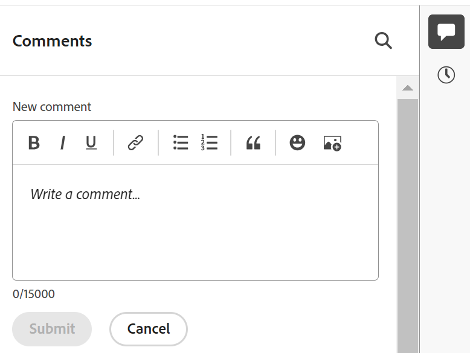

# Verwalten von Datensatzkommentaren

{{planning-important-intro}}

<!--update the metadata with real information when making this available in TOC and in the left nav-->

<!--update the system updates articles when we release to open beta - check the long commenting stream article list and see articles that document where in the system we have system updates; "Workfront Planning records" should be there-->

<!--The highlighted information on this page refers to functionality not yet generally available. It is available only in the Preview environment for all customers. 

For information about the current release schedule, see [First Quarter 2024 release overview](/help/quicksilver/product-announcements/product-releases/24-q1-release-activity/24-q1-release-overview.md). -->

Sie können an Adobe Workfront-Planungsdatensätzen zusammenarbeiten, indem Sie im rechten Bereich eines Datensatzes Kommentare oder Antworten hinzufügen. Sie können auch andere Änderungen anzeigen, die am Datensatz vorgenommen und vom System in diesem Bereich aufgezeichnet wurden.

Im rechten Bereich eines Datensatzes werden die folgenden Abschnitte angezeigt:

* **Kommentare**: Zeigt Kommentare und Antworten an, die Benutzer zu Datensätzen hinzufügen.
* **Geschichte**: Zeigt systemaufgezeichnete Änderungen an, die Benutzer an den Datensatzfeldern vornehmen. Weitere Informationen finden Sie unter [Übersicht über den Verlaufsabschnitt](/help/quicksilver/planning/records/history-section-overview.md).

## Überlegungen zum Kommentieren eines Datensatzes

* Sie können in der Workfront-Planung im Abschnitt Kommentare eines Datensatzes Kommentare und Antworten zu Datensätzen hinzufügen.

* Kommentare zu verknüpften Datensätzen werden nicht in den Datensätzen angezeigt, von denen Sie eine Verknüpfung herstellen. Wenn Sie beispielsweise einen Workfront Planning-Produktdatensatz kommentieren, der mit einem Campaign-Datensatz verknüpft ist, wird der Kommentar nur im Produktdatensatz in der Workfront-Planung und nicht im Campaign-Datensatz angezeigt, mit dem Sie eine Verknüpfung herstellen.

* Sie können Workfront-Planungsdatensätzen Kommentare hinzufügen, die durch eine Verbindung zwischen einem Datensatz und einem Objekt aus einer anderen Anwendung erstellt wurden.

  Beispielsweise können Sie den Datensatz &quot;Projekt-Workfront-Planung&quot;kommentieren, nachdem Sie Workfront-Projekte mit Workfront-Planungsdatensätzen verbunden haben. Weitere Informationen finden Sie unter [Datensätze verbinden](/help/quicksilver/planning/records/connect-records.md).

* Kommentare zu verknüpften Objekten in anderen Anwendungen werden nicht in der Workfront-Planung angezeigt und Kommentare, die zu verknüpften Objekten in der Workfront-Planung hinzugefügt wurden, werden in anderen Anwendungen nicht angezeigt.

  Beispielsweise werden zu Projekten in Workfront hinzugefügte Kommentare nicht im selben Projekt angezeigt, das mit einer Kampagne in der Workfront-Planung verknüpft ist, und Kommentare, die zum Projekt Workfront Planning Record hinzugefügt wurden, werden nicht in Workfront angezeigt.

* Sie können Benutzer taggen, um sie auf eine Aktualisierung aufmerksam zu machen. Mit Tags versehene Benutzer erhalten keine In-App-Benachrichtigung oder E-Mail über Ihre Aktualisierung. <!--this might change??-->

<!--replace the bullet above with this: * You can tag users to bring their attention to an update. Tagged users receive an in-app notification or an email notification about your update. 
   The following scenario exists:   

   * Adobe Unified Experience users receive both an in-app notification and an email notification. 
   * Users who are not in the Adobe Unified Experience receive only an email notification. 

      For information, see [Adobe Workfront Planning notifications: article index](/help/quicksilver/planning/notifications/notifications-information.md)
   
      To determine whether your company is using the Adobe Unified Experience, see [Adobe Unified Experience for Workfront](/help/quicksilver/workfront-basics/navigate-workfront/workfront-navigation/adobe-unified-experience.md).
      -->

* Sie können Datensätze aktualisieren und den Verlauf von Änderungen in den folgenden Bereichen der Workfront-Planung überprüfen:

   * Auf der Seite mit den Datensatzdetails .
   * In einer Ansicht im Feld &quot;Datensatzdetails&quot;.

## Zugriffsanforderungen

Sie müssen über folgenden Zugriff verfügen, um die Schritte in diesem Artikel ausführen zu können:

<table style="table-layout:auto">
 <col>
 </col>
 <col>
 </col>
 <tbody>
    <tr>
<tr>
<td>
   
 Produkt
 </td>
   <td>
   
 Adobe Workfront
 </td>
  </tr>  
 <td role="rowheader">
Adobe Workfront-Abkommen
</td>
   <td>

Ihr Unternehmen muss in der Phase des frühen Zugriffs für die Workfront-Planung eingeschrieben sein 

   </td>
  </tr>
  <tr>
   <td role="rowheader">
Adobe Workfront-Abo
</td>
   <td>

Alle

   </td>
  </tr>
  <tr>
   <td role="rowheader">
Adobe Workfront-Lizenz
</td>
   <td>
   
Alle
 
  </td>
  </tr>

<tr>
   <td role="rowheader">
Konfiguration der Zugriffsebene
</td>
   <td> 
In der Workfront-Planung gibt es keine Steuerelemente für die Zugriffsstufe. 
  
</td>
  </tr>
<tr>
   <td role="rowheader">
Berechtigungen
</td>
   <td> 
Anzeigen von oder höheren Berechtigungen für einen Arbeitsbereich</a> 
  
   
Systemadministratoren haben Berechtigungen für alle Arbeitsbereiche, einschließlich derjenigen, die sie nicht erstellt haben

</td>
  </tr>

<tr>
   <td role="rowheader">
Layout-Vorlage
</td>
   <td> 
Ihr Workfront- oder Gruppenadministrator muss den Planungsbereich in Ihre Layoutvorlage einfügen. Weitere Informationen finden Sie unter <a href="/help/quicksilver/planning/access/access-overview.md">Zugriffsübersicht</a>. 
  
</td>
  </tr>
 </tbody>
</table>

### Kommentare zu Datensätzen verwalten

{{step1-to-planning}}

1. Klicken Sie auf die Karte eines Arbeitsbereichs.

   Der Arbeitsbereich wird geöffnet und die Datensatztypen werden auf Karten angezeigt.

1. Klicken Sie auf eine Karte vom Typ Datensatz.
Die Seite mit dem Datensatztyp wird geöffnet und alle Datensätze dieses Typs werden angezeigt.

1. Wählen Sie eine Tabellenansicht aus dem **Ansicht** Dropdown-Menü.
1. Klicken Sie in der Tabellenansicht auf den Namen eines Datensatzes.

   Der Rekord **Details** Seite geöffnet. Der Bereich Kommentare wird standardmäßig im rechten Bereich geöffnet.

1. (Bedingt) Wenn das rechte Bedienfeld nicht standardmäßig geöffnet wird, klicken Sie auf die **Kommentare anzeigen**  rechts oben, um den Abschnitt Kommentare zu öffnen.

1. Beginnen Sie mit der Eingabe eines Kommentars im **Neuer Kommentar** ankreuzen.

   

   >[!TIP]
   >
   >Wenn Sie den Abschnitt Kommentare verlassen, bevor Sie mit der Eingabe und dem Senden eines Kommentars fertig sind, bleibt der Kommentar auf der Seite im Entwurfsmodus, auch wenn Sie sich abmelden und wieder anmelden. Bilder, die dem Kommentar hinzugefügt werden, werden ebenfalls im Entwurf gespeichert. Entwürfe werden sieben Tage lang gespeichert und können nicht wiederhergestellt werden. Entworfene Kommentare sind nur für den Benutzer sichtbar, der sie eingibt.

1. (Optional) Verwenden Sie die folgenden Tastaturbefehle, um eine Änderung rückgängig zu machen oder wiederherzustellen:
   * STRG + Z ( ⌘ + z für Mac) zum Rückgängigmachen einer Änderung
   * STRG + Y ( ⌘ + y für Mac) zum Wiederholen einer Änderung
1. (Optional) Hinzufügen **@** gefolgt vom Namen eines Benutzers, der in der Aktualisierung jemanden taggt.

   <!--Adobe Unified Experience users can receive an in-app and an email notification when they are tagged. All other users receive an email when they are tagged. For more information, see the section [Considerations about commenting on a record](#considerations-about-commenting-on-a-record) in this article. -->

1. (Optional) Verwenden Sie die Optionen in der Rich-Text-Symbolleiste, um Ihren Text zu formatieren, Emojis, Links oder Bilder zu Ihrer Aktualisierung hinzuzufügen und Ihren Inhalt zu verbessern. Weitere Informationen finden Sie im Artikel im Abschnitt &quot;Verwenden von Rich Text in einem Workfront-Update&quot; [Update der Arbeit](/help/quicksilver/workfront-basics/updating-work-items-and-viewing-updates/update-work.md).

   >[!TIP]
   >
   >Wenn ein anderer Benutzer einen Kommentar für dasselbe Element sendet, das Sie aktualisieren, wird eine rote Zeile mit der Anzeige &quot;Neu&quot;angezeigt, die Sie über die neueren Kommentare informiert.
   >
   >Der Indikator wird erst angezeigt, nachdem der Kommentar zum Element gesendet wurde, und nicht, wenn der Kommentar noch erstellt wurde.
   >
   >

1. Klicks **Einsenden** , um die Aktualisierung zum Datensatz hinzuzufügen.
1. (Optional) Um einen Kommentar zu bearbeiten, klicken Sie auf die **Mehr** Menü  in der oberen rechten Ecke des Kommentars klicken Sie auf **Bearbeiten**.

   >[!IMPORTANT]
   >
   >Sie können Ihren Kommentar nur innerhalb von 15 Minuten nach seiner Übermittlung bearbeiten.

1. Bearbeiten Sie die Informationen im Kommentar, fügen Sie Bilder hinzu oder entfernen Sie sie oder einen der getaggten Benutzer. Links neben dem Kommentar wird ein Indikator &quot;bearbeitet&quot;hinzugefügt.

   >[!TIP]
   >
   >Kommentare aus dem aktuellen Jahr zeigen das Jahr nicht im Datumsstempel an. Wenn Sie den Mauszeiger über einen Zeitstempel bewegen, wird das vollständige Datum einschließlich des Jahres angezeigt.

1. (Optional und bedingt) Um nach einem vorhandenen Kommentar zu suchen, geben Sie in das Suchfeld in der oberen rechten Ecke des **Kommentare** Bereich.

   

1. (Optional) Klicken Sie auf **Antwort** oder beginnen Sie mit der Eingabe eines Kommentars im **Antwort hinzufügen ...** -Bereich, um auf einen vorhandenen Kommentar zu antworten, und führen Sie dann die Schritte 4 bis 8 oben aus. <!--(**************accurate??***********)-->

1. (Bedingt und optional) Wenn andere Benutzer Kommentare hinzugefügt haben, die beim Hinzufügen Ihrer Kommentare außerhalb des sichtbaren Bereichs im Abschnitt Kommentare angezeigt werden, klicken Sie auf **Ansicht** innerhalb der **neues Kommentarbanner** unten auf dem Bildschirm, um diese Kommentare anzuzeigen.

   

   Weitere Kommentare werden unten auf dem Bildschirm angezeigt.

1. (Optional) Klicken Sie auf die **liken** -Symbol, um ein Update zu mögen oder zu bestätigen, dass Sie es gelesen haben. Das Symbol wird mit der Anzahl der &quot;Gefällt mir&quot;-Klicks aktualisiert.
1. (Bedingt und optional) Wenn Sie weitere Personen in Ihren Kommentar aufgenommen haben, klicken Sie auf die Avatare der in der Aktualisierung enthaltenen Benutzer, um eine Liste der Benutzer anzuzeigen, für die der Kommentar freigegeben ist.
1. (Optional) Klicken Sie auf die **Mehr** icon  in der oberen rechten Ecke des Kommentars klicken und auf eine der folgenden Optionen klicken, um Informationen aus einem Kommentar zu kopieren:

   * **Link kopieren**: Dadurch wird ein Link zum Kommentar in die Zwischenablage kopiert.
   * **Textkörper kopieren**: Kopiert den Text des Kommentars in die Zwischenablage.
   * **Anführungsantwort**: Kopiert den Inhalt Ihres Kommentars in eine neue Antwort. Bilder sind nicht in der kopierten Antwort enthalten.

   Weitere Informationen finden Sie unter [Update der Arbeit](/help/quicksilver/workfront-basics/updating-work-items-and-viewing-updates/update-work.md).
1. (Optional) Klicken Sie auf die **Mehr** icon  in der oberen rechten Ecke des Kommentars klicken Sie auf **Löschen** , um den Kommentar zu löschen.
1. (Optional) Klicken Sie auf die **Kommentare ausblenden** icon  , um den rechten Bereich zu schließen.

## Übersicht über den Verlaufsabschnitt

Sie können die am Datensatz vorgenommenen Änderungen im Abschnitt Verlauf des rechten Bereichs eines Datensatzes überprüfen.

Weitere Informationen finden Sie unter [Übersicht über den Verlaufsabschnitt](/help/quicksilver/planning/records/history-section-overview.md).
