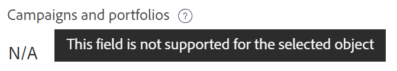

<!--add also Group and Company when they are available-->

# Verwalten von Datensatzverbindungen aus Workfront-Objekten

<!--The highlighted information on this page refers to functionality not yet generally available. It is available only in the Preview environment for all customers. After the monthly releases to Production, the same features are also available in the Production environment for customers who enabled fast releases.    

For information about fast releases, see [Enable or disable fast releases for your organization](/help/quicksilver/administration-and-setup/set-up-workfront/configure-system-defaults/enable-fast-release-process.md).-->

{{planning-important-intro}}

Sie können Workfront-Planungsdatensätze in Workfront in den folgenden Bereichen der mit ihnen verbundenen Objekte anzeigen:

* Der Abschnitt Planung eines Workfront-Objekts: Zeigt alle mit einem Objekt verbundenen Datensatztypen und die entsprechenden verbundenen Datensätze an.
* Benutzerdefiniertes Feld für Planning-Verbindung: Zeigt einen Datensatztyp und die entsprechenden verbundenen Datensätze an.

<!--replace the last sentence above with this: 

Displays one record type, its respective connected records, and up to 7 lookup fields of the connected records.

-->

## Zugriffsanforderungen

+++ Erweitern Sie , um die Zugriffsanforderungen für Workfront Planning anzuzeigen.

Sie müssen über folgenden Zugriff verfügen, um die Schritte in diesem Artikel ausführen zu können:

<table style="table-layout:auto">
 <col>
 </col>
 <col>
 </col>
 <tbody>
    <tr>
<tr>
<td>
   
 Produkte
 </td>
   <td>
   <ul><li>
 Adobe Workfront
</li>
   <li>
 Adobe Workfront-Planung
</li></ul></td>
  </tr>  
 <tr>
   <td role="rowheader">
Adobe Workfront-Plan*
</td>
   <td>

Einer der folgenden Workfront-Pläne:

<ul><li>Auswählen</li>
<li>Erstklassig</li>
<li>Ultimativ</li></ul>

Workfront Planning ist nicht für ältere Workfront-Pläne verfügbar

   </td>

<tr>
   <td role="rowheader">
Adobe Workfront-Planungspaket*
</td>
   <td>

Beliebig

Weitere Informationen zu den einzelnen Workfront-Planungsplänen erhalten Sie von Ihrem Workfront Account Manager. 

   </td>

<tr>
   <td role="rowheader">
Adobe Workfront-Plattform
</td>
   <td>

Um auf alle Funktionen von Workfront zugreifen zu können, muss die Workfront-Instanz Ihres Unternehmens in das einheitliche Adobe-Erlebnis integriert sein.

Weitere Informationen finden Sie unter <a href="/help/quicksilver/workfront-basics/navigate-workfront/workfront-navigation/adobe-unified-experience.md">Adobe Unified Experience for Workfront</a>. 

   </td>

</tr>
  </tr>
  <tr>
   <td role="rowheader">
Adobe Workfront-Lizenz*
</td>
   <td>
   
Standard

   
Workfront Planning ist nicht für ältere Workfront-Lizenzen verfügbar

  </td>
  </tr>
  <tr>
   <td role="rowheader">
Konfiguration der Zugriffsebene
</td>
   <td> 
Anzeigen oder Erweitern des Zugriffs auf Projekte, Programme und Portfolios
  
   
Es gibt keine Zugriffsebenen-Konfiguration für Workfront Planning. 

</td>
  </tr>
<tr>
   <td role="rowheader">
Objektberechtigungen
</td>
   <td>
   
Zeigen Sie in Workfront Berechtigungen oder höhere Berechtigungen für ein Projekt, ein Portfolio oder ein Programm an</a> 
 
   
Zeigen Sie in Workfront Planning Berechtigungen für einen Arbeitsbereich an, um verbundene Datensätze anzuzeigen, oder fügen Sie oder höhere Berechtigungen für einen Arbeitsbereich hinzu, um Datensätze zu verbinden oder zu trennen</a> 
  
   
Systemadministratoren haben Berechtigungen für alle Workfront Planning-Arbeitsbereiche, einschließlich der nicht erstellten
 
  </td>
  </tr>
<tr>
   <td role="rowheader">
Layoutvorlage
</td>
   <td> 
Um den Planungsbereich oder den Planungsabschnitt für ein Workfront-Objekt anzeigen zu können, muss allen Benutzenden, einschließlich Workfront-Administratoren, eine Layoutvorlage zugewiesen werden, die den Planungsbereich im Hauptmenü und den Planungsbereich für Projekte, Portfolios und Programme enthält. 
 Weitere Informationen finden Sie unter <a href="/help/quicksilver/planning/access/access-overview.md">Zugriffsübersicht für Adobe Planning</a>. 
  
  
</td>
  </tr>
 </tbody>
</table>

*Weitere Informationen zu Zugriffsanforderungen für Workfront finden Sie unter [Zugriffsanforderungen in der Dokumentation zu Workfront](/help/quicksilver/administration-and-setup/add-users/access-levels-and-object-permissions/access-level-requirements-in-documentation.md).

+++

## Verwalten von Datensätzen im Abschnitt Planung

Sie können den Abschnitt Planung eines Workfront-Objekts verwenden, um alle Datensatztypen und deren jeweilige Datensätze anzuzeigen, die mit dem Workfront-Objekt verbunden sind.
Der Abschnitt Planung ist für die folgenden Workfront-Objekte verfügbar:

* Projekt
* Portfolio
* Programm
<!--* Group
* Company-->

### Überlegungen zum Planungsabschnitt von Workfront-Objekten

Beachten Sie Folgendes, wenn Sie Workfront-Planungsdatensätze im Planungsabschnitt eines Workfront-Objekts anzeigen:

* Workfront Planning-Datensatztypen müssen zunächst mit Workfront-Objekttypen verbunden werden.

  Weitere Informationen finden Sie in den folgenden Artikeln:

   * [Verbinden von Datensatztypen](/help/quicksilver/planning/architecture/connect-record-types.md)
   * [Datensätze verbinden](/help/quicksilver/planning/records/connect-records.md)
* Sie können den Planungsabschnitt über ein Workfront-Objekt anzeigen, selbst wenn keine Datensätze mit dem Workfront-Objekt verknüpft sind.

### Verwalten von Datensatzverbindungen über den Abschnitt Planung

{{step1-to-planning}}

1. Klicken Sie auf die Karte eines Arbeitsbereichs.

   Der Arbeitsbereich wird geöffnet und die Datensatztypen werden als Karten angezeigt.

1. Klicken Sie auf die Karte eines Datensatztyps, der mit einem Workfront-Projekt, -Portfolio oder -Programm verbunden ist.
1. Wechseln Sie zu einem verbundenen Datensatzfeld, das über eine Verbindung mit einem Workfront-Objekt verfügt, entweder in der Tabellenansicht oder auf der Detailseite eines Datensatzes. Weitere Informationen finden Sie unter [Verbinden von Datensätzen](/help/quicksilver/planning/records/connect-records.md).
1. Klicken Sie auf den Namen eines Workfront-Objekts im Feld Verbundener Datensatz .
Die Seite des -Objekts wird in Workfront geöffnet.

   >[!NOTE]
   >
   >  Wenn Sie wissen, dass ein Workfront-Objekt bereits mit einem Planning-Datensatz verbunden ist, können Sie vom Workfront-Objekt zum Planning-Abschnitt navigieren.

1. Klicken **im linken** auf „Planung“.

   >[!NOTE]
   >
   >   Ihr Workfront- oder Gruppenadministrator muss der Layoutvorlage den Abschnitt Planung hinzufügen, bevor sie für ein Workfront-Projekt, -Portfolio oder -Programm angezeigt wird.

   Der Abschnitt Planung wird mit den folgenden Informationen angezeigt:

   * Die verbundenen Datensätze werden auf einzelnen Karten mit den folgenden Informationen angezeigt:
      * Name des Datensatzes
      * Die Miniaturansicht des Datensatzes
      * Der Name des verbundenen Datensatzfelds, wie er in Workfront Planning angezeigt wird.
   * Datensätze werden unter ihrem jeweiligen Arbeitsbereich und Datensatztyp angezeigt.

   

1. (Optional) Klicken Sie auf **Alle Verbindungen anzeigen** um alle verbundenen Datensatztypen anzuzeigen, einschließlich der Typen ohne verbundene Datensätze. Standardmäßig werden Datensatztypen ohne verbundene Datensätze nicht angezeigt.
1. Klicken Sie auf eine Datensatzkarte, um weitere Informationen zum Datensatz anzuzeigen. Das Datensatzvorschau-Feld wird angezeigt.
1. (Optional) Beginnen Sie mit der Bearbeitung von Feldern im Vorschaufeld des Datensatzes. Ihre Änderungen werden automatisch gespeichert.
1. (Optional) Klicken Sie auf **In einer neuen Registerkarte öffnen**  Symbol oben rechts im Vorschaufeld, um die Detailseite des Datensatzes zu öffnen. Die Detailseite des Datensatzes wird in Workfront Planning geöffnet.
1. (Optional) Bewegen Sie den Mauszeiger über eine Datensatzkarte und klicken Sie dann auf das Symbol zum Trennen des Datensatzes **-** und anschließend auf **Trennen**.
Folgendes geschieht:
   * Der Datensatz ist nicht mehr mit dem Workfront-Objekt verbunden.
   * Das Workfront-Objekt wird auch aus dem verknüpften Feld des Datensatzes aus Workfront Planning entfernt.
   * Die Werte für die Workfront-Suchfelder, die mit dem Planungsdatensatz verbunden sind, werden ebenfalls gelöscht.
1. Klicken Sie **Verbinden**, um weitere Datensätze für die verbundenen Datensatztypen zu verbinden.

   Weitere Informationen finden Sie unter [Datensätze verbinden](/help/quicksilver/planning/records/connect-records.md).
1. (Optional) Wenn Sie einen Datensatz für die Verbindung nicht finden können und Sie ihn hinzufügen möchten, klicken Sie auf **+ Hinzufügen**, um einen neuen Datensatz hinzuzufügen. Weitere Informationen finden Sie im Abschnitt „Erstellen von Datensätzen, während Sie sie mit anderen Datensätzen verbinden“ im Artikel [Erstellen von Datensätzen](/help/quicksilver/planning/records/create-records.md).

   Folgendes geschieht:

   * Die Datensätze werden sofort mit dem Workfront-Objekt verbunden und im Abschnitt Planung angezeigt.
   * Das Workfront-Objekt wird dem verbundenen Feld des Workfront-Planungsdatensatzes hinzugefügt.
   * Die Werte für die Workfront-Suchfelder, die mit dem Planungsdatensatz verbunden sind, werden in Workfront Planning ausgefüllt.

## Verwalten von Datensätzen im Verbindungs-Feldtyp „Planung“

Sie können ein benutzerdefiniertes Feld für Planning-Verbindungen in einem Workfront-Objekt verwenden, um einen Datensatztyp und die entsprechenden Datensätze anzuzeigen, die mit dem Workfront-Objekt verbunden sind.

Sie können steuern, welche Planning-Datensatztypen für das Workfront-Objekt angezeigt werden, wenn Sie benutzerdefinierte Felder für die Planning-Verbindung erstellen.

* Das Feld Planning-Verbindung zeigt Planungsdatensätze an, nachdem eine Verbindung hergestellt wurde und wenn das Feld für die folgenden Workfront-Objekte an Formulare angehängt wird:

   * Projekt
   * Portfolio
   * Programm
   * Gruppe
   * Firma

Weitere Informationen finden Sie unter [Formular erstellen](/help/quicksilver/administration-and-setup/customize-workfront/create-manage-custom-forms/form-designer/design-a-form/design-a-form.md).

### Überlegungen zum Planungs-Verbindungs-Feldtyp

Beachten Sie Folgendes, wenn Sie Workfront-Planungsdatensätze über ein Feld für die Planning-Verbindung eines Workfront-Objekts anzeigen:

<!--
* A Planning connection field displays in the following ways on a Workfront object's custom form, after Planning records are connected to the Workfront object:

   * If only the primary field of the connected record is selected, as a field with multiple values, if the connection allows for multiple records to be linked. For information, see [Connect record types overview](/help/quicksilver/planning/architecture/connect-record-types-overview.md).
   * If any additional lookup fields from the connected record are selected, the Planning connection field displays as a table. Up to 7 fields can be selected for the Planning connection field. The table view is read-only.  
-->
* Es kann nur ein Datensatztyp mit einem Planning-Verbindungsfeld verknüpft werden. Die Anzahl der Planning-Verbindungsfelder in einem Formular ist unbegrenzt.
* Sie müssen über die richtigen Zugriffsrechte und Berechtigungen für das Objekt, den Datensatz und Workfront Planning verfügen, um ein benutzerdefiniertes Formular mit einem benutzerdefinierten Feld für die Planning-Verbindung an ein Workfront-Objekt anzuhängen.
* Sie müssen Beitragsberechtigungen für einen Arbeitsbereich in Workfront Planning besitzen, um Datensätze mit dem Feld Planning-Verbindung eines Workfront-Objekts verbinden oder trennen zu können.
* Workfront Planning-Datensatztypen müssen zunächst mit Workfront-Objekttypen verbunden werden. Weitere Informationen finden Sie unter [Verbinden von Datensatztypen](/help/quicksilver/planning/architecture/connect-record-types.md). Dadurch können die Workfront-Planungsdatensätze von Workfront aus aufgerufen werden.
* Sie können Datensätze nur für Objekte, die Workfront Planning-Verbindungen aufweisen können, mit dem Feld Planning-Verbindung eines Workfront-Objekts verbinden oder davon trennen.

  Beispielsweise können Sie möglicherweise ein benutzerdefiniertes Formular mit einem Feld für eine Planning-Verbindung an Aufgaben anhängen, Sie können jedoch keine Workfront Planning-Objekte mit Aufgaben verbinden.
* Ein Planning-Verbindungsfeld kann nicht bearbeitet werden, wenn Workfront-Objekte stapelweise bearbeitet werden.

### Verwalten von Datensatzverbindungen über den Feldtyp Planungsverbindung

1. Wechseln Sie zu einem der folgenden Objekttypen, die mit einem Workfront Planning-Datensatztyp verbunden wurden:

   * Projekt
   * Portfolio
   * Programm
   * Firma
   * Gruppe

1. Klicken Sie im linken Bedienfeld auf **&lt; Objekt**> Details.
1. (Bedingt) Fügen Sie ein benutzerdefiniertes Formular mit mindestens einem Planning-Verbindungsfeld für das ausgewählte Objekt hinzu, wenn kein solches Feld vorhanden ist.

   >[!NOTE]
   >
   >Ihr Workfront- oder Gruppenadministrator muss zunächst das Formular erstellen und ein Feld für die Planning-Verbindung hinzufügen, bevor Sie es einem Objekt hinzufügen können.

1. Klicken Sie in das Feld, um verbundene Datensätze hinzuzufügen, und klicken Sie dann auf den nach unten zeigenden Pfeil innerhalb des Felds, um Datensätze aus der Liste auszuwählen.

   

   >[!TIP]
   >
   >Sie können keine Datensätze zu Planning-Verbindungsfeldern hinzufügen, die mit anderen Workfront-Objekten als dem Objekt verknüpft sind, das Sie beim Konfigurieren des Felds ausgewählt haben.
   >
   >Sie können beispielsweise keine Datensätze zu einem Planning-Verbindungsfeld hinzufügen, das für eine Portfolio-Verbindung aus dem benutzerdefinierten Formular eines Projekts erstellt wurde.
   >
   >Es gibt einen Hinweis darauf, dass das Objekt des Felds und das ausgewählte Objekt nicht übereinstimmen.
   >
   >

1. Klicken Sie auf eine Stelle außerhalb der Liste, um sie zu schließen.

   Folgendes geschieht:

   * Die Datensätze werden sofort mit dem Workfront-Objekt verbunden und im Feld Planning-Verbindung sowie im Abschnitt Planning des Workfront-Objekts angezeigt.
   * Das Workfront-Objekt wird dem verbundenen Feld des Workfront-Planungsdatensatzes hinzugefügt.
   * Die Werte für die Workfront-Suchfelder, die mit dem Planungsdatensatz verbunden sind, werden in Workfront Planning ausgefüllt.
   <!--* If any record lookup fields were added when the custom form was set up, the record's lookup fields populate automatically in a table view. The table view in the Planning connection field is read-only
   
      -->

1. (Optional) Klicken Sie auf den Namen einer <!--or hover the name of the record in the table, then click the **Open record** icon --> im Feld Planning-Verbindung, um sie in Workfront Planning zu öffnen.
Das Vorschaufeld mit den Details der Workfront-Planungsdatensätze wird geöffnet.
Sie können Informationen zum Datensatz überprüfen oder bearbeiten oder auf das Symbol **In neuer Registerkarte öffnen** ( klicken, um die Seite mit den Datensatzdetails zu öffnen.

1. (Optional) Klicken Sie im benutzerdefinierten Formular in Workfront auf das Symbol **Entfernen**, das in einem Datensatz  wird, um es aus dem Feld „Planning-Verbindung“ zu entfernen und vom Workfront-Objekt zu trennen.
Das Workfront-Objekt wird vom Planungsdatensatz getrennt und alle Suchinformationen aus Workfront werden aus dem Datensatz entfernt.

1. Klicken Sie **Änderungen speichern**, um das benutzerdefinierte Formular und alle anderen Änderungen zu speichern, die Sie am Workfront-Objekt vorgenommen haben.