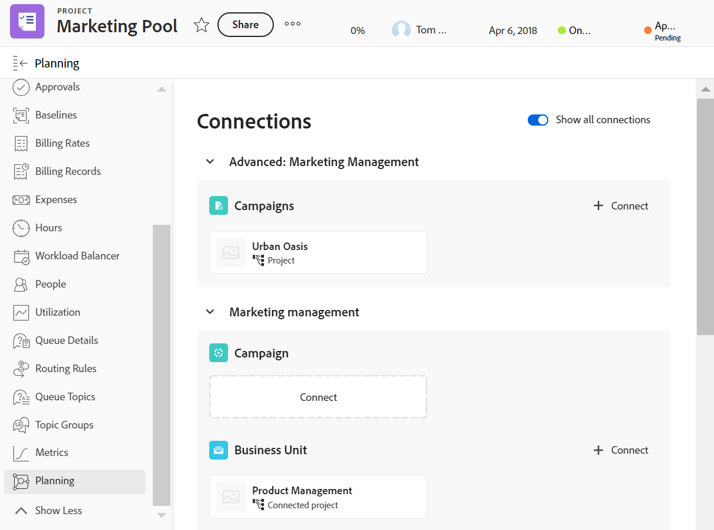

<!--add also Group and Company when they are available-->

# Verwalten von Datensätzen im Bereich &quot;Planung&quot;von Adobe Workfront-Objekten

{{planning-important-intro}}

Sie können die mit Adobe Workfront-Objekten verknüpften Workfront-Planungsdatensätze im Planungsabschnitt eines Workfront-Objekts im linken Bereich anzeigen.

Der Abschnitt Planung ist für die folgenden Workfront-Objekte verfügbar:

* Projekt
* Portfolio
* Programm
<!--* Group
* Company-->

## Zugriffsanforderungen

+++ Erweitern Sie , um die Zugriffsanforderungen für die Workfront-Planung anzuzeigen.

Für den Zugriff auf die Workfront-Planung benötigen Sie Folgendes:

<table style="table-layout:auto">
 <col>
 </col>
 <col>
 </col>
 <tbody>
    <tr>
<tr>
<td>
   
 Produkte
 </td>
   <td>
   <ul><li>
 Adobe Workfront
</li>
   <li>
 Adobe Workfront-Planung
</li></ul></td>
  </tr>  
 <tr>
   <td role="rowheader">
Adobe Workfront-Plan*
</td>
   <td>

Die folgenden Workfront-Pläne:

<ul><li>Auswählen</li>
<li>Erstklassig</li>
<li>Ultimativ</li></ul>

Die Workfront-Planung ist für veraltete Workfront-Pläne nicht verfügbar

   </td>

<tr>
   <td role="rowheader">
Adobe Workfront-Planungsplan*
</td>
   <td>

Alle

Weitere Informationen zu den einzelnen Workfront-Planungsplänen finden Sie unter <a href="https://business.adobe.com/products/workfront/pricing.html">Preise und Verpackung für Adobe Workfront</a>. 

   </td>

<tr>
   <td role="rowheader">
Adobe Workfront-Plattform
</td>
   <td>

Die Workfront-Instanz Ihres Unternehmens muss in das Adobe Unified Experience integriert sein, damit Sie auf alle Funktionen der Workfront-Planung zugreifen können.

Weitere Informationen finden Sie unter <a href="/help/quicksilver/workfront-basics/navigate-workfront/workfront-navigation/adobe-unified-experience.md">Adobe Unified Experience for Workfront</a>. 

   </td>

</tr>
  </tr>
  <tr>
   <td role="rowheader">
Adobe Workfront-Lizenz*
</td>
   <td>
   
Standard

   
Für ältere Workfront-Lizenzen ist die Workfront-Planung nicht verfügbar.

  </td>
  </tr>
  <tr>
   <td role="rowheader">
Konfiguration der Zugriffsebene
</td>
   <td> 
Anzeigen oder Aufrufen von Projekten, Programmen und Portfolios
  
</td>
  </tr>
<tr>
   <td role="rowheader">
Objektberechtigungen
</td>
   <td>
   
Zeigen Sie in Workfront die Berechtigungen für ein Projekt, Portfolio oder Programm an oder höher</a> 
 
   
In der Workfront-Planung Contribute oder höhere Berechtigungen für einen Arbeitsbereich</a> 
  
   
Systemadministratoren haben Berechtigungen für alle Arbeitsbereiche der Workfront-Planung, einschließlich derjenigen, die sie nicht erstellt haben
 
  </td>
  </tr>
<tr>
   <td role="rowheader">
Layout-Vorlage
</td>
   <td> 
Allen Benutzern, einschließlich Workfront-Administratoren, muss eine Layoutvorlage zugewiesen werden, die den Planungsbereich im Hauptmenü und den Planungsbereich für Projekte, Portfolios und Programme enthält. 
 Weitere Informationen finden Sie unter <a href="/help/quicksilver/planning/access/access-overview.md">Zugriffsübersicht</a>. 
  
  
</td>
  </tr>
 </tbody>
</table>

*Weitere Informationen zu den Zugriffsanforderungen für Workfront finden Sie unter [Zugriffsanforderungen in der Workfront-Dokumentation](/help/quicksilver/administration-and-setup/add-users/access-levels-and-object-permissions/access-level-requirements-in-documentation.md).

+++

## Überlegungen zum Abschnitt &quot;Planung&quot;von Workfront-Objekten

* Die Datensatztypen für die Workfront-Planung müssen mit den Workfront-Objekttypen verbunden sein.

  Weitere Informationen finden Sie in den folgenden Artikeln:

   * [Datensatztypen verbinden](/help/quicksilver/planning/architecture/connect-record-types.md)
   * [Datensätze verbinden](/help/quicksilver/planning/records/connect-records.md)
* Sie können den Abschnitt Planung in einem Workfront-Objekt anzeigen, auch wenn dem Workfront-Objekt keine Datensätze zugeordnet sind.
* Sie können über Workfront im Bereich Planung Datensätze mit Workfront-Objekten verbinden, wenn mit dem Workfront-Objekt mindestens ein Datensatz verbunden ist.

## Verwalten von Datensätzen im Abschnitt &quot;Planung&quot;

{{step1-to-planning}}

1. Klicken Sie auf die Karte eines Arbeitsbereichs.

   Der Arbeitsbereich wird geöffnet und die Datensatztypen werden als Karten angezeigt.

1. Klicken Sie auf die Karte eines Datensatztyps, der mit einem Workfront-Projekt, -Portfolio oder -Programm verbunden ist.
1. Wechseln Sie zu einem verbundenen Datensatzfeld, das über eine Verbindung mit einem Workfront-Objekt verfügt, entweder in der Tabellenansicht oder auf der Detailseite eines Datensatzes. Weitere Informationen finden Sie unter [Datensätze verbinden](/help/quicksilver/planning/records/connect-records.md).
1. Klicken Sie im Feld &quot;Verbundener Datensatz&quot;auf den Namen eines Workfront-Objekts.
Die Seite der Objekte wird in Workfront geöffnet.

1. Klicken Sie im linken Bereich auf **Planung** .

   >[!NOTE]
   >
   >   Ihr Workfront- oder Gruppenadministrator muss den Planungsabschnitt zu Ihrer Layoutvorlage hinzufügen, bevor er für ein Worfront-Projekt, ein -Portfolio oder ein Programm angezeigt wird.

   Der Abschnitt Planung wird mit den folgenden Informationen angezeigt:

   * Die verbundenen Datensätze werden auf einzelnen Karten angezeigt, die die folgenden Informationen enthalten:
      * Name des Datensatzes
      * Die Miniaturansicht des Datensatzes
      * Der Name des verbundenen Datensatzfelds, wie er in der Workfront-Planung angezeigt wird.
   * Datensätze werden in ihrem jeweiligen Arbeitsbereich angezeigt.

   

1. (Optional) Klicken Sie auf **Alle Verbindungen anzeigen** , um alle verbundenen Datensatztypen anzuzeigen, einschließlich der Typen ohne verbundene Datensätze. Standardmäßig werden Datensatztypen ohne verbundene Datensätze nicht angezeigt.
1. Klicken Sie auf eine Datensatzkarte, um weitere Informationen zum Datensatz anzuzeigen. Das Vorschaufeld für Datensätze wird angezeigt.
1. (Optional) Beginnen Sie mit der Änderung der Felder im Vorschaufeld des Datensatzes. Ihre Änderungen werden automatisch gespeichert.
1. (Optional) Klicken Sie oben rechts im Vorschaufenster auf das Symbol **In einer neuen Registerkarte öffnen**  , um die Detailseite des Datensatzes zu öffnen. Die Detailseite des Datensatzes wird in der Workfront-Planung geöffnet.
1. Bewegen Sie den Mauszeiger über eine Datensatzkarte, klicken Sie dann auf das Symbol zum Trennen des Datensatzes **-** und klicken Sie dann auf **Trennen**.
Folgendes geschieht:
   * Der Datensatz ist nicht mehr mit dem Workfront-Objekt verbunden.
   * Das Workfront-Objekt wird auch aus dem verbundenen Feld des Datensatzes aus der Workfront-Planung entfernt.
   * Die Werte für die Workfront-Suchfelder, die mit dem Planungsdatensatz verbunden sind, werden ebenfalls gelöscht.
1. Klicken Sie auf **Verbinden** , um weitere Datensätze für die verbundenen Datensatztypen zu verbinden. Weitere Informationen finden Sie unter [Datensätze verbinden](/help/quicksilver/planning/records/connect-records.md).

   Folgendes geschieht:

   * Die Datensätze sind sofort mit dem Workfront-Objekt verbunden und werden im Abschnitt Planung angezeigt.
   * Das Workfront-Objekt wird dem Verbindungsfeld des Workfront-Planungsdatensatzes hinzugefügt.
   * Die Werte für die Workfront-Suchfelder, die mit dem Planungsdatensatz verbunden sind, werden in der Workfront-Planung ausgefüllt.

