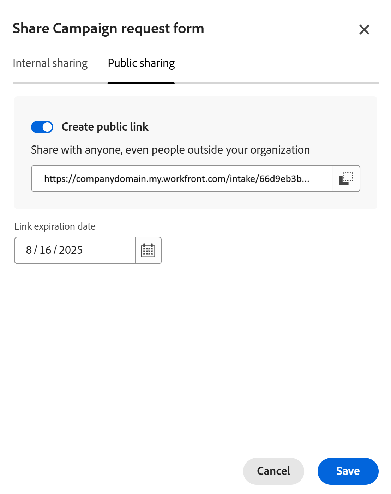

# Erstellen und Verwalten eines Anfrageformulars in Adobe Workfront Planning

<!--update the metadata with real information when making this available in TOC and in the left nav-->

<!--take Preview and Production references at Production time-->

Die hervorgehobenen Informationen auf dieser Seite beziehen sich auf Funktionen, die noch nicht allgemein verfügbar sind. Sie ist nur in der Vorschau -Umgebung für alle Kunden verfügbar. Nach den monatlichen Releases in der Produktion stehen dieselben Funktionen auch in der Produktionsumgebung für Kunden zur Verfügung, die schnelle Releases aktiviert haben. 

Informationen zu Schnellversionen finden Sie unter [Aktivieren oder Deaktivieren von Schnellversionen für Ihre Organisation](/help/quicksilver/administration-and-setup/set-up-workfront/configure-system-defaults/enable-fast-release-process.md). 

{{planning-important-intro}}

Sie können ein Anfrageformular erstellen und es mit einem Datensatztyp in Adobe Workfront Planning verknüpfen. Sie können das Formular dann für andere freigeben und diese können Anfragen zum Erstellen von Datensätzen dieses Typs senden.

In diesem Artikel wird beschrieben, wie ein Workspace-Manager ein Anfrageformular erstellen kann, das mit einem Datensatztyp verknüpft ist.

Weitere Informationen zum Senden einer Anfrage an einen Datensatztyp zum Erstellen eines Datensatzes finden Sie unter [Senden von Adobe Workfront Planning-Anfragen zum Erstellen von Datensätzen](/help/quicksilver/planning/requests/submit-requests.md).

## Zugriffsanforderungen

+++ Erweitern, um die Zugriffsanforderungen für die in diesem Artikel beschriebene Funktionalität anzuzeigen. 

<table style="table-layout:auto"> 
<col> 
</col> 
<col> 
</col> 
<tbody> 
<tr> 
   <td role="rowheader">
Adobe Workfront-Pakete
</td> 
   <td> 

Jedes Workfront-Paket und jedes Planungspaket

ODER

Beliebiges Workflow-Paket und beliebiges Planungspaket

Weitere Informationen zu den einzelnen Workfront-Planungspaketen erhalten Sie von Ihrem Workfront-Kundenbetreuer.

   </td> </tr>

</tr> 
  <tr> 
   <td role="rowheader">
Adobe Workfront-Lizenz
</td> 
   <td>
Standard
 
  </td> 
  </tr> 
  <tr> 
   <td role="rowheader">
Objektberechtigungen
</td> 
   <td>   
Verwalten von Berechtigungen für einen Arbeitsbereich oder Datensatztyp</a> 
  
   
Systemadministratoren haben Berechtigungen für alle Arbeitsbereiche, einschließlich der nicht erstellten
  </td> 
  </tr>  
</tbody> 
</table>

Weitere Informationen zu Zugriffsanforderungen für Workfront finden Sie unter [Zugriffsanforderungen in der Dokumentation zu Workfront](/help/quicksilver/administration-and-setup/add-users/access-levels-and-object-permissions/access-level-requirements-in-documentation.md).

+++

## Einschränkungen bei der Anzeige von Feldern und Werten in Anfrageformularen

Es gibt Einschränkungen darin, wie bestimmte Felder im Anfrageformular angezeigt werden und wie ihre Werte später auf der Seite Datensätze oder Anfragedetails angezeigt werden, nachdem Sie eine Anfrage senden.

Informationen zum Senden von Workfront-Planungsanfragen finden Sie unter [Senden von Adobe Workfront-Planungsanfragen zum Erstellen von Datensätzen](/help/quicksilver/planning/requests/submit-requests.md).

* Im Folgenden wird beschrieben, wie bestimmte Felder in Anfrageformularen, in von einem Anfrageformular erstellten Datensätzen oder auf der Seite mit den Anfragedetails angezeigt werden:

   * Sie können keine Felder der folgenden Typen zu einem Anfrageformular hinzufügen:

      * Erstellt von, Zuletzt geändert von, Genehmigt von
      * Erstellungsdatum, Datum der letzten Änderung, Genehmigungsdatum
      * Suchfelder der Workfront-Objekte
      * Suchfelder für verknüpfte Datensätze in Workfront

* Im Folgenden werden die Unterschiede zwischen der Anzeige von Feldformaten im Formular-Builder für Anfragen und der Formatierung der Werte der Felder im Datensatz oder auf der Seite mit den Anfragedetails beschrieben:

   * Die Felder Währung, Zahl und Prozentsatz werden im Formular-Builder als einzeiliges Textfeld angezeigt.

     Das Feldformat wird jedoch beibehalten und die Feldwerte werden nach dem Senden der Anfrage als Währung, Zahlen und Prozentsätze auf dem Datensatztyp und auf der Seite mit den Anfragedetails angezeigt.

* Im Folgenden wird beschrieben, wie einige Feldwerte auf Anfrageformularen und den Anfragedetailseiten angezeigt werden:

   * Die spezielle Formatierung für die Felder Währung, Zahl und Prozentsatz wird nicht beibehalten. Beispielsweise bleibt die Dezimalgenauigkeit für die Werte dieser Felder in diesen Bereichen nicht erhalten.
   * Personenfeldwerte werden als IDs angezeigt.
   * Formelfelder, die nicht auf andere Felder oder Berechnungen verweisen, zeigen keine Werte an. Beispiel: Ein Feld mit einer `STRING` Formel zeigt den Wert „K. A.“ an.
   * Formelfelder, die auf Währungsfelder verweisen, zeigen die Werte ohne Berücksichtigung von Wechselkursen an.
   * Die Werte der Absatzfelder zeigen auf dem Anfrageformular den Wert „K. A.“ an und auf der Seite mit den Anfragedetails werden HTML-Tags anstelle des formatierten Texts angezeigt.

## Anfrageformular erstellen

Um ein Anfrageformular zu erstellen, müssen Sie mit der Erstellung des Formulars beginnen, die Formulardetails einrichten und das Formular veröffentlichen und freigeben.

### Erstellen eines Anfrageformulars

Sie können ein Anfrageformular aus dem mit dem Formular verknüpften Datensatztyp erstellen<!--span class="preview">, or from the Requests area of Workfront.-->.

#### Erstellen eines Anfrageformulars aus einem Datensatztyp

{{step1-to-planning}}

1. Klicken Sie auf den Arbeitsbereich, in dem Sie Datensätze hinzufügen möchten.

   Der Arbeitsbereich wird geöffnet und die Datensatztypen werden als Karten angezeigt.

1. Klicken Sie auf eine Karte vom Typ Datensatz. Weitere Informationen zum Erstellen eines Datensatztyps finden Sie unter [Erstellen von Datensatztypen](/help/quicksilver/planning/architecture/create-record-types.md).

   Die Seite Datensatztyp wird in der Ansicht geöffnet, auf die Sie zuletzt zugegriffen haben. Standardmäßig wird eine Seite mit dem Datensatztyp in der Tabellenansicht geöffnet.

1. Klicken Sie auf das Menü **Mehr**  rechts neben dem Namen des Datensatztyps in der Seitenkopfzeile und klicken Sie dann auf **Anforderungsformular erstellen** oder **Anforderungsformulare verwalten**, wenn Sie bereits über ein Formular verfügen und weitere erstellen möchten.
1. (Bedingt) Wenn Sie ein weiteres Formular hinzufügen möchten, klicken Sie auf **Neues Anfrageformular**.

   Das Feld Anfrage erstellen wird geöffnet.

1. Aktualisieren Sie im Feld Anfrageformular erstellen den Namen des Anfrageformulars. Standardmäßig lautet der Name des Formulars &quot;**Formular**. <!--check this; you logged a bug to rename it to 'Untitled request form' but was it fixed?-->
1. (Optional) Fügen Sie **Anfrageformular eine** Beschreibung“ hinzu.

   <!--Not possible yet: The Description is visible when you access the request form from the Requests area of Workfront.-->

1. Klicken Sie auf **Erstellen**.

   Das Anfrageformular für den ausgewählten Datensatztyp wird auf der Registerkarte Formular geöffnet.
1. Fahren Sie fort [Einrichten von Details für das Anfrageformular](#set-up-details-for-the-request-form).

<!--

#### Create a request form from the Requests area of Workfront

1. Click the **[!UICONTROL Main Menu]** icon  in the upper-right corner of Adobe Workfront, or (if available), click the **[!UICONTROL Main Menu]** icon  in the upper-left corner, then click **Requests**.
1. In the upper-right corner of the screen, click **Request forms**.
1. (Conditional) If you are editing an existing request form, select it from the list, then continue to [Configure the form](#confgure-the-form).
1. If you are creating a new request form, in the upper-right corner of the screen, click **New request form**.

   The Create request form box opens

1. In the Create request form box, update the name of the request form. By default, the name of the form is **Untitled form**. 
1. In the Object types field, select the record type that the request form will be associated with. Record types are grouped into the workspace that they exist within.
1. (Optional) Add a **Description** for the request form. 

1. Click **Create**. 

   The request form for the selected record type opens in the Form tab.
1. Continue to [Set up details for the request form](#set-up-details-for-the-request-form).

-->

### Einrichten von Details für das Anfrageformular

Formulardetails sind in Registerkarten unterteilt.

* Auf **Registerkarte** Formular) können Sie dem Formular Felder und Inhaltselemente hinzufügen
* Auf **Registerkarte** Konfiguration“ können Sie einen Genehmigungsprozess für das Formular festlegen und Optionen für das Abschließen von Anfragen festlegen.

  >[!NOTE]
  >
  >In der Vorschau-Umgebung ersetzt die Registerkarte Einstellungen die Registerkarte Konfiguration.
  <!--* The **Automations** tab allows you to automate what will occur based on features of the request made with the form.-->

#### Einrichten von Formulardetails

1. Erstellen oder bearbeiten Sie ein Anfrageformular, wie im Abschnitt [Erstellen eines Anfrageformulars](#begin-creating-a-request-form) beschrieben.

   ODER

   Suchen Sie das Anfrageformular in der Liste Anfrageformulare , klicken Sie auf das Feld neben dem Formularnamen und klicken Sie **Formular bearbeiten** in der blauen Leiste am unteren Bildschirmrand.

   Das Anfrageformular für den ausgewählten Datensatztyp wird auf der Registerkarte Formular geöffnet.

   

   Das Anfrageformular enthält standardmäßig die folgenden Informationen:

   * Verfügbare Datensatzfelder in der Tabellenansicht des ausgewählten Datensatztyps. <!--they are working on removing the limitation below-->

   * **Standardabschnitt**: Dies ist der standardmäßige Abschnittsumbruch, den Workfront auf das Anfrageformular anwendet. Alle Datensatzfelder werden im Bereich **Standard** angezeigt.
   * **Betreff** Feld: Das Feld, das die Anfrage in Workfront identifiziert. Die Konfiguration und der Wert des Felds Betreff können nicht bearbeitet werden.

     >[!NOTE]
     >
     >* Das **Betreff** Feld erfordert einen Wert, wenn er im Anfrageformular sichtbar ist. Sie können jedoch bei Bedarf das Feld **Betreff** entfernen. Anfordernde sehen es nicht im Formular, wenn sie die Anfrage senden.
     >* Wenn in einem Anfrageformular das Feld „Betreff“ fehlt, aber ein Feld „Name“ für den Namen des zukünftigen Datensatzes vorhanden ist, wird dem Namen der Anfrage automatisch derselbe Name zugewiesen wie dem erstellten Datensatz.
     >* Wenn sowohl das Feld Betreff als auch das Feld Name im Anfrageformular fehlen, wird die Anfrage nach dem folgenden Muster benannt: `< Record name > request form < Entry date of the request >`. Der Datensatz heißt **Nicht**.

   * Alle mit dem Datensatztyp verknüpften Felder.

     Die im Anfrageformular enthaltenen Felder sind für alle sichtbar, die eine Anfrage an diesen Datensatztyp senden.

1. (Optional) Bewegen Sie den Mauszeiger über die Felder im Formular, die Sie entfernen möchten, und klicken Sie dann auf das Symbol **x**, um sie zu entfernen. Sie werden der Registerkarte **Felder** links neben dem Formular hinzugefügt.

1. (Optional) Gehen Sie wie **vor, um den Abschnitt** Standard“ aus dem Formular zu entfernen:

   1. Entfernen Sie alle Felder aus dem Standardabschnitt.
   1. Klicken Sie **Inhaltselemente** und fügen Sie einen neuen Abschnitt und dann einen Namen für den Abschnitt hinzu.
   1. Fügen Sie Felder zum neuen Abschnitt hinzu.
   1. Klicken Sie auf das **x**-Symbol, um den **Standardabschnitt“** entfernen.
1. Klicken Sie auf ein beliebiges Feld und verwenden Sie dann die Steuerelemente im rechten Bereich im Formular, um ihre Größe oder eine der folgenden Informationen zu definieren:

   * **label**: Dies ist der Name des Felds, wie er im Anfrageformular angezeigt wird. Der Name des Datensatzfelds wird dadurch nicht geändert.
   * **Anweisungen**: Fügen Sie weitere Informationen über das Feld hinzu.
   * **Erforderliches Feld festlegen**: Wenn diese Option aktiviert ist, muss das Feld einen Wert enthalten. Andernfalls kann das Formular nicht gesendet werden.
   * **Logik hinzufügen**: Definieren Sie, welche Bedingungen erfüllt sein müssen, damit das Feld angezeigt oder ausgeblendet wird.

   >[!TIP]
   >
   >   Der Feldtyp der einzelnen Felder wird oben im rechten Bereich angezeigt, nachdem Sie das Feld im Formular ausgewählt haben.
   >     

1. (Optional) Klicken Sie auf **Registerkarte** Inhaltselemente“ auf der linken Seite des Formulars und fügen Sie eines der folgenden Elemente hinzu:

   * **Beschreibender Text**
   * **Abschnittsumbruch**

   Weitere Informationen zum Erstellen eines benutzerdefinierten Formulars finden Sie unter [Erstellen eines benutzerdefinierten Formulars](/help/quicksilver/administration-and-setup/customize-workfront/create-manage-custom-forms/form-designer/design-a-form/design-a-form.md).

1. (Optional) Klicken Sie auf **Vorschau**, um anzuzeigen, wie das Formular für andere Benutzer angezeigt wird, wenn diese es zum Senden eines neuen Datensatzes verwenden werden.
1. Fahren Sie mit einer der folgenden Aktionen fort:

   * [Einrichten von Konfigurationsdetails](#set-up-configuration-details), wenn Sie weitere Details für das Formular in der Produktionsumgebung konfigurieren möchten
   * [Einstellungen konfigurieren](#configure-settings) wenn Sie weitere Details für das Formular in der Produktionsumgebung konfigurieren möchten
   * [Erstellen von Anforderungsformularen abschließen](#complete-request-form-creation) wenn Sie keine weiteren Einstellungen konfigurieren möchten.

#### Einrichten von Konfigurationsdetails

>[!NOTE]
>
>Diese Registerkarte ist nur in der Produktionsumgebung verfügbar.

Auf der Registerkarte Konfiguration können Sie den Validierungsprozess festlegen und konfigurieren, wann eine in diesem Formular erstellte Anfrage als abgeschlossen markiert wird.

1. Erstellen oder bearbeiten Sie ein Anfrageformular, wie im Abschnitt [Erstellen eines Anfrageformulars](#begin-creating-a-request-form) beschrieben.

   Das Anfrageformular für den ausgewählten Datensatztyp wird auf der Registerkarte Formular geöffnet.
1. (Optional) Richten Sie alle Formulardetails ein, wie in [Einrichten von Formulardetails](#set-up-form-details) beschrieben.

1. (Optional) Wenn Sie genehmigende Personen hinzufügen möchten, klicken Sie auf die Registerkarte **Konfiguration** und fügen Sie dann mindestens einen Benutzer oder ein Team zum Feld **genehmigende Personen** hinzu, um neue Anfragen für dieses Datensatzformular zu genehmigen.

   

   <!--below bullet list is duplicated in the Add approval to a request form article-->

   * Sie können einem Anfrageformular eine oder mehrere genehmigende Personen hinzufügen.
   * Wenn mindestens eine genehmigende Person die Anforderung ablehnt, wird die Anforderung abgelehnt und der Datensatz nicht erstellt. Die Anfrage verbleibt im Bereich Anfragen von Workfront.
   * Wenn Sie mehr als eine genehmigende Person hinzufügen und die Option Nur eine Entscheidung ist erforderlich nicht aktiviert ist, müssen alle genehmigenden Personen eine Entscheidung treffen, bevor eine Anfrage entweder genehmigt oder abgelehnt wird.
   * Wenn ein Team als genehmigende Person festgelegt ist, ist nur eine Entscheidung vom Team erforderlich.

   Weitere Informationen zum Hinzufügen von Genehmigungen zu Anfrageformularen finden Sie unter [Hinzufügen einer Genehmigung zu einem Anfrageformular](/help/quicksilver/planning/requests/add-approval-to-request-form.md).

1. (Bedingt) Wenn der Datensatz erstellt werden soll, nachdem eine der genehmigenden Personen ihn genehmigt hat, aktivieren Sie das Kontrollkästchen **Nur eine Entscheidung ist erforderlich**.

1. Wählen Sie aus, ob eine aus diesem Formular erstellte Anfrage beim Erstellen des angeforderten Objekts als abgeschlossen markiert oder ob das angeforderte Objekt fertig gestellt werden soll.
1. (Bedingt) Wenn Sie ausgewählt haben, dass die Anfrage als abgeschlossen markiert werden soll, wenn das angeforderte Objekt abgeschlossen ist, wählen Sie das Feld und den Wert aus, die angeben, wann das Objekt abgeschlossen ist. Sie können beispielsweise das Feld Status und den Wert Abgeschlossen auswählen, um die Anfrage abzuschließen, wenn der Status des erstellten Objekts auf Abgeschlossen gesetzt ist.
1. Fahren Sie <!--[Set up Automations details](#set-up-configuration-details) if you want to configure more details for the form, or go to -->[Erstellen von Anfrageformularen abschließen](#complete-request-form-creation) fort.

### Einstellungen konfigurieren

>[!NOTE]
>
>Diese Registerkarte ist nur in der Vorschau -Umgebung verfügbar.

Auf der Registerkarte Einstellungen können Sie Validierungsregeln festlegen und konfigurieren, wann eine in diesem Formular erstellte Anfrage als abgeschlossen markiert wird.

#### Konfigurieren von Genehmigungsregeln

Genehmigungsregeln definieren den Genehmigungsprozess basierend auf den Feldwerten in den gesendeten Anfragen.

Wenn beispielsweise ein Anfrageformular das Feld „Kampagnentyp“ aufweist, kann eine Regel erstellt werden, die die Anfrage an eine Person sendet, wenn das Feld den Wert „Digital“ hat, und an eine andere Person, wenn es den Wert „Drucken“ hat.

Beachten Sie beim Hinzufügen von Genehmigungsregeln Folgendes:

* Regeln werden nach Reihenfolge priorisiert. Wenn die ersten Regelbedingungen erfüllt sind, wird diese Regel angewendet, auch wenn die Bedingungen für Regeln weiter unten in der Liste ebenfalls erfüllt sind.
* Wenn keine Bedingungen erfüllt sind, wird die Standardregel angewendet.
* Sie können einer Genehmigungsregel eine oder mehrere genehmigende Personen hinzufügen.
* Wenn mindestens eine genehmigende Person die Anforderung ablehnt, wird die Anforderung abgelehnt und der Datensatz nicht erstellt. Die Anfrage verbleibt im Bereich Anfragen von Workfront.
* Wenn Sie mehr als eine genehmigende Person hinzufügen und die Option Nur eine Entscheidung ist erforderlich nicht aktiviert ist, müssen alle genehmigenden Personen eine Entscheidung treffen, bevor eine Anfrage entweder genehmigt oder abgelehnt wird.
* Wenn ein Team als genehmigende Person festgelegt ist, ist nur eine Entscheidung vom Team erforderlich.

Weitere Informationen zum Hinzufügen von Genehmigungen finden Sie [Genehmigung zu einem Anfrageformular hinzufügen](/help/quicksilver/planning/requests/add-approval-to-request-form.md).

So legen Sie Genehmigungsregeln für ein Anfrageformular fest:

1. Erstellen oder bearbeiten Sie ein Anfrageformular, wie im Abschnitt [Erstellen eines Anfrageformulars](#begin-creating-a-request-form) beschrieben.

   Das Anfrageformular für den ausgewählten Datensatztyp wird auf der Registerkarte Formular geöffnet.
1. (Optional) Richten Sie alle Formulardetails ein, wie in [Einrichten von Formulardetails](#set-up-form-details) beschrieben.

1. Um mit der Konfiguration von Genehmigungsregeln zu beginnen, klicken Sie Genehmigungssymbol).

1. (Optional) Wenn Sie einen Standardgenehmigungsprozess festlegen möchten, fügen Sie mindestens einen Benutzer oder ein Team zum Feld **Genehmigende Person** im Bereich Standardgenehmigungsregel hinzu. Aktivieren Sie dann das Kontrollkästchen **Nur eine Entscheidung ist erforderlich**, wenn der Datensatz erstellt werden soll, nachdem eine der Standardgenehmigenden ihn genehmigt hat.

   

   <!--below bullet list is duplicated in the Add approval to a request form article-->

1. (Optional) Gehen Sie für jede zusätzliche Genehmigungsregel wie folgt vor:

   1. Klicken Sie **Genehmigungsregel hinzufügen**
   1. Klicken Sie auf den Platzhaltertitel „Nicht benannte Genehmigungsregel“ und geben Sie einen Namen für die Genehmigungsregel ein.
   1. Klicken Sie **Feld auswählen** und wählen Sie das Feld aus, das die Regel aktiviert.
   1. Wählen Sie den Operator für die Regel aus. Die Operatoren variieren je nach Feldtyp.
   1. Wenn der ausgewählte Operator einen Wert benötigt, klicken Sie auf das Pluszeichen und fügen Sie einen oder mehrere Werte hinzu.
   1. (Optional) Fügen Sie weitere Bedingungen mit UND oder hinzu, indem Sie auf „Bedingung hinzufügen“ klicken und die zusätzliche Bedingung konfigurieren.
   1. Fügen Sie im Bereich Aktionen der Genehmigungsregel im Feld **Genehmigende Personen** mindestens einen Benutzer oder ein Team hinzu, der bzw. das bei der genehmigenden Person eingestellt werden soll, wenn die Bedingung erfüllt ist.
   1. (Bedingt) Wenn der Datensatz erstellt werden soll, nachdem eine der genehmigenden Personen ihn genehmigt hat, aktivieren Sie das Kontrollkästchen **Nur eine Entscheidung ist erforderlich**.

1. (Optional) Um Routing-Regeln neu anzuordnen, klicken Sie auf den Ziehgriff auf der linken Seite der Regel und ziehen Sie die Regel an die gewünschte Position.

   Die Standardregel kann nicht neu angeordnet werden.

1. (Optional) Um eine Routingregel zu löschen, klicken Sie auf das **X** rechts neben der Regel.
1. Klicken Sie **Speichern**, um die Genehmigungsregeln zu speichern.
1. Fahren Sie fort [Festlegen von Optionen für die Anfragebearbeitung](#set-request-completion-options)

#### Festlegen der Optionen für die Anfragebearbeitung

Mit Abschlussoptionen können Sie festlegen, ob eine Anfrage beim Erstellen des angeforderten Objekts als „abgeschlossen“ markiert wird oder wann das erstellte Objekt abgeschlossen ist. Sie definieren, wann das Objekt basierend auf einer angegebenen Bedingung abgeschlossen sein soll.

1. Erstellen oder bearbeiten Sie ein Anfrageformular, wie im Abschnitt [Erstellen eines Anfrageformulars](#begin-creating-a-request-form) beschrieben.

   Das Anfrageformular für den ausgewählten Datensatztyp wird auf der Registerkarte Formular geöffnet.
1. (Optional) Richten Sie alle Formulardetails ein, wie in [Einrichten von Formulardetails](#set-up-form-details) beschrieben.

1. Wählen Sie aus, ob eine aus diesem Formular erstellte Anfrage beim Erstellen des angeforderten Objekts als abgeschlossen markiert oder ob das angeforderte Objekt fertig gestellt werden soll.
1. (Bedingt) Wenn Sie ausgewählt haben, dass die Anfrage als abgeschlossen markiert werden soll, wenn das angeforderte Objekt abgeschlossen ist, wählen Sie das Feld und den Wert aus, die angeben, wann das Objekt abgeschlossen ist. Sie können beispielsweise das Feld Status und den Wert Abgeschlossen auswählen, um die Anfrage abzuschließen, wenn der Status des erstellten Objekts auf Abgeschlossen gesetzt ist.
1. Fahren Sie <!--[Set up Automations details](#set-up-configuration-details) if you want to configure more details for the form, or go to -->[Erstellen von Anfrageformularen abschließen](#complete-request-form-creation) fort.

<!--
 

#### Set up Automations

You can configure automations in Adobe Workfront Planning that, when activated, create objects in Workfront or records in Workfront Planning when triggered from a Planning record. 

For information on creating automations in other areas of Workfront Planning, see [Configure Adobe Workfront Planning automations](/help/quicksilver/planning/records/configure-automations-to-create-records.md).

1. On the automation's details page, update the following fields in the **Triggers** section: 

   * **Trigger**: Select the action that will trigger the automation. Currently, the only available trigger for request form automation is `When request object status equals pending creation`.

1. Update the following fields in the **Actions** section: 

   * **Actions**: Select the action that you want Workfront to perform when triggering the automation. This is a required field. 
   Currently, the only available Action for request form automation is `Create record`.

     >[!TIP]
     >
     >After you saved the automation, you can no longer change the action selected in this field.
1. Continue to  [Complete request form creation](#complete-request-form-creation).

-->

### Abschließen der Formularerstellung

1. Erstellen und richten Sie das Formular wie unter [Erstellen eines Anfrageformulars beginnen](#begin-creating-a-request-form) und [Details für das Anfrageformular einrichten](#set-up-details-for-the-request-form) beschrieben ein.
1. (Optional) Klicken Sie auf das **Mehr** Menü  rechts neben dem Namen des Formulars in der Kopfzeile und klicken Sie dann auf **Bearbeiten**, um den Namen des Formulars zu aktualisieren.

1. Klicken Sie auf **Veröffentlichen**, um das Formular zu veröffentlichen und einen eindeutigen Link für es zu erhalten.

   Folgendes geschieht:

   * Die Schaltfläche **Veröffentlichen** wird entfernt.
   * Die **Veröffentlichung aufheben** wird dem Formular hinzugefügt. Wenn Sie darauf klicken, ist der Zugriff auf das Formular nicht möglich.
   * Eine **Freigeben**-Schaltfläche wird dem Formular hinzugefügt.
   * Das Formular wird im Bereich Anfragen des Hauptmenüs in Workfront verfügbar.

1. Klicken Sie **Freigeben**, um das Formular für andere freizugeben.

   Informationen zum Freigeben eines Anfrageformulars finden Sie [&#x200B; Abschnitt „Freigeben eines &#x200B;](#share-a-request-form)&quot; in diesem Artikel
1. Klicken Sie auf den nach links zeigenden Pfeil links neben dem Namen des Formulars in der Kopfzeile, um das Formular zu schließen.

   Die **Formulare anfordern** Tabellenansicht wird geöffnet und das Formular wird ihr hinzugefügt.

## Verwalten vorhandener Anfrageformulare

1. Klicken Sie auf den Arbeitsbereich, in dem Sie Anfrageformulare verwalten möchten.

   Der Arbeitsbereich wird geöffnet und die Datensatztypen werden als Karten angezeigt.

1. Klicken Sie auf eine Karte vom Typ Datensatz. Weitere Informationen zum Erstellen eines Datensatztyps finden Sie unter [Erstellen von Datensatztypen](/help/quicksilver/planning/architecture/create-record-types.md).

   Die Seite Datensatztyp wird in der Ansicht geöffnet, auf die Sie zuletzt zugegriffen haben. Standardmäßig wird eine Seite mit dem Datensatztyp in der Tabellenansicht geöffnet.

1. Klicken Sie auf das **Mehr** Menü  rechts neben dem Namen des Datensatztyps in der Seitenkopfzeile und dann auf **Anfrageformulare verwalten**.

   Alle mit dem Datensatztyp verknüpften Anforderungsformulare werden in einer Tabellenansicht angezeigt.

1. (Optional) Bewegen Sie den Mauszeiger über den Namen eines Anfrageformulars in der Tabellenansicht, klicken Sie dann auf das Menü **Mehr**  rechts neben dem Formularnamen und klicken Sie auf eine der folgenden Optionen:

   * **Formular bearbeiten**: Klicken Sie hier, um weitere Informationen zum Formular zu bearbeiten.
   * **Veröffentlichung aufheben**: Klicken Sie hierauf, um die Veröffentlichung des Formulars aufzuheben. Dadurch wird es aus dem Bereich „Anfragen“ in Workfront entfernt.
   * **Freigeben**: Klicken Sie hier, um zu ändern, wer Zugriff auf das Formular hat.
   * **Link kopieren**: Klicken Sie hier, um den Link des Anfrageformulars schnell zu kopieren, ohne das Formular zu öffnen.
   * **Löschen**: Klicken Sie hier, um das Formular zu löschen. Alle über das Formular hinzugefügten Anfragen und Datensätze werden nicht gelöscht. Das Formular kann nicht wiederhergestellt werden.

   

1. Klicken Sie auf den nach links zeigenden Pfeil links neben **Anfrageformulare** in der Kopfzeile, um die Tabelle mit den Anfrageformularen zu schließen.

   Die Seite mit dem Datensatztyp wird geöffnet.
1. (Optional und bedingt) Klicken Sie auf das **Mehr** Menü  rechts neben dem Namen des Datensatztyps in der Kopfzeile und führen Sie dann einen der folgenden Schritte aus:

   1. Klicken Sie **Anfrageformular aktualisieren** um Änderungen am Anfrageformular vorzunehmen, und klicken Sie dann auf ein Anfrageformular, um es zu öffnen und zu bearbeiten.
   1. Klicken Sie auf **Link zum Anfrageformular kopieren**, um den Link zum Formular für andere freizugeben.

1. (Optional) Wechseln Sie zum Bereich **Anfragen** in Workfront und suchen Sie das freigegebene Formular, um eine Anfrage zu senden. Weitere Informationen finden Sie unter [Senden von Adobe Workfront-Planungsanfragen zum Erstellen von Datensätzen](/help/quicksilver/planning/requests/submit-requests.md).

## Anforderungsformular freigeben

1. Erstellen Sie ein Anfrageformular, wie im Abschnitt [Erstellen eines Anfrageformulars für einen Datensatztyp](#create-a-request-form-for-a-record-type) in diesem Artikel beschrieben.
1. Klicken Sie auf **Mehr** Menü  rechts neben dem Namen des Anfrageformulars auf der Seite des Datensatztyps.
1. Klicken Sie **Freigeben**, um das Formular für andere freizugeben.

1. Um das Formular intern freizugeben, wählen Sie die Registerkarte **Interne Freigabe** aus, suchen Sie im Feld **Zugriff zum Senden dieses Formulars gewähren** nach dem Namen eines Benutzers, Teams, Aufgabengebiets, einer Gruppe oder eines Unternehmens und wählen Sie es aus, wenn es in der Liste angezeigt wird. Die **Senden**-Berechtigung ist für jede Entität standardmäßig ausgewählt.

   

1. (Optional) Klicken Sie auf das Dropdown-Menü nach dem Namen einer Entität und klicken Sie dann auf **Entfernen**, um sie aus der Liste zu entfernen und die Freigabe des Formulars für sie zu beenden.

   >[!NOTE]
   >
   >Zusätzlich zu Teams, Gruppen, Unternehmen und Aufgabengebieten können Sie nur für Benutzende freigeben, die der Adobe Admin Console hinzugefügt wurden. Benutzende, die nur Workfront unterstützen, können nicht hinzugefügt werden. Weitere Informationen finden Sie unter [Verwalten von Benutzern in der Adobe Admin Console](/help/quicksilver/administration-and-setup/add-users/create-and-manage-users/admin-console.md).

1. Wählen Sie im Abschnitt **Wer kann Anfragen über dieses Formular senden** eine der folgenden Optionen aus, um anzugeben, welche Benutzertypen auf dieses Formular zugreifen können:

   * Nur eingeladene Personen haben Zugriff
   * Jede Person mit Zugriff auf den Arbeitsbereich (Ansicht oder höher)
   * Jede Person mit Zugriff auf den Arbeitsbereich (Beitrag oder höher)
1. (Optional) Klicken Sie auf **Link kopieren**, um den Link zum Formular für Personen freizugeben, die Zugriff darauf haben. Der Link wird in die Zwischenablage kopiert.
1. Um das Formular öffentlich freizugeben, wählen Sie die Registerkarte **Öffentliche Freigabe** und aktivieren Sie dann die Einstellung **Öffentlichen Link erstellen**.

   

   >[!WARNING]
   >
   >* Wenn Sie die Einstellung **Öffentlichen Link erstellen** aktivieren, kann jeder auf das Formular zugreifen und einen neuen Datensatz senden, auch Personen außerhalb Ihres Unternehmens, die kein Workfront-Konto haben.
   >
   >* Ein Formular, das die folgenden Feldtypen enthält, kann nicht öffentlich freigegeben werden:
   >
   >     * Workfront- oder AEM Assets-Verbindungen
   >     * Personen
   >

1. Wählen Sie ein **Link-Ablaufdatum** aus.

   Sie können zukünftige Termine innerhalb von 180 Tagen ab dem aktuellen Datum auswählen.

   >[!TIP]
   >
   >Nach Ablauf des Freigabedatums ist das Anfrageformular nicht mehr im Bereich Anfragen von Workfront verfügbar und die Links, die für andere Benutzende freigegeben sind, sind nicht mehr zugänglich.

   Personen erhalten nach Ablauf des Links einen Fehler, und Sie müssen das Link-Datum aktualisieren und einen neuen Link zur Freigabe generieren, bevor Personen erneut auf das Formular zugreifen können.

1. (Optional und bedingt) Klicken Sie auf **Speichern**, um die Freigabedetails für das Formular zu speichern.
1. (Bedingt) Wenn das Formular zuvor gespeichert wurde, klicken Sie auf **Link kopieren**.

   Die Formularfreigabeoptionen werden gespeichert und der Link wird in die Zwischenablage kopiert. Sie können sie jetzt für andere freigeben.

   Weitere Informationen zum Erstellen von Datensätzen über einen Link zu einem Anfrageformular finden Sie unter [Senden von Adobe Workfront Planning-Anfragen](/help/quicksilver/planning/requests/submit-requests.md).

1. Klicken Sie **Speichern** in der rechten unteren Ecke der Registerkarte **Formular**, um das Formular zu speichern.
