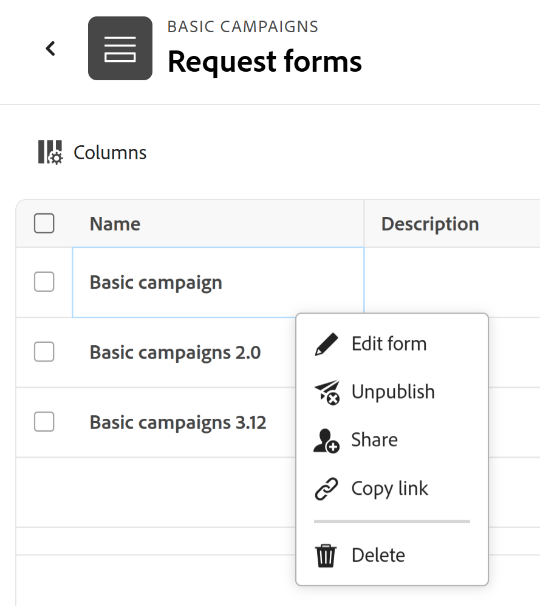

# Erstellen und Verwalten eines Anfrageformulars in Adobe Workfront Planning

<!--update the metadata with real information when making this available in TOC and in the left nav-->

<!--take Preview and Production references at Production time-->

Die hervorgehobenen Informationen auf dieser Seite beziehen sich auf Funktionen, die noch nicht allgemein verfügbar sind. Sie ist nur in der Vorschau -Umgebung für alle Kunden verfügbar. Nach den monatlichen Releases in der Produktion stehen dieselben Funktionen auch in der Produktionsumgebung für Kunden zur Verfügung, die schnelle Releases aktiviert haben. 

Informationen zu Schnellversionen finden Sie unter [Aktivieren oder Deaktivieren von Schnellversionen für Ihre Organisation](/help/quicksilver/administration-and-setup/set-up-workfront/configure-system-defaults/enable-fast-release-process.md). 

{{planning-important-intro}}

Sie können ein Anfrageformular erstellen und es mit einem Datensatztyp in Adobe Workfront Planning verknüpfen. Sie können das Formular dann für andere freigeben und diese können Anfragen zum Erstellen von Datensätzen senden.

In diesem Artikel wird beschrieben, wie ein Workspace-Manager ein Anfrageformular erstellen kann, das mit einem Datensatztyp verknüpft ist.

Weitere Informationen zum Senden einer Anfrage an einen Datensatztyp zum Erstellen eines Datensatzes finden Sie unter [Senden von Adobe Workfront Planning-Anfragen zum Erstellen von Datensätzen](/help/quicksilver/planning/requests/submit-requests.md).

## Zugriffsanforderungen

+++ Erweitern Sie , um die Zugriffsanforderungen anzuzeigen.

Sie müssen über folgenden Zugriff verfügen, um die Schritte in diesem Artikel ausführen zu können:

<table style="table-layout:auto">
 <col>
 </col>
 <col>
 </col>
 <tbody>
    <tr>
<tr>
<td>
   
 Produkte
 </td>
   <td>
   <ul><li>
 Adobe Workfront
</li>
   <li>
 Adobe Workfront-Planung
</li></ul></td>
  </tr>  
 <tr>
   <td role="rowheader">
Adobe Workfront-Plan*
</td>
   <td>

Einer der folgenden Workfront-Pläne:

<ul><li>Auswählen</li>
<li>Erstklassig</li>
<li>Ultimativ</li></ul>

Workfront Planning ist nicht für ältere Workfront-Pläne verfügbar

   </td>

<tr>
   <td role="rowheader">
Adobe Workfront-Planungspaket*
</td>
   <td>

Beliebig 
  

Weitere Informationen zu den einzelnen Workfront-Planungsplänen erhalten Sie von Ihrem Workfront Account Manager. </td>

<tr>
   <td role="rowheader">
Adobe Workfront-Plattform
</td>
   <td>

Um auf Workfront Planning zugreifen zu können, muss die Workfront-Instanz Ihres Unternehmens in das einheitliche Adobe-Erlebnis integriert sein.

Weitere Informationen finden Sie unter <a href="/help/quicksilver/workfront-basics/navigate-workfront/workfront-navigation/adobe-unified-experience.md">Adobe Unified Experience for Workfront</a>. 

   </td>

</tr>
  </tr>
  <tr>
   <td role="rowheader">
Adobe Workfront-Lizenz*
</td>
   <td>
   
Standard

   
Workfront Planning ist nicht für ältere Workfront-Lizenzen verfügbar

  </td>
  </tr>
  <tr>
   <td role="rowheader">
Konfiguration der Zugriffsebene
</td>
   <td> 
Es gibt keine Zugriffssteuerungsebenen für Adobe Workfront Planning
  
</td>
  </tr>
<tr>
   <td role="rowheader">
Objektberechtigungen
</td>
   <td>
   <ul>
   <li>
Verwalten von Berechtigungen für einen Arbeitsbereich und Datensatztyp 
</li>
    <li>
Systemadministratoren können Arbeitsbereiche verwalten, die sie nicht erstellt haben. 
</li>
    </ul>
   
Informationen zu Freigabeberechtigungen für Workfront Planning-Objekte finden Sie unter  
   <a href="/help/quicksilver/planning/access/sharing-permissions-overview.md">Übersicht über Freigabeberechtigungen in Adobe Workfront Planning</a> 
  </td>
  </tr>
<tr>
   <td role="rowheader">
Layout-Vorlage
</td>
   <td> 
In der Produktionsumgebung müssen alle Benutzer, einschließlich der Systemadministratoren, einer Layoutvorlage zugewiesen werden, die Planning enthält.

In der Vorschau-Umgebung ist für Standardbenutzer und Systemadministratoren „Planung“ standardmäßig aktiviert.
  
</td>
  </tr>
 </tbody>
</table>

*Weitere Informationen zu Zugriffsanforderungen für Workfront finden Sie unter [Zugriffsanforderungen in der Dokumentation zu Workfront](/help/quicksilver/administration-and-setup/add-users/access-levels-and-object-permissions/access-level-requirements-in-documentation.md).

+++

## Einschränkungen bei der Anzeige von Feldern und Werten in Anfrageformularen

Es gibt Einschränkungen darin, wie bestimmte Felder im Anfrageformular angezeigt werden und wie ihre Werte später auf der Seite Datensätze oder Anfragedetails angezeigt werden, nachdem Sie eine Anfrage senden.

Informationen zum Senden von Workfront-Planungsanfragen finden Sie unter [Senden von Adobe Workfront-Planungsanfragen zum Erstellen von Datensätzen](/help/quicksilver/planning/requests/submit-requests.md).

* Im Folgenden wird beschrieben, wie bestimmte Felder in Anfrageformularen, in von einem Anfrageformular erstellten Datensätzen oder auf der Seite mit den Anfragedetails angezeigt werden:

   * Sie können keine Felder der folgenden Typen zu einem Anfrageformular hinzufügen:

      * Erstellt von und Zuletzt geändert von
      * Erstellungsdatum und Datum der letzten Änderung
      * Formel
      * Suchfelder der Workfront-Objekte
      * Suchfelder für verknüpfte Datensätze in Workfront

* Im Folgenden werden die Unterschiede zwischen der Anzeige von Feldformaten im Formular-Builder für Anfragen und der Formatierung der Werte der Felder im Datensatz oder auf der Seite mit den Anfragedetails beschrieben:

   * Die Felder Währung, Zahl und Prozentsatz werden im Formular-Builder als einzeiliges Textfeld angezeigt.

     Das Feldformat wird jedoch beibehalten und die Feldwerte werden nach dem Senden der Anfrage als Währung, Zahlen und Prozentsätze auf dem Datensatztyp und auf der Seite mit den Anfragedetails angezeigt.

* Im Folgenden wird beschrieben, wie einige Feldwerte auf Anfrageformularen und den Anfragedetailseiten angezeigt werden:

   * Die spezielle Formatierung für die Felder Währung, Zahl und Prozentsatz wird nicht beibehalten. Beispielsweise bleibt die Dezimalgenauigkeit für die Werte dieser Felder in diesen Bereichen nicht erhalten.
   * Personenfeldwerte werden als IDs angezeigt.
   * Formelfelder, die nicht auf andere Felder oder Berechnungen verweisen, zeigen keine Werte an. Beispiel: Ein Feld mit einer `STRING` Formel zeigt den Wert „K. A.“ an.
   * Formelfelder, die auf Währungsfelder verweisen, zeigen die Werte ohne Berücksichtigung von Wechselkursen an.
   * Die Werte der Absatzfelder zeigen auf dem Anfrageformular den Wert „K. A.“ an und auf der Seite mit den Anfragedetails werden HTML-Tags anstelle des formatierten Texts angezeigt.

## Erstellen eines Anfrageformulars für einen Datensatztyp

{{step1-to-planning}}

1. Klicken Sie auf den Arbeitsbereich, in dem Sie Datensätze hinzufügen möchten.

   Der Arbeitsbereich wird geöffnet und die Datensatztypen werden als Karten angezeigt.

1. Klicken Sie auf eine Karte vom Typ Datensatz. Weitere Informationen zum Erstellen eines Datensatztyps finden Sie unter [Erstellen von Datensatztypen](/help/quicksilver/planning/architecture/create-record-types.md).

   Die Seite Datensatztyp wird in der Ansicht geöffnet, auf die Sie zuletzt zugegriffen haben. Standardmäßig wird eine Seite mit dem Datensatztyp in der Tabellenansicht geöffnet.

1. Klicken Sie auf das Menü **Mehr**  rechts neben dem Namen des Datensatztyps in der Seitenkopfzeile und klicken Sie dann auf **Anforderungsformular erstellen** oder **Anforderungsformulare verwalten**, wenn Sie bereits über ein Formular verfügen und weitere erstellen möchten.
1. (Bedingt) Wenn Sie ein weiteres Formular hinzufügen möchten, klicken Sie auf **Neues Anfrageformular**.
1. Aktualisieren Sie den Namen des Anfrageformulars. Standardmäßig lautet der Name des Formulars &quot;**Formular**. <!--check this; you logged a bug to rename it to 'Untitled request form' but was it fixed?-->
1. (Optional) Fügen Sie **Anfrageformular eine** Beschreibung“ hinzu.

   <!--Not possible yet: The Description is visible when you access the request form from the Requests area of Workfront.-->

1. Klicken Sie auf **Erstellen**. Das Anfrageformular für den ausgewählten Datensatztyp wird auf der Registerkarte Formular geöffnet.

   

   Das Anfrageformular enthält standardmäßig die folgenden Informationen:

   * Verfügbare Datensatzfelder in der Tabellenansicht des ausgewählten Datensatztyps. <!--they are working on removing the limitation below-->

   * **Standardabschnitt**: Dies ist der standardmäßige Abschnittsumbruch, den Workfront auf das Anfrageformular anwendet. Alle Datensatzfelder werden im Bereich **Standard** angezeigt.
   * **Betreff** Feld: Das Feld, das die Anfrage in Workfront identifiziert. Die Konfiguration und der Wert des Felds Betreff können nicht bearbeitet werden.

     >[!NOTE]
     >
     >* Das **Betreff** Feld erfordert einen Wert, wenn er im Anfrageformular sichtbar ist. Sie können jedoch bei Bedarf das Feld **Betreff** entfernen. Anfordernde sehen es nicht im Formular, wenn sie die Anfrage senden.
     >* Wenn in einem Anfrageformular das Feld „Betreff“ fehlt, aber ein Feld „Name“ für den Namen des zukünftigen Datensatzes vorhanden ist, wird dem Namen der Anfrage automatisch derselbe Name zugewiesen wie dem erstellten Datensatz.
     >* Wenn sowohl das Feld Betreff als auch das Feld Name im Anfrageformular fehlen, wird die Anfrage nach dem folgenden Muster benannt: `< Record name > request form < Entry date of the request >`. Der Datensatz heißt **Nicht**.

   * Alle mit dem Datensatztyp verknüpften Felder.

     Die im Anfrageformular enthaltenen Felder sind für alle sichtbar, die eine Anfrage an diesen Datensatztyp senden.

1. (Optional) Bewegen Sie den Mauszeiger über die Felder im Formular, die Sie entfernen möchten, und klicken Sie dann auf das Symbol **x**, um sie zu entfernen. Sie werden der Registerkarte **Felder** links neben dem Formular hinzugefügt.

   Entfernen Sie beispielsweise das Feld **Betreff**, da dies in Workfront Planning nicht angezeigt wird. <!--remove this example if this becomes visible in Planning?-->

1. (Optional) Gehen Sie wie **vor, um den Abschnitt** Standard“ aus dem Formular zu entfernen:

   1. Entfernen Sie alle Felder aus dem Standardabschnitt.
   1. Klicken Sie **Inhaltselemente** und fügen Sie einen neuen Abschnitt und dann einen Namen für den Abschnitt hinzu.
   1. Fügen Sie Felder zum neuen Abschnitt hinzu.
   1. Klicken Sie auf das **x**-Symbol, um den **Standardabschnitt“** entfernen.
1. Klicken Sie auf ein beliebiges Feld und verwenden Sie dann die Steuerelemente im rechten Bereich im Formular, um ihre Größe oder eine der folgenden Informationen zu definieren:

   * **label**: Dies ist der Name des Felds, wie er im Anfrageformular angezeigt wird. Der Name des Datensatzfelds wird dadurch nicht geändert.
   * **Anweisungen**: Fügen Sie weitere Informationen über das Feld hinzu.
   * **Erforderliches Feld festlegen**: Wenn diese Option aktiviert ist, muss das Feld einen Wert enthalten. Andernfalls kann das Formular nicht gesendet werden.
   * **Logik hinzufügen**: Definieren Sie, welche Bedingungen erfüllt sein müssen, damit das Feld angezeigt oder ausgeblendet wird.

   >[!TIP]
   >
   >   Der Feldtyp der einzelnen Felder wird oben im rechten Bereich angezeigt, nachdem Sie das Feld im Formular ausgewählt haben.
   >     

1. (Optional) Klicken Sie auf **Registerkarte** Inhaltselemente“ auf der linken Seite des Formulars und fügen Sie eines der folgenden Elemente hinzu:

   * **Beschreibender Text**
   * **Abschnittsumbruch**

   Weitere Informationen zum Erstellen eines benutzerdefinierten Formulars finden Sie unter [Erstellen eines benutzerdefinierten Formulars](/help/quicksilver/administration-and-setup/customize-workfront/create-manage-custom-forms/form-designer/design-a-form/design-a-form.md).

1. (Optional) Klicken Sie auf **Vorschau**, um anzuzeigen, wie das Formular für andere Benutzer angezeigt wird, wenn diese es zum Senden eines neuen Datensatzes verwenden werden.

1. (Optional) Klicken Sie auf die **Konfiguration** und fügen Sie dann mindestens einen Benutzer zum Feld **Genehmiger** hinzu, um neue Anfragen für dieses Datensatzformular zu genehmigen.

   

   <!--below bullet list is duplicated in the Add approval to a request form article-->

   * Wenn Sie ein Anfrageformular mit genehmigenden Personen verknüpfen, muss jede neue Anfrage zunächst von allen genehmigenden Personen genehmigt werden, bevor ein neuer Datensatz generiert wird.
   * Sie können einem Anfrageformular eine oder mehrere genehmigende Personen hinzufügen.
   * Wenn mindestens eine genehmigende Person die Anforderung ablehnt, wird die Anforderung abgelehnt und der Datensatz nicht erstellt.
   * Alle genehmigenden Personen müssen eine Entscheidung treffen, bevor eine Anfrage genehmigt oder abgelehnt wird.

     Weitere Informationen zum Hinzufügen von Genehmigungen zu Anfrageformularen finden Sie unter [Hinzufügen einer Genehmigung zu einem Anfrageformular](/help/quicksilver/planning/requests/add-approval-to-request-form.md).

1. (Optional) Klicken Sie auf das **Mehr** Menü  rechts neben dem Namen des Formulars in der Kopfzeile und klicken Sie dann auf **Bearbeiten**, um den Namen des Formulars zu aktualisieren.
1. Klicken Sie auf **Veröffentlichen**, um das Formular zu veröffentlichen und einen eindeutigen Link für es zu erhalten.

   Folgendes geschieht:

   * Die Schaltfläche **Veröffentlichen** wird entfernt.
   * Die **Veröffentlichung aufheben** wird dem Formular hinzugefügt. Wenn Sie darauf klicken, ist der Zugriff auf das Formular nicht möglich.
   * Eine **Freigeben**-Schaltfläche wird dem Formular hinzugefügt.

1. Klicken Sie **Freigeben**, um das Formular für andere freizugeben.

   

1. (Bedingt) Wählen Sie in der Produktionsumgebung eine der folgenden Optionen aus, um anzugeben, welche Benutzertypen auf dieses Formular zugreifen können:

   * Jede Person mit Zugriff auf den Arbeitsbereich (Ansicht oder höher)
   * Jede Person mit Zugriff auf den Arbeitsbereich (Beitrag oder höher)
   * Jede Person mit dem Link

   >[!WARNING]
   >
   >* Wenn Sie **Alle mit dem Link** auswählen, kann jeder auf das Formular zugreifen und einen neuen Datensatz senden, auch Personen außerhalb Ihres Unternehmens, die kein Workfront-Konto haben.
   >
   >* Ein Formular, das die folgenden Feldtypen enthält, kann nicht öffentlich freigegeben werden:
   >
   >     * Workfront- oder AEM Assets-Verbindungen
   >     * Personen
   >

1. (Bedingt) Wenn Sie in der Produktionsumgebung im vorherigen Schritt **Alle mit dem Link** ausgewählt haben, wählen Sie das **Link-Ablaufdatum** aus dem verfügbaren Kalender aus.

   Personen erhalten nach Ablauf des Links einen Fehler, und Sie müssen das Link-Datum aktualisieren und einen neuen Link zur Freigabe generieren, bevor Personen erneut auf das Formular zugreifen können.

   Sie können zukünftige Termine innerhalb von 180 Tagen ab dem aktuellen Datum auswählen.

   >[!TIP]
   >
   >Nach Ablauf des Freigabedatums ist das Anfrageformular nicht mehr im Bereich Anfragen von Workfront verfügbar und die Links, die für andere Benutzende freigegeben sind, sind nicht mehr zugänglich.

1. (Optional und bedingt) Klicken Sie in der Produktionsumgebung auf **Link speichern und kopieren** um die Freigabedetails für das Formular zu speichern. Wenn das Formular zuvor gespeichert wurde, klicken Sie auf **Link kopieren**.

   Die Formularfreigabeoptionen werden gespeichert und der Link wird in die Zwischenablage kopiert. Sie können sie jetzt für andere freigeben.

   Weitere Informationen zum Erstellen von Datensätzen über einen Link zu einem Anfrageformular finden Sie unter [Senden von Adobe Workfront Planning-Anfragen](/help/quicksilver/planning/requests/submit-requests.md).

1. (Bedingt) Um eine Vorschau in der Vorschau-Umgebung für Benutzer freizugeben, wählen Sie die Registerkarte Interne Freigabe aus, suchen Sie nach dem Namen des Benutzers und wählen Sie ihn aus, wenn er in der Liste angezeigt wird.
1. (Bedingt) Um einen öffentlichen Link in der Vorschauumgebung zu erstellen, wählen Sie die Registerkarte Öffentliche Freigabe aus und aktivieren Sie dann die Option Öffentlichen Link erstellen . Sie können dann den Link hier kopieren oder ein Ablaufdatum für den Link festlegen.
1. Klicken Sie **Speichern** in der rechten unteren Ecke der Registerkarte **Formular**, um das Formular zu speichern.

1. Klicken Sie auf den nach links zeigenden Pfeil links neben dem Namen des Formulars in der Kopfzeile, um das Formular zu schließen.

   Die **Formulare anfordern** Tabellenansicht wird geöffnet und das Formular wird ihr hinzugefügt.

1. (Optional) Bewegen Sie den Mauszeiger über den Namen eines Anfrageformulars in der Tabellenansicht, klicken Sie dann auf das Menü **Mehr**  rechts neben dem Formularnamen und klicken Sie auf eine der folgenden Optionen:

   * **Formular bearbeiten**: Klicken Sie hier, um weitere Informationen zum Formular zu bearbeiten.
   * **Veröffentlichung aufheben**: Klicken Sie hierauf, um die Veröffentlichung des Formulars aufzuheben. Dadurch wird es aus dem Bereich „Anfragen“ in Workfront entfernt.
   * **Freigeben**: Klicken Sie hier, um zu ändern, wer Zugriff auf das Formular hat.
   * **Link kopieren**: Klicken Sie hier, um den Link des Anfrageformulars schnell zu kopieren, ohne das Formular zu öffnen.
   * **Löschen**: Klicken Sie hier, um das Formular zu löschen. Alle über das Formular hinzugefügten Anfragen und Datensätze werden nicht gelöscht. Das Formular kann nicht wiederhergestellt werden.

   

1. Klicken Sie auf den nach links zeigenden Pfeil links neben **Anfrageformulare** in der Kopfzeile, um die Tabelle mit den Anfrageformularen zu schließen.

   Die Seite mit dem Datensatztyp wird geöffnet.
1. (Optional und bedingt) Klicken Sie auf das **Mehr** Menü  rechts neben dem Namen des Datensatztyps in der Kopfzeile und führen Sie dann einen der folgenden Schritte aus:

   1. Klicken Sie **Anfrageformular aktualisieren** um Änderungen am Anfrageformular vorzunehmen, und klicken Sie dann auf ein Anfrageformular, um es zu öffnen und zu bearbeiten.
   1. Klicken Sie auf **Link zum Anfrageformular kopieren**, um den Link zum Formular für andere freizugeben.

1. (Optional) Wechseln Sie zum Bereich **Anfragen** in Workfront und suchen Sie das freigegebene Formular, um eine Anfrage zu senden. Weitere Informationen finden Sie unter [Senden von Adobe Workfront-Planungsanfragen zum Erstellen von Datensätzen](/help/quicksilver/planning/requests/submit-requests.md).

