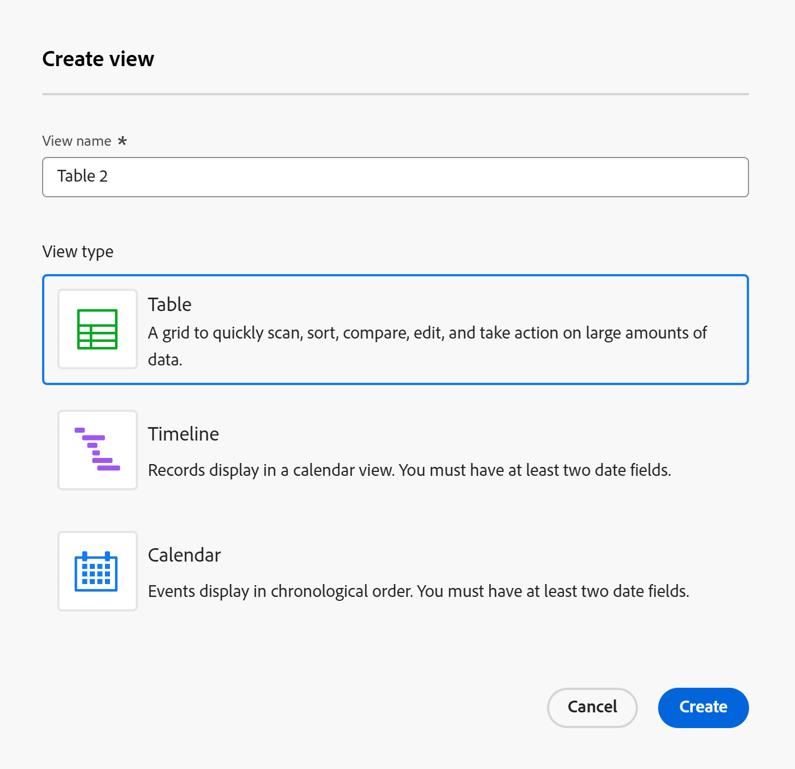

# Datensatzansichten verwalten

<!--

The highlighted information on this page refers to functionality not yet generally available. It is available only in the Preview environment for all customers. After the monthly releases to Production, the same features are also available in the Production environment for customers who enabled fast releases.    

For information about fast releases, see [Enable or disable fast releases for your organization](/help/quicksilver/administration-and-setup/set-up-workfront/configure-system-defaults/enable-fast-release-process.md). 

-->

{{planning-important-intro}}

Nachdem Sie im Adobe Workfront-Planungsbereich einen Datensatztyp ausgewählt haben, können Sie alle Datensätze dieses Typs auf verschiedene Arten anzeigen.

Sie können Datensätze in Ansichten verschiedener Formate anzeigen, sodass Sie Informationen so untersuchen und verstehen können, wie es für Sie am besten geeignet ist. Egal, ob Sie einen strukturierten Überblick, eine chronologische Geschichte, ein datumsbasiertes Layout oder eine einfache scrollbare Liste wünschen, jede Ansicht bietet eine einzigartige Perspektive.

Datensätze können in den folgenden Ansichten angezeigt werden:

* Tabelle

  Weitere Informationen finden Sie unter [Verwalten der Tabellenansicht](/help/quicksilver/planning/views/manage-the-table-view.md).

* Timeline

  Weitere Informationen finden Sie unter [Verwalten der Zeitleisten-Ansicht](/help/quicksilver/planning/views/manage-the-timeline-view.md).

* Kalender

  Weitere Informationen finden Sie unter [Verwalten der Kalenderansicht](/help/quicksilver/planning/views/manage-the-calendar-view.md).

* Liste

  Sie können Datensätze auf einer verbundenen Datensatzseite in einer Listenansicht anzeigen.

  >[!IMPORTANT]
  >
  >Sie können keine Listenansicht auf eine Liste von Datensätzen auf einer Datensatztypseite anwenden. Sie können eine Listenansicht nur auf einer Seite „Verbundener Datensatz“ eines Datensatzes auf eine Liste verbundener Projekte anwenden. <!--this will change-->

  Weitere Informationen finden Sie in den folgenden Artikeln:

   * [Hinzufügen einer Seite „Verbundene Datensätze“ zu einem Datensatz](/help/quicksilver/planning/records/add-a-connected-records-page-to-a-record.md)
   * [Verwalten der Listenansicht](/help/quicksilver/planning/views/manage-the-list-view.md)

In diesem Artikel werden die folgenden Informationen zu Datensatzansichten beschrieben:

* [Erstellen und Bearbeiten einer Ansicht](#create-or-edit-record-views)
* [Aktivieren der Echtzeit-Anwesenheitsindikatoren in einer Ansicht](#enable-the-real-time-presence-indicator-in-a-view)
  <!--* [Add a view as a favorite](#add-a-view-as-a-favorite) - not possible yet-->

Weitere Informationen zum Verwalten von Workfront Planning-Datensatzansichten finden Sie in den folgenden Artikeln:

* [Datensatzansichten löschen](/help/quicksilver/planning/views/delete-record-views.md)
* [Doppelte Datensatzansichten](/help/quicksilver/planning/views/duplicate-record-views.md)
* [Ansichten freigeben](/help/quicksilver/planning/access/share-views.md)

## Zugriffsanforderungen

+++ Erweitern Sie , um die Zugriffsanforderungen für die Funktion in diesem Artikel anzuzeigen. 

<table style="table-layout:auto"> 
<col> 
</col> 
<col> 
</col> 
<tbody> 
    <tr> 
<tr> 
</tr>   
<tr> 
   <td role="rowheader">
Adobe Workfront-Paket
</td> 
   <td> 

Beliebiges Workfront und beliebiges Planungspaket

Beliebiger Workflow und beliebiges Planungspaket

Weitere Informationen zu den einzelnen Workfront-Planungspaketen erhalten Sie von Ihrem Workfront-Kundenbetreuer. 
 
   </td> 
  <tr> 
   <td role="rowheader">
Adobe Workfront-Lizenz
</td> 
   <td>
 Standard zum Erstellen und Löschen von Ansichten

   
Mitwirkender oder höher zum Aktualisieren von Ansichtselementen

  </td> 
  </tr> 
  <tr> 
   <td role="rowheader">
Objektberechtigungen
</td> 
   <td>   
Verwalten der Berechtigungen für eine Ansicht
  
   
Anzeigeberechtigungen für eine Ansicht, um die Anzeigeeinstellungen vorübergehend zu ändern oder zu duplizieren
 </td> 
  </tr> 
<tr>
   <td role="rowheader">
Layout-Vorlage
</td>
   <td> Benutzenden mit einer Light- oder Contributor-Lizenz muss eine Layout-Vorlage zugewiesen werden, die Planning enthält.
   
Für Standardbenutzer und Systemadministratoren sind die Planungsbereiche standardmäßig aktiviert.

</li></ul>
</td>
  </tr> 
</tbody> 
</table>

Weitere Informationen zu Zugriffsanforderungen für Workfront finden Sie unter [Zugriffsanforderungen in der Dokumentation zu Workfront](/help/quicksilver/administration-and-setup/add-users/access-levels-and-object-permissions/access-level-requirements-in-documentation.md).

+++

<!--Old:
<table style="table-layout:auto"> 
<col> 
</col> 
<col> 
</col> 
<tbody> 
    <tr> 
<tr> 
<td> 
   
 Products
 </td> 
   <td> 
   <ul><li>
 Adobe Workfront
</li> 
   <li>
 Adobe Workfront Planning
</li></ul></td> 
  </tr>   
<tr> 
   <td role="rowheader">
Adobe Workfront plan*
</td> 
   <td> 

Any of the following Workfront plans:
 
<ul><li>Select</li> 
<li>Prime</li> 
<li>Ultimate</li></ul> 

Workfront Planning is not available for legacy Workfront plans
 
   </td> 
<tr> 
   <td role="rowheader">
Adobe Workfront Planning package*
</td> 
   <td> 

Any 
 

For more information about what is included in each Workfront Planning plan, contact your Workfront account manager. 
 
   </td> 
 <tr> 
   <td role="rowheader">
Adobe Workfront platform
</td> 
   <td> 

Your organization's instance of Workfront must be onboarded to the Adobe Unified Experience to be able to access Workfront Planning.
 

For more information, see <a href="/help/quicksilver/workfront-basics/navigate-workfront/workfront-navigation/adobe-unified-experience.md">Adobe Unified Experience for Workfront</a>. 
 
   </td> 
   </tr> 
  </tr> 
  <tr> 
   <td role="rowheader">
Adobe Workfront license*
</td> 
   <td>
 Standard to create and delete views

   
Contributor or higher to update view elements

   
Workfront Planning is not available for legacy Workfront licenses
 
  </td> 
  </tr> 
  <tr> 
   <td role="rowheader">
Access level configuration
</td> 
   <td> 
There are no access level controls for Adobe Workfront Planning
   
</td> 
  </tr> 
<tr> 
   <td role="rowheader">
Object permissions
</td> 
   <td>   
Manage permissions to a view
  
   
View permissions to a view to temporarily change the view settings or to duplicate it
 </td> 
  </tr> 
<tr>
   <td role="rowheader">
Layout template
</td>
   <td> Users with a Light or Contributor license must be assigned a layout template that includes Planning.
   
Standard users and System Administrators have the Planning areas enabled by default.

</li></ul>
</td>
  </tr>
</tbody> 
</table>-->

## Überlegungen beim Arbeiten mit Datensatzansichten

* Die Ansichten in Workfront Planning sind vom Datensatztyp abhängig. Es ist nicht möglich, dieselbe Ansicht auf zwei verschiedene Datensatztypen anzuwenden.
* Ansichten, die Sie erstellen, sind nur für Sie und die Benutzer sichtbar, für die Sie die Ansichten freigeben.
* Wenn Sie eine Ansicht ändern oder löschen, wird sie für alle Benutzenden geändert und gelöscht, die über Berechtigungen für die Ansicht verfügen.
* Jeder Benutzer kann maximal 100 Ansichten erstellen. Sie können für einen Datensatztyp mehr als 100 Ansichten anzeigen, aber ein Benutzer kann nur 100 Ansichten erstellen.
* Obwohl einige Ansichtselemente auf mehrere Ansichten für denselben Datensatz angewendet werden können, sind sie für jede Datensatzansicht eindeutig:

   * Filter
   * Sortieren (für die Tabellenansicht)
   * Zeilenfarben (für die Tabellenansicht)
   * Felder (für die Tabellenansicht)
   * Aufschlüsselung (für die Zeitleisten-Ansicht)
   * Gruppierung (für die Tabellen- und Zeitleisten-Ansichten)
   * Darstellung der Leiste (für die Zeitleisten- und Kalenderansichten)
   * Zeilenhöhe (für die Tabelle und die monatliche Kalenderansicht)

  Wenn Sie beispielsweise einen Filter in einer Tabellenansicht erstellen, sind die Filterergebnisse nur in der ausgewählten Ansicht (der Tabellenansicht) sichtbar und nicht in allen Ansichten, die mit dem Datensatztyp verknüpft sind.

  >[!TIP]
  >
  >Einige Ansichtselemente sind nicht für alle Ansichten verfügbar.

## Ähnlichkeiten und Unterschiede zwischen Datensatzansichten

Die folgende Tabelle zeigt die Ähnlichkeiten und Unterschiede zwischen der Tabellen-, Timeline- und Kalenderansicht:

<!--some of these are NOT available right now; if you make this public, comment out the ones not there-->

| Funktion | Tabellenansicht | Timeline-Ansicht | Kalenderansicht | Listenansicht |
|-----------------------------------------------------------------------|------------|---------------|--------------|---------|
| Anzeigen von Datensätzen in einem Tabellenformat | ✓ |              | | ✓ |
| Alle Felder als Spalten in einer Tabelle oder Liste anzeigen | ✓ |              |    | ✓ |
| Felder (oder Spalten) ein- oder ausblenden | ✓ |               |    | ✓ |
| Feldwerte für jeden Datensatz bearbeiten | ✓ |               |             | ✓ |
| Datensätze als neue Zeilen in der Ansicht hinzufügen | ✓ |               |        | ✓ |
| Felder als neue Spalten in der Ansicht hinzufügen | ✓ |               |         | ✓ |
| Zeilen aus einer externen Liste kopieren und in eine Tabelle einfügen | ✓ |               |          | ✓ |
| Anzeigen von Datensätzen in einer Zeitleiste |            | ✓ |             |  |
| Datensätze filtern | ✓ | ✓ | ✓ | ✓ |
| Anzeigen von Datensätzen in einem Kalender |           |              | ✓ |  |
| Datensätze gruppieren | ✓ | ✓ |  |  |
| Datensätze sortieren | ✓ |              |  | ✓ |
| Farbcode-Datensätze | ✓ | ✓ | ✓ |  |
| Farbgruppierungen |           | ✓ |  |  |
| Nach bestimmten Datensätzen suchen | ✓ | ✓ |  | ✓ |
| Ansicht für andere freigeben | ✓ | ✓ | ✓ | ✓ |
| Öffnet die Datensatzseite aus der Ansicht | ✓ | ✓ |    | ✓ |
| Anzeigen von Datensätzen nach Jahr und Quartal |           | ✓ |    |  |
| Datensätze nach Monat anzeigen |           | ✓ | ✓ |  |
| Datensätze nach Woche anzeigen |           |               | ✓ |  |
| Exportieren von Informationen aus einer Ansicht | ✓ |               |    |  |
| Im Vollbildmodus anzeigen | ✓ | ✓ | ✓ |  |
| Erstellen von Datensätzen in der Ansicht | ✓ | ✓ | ✓ | ✓ |
| Datensätze nach ihren Verbindungen aufschlüsseln |          | ✓ |    |  |

## Ansichten erstellen oder bearbeiten {#create-or-edit-views}

Die Informationen in diesem Abschnitt gelten für die folgenden Ansichtstypen:

* Tabelle
* Timeline
* Kalender

Weitere Informationen zu Listenansichten finden Sie unter [Verwalten der Listenansicht](/help/quicksilver/planning/views/manage-the-list-view.md).

{{step1-to-planning}}

1. Klicken Sie auf die Karte eines Arbeitsbereichs.

   Der Arbeitsbereich wird geöffnet und die Datensatztypen werden als Karten angezeigt.

1. Klicken Sie auf eine Karte vom Typ Datensatz.

   Die Seite mit dem Datensatztyp wird geöffnet.

   Standardmäßig werden alle Datensätze des ausgewählten Typs in der Tabellenansicht angezeigt.

1. Klicken Sie auf das Dropdown neben dem Namen der aktuellen Ansicht und dann auf **+Neue Ansicht**.

1. Wählen Sie aus den folgenden Ansichtstypen:

   * Tabelle
   * Timeline
   * Kalender

1. Wählen Sie einen Ansichtstyp aus und klicken Sie dann auf **Erstellen**. Dem Dropdown-Menü wird eine neue Ansicht hinzugefügt.

   >[!TIP]
   >
   >Beim Erstellen eines Datensatztyps wird standardmäßig auch die Tabellenansicht erstellt.
   >
   >Um eine Timeline- oder eine Kalenderansicht zu erstellen, muss der Datensatztyp, für den Sie die Ansicht erstellen, mindestens zwei Datumsfelder enthalten.
   >
   >Andernfalls sind die Optionen Timeline und Kalender abgeblendet.
   >  

   

1. (Optional) Um eine vorhandene Ansicht zu bearbeiten, klicken Sie auf das Dropdown-Menü rechts neben dem Namen der aktuellen Ansicht, geben Sie dann den Namen einer Ansicht in das Feld **Suche** ein und drücken Sie die Eingabetaste auf der Tastatur.
1. (Optional) Ziehen Sie aus dem Dropdown-Menü Ansicht die Ansichten per Drag-and-Drop in die gewünschte Reihenfolge.

   

1. (Bedingt) Klicken Sie **Weiter**, wenn Sie eine Timeline- oder Kalenderansicht erstellen.

   Standardmäßig weist Workfront der Ansicht einen der folgenden Namen zu:

   * `Table < number >`
   * `Timeline < number >`
   * `Calendar < number >`

   Die Zahl ist ein automatisch generierter Inkrement.

1. (Bedingt) Wählen Sie die **Start** und **Enddatum** für die Datensätze aus, die in der Zeitleisten- oder Kalenderansicht angezeigt werden.

   >[!NOTE]
   >
   >    Sie können aus Datensatzdatumsfeldern auswählen oder Datumsfelder aus verbundenen Datensatz- oder Objekttypen nachschlagen.
   >
   >Sie müssen Aggregatoren für Datumsfelder (MAX oder MIN) verwenden, wenn Sie beim Verbinden von Datensatztypen Suchfelder auswählen. Nur durch Hinzufügen der Aggregatoren können Sie die Daten der Verbindungen als Start- und Enddaten für die Timeline- und Kalenderansichten verwenden.
   >
   >Weitere Informationen finden Sie unter [Verbinden von Datensatztypen](/help/quicksilver/planning/architecture/connect-record-types.md).

1. Klicken Sie auf **Erstellen**.

   Die Ansicht wird als neue Registerkarte angezeigt. Ansichten werden in der chronologischen Reihenfolge ab dem Zeitpunkt angezeigt, zu dem sie erstellt oder für Sie freigegeben wurden.
1. (Optional) Klicken Sie auf das **Mehr**-Menü  neben der letzten Ansicht, um alle Ansichten für den ausgewählten Datensatztyp anzuzeigen.

   Zusätzliche Ansichten werden unter dem Menü **Mehr** nach der letzten Registerkarte Ansicht angezeigt. Die Zahl neben dem Menü **Mehr** zeigt die Anzahl der zusätzlichen Ansichten an.
1. (Optional) Um eine Ansicht nach ihrer Erstellung umzubenennen, klicken Sie auf das Dropdown-Menü „Ansicht“ und dann auf das Menü **Mehr**  > **Umbenennen**, um den Ansichtsnamen zu aktualisieren

   ODER

   Doppelklicken Sie auf den Namen der Ansicht und geben Sie den neuen Namen ein.  <!--ensure there is not another saving step here?!-->

1. (Optional) Klicken Sie auf das **Vollbildsymbol**-Symbol  um eine beliebige Ansicht im Vollbildmodus zu öffnen. Klicken Sie dann auf das **Vollbildsymbol beenden**-Symbol  oder auf der Tastatur auf Esc , um den Vollbildmodus zu verlassen.

1. (Optional) Informationen zum Verwalten eines bestimmten Ansichtstyps finden Sie in folgenden Artikeln:

   * [Verwalten der Tabellenansicht](/help/quicksilver/planning/views/manage-the-table-view.md)
   * [Zeitleisten-Ansicht verwalten](/help/quicksilver/planning/views/manage-the-timeline-view.md)
   * [Kalenderansicht verwalten](/help/quicksilver/planning/views/manage-the-calendar-view.md)

## Aktivieren der Echtzeit-Anwesenheitsindikator in einer Ansicht

Sie können sehen, ob andere Benutzer gleichzeitig Datensätze bearbeiten, indem Sie den Echtzeit-Präsenzindikatoren in der Ansicht folgen.

>[!NOTE]
>
>Sie können keine Echtzeit-Präsenzindikatoren in einer Listenansicht anzeigen.

Die Avatare anderer Benutzer, die Datensatzinformationen gleichzeitig bearbeiten, wie Sie standardmäßig in der oberen rechten Ecke aller Datensatzansichten anzeigen.

Wenn Sie die Tabellenansicht anzeigen, können Sie auch anzeigen, welches Feld ein anderer Benutzer zum Zeitpunkt der Anzeige des Datensatzes bearbeitet.

Weitere Informationen finden Sie unter [Verwalten der Tabellenansicht](/help/quicksilver/planning/views/manage-the-table-view.md).

<!--## Add a view as a favorite - this is not possible yet-->
