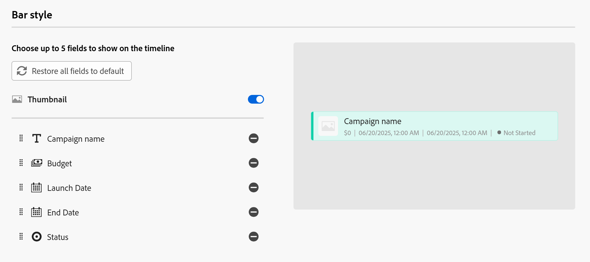
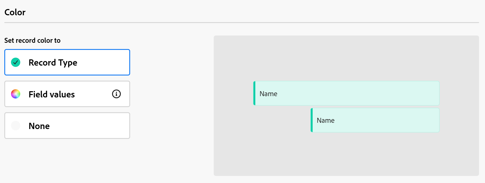

# Kalenderansicht verwalten

Die hervorgehobenen Informationen auf dieser Seite beziehen sich auf Funktionen, die noch nicht allgemein verfügbar sind. Sie ist nur in der Vorschau -Umgebung für alle Kunden verfügbar. Nach den monatlichen Releases in der Produktion stehen dieselben Funktionen auch in der Produktionsumgebung für Kunden zur Verfügung, die schnelle Releases aktiviert haben. 

Informationen zu Schnellversionen finden Sie unter [Aktivieren oder Deaktivieren von Schnellversionen für Ihre Organisation](/help/quicksilver/administration-and-setup/set-up-workfront/configure-system-defaults/enable-fast-release-process.md). 

{{planning-important-intro}}

Auf der Seite Datensatztyp können Sie Datensätze und ihre Felder in einer Kalenderansicht anzeigen.

Weitere Informationen zu Adobe Workfront Planning-Ansichten und deren Verwaltung finden Sie unter [Verwalten von Datensatzansichten](/help/quicksilver/planning/views/manage-record-views.md).

## Zugriffsanforderungen

+++ Erweitern Sie , um die Zugriffsanforderungen anzuzeigen. 

<table style="table-layout:auto"> 
<col> 
</col> 
<col> 
</col> 
<tbody> 
    <tr> 
<tr> 
<td> 
   
 Produkte
 </td> 
   <td> 
   <ul><li>
 Adobe Workfront
</li> 
   <li>
 Adobe Workfront-Planung
</li></ul></td> 
  </tr>   
<tr> 
   <td role="rowheader">
Adobe Workfront-Plan*
</td> 
   <td> 

Einer der folgenden Workfront-Pläne:
 
<ul><li>Auswählen</li> 
<li>Prime</li> 
<li>Ultimate</li></ul> 

Workfront Planning ist nicht für ältere Workfront-Pläne verfügbar
 
   </td> 
<tr> 
   <td role="rowheader">
Adobe Workfront-Planungspaket*
</td> 
   <td> 

Beliebig 
 

Weitere Informationen zu den einzelnen Workfront-Planungsplänen erhalten Sie von Ihrem Workfront Account Manager. 
 
   </td> 
 <tr> 
   <td role="rowheader">
Adobe Workfront-Plattform
</td> 
   <td> 

Um auf Workfront Planning zugreifen zu können, muss die Workfront-Instanz Ihres Unternehmens in das einheitliche Adobe-Erlebnis integriert sein.
 

Weitere Informationen finden Sie unter <a href="/help/quicksilver/workfront-basics/navigate-workfront/workfront-navigation/adobe-unified-experience.md">Adobe Unified Experience for Workfront</a>. 
 
   </td> 
   </tr> 
  </tr> 
    <td role="rowheader">
Adobe Workfront-Lizenz*
</td> 
   <td>
 Standard zum Erstellen und Löschen von Ansichten

   
Mitwirkender oder höher zum Aktualisieren von Ansichtselementen

   
Workfront Planning ist nicht für ältere Workfront-Lizenzen verfügbar
 
  </td> 
  </tr> 
  <tr> 
   <td role="rowheader">
Konfiguration der Zugriffsebene
</td> 
   <td> 
Es gibt keine Zugriffssteuerungsebenen für Adobe Workfront Planning
   
</td> 
  </tr> 
<tr> 
   <td role="rowheader">
Objektberechtigungen
</td> 
   <td>   
Verwalten der Berechtigungen für eine Ansicht
  
   
Anzeigeberechtigungen für eine Ansicht, um die Anzeigeeinstellungen vorübergehend zu ändern oder zu duplizieren
 </td> 
  </tr> 
<tr>
   <td role="rowheader">
Layout-Vorlage
</td>
   <td> Benutzenden mit einer Light- oder Contributor-Lizenz muss eine Layout-Vorlage zugewiesen werden, die Planning enthält.
   
Für Standardbenutzer und Systemadministratoren sind die Planungsbereiche standardmäßig aktiviert.

</li></ul>
</td>
  </tr>

</tbody> 
</table>

*Weitere Informationen zu Zugriffsanforderungen für Workfront finden Sie unter [Zugriffsanforderungen in der Dokumentation zu Workfront](/help/quicksilver/administration-and-setup/add-users/access-levels-and-object-permissions/access-level-requirements-in-documentation.md).

+++   

## Verwalten einer Kalenderansicht {#manage-a-calendar-view}

<!--insert screen shot of calendar view-->

Beachten Sie Folgendes:

* Eine Kalenderansicht kann nur erstellt werden, wenn mindestens zwei Datumsfelder mit einem Datensatztyp verknüpft sind. Wenn Sie ein oder kein Datumsfeld mit einem Datensatztyp verknüpft haben, ist die Option Kalenderansicht abgeblendet.

  Sie können aus Datensatzdatumsfeldern auswählen oder Datumsfelder aus verbundenen Datensatz- oder Objekttypen nachschlagen.
* Die folgenden Szenarien sind vorhanden:

   * Wenn sowohl das Start- als auch das Enddatum keine Werte haben, werden die Datensätze nicht im Kalender angezeigt
   * Wenn das Start- oder Enddatum keinen Wert hat, wird der Datensatz als eintägiges Ereignis angezeigt
   * Wenn das Startdatum nach dem Enddatum liegt, wird der Datensatz nicht im Kalender angezeigt.

Verwalten einer Kalenderansicht:

1. Wechseln Sie zur Seite „Datensatztyp“, für die Sie den Kalender anzeigen möchten.
1. Erstellen Sie eine Kalenderansicht, wie im Artikel [Verwalten von Datensatzansichten](/help/quicksilver/planning/views/manage-record-views.md) beschrieben.

   

   

   Die Datensätze, die mit dem ausgewählten Datensatztyp verknüpft sind, werden als Balken in einem Kalender angezeigt. Standardmäßig entspricht die Farbe der Balken der Farbe des Datensatzsymbols.

   

1. Führen Sie einen der folgenden Schritte aus, um durch den Kalender zu navigieren:

   * Klicken Sie auf die Symbole links und rechts oben im Kalender oder verwenden Sie den horizontalen Bildlauf, um im Kalender vor- und rückwärts zu blättern.
   * Klicken **oben** auf „Heute“, um den Kalender auf das heutige Datum zu zentrieren.
   * Wählen Sie eine der folgenden Optionen aus dem Dropdown-Menü Zeitrahmen aus, um die Zeitinkremente zu aktualisieren:

      * **Monat**: Datensätze werden in einem monatlichen Kalender angezeigt.

      * **Woche**: Die Datensätze werden in den folgenden Bereichen angezeigt:

         * Datensätze, die sich über mehrere Tage erstrecken, werden oben im Kalender angezeigt.
         * Datensätze, die einen Tag oder weniger dauern, werden in der unteren Hälfte der Kalenderansicht angezeigt. Wenn Sie ausgewählt haben, die Stunde des Start- und Enddatums anzuzeigen, wird der Datensatz zum entsprechenden Zeitpunkt innerhalb des Tages angezeigt, an dem er auftritt.

1. (Optional) Klicken Sie auf das Symbol **Vollbild** (, um die Ansicht im Vollbildmodus zu öffnen, dann auf das Symbol **Vollbildmodus beenden** ( oder auf der Tastatur mit Esc, um den Vollbildmodus zu verlassen.  

1. Führen Sie einen der folgenden Schritte aus, um Datensätze in der Kalenderansicht zu erstellen oder ihre Daten zu bearbeiten:

   * Doppelklicken Sie auf eine beliebige Stelle im Kalender, um einen Datensatz zu erstellen. 

     Weitere Informationen finden Sie unter [Erstellen von &#x200B;](/help/quicksilver/planning/records/create-records.md)

   * Klicken Sie auf den linken oder rechten Rand einer Datensatzleiste und ziehen Sie ihn dann per Drag-and-Drop an eine neue Position. Wenn Sie die Größe der Balken der Datensätze ändern, werden das Start- oder Enddatum sofort aktualisiert. 

   * Ziehen Sie die Datensatzbalken per Drag-and-Drop, um ihre Position und ihr Datum zu aktualisieren. Durch Verschieben der Datensatzbalken wird das Start- und Enddatum sofort aktualisiert.

     Weitere Informationen finden Sie unter [Datensätze bearbeiten](/help/quicksilver/planning/records/edit-records.md).

1. Aktualisieren Sie die folgenden Ansichtselemente wie in den folgenden Unterabschnitten beschrieben:
   * [Filter](#add-filters)
   * [Zeilenhöhe](#modify-row-height)
   * [Einstellungen](#edit-the-calendar-view-settings)

   <!--* [Grouping](#add-grouping)-->
   <!--* [Sort](#add-sort) not sure if this is present in calendar views?!; also check the anchor and make sure it's correct-->

### Filter hinzufügen

Mithilfe von Filtern können Sie die Informationsmenge reduzieren, die auf dem Bildschirm angezeigt wird.

Beachten Sie beim Arbeiten mit Filtern in der Kalenderansicht Folgendes:

<!-- this list is almost identical to the one for the table view - update both-->

* Die Filter, die Sie für eine Kalenderansicht erstellen, funktionieren unabhängig von den Filtern in jeder anderen Ansicht, die auf denselben Datensatztyp angewendet wird.

* Die Filter sind für die ausgewählte Ansicht eindeutig. Auf zwei Kalenderansichten desselben Datensatztyps können unterschiedliche Filter angewendet werden.

* Zwei Benutzer, die dieselbe Kalenderansicht betrachten, sehen denselben Filter, der derzeit angewendet wird.

* Die Filter, die Sie für eine Kalenderansicht erstellen, können nicht benannt werden.

* Das Entfernen von Filtern entfernt sie von allen, die auf denselben Datensatztyp zugreifen wie Sie und die dieselbe Ansicht anzeigen wie Sie.

* Sie können nach verbundenen Datensatzfeldern oder Suchfeldern filtern.

* Sie können nach Suchfeldern filtern, die mehrere Werte anzeigen.

So fügen Sie einen Filter zu einer Kalenderansicht hinzu:

1. Erstellen Sie eine Kalenderansicht für eine Datensatztypseite, wie im Artikel [Verwalten von Datensatzansichten](/help/quicksilver/planning/views/manage-record-views.md) beschrieben.
1. Wählen Sie eine Kalenderansicht aus und klicken Sie dann **Filter** in der Kalendersymbolleiste.
1. Klicken Sie **Bedingung hinzufügen** und fügen Sie die folgenden Informationen hinzu:

   * **Feld auswählen** nach dem Sie <!-- the tip below might change--> filtern möchten

   * **Wählen Sie eine Option** oder einen Filtermodifikator), um festzulegen, welche Art von Bedingung das Feld erfüllen muss

     In der folgenden Tabelle werden die verfügbaren Modifikatoren für jeden Feldtyp angezeigt.

     <table>
        <thead>
        <tr>
            <th><b>Feldtyp</b></th>
            <th><b>Modifikatoren</b></th>
        </tr>
        </thead>
        <tbody>
        <tr>
            <td>Einzeilig, Absatz, Formel </td>
            <td>
Enthält

            
Enthält nicht

            
Ist

            
Ist nicht

            
Ist leer

            
Ist nicht leer
</td>
        </tr>
        <tr><td>Einzelauswahl</td>
            <td>
Ist

            
Ist nicht

            
Ist ein beliebiges von

            
Ist keines von

            
Ist leer

            
Ist nicht leer
</td>
        </tr>
        <tr>
            <td>Mehrfachauswahl, Personen</td>
            <td>
Hat eines von

            
Hat alle von

            
Ist genau

            
Hat keines von

            
Ist leer

            
Ist nicht leer
</td>
        </tr>
        <tr>
            <td>Zahl, Prozentsatz, Währung</td>
            <td>
=

            
≠

            
 &lt; 

            
&gt;

            
≤

            
≥

            
Ist leer

            
Ist nicht leer
</td>
        </tr>
        <tr>
            <td>Datum</td>
            <td>
Ist

            
Ist nicht

            
Ist nach

            
Ist vor

            
Ist zwischen

Ist nicht zwischen

            
Ist leer

Ist nicht leer
</td>
        </tr>

     <tr>
            <td>Kontrollkästchen</td>
            <td>
Ist

        </tr>
        </tbody>
        </table>

   * Einen Wert für das ausgewählte Feld auswählen.

   

   Es gibt keine Begrenzung dafür, wie viele Filterbedingungen Sie hinzufügen können.

1. (Optional) Klicken Sie auf **Bedingung hinzufügen**, um eine weitere Filteroption hinzuzufügen, und wiederholen Sie die obigen Schritte. Die Anzahl der angewendeten Filter wird links neben dem Symbol Filter angezeigt.
1. Klicken Sie auf die folgenden Operatoren, um anzugeben, wie die Filterbedingungen verbunden werden und angewendet werden sollen:

   * **AND**: Alle angegebenen Bedingungen müssen erfüllt sein.
   * **OR**: Jede der angegebenen Bedingungen muss erfüllt sein. Dies ist die Standardoption.

   1. (Optional) Fügen Sie zusätzliche Operatoren **AND** oder **OR** zwischen mehreren Bedingungsgruppierungen hinzu.

      

   Die Liste der Datensätze wird automatisch gefiltert.  <!--at this time, you can't name and save the filter - but will this change?!-->
   <!-- asked on the task for the simple filters whether there is a limitation for how many statements a filter can have?!-->

1. (Optional) Klicken Sie auf das Symbol **x**, um eine Filterbedingung zu entfernen.
1. (Optional) Klicken Sie auf **Filter**, um das Feld „Filter“ zu schließen. <!--right now you cannot "clear all" for filters, but this might come later-->

### Zeilenhöhe ändern

Sie können die Zeilenhöhe einer Kalenderzelle ändern, um die Anzahl der in jeder Zelle angezeigten Datensatzleisten zu erhöhen oder zu verringern.

Die Anzahl der im Kalender angezeigten Datensätze hängt von der Anzahl der Felder ab, die in den Balken der Datensätze angezeigt werden.

>[!TIP]
>
>Diese Einstellung ist nur verfügbar, wenn der Kalender nach Monat angezeigt wird.

1. Erstellen Sie eine Kalenderansicht für eine Datensatztypseite, wie im Artikel [Verwalten von Datensatzansichten](/help/quicksilver/planning/views/manage-record-views.md) beschrieben.
1. (Bedingt) Zeigen Sie die Kalenderansicht nach Monat an und klicken Sie dann auf **Zeilenhöhe** in der Kalendersymbolleiste.
1. Wählen Sie aus den folgenden Optionen:

   <table>
    <thead>
    <tr>
        <th><b>Zeilenhöhenoption</b></th>
        <th><b>Standardmäßige maximale Anzahl von Datensätzen</b></th>
    </tr>
    </thead>
    <tbody>
    <tr>
        <td>Kurz</td>
        <td>
Enthält:

   <ul><li>2 Datensätze mit 1 Feld</li>
    <li>1 Datensatz mit mehr als 1 Feld</li></ul>
        </td>
    </tr>
    <tr><td>Standard</td>
        <td>
Enthält:

   <ul><li>4 Datensätze mit 1 Feld</li>
    <li>2 Datensätze mit mehr als 1 Feld</li></ul>
        </td>
    </tr>
    <tr>
        <td>Mittel</td>
        <td>
Enthält:

   <ul><li>8 Datensätze mit 1 Feld</li>
    <li>4 Datensatz mit mehr als 1 Feld</li></ul>
        </td>
    </tr>
    <tr>
        <td>Groß</td>
        <td>
Enthält:

   <ul><li>12 Datensätze mit 1 Feld</li>
    <li>6 Datensatz mit mehr als 1 Feld</li></ul>
        </td>
    </tr>
    <tr>
        <td>An Inhalt anpassen</td>
        <td>
Alle Datensätze sind sichtbar, bis zu 500 Datensätze
</td>
    </tr>
    </tbody>
    </table>

1. (Optional) Klicken Sie auf **Mehr**, wenn Datensätze im Kalender nicht sichtbar sind.

### Bearbeiten der Einstellungen für die Kalenderansicht

Aktualisieren Sie die Einstellungen der Kalenderansicht, um anzugeben, welche Informationen in der Ansicht angezeigt werden.

1. Erstellen Sie eine Kalenderansicht für einen Datensatztyp, wie im Artikel [Verwalten von Datensatzansichten](/help/quicksilver/planning/views/manage-record-views.md) beschrieben.
1. Klicken Sie auf **Einstellungen**.
1. Klicken Sie **linken Bereich auf** Datum und Uhrzeit) und wählen Sie dann ein **Startdatum** und ein **Enddatum** aus, die im Kalender angezeigt werden sollen. Sie können das standardmäßige Start- und Enddatum oder ein beliebiges verfügbares Datumsfeld auswählen.

   Die Balken, die die Datensätze darstellen, beginnen an dem Datum, das Sie als Startdatum angeben, und enden an dem Datum, das dem Enddatum entspricht.

   >[!NOTE]
   >
   >* Datensätze, die keine Werte für das Start- oder Enddatum haben oder deren Startdatum nach dem Enddatum liegt, werden nicht in der Kalenderansicht angezeigt.
   >
   >* Wenn Sie zusätzliche Datensätze mithilfe der Option Aufschlüsselung anzeigen, sind das Start- und Enddatum die Daten des Hauptdatensatzes. Start- und Enddatum für die verbundenen Datensätze in diesem Bereich können nicht ausgewählt werden.

1. Klicken Sie **linken** auf „Balkenstil“, um anzugeben, welche Informationen in den Datensatzleisten angezeigt werden sollen.

   Das primäre Feld (oder der Titel) des Datensatzes, wie in der Tabellenansicht des Datensatzes definiert, ist standardmäßig ausgewählt.
   <!--adjust this when the primary field is released??-->

1. (Optional und bedingt) Wenn Sie den Datensätzen Miniaturen hinzugefügt haben, wählen Sie die Option **Miniatur**, um das mit den Datensätzen verknüpfte Bild in der Datensatzleiste anzuzeigen.

   >[!NOTE]
   >
   >    Sie müssen zunächst Miniaturen in der Tabellenansicht hinzufügen, bevor Sie sie in der Kalenderansicht anzeigen können. Weitere Informationen finden Sie unter [Hinzufügen einer Miniaturansicht zu einem Datensatz](/help/quicksilver/planning/records/add-thumbnails-to-records.md).

1. Klicken Sie **Feld hinzufügen**, klicken Sie dann in das Feld **Suchfelder** und klicken Sie auf das Feld, das Sie hinzufügen möchten.

   >[!TIP]
   >
   >   * Sie müssen die Felder erstellen, bevor Sie sie den Datensatzleisten hinzufügen können.
   > 
   >   * Es muss mindestens ein Feld ausgewählt sein. **Name** ist standardmäßig ausgewählt.
   >
   >   * Sie können bis zu 5 Felder hinzufügen.

   Eine Vorschau davon, wie die Balken im Kalender aussehen werden, wird auf der rechten Seite angezeigt.

   

1. Klicken Sie **linken** auf „Farbe“, um die Farben der Datensätze im Kalender anzupassen.

   

1. Wählen **im Abschnitt Datensatzfarbe festlegen** eine der folgenden Optionen aus, um eine Farbe für die Datensätze festzulegen:

   * **Datensatztyp**: Die Farbe der Datensatzleisten im Kalender entspricht der Farbe des ausgewählten Datensatztyps. Dies ist die Standardoption.
   * **Feldwerte**: Die Farbe der Datensätze entspricht der Farbe eines von Ihnen angegebenen Felds.
   * **Keine**: Die Datensätze werden in einem weißen Balken angezeigt.

1. (Bedingt) Wenn Sie **Feldwerte** für die Datensatzfarben ausgewählt haben, wählen Sie ein Feld aus dem Dropdown-Menü **Übereinstimmung der Datensatzfarbe mit** aus.

   

   Nur Felder mit farbcodierten Optionen werden im Dropdown-Menü angezeigt.

   Beispielsweise können Felder mit Mehrfachauswahl oder Einzelauswahl farbcodierte Optionen haben.

   Wenn Sie kein Feld mit farbcodierten Optionen für den ausgewählten Datensatztyp haben, ist diese Option abgeblendet.

1. Klicken Sie auf **Speichern**.

   Die Datensätze werden in der Kalenderansicht mit den von Ihnen ausgewählten Spezifikationen angezeigt.