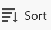

<!--add these to the metadata above when publishing:

author: Alina
recommendations: noDisplay, noCatalog-->

# Verwalten der Listenansicht in Adobe Workfront Planning

<!--The information highlighted on this page refers to functionality not yet generally available. It is available only in the Preview environment for all customers. After the monthly releases to Production, the same features are also available in the Production environment for customers who enabled fast releases.    

For information about fast releases, see [Enable or disable fast releases for your organization](/help/quicksilver/administration-and-setup/set-up-workfront/configure-system-defaults/enable-fast-release-process.md). -->

{{planning-important-intro}}

In Adobe Workfront Planning können Sie Objekte und deren Felder in einer Listenansicht anzeigen, wenn Sie auf der Seite „Verbundene Datensätze“ eines Datensatzes darauf zugreifen.

In diesem Artikel wird beschrieben, wie Sie eine Listenansicht auf der Seite „Verbundene Datensätze“ eines Datensatzes erstellen oder bearbeiten und die Objekte in der Ansicht bearbeiten können.

## Zugriffsanforderungen

+++ Erweitern Sie , um die Zugriffsanforderungen für die Funktion in diesem Artikel anzuzeigen. 

<table style="table-layout:auto"> 
<col> 
</col> 
<col> 
</col> 
<tbody> 
    <tr> 
<tr> 
</tr>   
<tr> 
   <td role="rowheader">
Adobe Workfront-Paket
</td> 
   <td> 

Beliebiges Workfront und beliebiges Planungspaket

Beliebiger Workflow und beliebiges Planungspaket

Weitere Informationen zu den einzelnen Workfront-Planungspaketen erhalten Sie von Ihrem Workfront-Kundenbetreuer. 
 
   </td> 
  <tr> 
   <td role="rowheader">
Adobe Workfront-Lizenz
</td> 
   <td>
 Standard zum Erstellen und Löschen von Ansichten

   
Mitwirkender oder höher zum Aktualisieren von Ansichtselementen

  </td> 
  </tr> 
  <tr> 
   <td role="rowheader">
Objektberechtigungen
</td> 
   <td>   
Verwalten der Berechtigungen für eine Ansicht
  
   
Anzeigeberechtigungen für eine Ansicht, um die Anzeigeeinstellungen vorübergehend zu ändern oder zu duplizieren
 </td> 
  </tr> 
<tr>
   <td role="rowheader">
Layout-Vorlage
</td>
   <td> Benutzenden mit einer Light- oder Contributor-Lizenz muss eine Layout-Vorlage zugewiesen werden, die Planning enthält.
   
Für Standardbenutzer und Systemadministratoren sind die Planungsbereiche standardmäßig aktiviert.

</li></ul>
</td>
  </tr> 
</tbody> 
</table>

Weitere Informationen zu Zugriffsanforderungen für Workfront finden Sie unter [Zugriffsanforderungen in der Dokumentation zu Workfront](/help/quicksilver/administration-and-setup/add-users/access-levels-and-object-permissions/access-level-requirements-in-documentation.md).

+++ 

## Überlegungen zu Listenansichten

* Datensätze können nicht in den Datensatztypseiten in einer Listenansicht angezeigt werden. Sie können die folgenden Objekte nur in einer Listenansicht anzeigen, wenn Sie sie auf der Seite „Verbundene Datensätze“ eines Datensatzes anzeigen:

   * Workfront-Projekte

  Informationen zum Erstellen einer verbundenen Datensatzseite finden Sie unter [Hinzufügen einer verbundenen Datensatzseite zu einem Datensatz](/help/quicksilver/planning/records/add-a-connected-records-page-to-a-record.md).
* Bevor Sie eine Listenansicht auf einer verbundenen Datensatzseite eines Datensatzes anzeigen können, müssen Sie Workfront-Projekte mit Planungs-Datensatztypen verbinden. Weitere Informationen finden Sie unter [Verbinden von Datensatztypen](/help/quicksilver/planning/architecture/connect-record-types.md).
* Listenansichten ähneln erweiterten Listen. Weitere Informationen finden Sie unter [Verwenden erweiterter Listen](/help/quicksilver/workfront-basics/navigate-workfront/use-lists/enhanced-lists.md).

## Verwalten einer Listenansicht {#manage-a-list-view}

{{step1-to-planning}}

1. Klicken Sie auf eine Arbeitsbereichskarte und dann auf eine Karte vom Typ Datensatz.
1. Klicken Sie in einer beliebigen Ansicht auf den Namen eines Datensatzes, um die Vorschau- oder Detailseite des Datensatzes zu öffnen.
1. Fügen Sie eine **Seite „Verbundene Datensätze** für verbundene Projekte hinzu, wie im Artikel [Hinzufügen einer Seite „Verbundene Datensätze“ zu einem Datensatz](/help/quicksilver/planning/records/add-a-connected-records-page-to-a-record.md) beschrieben.

   Auf der Seite „Verbundene Datensätze“ werden Projekte angezeigt, die mit dem Datensatz in der Listenansicht verbunden sind.

   

<!--BELOW IS ALL FROM TABLE VIEW - EDIT EVERYTHING-->

1. Erstellen Sie eine Tabellenansicht, wie im Artikel [Verwalten von Datensatzansichten](/help/quicksilver/planning/views/manage-record-views.md) beschrieben.

   

1. (Optional) Klicken Sie auf **Zeilenhöhe** und wählen Sie dann eine der folgenden Optionen, um die Höhe der Tabellenzeilen zu ändern:
   * Kurz
   * Mittel
   * Groß

1. (Optional) Klicken Sie auf das **Vollbildsymbol**-Symbol  um die Ansicht im Vollbildmodus zu öffnen. Klicken Sie dann auf das **Vollbildsymbol beenden**-Symbol  oder auf der Tastatur auf Esc , um den Vollbildmodus zu verlassen.

1. Aktualisieren Sie die folgenden Ansichtselemente wie in den folgenden Unterabschnitten beschrieben:
   * [Spalten (oder Felder)](#add-columns-or-fields)
   * [Zeilen (oder Datensätze)](#add-rows-or-records)
   * [Filter](#add-filters)
   * [sort](#add-a-sort)
   * [Gruppierung](#add-groupings)
   * [Zeilenfarben](#add-row-colors)
   * [Echtzeit-Präsenz-Indikator](#enable-the-real-time-presence-indicator)

### Spalten (oder Felder) hinzufügen {#add-columns}

Die Spaltenüberschriften einer Tabellenansicht zeigen Felder an, die mit den Datensätzen in der Ansicht verknüpft sind. Die in der Tabellenansicht angezeigten Felder werden auch im Abschnitt Details eines Datensatzes angezeigt.

Weitere Informationen finden Sie unter [Datensätze bearbeiten](/help/quicksilver/planning/records/edit-records.md).

<!--this is not available yet:You can display record fields (or columns) in both a table and a timeline view. However, the number of columns displayed in the table of the timeline view is limited and you cannot add columns in addition to those selected by default.-->

Das Hinzufügen von Spalten zu einer Ansicht entspricht dem Hinzufügen von Feldern zu einem Datensatztyp.

Sie können bis zu 500 Felder (oder Spalten) in einer Tabellenansicht hinzufügen.

1. Wechseln Sie zu einer Seite vom Typ Datensatz und klicken Sie auf eine Registerkarte Tabellenansicht oder klicken Sie auf **+ Ansicht** um eine neue Ansicht hinzuzufügen, und wählen Sie dann **Tabelle** aus.

1. Beginnen Sie mit dem Hinzufügen von Feldern (oder Spalten), wie im Artikel [Erstellen von Feldern](/help/quicksilver/planning/fields/create-fields.md) beschrieben.

   Die hinzugefügten Spalten sind für alle Benutzer sichtbar, die auf den Datensatztyp zugreifen, und werden als neue Felder auf der Datensatzseite hinzugefügt.

1. (Optional) Klicken Sie auf das **Felder**-Symbol  in der Symbolleiste, suchen Sie nach einem Feld und heben Sie dann die Auswahl des Umschalters rechts neben dem Feldnamen auf, um das Feld auszublenden.

1. Führen Sie einen der folgenden Schritte aus, um die Spalten in der Tabelle neu anzuordnen:

   * Nehmen Sie die Spaltenüberschrift und ziehen Sie sie per Drag-and-Drop an die gewünschte Position. Die verschobene Spalte wird kurz mit einem blauen Hintergrund angezeigt, bis Sie andere Anpassungen an der Tabelle vornehmen.

   * Klicken Sie **der Symbolleiste der** auf „Felder“, ziehen Sie die Felder per Drag-and-Drop in die gewünschte Reihenfolge und klicken Sie dann außerhalb des Felds **Sichtbarkeit und Reihenfolge**, um es zu schließen.

     

     >[!TIP]
     >
     >* Standardmäßig ist das Feld Name immer das erste Feld in der Tabellenansicht. Dies wird als primäres Feld betrachtet.
     >
     >* Das Feld Name kann nur dann an eine andere Position verschoben werden, wenn Sie ein anderes Feld als primäres Feld angeben. Weitere Informationen finden Sie in Schritt 4. <!--accurate?-->
     >
     >

   * Ersetzen Sie das Feld in der ersten Spalte durch ein anderes Feld, indem Sie das primäre Feld ändern. Weitere Informationen finden Sie in Schritt 4. <!--accurate?-->

1. (Optional) Bewegen Sie den Mauszeiger über einen Feldnamen in der Spaltenüberschrift eines Felds, das nicht in der ersten Spalte der Tabelle angezeigt wird, klicken Sie auf den nach unten zeigenden Pfeil rechts neben dem Feldnamen und dann auf **Als Primärfeld festlegen**.

   

1. Klicken Sie **Bestätigung auf** Feld festlegen“.

   Das Feld wird zu einem primären Feld, d. h. es wird als erste Spalte der Tabellenansicht angezeigt. Das vorherige primäre Feld wird in die zweite Spalte verschoben.

   Primäre Felder werden zum Titel des Datensatzes und werden im Kopfzeilenbereich der Datensatzseite und überall dort angezeigt, wo die Datensätze angezeigt werden. Beispielsweise wird der Datensatztitel in verbundenen Feldern und in allen Ansichten angezeigt. Weitere Informationen zu Primärfeldern finden Sie unter [Übersicht über Primäre Felder](/help/quicksilver/planning/fields/primary-field-overview.md).

1. Klicken und ziehen Sie die Spaltentrennlinien und legen Sie sie an der gewünschten Stelle ab, um die Breite der Spalten zu erhöhen.

   >[!TIP]
   >
   >Die Änderungen an der Spaltenbreite und -reihenfolge sind dauerhaft und für alle Benutzer sichtbar, die auf den Datensatztyp zugreifen.

1. Bewegen Sie den Mauszeiger über die Spaltenüberschrift, klicken Sie dann auf den nach unten zeigenden Pfeil und dann auf **Feld ausblenden**

   ODER

   Klicken Sie **der** auf „Felder“ und deaktivieren Sie den Umschalter, der den Feldern (oder Spalten) zugeordnet ist, die Sie ausblenden möchten. Das Feld **Sichtbarkeit und Reihenfolge** wird angezeigt.

   >[!TIP]
   >
   >Die Anzahl der ausgeblendeten Felder wird links neben dem Symbol Felder in der Symbolleiste angezeigt.
   >
   >Standardmäßig werden ausgeblendete Felder nicht im Vorschaufeld **Details** des Datensatzes angezeigt. Alle Felder werden auf der Detailseite des Datensatzes angezeigt. Weitere Informationen finden Sie unter [Seitenlayout für Einträge verwalten](/help/quicksilver/planning/records/manage-the-record-page.md)

1. Klicken Sie auf **Felder** und aktivieren Sie den Umschalter, der mit den Feldern verknüpft ist, die Sie in den Spalten der Tabelle anzeigen möchten. Standardmäßig werden alle Felder angezeigt.

1. Gehen Sie folgendermaßen vor, um schnell Datensätze zu finden, die einem Keyword entsprechen:

   1. in das Feld **Suche**  und beginnen Sie mit der Eingabe eines Keywords, das mit einem beliebigen Feld eines Datensatzes verknüpft ist, der auf dem Bildschirm angezeigt wird. Die Anzahl der richtigen Übereinstimmungen wird neben dem Suchelement angezeigt, und das Feld mit der richtigen Übereinstimmung ist hervorgehoben.

      

      Sie können jedes Wort oder jedes Sonderzeichen verwenden, das auf dem Bildschirm sichtbar ist.

      Sie können keine Schlüsselwörter verwenden, die mit Feldern verknüpft sind, die in der Tabellenansicht ausgeblendet sind.

   1. Drücken Sie **Eingabetaste** auf der Tastatur, um zum nächsten gefundenen Feld zu wechseln.

   1. (Optional) Wenn mehr als eine Übereinstimmung vorliegt, klicken Sie auf die Pfeile nach oben und unten rechts neben dem Suchbegriff, um alle Übereinstimmungen in der Tabelle zu finden.

   1. Klicken Sie auf das **x**-Symbol im Suchfeld, um den Suchbegriff zu löschen.

### Zeilen (oder Datensätze) hinzufügen {#add-rows}

Die Zeilen einer Tabellenansicht zeigen einzelne Datensätze des ausgewählten Datensatztyps an.

Sie können bis zu 50.000 Datensätze (oder Zeilen) für einen Datensatztyp haben.

1. Wechseln Sie zu einer Seite vom Typ Datensatz und klicken Sie auf eine Registerkarte Tabellenansicht oder klicken Sie auf **+ Ansicht** um eine neue Ansicht hinzuzufügen, und wählen Sie dann **Tabelle** aus.

1. Beginnen Sie mit dem Hinzufügen von Datensätzen (oder Zeilen), wie im Artikel [Erstellen von Datensätzen](/help/quicksilver/planning/records/create-records.md) beschrieben.

   Die Datensätze, die Sie in der Tabellenansicht hinzufügen, werden sofort gespeichert und sind für alle Benutzer sichtbar, die über Ansichtsberechtigungen oder höhere Berechtigungen für den Arbeitsbereich verfügen.

1. (Optional) Fügen Sie jedem Datensatz eine Miniaturansicht hinzu, klicken Sie **oben rechts in** Tabelle auf Felder und wählen Sie dann den Umschalter für das Feld **Miniaturansicht**, um es links neben dem Primärfeld anzuzeigen. Diese Option ist standardmäßig deaktiviert.

   Weitere Informationen finden Sie unter [Hinzufügen einer Miniaturansicht zu einem Datensatz](/help/quicksilver/planning/records/add-thumbnails-to-records.md).

1. (Optional) Wählen Sie einen oder mehrere Datensätze in einer Zeile aus und ziehen Sie dann das **handle**-Symbol  auf die linke Seite des Datensatzes, um die Zeilen neu anzuordnen.

   >[!NOTE]
   >
   >Sie können Zeilen nicht neu anordnen, wenn Sie mindestens eine Sortierung auf die Tabellenansicht anwenden.
   >
   >Die Änderungen an der Zeilenreihenfolge sind für alle Benutzer sichtbar, die auf den Datensatztyp zugreifen

<!-- this section below links from the timeline view; consider splitting them if they become different-->

### Filter hinzufügen {#add-filters}

Mit Filtern können Sie die Menge der auf dem Bildschirm angezeigten Informationen reduzieren.

Beachten Sie beim Arbeiten mit Filtern in der Tabellenansicht Folgendes:

<!-- this list is almost identical to the one for the table view - update both-->

* Die Filter, die Sie für die Tabellenansicht erstellen, funktionieren unabhängig von den Filtern in der Zeitleisten -Ansicht, wenn sie auf denselben Datensatztyp angewendet werden.

* Die Filter sind für die ausgewählte Ansicht eindeutig. Auf zwei Tabellenansichten desselben Datensatztyps können unterschiedliche Filter angewendet werden. Zwei Benutzer, die dieselbe Tabellenansicht betrachten, sehen denselben Filter, der derzeit angewendet wird.

* Die von Ihnen erstellten und auf eine Tabellenansicht angewendeten Filter können nicht benannt werden.

* Das Entfernen von Filtern entfernt sie von allen, die auf denselben Datensatztyp zugreifen wie Sie und verwendet dieselbe Ansicht wie Sie.

* Sie können nach verbundenen Datensatzfeldern oder Suchfeldern filtern.

* Sie können nach Suchfeldern filtern, die mehrere Werte anzeigen.

* Sie können auf ein Feld verweisen, das bis zu vier Ebenen vom aktuellen Datensatztyp entfernt ist. Wenn Sie beispielsweise einen Filter für einen Aktivitätsdatensatztyp erstellen und die Aktivität mit dem Produktdatensatztyp verbunden ist, der mit dem Kampagnendatensatztyp verbunden ist, der mit einem Workfront-Projekt verbunden ist, können Sie das Projektbudget in dem Filter referenzieren, den Sie für den Aktivitätsdatensatztyp erstellen.

So fügen Sie einen Filter zu einer Tabellenansicht hinzu:

1. Erstellen Sie eine Tabellenansicht für eine Seite vom Typ Datensatz, wie im Artikel [Verwalten von Datensatzansichten](/help/quicksilver/planning/views/manage-record-views.md) beschrieben.
1. Wählen Sie eine Tabellenansicht aus und klicken **oben** auf „Filter“.
1. Klicken Sie **Bedingung hinzufügen** und fügen Sie die folgenden Informationen hinzu:

   * Suchen Sie nach einem Feld und wählen Sie es aus, wenn es in der Liste angezeigt wird.

   * **Wählen Sie eine Option** oder einen Filtermodifikator), um festzulegen, welche Art von Bedingung das Feld erfüllen muss

     In der folgenden Tabelle werden die verfügbaren Modifikatoren für jeden Feldtyp angezeigt.

     <table>
        <thead>
        <tr>
            <th><b>Feldtyp</b></th>
            <th><b>Modifikatoren</b></th>
        </tr>
        </thead>
        <tbody>
        <tr>
            <td>Einzeilig, Absatz, Formel </td>
            <td>
Enthält

            
Enthält nicht

            
Ist

            
Ist nicht

            
Ist leer

            
Ist nicht leer
</td>
        </tr>
        <tr><td>Einzelauswahl</td>
            <td>
Ist

            
Ist nicht

            
Ist ein beliebiges von

            
Ist keines von

            
Ist leer

            
Ist nicht leer
</td>
        </tr>
        <tr>
            <td>Mehrfachauswahl, Personen</td>
            <td>
Hat eines von

            
Hat alle von

            
Ist genau

            
Hat keines von

            
Ist leer

            
Ist nicht leer
</td>
        </tr>
        <tr>
            <td>Zahl, Prozentsatz, Währung</td>
            <td>
=

            
≠

            
 &lt; 

            
&gt;

            
≤

            
≥

            
Ist leer

            
Ist nicht leer
</td>
        </tr>
        <tr>
            <td>Datum</td>
            <td>
Ist

            
Ist nicht

            
Ist nach

            
Ist vor

            
Ist zwischen

Ist nicht zwischen

            
Ist leer

Ist nicht leer
</td>
        </tr>

     <tr>
            <td>Kontrollkästchen</td>
            <td>
Ist

        </tr>
        </tbody>
        </table>

   * Einen Wert für das ausgewählte Feld auswählen.

   

   Es gibt keine Begrenzung dafür, wie viele Filterbedingungen Sie hinzufügen können.

1. (Optional) Klicken Sie auf **Bedingung hinzufügen**, um eine weitere Filteroption hinzuzufügen, und wiederholen Sie die obigen Schritte. Die Anzahl der angewendeten Filter wird links neben dem Symbol Filter angezeigt.
1. Klicken Sie auf die folgenden Operatoren, um anzugeben, wie die Filterbedingungen verbunden werden und angewendet werden sollen:

   * **AND**: Alle angegebenen Bedingungen müssen erfüllt sein.
   * **OR**: Jede der angegebenen Bedingungen muss erfüllt sein. Dies ist die Standardoption.

   1. (Optional) Fügen Sie zusätzliche Operatoren **AND** oder **OR** zwischen mehreren Bedingungsgruppierungen hinzu.

      

   Die Liste der Datensätze wird automatisch gefiltert.  <!--at this time, you can't name and save the filter - but will this change?!-->
   <!-- asked on the task for the simple filters whether there is a limitation for how many statements a filter can have?!-->

1. (Optional) Klicken Sie auf das Symbol **x**, um eine Filterbedingung zu entfernen.
1. (Optional) Klicken Sie auf **Filter**, um das Feld „Filter“ zu schließen. <!--right now you cannot "clear all" for filters, but this might come later-->

### Sortierung hinzufügen {#sort-information}

Durch Anwendung einer Sortierung können Sie Informationen in einer bestimmten Reihenfolge organisieren.

Sie können die folgenden Informationen sortieren:

* Alle Datensätze in einer Tabellenansicht. <!--or timeline view. ***********verify this is the case for the timeline view*********************-->
  <!--* All groupings. - this is not available yet-->

Beachten Sie beim Sortieren von Datensätzen in der Tabellenansicht die folgenden Punkte:

<!-- if this is available for the timeline view, update both when you update one-->

* Die Sortierung ist für die ausgewählte Ansicht eindeutig. Auf zwei Tabellenansichten desselben Datensatztyps können unterschiedliche Sortierkriterien angewendet werden. Zwei Benutzer, die dieselbe Tabellenansicht betrachten, sehen dieselbe Sortierung, die derzeit angewendet wird.

* Die von Ihnen erstellten und auf eine Tabellenansicht angewendeten Sortierungen können nicht benannt werden.

* Die von Ihnen erstellte Sortierung wird beibehalten, wenn Sie sie verlassen.

* Sie können nach so vielen Feldern sortieren, wie sie in der Tabellenansicht eines Datensatztyps angezeigt werden.

* Sie können nicht nach verbundenen Datensatzfeldern sortieren, aber Sie können nach Suchfeldern aus verbundenen Datensatztypen sortieren.

* Beim Sortieren nach Suchfeldern mit mehreren Werten (die nicht von einem Aggregator zusammengefasst wurden) wird der erste Wert zum Sortieren verwendet.

* Das Entfernen von Sortierkriterien entfernt sie von allen, die auf denselben Datensatztyp zugreifen wie Sie und verwendet dieselbe Ansicht wie Sie.

* Sie können auf ein Feld verweisen, das bis zu vier Ebenen vom aktuellen Datensatztyp entfernt ist. Wenn Sie beispielsweise eine Sortierung für einen Aktivitätsdatensatztyp erstellen und die Aktivität mit dem Produktdatensatztyp verbunden ist, der mit dem Kampagnendatensatztyp verbunden ist, der mit einem Workfront-Projekt verbunden ist, können Sie den Projektstatus in der Sortierung referenzieren, die Sie für den Aktivitätsdatensatztyp erstellen.

Gehen Sie wie folgt vor, um <!--ungrouped (add this when sorting for groupings will be available--> Datensätze zu sortieren:

1. Erstellen Sie eine Tabellenansicht, wie im Artikel [Verwalten von Datensatzansichten](/help/quicksilver/planning/views/manage-record-views.md) beschrieben.
1. Klicken Sie auf **Sortieren**-Symbol  in der oberen rechten Ecke der Tabelle

   ODER

   Bewegen Sie den Mauszeiger über den Namen einer Spalte in der Tabellenansicht, klicken Sie auf den nach unten zeigenden Pfeil rechts neben dem Namen der Spaltenüberschrift und dann auf **Sortieren nach diesem Feld**. Das Feld wird als Sortierauswahl im Symbol Sortieren in der oberen rechten Ecke der Tabellenansicht hinzugefügt.

1. (Bedingt) Klicken Sie im Feld **Datensätze sortieren nach** auf eines der vorgeschlagenen Felder, oder klicken Sie auf **Anderes Feld auswählen** und suchen Sie nach einem anderen Feld. Klicken Sie dann auf das Feld, wenn es in der Liste angezeigt wird.

   Die Sortierung wird automatisch auf die Tabellenansicht angewendet und die Datensätze werden nach den von Ihnen ausgewählten Kriterien sortiert angezeigt.

   <!-- add a step that you can rearrange the sorting fields here, when this will be possible-->

1. (Optional) Klicken Sie auf **Bedingung hinzufügen** und wiederholen Sie die obigen Schritte, um nach zusätzlichen Feldern zu sortieren.

   Die Anzahl der Felder, nach denen Sie sortieren, wird links neben dem Sortierungssymbol in der oberen rechten Ecke der Symbolleiste angezeigt. Sie können nur Felder auswählen, die in den Spalten der Tabellenansicht angezeigt werden.

1. (Optional) Klicken Sie im Feld **Datensätze sortieren nach** auf das Symbol **x** rechts neben einem Sortierfeld, um die Sortierung aufzuheben

   ODER

   Klicken Sie **Alle löschen**, um alle Felder aus der Sortierung zu entfernen.

1. Klicken Sie außerhalb des Felds **Datensätze sortieren nach**, um es zu schließen.

   

   Die in der Tabelle angezeigten Informationen werden nach den von Ihnen ausgewählten Kriterien sortiert.

   Die für die Sortierung ausgewählten Felder zeigen ein Sortiersymbol gefolgt von einer Zahl an, die die Reihenfolge angibt, in der die Sortierung angewendet wird.

### Gruppierungen hinzufügen {#add-groupings}

<!--this section exists in the timeline view too, but the display is slightly different, so I kept both steps; consider updating both sections if any updates to groupings are introduced-->

Beim Anwenden einer Gruppierung auf eine Ansicht können Sie Datensätze anhand ähnlicher Informationen gruppieren.

Beachten Sie Folgendes:

* Sie können Gruppierungen sowohl in der Tabellen- als auch in der Zeitleisten-Ansicht anwenden. Die Gruppierungen der Tabellenansicht sind unabhängig von denen in der Zeitleisten -Ansicht desselben Datensatztyps.
* Sie können in einer Ansicht drei Gruppierungsebenen anwenden. Die Datensätze werden in der Reihenfolge der ausgewählten Gruppierungen gruppiert.
&lt;!—* Bei Verwendung der API können Sie bis zu 4 Gruppierungsebenen anwenden. —Diese wird vorerst überprüft—>
* Die Gruppierungen sind für die ausgewählte Ansicht eindeutig. Auf zwei Tabellenansichten desselben Datensatztyps können unterschiedliche Gruppierungen angewendet werden. Zwei Benutzende, die dieselbe Tabellenansicht betrachten, sehen dieselbe Gruppierung, die derzeit angewendet wird.
* Die von Ihnen erstellten Gruppierungen können nicht für eine Tabellenansicht benannt werden.
* Das Entfernen von Gruppierungen entfernt sie von allen Benutzern, die auf denselben Datensatztyp zugreifen wie Sie und die dieselbe Ansicht anzeigen wie Sie.
* Sie können die unter einer Gruppierung aufgelisteten Datensätze bearbeiten.
* Sie können nach verbundenen Datensatzfeldern oder Suchfeldern gruppieren.
* Wenn Sie nach Suchfeldern mit mehreren Werten (die nicht von einem Aggregator zusammengefasst wurden) gruppieren, werden die Datensätze nach jeder eindeutigen Kombination von Feldwerten gruppiert.
* Sie können auf ein Feld verweisen, das bis zu vier Ebenen vom aktuellen Datensatztyp entfernt ist. Wenn Sie z. B. eine Gruppierung für einen Aktivitätsdatensatztyp erstellen und die Aktivität mit dem Produktdatensatztyp verbunden ist, der mit dem Kampagnendatensatztyp verbunden ist, der mit einem Workfront-Projekt verbunden ist, können Sie den Projektstatus in der Gruppierung referenzieren, die Sie für den Aktivitätsdatensatztyp erstellen.
* Gruppierungen werden in der alphabetischen Reihenfolge ihrer Werte aufgeführt.
<!--checking into this: * You can apply up to 4 levels of grouping when using the API. -->
<!-- checking also into this: * You cannot group by a Paragraph-type field.-->

Um eine Gruppierung hinzuzufügen:

1. Erstellen Sie eine Zeitleisten -Ansicht für einen Datensatztyp, wie im Artikel [Verwalten von Datensatzansichten](/help/quicksilver/planning/views/manage-record-views.md) beschrieben.
1. Klicken **oben** der Tabellenansicht auf „Gruppierung“.

   

1. Klicken Sie auf eines der vorgeschlagenen Felder oder klicken Sie auf **Anderes Feld auswählen** suchen Sie nach einem anderen Feld und klicken Sie dann auf das Feld, wenn es in der Liste angezeigt wird.

   Die Gruppierung wird automatisch auf die Tabelle angewendet, und die Datensätze werden unter der Gruppierungstrennlinie angezeigt.

1. (Optional) Klicken Sie auf **Bedingung hinzufügen** und wiederholen Sie die obigen Schritte, um bis zu 3 Gruppierungen hinzuzufügen.

   Die Anzahl der für die Gruppierung ausgewählten Felder wird neben dem Gruppierungssymbol angezeigt.

   

1. (Optional) Klicken Sie innerhalb des **Datensätze gruppieren nach** auf das Symbol **x** rechts neben einem Feld, das für die Gruppierung ausgewählt wurde, um die Gruppierung zu entfernen

   ODER

   Klicken Sie auf **Alle löschen**, um alle Felder zu entfernen.

1. Klicken Sie außerhalb des Felds **Datensätze gruppieren nach**, um es zu schließen.
1. (Optional) Klicken Sie auf **+ Neuer Datensatz** am Ende einer Gruppierung, um neue Datensätze hinzuzufügen, und aktualisieren Sie dann Ihre Seite, um den neuen Datensatz zur entsprechenden Gruppierung hinzuzufügen. <!--this might need to be changed when they add the Refresh button on the toolbar of the table view-->

1. Um Gruppierungen zu erweitern oder zu reduzieren, führen Sie einen der folgenden Schritte aus:

   1. Klicken Sie auf **Gruppierung** und dann auf **Alle erweitern** oder **Alle reduzieren**. Dadurch werden alle Gruppierungen und Untergruppierungen in der Tabellenansicht erweitert.

      

   1. Klicken Sie mit der rechten Maustaste auf eine der Gruppierungsüberschriften in der Tabellenansicht, und klicken Sie dann auf eine der folgenden Optionen:
      * **Gruppe erweitern**
      * **Gruppe**
      * **Alle erweitern**
      * **Alle reduzieren**
      * **Erweitern von Untergruppen**
      * **Untergruppen reduzieren**

      Je nach der Anzahl der Gruppierungen, die Sie auf die Ansicht anwenden, stehen einige Optionen möglicherweise nicht zur Verfügung.

<!-- this is not available yet: 

To sort grouped records: 

1. Create a view, as described in [Create or edit record views](#create-or-edit-record-views). 
1. ************************* add steps here for sorting grouped records****************

-->

### Zeilenfarben hinzufügen

1. (Optional) Klicken Sie auf **Zeilenfarben**, um Bedingungen zu definieren und verschiedene Farben für Tabellenzeilen zu konfigurieren.

1. Klicken Sie **Farbe hinzufügen** suchen Sie nach einem Feld und wählen Sie es aus, wenn es in der Liste angezeigt wird. Dies ist das Feld, dessen Wert Sie für die Farbe einer Zeile festlegen möchten.

   Um beispielsweise Kampagnen mit dem Status Aktiv in Grün anzuzeigen, wählen Sie **Status** und wählen Sie dann einen Modifikator und einen Wert für das Feld aus.

   

1. Klicken Sie auf das Dropdown-Menü für die Farbauswahl in der oberen linken Ecke der ausgewählten Bedingung, um die Farbe für die Bedingung auszuwählen, und klicken Sie dann außerhalb des Farbauswahlfelds, um es zu schließen.

   

1. (Optional) Klicken Sie **Bedingung hinzufügen**, um dem ersten Satz von Bedingungen weitere Felder und Werte hinzuzufügen

   ODER

   Klicken Sie **Farbe hinzufügen**, um einen neuen Satz von Bedingungen hinzuzufügen und eine neue Farbe zu identifizieren.

   Sie können beispielsweise Kampagnen in einem Planungsstatus in Gelb anzeigen, indem Sie einen neuen Satz von Bedingungen definieren.

   

1. (Optional) Aktivieren Sie die Einstellung **Auf die gesamte Zeile anwenden** in der oberen rechten Ecke des Felds Zeilenfarben . Die gesamte Zeile, in der die Bedingung erfüllt ist, wird automatisch in der ausgewählten Farbe angezeigt.

   >[!NOTE]
   >
   >* Wenn die Einstellung Auf die gesamte Zeile anwenden deaktiviert ist, wird nur auf der linken Seite des Primären Felds ein schmaler Farbindikator mit der ausgewählten Farbe angezeigt. Die Einstellung ist standardmäßig deaktiviert.
   >
   >* Sie können keine Zeilenfarben auf eine ganze Zeile anwenden, wenn Sie mindestens eine Gruppierung in der Tabellenansicht ausgewählt haben.

1. Klicken Sie auf eine Stelle außerhalb des **Zeilenfarben**-Felds, um es zu schließen. Die Farben werden automatisch angewendet.