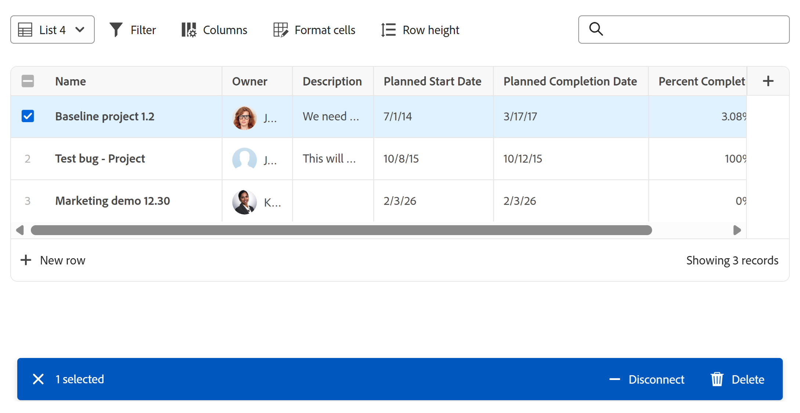

# Verwalten der Listenansicht in Adobe Workfront Planning

<!--
although list views in Planning are very similar to Workfront enhanced lists, keep this one separate with all the information, because of Planning standalone; some information here is also duplicated in this main Glist article: help/quicksilver/workfront-basics/navigate-workfront/use-lists/enhanced-lists.md
-->

<!--If the List view in Project connected pages and request forms stays the same after GTable rolls out - keep this as the List view and change the Table view to "Table redesigned view" for now; keep it "the table view" there for later-->

Die auf dieser Seite hervorgehobenen Informationen beziehen sich auf Funktionen, die noch nicht allgemein verfügbar sind. Sie ist nur in der Vorschau -Umgebung für alle Kunden verfügbar. Nach der Veröffentlichung in der Vorschau sind dieselben Funktionen auch monatlich in der Produktionsumgebung für Kunden verfügbar, die schnelle Versionen aktiviert haben. 

Informationen zu Schnellversionen finden Sie unter [Aktivieren oder Deaktivieren von Schnellversionen für Ihre Organisation](/help/quicksilver/administration-and-setup/set-up-workfront/configure-system-defaults/enable-fast-release-process.md). 

{{planning-important-intro}}

Sie können Objekte in der Listenansicht in den folgenden Bereichen von Workfront Planning anzeigen:

* Eine Seite mit verbundenen Datensätzen für Projekte im Detailbereich eines Datensatzes <!--update screen shot for preview May 14 with Grouping icon and add the note at the top in yellow about preview-->

  

* Eine Liste von Anfrageformularen auf der Ebene des Datensatztyps

  

In diesem Artikel wird beschrieben, wie Sie in Workfront Planning eine Listenansicht navigieren, erstellen oder bearbeiten können.

## Zugriffsanforderungen

+++ Erweitern Sie , um die Zugriffsanforderungen für die Funktion in diesem Artikel anzuzeigen. 

<table style="table-layout:auto"> 
<col> 
</col> 
<col> 
</col> 
<tbody> 
    <tr> 
<tr> 
</tr>   
<tr> 
   <td role="rowheader">
Adobe Workfront-Paket
</td> 
   <td> 

Beliebiges Workfront und beliebiges Planungspaket

Beliebiger Workflow und beliebiges Planungspaket

Weitere Informationen zu den einzelnen Workfront-Planungspaketen erhalten Sie von Ihrem Workfront-Kundenbetreuer. 
 
   </td> 
  <tr> 
   <td role="rowheader">
Adobe Workfront-Lizenz
</td> 
   <td>
 Standard zum Erstellen und Löschen von Ansichten

   
Mitwirkender oder höher zum Aktualisieren von Ansichtselementen

  </td> 
  </tr> 
  <tr> 
   <td role="rowheader">
Objektberechtigungen
</td> 
   <td>   
Verwalten der Berechtigungen für eine Ansicht
  
   
Anzeigeberechtigungen für eine Ansicht, um die Anzeigeeinstellungen vorübergehend zu ändern oder zu duplizieren
 </td> 
  </tr>

</tbody> 
</table>

Weitere Informationen zu Zugriffsanforderungen für Workfront finden Sie unter [Zugriffsanforderungen in der Dokumentation zu Workfront](/help/quicksilver/administration-and-setup/add-users/access-levels-and-object-permissions/access-level-requirements-in-documentation.md).

+++ 

## Überlegungen zu Listenansichten

* Beachten Sie Folgendes für die Listenansicht der verbundenen Datensätze:

   * Sie können Projekte nur in der Listenansicht auf der Seite „Verbundene Datensätze“ eines Datensatzes anzeigen. Die Listenansicht ist für kein anderes Objekt oder keinen anderen Datensatztyp auf einer verbundenen Datensatzseite verfügbar.

  Informationen zum Erstellen einer verbundenen Datensatzseite finden Sie unter [Hinzufügen einer verbundenen Datensatzseite zu einem Datensatz](/help/quicksilver/planning/records/add-a-connected-records-page-to-a-record.md).
   * Bevor Sie eine Listenansicht auf einer verbundenen Datensatzseite eines Datensatzes anzeigen können, müssen Sie Workfront-Projekte mit Planungs-Datensatztypen verbinden. Weitere Informationen finden Sie unter [Verbinden von Datensatztypen](/help/quicksilver/planning/architecture/connect-record-types.md).
   * Sie können mehrere Listenansichten für Projekte auf der Seite „Verbundene Datensätze“ eines Datensatzes erstellen.

* Beachten Sie Folgendes für die Listenansicht der Anfrageformulare:

   * Sie können keine zusätzlichen Listenansichten für Planungsanfrageformulare erstellen oder bearbeiten. Workfront erstellt für Anfrageformulare eine Listenansicht. <!--this will change-->

     Weitere Informationen zu Anfrageformularen finden Sie unter [Erstellen und Verwalten eines Anfrageformulars in Adobe Workfront Planning](/help/quicksilver/planning/requests/create-request-form.md).
* Je nachdem, wo er angezeigt wird, enthält nicht jede Listenansicht alle in diesem Artikel beschriebenen Elemente.

## Verwalten einer Listenansicht {#manage-a-list-view}

Workfront Planning-Listenansichten ähneln den erweiterten Listen von Workfront. Die meisten Elemente aus erweiterten Ansichten sind auch in Listenansichten in Workfront Planning vorhanden.

Weitere Informationen finden Sie unter [Verwenden erweiterter Listen](/help/quicksilver/workfront-basics/navigate-workfront/use-lists/enhanced-lists.md).

<!--
Removed - more direct steps below: 
{{step1-to-planning}}

1. (Conditional) To access a projects connected page, do the following: 

    1. Click a workspace card, then click a record type card. 
    1. From any view, click the name of a record to open the record's preview or details page. 
    1. Add a **Connected records page** for connected projects as described in the article [Add a Connected records page to a record](/help/quicksilver/planning/records/add-a-connected-records-page-to-a-record.md).

    The Connected records page displays projects connected to the record in the list view. 

    

1. (Conditional) To access a list of request forms, do the following: 

    1. {{step1-to-planning}}

    1. (Conditional) To access a projects connected page, do the following: 

    1. Click a workspace card, then click a record type card.
    1. Click the **More** menu  to the right of the record name in the header, then click **Manage request forms**.

        A list of request forms displays.

-->

1. Navigieren Sie zu einer Listenansicht in einem der folgenden Bereiche:

   * Eine Seite mit verbundenen Datensätzen für Projekte im Detailbereich eines Datensatzes
   * Die Seite mit den Anforderungsformularen eines Datensatztyps

1. (Bedingt) Führen Sie einen der folgenden Schritte aus, wenn verfügbar, um die Listenansicht zu ändern:

   1. Erweitern Sie das Dropdown-Menü Ansichten in der linken oberen Ecke der Liste, um eine andere Ansicht auszuwählen, oder klicken Sie auf **Neue Ansicht** und erstellen Sie eine andere.

      >[!TIP]
      >
      >Ansichten werden im gesamten System gemeinsam genutzt. Wenn Sie eine Projektansicht für einen Datensatztyp erstellen, können Sie sie für andere Datensatztypen anzeigen, die verbundene Projekte anzeigen.

   1. Bewegen Sie den Mauszeiger über den Namen einer vorhandenen Ansicht und klicken Sie auf das Menü **Mehr**  und dann auf eine der folgenden Aktionen:
      * **Umbenennen**, um der Ansicht einen neuen Namen zu geben
      * **Freigeben**, um die Ansicht für andere freizugeben
      * **Löschen** zum Löschen der Ansicht.

      >[!NOTE]
      >
      >* Sie müssen über Verwaltungsberechtigungen für eine Ansicht verfügen, um sie bearbeiten, freigeben oder löschen zu können.
      >
      >* Sie können keine Systemansichten ändern.
      >
      >* Sie können eine Ansicht, die für Sie freigegeben wurde und für die Sie nur über die Berechtigung zum Anzeigen verfügen, zurücksetzen, nachdem Sie sie geändert haben, um ihre ursprünglichen Voreinstellungen wiederherzustellen. Alternativ können Sie sie mit Ihren Änderungen kopieren und die Kopie freigeben. Weitere Informationen finden Sie unter [Verwenden erweiterter Listen](/help/quicksilver/workfront-basics/navigate-workfront/use-lists/enhanced-lists.md).

   1. Klicken Sie auf **Filter**-Symbol , um der Ansicht einen Filter hinzuzufügen. Die Ergebnisse werden sofort in der Liste gefiltert. Filter können nicht gespeichert und benannt werden. Filter werden gespeichert, wenn Sie in Zukunft auf die Seite zugreifen, und sie sind Teil freigegebener Ansichten.

      >[!TIP]
      >
      >Um einen personalisierten Filter anzuwenden, wählen Sie eine der folgenden Optionen für einen Feldwert aus:
      >
      >* **Ich (angemeldeter Benutzer)** um in Feldern, die auf Benutzer verweisen, auf den angemeldeten Benutzer zu verweisen.
      >
      >* **Meine Teams** oder **Mein Home-Team**, um auf Ihre Teams in Feldern zu verweisen, die auf Teams verweisen.
      >
      >* **Meine Gruppen** oder **Meine Hauptgruppe**, um auf Ihre Gruppen in Feldern zu verweisen, die auf Gruppen verweisen.
      >
      >* **Meine Firma**, um auf Ihre Firma in Feldern zu verweisen, die auf Firmen verweisen.
      > 
      >* **Meine Rollen** oder **Meine primäre Rolle**, um auf Ihre Aufgabengebiete in Feldern zu verweisen, die auf Rollen verweisen.

   1. Klicken Sie auf das **Spalten**-Symbol , um auszuwählen, welche Spalten in der Ansicht angezeigt oder ausgeblendet werden sollen.
   1. Bewegen Sie den Mauszeiger über den Namen einer Spalte, klicken Sie dann links neben dem Spaltennamen auf den Abwärtspfeil und dann auf eine der folgenden Aktionen:
      * **Umbenennen**, um eine **benutzerdefinierte Beschriftung** für die Spalte hinzuzufügen. Der Name des Originalfelds in Workfront ändert sich nicht.
      * **Sortieren**, um die Liste nach dem ausgewählten Feld zu sortieren. Ein Sortiersymbol, das die Sortierrichtung angibt, wird der Spaltenüberschrift hinzugefügt.
   1. Klicken Sie auf die Kopfzeile einer Spalte und ziehen Sie sie per Drag-and-Drop an eine andere Position in der Liste.

      Die erste Spalte kann nicht verschoben werden.
   1. Klicken Sie oben rechts in der Liste auf das Symbol **+** , um Spalten zur Liste hinzuzufügen oder daraus zu entfernen, und klicken Sie dann auf **Speichern**.

      Der **Spalten-Manager** wird geöffnet.

      Sie können der Listenansicht nur vorhandene Felder hinzufügen.
Sie können das primäre Feld in der Listenansicht, die in der ersten Spalte angezeigt wird, nicht entfernen.

   1. Klicken Sie auf das **Zellen formatieren**-Symbol . Das Feld **Format** wird geöffnet. <!--change the name of the box when they update it-->
Gehen Sie folgendermaßen vor:

      1. Klicken Sie **Bedingung hinzufügen**.
      1. Wählen Sie in der **If**-Zeile ein Feld aus, wählen Sie einen Feldwert aus und fügen Sie einen Modifikator hinzu. Die Modifikatoren ändern sich je nach ausgewähltem Feldtyp.

         >[!TIP]
         >
         >Für bedingte Formatierung sind nur in der Listenansicht sichtbare Felder verfügbar.

      1. (Optional) Anstatt einen Feldwert hinzuzufügen, klicken Sie auf das Symbol **Mit einem anderen Feld vergleichen** ( und wählen Sie ein Feld aus, dessen Wert Sie mit dem Wert des ausgewählten Felds vergleichen möchten. Sie können beispielsweise die Felder Projektbesitzer und Projektsponsor vergleichen.

         >[!TIP]
         >
         >Für bedingte Formatierung sind nur in der Listenansicht sichtbare Felder verfügbar. Die verglichenen Felder müssen vom gleichen Typ sein.

      1. (Optional) Klicken Sie **Bedingung hinzufügen** in der **Wenn**-Zeile, um derselben Regel weitere Bedingungen hinzuzufügen.

         >[!TIP]
         >
         >Sie können einer Bedingungsregel bis zu 10 Bedingungen hinzufügen und Sie können bis zu 20 Regeln für ein Feld hinzufügen.

      1. Klicken Sie auf den **OR**-Connector zwischen Bedingungen, um zu **AND** zu wechseln und anzugeben, dass mehrere Bedingungen gleichzeitig erfüllt sein müssen. **Oder** ist der Standard-Connector.
      1. Wählen Sie in **Zeile** Format“ ein Feld aus, um anzugeben, welche Spalte formatiert werden soll. <!--edit this area, if it changes names??-->
      1. (Optional) Klicken Sie auf das Symbol **Farbkreis** Symbol  neben dem ausgewählten Feld, um es zu erweitern und eine andere Farbe im Bereich **Zellenfüllung** auszuwählen, um die Farbe des Hintergrunds in einer Zelle zu ändern, oder wählen Sie eine Farbe aus dem Bereich **Textfarbe** aus, um die Farbe des Textes in einer Zelle zu ändern.
      1. Klicken Sie auf das Symbol **Textformat** ) und wählen Sie eine der folgenden Optionen aus, um den Text in einer Zelle zu formatieren:
         * Fett
         * Kursiv

      1. Aktivieren Sie die Einstellung **Auf Zeile anwenden**, um die Formatierung auf die gesamte Zeile des Felds anzuwenden, das die Bedingungen erfüllt.
      1. (Optional) Klicken Sie im Feld **Format** auf **Bedingung hinzufügen**, um eine weitere Regel für ein anderes Feld hinzuzufügen, und wiederholen Sie dann die obigen Schritte.
      1. (Optional) Klicken Sie auf **Alle löschen**, um alle Formatierungen zu entfernen.
      1. Klicken Sie außerhalb des Felds **Format**, um es zu schließen.

         Dadurch gelangen Sie zurück zur Listenansicht.
Die Formatierung wird sofort auf die Listenansicht angewendet.
Ein blauer Punkt neben dem Symbol **Zellen formatieren** gibt an, dass auf die Ansicht eine besondere Formatierung angewendet wurde.

   1. (Optional) Klicken Sie auf das **Gruppierung**-Symbol , um Elemente in der Liste nach einem gemeinsamen Feld zu gruppieren. Wählen Sie eine der Optionen aus oder verwenden Sie die Suchleiste, um ein Feld zu finden.

      Das Feld muss eine Spalte in der Liste sein, bevor Sie es gruppieren können. Nicht alle Feldtypen können für Gruppierungen verwendet werden.

   1. Klicken Sie auf **Zeilenhöhe**-Symbol , um die vertikale Länge einer Zeile zu aktualisieren. Wählen Sie aus den folgenden Optionen:

      * Kurz
      * Standard. Dies ist die Standardauswahl.
      * Mittel
      * Groß

      <!--leave these here, although they duplicate for Enhanced lists in Workfront-->

1. (Optional) Fügen Sie ein Keyword in das Suchfeld in der oberen rechten Ecke der Liste ein, um nach einem Element zu suchen.

   Elemente, die mit Ihrem Suchbegriff übereinstimmen, werden in der Liste hervorgehoben.

1. (Optional und bedingt) Führen Sie einen der folgenden Schritte aus, um auf der Seite &quot;<!--change projects to items here when more items will display in the Glist--> verbundene Projekte“ weitere Elemente zur Liste hinzuzufügen und sie automatisch mit dem ausgewählten Datensatz zu verbinden:

   * Klicken Sie **Datensätze verbinden** in der oberen rechten Ecke der Liste, um vorhandene Elemente hinzuzufügen.
   * Klicken Sie **Neue Zeile** unten in der Liste, um neue Elemente hinzuzufügen.
1. Klicken Sie auf den Namen eines Elements in der Liste, um es in einer anderen Browser-Registerkarte zu öffnen.
1. Doppelklicken Sie in eine Zelle der Liste, um die Informationen eines Felds zu bearbeiten, und drücken Sie dann die Eingabetaste, um die Änderungen zu speichern.

   Einige Felder sind schreibgeschützt. Beispielsweise ist der Bereich Prozent abgeschlossen eines Projekts ein Feld, das vom System berechnet wird, und Sie können ihn nicht manuell bearbeiten.

1. (Bedingt) Verwenden Sie für Felder vom Typ „Auswählen“ Ihre Tastaturpfeile, um durch die Liste der Optionen zu navigieren, und drücken Sie dann die Leertaste, um die richtige Auswahl auszuwählen.

   Verwenden Sie die Zeile **Suche** in „Feldtypen auswählen“, um die richtige Option zu finden.

   Wenn keine Ergebnisse gefunden werden, können Sie neue Optionen direkt aus der Feldzelle hinzufügen. Diese Funktion ist möglicherweise nicht in allen Listen verfügbar.

1. Bewegen Sie den Mauszeiger über den Namen eines Elements in der Liste und klicken Sie auf das Menü **Mehr** [Mehr](assets/more-menu.png) und klicken Sie auf **Anzeigen**, um das Element in einer anderen Registerkarte zu öffnen

   ODER

   Wählen Sie ein oder mehrere Elemente aus, beachten Sie die Aktionsleiste unten in der Liste und klicken Sie dann auf eine der folgenden Aktionen, sofern verfügbar.

   Klicken Sie je nachdem, aus welchem Bereich Sie auf die Listenansicht zugreifen, auf eine der folgenden Optionen:

   * **Löschen**, um das Element zu löschen. Durch das Löschen eines Projekts wird es vom Datensatz getrennt und in den Papierkorb von Workfront verschoben. Workfront-Administratoren können gelöschte Projekte bis zu 30 Tage nach dem Löschen wiederherstellen. Beim Löschen eines Formulars werden die Anfragen oder Datensätze, die beim Senden des Formulars erstellt wurden, nicht gelöscht.
   * **Trennen** auf der Seite „Verbundene Projekte“, um ein Projekt vom Datensatz zu trennen. Wenn Sie ein Projekt trennen, werden es und alle Werte seiner Suchfelder aus dem aktuellen Datensatz entfernt.

     

   * **Formular bearbeiten**: Öffnet ein Planungsanfrageformular und ermöglicht die Bearbeitung.
   * **Veröffentlichung aufheben**: Hebt die Veröffentlichung eines Anfrageformulars auf. Dadurch wird das Formular aus dem Bereich Anfragen entfernt, und Benutzende können diesem Datensatztyp keine Anfragen mehr hinzufügen.
   * **Freigeben**: Öffnet das Feld Freigeben für ein Anfrageformular, in dem Sie Daten für andere freigeben können.
   * **Link kopieren**: Kopiert einen Link in ein Planungsanfrageformular, damit Sie ihn für andere Benutzer freigeben können. Wenn das Formular öffentlich freigegeben ist, können Sie den Link für Personen außerhalb von Workfront Planning freigeben.

     

