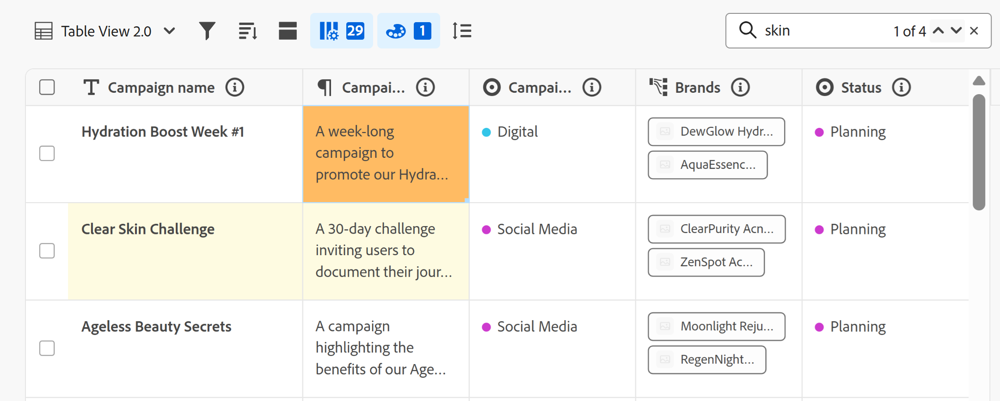
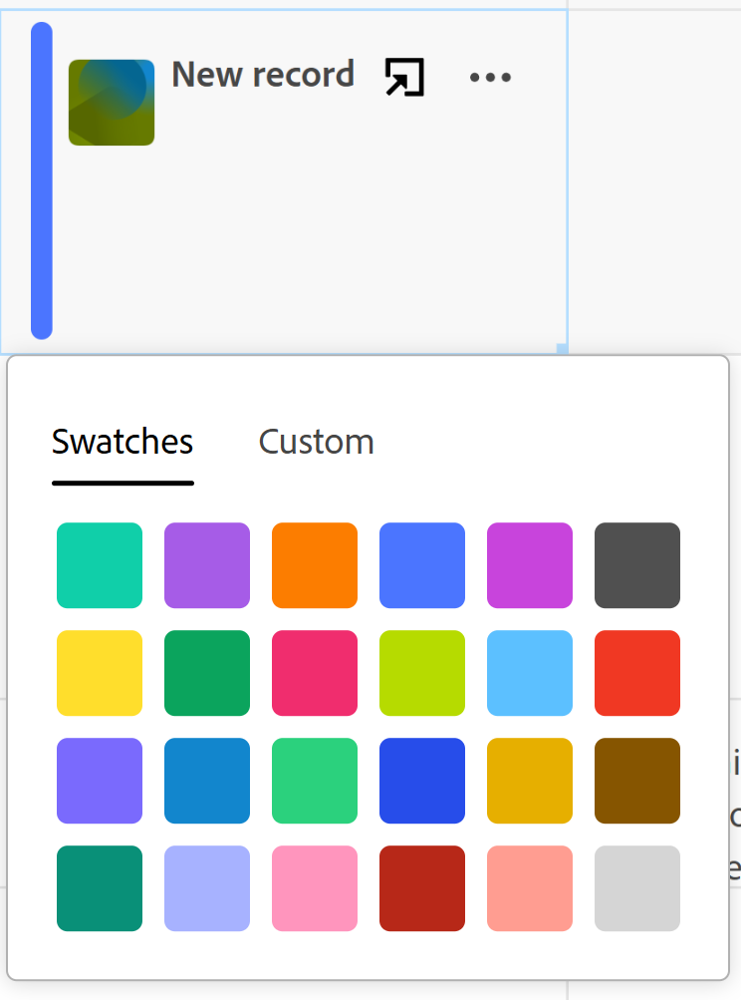
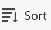
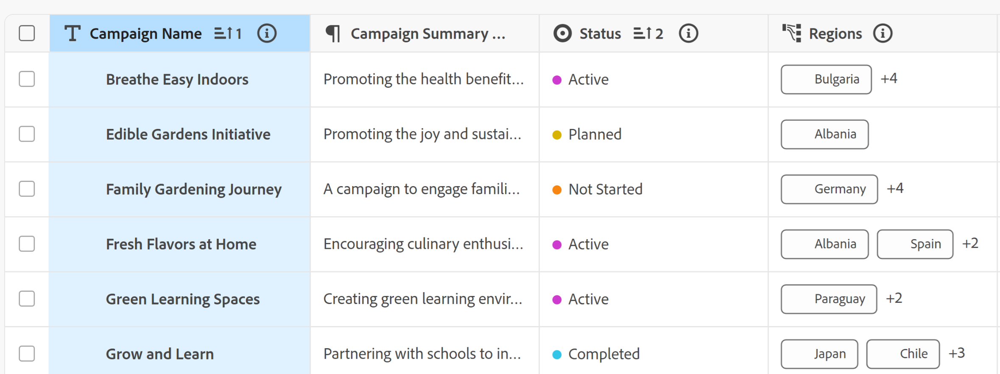
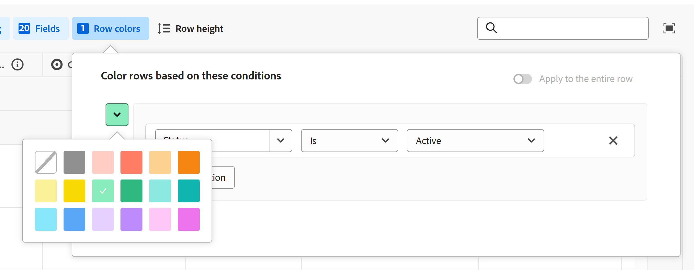
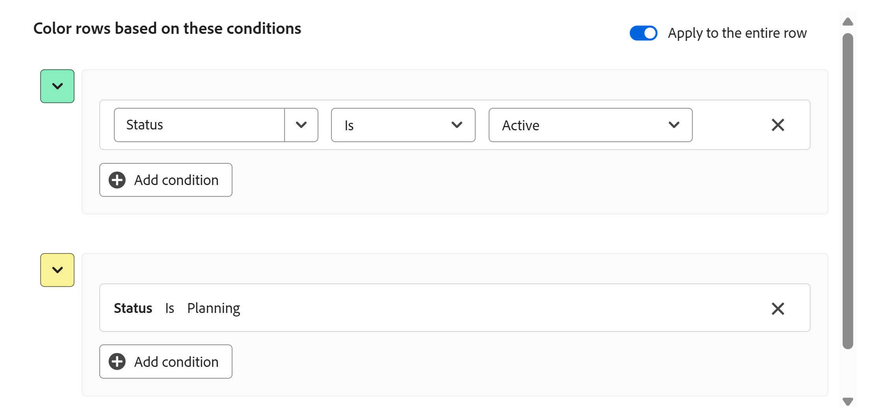
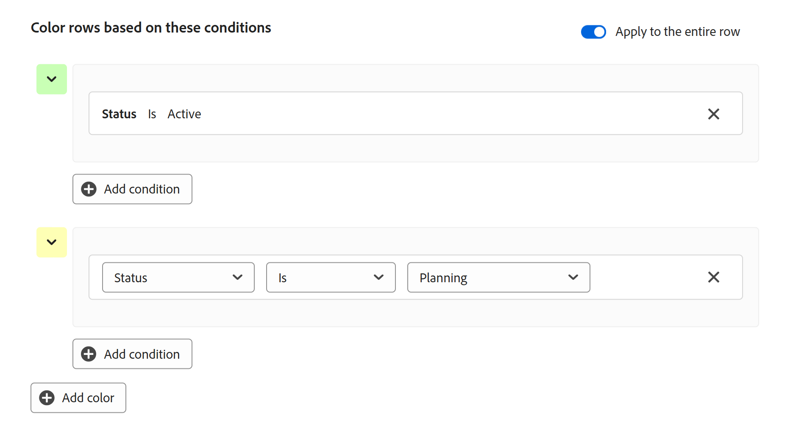

# Verwalten der Tabellenansicht

<!--
The information highlighted on this page refers to functionality not yet generally available. It is available only in the Preview environment for all customers. After the release to Preview, the same features are also available monthly in the Production environment for customers who enabled fast releases. 

For information about fast releases, see [Enable or disable fast releases for your organization](/help/quicksilver/administration-and-setup/set-up-workfront/configure-system-defaults/enable-fast-release-process.md). 
-->

{{planning-important-intro}}

Sie können Datensätze und ihre Felder in einer Tabellenansicht anzeigen, wenn Sie in Adobe Workfront Planning auf die Seite „Datensatztyp“ zugreifen.

Weitere Informationen zu Datensatzansichten und deren Verwaltung finden Sie unter [Verwalten von Datensatzansichten](/help/quicksilver/planning/views/manage-record-views.md).

In diesem Artikel werden die folgenden Informationen beschrieben:

* [Erstellen oder Bearbeiten von Spalten und Zeilen in einer Tabellenansicht](#manage-a-table-view)
* [Echtzeit-Präsenzindikatoren für die Tabellenansicht aktivieren](#enable-the-real-time-presence-indicator)

Informationen zum Exportieren der Tabellenansicht in eine Excel- oder CSV-Datei finden Sie unter [Exportieren von Datensätzen aus der Tabellenansicht](/help/quicksilver/planning/records/export-records-from-the-table-view.md).

## Zugriffsanforderungen

+++ Erweitern Sie , um die Zugriffsanforderungen für die Funktion in diesem Artikel anzuzeigen. 

<table style="table-layout:auto"> 
<col> 
</col> 
<col> 
</col> 
<tbody> 
    <tr> 
<tr> 
</tr>   
<tr> 
   <td role="rowheader">
Adobe Workfront-Paket
</td> 
   <td> 

Beliebiges Workfront und beliebiges Planungspaket

Beliebiger Workflow und beliebiges Planungspaket

Weitere Informationen zu den einzelnen Workfront-Planungspaketen erhalten Sie von Ihrem Workfront-Kundenbetreuer. 
 
   </td> 
  <tr> 
   <td role="rowheader">
Adobe Workfront-Lizenz
</td> 
   <td>
 Standard zum Erstellen und Löschen von Ansichten

   
Mitwirkender oder höher zum Aktualisieren von Ansichtselementen

  </td> 
  </tr> 
  <tr> 
   <td role="rowheader">
Objektberechtigungen
</td> 
   <td>   
Verwalten der Berechtigungen für eine Ansicht
  
   
Anzeigeberechtigungen für eine Ansicht, um die Anzeigeeinstellungen vorübergehend zu ändern oder zu duplizieren
 </td> 
  </tr> 
</tbody> 
</table>

Weitere Informationen zu Zugriffsanforderungen für Workfront finden Sie unter [Zugriffsanforderungen in der Dokumentation zu Workfront](/help/quicksilver/administration-and-setup/add-users/access-levels-and-object-permissions/access-level-requirements-in-documentation.md).

+++ 

<!--
Old:
<table style="table-layout:auto"> 
<col> 
</col> 
<col> 
</col> 
<tbody> 
    <tr> 
<tr> 
<td> 
   
 Products
 </td> 
   <td> 
   <ul><li>
 Adobe Workfront
</li> 
   <li>
 Adobe Workfront Planning
</li></ul></td> 
  </tr>   
<tr> 
   <td role="rowheader">
Adobe Workfront plan*
</td> 
   <td> 

Any of the following Workfront plans:
 
<ul><li>Select</li> 
<li>Prime</li> 
<li>Ultimate</li></ul> 

Workfront Planning is not available for legacy Workfront plans
 
   </td> 
<tr> 
   <td role="rowheader">
Adobe Workfront Planning package*
</td> 
   <td> 

Any 
 

For more information about what is included in each Workfront Planning plan, contact your Workfront account manager. 
 
   </td> 
 <tr> 
   <td role="rowheader">
Adobe Workfront platform
</td> 
   <td> 

Your organization's instance of Workfront must be onboarded to the Adobe Unified Experience to be able to access Workfront Planning.
 

For more information, see <a href="/help/quicksilver/workfront-basics/navigate-workfront/workfront-navigation/adobe-unified-experience.md">Adobe Unified Experience for Workfront</a>. 
 
   </td> 
   </tr> 
  </tr> 
    <td role="rowheader">
Adobe Workfront license*
</td> 
   <td>
 Standard to create and delete views

   
Contributor or higher to update view elements

   
Workfront Planning is not available for legacy Workfront licenses
 
  </td> 
  </tr> 
  <tr> 
   <td role="rowheader">
Access level configuration
</td> 
   <td> 
There are no access level controls for Adobe Workfront Planning
   
</td> 
  </tr> 
<tr> 
   <td role="rowheader">
Object permissions
</td> 
   <td>   
Manage permissions to a view
  
   
View permissions to a view to temporarily change the view settings or to duplicate it
 </td> 
  </tr> 
<tr>
   <td role="rowheader">
Layout template
</td>
   <td> Users with a Light or Contributor license must be assigned a layout template that includes Planning.
   
Standard users and System Administrators have the Planning areas enabled by default.

</li></ul>
</td>
  </tr>
</tbody> 
</table>
-->

## Bearbeiten von Datensätzen mithilfe der Tabellenansicht

Sie können Datensatzinformationen in der Tabellenansicht bearbeiten.

Weitere Informationen zum Bearbeiten von Datensätzen in der Tabellenansicht finden Sie unter [Datensätze bearbeiten](/help/quicksilver/planning/records/edit-records.md).

## Verwalten einer Tabellenansicht {#manage-a-table-view}

<!--********** MAYBE THIS IS VALID ONLY WHEN WE REPLACE THE NAVIGATION ?????????*********-->

<!-- In the Preview environment, the table view has been replaced with the list view. *******************-->

<!--
*******************IF THEY REPLACE THE LIST VIEW (IN PROJECTS AND FORMS) WITH THE NEW LIST, THEN JUST UPDATE THAT ARTICLE - "MANAGE THE LIST VIEW" - AND ADD A LINK TO IT HERE; IF NOT, THEN ADD THE SPECIFICS OF THE VIEW HERE**************
-->

Beim Erstellen einer Tabellenansicht werden alle Datensätze des ausgewählten Typs in einer Tabelle angezeigt. Jede Zeile ist ein eindeutiger Datensatz und jede Spalte ist ein Datensatzfeld. Standardmäßig werden alle Felder und Datensätze angezeigt.

Verwalten einer Tabellenansicht:

1. Erstellen Sie eine Tabellenansicht, wie im Artikel [Verwalten von Datensatzansichten](/help/quicksilver/planning/views/manage-record-views.md) beschrieben.

   

1. (Optional) Klicken Sie auf **Zeilenhöhe** und wählen Sie dann eine der folgenden Optionen, um die Höhe der Tabellenzeilen zu ändern:
   * Kurz
   * Standard
   * Mittel
   * Groß

1. (Optional) Klicken Sie auf das **Vollbildsymbol**-Symbol  um die Ansicht im Vollbildmodus zu öffnen. Klicken Sie dann auf das **Vollbildsymbol beenden**-Symbol  oder auf der Tastatur auf Esc , um den Vollbildmodus zu verlassen.

1. Aktualisieren Sie die folgenden Ansichtselemente wie in den folgenden Unterabschnitten beschrieben:
   * [Spalten (oder Felder)](#add-columns-or-fields)
   * [Zeilen (oder Datensätze)](#add-rows-or-records)
   * [Filter](#add-filters)
   * [sort](#add-a-sort)
   * [Gruppierung](#add-groupings)
   * [Zeilenfarben](#add-row-colors)
   * [Echtzeit-Präsenz-Indikator](#enable-the-real-time-presence-indicator)

### Spalten (oder Felder) hinzufügen {#add-columns-1}

Die Spaltenüberschriften einer Tabellenansicht zeigen Felder an, die mit den Datensätzen in der Ansicht verknüpft sind. Die in der Tabellenansicht angezeigten Felder werden auch im Abschnitt Details eines Datensatzes angezeigt.

Weitere Informationen finden Sie unter [Datensätze bearbeiten](/help/quicksilver/planning/records/edit-records.md).

Das Hinzufügen von Spalten zu einer Ansicht entspricht dem Hinzufügen von Feldern zu einem Datensatztyp.

Sie können bis zu 500 Felder (oder Spalten) in einer Tabellenansicht hinzufügen.

1. Wechseln Sie zu einer Seite vom Typ Datensatz und klicken Sie auf eine Registerkarte Tabellenansicht oder klicken Sie auf **+ Ansicht** um eine neue Ansicht hinzuzufügen, und wählen Sie dann **Tabelle** aus.

1. Beginnen Sie mit dem Hinzufügen von Feldern (oder Spalten), wie im Artikel [Erstellen von Feldern](/help/quicksilver/planning/fields/create-fields.md) beschrieben.

   Die hinzugefügten Spalten sind für alle Benutzer sichtbar, die auf den Datensatztyp zugreifen, und werden als neue Felder auf der Datensatzseite hinzugefügt.

1. (Optional) Klicken Sie auf das **Felder**-Symbol  in der Symbolleiste, suchen Sie nach einem Feld und heben Sie dann die Auswahl des Umschalters rechts neben dem Feldnamen auf, um das Feld auszublenden.

1. Führen Sie einen der folgenden Schritte aus, um die Spalten in der Tabelle neu anzuordnen:

   * Nehmen Sie die Spaltenüberschrift und ziehen Sie sie per Drag-and-Drop an die gewünschte Position. Die verschobene Spalte wird kurz mit einem blauen Hintergrund angezeigt, bis Sie andere Anpassungen an der Tabelle vornehmen.

   * Klicken Sie **der Symbolleiste der** auf „Felder“, ziehen Sie die Felder per Drag-and-Drop in die gewünschte Reihenfolge und klicken Sie dann außerhalb des Felds **Sichtbarkeit und Reihenfolge**, um es zu schließen.

     

     >[!TIP]
     >
     >* Standardmäßig ist das Feld Name immer das erste Feld in der Tabellenansicht. Dies wird als primäres Feld betrachtet.
     >
     >* Das Feld Name kann nur dann an eine andere Position verschoben werden, wenn Sie ein anderes Feld als primäres Feld angeben. Weitere Informationen finden Sie in Schritt 5. <!--**********************accurate?**************-->
     >
     >

   * Ersetzen Sie das Feld in der ersten Spalte durch ein anderes Feld, indem Sie das primäre Feld ändern. Weitere Informationen finden Sie in Schritt 5. <!--**********************accurate?**************-->

1. (Optional) Bewegen Sie den Mauszeiger über einen Feldnamen in der Spaltenüberschrift eines Felds, das nicht in der ersten Spalte der Tabelle angezeigt wird, klicken Sie auf den nach unten zeigenden Pfeil rechts neben dem Feldnamen und dann auf **Als Primärfeld festlegen**.

   

1. Klicken Sie **Bestätigung auf** Feld festlegen“.

   Das Feld wird zu einem primären Feld, d. h. es wird als erste Spalte der Tabellenansicht angezeigt. Das vorherige primäre Feld wird in die zweite Spalte verschoben.

   Primäre Felder werden zum Titel des Datensatzes und werden im Kopfzeilenbereich der Datensatzseite und überall dort angezeigt, wo die Datensätze angezeigt werden. Beispielsweise wird der Datensatztitel in verbundenen Feldern und in allen Ansichten angezeigt. Weitere Informationen zu Primärfeldern finden Sie unter [Übersicht über Primäre Felder](/help/quicksilver/planning/fields/primary-field-overview.md).

   >[!TIP]
   >
   >Klicken Sie auf das **information**-Symbol  rechts neben dem Feldnamen in einer Spalte, um deren **anzuzeigen**.

1. Klicken und ziehen Sie die Spaltentrennlinien und legen Sie sie an der gewünschten Stelle ab, um die Breite der Spalten zu erhöhen.

   >[!TIP]
   >
   >Die Änderungen an der Spaltenbreite und -reihenfolge sind dauerhaft und für alle Benutzer sichtbar, die auf dieselbe Ansicht zugreifen.

1. Bewegen Sie den Mauszeiger über die Spaltenüberschrift, klicken Sie dann auf den nach unten zeigenden Pfeil und dann auf **Feld ausblenden**

   ODER

   Klicken Sie **der** auf „Felder“ und heben Sie die Auswahl der Umschaltfläche auf, die mit den Feldern (oder Spalten) verknüpft ist, die Sie ausblenden möchten. Das Feld **Sichtbarkeit und Reihenfolge** wird angezeigt.

   >[!TIP]
   >
   >Die Anzahl der ausgeblendeten Felder wird links neben dem Symbol Felder in der Symbolleiste angezeigt.
   >
   >Standardmäßig werden ausgeblendete Felder nicht im Vorschaufeld (Details **des** angezeigt. Alle Felder werden auf der Detailseite des Datensatzes angezeigt. Weitere Informationen finden Sie unter [Seitenlayout für Einträge verwalten](/help/quicksilver/planning/records/manage-the-record-page.md).

1. Klicken Sie auf **Felder** und wählen Sie den Umschalter aus, der mit den Feldern verknüpft ist, die Sie in den Spalten der Tabelle anzeigen möchten. Standardmäßig werden alle Felder angezeigt.

1. Gehen Sie folgendermaßen vor, um schnell Datensätze zu finden, die einem Keyword entsprechen:

   1. Beginnen Sie im **** Suchfeld mit der Eingabe eines Keywords, das mit einem beliebigen Feld eines Datensatzes verknüpft ist, der auf dem Bildschirm angezeigt wird. Die Anzahl der richtigen Übereinstimmungen wird neben dem Suchelement angezeigt, und das Feld mit der richtigen Übereinstimmung ist hervorgehoben.

      

      Sie können jedes Wort oder jedes Sonderzeichen verwenden, das auf dem Bildschirm sichtbar ist.

      Sie können keine Schlüsselwörter verwenden, die mit Feldern verknüpft sind, die in der Tabellenansicht ausgeblendet sind.

   1. Drücken Sie **Eingabetaste** auf der Tastatur, um zum nächsten gefundenen Feld zu wechseln.

   1. (Optional) Wenn mehr als eine Übereinstimmung vorliegt, klicken Sie auf die Pfeile nach oben und unten rechts neben dem Suchbegriff, um alle Übereinstimmungen in der Tabelle zu finden.

   1. Klicken Sie auf das **x**-Symbol im Suchfeld, um den Suchbegriff zu löschen.

1. Für Zahlen-, Währungs-, Prozentsatz- und Formelfelder, die als eines dieser Felder formatiert sind, erweitern Sie das Dropdown-Menü Aggregator unten in den Spalten und wählen Sie aus den folgenden Optionen aus:

   * **SUM**: Zeigt die Gesamtzahl aller Zellen in der Spalte an. Dies ist die Standardauswahl.
   * **MIN**: Zeigt den niedrigsten Wert aus allen Zellen in der Spalte an.
   * **MAX**: Zeigt den höchsten Wert aus allen Zellen in der Spalte an.
   * **AVG**: Zeigt den Durchschnittswert aller Zellen in der Spalte an.

   Beachten Sie beim Arbeiten mit Aggregatoren Folgendes:

   * Die Aggregator-Zeile in der Spalte ist eingefroren und Teil der Anzeigeeinstellungen.
   * Als Ansichts-Manager können Sie den Aggregator auswählen. Dieser wird für die Ansicht freigegeben, wenn Sie die Ansicht für andere freigeben.
   * Als Viewer können Sie den Aggregator ändern, er wird jedoch nicht mit der Ansicht gespeichert.
   * Öffentliche freigegebene Ansichten werden mit den gespeicherten Aggregatoren geteilt, die nicht geändert werden können.

### Zeilen (oder Datensätze) hinzufügen {#add-rows-1}

Die Zeilen einer Tabellenansicht zeigen einzelne Datensätze des ausgewählten Datensatztyps an. Das Hinzufügen von Zeilen ist mit dem Erstellen von Datensätzen identisch.

Sie können bis zu 50.000 Datensätze (oder Zeilen) für einen Datensatztyp haben.

1. Wechseln Sie zu einer Seite vom Typ Datensatz und wählen Sie eine Tabellenansicht aus, oder klicken Sie auf **+ Ansicht** um eine neue Ansicht hinzuzufügen, und wählen Sie dann **Tabelle** aus.

1. Beginnen Sie mit dem Hinzufügen von Datensätzen (oder Zeilen), wie im Artikel [Erstellen von Datensätzen](/help/quicksilver/planning/records/create-records.md) beschrieben.

   Die Datensätze, die Sie in der Tabellenansicht hinzufügen, werden sofort gespeichert und sind für alle Benutzer sichtbar, die über Ansichtsberechtigungen oder höhere Berechtigungen für den Arbeitsbereich verfügen.

   Dem neuen Datensatz wird auch ein Standardminiaturbild hinzugefügt.

1. (Optional) Klicken Sie auf das **Mehr** Menü  rechts neben dem Datensatz und dann auf **Miniaturansicht bearbeiten**, um die Miniaturansicht zu bearbeiten.
1. Klicken Sie **oben in** Tabelle auf Felder und wählen Sie dann den Umschalter für das Feld **Miniatur** aus, um es links neben dem Primärfeld anzuzeigen. Diese Option ist standardmäßig deaktiviert.

   Weitere Informationen finden Sie unter [Hinzufügen einer Miniaturansicht zu einem Datensatz](/help/quicksilver/planning/records/add-thumbnails-to-records.md).

<!--
For July 23: you might need to add some spacing below:
1. (Optional) Click **Fields** at the top of the table, then click **Color** to display the color of a record to the left of its primary field. Colors are assigned randomly by default for each new record. The **Color** setting is deselected by default.
1.  (Optional and conditional) If you turned on the **Color** setting, click the color bar to the left of the record's primary field and select a color from the **Swatches** or **Custom** tabs, then click outside the box to close it. The color is applied immediately.
    
    
    
-->

### Filter hinzufügen {#add-filters-1}

Mit Filtern können Sie die Menge der auf dem Bildschirm angezeigten Informationen reduzieren.

Mit Filtern können Sie die Menge der auf dem Bildschirm angezeigten Informationen reduzieren.

Beachten Sie beim Arbeiten mit Filtern in der Tabellenansicht Folgendes:

<!-- this list is almost identical to the one for the table view - update both-->

* Die Filter, die Sie für die Tabellenansicht erstellen, funktionieren unabhängig von den Filtern in der Zeitleisten -Ansicht, wenn sie auf denselben Datensatztyp angewendet werden.

* Die Filter sind für die ausgewählte Ansicht eindeutig. Auf zwei Tabellenansichten desselben Datensatztyps können unterschiedliche Filter angewendet werden. Zwei Benutzer, die dieselbe Tabellenansicht betrachten, sehen denselben Filter, der derzeit angewendet wird.

* Die von Ihnen erstellten und auf eine Tabellenansicht angewendeten Filter können nicht benannt werden.

* Das Entfernen von Filtern entfernt sie von allen, die auf denselben Datensatztyp zugreifen wie Sie und verwendet dieselbe Ansicht wie Sie.

* Sie können nach verbundenen Datensatzfeldern oder Suchfeldern filtern.

* Sie können nach Suchfeldern filtern, die mehrere Werte anzeigen.

* Sie können auf ein Feld verweisen, das bis zu vier Ebenen vom aktuellen Datensatztyp entfernt ist. Wenn Sie beispielsweise einen Filter für einen Aktivitätsdatensatztyp erstellen und die Aktivität mit dem Produktdatensatztyp verbunden ist, der mit dem Kampagnendatensatztyp verbunden ist, der mit einem Workfront-Projekt verbunden ist, können Sie das Projektbudget in dem Filter referenzieren, den Sie für den Aktivitätsdatensatztyp erstellen.

So fügen Sie einen Filter zu einer Tabellenansicht hinzu:

1. Erstellen Sie eine Tabellenansicht für eine Seite vom Typ Datensatz, wie im Artikel [Verwalten von Datensatzansichten](/help/quicksilver/planning/views/manage-record-views.md) beschrieben.
1. Wählen Sie eine Tabellenansicht aus und klicken **oben** auf „Filter“.
1. Klicken Sie **Bedingung hinzufügen** und fügen Sie die folgenden Informationen hinzu:

   * Suchen Sie nach einem Feld und wählen Sie es aus, wenn es in der Liste angezeigt wird.

   * **Wählen Sie eine Option** oder einen Filtermodifikator), um festzulegen, welche Art von Bedingung das Feld erfüllen muss

     In der folgenden Tabelle werden die verfügbaren Modifikatoren für jeden Feldtyp angezeigt.

     <table>
        <thead>
        <tr>
            <th><b>Feldtyp</b></th>
            <th><b>Modifikatoren</b></th>
        </tr>
        </thead>
        <tbody>
        <tr>
            <td>Einzeilig, Absatz, Formel </td>
            <td>
Enthält

            
Enthält nicht

            
Ist

            
Ist nicht

            
Ist leer

            
Ist nicht leer
</td>
        </tr>
        <tr><td>Einzelauswahl</td>
            <td>
Ist

            
Ist nicht

            
Ist ein beliebiges von

            
Ist keines von

            
Ist leer

            
Ist nicht leer
</td>
        </tr>
        <tr>
            <td>Mehrfachauswahl, Personen</td>
            <td>
Hat eines von

            
Hat alle von

            
Ist genau

            
Hat keines von

            
Ist leer

            
Ist nicht leer
</td>
        </tr>
        <tr>
            <td>Zahl, Prozentsatz, Währung</td>
            <td>
=

            
≠

            
 &lt; 

            
&gt;

            
≤

            
≥

            
Ist leer

            
Ist nicht leer
</td>
        </tr>
        <tr>
            <td>Datum</td>
            <td>
Ist

            
Ist nicht

            
Ist nach

            
Ist vor

            
Ist zwischen

Ist nicht zwischen

            
Ist leer

Ist nicht leer
</td>
        </tr>

     <tr>
            <td>Kontrollkästchen</td>
            <td>
Ist

        </tr>
        </tbody>
        </table>

   * Einen Wert für das ausgewählte Feld auswählen.

   

   Es gibt keine Begrenzung dafür, wie viele Filterbedingungen Sie hinzufügen können.

1. (Optional) Klicken Sie auf **Bedingung hinzufügen**, um eine weitere Filteroption hinzuzufügen, und wiederholen Sie die obigen Schritte. Die Anzahl der angewendeten Filter wird links neben dem Symbol Filter angezeigt.
1. Klicken Sie auf die folgenden Operatoren, um anzugeben, wie die Filterbedingungen verbunden werden und angewendet werden sollen:

   * **AND**: Alle angegebenen Bedingungen müssen erfüllt sein.
   * **OR**: Jede der angegebenen Bedingungen muss erfüllt sein. Dies ist die Standardoption.

   1. (Optional) Fügen Sie zusätzliche Operatoren **AND** oder **OR** zwischen mehreren Bedingungsgruppierungen hinzu.

      

   Die Liste der Datensätze wird automatisch gefiltert.  <!--at this time, you can't name and save the filter - but will this change?!-->
   <!-- asked on the task for the simple filters whether there is a limitation for how many statements a filter can have?!-->

1. (Optional) Klicken Sie auf das Symbol **x**, um eine Filterbedingung zu entfernen.
1. (Optional) Klicken Sie auf **Filter**, um das Feld „Filter“ zu schließen. <!--right now you cannot "clear all" for filters, but this might come later-->

<!--***************** at production, paste here the information from the Production section above *******************-->

### Sortierung hinzufügen {#sort-information-1}

Durch Anwendung einer Sortierung können Sie Informationen in einer bestimmten Reihenfolge organisieren.

Beachten Sie beim Sortieren von Datensätzen in der Tabellenansicht die folgenden Punkte:

<!--*********** if this is available for the timeline view, update both when you update one ****************-->

* Die Sortierung ist für die ausgewählte Ansicht eindeutig. Auf zwei Tabellenansichten desselben Datensatztyps können unterschiedliche Sortierkriterien angewendet werden. Zwei Benutzer, die dieselbe Tabellenansicht betrachten, sehen dieselbe Sortierung, die derzeit angewendet wird.

* Die von Ihnen erstellten und auf eine Tabellenansicht angewendeten Sortierungen können nicht benannt werden.

* Die von Ihnen erstellte Sortierung wird beibehalten, wenn Sie sie verlassen.

* Sie können nach so vielen Feldern sortieren, wie sie in der Tabellenansicht eines Datensatztyps angezeigt werden.

* Sie können nicht nach verbundenen Datensatzfeldern sortieren, aber Sie können nach Suchfeldern aus verbundenen Datensatztypen sortieren.

* Beim Sortieren nach Suchfeldern mit mehreren Werten (die nicht von einem Aggregator zusammengefasst wurden) wird der erste Wert zum Sortieren verwendet.

* Das Entfernen von Sortierkriterien entfernt sie von allen, die auf denselben Datensatztyp zugreifen wie Sie und verwendet dieselbe Ansicht wie Sie.

* Sie können auf ein Feld verweisen, das bis zu vier Ebenen vom aktuellen Datensatztyp entfernt ist. Wenn Sie beispielsweise eine Sortierung für einen Aktivitätsdatensatztyp erstellen und die Aktivität mit dem Produktdatensatztyp verbunden ist, der mit dem Kampagnendatensatztyp verbunden ist, der mit einem Workfront-Projekt verbunden ist, können Sie den Projektstatus in der Sortierung referenzieren, die Sie für den Aktivitätsdatensatztyp erstellen.

Gehen Sie wie folgt vor, um Datensätze zu sortieren:

1. Erstellen Sie eine Tabellenansicht, wie im Artikel [Verwalten von Datensatzansichten](/help/quicksilver/planning/views/manage-record-views.md) beschrieben.
1. Klicken Sie auf **Symbol** Sortieren) oben in der Tabelle

   ODER

   Bewegen Sie den Mauszeiger über den Namen einer Spalte in der Tabellenansicht, klicken Sie auf den nach unten zeigenden Pfeil rechts neben dem Namen der Spaltenüberschrift und dann auf **Sortieren**.

1. (Bedingt) Wenn Sie oben in **Tabelle auf** Sortieren“ klicken, wird das Feld **Datensätze sortieren nach** geöffnet. Klicken Sie auf eines der vorgeschlagenen Felder oder klicken Sie auf **Anderes Feld auswählen** und suchen Sie nach einem anderen Feld. Klicken Sie dann auf das Feld, wenn es in der Liste angezeigt wird.

   Die Sortierung wird automatisch auf die Tabellenansicht angewendet und die Datensätze werden nach den von Ihnen ausgewählten Kriterien sortiert angezeigt.

1. (Optional) Klicken Sie auf **Bedingung hinzufügen** und wiederholen Sie die obigen Schritte, um nach zusätzlichen Feldern zu sortieren.

   Die Anzahl der Felder, nach denen Sie sortieren, wird links neben dem Sortierungssymbol in der oberen rechten Ecke der Symbolleiste angezeigt. Sie können nur Felder auswählen, die in den Spalten der Tabellenansicht angezeigt werden.
1. (Bedingt) Wenn Sie auf das Symbol **Sortieren** oben in der Tabelle geklickt haben, wählen Sie die Reihenfolge aus, in der das Feld im Feld **Datensätze sortieren nach** sortiert werden soll. Die Optionen für die Sortierreihenfolge hängen vom Typ des Felds ab, nach dem Sie sortieren.

   >[!TIP]
   >
   >Die folgenden Auswahlen sind nicht verfügbar, wenn Sie über die Spaltenüberschrift auf die Sortierung zugreifen.

   Wählen Sie aus den folgenden Optionen:

   * Datumsfelder:
     * Frühestens bis spätestens
     * Spätestes bis frühestes
   * Text, Absatz, Felder auswählen, Personen, Datensatz-ID:
     * Alphabetisch von A bis Z
     * Umgekehrt alphabetisch Z zu A
   * Zahl, Prozentsatz, Währungsfelder:
     * Aufsteigend 0 bis 9
     * Absteigend 9 bis 0
   * Kontrollkästchen-Felder:
     * Zuerst ausgewählt
     * Auswahl für erste aufgehoben

   Das Feld wird als Sortierauswahl im Symbol **Sortieren** oben in der Tabelle hinzugefügt.

1. (Optional) Klicken Sie im Feld **Datensätze sortieren nach** auf das Symbol **x** rechts neben einem Sortierfeld, um die Sortierung aufzuheben

   ODER

   Klicken Sie **Alle löschen**, um alle Felder aus der Sortierung zu entfernen.

1. Klicken Sie außerhalb des Felds **Datensätze sortieren nach**, um es zu schließen.

   

   Die in der Tabelle angezeigten Informationen werden nach den von Ihnen ausgewählten Kriterien sortiert.

   Die für die Sortierung ausgewählten Felder zeigen ein Sortiersymbol gefolgt von einer Zahl an, die die Reihenfolge angibt, in der die Sortierung angewendet wird.

### Gruppierungen hinzufügen {#add-groupings-1}

<!--
***********************this section exists in the timeline view too, but the display is slightly different, so I kept both procedures; consider updating both sections if any updates to groupings are introduced***************
-->

Beim Anwenden einer Gruppierung auf eine Ansicht können Sie Datensätze anhand ähnlicher Informationen gruppieren.

Beachten Sie Folgendes:

* Sie können Gruppierungen sowohl in der Tabellen- als auch in der Zeitleisten-Ansicht anwenden. Die Gruppierungen der Tabellenansicht sind unabhängig von denen in der Zeitleisten -Ansicht desselben Datensatztyps.
* Sie können in einer Ansicht drei Gruppierungsebenen anwenden. Die Datensätze werden in der Reihenfolge der ausgewählten Gruppierungen gruppiert.
&lt;!—*************** * Bei Verwendung der API können bis zu 4 Gruppierungsebenen angewendet werden. —Diese werden vorerst überprüft ******************—>
* Die Gruppierungen sind für die ausgewählte Ansicht eindeutig. Auf zwei Tabellenansichten desselben Datensatztyps können unterschiedliche Gruppierungen angewendet werden. Zwei Benutzende, die dieselbe Tabellenansicht betrachten, sehen dieselbe Gruppierung, die derzeit angewendet wird.
* Die von Ihnen erstellten Gruppierungen können nicht für eine Tabellenansicht benannt werden.
* Das Entfernen von Gruppierungen entfernt sie von allen Benutzern, die auf denselben Datensatztyp zugreifen wie Sie und die dieselbe Ansicht anzeigen wie Sie.
* Sie können die unter einer Gruppierung aufgelisteten Datensätze bearbeiten.
* Sie können nach verbundenen Datensatzfeldern oder Suchfeldern gruppieren.
* Wenn Sie nach Suchfeldern mit mehreren Werten (die nicht von einem Aggregator zusammengefasst wurden) gruppieren, werden die Datensätze nach jeder eindeutigen Kombination von Feldwerten gruppiert.
* Sie können auf ein Feld verweisen, das bis zu vier Ebenen vom aktuellen Datensatztyp entfernt ist. Wenn Sie z. B. eine Gruppierung für einen Aktivitätsdatensatztyp erstellen und die Aktivität mit dem Produktdatensatztyp verbunden ist, der mit dem Kampagnendatensatztyp verbunden ist, der mit einem Workfront-Projekt verbunden ist, können Sie den Projektstatus in der Gruppierung referenzieren, die Sie für den Aktivitätsdatensatztyp erstellen.
* Gruppierungen werden in der alphabetischen Reihenfolge ihrer Werte aufgeführt.
  <!--********************* checking into this: * You can apply up to 4 levels of grouping when using the API. ******************-->

Um eine Gruppierung hinzuzufügen:

1. Erstellen Sie eine Tabellenansicht für einen Datensatztyp, wie im Artikel [Verwalten von Datensatzansichten](/help/quicksilver/planning/views/manage-record-views.md) beschrieben.
1. Klicken **oben** der Tabellenansicht auf „Gruppierung“.

   

1. Klicken Sie auf eines der vorgeschlagenen Felder oder klicken Sie auf **Anderes Feld auswählen** suchen Sie nach einem anderen Feld und klicken Sie dann auf das Feld, wenn es in der Liste angezeigt wird.

   Die Gruppierung wird automatisch auf die Tabelle angewendet, und die Datensätze werden unter der Gruppierungstrennlinie angezeigt.

1. (Optional) Klicken Sie auf **Bedingung hinzufügen** und wiederholen Sie die obigen Schritte, um bis zu 3 Gruppierungen hinzuzufügen.

   Die Anzahl der für die Gruppierung ausgewählten Felder wird neben dem Gruppierungssymbol angezeigt.

   

1. (Optional) Klicken Sie innerhalb des **Datensätze gruppieren nach** auf das Symbol **x** rechts neben einem Feld, das für die Gruppierung ausgewählt wurde, um die Gruppierung zu entfernen.

1. Klicken Sie außerhalb des Felds **Datensätze gruppieren nach**, um es zu schließen.
1. (Optional) Klicken Sie auf **+ Neuer Datensatz** am Ende einer Gruppierung, um neue Datensätze hinzuzufügen, und aktualisieren Sie dann Ihre Seite, um den neuen Datensatz zur entsprechenden Gruppierung hinzuzufügen.

1. Um Gruppierungen zu erweitern oder zu reduzieren, klicken Sie auf das **Gruppierung**-Symbol und dann auf **Alle erweitern** oder **Alle reduzieren**. Dadurch werden alle Gruppierungen und Untergruppierungen in der Tabellenansicht erweitert.

   

   <!--
    ******** NOT POSSIBLE **********
    1. Right-click any of the grouping headers in the table view, then click one of the following options:
        * **Expand group**
        * **Collapse group**
        * **Expand all**
        * **Collapse all**
        * **Expand subgroups**
        * **Collapse subgroups**
        Depending on the number of groupings you apply to the view, some options might not be available.
    ********* NOT POSSIBLE ABOVE **********
   -->

### Zeilenfarben hinzufügen

1. (Optional) Klicken Sie auf **Zeilenfarben**, um Bedingungen zu definieren und verschiedene Farben für Tabellenzeilen zu konfigurieren.

1. Klicken Sie **Farbe hinzufügen** suchen Sie nach einem Feld und wählen Sie es aus, wenn es in der Liste angezeigt wird. Dies ist das Feld, für dessen Wert Sie die Farbe einer Zeile oder des Primären Felds definieren möchten.

   Um beispielsweise Kampagnen mit dem Status Aktiv in Grün anzuzeigen, wählen Sie **Status** und wählen Sie dann einen Modifikator und einen Wert für das Feld aus.

1. Klicken Sie auf das Dropdown-Menü für die Farbauswahl in der oberen linken Ecke der ausgewählten Bedingung, um die Farbe für die Bedingung auszuwählen, und klicken Sie dann außerhalb des Farbauswahlfelds, um es zu schließen.

   

1. (Optional) Klicken Sie **Bedingung hinzufügen**, um dem ersten Satz von Bedingungen weitere Felder und Werte hinzuzufügen

   ODER

   Klicken Sie **Farbe hinzufügen**, um einen neuen Satz von Bedingungen hinzuzufügen und eine neue Farbe zu identifizieren.

   Sie können beispielsweise Kampagnen in einem Planungsstatus in Gelb anzeigen, indem Sie einen neuen Satz von Bedingungen definieren.

   

   >[!TIP]
   >
   >Wenn Sie zwei verschiedene Felder ausgewählt haben, gilt zuerst die letzte Regel für die Farben, die auf die Zeilen angewendet werden.

1. (Optional) Aktivieren Sie die Einstellung **Auf die gesamte Zeile anwenden** in der oberen rechten Ecke des Felds **Zeilenfarben**. Die gesamte Zeile, in der die Bedingung erfüllt ist, wird automatisch in der ausgewählten Farbe angezeigt.

   >[!NOTE]
   >
   >* Wenn die Einstellung **Auf die gesamte Zeile anwenden** deaktiviert ist, wird nur der Hintergrund der primären Felderzelle in der ausgewählten Farbe angezeigt. Die Einstellung ist standardmäßig deaktiviert.
   >
   >* Die Einstellung Auf die gesamte Zeile anwenden ist abgeblendet, wenn Sie Gruppierungen auf die Tabelle anwenden.

1. Klicken Sie auf eine Stelle außerhalb des **Zeilenfarben**-Felds, um es zu schließen. Die Farben werden automatisch angewendet.

   >[!TIP]
   >
   >Wenn Sie Farbe nur auf eine Zelle anwenden, wird nur das Primäre Feld hervorgehoben.

### Aktivieren der Echtzeit-Anwesenheitsindikator

Die Avatare anderer Benutzer, die Datensatzinformationen gleichzeitig bearbeiten, wie Sie standardmäßig in der oberen rechten Ecke aller Datensatzansichten anzeigen.

Wenn Sie die Tabellenansicht anzeigen, können Sie auch anzeigen, welches Feld ein anderer Benutzer zum Zeitpunkt der Anzeige des Datensatzes bearbeitet.

1. Wechseln Sie zu einer Datensatztypseite und öffnen Sie eine beliebige Ansicht.
1. (Bedingt) Wenn andere Benutzer die Datensätze des ausgewählten Typs gleichzeitig bearbeiten, werden ihre Avatare in der rechten oberen Ecke der Ansicht angezeigt.
1. Klicken Sie auf das Dropdown-Menü neben den Avataren und aktivieren Sie die Einstellung **Mitarbeiter anzeigen**. Die Einstellung ist standardmäßig an .

   

   >[!TIP]
   >
   >Sie können den Umschalter **Mitarbeiter anzeigen** in jeder Ansicht auswählen. Das Feld, das derzeit von anderen bearbeitet wird, ist nur in der Tabellenansicht umrandet.

1. (Bedingt) Öffnet eine Tabellenansicht, und das Feld, das eine andere Person aktiv bearbeitet, wird in der Farbe hervorgehoben, die dem Umriss des Avatars in der Tabellenansicht entspricht.

   Wenn die Hervorhebungsfarbe des Avatars grau ist, hat der Benutzer die aktive Bearbeitung des Datensatzes vor mehr als 30 Sekunden gestoppt.

   

   <!--maybe include a screen shot after release if they update the UI text in this list of users-->

1. (Optional) Klicken Sie auf das Dreieck in der oberen rechten Ecke der Zelle, die das von anderen bearbeitete Feld enthält. Eine Liste der Benutzenden, die das Feld derzeit bearbeiten, wird angezeigt.

>[!TIP]
>
>In Echtzeit-Präsenzindikatoren werden Benutzende angezeigt, die derzeit ein Feld an einer beliebigen Stelle in Workfront Planning bearbeiten. Dazu gehören entweder die Tabellenansicht oder der Detailbereich des Datensatzes.

<!--*********** at production, paste here the information from the Production section above ****************-->

<!--
Old information, before July 2026 when the table was replaced with the GTable/ list: 

## Manage the table view in the Production environment

When creating a table view, all records of the selected type display in a table. Each row is a unique record and each column is a record field. All fields and all records display by default. 

To manage a table view: 

1. Create a table view, as described in the article [Manage record views](/help/quicksilver/planning/views/manage-record-views.md).

    

1. (Optional) Click **Row height**, then select from the following options to modify the height of the table rows: 
    * Short
    * Standard
    * Medium
    * Tall 

1. (Optional) Click the **Full screen** icon  to open the view in full screen, then the **Exit full screen** icon  or Escape on your keyboard to exit the full screen.

1. Update the following view elements as described in the subsections below:
    * [Columns (or fields)](#add-columns-or-fields)
    * [Rows (or records)](#add-rows-or-records)
    * [Filters](#add-filters) 
    * [Sort](#add-a-sort) 
    * [Grouping](#add-groupings)
    * [Row colors](#add-row-colors)
    * [Real-time presence indicator](#enable-the-real-time-presence-indicator)

### Add columns (or fields) {#add-columns}

The column headers of a table view display fields associated with the records in the view. Fields displayed in the table view also display in the Details section of a record. 

For more information, see [Edit records](/help/quicksilver/planning/records/edit-records.md). 

*************** this is not available yet:You can display record fields (or columns) in both a table and a timeline view. However, the number of columns displayed in the table of the timeline view is limited and you cannot add columns in addition to those selected by default.

Adding columns to a view is identical to adding fields to a record type.  

You can add up to 500 fields (or columns) in a table view. 

1. Go to a record type page and click a table view tab, or click **+ View** to add a new view, then choose **Table**. 

1. Start adding fields (or columns), as described in the article [Create fields](/help/quicksilver/planning/fields/create-fields.md). 

    The columns you add are visible to all users who access the record type and are added as new fields on the record's page.

1. (Optional) Click the **Fields** icon  in the toolbar, search for a field, then unselect the toggle to the right of the field name to hide the field. 
   
1. Do one of the following to reorder columns in the table:

    * Grab the column header and drag and drop it in the desired position. The column you moved briefly displays with a blue background until you make other adjustments to the table. 

    * Click **Fields** in the table's toolbar, then drag and drop the fields in the desired order, then click outside the **Fields visibility and order** box to close it.
        
        

        >[!TIP]
        >
        >* The Name field is always the first field in the table view, by default. This is considered a primary field. 
        >
        >* You cannot move the Name field to another position, unless you designate another field as the primary field. For more information, continue with Step 4. 
        >
        >
 
    * Replace the field in the first column with another field by changing the primary field. For more information, continue to step 4. 

1. (Optional) Hover over a field name in the column header of any field that does not display in the first column of the table, click the downward-pointing arrow to the right of the field name, then click **Set as primary field**. 
    
    

1. Click **Set field** to confirm. 

    The field becomes a primary field which means it displays as the first column of the table view. The previous primary field moves to the second column.

    Primary fields become the record's title and display in the header area of the record's page, and everywhere where the records display. For example, the record title displays in connected fields and all views. For more information about primary fields, see [Primary field overview](/help/quicksilver/planning/fields/primary-field-overview.md). 

1. Click and drag the column separation lines and drop them in the desired spot to increase the width of the columns. 

    >[!TIP]
    >
    >The changes you make to the column width and order are permanent and visible to all users who access the record type. 

1. Hover over the column header, then click the downward-pointing arrow, then click **Hide field**

    Or

    Click **Fields** in the table toolbar and disable the toggle associated with the fields (or columns) you want to hide. The **Fields visibility and order** box displays.

    >[!TIP]
    >
    >The number of hidden fields displays to the left of the Fields icon in the toolbar.
    >
    >By default, hidden fields do not display in the record's **Details** preview box. All fields display in the record's Details page. For information, see [Manage the record page layout](/help/quicksilver/planning/records/manage-the-record-page.md).

1. Click the **Fields** icon and enable the toggle associated with the fields you want to display in the columns of the table. All fields display by default.

1. Do the following to quickly find records that match a keyword:

    1. In the **Search** box  and start typing a keyword associated with any field of a record that displays on the screen. The number of correct matches displays next to the search item and the field with the correct match is highlighted. 

        

        You can use any word or special character that is visible on the screen. 
    
        You cannot use keywords that are associated with fields that are hidden in the table view. 

    1. Press **Enter** on your keyboard to go to the next found field. 

    1. (Optional) If there is more than one match, click the up and down arrows to the right of the search keyword to find all the matches in the table. 

    1. Click the **x** icon in the search box to clear the search keyword. 
   

### Add rows (or records) {#add-rows}

The rows of a table view display individual records of the selected record type. 

You can have up to 50,000 records (or rows) for . 

1. Go to a record type page and click a table view tab, or click **+ View** to add a new view, then choose **Table**. 

1. Start adding records (or rows), as described in the article [Create records](/help/quicksilver/planning/records/create-records.md). 

    The records you add in the table view are saved immediately and are visible to all users who have View or higher permissions to the workspace. 

    A thumbnail image is also added to the record.

1. (Optional) Click the **More** menu  to the right of the record name, then click **Edit thumbnail** to add a new thumbnail to the new record. 

1. Click **Fields** at the top of the table, then select the toggle for the **Thumbnail** field to display it to the left of the primary field. 
    
    For information, see [Add a thumbnail to a record](/help/quicksilver/planning/records/add-thumbnails-to-records.md).

1. (Optional) Select one or multiple records in a row, then drag and drop the **handle** icon  to the left of the record to reorder the rows. 

    >[!NOTE]
    >
    >You cannot reorder rows if you apply at least one sort to the table view. 
    >
    >The changes you make to the row order are visible to all users who access the record type

********* this section below links from the timeline view; consider splitting them if they become different

### Add filters {#add-filters}

Filters help you reduce the amount of information displayed on the screen.

Consider the following when working with filters in the table view: 

********** this list is almost identical to the one for the table view - update both

* The filters you create for the table view work independently from the filters in the timeline view when applied to the same record type. 

* The filters are unique to the view that you select. Two table views of the same record type can have different filters applied to them. Two users looking at the same table view see the same filter that is currently applied. 

* You cannot name the filters you build and apply to a table view.

* Removing filters removes them from anyone accessing the same record type as you and uses the same view as you use.

* You can filter by connected record fields or lookup fields. 

* You can filter by lookup fields that display multiple values. 

* You can reference a field that is up to 4 levels away from the current record type. For example, if you are creating a filter for an Activity record type, and the Activity is connected to the Product record type which is connected to the Campaign record type which is connected to a Workfront Project, you can reference the project's Budget in the filter you are creating for the Activity record type. 

To add a filter to a table view: 

1. Create a table view for a record type page, as described in the article [Manage record views](/help/quicksilver/planning/views/manage-record-views.md). 
1. Select a table view, then click **Filters** in the upper-right corner of the table.    
1. Click **Add condition** and add the following information: 

    * Search for a field and select it when it displays in the list.

    * **Select an option** (or a filter modifier) to define what kind of condition the field must meet

        The table below displays the available modifiers for each type of field.

        <table>
        <thead>
        <tr>
            <th><b>Field type</b></th>
            <th><b>Modifiers</b></th>
        </tr>
        </thead>
        <tbody>
        <tr>
            <td>Single-line, Paragraph, Formula </td>
            <td>
Contains

            
Does not contain

            
Is

            
Is not

            
Is empty

            
Is not empty
</td>
        </tr>
        <tr><td>Single-select</td>
            <td>
Is

            
Is not

            
Is any of

            
Is none of

            
Is empty

            
Is not empty
</td>
        </tr>
        <tr>
            <td>Multi-select, People</td>
            <td>
Has any of

            
Has all of

            
Is exactly

            
Has none of

            
Is empty

            
Is not empty
</td>
        </tr>
        <tr>
            <td>Number, Percentage, Currency</td>
            <td>
=

            
≠

            
 < 

            
>

            
≤

            
≥

            
Is empty

            
Is not empty
</td>
        </tr>
        <tr>
            <td>Date</td>
            <td>
Is

            
Is not

            
Is after

            
Is before

            
Is between

Is not between

            
Is empty

Is not empty
</td>
        </tr>

        <tr>
            <td>Checkbox</td>
            <td>
Is

        </tr>
        </tbody>
        </table> 

    * Select a value for the field selected. 

     

    There is no limit to how many filtering conditions you can add.

1. (Optional) Click **Add condition** to add another filtering option and repeat the above steps. The number of filters applied displays to the left of the Filters icon. 
1. Click the following operators to indicate how the filter conditions are joined and should be applied:

    * **AND**: All specified conditions must be met. 
    * **OR**: Any of the specified conditions must be met. This is the default option.

    1. (Optional) Add additional **AND** or **OR** operators between multiple condition groupings.

        

    The list of records is filtered automatically.  
    ************at this time, you can't name and save the filter - but will this change?!
    *********** asked on the task for the simple filters whether there is a limitation for how many statements a filter can have?!

1. (Optional) Click the **x** icon to remove a filter condition.
1. (Optional) Click **Filters** to close the filters box. ************right now you cannot "clear all" for filters, but this might come later

### Add a sort {#sort-information} 

By applying a sort, you can organize information in a given order. 

You can sort the following information:

* All records in a table view. *********or timeline view. ***********verify this is the case for the timeline view*********************
*********** * All groupings. - this is not available yet

Consider the following when sorting records in the table view: 

******** if this is available for the timeline view, update both when you update one

* Sorting is unique to the view that you select. Two table views of the same record type can have different sorting criteria applied to them. Two users looking at the same table view see the same sorting that is currently applied. 

* You cannot name the sortings you build and apply to a table view.

* The sorting you create is preserved when you navigate away.

* You can sort by as many fields as you see displayed in the table view of a record type.

* You cannot sort by connected record fields, but you can sort by lookup fields from connected record types. 

* When you sort by lookup fields with multiple values (that have not been summarized by an aggregator), the first value is used for sorting. 

* Removing sorting criteria removes them from anyone accessing the same record type as you and uses the same view as you use.

* You can reference a field that is up to 4 levels away from the current record type. For example, if you are creating a sort for an Activity record type, and the Activity is connected to the Product record type which is connected to the Campaign record type which is connected to a Workfront Project, you can reference the project's Status in the sort you are creating for the Activity record type. 

To sort *****ungrouped (add this when sorting for groupings will be available ************* records, do the following:

1. Create a table view, as described in the article [Manage record views](/help/quicksilver/planning/views/manage-record-views.md).
1. Click the **Sort** icon  in the upper-right corner of the table
    
    Or

    Hover over the name of a column in the table view, click the downward-pointing arrow to the right of the column header name, then click **Sort by this field**. The field is added as a sorting selection in the Sort icon in the upper-right corner of the table view.

1. (Conditional) In the **Sort records by** box, click one of the suggested fields, or click **Choose a different field** and search for a different field, then click it when it displays in the list. 

    The sorting is applied automatically to the table view and records display sorted by your selected criteria. 

    *********** add a step that you can rearrange the sorting fields here, when this will be possible
    
1. (Optional) Click **Add condition**, and repeat the above steps to sort by additional fields.  

    The number of fields that you are sorting by displays to the left of the Sort icon in the upper-right corner of the toolbar. You can choose only fields that display in the columns of the table view.

1. (Optional) In the **Sort records by** box, click the **x** icon to the right of a sorting field to remove the sort

    Or

    Click **Clear all** to remove all fields from the sort. 

1. Click outside the **Sort records by** box to close it. 

    

    The information displayed in the table is sorted according to your selected criteria. 
    
    The fields selected for the sort display a sorting icon followed by a number that indicates the order in which the sorting is applied. 

### Add groupings {#add-groupings}

***********  this section exists in the timeline view too, but the display is slightly different, so I kept both steps; consider updating both sections if any updates to groupings are introduced

You can group records by similar information when applying  a grouping to a view.

Consider the following:

* You can apply groupings both in the table and timeline views. The groupings of the table view are independent from those in the timeline view of the same record type.
* You can apply 3 levels of grouping in a view. The records are grouped in the order of groupings that you select. 
*********** * You can apply up to 4 levels of grouping when using the API. ********** checking on this one for now********** 
* The groupings are unique to the view that you select. Two table views of the same record type can have different groupings applied to them. Two users looking at the same table view see the same grouping that is currently applied. 
* You cannot name the groupings you build for a table view.
* Removing groupings removes them from anyone accessing the same record type as you and who displays the same view as you do. 
* You can edit records listed under a grouping. 
* You can group by connected record fields or lookup fields. 
* When you group by lookup fields with multiple values (that have not been summarized by an aggregator), records are grouped by each unique combination of field values.  
* You can reference a field that is up to 4 levels away from the current record type. For example, if you are creating a grouping for an Activity record type, and the Activity is connected to the Product record type which is connected to the Campaign record type which is connected to a Workfront Project, you can reference the project's Status in the grouping you are creating for the Activity record type. 
* Groupings are listed in the alphabetical order of their values. 
********** checking into this: * You can apply up to 4 levels of grouping when using the API. 
*********** checking also into this: * You cannot group by a Paragraph-type field.

To add a grouping:

1. Create a timeline view for a record type, as described in the article [Manage record views](/help/quicksilver/planning/views/manage-record-views.md). 
1. Click **Grouping** in the upper-right corner of the table view.

    

1. Click one of the suggested fields, or click **Choose a different field**, search for a different field, then click it when it displays in the list.

    The grouping is applied automatically to the table and records display under the grouping separation line.
    
1. (Optional) Click **Add condition** and repeat the above steps to add up to 3 groupings. 

    The number of fields selected for the grouping displays next to the Grouping icon. 

    

1. (Optional) Inside the **Group records by** box, click the **x** icon to the right of a field selected for the grouping to remove the grouping.  

1. Click outside the **Group records by** box to close it. 
1. (Optional) Click **+ New record** at the end of any grouping to add new records, then refresh your page to add the new record to the appropriate grouping. ********* this might need to be changed when they add the Refresh button on the toolbar of the table view

1. To expand or collapse groupings, do one of the following:

    1. Click the **Grouping** icon, then **Expand all**, or **Collapse all**. This expands all the groupings and subgroupings in the table view. 

        

    1. Right-click any of the grouping headers in the table view, then click one of the following options:
        * **Expand group**
        * **Collapse group**
        * **Expand all**
        * **Collapse all**
        * **Expand subgroups**
        * **Collapse subgroups**

        Depending on the number of groupings you apply to the view, some options might not be available.
   
************ ************
 this is not available yet: 

To sort grouped records: 

1. Create a view, as described in [Create or edit record views](#create-or-edit-record-views). 
1. ************************* add steps here for sorting grouped records****************

### Add row colors

1. (Optional) Click **Row colors** to define conditions and choose configure diferent colors for table rows.

1. Click **Add color**, then search for a field then select it when it displays in the list. This is the field whose value you want to determine the color of a row.

    For example, to display campaigns with a status of Active in green, select **Status**, then choose a modifier and a value for the field. 

    

1. Click the drop-down menu for the color picker in the upper-left corner of the condition you selected, to pick the color for the condition, then click outside the color picker box to close it. 

    

1. (Optional) Click **Add condition** to add more fields and values to the first set of conditions 

    Or

    Click **Add color** to add a new set of conditions and identify a new color. 
    
    For example, you can display campaigns in a Planning status in yellow by defining a new set of conditions. 

    

1. (Optional) Turn on the **Apply to the entire row** setting in the upper-right corner of the Row colors box. The entire row where the condition is met automatically displays in the selected color. 

    >[!NOTE]
    >
    >* If the Apply to the entire row setting is turned off, only the left side of the Primary field displays a narrow color indicator with the selected color. The setting is turned off by default.
    >
    >* You cannot apply row colors to an entire row when you have at least one grouping selected in the table view. The role color only applies to the left of the primary field cell when grouping are applied to the table. 

1. Click outside the **Row colors** box to close it. The colors are applied automatically.

### Enable the real-time presence indicator

The avatars of other users who are editing record information at the same time as you display in the upper-right corner of all record views, by default.

When you display the table view, you can also view which field another user is editing at the time you are viewing the record. 

1. Go to a record type page and open any view.
1. (Conditional) If there are other users editing the records of the selected type at the same time, their avatars display in the upper-right corner of the view. 
1. Click the drop-down menu next to the avatars, the turn on the **Show collaborators** setting. The setting is on by default. 

    

    >[!TIP]
    >
    >You can select the **Show collaborators** toggle from any view. The field currently edited by others is outlined only in the table view. 

1. (Conditional) Open a table view, and the field which another person is actively editing is highlighted in the color corresponding to the outline of their avatar in the table view. 

    If the highlight color of the avatar is gray, the user stopped actively editing the record more than 30 seconds ago. 

    

    **** maybe include a screen shot after release if they update the UI text in this list of users

1. (Optional) Click the triangle in the upper-right corner of the cell that contains the field edited by others. A list of users currently editing the field displays.

>[!TIP]
>
>Real-time presence indicators display users that are currently editing a field anywhere in Workfront Planning. This includes either the table view or the Details area of the record.

-->

