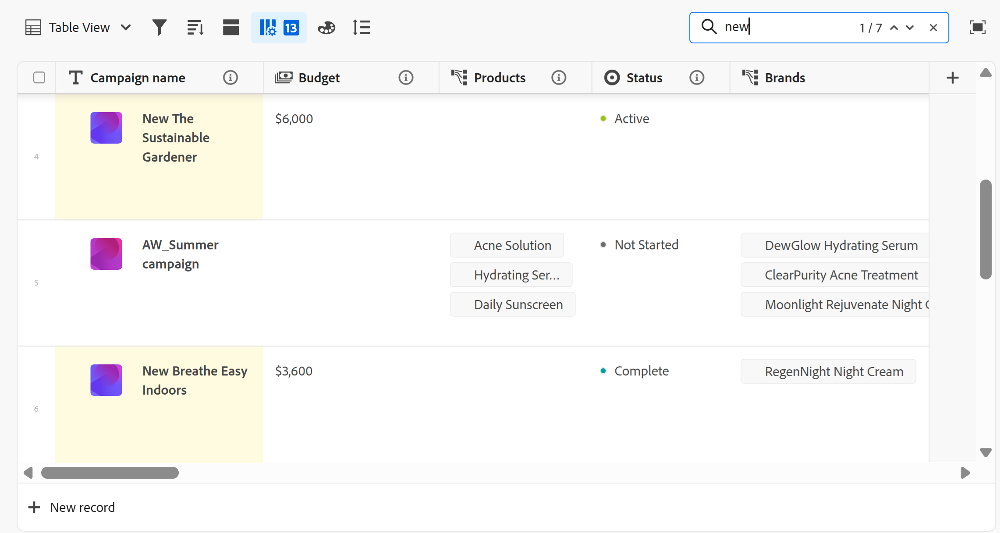

# Tabellenansicht verwalten

<!--
title: Manage the table view
description: You can display records in a table view when using Adobe Workfront Planning. 
hidefromtoc: yes
author: Alina
feature: Work Management
role: User
hide: yes
-->

<!--update the metadata with real information when making this available in TOC and in the left nav-->

{{planning-important-intro}}

Beim Zugriff auf die Datensatztypseite in der Adobe Workfront-Planung können Sie Datensätze und deren Felder in einer Tabellenansicht anzeigen.

Informationen zu Datensatzansichten und deren Verwaltung finden Sie unter [Verwalten von Datensatzansichten](/help/quicksilver/planning/views/manage-record-views.md).

## Zugriffsanforderungen

Sie müssen über folgenden Zugriff verfügen, um die Schritte in diesem Artikel ausführen zu können:

<!--at GA the plan below will change to Prime, Select and Ultimate only-->

<table style="table-layout:auto">
 <col>
 </col>
 <col>
 </col>
 <tbody>
    <tr>
<tr>
<td>
   
 Produkt
 </td>
   <td>
   
 Adobe Workfront
 </td>
  </tr>  
 <td role="rowheader">
Adobe Workfront-Abkommen
</td>
   <td>

Ihr Unternehmen muss in der Phase des frühen Zugriffs für die Workfront-Planung eingeschrieben sein 

   </td>
  </tr>
  <tr>
   <td role="rowheader">
Adobe Workfront-Abo
</td>
   <td>

Alle

   </td>
  </tr>
  <tr>
   <td role="rowheader">
Adobe Workfront-Lizenz*
</td>
   <td>
   
Neu: Standard

   Oder
   
Aktuell: Plan 
 
  </td>
  </tr>

<tr>
   <td role="rowheader">
Konfigurationen auf Zugriffsebene
</td>
   <td> Es gibt keine Zugriffskontrollen für die Adobe Workfront-Planung
  
</td>
  </tr>

<tr>
   <td role="rowheader">
Berechtigungen
</td>
   <td> 
Berechtigungen für eine Ansicht verwalten
  
   
Berechtigungen für eine Ansicht anzeigen, um die Anzeigeeinstellungen vorübergehend zu ändern

</td>
  </tr>

<tr>
   <td role="rowheader">
Layout-Vorlage
</td>
   <td> 
Allen Benutzern, einschließlich Workfront-Administratoren, muss eine Layoutvorlage zugewiesen werden, die den Planungsbereich im Hauptmenü enthält. 
 
Weitere Informationen finden Sie unter <a href="/help/quicksilver/planning/access/access-overview.md">Zugriffsübersicht</a>. 
 
</td>
  </tr>
 </tbody>
</table>

*Weitere Informationen finden Sie unter [Zugriffsanforderungen in der Workfront-Dokumentation](/help/quicksilver/administration-and-setup/add-users/access-levels-and-object-permissions/access-level-requirements-in-documentation.md).

## Datensätze mithilfe der Tabellenansicht bearbeiten

Sie können Datensatzinformationen nur in der Tabellenansicht bearbeiten.

Weitere Informationen zum Bearbeiten von Datensätzen in der Tabellenansicht finden Sie unter [Datensätze bearbeiten](/help/quicksilver/planning/records/edit-records.md).

## Tabellenansicht verwalten {#manage-a-table-view}

<!--insert screen shot of table view-->

Bei der Erstellung einer Tabellenansicht werden alle Datensätze des ausgewählten Typs in einer Tabelle angezeigt. Jede Zeile ist ein eindeutiger Datensatz und jede Spalte ist ein Datensatzfeld. Alle Felder und Datensätze werden standardmäßig angezeigt.

So verwalten Sie eine Tabellenansicht:

1. Erstellen Sie eine Tabellenansicht, wie im Artikel [Ansichten von Datensätzen verwalten](/help/quicksilver/planning/views/manage-record-views.md) beschrieben.

   

1. (Optional) Klicken Sie auf **Zeilenhöhe** und wählen Sie dann aus den folgenden Optionen aus, um die Höhe der Tabellenzeilen zu ändern:
   * Klein
   * Mittel
   * Groß

1. Aktualisieren Sie die folgenden Ansichtselemente wie in den folgenden Unterabschnitten beschrieben:
   * [Spalten (oder Felder)](#add-columns-or-fields)
   * [Zeilen (oder Datensätze)](#add-rows-or-records)
   * [Filter](#add-filters)
   * [Gruppierung](#add-groupings)
   * [sortieren](#add-a-sort)

### Spalten (oder Felder) hinzufügen {#add-columns}

Die Spaltenüberschriften einer Tabellenansicht zeigen Felder an, die mit den Datensätzen in der Ansicht verknüpft sind. Dieselben in der Tabellenansicht angezeigten Felder werden auch im Abschnitt Details eines Datensatzes angezeigt. Weitere Informationen finden Sie unter [Datensätze bearbeiten](/help/quicksilver/planning/records/edit-records.md).

<!--this is not available yet:You can display record fields (or columns) in both a table and a timeline view. However, the number of columns displayed in the table of the timeline view is limited and you cannot add columns in addition to those selected by default.-->

Das Hinzufügen von Spalten zu einer Ansicht entspricht dem Hinzufügen von Feldern zu einem Datensatztyp.

Sie können bis zu 500 Felder (oder Spalten) in einer Tabellenansicht hinzufügen.

1. Wechseln Sie zu einer Seite vom Typ Datensatz und klicken Sie auf die Registerkarte &quot;Tabellenansicht&quot;, oder klicken Sie auf **+ Ansicht** , um eine neue Ansicht hinzuzufügen, und wählen Sie dann **Tabelle** aus.

1. Beginnen Sie mit dem Hinzufügen von Feldern (oder Spalten), wie im Artikel [Felder erstellen](/help/quicksilver/planning/fields/create-fields.md) beschrieben.

   Die hinzugefügten Spalten sind für alle Benutzer sichtbar, die auf den Datensatztyp zugreifen und als neue Felder auf der Datensatzseite hinzugefügt werden.

1. Führen Sie einen der folgenden Schritte aus, um die Spalten in der Tabelle neu anzuordnen:

   * Ziehen Sie die Spaltenüberschrift in den Arbeitsbereich und legen Sie sie an der gewünschten Position ab. Die Spalte, die Sie kurz verschoben haben, wird mit blauem Hintergrund angezeigt, bis Sie weitere Anpassungen an der Tabelle vornehmen.

   * Klicken Sie in der Symbolleiste der Tabelle auf **Felder** , ziehen Sie die Felder in der gewünschten Reihenfolge per Drag-and-Drop und klicken Sie dann außerhalb des Felds **Sichtbarkeit der Felder und Reihenfolge** , um sie zu schließen.

     

     >[!TIP]
     >
     >* Das Feld Name ist standardmäßig immer das erste Feld in der Tabellenansicht. Dies gilt als primäres Feld.
     >
     >* Sie können das Feld Name nicht an eine andere Position verschieben, es sei denn, Sie bestimmen ein anderes Feld als primäres Feld. Weitere Informationen finden Sie in Schritt 4. <!--accurate?-->
     >
     >

   * Ersetzen Sie das Feld in der ersten Spalte durch ein anderes Feld, indem Sie das primäre Feld ändern. Weitere Informationen finden Sie in Schritt 4. <!--accurate?-->

1. (Optional) Bewegen Sie den Mauszeiger über einen Feldnamen in der Spaltenüberschrift eines Felds, das nicht in der ersten Spalte der Tabelle angezeigt wird, klicken Sie auf den nach unten zeigenden Pfeil rechts neben dem Feldnamen und klicken Sie dann auf **Als primäres Feld festlegen** .

   

1. Klicken Sie zur Bestätigung auf **Feld festlegen** .

   Das Feld wird zu einem primären Feld, was bedeutet, dass es als erste Spalte der Tabellenansicht angezeigt wird. Das vorherige primäre Feld wechselt zur zweiten Spalte.

   Primäre Felder werden zum Titel des Datensatzes und werden im Kopfzeilenbereich der Datensatzseite und überall dort angezeigt, wo die Datensätze angezeigt werden. Beispielsweise wird der Datensatztitel in verbundenen Feldern und allen Ansichten angezeigt. Weitere Informationen zu Primärfeldern finden Sie unter [Übersicht über Primäre Felder](/help/quicksilver/planning/fields/primary-field-overview.md).

1. Klicken Sie auf die Spaltentrennlinien und ziehen Sie sie an die gewünschte Stelle, um die Spaltenbreite zu vergrößern.

   >[!TIP]
   >
   >Die Änderungen an der Spaltenbreite und -reihenfolge sind dauerhaft und für alle Benutzer sichtbar, die auf den Datensatztyp zugreifen.

1. Bewegen Sie den Mauszeiger über die Spaltenüberschrift, klicken Sie dann auf den nach unten zeigenden Pfeil und klicken Sie dann auf **Feld ausblenden** .

   Oder

   Klicken Sie in der Symbolleiste der Tabelle auf **Felder** und deaktivieren Sie den Umschalter, der den auszublendenden Feldern (oder Spalten) zugeordnet ist. Das Feld **Sichtbarkeit und Reihenfolge der Felder** wird angezeigt.

   >[!TIP]
   >
   >Die Anzahl der ausgeblendeten Felder wird links neben dem Symbol Felder in der Symbolleiste angezeigt.

1. Klicken Sie auf das Symbol **Felder** und aktivieren Sie den Umschalter für die Felder, die in den Spalten der Tabelle angezeigt werden sollen. Alle Felder werden standardmäßig angezeigt.

1. Führen Sie die folgenden Schritte aus, um schnell nach Datensätzen zu suchen, die einem Keyword entsprechen:

   1. Klicken Sie auf das Symbol **Suchen**  und beginnen Sie mit der Eingabe eines Suchbegriffs, das mit einem Feld eines Datensatzes verknüpft ist, das auf dem Bildschirm angezeigt wird. Die Anzahl der richtigen Übereinstimmungen wird neben dem Suchelement angezeigt und das Feld mit der richtigen Übereinstimmung wird hervorgehoben.

      

      Sie können beliebige Wörter oder Sonderzeichen verwenden, die auf dem Bildschirm sichtbar sind.

      Sie können keine Suchbegriffe verwenden, die Feldern zugeordnet sind, die in der Tabellenansicht ausgeblendet sind.

   1. Drücken Sie auf **Enter** auf Ihrer Tastatur, um zum nächsten gefundenen Feld zu wechseln.

   1. (Optional) Wenn mehrere Übereinstimmungen vorliegen, klicken Sie auf die Pfeile nach oben und unten rechts neben dem Suchbegriff, um alle Übereinstimmungen in der Tabelle zu finden.

   1. Klicken Sie im Suchfeld auf das Symbol **x** , um den Suchbegriff zu löschen.

### Zeilen (oder Datensätze) hinzufügen {#add-rows}

Die Zeilen einer Tabellenansicht zeigen einzelne Datensätze des ausgewählten Datensatztyps an.

Sie können bis zu 50.000 Datensätze (oder Zeilen) für einen Datensatztyp haben.

1. Wechseln Sie zu einer Seite vom Typ Datensatz und klicken Sie auf die Registerkarte &quot;Tabellenansicht&quot;, oder klicken Sie auf **+ Ansicht** , um eine neue Ansicht hinzuzufügen, und wählen Sie dann **Tabelle** aus.

1. Beginnen Sie mit dem Hinzufügen von Datensätzen (oder Zeilen), wie im Artikel [Datensätze erstellen](/help/quicksilver/planning/records/create-records.md) beschrieben.

   Die Datensätze, die Sie in der Tabellenansicht hinzufügen, werden sofort gespeichert und sind für alle Benutzer sichtbar, die über Ansicht oder höhere Berechtigungen für den Arbeitsbereich verfügen.

1. (Optional) Fügen Sie jedem Datensatz eine Miniaturansicht hinzu, klicken Sie in der oberen rechten Ecke der Tabelle auf **Felder** und wählen Sie dann den Umschalter für das Feld **Miniatur** aus, um es links neben dem primären Feld anzuzeigen. Die Auswahl ist standardmäßig aufgehoben.

   Weitere Informationen finden Sie unter [Hinzufügen einer Miniaturansicht zu einem Datensatz](/help/quicksilver/planning/records/add-thumbnails-to-records.md).

1. (Optional) Wählen Sie einen oder mehrere Datensätze in einer Zeile aus und ziehen Sie dann das Symbol **handle**  auf die linke Seite des Datensatzes, um die Zeilen neu anzuordnen.

   >[!NOTE]
   >
   >Wenn Sie mindestens eine Sortierung auf die Tabellenansicht anwenden, können Sie die Reihenfolge der Zeilen nicht ändern.
   >
   >Die Änderungen an der Zeilenreihenfolge sind für alle Benutzer sichtbar, die auf den Datensatztyp zugreifen

<!-- this section below links from the timeline view; consider splitting them if they become different-->

### Filter hinzufügen {#add-filters}

Mithilfe von Filtern können Sie die Anzahl der auf dem Bildschirm angezeigten Informationen verringern.

Beachten Sie Folgendes beim Arbeiten mit Filtern in der Tabellenansicht:

<!-- this list is almost identical to the one for the table view - update both-->

* Die Filter, die Sie für die Tabellenansicht erstellen, funktionieren unabhängig von den Filtern in der Timeline-Ansicht, wenn sie auf denselben Datensatztyp angewendet werden.

* Die Filter sind für die ausgewählte Ansicht eindeutig. Für zwei Tabellenansichten desselben Datensatztyps können unterschiedliche Filter angewendet werden. Zwei Benutzer, die sich dieselbe Tabellenansicht ansehen, sehen denselben Filter, der derzeit angewendet wird.

* Sie können die erstellten Filter nicht benennen und auf eine Tabellenansicht anwenden.

* Durch das Entfernen von Filtern werden diese von allen Benutzern entfernt, die auf denselben Datensatztyp wie Sie zugreifen, und es wird die gleiche Ansicht wie die von Ihnen verwendete verwendet.

* Das Hinzufügen von Filtern zur Tabellenansicht entspricht dem Hinzufügen von Filtern zur Timeline-Ansicht.

* Sie können nach verbundenen Datensatzfeldern oder Suchfeldern filtern.

* Sie können nach Suchfeldern filtern, die mehrere Werte anzeigen.

* Sie können auf ein Feld verweisen, das bis zu vier Ebenen vom aktuellen Datensatztyp entfernt ist. Wenn Sie beispielsweise einen Filter für einen Aktivitäts-Record-Typ erstellen und die Aktivität mit dem Produktdatensatztyp verbunden ist, der mit dem Campaign-Datensatz-Typ verbunden ist, der mit einem Workfront-Projekt verbunden ist, können Sie das Budget des Projekts in dem Filter referenzieren, den Sie für den Aktivitäts-Record-Typ erstellen.

So fügen Sie einer Tabellenansicht einen Filter hinzu:

1. Erstellen Sie eine Tabellenansicht für eine Seite vom Typ &quot;Datensatz&quot;, wie im Artikel [Ansichten des Datensatzes verwalten](/help/quicksilver/planning/views/manage-record-views.md) beschrieben.
1. Wählen Sie eine Tabellenansicht aus und klicken Sie dann oben rechts in der Tabelle auf **Filter** .
1. Klicken Sie auf **Bedingung hinzufügen** und fügen Sie die folgenden Informationen hinzu:

   * **Wählen Sie ein Feld** aus, nach dem Sie <!-- the tip below might change--> filtern möchten

   * **Wählen Sie eine Option** (oder einen Filter-Modifikator) aus, um festzulegen, welche Art von Bedingung das Feld erfüllen muss

     Die nachstehende Tabelle zeigt die verfügbaren Modifikatoren für jeden Feldtyp.

     <table>
        <thead>
        <tr>
            <th><b>Feldtyp</b></th>
            <th><b>Modifikatoren</b></th>
        </tr>
        </thead>
        <tbody>
        <tr>
            <td>Einzeiliger Absatz, Formel </td>
            <td>
Enthält

            
Enthält nicht

            
Ist

            
Ist nicht

            
Ist leer

            
Ist nicht leer
</td>
        </tr>
        <tr><td>Einzelauswahl</td>
            <td>
Ist

            
Ist nicht

            
Ist ein beliebiges von

            
Ist keines von

            
Ist leer

            
Ist nicht leer
</td>
        </tr>
        <tr>
            <td>Mehrfachauswahl, Personen</td>
            <td>
Hat eines von

            
Hat alle von

            
Ist genau

            
Hat keines von

            
Ist leer

            
Ist nicht leer
</td>
        </tr>
        <tr>
            <td>Zahl, Prozentsatz, Währung</td>
            <td>
=

            
≠

            
 &lt; 

            
&gt;

            
≤

            
≥

            
Ist leer

            
Ist nicht leer
</td>
        </tr>
        <tr>
            <td>Datum</td>
            <td>
Ist

            
Ist nicht

            
Ist nach

            
Ist vor

            
Ist zwischen

Ist nicht zwischen

            
Ist leer

Ist nicht leer
</td>
        </tr>

     <tr>
            <td>Kontrollkästchen</td>
            <td>
Ist

        </tr>
        </tbody>
        </table>

   * Wählen Sie einen Wert für das ausgewählte Feld aus.

   

   Es gibt keine Beschränkung für die Anzahl der Filterbedingungen, die Sie hinzufügen können.

1. (Optional) Klicken Sie auf **Bedingung hinzufügen** , um eine weitere Filteroption hinzuzufügen und die oben genannten Schritte zu wiederholen. Die Anzahl der angewendeten Filter wird links neben dem Symbol Filter angezeigt.
1. Klicken Sie auf die folgenden Operatoren, um anzugeben, wie die Filterbedingungen verbunden werden und angewendet werden sollen:

   * **And**: Alle angegebenen Bedingungen müssen erfüllt sein.
   * **Oder**: Jede der angegebenen Bedingungen muss erfüllt sein. Dies ist die Standardoption.

   Die Liste der Datensätze wird automatisch gefiltert.  <!--at this time, you can't name and save the filter - but will this change?!-->
   <!-- asked on the task for the simple filters whether there is a limitation for how many statements a filter can have?!-->

1. (Optional) Klicken Sie auf **Filter** und dann auf das Symbol **x** , um einen Filter zu entfernen. <!--right now you cannot "clear all" for filters, but this might come later-->

### Gruppierungen hinzufügen {#add-groupings}

<!--this section exists in the timeline view too, but the display is slightly different, so I kept both steps; consider updating both sections if any updates to groupings are introduced-->

Sie können Datensätze nach ähnlichen Informationen gruppieren, wenn Sie eine Gruppierung auf eine Ansicht anwenden.

Das Hinzufügen von Gruppierungen in der Tabellenansicht ähnelt dem Hinzufügen von Gruppierungen zur Timeline-Ansicht.

Beachten Sie Folgendes:

* Sie können Gruppierungen sowohl in der Tabellen- als auch in der Timeline-Ansicht anwenden. Die Gruppierungen der Tabellenansicht sind unabhängig von denen in der Timeline-Ansicht desselben Datensatztyps.
* Sie können in einer Ansicht drei Gruppierungsebenen anwenden. Die Datensätze werden in der von Ihnen ausgewählten Reihenfolge gruppiert.
&lt;!—* Bei Verwendung der API können Sie bis zu 4 Gruppierungsebenen verwenden. —jetzt mit diesem hier abgleichen—>
* Die Gruppierungen unterscheiden sich je nach ausgewählter Ansicht. Bei zwei Tabellenansichten desselben Datensatztyps können unterschiedliche Gruppierungen angewendet werden. Zwei Benutzer, die sich dieselbe Tabellenansicht ansehen, sehen dieselbe Gruppierung, die derzeit angewendet wird.
* Sie können die für eine Tabellenansicht erstellten Gruppierungen nicht benennen.
* Durch das Entfernen von Gruppierungen werden diese von allen Benutzern entfernt, die auf denselben Datensatztyp zugreifen wie Sie und die dieselbe Ansicht wie Sie anzeigen.
* Sie können die unter einer Gruppierung aufgelisteten Datensätze bearbeiten.
* Sie können nach verbundenen Datensatzfeldern oder Suchfeldern gruppieren.
* Wenn Sie nach Suchfeldern mit mehreren Werten gruppieren (die nicht von einem Aggregator zusammengefasst wurden), werden Datensätze nach jeder eindeutigen Kombination von Feldwerten gruppiert.
* Sie können auf ein Feld verweisen, das bis zu vier Ebenen vom aktuellen Datensatztyp entfernt ist. Wenn Sie beispielsweise eine Gruppierung für einen Aktivitäts-Record-Typ erstellen und die Aktivität mit dem Produktdatensatz-Typ verbunden ist, der mit dem Campaign-Datensatz-Typ verbunden ist, der mit einem Workfront-Projekt verbunden ist, können Sie den Projektstatus in der für den Aktivitäts-Record-Typ erstellten Gruppierung referenzieren.
<!--checking into this: * You can apply up to 4 levels of grouping when using the API. -->
<!-- checking also into this: * You cannot group by a Paragraph-type field.-->

So fügen Sie eine Gruppierung hinzu:

1. Erstellen Sie eine Timeline-Ansicht für einen Datensatztyp, wie im Artikel [Ansichten von Datensätzen verwalten](/help/quicksilver/planning/views/manage-record-views.md) beschrieben.
1. Klicken Sie oben rechts in der Tabellenansicht auf **Gruppierung** .

   

1. Klicken Sie auf eines der vorgeschlagenen Felder oder auf **Ein anderes Feld auswählen**, suchen Sie nach einem anderen Feld und klicken Sie dann auf dieses Feld, wenn es in der Liste angezeigt wird.

   Die Gruppierung wird automatisch auf die Tabelle angewendet und Datensätze werden unter der Trennlinie der Gruppierung angezeigt.

1. (Optional) Klicken Sie auf **Bedingung hinzufügen** und wiederholen Sie die oben genannten Schritte, um bis zu 3 Gruppierungen hinzuzufügen.

   Die Anzahl der für die Gruppierung ausgewählten Felder wird neben dem Gruppierungssymbol angezeigt.

   

1. (Optional) Klicken Sie im Feld **Datensatz gruppieren nach** auf das Symbol **x** rechts neben einem Feld, das für die Gruppierung ausgewählt wurde, um die Gruppierung zu entfernen.

   Oder

   Klicken Sie auf **Alle löschen** , um alle Felder zu entfernen.

1. Klicken Sie auf außerhalb des Felds **Gruppeneinträge nach** , um sie zu schließen.
1. (Optional) Klicken Sie am Ende einer Gruppierung auf **+ Neuer Datensatz** , um neue Datensätze hinzuzufügen. Aktualisieren Sie dann Ihre Seite, um den neuen Datensatz zur entsprechenden Gruppierung hinzuzufügen. <!--this might need to be changed when they add the Refresh button on the toolbar of the table view-->

### Sortierung hinzufügen {#sort-information}

Durch Anwendung einer Sortierung können Sie Informationen in einer bestimmten Reihenfolge organisieren.

Sie können die folgenden Informationen sortieren:

* Alle Datensätze in einer Tabellenansicht. <!--or timeline view. ***********verify this is the case for the timeline view*********************-->
  <!--* All groupings. - this is not available yet-->

Beachten Sie beim Sortieren von Datensätzen in der Tabellenansicht Folgendes:

<!-- if this is available for the timeline view, update both when you update one-->

* Die Sortierung ist für die ausgewählte Ansicht eindeutig. Für zwei Tabellenansichten desselben Datensatztyps können unterschiedliche Sortierkriterien angewendet werden. Zwei Benutzer, die sich dieselbe Tabellenansicht ansehen, sehen dieselbe Sortierung, die derzeit angewendet wird.

* Sie können die erstellten Sortierungen nicht benennen und auf eine Tabellenansicht anwenden.

* Die von Ihnen erstellte Sortierung wird beim Navigieren beibehalten.

* Sie können so viele Felder sortieren, wie in der Tabellenansicht eines Datensatztyps angezeigt werden.

* Sie können nicht nach verbundenen Datensatzfeldern sortieren, sondern nach Suchfeldern aus verbundenen Datensatztypen.

* Wenn Sie nach Suchfeldern mit mehreren Werten sortieren (die nicht von einem Aggregator zusammengefasst wurden), wird der erste Wert für die Sortierung verwendet.

* Wenn Sie Sortierungskriterien entfernen, werden diese von allen Benutzern entfernt, die auf denselben Datensatztyp wie Sie zugreifen, und es wird die gleiche Ansicht wie Sie verwendet.

* Sie können auf ein Feld verweisen, das bis zu vier Ebenen vom aktuellen Datensatztyp entfernt ist. Wenn Sie beispielsweise eine Sortierung für einen Aktivitäts-Record-Typ erstellen und die Aktivität mit dem Produktdatensatztyp verbunden ist, der mit dem Campaign-Datensatz-Typ verbunden ist, der mit einem Workfront-Projekt verbunden ist, können Sie den Projektstatus in der Art referenzieren, die Sie für den Aktivitäts-Record-Typ erstellen.

Gehen Sie wie folgt vor, um <!--ungrouped (add this when sorting for groupings will be available--> -Datensätze zu sortieren:

1. Erstellen Sie eine Tabellenansicht, wie im Artikel [Ansichten von Datensätzen verwalten](/help/quicksilver/planning/views/manage-record-views.md) beschrieben.
1. Klicken Sie oben rechts in der Tabelle auf das Symbol **Sortieren**  .

   Oder

   Bewegen Sie den Mauszeiger über den Namen einer Spalte in der Tabellenansicht, klicken Sie auf den nach unten zeigenden Pfeil rechts neben dem Spaltenüberschriftnamen und klicken Sie dann auf **Nach diesem Feld sortieren**. Das Feld wird als Sortierungsauswahl im Sortiersymbol in der oberen rechten Ecke der Tabellenansicht hinzugefügt.

1. (Bedingt) Klicken Sie im Feld **Sortieren von Datensätzen nach** auf eines der vorgeschlagenen Felder oder klicken Sie auf **Wählen Sie ein anderes Feld** und suchen Sie nach einem anderen Feld. Klicken Sie dann auf dieses Feld, wenn es in der Liste angezeigt wird.

   Die Sortierung wird automatisch auf die Tabellenansicht angewendet und die Datensätze werden nach den von Ihnen ausgewählten Kriterien sortiert angezeigt.

   <!-- add a step that you can rearrange the sorting fields here, when this will be possible-->

1. (Optional) Klicken Sie auf **Bedingung hinzufügen** und wiederholen Sie die oben genannten Schritte, um nach zusätzlichen Feldern zu sortieren.

   Die Anzahl der Felder, nach denen Sie sortieren möchten, wird links neben dem Symbol Sortieren in der oberen rechten Ecke der Symbolleiste angezeigt. Sie können nur Felder auswählen, die in den Spalten der Tabellenansicht angezeigt werden.

1. (Optional) Klicken Sie im Feld **Sortieren von Datensätzen nach** auf das Symbol **x** rechts neben einem Sortierfeld, um die Sortierung zu entfernen.

   Oder

   Klicken Sie auf **Alle löschen** , um alle Felder aus der Sortierung zu entfernen.

1. Klicken Sie außerhalb des Felds **Sortieren von Datensätzen nach** , um sie zu schließen.

   

   Die in der Tabelle angezeigten Informationen werden nach den von Ihnen ausgewählten Kriterien sortiert.

   In den für die Sortierung ausgewählten Feldern wird ein Sortiersymbol angezeigt, gefolgt von einer Zahl, die die Reihenfolge angibt, in der die Sortierung angewendet wird.

<!-- this is not available yet: 

To sort grouped records: 

1. Create a view, as described in [Create or edit record views](#create-or-edit-record-views). 
1. ************************* add steps here for sorting grouped records****************

-->
