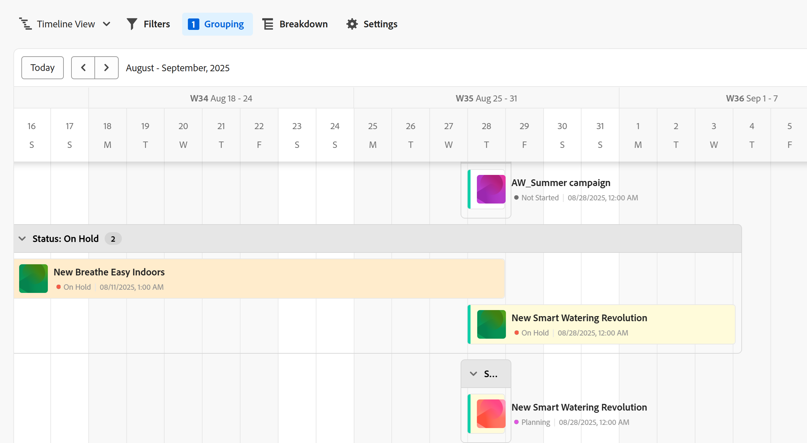
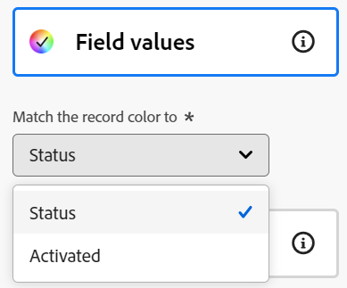

# Zeitleisten-Ansicht verwalten

<!--The highlighted information on this page refers to functionality not yet generally available. It is available only in the Preview environment for all customers. After the monthly releases to Production, the same features are also available in the Production environment for customers who enabled fast releases.    

For information about fast releases, see [Enable or disable fast releases for your organization](/help/quicksilver/administration-and-setup/set-up-workfront/configure-system-defaults/enable-fast-release-process.md). -->

{{planning-important-intro}}

In Adobe Workfront Planning können Sie beim Zugriff auf die Seite „Datensatztyp“ Datensätze in einer Zeitleisten-Ansicht anzeigen.

Weitere Informationen zu Datensatzansichten finden Sie unter [Verwalten von Datensatzansichten](/help/quicksilver/planning/views/manage-record-views.md).

## Zugriffsanforderungen

+++ Erweitern Sie , um die Zugriffsanforderungen anzuzeigen.

<table style="table-layout:auto"> 
<col> 
</col> 
<col> 
</col> 
<tbody> 
    <tr> 
<tr> 
<td> 
   
 Produkte
 </td> 
   <td> 
   <ul><li>
 Adobe Workfront
</li> 
   <li>
 Adobe Workfront-Planung
</li></ul></td> 
  </tr>   
<tr> 
   <td role="rowheader">
Adobe Workfront-Plan*
</td> 
   <td> 

Einer der folgenden Workfront-Pläne:
 
<ul><li>Auswählen</li> 
<li>Erstklassig</li> 
<li>Ultimativ</li></ul> 

Workfront Planning ist nicht für ältere Workfront-Pläne verfügbar
 
   </td> 
<tr> 
   <td role="rowheader">
Adobe Workfront-Planungspaket*
</td> 
   <td> 

Beliebig 
 

Weitere Informationen zu den einzelnen Workfront-Planungsplänen erhalten Sie von Ihrem Workfront Account Manager. 
 
   </td> 
 <tr> 
   <td role="rowheader">
Adobe Workfront-Plattform
</td> 
   <td> 

Um auf Workfront Planning zugreifen zu können, muss die Workfront-Instanz Ihres Unternehmens in das einheitliche Adobe-Erlebnis integriert sein.
 

Weitere Informationen finden Sie unter <a href="/help/quicksilver/workfront-basics/navigate-workfront/workfront-navigation/adobe-unified-experience.md">Adobe Unified Experience for Workfront</a>. 
 
   </td> 
   </tr> 
  </tr> 
    <td role="rowheader">
Adobe Workfront-Lizenz*
</td> 
   <td>
 Standard zum Erstellen und Löschen von Ansichten

   
Mitwirkender oder höher zum Aktualisieren von Ansichtselementen

   
Workfront Planning ist nicht für ältere Workfront-Lizenzen verfügbar
 
  </td> 
  </tr> 
  <tr> 
   <td role="rowheader">
Konfiguration der Zugriffsebene
</td> 
   <td> 
Es gibt keine Zugriffssteuerungsebenen für Adobe Workfront Planning
   
</td> 
  </tr> 
<tr> 
   <td role="rowheader">
Objektberechtigungen
</td> 
   <td>   
Verwalten der Berechtigungen für eine Ansicht
  
   
Anzeigeberechtigungen für eine Ansicht, um die Anzeigeeinstellungen vorübergehend zu ändern oder zu duplizieren
 </td> 
  </tr> 
<tr>
   <td role="rowheader">
Layout-Vorlage
</td>
   <td> Benutzenden mit einer Light- oder Contributor-Lizenz muss eine Layout-Vorlage zugewiesen werden, die Planning enthält.
   
Für Standardbenutzer und Systemadministratoren sind die Planungsbereiche standardmäßig aktiviert.

</li></ul>
</td>
  </tr>
</tbody> 
</table>

*Weitere Informationen zu Zugriffsanforderungen für Workfront finden Sie unter [Zugriffsanforderungen in der Dokumentation zu Workfront](/help/quicksilver/administration-and-setup/add-users/access-levels-and-object-permissions/access-level-requirements-in-documentation.md).

+++

## Verwalten einer Zeitleisten-Ansicht {#manage-a-timeline-view}

Beim Erstellen einer Zeitleisten -Ansicht werden alle Datensätze des ausgewählten Datensatztyps in einer chronologischen Zeitleiste angezeigt.

Beachten Sie Folgendes:

* Sie können eine Zeitleisten -Ansicht nur erstellen, wenn Sie mindestens zwei Datumsfelder mit einem Datensatztyp verknüpft haben. Wenn Sie ein oder kein Datumsfeld mit einem Datensatztyp verknüpft haben, ist die Option Zeitleisten-Ansicht abgeblendet.

  Beim Erstellen einer Zeitleisten-Ansicht können Sie aus den folgenden Datumsfeldern auswählen:

   * Datensatzdaten
   * Systemgenerierte Felder aufzeichnen: Erstellungsdatum, Datum der letzten Änderung
   * Daten aus verbundenen Datensatz- oder Objekttypen nachschlagen (nur wenn Sie beim Verbinden der Datensatz- oder Objekttypen einen Aggregator für sie hinzugefügt haben)
* Je nach den mit den Datensätzen verknüpften Daten werden in den folgenden Szenarien einige Datensätze möglicherweise nicht in der Zeitleisten -Ansicht angezeigt:

   * Wenn das Start- und Enddatum keine Werte aufweisen
   * Wenn das Start- oder Enddatum keinen Wert hat
   * Wenn das Startdatum nach dem Enddatum liegt

<!--

* You can create and edit records in the timeline view. For information, see [Create records](/help/quicksilver/planning/records/create-records.md).

-->

So verwalten Sie eine Zeitleisten -Ansicht:

1. Navigieren Sie zur Seite für den Datensatztyp, für den Sie die Zeitleiste anzeigen möchten.
1. Erstellen Sie eine Zeitleisten -Ansicht, wie im Artikel [Verwalten von Datensatzansichten](/help/quicksilver/planning/views/manage-record-views.md) beschrieben.

   

   Die mit dem ausgewählten Datensatztyp verknüpften Datensätze werden standardmäßig als Balken in einer Zeitleiste angezeigt und in chronologischer Reihenfolge ihres Startdatums sortiert.

   >[!TIP]
   >
   >    Die Sortierung der Datensätze in der Zeitleiste ist in der kompakten Ansicht nicht sichtbar.

1. (Bedingt) Wenn Ihr Administrator benutzerdefinierte Quartale aktiviert hat und Workfront Probleme bei der Konfiguration der benutzerdefinierten Quartale erkennt, erhalten Sie möglicherweise eine Warnung, wenn Sie die Zeitleisten -Ansicht öffnen.

   Die folgenden Szenarien sind vorhanden:

   * Wenn zwischen den Daten der Quartale Lücken oder Überschneidungen festgestellt wurden, erhalten Sie möglicherweise eine Benachrichtigung, dass benutzerdefinierte Quartale jetzt eingerichtet werden können und möglicherweise bearbeitet werden müssen.

     

     >[!TIP]
     >
     >Diese Nachricht sollte nur unmittelbar nach dem Kauf angezeigt werden, wenn die Planung und die benutzerdefinierten Quartale Ihrer Organisation bereits vor dem Kauf aktiviert waren. Überschneidungen und Lücken zwischen den Quartalen sind nach der Aktivierung von Workfront Planning für Ihr Unternehmen nicht zulässig.

   * Wenn Quartale nur teilweise eingerichtet wurden und im selben Jahr einige Monate fehlen, erhalten Sie möglicherweise eine Benachrichtigung, wenn Sie scrollen, um die fehlenden Quartale anzuzeigen, die für den Rest des Jahres mit den fehlenden Quartalen eingerichtet werden müssen.

   

   Die Warnmeldungen zu den benutzerdefinierten Quartalen werden einmal pro Benutzer angezeigt.

   >[!NOTE]
   >
   >Ohne das benutzerdefinierte Quartal ordnungsgemäß gespeichert zu haben, zeigt die Zeitleisten -Ansicht die klassischen Quartale an.
   >Nach der Einrichtung von benutzerdefinierten Quartalen im Bereich „Setup“ werden in der Ansicht „Timeline“ die benutzerdefinierten Quartale anstelle der klassischen Quartale angezeigt.
   >Weitere Informationen finden Sie unter [Benutzerdefinierte Quartale aktivieren](/help/quicksilver/administration-and-setup/set-up-workfront/configure-system-defaults/enable-custom-quarters-projects.md).

1. (Bedingt) Wenn Sie Workfront-Administrator sind, klicken Sie auf **Zum Setup wechseln**, um Ihr Quartal einzurichten. Wenn nicht, klicken Sie **OK** und bitten Sie Ihren Workfront-Administrator, die benutzerdefinierten Quartale einzurichten.

   >[!TIP]
   >
   >Die Schaltfläche Zum Setup gehen wird nur für Workfront-Admins angezeigt.

1. (Optional und bedingt) Wenn der Datensatzname abgeschnitten ist, bewegen Sie den Mauszeiger über eine Datensatzleiste, um den vollständigen Namen des Datensatzes und zusätzliche Informationen anzuzeigen. Informationen dazu, wie Sie das Abschneiden der Datensatzleiste in der Zeitleiste einrichten, finden Sie im Abschnitt [Bearbeiten der Zeitleisten-Anzeigeeinstellungen](#edit-the-timeline-view-settings) in diesem Artikel.

1. Führen Sie einen der folgenden Schritte aus, um durch die Zeitleiste zu navigieren:

   * Klicken Sie auf das linke und rechte Symbol in der oberen linken Ecke oder verwenden Sie den horizontalen Bildlauf, um sich in der Zeitleiste vor- und rückwärts zu bewegen. Beim Aktualisieren der Seite wird der ausgewählte Zeitrahmen beibehalten.
   * Klicken **oben** auf „Heute“, um die Zeitleiste auf das heutige Datum zu zentrieren.
   * Wählen Sie eine der folgenden Optionen aus dem Dropdown-Menü Zeitrahmen aus, um die Zeitinkremente zu aktualisieren und die Ansicht zu aktualisieren:

      * **Year**: Zeigt Quartale und Monate mit Jahresangabe an.
      * **Quartal**: Zeigt Monate und Wochen mit Quartalsangabe an.
      * **Monat**: Zeigt Wochen und Tage an.
1. (Optional) Klicken Sie **Zur Kompaktansicht wechseln**, um die Datensätze anzuzeigen, deren Daten sich nicht in derselben Zeile schneiden. <!--check to see if they updated the name of the setting here-->
1. (Bedingt) Wenn Sie den Modus auf **Kompakt** geändert haben, klicken Sie auf **Zur Standardansicht wechseln**, um Datensätze in separaten Zeilen anzuzeigen. Die **Standard**-Option ist die Standardeinstellung.  <!--check to see if they updated the name of the setting here-->

1. Gehen Sie folgendermaßen vor, um schnell Datensätze zu finden, die einem Keyword entsprechen:

   1. Klicken Sie auf **Suche**-Symbol  und geben Sie einen Suchbegriff ein, der mit einem beliebigen Feld eines Datensatzes verknüpft ist, der auf dem Bildschirm angezeigt wird. Die Anzahl der richtigen Übereinstimmungen wird neben dem Suchelement angezeigt, und der Datensatz mit der richtigen Übereinstimmung wird hervorgehoben.

      

      Sie können jedes Wort oder jedes Sonderzeichen verwenden, das auf dem Bildschirm sichtbar ist.

      Sie können keine Keywords verwenden, die mit Feldern verknüpft sind, die in der Zeitleisten -Ansicht nicht angezeigt werden.

   1. Drücken Sie die Eingabetaste auf der Tastatur, um zum nächsten gefundenen Feld zu wechseln.
   1. (Optional) Wenn mehr als eine Übereinstimmung vorliegt, klicken Sie auf die Pfeile nach oben und unten rechts neben dem Suchbegriff, um alle Übereinstimmungen in der Tabelle zu finden.
   1. Klicken Sie auf das **x**-Symbol im Suchfeld, um den Suchbegriff zu löschen.

   <!--
    1. (Optional) Click the **Full screen** icon  to open the view in full screen, then the **Exit full screen** icon  or Escape on your keyboard to exit the full screen.  
-->

1. Aktualisieren Sie die folgenden Ansichtselemente wie in den folgenden Unterabschnitten beschrieben:
   * [Filter](#add-filters)
   * [Gruppierung](#add-grouping)
   * [Einstellungen](#edit-the-timeline-view-settings)
     <!--* [Sort](#add-sort) not yet in timeline; also check the anchor and make sure it's correct-->

1. (Optional) Klicken Sie auf **Aufschlüsselung**, um verbundene Datensätze in der Zeitleiste anzuzeigen.

   Weitere Informationen finden Sie im Abschnitt [Verwenden der Aufschlüsselungsfunktion zum Anzeigen verbundener Datensätze in der Zeitleisten](#break-down-connected-records-in-the-timeline-view) in diesem Artikel.

### Filter hinzufügen

Mithilfe von Filtern können Sie die Informationsmenge reduzieren, die auf dem Bildschirm angezeigt wird.

Beachten Sie beim Arbeiten mit Filtern in der Zeitleisten -Ansicht Folgendes:

<!-- this list is almost identical to the one for the table view - update both-->

* Die Filter, die Sie für eine Zeitleisten -Ansicht erstellen, funktionieren unabhängig von den Filtern in jeder anderen Ansicht, die auf denselben Datensatztyp angewendet wird.

* Die Filter sind für die ausgewählte Ansicht eindeutig. Auf zwei Zeitleisten-Ansichten desselben Datensatztyps können unterschiedliche Filter angewendet werden.

* Zwei Benutzer, die dieselbe Zeitleisten -Ansicht betrachten, sehen denselben Filter, der derzeit angewendet wird.

* Die Filter, die Sie für eine Zeitleisten -Ansicht erstellen, können nicht benannt werden.

* Das Entfernen von Filtern entfernt sie von allen, die auf denselben Datensatztyp zugreifen wie Sie und die dieselbe Ansicht anzeigen wie Sie.

* Sie können nach verbundenen Datensatzfeldern oder Suchfeldern filtern.
* Sie können nach Suchfeldern filtern, die mehrere Werte anzeigen.

So fügen Sie einen Filter zu einer Zeitleisten -Ansicht hinzu:

1. Erstellen Sie eine Zeitleisten -Ansicht für eine Seite vom Typ Datensatz, wie im Artikel [Verwalten von Datensatzansichten](/help/quicksilver/planning/views/manage-record-views.md) beschrieben.
1. Wählen Sie eine Zeitleisten -Ansicht aus **klicken Sie dann** oben rechts in der Tabelle auf „Filter“.
1. Klicken Sie **Bedingung hinzufügen** und fügen Sie die folgenden Informationen hinzu:

   * **Feld auswählen** nach dem Sie <!-- the tip below might change--> filtern möchten

   * **Wählen Sie eine Option** oder einen Filtermodifikator), um festzulegen, welche Art von Bedingung das Feld erfüllen muss

     In der folgenden Tabelle werden die verfügbaren Modifikatoren für jeden Feldtyp angezeigt.

     <table>
        <thead>
        <tr>
            <th><b>Feldtyp</b></th>
            <th><b>Modifikatoren</b></th>
        </tr>
        </thead>
        <tbody>
        <tr>
            <td>Einzeilig, Absatz, Formel </td>
            <td>
Enthält

            
Enthält nicht

            
Ist

            
Ist nicht

            
Ist leer

            
Ist nicht leer
</td>
        </tr>
        <tr><td>Einzelauswahl</td>
            <td>
Ist

            
Ist nicht

            
Ist ein beliebiges von

            
Ist keines von

            
Ist leer

            
Ist nicht leer
</td>
        </tr>
        <tr>
            <td>Mehrfachauswahl, Personen</td>
            <td>
Hat eines von

            
Hat alle von

            
Ist genau

            
Hat keines von

            
Ist leer

            
Ist nicht leer
</td>
        </tr>
        <tr>
            <td>Zahl, Prozentsatz, Währung</td>
            <td>
=

            
≠

            
 &lt; 

            
&gt;

            
≤

            
≥

            
Ist leer

            
Ist nicht leer
</td>
        </tr>
        <tr>
            <td>Datum</td>
            <td>
Ist

            
Ist nicht

            
Ist nach

            
Ist vor

            
Ist zwischen

Ist nicht zwischen

            
Ist leer

Ist nicht leer
</td>
        </tr>

     <tr>
            <td>Kontrollkästchen</td>
            <td>
Ist

        </tr>
        </tbody>
        </table>

   * Einen Wert für das ausgewählte Feld auswählen.

   

   Es gibt keine Begrenzung dafür, wie viele Filterbedingungen Sie hinzufügen können.

1. (Optional) Klicken Sie auf **Bedingung hinzufügen**, um eine weitere Filteroption hinzuzufügen, und wiederholen Sie die obigen Schritte. Die Anzahl der angewendeten Filter wird links neben dem Symbol **Filter** angezeigt.
1. Klicken Sie links auf die folgenden Operatoren, um anzugeben, wie die Filterbedingungen verbunden werden und angewendet werden sollen:

   * **AND**: Alle angegebenen Bedingungen müssen erfüllt sein.
   * **OR**: Jede der angegebenen Bedingungen muss erfüllt sein.
Dies ist die Standardoption.

   1. (Optional) Fügen Sie zusätzliche Filtergruppierungen hinzu und verbinden Sie sie mit den Operatoren **AND** oder **OR**.

      

   Die Liste der Datensätze wird automatisch anhand Ihrer Filterkriterien gefiltert.  <!--at this time, you can't name and save the filter - but will this change?!-->
   <!-- asked on the task for the simple filters whether there is a limitation for how many statements a filter can have?!-->

1. (Optional) Klicken Sie auf das Symbol **x**, um eine Filterbedingung zu entfernen.
1. (Optional) Klicken Sie auf **Filter** oder an einer anderen Stelle auf der Seite, um das Feld „Filter“ zu schließen. <!--right now you cannot "clear all" for filters, but this might come later-->

### Gruppierung hinzufügen

<!-- groupings are almost identical between this view and table  but they display a little differently, so I kept the steps for both; update in both places if they make changes to groupings-->

Beim Anwenden einer Gruppierung auf eine Ansicht können Sie Datensätze anhand ähnlicher Informationen gruppieren.

Beachten Sie beim Arbeiten mit Gruppierungen in der Zeitleisten -Ansicht Folgendes:

* Sie können Gruppierungen sowohl in der Tabellen- als auch in der Zeitleisten-Ansicht anwenden. Die Gruppierungen der Tabellenansicht sind unabhängig von denen in der Zeitleisten -Ansicht desselben Datensatztyps.
* Sie können in einer Ansicht drei Gruppierungsebenen anwenden. Die Datensätze werden in der Reihenfolge der ausgewählten Gruppierungen gruppiert.
&lt;!—* Bei Verwendung der API können Sie bis zu 4 Gruppierungsebenen anwenden. —Diese wird vorerst überprüft—>
* Die Gruppierungen sind für die ausgewählte Ansicht eindeutig. Auf zwei Tabellenansichten desselben Datensatztyps können unterschiedliche Gruppierungen angewendet werden. Zwei Benutzende, die dieselbe Tabellenansicht betrachten, sehen dieselbe Gruppierung, die derzeit angewendet wird.
* Die von Ihnen erstellten Gruppierungen können nicht für eine Tabellenansicht benannt werden.
* Das Entfernen von Gruppierungen entfernt sie von allen Benutzern, die auf denselben Datensatztyp zugreifen wie Sie und die dieselbe Ansicht anzeigen wie Sie.
* Sie können die unter einer Gruppierung aufgelisteten Datensätze bearbeiten.
* Sie können nach verbundenen Datensatzfeldern oder Suchfeldern gruppieren.
* Wenn Sie nach Suchfeldern mit mehreren Werten (die nicht von einem Aggregator zusammengefasst wurden) gruppieren, werden die Datensätze nach jeder eindeutigen Kombination von Feldwerten gruppiert.
* Sie können auf ein Feld verweisen, das bis zu vier Ebenen vom aktuellen Datensatztyp entfernt ist. Wenn Sie z. B. eine Gruppierung für einen Aktivitätsdatensatztyp erstellen und die Aktivität mit dem Produktdatensatztyp verbunden ist, der mit dem Kampagnendatensatztyp verbunden ist, der mit einem Workfront-Projekt verbunden ist, können Sie den Projektstatus in der Gruppierung referenzieren, die Sie für den Aktivitätsdatensatztyp erstellen.
<!--checking into this: * You can apply up to 4 levels of grouping when using the API. -->
<!-- checking also into this: * You cannot group by a Paragraph-type field.-->

So fügen Sie eine Gruppierung in der Zeitleisten -Ansicht hinzu:

1. Erstellen Sie eine Zeitleisten -Ansicht für einen Datensatztyp, wie im Artikel [Verwalten von Datensatzansichten](/help/quicksilver/planning/views/manage-record-views.md) beschrieben.
1. Klicken Sie **Gruppierung** in der oberen rechten Ecke der Zeitleisten -Ansicht.

   

1. Klicken Sie auf eines der vorgeschlagenen Felder oder klicken Sie auf **Anderes Feld auswählen** suchen Sie nach einem anderen Feld und klicken Sie dann auf das Feld, wenn es in der Liste angezeigt wird.

   Die Gruppierung wird automatisch auf die Zeitleiste angewendet und die Datensätze werden im Gruppierungsfeld angezeigt.

   <!-- add a step that you can rearrange the groupings here, when this will be possible-->

1. (Optional) Wiederholen Sie die obigen Schritte, um bis zu 3 Gruppierungen hinzuzufügen.

   Die Anzahl der für die Gruppierung ausgewählten Felder wird neben dem Gruppierungssymbol angezeigt.

   <!-- update screen shot with view redesign-->

   

1. (Optional) Klicken Sie innerhalb des **Datensätze gruppieren nach** auf das Symbol **x** rechts neben einem Feld, das für die Gruppierung ausgewählt wurde, um die Gruppierung zu entfernen

   Oder

   Klicken Sie auf **Alle löschen**, um alle Felder zu entfernen.

1. Klicken Sie außerhalb des Felds **Datensätze gruppieren nach**, um es zu schließen.
1. (Optional) Klicken Sie auf **Einstellungen** und dann **Farbe**, um Gruppierungen mit Farbcode zu kennzeichnen. Weitere Informationen finden Sie [ Abschnitt „Bearbeiten der Zeitleisten](#edit-the-timeline-view-settings)Anzeigeeinstellungen in diesem Artikel.

<!-- 

### Add sort

this is not possible right now; if this is the same functionality as the table view, document it there and link from here. 

-->

### Einstellungen für die Zeitleisten-Ansicht bearbeiten {#edit-the-timeline-view-settings}

Aktualisieren Sie die Einstellungen für die Zeitleisten-Ansicht, um anzugeben, welche Informationen wie im Abschnitt „Zeitleiste“ der Ansicht angezeigt werden sollen.

1. Erstellen Sie eine Zeitleisten -Ansicht für einen Datensatztyp, wie im Artikel [Verwalten von Datensatzansichten](/help/quicksilver/planning/views/manage-record-views.md) beschrieben.
1. Klicken Sie **Einstellungen**.
1. Klicken Sie **linken Bereich auf** Datum und Uhrzeit“ und wählen Sie dann ein **Startdatum** und ein **Enddatum** aus, die in der Zeitleiste angezeigt werden sollen. Sie können das standardmäßige Start- und Enddatum oder ein beliebiges verfügbares Datumsfeld auswählen.

   Die Balken, die die Datensätze darstellen, beginnen an dem Datum, das Sie als Startdatum angeben, und enden an dem Datum, das dem Enddatum entspricht.

   >[!NOTE]
   >
   >* Datensätze, die keine Werte für das Start- oder Enddatum haben oder deren Startdatum nach dem Enddatum liegt, werden nicht in der Zeitleisten -Ansicht angezeigt.
   >
   >* Wenn Sie zusätzliche Datensätze mithilfe der Option Aufschlüsselung anzeigen, sind das Start- und Enddatum die Daten des Hauptdatensatzes. Start- und Enddatum für die verbundenen Datensätze in diesem Bereich können nicht ausgewählt werden.

1. (Bedingt und optional) Wenn Sie Workfront-Administrator sind, klicken Sie im Feld **Benutzerdefinierte Quartale verwenden** auf **Zum Setup wechseln**, um den Bereich Setup aufzurufen und benutzerdefinierte Quartale einzurichten. Nach der Einrichtung benutzerdefinierter Quartale können Sie diese in der Ansicht „Zeitleiste“ anstelle der klassischen Quartale anzeigen. Wenn Sie kein Workfront-Administrator sind, können Sie von einem Administrator anfordern, dass die benutzerdefinierten Quartale für Ihr Unternehmen aktiviert werden.

   Weitere Informationen finden Sie unter [Benutzerdefinierte Quartale aktivieren](/help/quicksilver/administration-and-setup/set-up-workfront/configure-system-defaults/enable-custom-quarters-projects.md).

   

   >[!TIP]
   >
   >Die Schaltfläche Zum Setup gehen wird nur für Workfront-Admins angezeigt.

1. Klicken Sie **linken** auf „Balkenstil“, um anzugeben, welche Informationen in den Datensatzleisten angezeigt werden sollen.

   Mit der Option Aufschlüsselung in der Standardansicht können Sie den Balkenstil des Hauptdatensatzes sowie der verbundenen Datensätze definieren.

   Das primäre Feld (oder der Titel) des Datensatzes, wie in der Tabellenansicht des Datensatzes definiert, ist standardmäßig ausgewählt.
   <!--adjust this when the primary field is released??-->

1. (Optional und bedingt) Wenn Sie den Datensätzen Miniaturen hinzugefügt haben, wählen Sie die Option **Miniatur**, um das mit den Datensätzen verknüpfte Bild in der Datensatzleiste anzuzeigen.

   >[!NOTE]
   >
   >    Sie müssen zunächst Miniaturen in der Tabellenansicht hinzufügen, bevor Sie sie in der Zeitleisten -Ansicht anzeigen können. Weitere Informationen finden Sie unter [Hinzufügen einer Miniaturansicht zu einem Datensatz](/help/quicksilver/planning/records/add-thumbnails-to-records.md).

1. Klicken Sie **Feld hinzufügen**, klicken Sie dann in das Feld **Suchfelder** und klicken Sie auf das Feld, das Sie hinzufügen möchten.

   >[!TIP]
   >
   >   * Sie müssen die Felder erstellen, bevor Sie sie den Datensatzleisten hinzufügen können.
   > 
   >   * Es muss mindestens ein Feld ausgewählt sein. **Name** ist standardmäßig ausgewählt.
   >
   >   * Sie können bis zu 5 Felder hinzufügen.

   Eine Vorschau davon, wie die Balken in der Zeitleiste aussehen werden, wird auf der rechten Seite angezeigt.

   

1. (Optional und bedingt) Wenn die Zeitleiste im Standardmodus angezeigt wird, wählen Sie die Einstellung **Balkendetails abschneiden**. Wenn diese Option aktiviert ist, werden die Informationen in den Datensatzleisten abgeschnitten und nur dann vollständig angezeigt, wenn Sie den Mauszeiger über die Balken bewegen. Diese Einstellung ist standardmäßig deaktiviert und die Datensatzinformationen werden vollständig auf den Balken angezeigt.

   

   >[!TIP]
   >
   >Die Einstellung Balkendetails abschneiden ist nicht verfügbar, wenn die Zeitleisten -Ansicht im kompakten Modus angezeigt wird.
   >

1. Klicken Sie **linken** auf „Farbe“, um die Farben der Datensätze und Gruppierungen in der Zeitleiste anzupassen.

   

   Sie können die Farbe des Hauptdatensatzes sowie der verbundenen Datensätze definieren, wenn Sie die Option Aufschlüsselung in der Standardansicht verwenden.

1. (Bedingt und optional) Wenn Sie der Zeitleisten -Ansicht eine Gruppierung hinzugefügt haben, wählen Sie eine der folgenden Optionen aus, um eine Farbe für die Gruppierung im Abschnitt **Gruppierungsfarbe festlegen** festzulegen:

   * **Standard (Grau)**: Die Farbe der Gruppierungen wird als Grau festgelegt. Dies ist der Standardwert.
   * **Feldwerte**: Die Farbe der Gruppierungen entspricht der Farbe des Felds, nach dem Sie gruppieren.

     >[!NOTE]
     >
     >    * Sie können die Farbe nur Feldern mit farbcodierten Optionen zuordnen. Sie können beispielsweise die Farbe mit Statusfeldern oder Feldern mit Optionen abgleichen, die mit Farben verknüpft sind.
     >    
     >    * Die Farbe kann nicht mit Suchfeldern aus verknüpften Datensatz- oder Objekttypen abgeglichen werden.

   Beispielsweise können Felder mit Mehrfachauswahl oder Einzelauswahl farbcodierte Optionen haben.

   Wenn Sie nach Feldern ohne farbcodierte Optionen gruppieren, bleibt die Gruppierungsfarbe grau.

   >[!TIP]
   >
   >Wenn Sie in der Zeitleisten -Ansicht keine Gruppierungen hinzugefügt haben, wird dieser Abschnitt nicht angezeigt.

1. Wählen Sie im **Datensatzfarbe festlegen** eine der folgenden Optionen aus, um eine Farbe für die Datensätze festzulegen:

   * **Datensatztyp**: Die Farbe der Datensätze entspricht der Farbe des ausgewählten Datensatztyps. Dies ist die Standardoption.
   * **Feldwerte**: Die Farbe der Datensätze entspricht der Farbe eines von Ihnen angegebenen Felds. Fahren Sie mit Schritt 10 fort. <!--ensure this stays accurate-->
   * **Gruppierung**: Die Farbe der Datensätze entspricht der Farbe, die Sie für die Gruppierungen angegeben haben. Diese Option ist abgeblendet, wenn auf die Zeitleisten -Ansicht keine Gruppierungen angewendet wurden.
   * **Keine**: Die Datensätze werden in einem weißen Balken angezeigt.

1. (Bedingt) Wenn Sie **Feldwerte** für die Datensatzfarben ausgewählt haben, wählen Sie ein Feld aus dem Dropdown-Menü **Übereinstimmung der Datensatzfarbe mit** aus.

   

   Nur Felder mit farbcodierten Optionen werden im Dropdown-Menü angezeigt.

   Beispielsweise können Felder mit Mehrfachauswahl oder Einzelauswahl farbcodierte Optionen haben.

   Wenn Sie kein Feld mit farbcodierten Optionen für den ausgewählten Datensatztyp haben, ist diese Option abgeblendet.

1. (Optional) Wenn Sie die Option **Aufschlüsselung** verwenden, wiederholen Sie die Schritte ab Schritt 4 für jeden in der Zeitleiste angezeigten verbundenen Datensatz.

1. Klicken Sie auf **Speichern**.

   Die Datensätze werden in der Zeitleisten -Ansicht mit den von Ihnen ausgewählten Spezifikationen angezeigt.

### Aufschlüsseln verbundener Datensätze in der Zeitleisten-Ansicht

Mithilfe der Aufschlüsselungsfunktion können Sie verbundene Datensätze in der Zeitleisten -Ansicht eines Datensatzes anzeigen. Wenn Sie Datensätze anhand ihrer Verbindungen aufschlüsseln, können Sie die Timelines anderer verbundener Datensätze anzeigen und verstehen, wie sich diese auf die Leistung und die Fristen Ihrer Datensätze auswirken können.

#### Überlegungen zur Verwendung der Aufschlüsselungsfunktion

* Sie können verbundene Datensätze oder Objekte unter den Datensätzen des ausgewählten Datensatztyps in der Zeitleisten -Ansicht anzeigen.
* Verbundene Datensätze können nur in der Zeitleisten -Ansicht angezeigt werden, wenn die Datensätze im Standardmodus angezeigt werden. Die Aufschlüsselungsoption kann im Komprimierungsmodus der Zeitleisten -Ansicht nicht verwendet werden.
* Mithilfe der Aufschlüsselungsfunktion können Sie Folgendes in der Zeitleisten -Ansicht anzeigen:
   * Mit dem ausgewählten Datensatztyp verknüpfte Workfront-Planungsdatensätze
   * Workfront-Objekttypen oder Experience Manager-Assets, die mit dem ausgewählten Datensatztyp verbunden sind.
   * Workfront Planning-Datensätze oder -Objekte aus einem anderen Programm, die mit Datensätzen verbunden sind, die mit dem ausgewählten Datensatztyp verbunden sind.

     Sie können beispielsweise Kampagnen mit Portfolios verbinden. Darüber hinaus können Sie einen anderen Datensatztyp, nämlich Produkte, mit Projekten sowie mit Kampagnen verbinden. Wenn Sie die Ansicht Kampagnen-Zeitleiste erstellen, können Sie die Kampagnen nach Portfolios, Produkten und Projekten aufschlüsseln.

* Sie können keine Objekttypen anzeigen, die nur mit Workfront-Objekten in Workfront verbunden sind, aber nicht mit einem Workfront Planning-Datensatztyp. Sie können nur Objekt- oder Datensatztypen anzeigen, die in Workfront Planning verbunden sind.

  Beispielsweise sind Aufgaben mit Projekten in Workfront verbunden. Mit der Aufschlüsselungsfunktion können Sie Projekte anzeigen, die mit Kampagnen in Planning verbunden sind, aber keine Aufgaben, die mit Projekten in Workfront verbunden sind.

  Wenn Sie sowohl Portfolios als auch Projekte in der Zeitleistenansicht eines Workfront Planning-Datensatztyps anzeigen möchten, müssen sowohl die Portfolios als auch die Projekte mit dem Planning-Datensatz oder mit einem Datensatz verbunden sein, der mit dem Planning-Datensatz verknüpft ist, dessen Zeitleistenansicht Sie verwalten.
* Sie können nur Datensatztypen anzeigen, die mit mindestens zwei Datumsfeldern verknüpft sind.
* Die Datumsfelder für die Datensatztypen, die in der Zeitleisten -Ansicht angezeigt werden sollen, müssen in der Tabellenansicht des ausgewählten Datensatztyps als Nachschlagefelder sichtbar sein.
* Das Start- und Enddatum der Datensatztypen, die in der Zeitleisten -Ansicht angezeigt werden sollen, müssen in chronologischer Reihenfolge sortiert sein. Wenn beispielsweise ein Datensatz das Startdatum 31. Januar und das Enddatum 1. Januar hat, wird er nicht in der Zeitleisten -Ansicht angezeigt. Weitere Informationen finden Sie im Abschnitt [Verwalten einer Zeitleisten-Ansicht](#manage-a-timeline-view) in diesem Artikel.
* Es gibt eine Begrenzung von fünf Datensatztypen, die Sie in die Aufschlüsselung eines Datensatzes einbeziehen können.

#### Aufschlüsseln verbundener Datensätze

1. Erstellen Sie eine Zeitleisten -Ansicht für einen Datensatztyp, wie im Artikel [Verwalten von Datensatzansichten](/help/quicksilver/planning/views/manage-record-views.md) beschrieben.
1. Klicken Sie in den ****- oder **Compact** **-Modi oben rechts in der Zeitleisten** Ansicht auf „Aufschlüsselung“.
1. Erweitern Sie das **Verknüpften Datensatztyp auswählen** und wählen Sie einen verbundenen Datensatztyp aus. <!--add a new screen shot - submitted a bug to remove the "the"-->

   

   >[!TIP]
   >
   >    Wenn Sie keine verbundenen Datensätze haben oder die verbundenen Datensätze nicht über mindestens zwei Datumsfelder verfügen, ist das Feld **Verknüpften Datensatztyp auswählen** nicht verfügbar.

1. Wählen Sie ein **Startdatum** und ein **Enddatumsfeld**.

   >[!TIP]
   >
   >    Das Start- und Enddatum müssen sequenziell sein. Wenn das Enddatum vor dem Startdatum liegt, werden in der Zeitleiste keine Datensätze angezeigt.

   Ein nach rechts zeigender Pfeil wird auf der Leiste des ausgewählten Datensatzes in der Zeitleiste angezeigt, wenn sie mit anderen Datensätzen verbunden sind.
1. Klicken Sie auf den nach rechts zeigenden Pfeil, um einen Datensatztyp zu erweitern und seine Verbindungen anzuzeigen.

   

   >[!IMPORTANT]
   >
   >    Wenn Sie mehrere verbundene Datensätze in der Aufschlüsselung anzeigen, sind sie nicht in hierarchischer Reihenfolge.
   >
   >Wenn Sie beispielsweise die Zeitleiste der Kampagnen anzeigen und der Aufschlüsselung Produkte und dann Programme hinzufügen, sind Programme nicht unbedingt zuerst mit den Produkten verbunden.
   >
   >Sowohl Produkte als auch Programme müssen mit den Kampagnen verbunden sein, damit sie als Optionen für die Aufschlüsselungsoption angezeigt werden. Sie können sie der Aufschlüsselung in beliebiger Reihenfolge hinzufügen.

1. (Bedingt) Wenn Sie die Zeitleiste im kompakten Modus anzeigen, klicken Sie auf **Ansicht wechseln**. Die Aufschlüsselung ist im Modus **Kompakt** nicht sichtbar.

   >[!TIP]
   >
   >Wählen **Nicht mehr anzeigen** in der Ansicht **Zur Standardansicht wechseln?** vor dem Wechsel der Ansicht.
   >
   >Diese Einstellung wird nur für den aktuellen Browser gespeichert. Wenn Sie Browser oder Computer wechseln, müssen Sie diese Einstellung erneut auswählen.
   >
   >Sie können nicht in den Komprimierungsmodus zurückkehren, nachdem Sie die Ansicht auf „Standard“ umgeschaltet und verbundene Datensätze in der Ansicht angezeigt haben.
1. (Optional) Wiederholen Sie die obigen Schritte, um weitere verbundene Datensätze hinzuzufügen.

