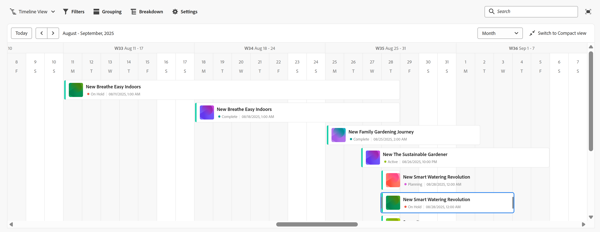
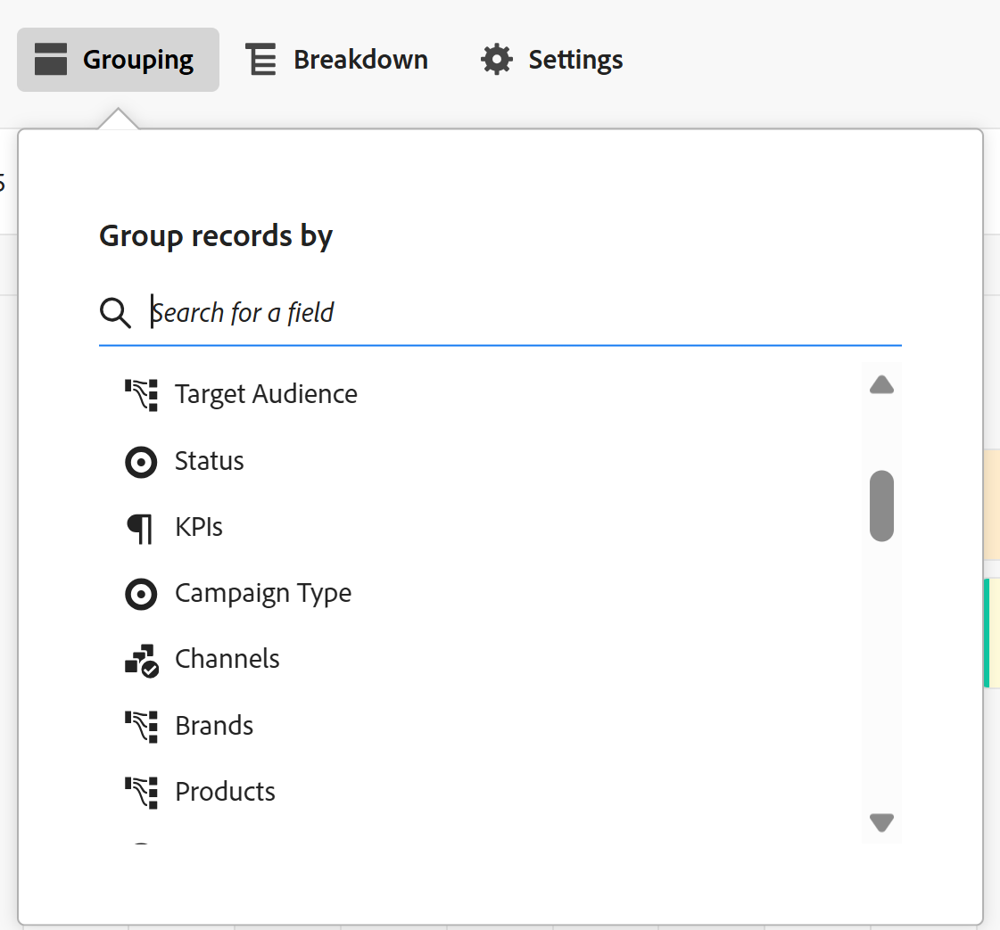
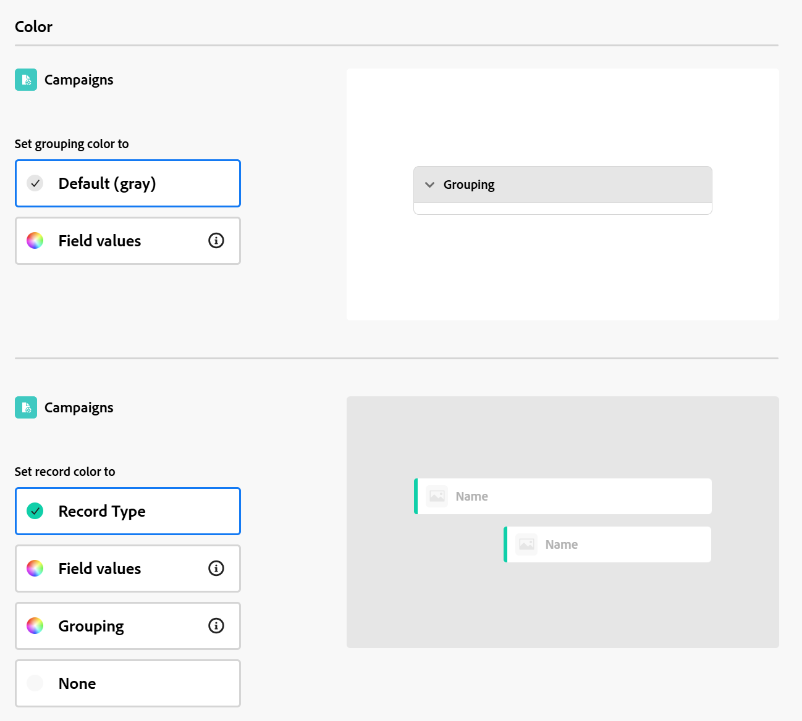

# Verwalten der Timeline-Ansicht

{{planning-important-intro}}

Sie können Datensätze in einer Timeline-Ansicht anzeigen, wenn Sie auf die Seite vom Typ Datensatz in der Adobe Workfront-Planung zugreifen.

Weitere Informationen zu Datensatzansichten finden Sie unter [Ansichten von Datensätzen verwalten](/help/quicksilver/planning/views/manage-record-views.md).

## Zugriffsanforderungen

+++ Erweitern Sie , um die Zugriffsanforderungen für die Workfront-Planung anzuzeigen.

Für den Zugriff auf die Workfront-Planung benötigen Sie Folgendes:

<table style="table-layout:auto"> 
<col> 
</col> 
<col> 
</col> 
<tbody> 
    <tr> 
<tr> 
<td> 
   
 Produkte
 </td> 
   <td> 
   <ul><li>
 Adobe Workfront
</li> 
   <li>
 Adobe Workfront-Planung
</li></ul></td> 
  </tr>   
<tr> 
   <td role="rowheader">
Adobe Workfront-Plan*
</td> 
   <td> 

Die folgenden Workfront-Pläne:
 
<ul><li>Auswählen</li> 
<li>Erstklassig</li> 
<li>Ultimativ</li></ul> 

Die Workfront-Planung ist für veraltete Workfront-Pläne nicht verfügbar
 
   </td> 
<tr> 
   <td role="rowheader">
Adobe Workfront-Planungsplan*
</td> 
   <td> 

Alle 
 

Weitere Informationen zu den Funktionen der einzelnen Workfront-Planungspläne erhalten Sie von Ihrem Workfront-Kundenbetreuer. 
 
   </td> 
 <tr> 
   <td role="rowheader">
Adobe Workfront-Plattform
</td> 
   <td> 

Die Workfront-Instanz Ihres Unternehmens muss in das Adobe Unified Experience integriert sein, damit Sie auf alle Funktionen der Workfront-Planung zugreifen können.
 

Weitere Informationen finden Sie unter <a href="/help/quicksilver/workfront-basics/navigate-workfront/workfront-navigation/adobe-unified-experience.md">Adobe Unified Experience for Workfront</a>. 
 
   </td> 
   </tr> 
  </tr> 
  <tr> 
   <td role="rowheader">
Adobe Workfront-Lizenz*
</td> 
   <td>
 Standard 

   
Für ältere Workfront-Lizenzen ist die Workfront-Planung nicht verfügbar.
 
  </td> 
  </tr> 
  <tr> 
   <td role="rowheader">
Konfiguration der Zugriffsebene
</td> 
   <td> 
Für die Adobe Workfront-Planung gibt es keine Zugriffssteuerungselemente
   
</td> 
  </tr> 
<tr> 
   <td role="rowheader">
Objektberechtigungen
</td> 
   <td>   
Berechtigungen für eine Ansicht verwalten
  
   
Berechtigungen für eine Ansicht anzeigen, um die Anzeigeeinstellungen vorübergehend zu ändern
 </td> 
  </tr> 
<tr> 
   <td role="rowheader">
Layout-Vorlage
</td> 
   <td> 
Allen Benutzern, einschließlich Workfront-Administratoren, muss eine Layoutvorlage zugewiesen werden, die den Planungsbereich im Hauptmenü enthält. 
 </td> 
  </tr> 
</tbody> 
</table>

*Weitere Informationen zu den Zugriffsanforderungen für Workfront finden Sie unter [Zugriffsanforderungen in der Workfront-Dokumentation](/help/quicksilver/administration-and-setup/add-users/access-levels-and-object-permissions/access-level-requirements-in-documentation.md).

+++

<!--OLD: 

<table style="table-layout:auto">
 <col>
 </col>
 <col>
 </col>
 <tbody>
    <tr>
<tr>
<td>
   
 Product
 </td>
   <td>
   
 Adobe Workfront
 </td>
  </tr>  
 <td role="rowheader">
Adobe Workfront agreement
</td>
   <td>

Your organization must be enrolled in the early access stage for Workfront Planning 

   </td>
  </tr>
  <tr>
   <td role="rowheader">
Adobe Workfront plan
</td>
   <td>

Any

   </td>
  </tr>
  <tr>
   <td role="rowheader">
Adobe Workfront license*
</td>
   <td>
   
New: Standard

   Or
   
Current: Plan 
 
  </td>
  </tr>
  
  <tr>
   <td role="rowheader">
Access level configurations
</td>
   <td> There are no access controls for Adobe Workfront Planning
  
</td>
  </tr>

  <tr>
   <td role="rowheader">
Permissions
</td>
   <td> 
Manage permissions to a view
  
   
View permissions to a view to temporarily change the view settings

</td>
  </tr>

<tr>
   <td role="rowheader">
Layout template
</td>
   <td> 
All users, including Workfront administrators,  must be assigned a layout template that includes the Planning area in the Main Menu. 
 
For information, see <a href="/help/quicksilver/planning/access/access-overview.md">Access overview</a>. 
 
</td>
  </tr>
 </tbody>
</table>

*For information, see [Access requirements in Workfront documentation](/help/quicksilver/administration-and-setup/add-users/access-levels-and-object-permissions/access-level-requirements-in-documentation.md).-->

## Verwalten einer Timeline-Ansicht {#manage-a-timeline-view}

<!--insert screen shot of timeline view-->

Beim Erstellen einer Timeline-Ansicht werden alle Datensätze des ausgewählten Datensatztyps in einer chronologischen Timeline angezeigt.

Beachten Sie Folgendes:

* Sie können eine Timeline-Ansicht nur erstellen, wenn mindestens zwei Datumsfelder mit einem Datensatztyp verknüpft sind. Wenn einem Datensatztyp ein oder keine Datumsfelder zugeordnet sind, ist die Option Timeline-Ansicht abgeblendet.

  Sie können beim Erstellen einer Timeline-Ansicht aus den folgenden Datumsfeldern auswählen:

   * Datensatzdaten
   * Systemgenerierte Felder aufzeichnen: Erstellungsdatum, Datum der letzten Änderung
   * Sucht Daten aus verbundenen Datensätzen oder Objekttypen.
* Je nach Datum, das mit den Datensätzen verknüpft ist, werden in den folgenden Szenarien einige Datensätze möglicherweise nicht in der Timeline-Ansicht angezeigt:

   * Wenn Start- und Enddaten keine Werte haben
   * Wenn das Start- oder das Enddatum keinen Wert haben
   * Wenn das Startdatum nach dem Enddatum liegt

So verwalten Sie eine Timeline-Ansicht:

1. Rufen Sie die Seite mit dem Datensatztyp auf, für die Sie die Timeline anzeigen möchten.
1. Erstellen Sie eine Timeline-Ansicht, wie im Artikel [Ansichten von Datensätzen verwalten](/help/quicksilver/planning/views/manage-record-views.md) beschrieben.

   

   Die Datensätze, die dem von Ihnen ausgewählten Datensatztyp zugeordnet sind, werden in einer Timeline als Balken angezeigt und sind standardmäßig in chronologischer Reihenfolge ihres Startdatums sortiert.

   >[!TIP]
   >
   >    Die Sortierung der Datensätze in der Timeline ist in der Ansicht &quot;Kompakt&quot;nicht sichtbar.

1. (Optional und bedingt) Wenn der Datensatzname abgeschnitten ist, halten Sie den Mauszeiger über eine Datensatzleiste, um den vollständigen Namen des Datensatzes und zusätzliche Informationen anzuzeigen.

1. Führen Sie einen der folgenden Schritte aus, um durch die Timeline zu navigieren:

   * Klicken Sie auf die Symbole links und rechts oder verwenden Sie den horizontalen Bildlauf, um in der Timeline rückwärts und vorwärts zu wechseln. Beim Aktualisieren der Seite wird der ausgewählte Zeitraum beibehalten.
   * Klicken Sie auf **Heute** , um die Timeline auf das aktuelle Datum zu zentrieren.
   * Wählen Sie eine der folgenden Optionen aus dem Dropdown-Menü für Zeitrahmen aus, um die Zeitabstände zu aktualisieren:

      * Jahr
      * Quartal
      * Monat
1. Klicken Sie auf die Ansicht **Zur Standardansicht wechseln** , um Datensätze in separaten Zeilen anzuzeigen <!--check to see if they updated the name of the setting here-->

   Oder

   Klicken Sie auf **Zur Kompaktansicht wechseln** , um die Datensätze anzuzeigen, deren Daten sich nicht in derselben Zeile überschneiden. <!--check to see if they updated the name of the setting here-->

   Datensätze werden standardmäßig in der Compact-Ansicht angezeigt.

1. Führen Sie die folgenden Schritte aus, um schnell nach Datensätzen zu suchen, die einem Keyword entsprechen:

   1. Klicken Sie auf das Symbol **Suchen**  und beginnen Sie mit der Eingabe eines Suchbegriffs, das mit einem Feld eines Datensatzes verknüpft ist, das auf dem Bildschirm angezeigt wird. Die Anzahl der richtigen Übereinstimmungen wird neben dem Suchelement angezeigt und der Datensatz mit der richtigen Übereinstimmung wird hervorgehoben.

      

      Sie können beliebige Wörter oder Sonderzeichen verwenden, die auf dem Bildschirm sichtbar sind.

      Sie können keine Suchbegriffe verwenden, die Feldern zugeordnet sind, die nicht in der Timeline-Ansicht angezeigt werden.

   1. Drücken Sie die Eingabetaste auf Ihrer Tastatur, um zum nächsten gefundenen Feld zu wechseln.
   1. (Optional) Wenn mehrere Übereinstimmungen vorliegen, klicken Sie auf die Pfeile nach oben und unten rechts neben dem Suchbegriff, um alle Übereinstimmungen in der Tabelle zu finden.
   1. Klicken Sie im Suchfeld auf das Symbol **x** , um den Suchbegriff zu löschen.

1. Aktualisieren Sie die folgenden Ansichtselemente wie in den folgenden Unterabschnitten beschrieben:
   * [Filter](#add-filters)
   * [Gruppierung](#add-grouping)
   * [Einstellungen](#edit-the-timeline-view-settings)
     <!--* [Sort](#add-sort) not yet in timeline; also check the anchor and make sure it's correct-->

1. (Optional) Klicken Sie auf **Aufschlüsselung** , um verbundene Datensätze in der Timeline anzuzeigen.

   Weitere Informationen finden Sie im Abschnitt [Verwenden der Aufschlüsselungsfunktion, um verbundene Datensätze in der Timeline-Ansicht anzuzeigen](#break-down-connected-records-in-the-timeline-view)

### Filter hinzufügen

Mithilfe von Filtern können Sie die Anzahl der auf dem Bildschirm angezeigten Informationen verringern.

Beachten Sie beim Arbeiten mit Filtern in der Timeline-Ansicht Folgendes:

<!-- this list is almost identical to the one for the table view - update both-->

* Die Filter, die Sie für eine Timeline-Ansicht erstellen, funktionieren unabhängig von den Filtern in jeder anderen Ansicht, die auf denselben Datensatztyp angewendet wird.

* Die Filter sind für die ausgewählte Ansicht eindeutig. Bei zwei Timeline-Ansichten desselben Datensatztyps können unterschiedliche Filter angewendet werden.

* Zwei Benutzer, die sich dieselbe Timeline-Ansicht ansehen, sehen denselben Filter, der derzeit angewendet wird.

* Sie können die von Ihnen erstellten Filter nicht für eine Timeline-Ansicht benennen.

* Wenn Sie Filter entfernen, werden diese von allen Benutzern entfernt, die auf denselben Datensatztyp zugreifen wie Sie und die dieselbe Ansicht wie Sie anzeigen.

* Das Hinzufügen von Filtern in der Timeline-Ansicht ist mit dem Hinzufügen von Filtern in der Tabellenansicht identisch.

  Weitere Informationen finden Sie im Abschnitt &quot;Filter hinzufügen&quot;im Artikel [Verwalten der Tabellenansicht](/help/quicksilver/planning/views/manage-the-table-view.md).

* Sie können nach verbundenen Datensatzfeldern oder Suchfeldern filtern.
* Sie können nach Suchfeldern filtern, die mehrere Werte anzeigen.

### Gruppierung hinzufügen

<!-- groupings are almost identical between this view and table  but they display a little differently, so I kept the steps for both; update in both places if they make changes to groupings-->

Sie können Datensätze nach ähnlichen Informationen gruppieren, wenn Sie eine Gruppierung auf eine Ansicht anwenden.

Das Hinzufügen von Gruppierungen in der Timeline-Ansicht ähnelt dem Hinzufügen von Gruppierungen zur Tabellenansicht.

Beachten Sie beim Arbeiten mit Gruppierungen in der Timeline-Ansicht Folgendes:

* Sie können Gruppierungen sowohl in der Tabellen- als auch in der Timeline-Ansicht anwenden. Die Gruppierungen der Tabellenansicht sind unabhängig von denen in der Timeline-Ansicht desselben Datensatztyps.
* Sie können in einer Ansicht drei Gruppierungsebenen anwenden. Die Datensätze werden in der von Ihnen ausgewählten Reihenfolge gruppiert.
&lt;!—* Bei Verwendung der API können Sie bis zu 4 Gruppierungsebenen verwenden. —jetzt mit diesem hier abgleichen—>
* Die Gruppierungen unterscheiden sich je nach ausgewählter Ansicht. Bei zwei Tabellenansichten desselben Datensatztyps können unterschiedliche Gruppierungen angewendet werden. Zwei Benutzer, die sich dieselbe Tabellenansicht ansehen, sehen dieselbe Gruppierung, die derzeit angewendet wird.
* Sie können die für eine Tabellenansicht erstellten Gruppierungen nicht benennen.
* Durch das Entfernen von Gruppierungen werden diese von allen Benutzern entfernt, die auf denselben Datensatztyp zugreifen wie Sie und die dieselbe Ansicht wie Sie anzeigen.
* Sie können die unter einer Gruppierung aufgelisteten Datensätze bearbeiten.
* Sie können nach verbundenen Datensatzfeldern oder Suchfeldern gruppieren.
* Wenn Sie nach Suchfeldern mit mehreren Werten gruppieren (die nicht von einem Aggregator zusammengefasst wurden), werden Datensätze nach jeder eindeutigen Kombination von Feldwerten gruppiert.
* Sie können auf ein Feld verweisen, das bis zu vier Ebenen vom aktuellen Datensatztyp entfernt ist. Wenn Sie beispielsweise eine Gruppierung für einen Aktivitäts-Record-Typ erstellen und die Aktivität mit dem Produktdatensatz-Typ verbunden ist, der mit dem Campaign-Datensatz-Typ verbunden ist, der mit einem Workfront-Projekt verbunden ist, können Sie den Projektstatus in der für den Aktivitäts-Record-Typ erstellten Gruppierung referenzieren.
<!--checking into this: * You can apply up to 4 levels of grouping when using the API. -->
<!-- checking also into this: * You cannot group by a Paragraph-type field.-->

So fügen Sie eine Gruppierung in der Timeline-Ansicht hinzu:

1. Erstellen Sie eine Timeline-Ansicht für einen Datensatztyp, wie im Artikel [Ansichten von Datensätzen verwalten](/help/quicksilver/planning/views/manage-record-views.md) beschrieben.
1. Klicken Sie oben rechts in der Timeline-Ansicht auf **Gruppierung** .

   

1. Klicken Sie auf eines der vorgeschlagenen Felder oder auf **Ein anderes Feld auswählen**, suchen Sie nach einem anderen Feld und klicken Sie dann auf dieses Feld, wenn es in der Liste angezeigt wird.

   Die Gruppierung wird automatisch auf die Timeline angewendet und Datensätze werden innerhalb des Gruppierungsfelds angezeigt.

   <!-- add a step that you can rearrange the groupings here, when this will be possible-->

1. (Optional) Wiederholen Sie die obigen Schritte, um bis zu 3 Gruppierungen hinzuzufügen.

   Die Anzahl der für die Gruppierung ausgewählten Felder wird neben dem Gruppierungssymbol angezeigt.

   <!-- update screen shot with view redesign-->

   

1. (Optional) Klicken Sie im Feld **Datensatz gruppieren nach** auf das Symbol **x** rechts neben einem Feld, das für die Gruppierung ausgewählt wurde, um die Gruppierung zu entfernen.

   Oder

   Klicken Sie auf **Alle löschen** , um alle Felder zu entfernen.

1. Klicken Sie auf außerhalb des Felds **Gruppeneinträge nach** , um sie zu schließen.
1. (Optional) Klicken Sie auf **Einstellungen** und dann auf **Farbe** , um Farbcode-Gruppierungen vorzunehmen. Weitere Informationen finden Sie im Abschnitt [Einstellungen für die Timeline-Ansicht bearbeiten](#edit-the-timeline-view-settings) in diesem Artikel.

<!-- 

### Add sort

this is not possible right now; if this is the same functionality as the table view, document it there and link from here. 

-->

### Einstellungen der Timeline-Ansicht bearbeiten {#edit-the-timeline-view-settings}

Aktualisieren Sie die Einstellungen der Timeline-Ansicht, um anzugeben, welche Informationen im Timeline-Abschnitt der Ansicht angezeigt werden.

1. Erstellen Sie eine Timeline-Ansicht für einen Datensatztyp, wie im Artikel [Ansichten von Datensätzen verwalten](/help/quicksilver/planning/views/manage-record-views.md) beschrieben.
1. Klicken Sie auf **Einstellungen**.
1. Klicken Sie im linken Bereich auf **Datum und Uhrzeit** und wählen Sie dann ein **Startdatum** und ein **Enddatum** aus, die in der Timeline angezeigt werden sollen. Sie können das standardmäßige Start- und Enddatum oder ein beliebiges Datumsfeld auswählen. Die den Datensätzen entsprechenden Balken beginnen am Datum, das Sie für das Startdatum angeben, und enden an dem Datum, das dem Enddatum entspricht.

   >[!NOTE]
   >
   >Datensätze, die keine Werte für das Start- oder Enddatum oder ein Startdatum nach dem Enddatum haben, werden nicht in der Timeline-Ansicht angezeigt.

1. Klicken Sie im linken Bereich auf **Balkenstil** , um anzugeben, welche Felder in den Datensatzbalken angezeigt werden sollen.

   Das in der Tabellenansicht des Datensatzes definierte primäre Feld (oder Titel) wird standardmäßig ausgewählt. <!--adjust this when the primary field is released??-->

1. (Optional und bedingt) Wenn Sie den Datensätzen Miniaturansichten hinzugefügt haben, wählen Sie die Option Miniatur aus, um das den Datensätzen zugeordnete Bild in der Symbolleiste anzuzeigen.

   >[!NOTE]
   >
   >    Sie müssen zuerst Miniaturansichten in der Tabellenansicht hinzufügen, bevor Sie sie in der Timeline-Ansicht anzeigen können. Weitere Informationen finden Sie unter [Hinzufügen einer Miniaturansicht zu einem Datensatz](/help/quicksilver/planning/records/add-thumbnails-to-records.md).

1. Klicken Sie auf **Feld hinzufügen** , um den Datensatzleisten bis zu 4 Felder hinzuzufügen.
1. Klicken Sie in das Feld **Suchfelder** und klicken Sie auf das Feld, das Sie hinzufügen möchten.

   >[!TIP]
   >
   >   * Sie müssen die Felder erstellen, bevor Sie sie zu den Datensatzbalken hinzufügen können.
   > 
   >   * Sie müssen mindestens ein Feld ausgewählt haben. **Name** ist standardmäßig ausgewählt.

   Eine Vorschau der Balken wird auf der rechten Seite angezeigt.

   

1. Klicken Sie im linken Bereich auf **Farbe** , um die Farben der Datensätze und Gruppierungen in der Timeline anzupassen.

   

1. (Bedingt und optional) Wenn Sie der Timeline-Ansicht eine Gruppierung hinzugefügt haben, wählen Sie aus den folgenden Optionen aus, um eine Farbe für die Gruppierung im Abschnitt **Gruppierungsfarbe festlegen** festzulegen:

   * **Standard (grau)**: Die Farbe der Gruppierungen ist auf grau eingestellt. Dies ist die Standardeinstellung.
   * **Feldwerte**: Die Farbe der Gruppierungen stimmt mit der Farbe des Felds überein, nach dem Sie die Gruppe bilden.

     >[!NOTE]
     >
     >    * Sie können die Farbe nur mit Feldern mit farbcodierten Optionen abgleichen. Beispielsweise können Sie die Farbe mit Statusfeldern oder Feldern mit Optionen, die Farben zugeordnet sind, abgleichen.
     >    
     >    * Sie können die Farbe nicht mit Suchfeldern aus verknüpften Datensätzen oder Objekttypen abgleichen.

   Beispielsweise können Felder mit Mehrfachauswahl oder Einzelauswahl farbkodierte Optionen aufweisen.

   Wenn Sie eine Gruppierung nach Feldern ohne farbkodierte Optionen durchführen, bleibt die Gruppierungsfarbe grau.

   >[!TIP]
   >
   >Wenn Sie der Timeline-Ansicht keine Gruppierungen hinzugefügt haben, wird dieser Abschnitt nicht angezeigt.

1. Wählen Sie im Abschnitt **Datensatzfarbe festlegen** aus den folgenden Optionen aus, um eine Farbe für die Datensätze festzulegen:

   * **Record type**: Die Farbe der Datensätze entspricht der Farbe des von Ihnen ausgewählten Datensatztyps. Dies ist die Standardoption.
   * **Feldwerte**: Die Farbe der Datensätze entspricht der Farbe eines von Ihnen angegebenen Felds. Fahren Sie mit Schritt 10 fort. <!--ensure this stays accurate-->
   * **Gruppierung**: Die Farbe der Datensätze entspricht der Farbe, die Sie für die Gruppierungen angegeben haben. Diese Option ist abgeblendet, wenn Sie keine Gruppierungen auf die Timeline-Ansicht angewendet haben.
   * **None**: Datensätze werden in einer weißen Leiste angezeigt.

1. (Bedingt) Wenn Sie **Feldwerte** für die Datensatzfarben ausgewählt haben, wählen Sie ein Feld aus dem Dropdownmenü **Datensatzfarbe mit** abgleichen aus.

   

   Im Dropdown-Menü werden nur Felder mit farbcodierten Optionen angezeigt.

   Beispielsweise können Felder mit Mehrfachauswahl oder Einzelauswahl farbkodierte Optionen aufweisen.

   Wenn Sie kein Feld mit farbcodierten Optionen für den ausgewählten Datensatztyp haben, ist diese Option abgeblendet.

1. Klicken Sie auf **Speichern**.

   Die Datensätze werden in der Timeline-Ansicht mit den von Ihnen ausgewählten Spezifikationen angezeigt.

### Verwenden Sie die Aufschlüsselungsfunktion, um verbundene Datensätze in der Timeline-Ansicht anzuzeigen.

Mithilfe der Aufschlüsselungsfunktion können Sie verbundene Datensätze in der Timeline-Ansicht eines Datensatzes anzeigen. Wenn Sie Datensätze nach ihren Verbindungen aufschlüsseln, können Sie die Zeitpläne anderer verbundener Datensätze anzeigen und verstehen, wie sich diese auf die Performance und die Fristen Ihrer Datensätze auswirken können.

#### Überlegungen zur Verwendung der Aufschlüsselungsfunktion

* Sie können verbundene Datensätze oder Objekte in der Timeline-Ansicht unter den Datensätzen des ausgewählten Datensatztyps anzeigen.
* Mithilfe der Aufschlüsselungsfunktion können Sie Folgendes in der Timeline-Ansicht anzeigen:
   * Workfront Planning-Datensätze, die mit dem ausgewählten Datensatztyp verbunden sind.
   * Workfront-Objekttypen oder Experience Manager-Assets, die mit dem ausgewählten Datensatztyp verbunden sind.
   * Workfront Planning speichert Datensätze oder Objekte aus anderen Anwendungen, die mit Datensätzen verbunden sind, die mit dem ausgewählten Datensatztyp verbunden sind.

     Sie können beispielsweise Kampagnen mit Portfolios verknüpfen. Darüber hinaus können Sie einen anderen Datensatztyp, Produkte, Projekte sowie Kampagnen, miteinander verbinden. Beim Erstellen der Kampagnen-Timeline-Ansicht können Sie die Kampagnen nach Portfolios, Produkten und Projekten aufschlüsseln.

* Es ist nicht möglich, Objekttypen anzuzeigen, die nur mit Workfront-Objekten in Workfront verbunden sind, aber nicht mit einem Workfront-Planungs-Datensatztyp verbunden sind. Sie können nur Objekt- oder Datensatztypen anzeigen, die mit der Workfront-Planung verbunden sind.

  Beispielsweise sind Aufgaben mit Projekten in Workfront verbunden. Mithilfe der Aufschlüsselungsfunktion können Sie Projekte anzeigen, die mit Kampagnen in der Planung verbunden sind, aber keine mit Projekten in Workfront verbundenen Aufgaben.

  Wenn Sie sowohl Portfolios als auch Projekte in der Timeline-Ansicht eines Datensatztyps für die Workfront-Planung anzeigen möchten, müssen sowohl die Portfolios als auch die Projekte mit dem Planungsdatensatz oder einem Datensatz verbunden sein, der mit dem Planungsdatensatz verbunden ist, dessen Timeline-Ansicht Sie verwalten.
* Sie können nur Datensatztypen anzeigen, die mindestens zwei Datumsfeldern zugeordnet sind.
* Die Datumsfelder für die Datensatztypen, die in der Timeline-Ansicht angezeigt werden sollen, müssen in der Tabellenansicht des ausgewählten Datensatztyps als Lookup-Felder angezeigt werden.
* Die Start- und Enddaten der Datensätze, die in der Timeline-Ansicht angezeigt werden sollen, müssen in chronologischer Reihenfolge aufgeführt werden. Wenn ein Datensatz beispielsweise das Startdatum 31. Januar und das Enddatum 1. Januar hat, wird er nicht in der Timeline-Ansicht angezeigt. Weitere Informationen finden Sie im Abschnitt [Verwalten einer Timeline-Ansicht](#manage-a-timeline-view) in diesem Artikel.
* Es gibt maximal 5 Datensatztypen, die Sie in die Aufschlüsselung eines Datensatzes aufnehmen können.

#### Aufschlüsseln von verbundenen Datensätzen in der Timeline-Ansicht

1. Erstellen Sie eine Timeline-Ansicht für einen Datensatztyp, wie im Artikel [Ansichten von Datensätzen verwalten](/help/quicksilver/planning/views/manage-record-views.md) beschrieben.
1. (Bedingt) Wenn Sie die Timeline-Ansicht im Standardmodus anzeigen, klicken Sie auf **Aufschlüsselung**.
1. Erweitern Sie das Feld **Einen verknüpften Datensatztyp auswählen** und wählen Sie einen verbundenen Datensatztyp aus. <!--add a new screen shot - submitted a bug to remove the "the"-->

   

   >[!TIP]
   >
   >    Wenn keine verbundenen Datensätze vorhanden sind oder die verbundenen Datensätze nicht mindestens zwei Datumsfelder aufweisen, ist das Feld **Verknüpften Datensatztyp auswählen** nicht verfügbar.

1. Wählen Sie ein **Startdatum** und ein **Enddatumsfeld** aus.

   >[!TIP]
   >
   >    Das Start- und das Enddatum müssen sequenziell sein. Wenn das Enddatum vor dem Startdatum liegt, werden in der Timeline keine Datensätze angezeigt.

   Auf der Symbolleiste des ausgewählten Datensatzes in der Timeline wird ein nach rechts zeigender Pfeil angezeigt, wenn sie mit anderen Datensätzen verbunden sind.
1. Klicken Sie auf den Rechtspfeil, um einen Datensatztyp und seine Verbindungen anzuzeigen.

   

1. (Optional) Wiederholen Sie die obigen Schritte, um weitere verbundene Datensätze hinzuzufügen.

