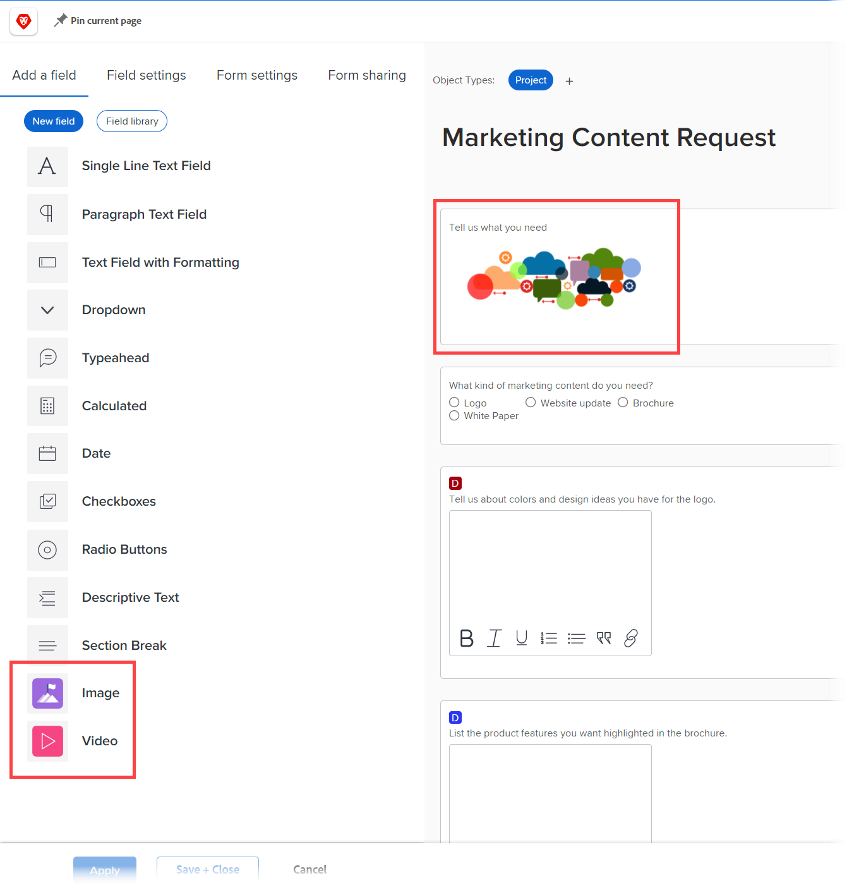
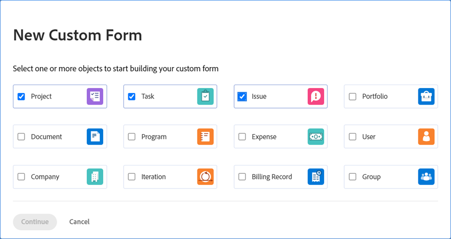
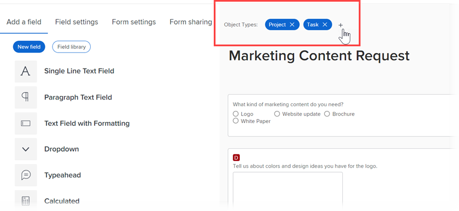
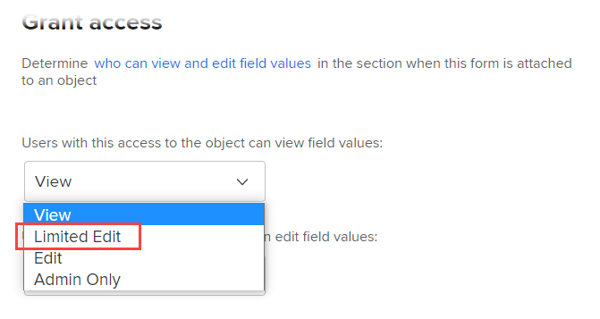

# Verbesserungen bei benutzerdefinierten Formularen

In Version 22.2 wurden die folgenden wichtigen Verbesserungen bei der Verwaltung benutzerdefinierter Formulare vorgenommen.

## Asset-Widgets hinzufügen

Sie können Bilder in benutzerdefinierte Formulare einbetten. Auf diese Weise können Sie mit Benutzern benutzerdefinierter Formulare interaktiver und visueller kommunizieren. Weitere Widget-Typen sind in Kürze verfügbar.



Wenn ein benutzerdefiniertes Formular, das ein Widget enthält, an ein Objekt angehängt wird, können Benutzende, die mit dem Objekt arbeiten, es in den folgenden Bereichen sehen:

* Der Bereich Details des Objekts (z. B. für ein Projekt der Bereich Projektdetails )&#x200B;

  

* Das Bearbeitungsfeld für das Objekt, wenn es das neue Erscheinungsbild von Adobe Workfront aufweist (z. B. die Felder Projekt bearbeiten und Aufgabe bearbeiten )&#x200B;

  

Derzeit können Benutzer das Widget nicht in den folgenden Bereichen sehen:&#x200B;

* Listen und Berichte
* Startseite und Zusammenfassung
* Das Bearbeitungsfeld für das Objekt, wenn es nicht das neue Erscheinungsbild von Adobe Workfront aufweist (z. B. das Ausgabenfeld Bearbeiten )
* &#x200B;Die Mobile App von Workfront

## Verknüpfen eines benutzerdefinierten Formulars mit mehreren Objekttypen

Sie können mit jedem neuen benutzerdefinierten Formular mehrere Objekttypen verknüpfen:



Oder ein vorhandenes benutzerdefiniertes Formular:



Auf diese Weise können Sie ein einzelnes benutzerdefiniertes Formular erstellen, das für Projekte, Aufgaben, Probleme und alle anderen Objekttypen verwendet werden kann, die für benutzerdefinierte Formulare unterstützt werden.

Dies ist besonders hilfreich, wenn Sie ein Problem oder eine Aufgabe konvertieren, da Sie ein benutzerdefiniertes Formular und dessen Daten in das konvertierte Objekt übertragen können. Sie müssen nicht mehr exakte Kopien desselben benutzerdefinierten Formulars für verschiedene Objekttypen erstellen und verwalten, sondern fügen das benutzerdefinierte Formular dem Projekt manuell hinzu.

>[!INFO]
>
>**Beispiel:**
>
>Jemand übermittelt eine interne IT-Anfrage (Problem) und liefert Details dazu, was in einem angehängten benutzerdefinierten Formular benötigt wird.
>
>Sie konvertieren das Problem in ein Projekt für die Benutzer, die es bearbeiten werden.
>
>Da das benutzerdefinierte Formular, das die Details des Absenders enthält, sowohl mit dem Problem- als auch mit dem Projektobjekttyp verknüpft ist, werden das benutzerdefinierte Formular und alle diese Details während der Konvertierung in das Projekt übernommen.

>[!NOTE]
>
>Wenn die Konvertierung stattfindet, muss das benutzerdefinierte Formular bereits mit dem Objekttyp verknüpft sein, in den Sie konvertieren.

Beachten Sie Folgendes, wenn Sie ein benutzerdefiniertes Formular mit mehreren Objekten erstellen oder bearbeiten:

* [Berechtigungsoptionen für Abschnittswechsel](#permission-options-for-section-breaks)
* [Berechnete Kompatibilität benutzerdefinierter Felder](#calculated-custom-field-compatibility)
* [Achtung: Löschen eines Objekttyps aus einem benutzerdefinierten Formular](#caution-about-deleting-an-object-type-from-a-custom-form)

### Berechtigungsoptionen für Abschnittswechsel

Die Gruppe der Berechtigungsoptionen für den Abschnittsumbruch, die für die Objekttypen „Problem“, „Aufgabe“, „Projekt“ und „Benutzer“ verfügbar sind, verfügt über eine weitere Berechtigungsoption als die Gruppe von Berechtigungsoptionen für alle anderen Objekttypen: Eingeschränkte Bearbeitung.



Die Gruppe der Abschnittsumbruchberechtigungen, die für alle anderen Objekttypen verfügbar sind (Portfolio, Dokument, Programm, Ausgabe, Unternehmen, Iteration, Rechnungsnachweis und Gruppe), umfasst keine eingeschränkte Bearbeitung:


In einem benutzerdefinierten Formular, das mit Objekttypen aus diesen beiden Gruppen verknüpft ist, verwendet das System einen gemeinsamen Satz von Abschnittsumbruchberechtigungen, die für alle Objekttypen funktionieren. Anstatt die Option zur eingeschränkten Bearbeitung zu verwenden, ersetzt dieser allgemeine Satz die Option zur Bearbeitung von Berechtigungen durch die Option zur eingeschränkten Bearbeitung. Die Option Bearbeiten ist mit allen Objekttypen kompatibel.

Wenn Sie einen Objekttyp verknüpfen, der andere Berechtigungsoptionen verwendet als die anderen Objekttypen, die bereits in einem benutzerdefinierten Formular vorhanden sind, wird eine Meldung angezeigt, die einen Wechsel zum allgemeinen Satz von Berechtigungsoptionen ermöglicht, die für das Formular verwendet werden. Diese Änderung gilt für alle Felder, auch wenn sie sich nicht unter einem Abschnittsumbruch befinden.

### Berechnete Kompatibilität benutzerdefinierter Felder

Wenn in einem benutzerdefinierten Formular mit mehreren Objekten ein berechnetes Feld auf Felder verweist, die für alle zugehörigen Objekttypen des Formulars verfügbar sind (z. B. {name}, {description} und {entryDate}, die für mehrere Objekttypen verfügbar sind), werden die Daten korrekt berechnet, unabhängig davon, an welches Objekt Sie sie anhängen.

Wenn Sie beispielsweise ein Formular mit mehreren Objekten für Projekte und Probleme haben und ein berechnetes Feld hinzufügen, das den {name}-Ausdruck enthält, zeigt das Feld den Projektnamen an, wenn Sie das Formular einem Projekt hinzufügen, und den Aufgabennamen, wenn Sie das Formular einer Aufgabe hinzufügen.

Felder, die nicht mit dem Objekt kompatibel sind, werden im Formular nicht angezeigt.

>[!INFO]
>
>**Beispiel** In einem benutzerdefinierten Formular, das mit dem Aufgabenobjekttyp verknüpft ist, erstellen Sie ein berechnetes benutzerdefiniertes Feld, das auf das integrierte Feld Zugewiesen an: Name verweist, damit der Name des primären Verantwortlichen angezeigt werden kann, wenn das Formular an eine Aufgabe angehängt wird:
>
>```
>Assigned To: Name{assignedTo}.{name}
>```
>
>Später fügen Sie dem benutzerdefinierten Formular den Projektobjekttyp hinzu. Eine Warnmeldung weist Sie darauf hin, dass der Projektobjekttyp nicht mit dem berechneten benutzerdefinierten Feld kompatibel ist. Dies liegt daran, dass das Feld Zugewiesen an nicht für Projekte verfügbar ist.

In diesem Fall haben Sie folgende Möglichkeiten:

* Entfernen Sie eines der beiden inkompatiblen Elemente aus dem benutzerdefinierten Formular - entweder den Objekttyp oder das referenzierte Feld.
* Behalten Sie beide Elemente bei und verwenden Sie die Platzhalterfiltervariable `$$OBJCODE` als Bedingung in einem IF-Ausdruck, um zwei verschiedene Versionen des Felds „In Charge“ zu erstellen. Dadurch kann das Feld erfolgreich funktionieren, unabhängig davon, an welchen Objekttyp das Formular angehängt ist.

  Im obigen Beispiel gibt es zwar kein integriertes Feld Zugewiesen an: Name für Projekte, aber es gibt ein integriertes Eigentümerfeld (das automatisch mit dem Namen der Person ausgefüllt wird, die das Projekt erstellt hat, es sei denn, diese Person ändert dies manuell). In Ihrem benutzerdefinierten Feld „Verantwortlicher“ können Sie daher `$$OBJCODE` wie unten dargestellt verwenden, um auf das Feld „Verantwortlicher“ zu verweisen, wenn das benutzerdefinierte Formular an ein Projekt angehängt wird, und auf das Feld „Zugewiesen an: Name“, wenn das Formular an eine Aufgabe angehängt wird:

  ```
  IF($$OBJCODE="PROJ",{owner}.{name},{assignedTo}.{name})
  ```

>[!NOTE]
>
>  Wenn Sie einen Objekttyp vor einem Feldnamen hinzufügen, verweist dieser auf das übergeordnete Objekt des Objekts, sodass Sie `{project}.{name}` nicht mit einem Projekt verwenden können, es jedoch mit einer Aufgabe verwenden können.


Weitere Informationen zu Variablen wie `$$OBJCODE` finden Sie unter [Übersicht über Platzhalterfiltervariablen](/help/quicksilver/reports-and-dashboards/reports/reporting-elements/understand-wildcard-filter-variables.md).

### Achtung: Löschen eines Objekttyps aus einem benutzerdefinierten Formular

Sie können einen Objekttyp in einem benutzerdefinierten Formular jederzeit löschen. Dies sollte jedoch mit Vorsicht geschehen. Wenn Benutzende das benutzerdefinierte Formular bereits an Objekte des Typs angehängt haben, den Sie löschen möchten, und ihm Daten hinzugefügt haben, werden diese Daten dauerhaft gelöscht, wenn Sie diesen Objekttyp im Formular löschen.

Außerdem gibt es kein Benachrichtigungssystem, um Personen, die das benutzerdefinierte Formular verwenden, darüber zu informieren, dass es gelöscht wurde.

Weitere Informationen finden Sie unter [Löschen eines benutzerdefinierten Felds oder Widgets aus dem System](/help/quicksilver/administration-and-setup/customize-workfront/create-manage-custom-forms/delete-a-custom-field.md).
