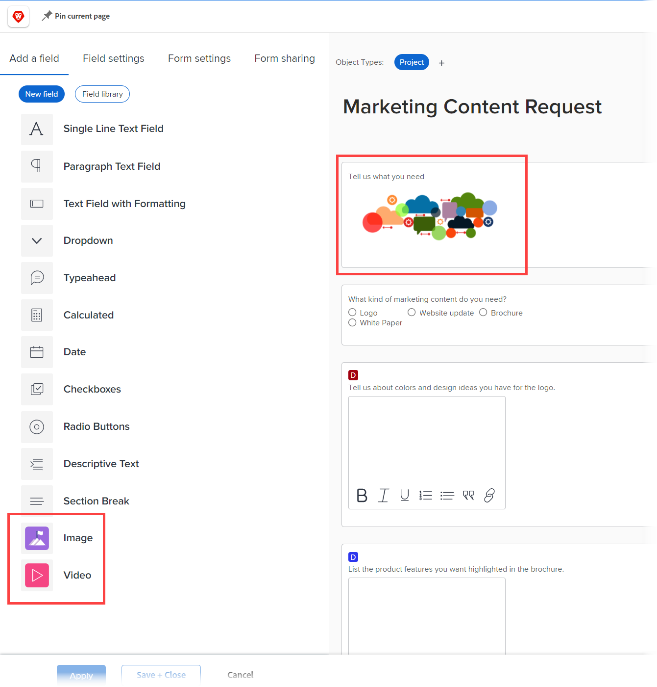

# Verbesserungen beim benutzerdefinierten Formular

Die folgenden wichtigen Verbesserungen wurden in Version 22.2 für die Verwaltung benutzerdefinierter Formulare vorgenommen.

## Hinzufügen von Asset-Widgets

Sie können Bilder in Ihre benutzerdefinierten Formulare einbetten. Dadurch können Sie interaktiver und visueller mit Benutzern von benutzerdefinierten Formularen kommunizieren. In Kürze werden weitere Widget-Typen verfügbar sein.



Wenn ein benutzerdefiniertes Formular, das ein Widget enthält, an ein Objekt angehängt wird, können Benutzer, die mit dem Objekt arbeiten, es in den folgenden Bereichen sehen:

* Der Detailbereich des Objekts (z. B. für ein Projekt, den Bereich Projektdetails ) &#x200B;

   

* Das Feld &quot;Bearbeiten&quot;für das Objekt, wenn es das neue Erscheinungsbild von Adobe Workfront aufweist (z. B. die Felder &quot;Projekt bearbeiten&quot;und &quot;Aufgabe bearbeiten&quot;) &#x200B;

   

Derzeit können Benutzer das Widget nicht in den folgenden Bereichen sehen: &#x200B;

* Listen und Berichte
* Startseite und Zusammenfassung
* Das Feld &quot;Bearbeiten&quot;für das Objekt, wenn es nicht das neue Adobe Workfront-Erlebnis anzeigt (z. B. das Feld &quot;Kosten bearbeiten&quot;)
* &#x200B; der mobilen Workfront-App

Weitere Informationen zum Hinzufügen von Widgets zu benutzerdefinierten Formularen finden Sie unter [Hinzufügen oder Bearbeiten von Bildern oder anderen Asset-Widgets in einem benutzerdefinierten Formular](/help/quicksilver/administration-and-setup/customize-workfront/create-manage-custom-forms/add-widget-or-edit-its-properties-in-a-custom-form.md).

## Verknüpfen eines benutzerdefinierten Formulars mit mehreren Objekttypen

Sie können jedem neuen benutzerdefinierten Formular mehrere Objekttypen zuweisen:


Oder ein vorhandenes benutzerdefiniertes Formular:


Auf diese Weise können Sie ein einzelnes benutzerdefiniertes Formular für Projekte, Aufgaben, Probleme und andere Objekttypen erstellen, die für benutzerdefinierte Formulare unterstützt werden.

Dies ist besonders hilfreich, wenn Sie ein Problem oder eine Aufgabe konvertieren, da Sie ein benutzerdefiniertes Formular und dessen Daten in das konvertierte Objekt übertragen können. Sie müssen für verschiedene Objekttypen nicht mehr exakte Kopien desselben benutzerdefinierten Formulars erstellen und verwalten und das benutzerdefinierte Formular manuell zum Projekt hinzufügen.

>[!INFO]
>
>**Beispiel:**
>
>Jemand sendet eine interne IT-Anfrage (Problem) und stellt Details darüber bereit, was in einem angehängten benutzerdefinierten Formular benötigt wird.
>
>Sie konvertieren das Problem für die Benutzer, die daran arbeiten werden, in ein Projekt.
>
>Da das benutzerdefinierte Formular, das die Details des Absenders enthält, sowohl mit dem Problem- als auch mit den Projektobjekttypen verknüpft ist, werden das benutzerdefinierte Formular und alle diese Details während der Konvertierung in das Projekt übernommen.

>[!NOTE]
>
>Wenn die Konvertierung stattfindet, muss das benutzerdefinierte Formular bereits mit dem Objekttyp verknüpft sein, in den Sie konvertieren.

Anweisungen zum Hinzufügen eines Asset-Widgets zu einem benutzerdefinierten Formular finden Sie unter [Hinzufügen oder Bearbeiten von Bildern oder anderen Asset-Widgets in einem benutzerdefinierten Formular](/help/quicksilver/administration-and-setup/customize-workfront/create-manage-custom-forms/add-widget-or-edit-its-properties-in-a-custom-form.md).

Beachten Sie Folgendes, wenn Sie ein benutzerdefiniertes Formular mit mehreren Objekten erstellen oder bearbeiten:

* [Berechtigungsoptionen für Abschnittsumbrüche](#permission-options-for-section-breaks)
* [Kompatibilität berechneter benutzerdefinierter Felder](#calculated-custom-field-compatibility)
* [Vorsicht beim Löschen eines Objekttyps aus einem benutzerdefinierten Formular](#caution-about-deleting-an-object-type-from-a-custom-form)

### Berechtigungsoptionen für Abschnittsumbrüche

Die für die Objekttypen &quot;Issue&quot;, &quot;Task&quot;, &quot;Project&quot;und &quot;User&quot;verfügbaren Optionen für Abschnittsumbrüche verfügen über eine weitere Berechtigungsoption als die Berechtigungsoptionen für alle anderen Objekttypen: Eingeschränkte Bearbeitung.


Die für alle anderen Objektarten (Portfolio, Dokument, Programm, Kosten, Unternehmen, Iteration, Rechnungsdatensatz und Gruppe) verfügbaren Abschnittsumbruchberechtigungen umfassen keine eingeschränkte Bearbeitung:


In einem benutzerdefinierten Formular, das mit Objekttypen aus beiden Gruppen verknüpft ist, verwendet das System einen gemeinsamen Satz von Abschnittsumbruchberechtigungen, die für alle Objektarten gelten. Anstatt insbesondere die Option Berechtigung Eingeschränkt bearbeiten zu verwenden, ersetzt dieser allgemeine Satz die Option Berechtigung bearbeiten für die Option Berechtigung Eingeschränkte Bearbeitung . Die Option &quot;Bearbeiten&quot;ist mit allen Objektarten kompatibel.

Wenn Sie einen Objekttyp verknüpfen, der andere Berechtigungsoptionen verwendet als die anderen Objekttypen, die bereits in einem benutzerdefinierten Formular vorhanden sind, wird eine Meldung angezeigt, mit der Sie zu den allgemeinen Berechtigungsoptionen für das Formular wechseln können. Diese Änderung gilt für alle Felder, auch wenn sie sich nicht in einer Abschnittspause befinden.

Weitere Informationen finden Sie unter [Hinzufügen eines Abschnittsumbruchs zu einem benutzerdefinierten Formular](/help/quicksilver/administration-and-setup/customize-workfront/create-manage-custom-forms/add-a-section-break-to-a-custom-form.md).

### Kompatibilität berechneter benutzerdefinierter Felder

Wenn in einem benutzerdefinierten Formular mit mehreren Objekten auf Felder verwiesen wird, die für alle zugehörigen Objekttypen des Formulars verfügbar sind (z. B. {name}, {description} und {entryDate}, die für mehrere Objekttypen verfügbar sind), werden die Daten korrekt berechnet, unabhängig davon, an welches Objekt Sie sie anhängen.

Wenn Sie beispielsweise ein Formular mit mehreren Objekten für Projekte und Probleme haben und ein berechnetes Feld mit dem Ausdruck {name} hinzufügen, zeigt das Feld den Projektnamen an, wenn Sie das Formular zu einem Projekt hinzufügen, und den Aufgabennamen, an dem Sie das Formular zu einer Aufgabe hinzufügen.

Wenn jedoch ein berechnetes Feld im Formular auf ein Feld verweist, das nicht mit allen Objekttypen des Formulars kompatibel ist, werden Sie durch eine Meldung darauf hingewiesen, dass Sie Anpassungen vornehmen müssen.

>[!INFO]
>
>**Beispiel:** In einem benutzerdefinierten Formular, das mit dem Task-Objekttyp verknüpft ist, erstellen Sie ein berechnetes benutzerdefiniertes Feld, das auf das integrierte Feld &quot;Zugeordnetes Feld&quot;verweist: Name, damit der Name des Hauptverantwortlichen angezeigt werden kann, wenn das Formular an eine Aufgabe angehängt wird:
>
>
```
>Assigned To: Name{assignedTo}.{name}
>```
>
>Später fügen Sie dem benutzerdefinierten Formular den Projektobjekttyp hinzu. Eine Warnmeldung weist Sie darauf hin, dass der Projektobjekttyp nicht mit dem berechneten benutzerdefinierten Feld kompatibel ist. Dies liegt daran, dass das Feld &quot;Zugeordnet an&quot;nicht für Projekte verfügbar ist.

In diesem Fall haben Sie folgende Möglichkeiten:

* Entfernen Sie eines der beiden inkompatiblen Elemente aus dem benutzerdefinierten Formular - entweder den Objekttyp oder das referenzierte Feld.
* Beides beibehalten und die Platzhalterfiltervariable verwenden `$$OBJCODE` als Bedingung in einem IF-Ausdruck verwenden, um zwei verschiedene Versionen des Felds In Charge zu erstellen. Dadurch kann das Feld unabhängig vom Objekttyp, an den das Formular angehängt ist, erfolgreich funktionieren.

   Im obigen Beispiel gibt es zwar keine integrierte Funktion &quot;Zugeordnet zu&quot;: Namensfeld für Projekte gibt es ein integriertes Feld Inhaber (das automatisch mit dem Namen der Person ausgefüllt wird, die das Projekt erstellt hat, es sei denn, jemand ändert dies manuell). In Ihrem benutzerdefinierten Feld &quot;In Charge&quot;können Sie also `$$OBJCODE` wie unten gezeigt, um auf das Feld Inhaber zu verweisen, wenn das benutzerdefinierte Formular an ein Projekt angehängt wird, und auf das Feld Zugeordneter Benutzer: Namensfeld, wenn das Formular an eine Aufgabe angehängt wird:

   ```
   IF($$OBJCODE="PROJ",{owner}.{name},{assignedTo}.{name})
   ```

>[!NOTE]
>
>  Wenn Sie einen Objekttyp vor einem Feldnamen hinzufügen, verweist er auf das übergeordnete Objekt des Objekts, sodass Sie die `{project}.{name}` mit einem Projekt, aber Sie können es mit einer Aufgabe verwenden.

Anweisungen zum Hinzufügen eines berechneten benutzerdefinierten Felds zu einem benutzerdefinierten Formular finden Sie unter [Hinzufügen errechneter Daten zu einem benutzerdefinierten Formular](/help/quicksilver/administration-and-setup/customize-workfront/create-manage-custom-forms/add-calculated-data-to-custom-form.md).

Weitere Informationen zu Variablen finden Sie unter `$$OBJCODE`, siehe [Platzhalterfiltervariablen](/help/quicksilver/reports-and-dashboards/reports/reporting-elements/understand-wildcard-filter-variables.md).

### Vorsicht beim Löschen eines Objekttyps aus einem benutzerdefinierten Formular

Sie können einen Objekttyp in einem benutzerdefinierten Formular jederzeit löschen. Dies sollte jedoch mit Vorsicht geschehen. Wenn Benutzer das benutzerdefinierte Formular bereits an Objekte des Typs angehängt haben, den Sie löschen möchten, und ihm Daten hinzugefügt haben, werden diese Daten beim Löschen dieses Objekttyps im Formular dauerhaft gelöscht.

Außerdem gibt es kein Benachrichtigungssystem, um Benutzer, die das benutzerdefinierte Formular verwenden, darauf hinzuweisen, dass es gelöscht wurde.

Weitere Informationen finden Sie unter [Löschen eines benutzerdefinierten Felds oder Widgets aus dem System](/help/quicksilver/administration-and-setup/customize-workfront/create-manage-custom-forms/delete-a-custom-field.md).
