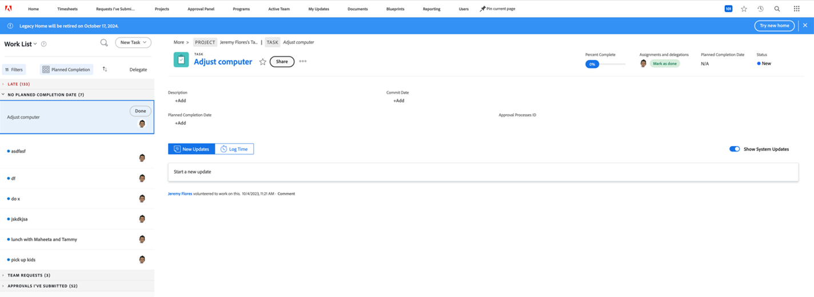

# Handbuch zur veralteten Homepage-Einstellung

Adobe Workfront-Community, wir haben Nachrichten - wir werden bald das alte Home verwerfen. Nach der alten Startseite beziehen wir uns auf die unten stehende Seite der Arbeitsliste:

Diese Seite wird in der Version 24.10 (für den 17. Oktober 2024 geplant) nicht mehr unterstützt. Zu diesem Zeitpunkt müssen Sie zum neuen Starterlebnis wechseln. Wenn Sie Ihre Arbeit mit dem alten Home verwaltet haben, machen Sie sich keine Gedanken! Neben der kontinuierlichen Verbesserung des neuen Hauses sind wir damit beschäftigt, ein optimiertes Arbeitsmanagement-Erlebnis namens &quot;Prioritäten&quot;zu entwickeln.
Trotzdem wissen wir, dass eine solche Änderung störend sein kann, und wir möchten Ihnen bei Ihrem Übergang helfen, so gut es möglich ist. Diese Seite enthält Informationen darüber, was genau sich ändern wird, Ratschläge zur Vorbereitung auf den Übergang und Antworten auf häufig gestellte Fragen.

## Veraltete Informationen

**Was wird sich ändern?**

* Die veraltete Startseite (Seite &quot;Worklist&quot;) wird eingestellt, da wir ein verbessertes Erlebnis erstellt haben.

**Wann?**

* Als Teil der Version 24.10 (geplant am 17. Oktober 2024)

**Was kann ich stattdessen verwenden?**

* Als Ersatz ist bereits eine neue Startseite verfügbar. Weitere Informationen zur Verwendung des neuen Home finden Sie unter [Erste Schritte mit dem neuen Home](/help/quicksilver/workfront-basics/using-home/new-home/get-started-with-new-home.md) . Sie kann sowohl von Benutzern über Personalisierungsoptionen als auch von Administratoren über Layoutvorlagen angepasst werden.

* Die Prioritäten sind in der Entwicklung und werden als weiteres Element der optimierten Arbeitserfahrung in Adobe Workfront dienen.

## Vorbereitung auf die Einstellung

Um Störungen für Sie und Ihre Organisation zu minimieren, unten finden Sie einige Empfehlungen, die den Übergang erleichtern.

### Starten Sie den Übergang zum neuen Home

Unsere wichtigste Empfehlung ist, so bald wie möglich mit der Umstellung auf das neue Zuhause zu beginnen. Organisatorisch bedeutet dies, dass Ihr Administrator die Erlebnisse der Benutzer mithilfe von Layoutvorlagen - ähnlich wie bei der alten Startseite - anpasst, um sicherzustellen, dass jeder Benutzer über das verfügt, was er benötigt.

Wir empfehlen Administratoren:

1. Erstellen Sie ein neues Standard-Layout für die Startseite mithilfe von Layoutvorlagen (oder erstellen Sie optional eine für jeden Benutzer, jedes Team, jede Gruppe oder jede Auftragsrolle, für die ein eindeutiges Layout erforderlich ist). Weitere Informationen finden Sie unter [Anpassen der neuen Startseite mit einer Layoutvorlage](/help/quicksilver/administration-and-setup/customize-workfront/use-layout-templates/customize-new-home-layout-template.md) .

1. Weisen Sie Ihre neuen Layoutvorlagen einer kleinen Anzahl von Testbenutzern zu, die überprüfen können, ob ihre Widgets und allgemeinen Einstellungen ihren Anforderungen entsprechen.

1. Weisen Sie den Rest Ihrer Benutzer dem neuen Layout der Startseite zu.

Dadurch erhalten Ihre Benutzer so bald wie möglich Zeit, sich an das neue Erlebnis anzupassen und ihre neuen Startseiten an ihre individuellen Bedürfnisse anzupassen.

### Befolgen Sie die Entwicklung des Starterlebnisses.

Wir empfehlen außerdem, stets über die neuesten Versionshinweise auf dem Laufenden zu bleiben (siehe [Produktversionen](/help/quicksilver/product-announcements/product-releases/product-releases.md)), um mehr über alle Änderungen zu erfahren, die am Home-Erlebnis vorgenommen wurden, wenn wir näher an die Einstellung herankommen. Lesen Sie außerdem die Prioritätenliste weiter, um unsere Vision für das künftige Arbeitsmanagement in Adobe Workfront besser zu verstehen (weitere Informationen werden in Kürze verfügbar sein).

### Hilfe anfordern

Sollten während der Umstellung Probleme auftreten, wenden Sie sich an Ihren Kundenbetreuer/Support-Team, um Hilfe zu erhalten.

## FAQs

+++ Kann ich nach der Einstellung weiterhin die alte Startseite verwenden?

Nein, es wird vollständig aus der Anwendung entfernt.
+++

+++ Ist jede Funktion des alten Hauses im neuen Zuhause (oder schließlich in den Prioritäten) verfügbar?

Beinahe mit Ausnahme von:

* Kalender, der derzeit auf unserer Roadmap für das neue Heim liegt.

* Die Anzeige von Zeitstempeln für Fälligkeitsdaten von Objekten ist derzeit nicht verfügbar.

* Die Anzeige des Commit-Datums im Update-Feed ist derzeit nicht verfügbar. Es gibt jedoch eine mögliche Problemumgehung: das Commit-Datum in der Kopfzeile durch Anpassung der Layout-Vorlage anzeigen.
+++

+++ Wie kann ich regeln, auf welche Widgets Benutzer Zugriff auf das neue Home haben?

Administratoren können über Layoutvorlagen bestimmte Standard-Widgets für Benutzer/Teams/Gruppen/Auftragsrollen festlegen, Standardstatus festlegen und festlegen, welche Optionen für die individuelle Benutzeranpassung verfügbar sind. Weitere Informationen finden Sie unter [Anpassen der neuen Startseite mit einer Layoutvorlage](/help/quicksilver/administration-and-setup/customize-workfront/use-layout-templates/customize-new-home-layout-template.md) .
+++

+++ Wie kann ich überprüfen, welche alten Home-Einstellungen aktuell sind, damit ich sie im neuen Home replizieren kann?

Anweisungen zum Auffinden Ihrer aktuellen alten Home-Einstellungen finden Sie unter [Anpassen von Startseite und Zusammenfassung mithilfe einer Layoutvorlage](/help/quicksilver/administration-and-setup/customize-workfront/use-layout-templates/customize-home-summary-layout-template.md) .
+++

++ Unterstützt das neue Home benutzerdefinierte Felder?

Benutzerdefinierte Felder können wie folgt im neuen Startseiten angezeigt werden:

* Ein Administrator verwendet Layoutvorlagen, um den Seitenübersichtsbereich anzupassen. Diese werden dann im Übersichtsfenster &quot;Mein Arbeitswidget&quot;angezeigt. Weitere Informationen finden Sie unter [Anpassen von Startseite und Zusammenfassung mithilfe einer Layoutvorlage](/help/quicksilver/administration-and-setup/customize-workfront/use-layout-templates/customize-home-summary-layout-template.md).

* Ein Administrator verwendet Layoutvorlagen, um benutzerdefinierte Feldspalten zu den Widgets My Tasks oder My Issues hinzuzufügen. Weitere Informationen finden Sie unter [Anpassen der neuen Startseite mit einer Layoutvorlage](/help/quicksilver/administration-and-setup/customize-workfront/use-layout-templates/customize-new-home-layout-template.md) .
+++

+++ Kann ich Feedback senden?

Ja! Klicken Sie dazu auf der neuen Startseite auf die In-App-Schaltfläche **Feedback geben** , auf der nächsten Prioritätsseite oder im [Workfront-Ideenforum](https://experienceleaguecommunities.adobe.com/t5/workfront-ideas/idb-p/workfront-ideas) .
+++
