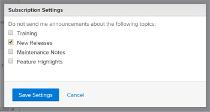

# Abo von Nachrichten im Ankündigungscenter kündigen

Nachrichten aus dem Ankündigungs-Center werden von Adobe Workfront an den Workfront-Kundenstamm gesendet. Sie können das Abonnement für die folgenden Arten von Nachrichten im Announcement Center kündigen:

* Ankündigungen zu Funktionen, die außerhalb dieser Hauptversionen nach Funktionen veröffentlicht werden.

  Die meisten neuen Funktionen, die in der Workfront-Plattform eingeführt werden, werden in Verbindung mit einer der vier Hauptversionen jedes Jahr veröffentlicht. Einige Funktionen werden jedoch außerhalb dieser Hauptversionen je Funktion veröffentlicht. Jedes Mal, wenn eine Funktion außerhalb einer Hauptversion veröffentlicht wird, erhalten Sie eine Nachricht über das Announcement Center. (Weitere Informationen zum Ankündigungscenter finden Sie unter [Ankündigungen senden](../../administration-and-setup/get-started-wf-administration/view-send-announcements.md).)

* Ankündigungen bevorstehender Schulungsangebote und Veranstaltungen.

Abmeldung vom Erhalt von Nachrichten des Ankündigungscenters:

1. Klicken Sie auf das nummerierte Symbol oben rechts in Workfront,  Ihre Benachrichtigungsliste zu öffnen.
1. Klicken **unten** der Liste auf „Alle Ankündigungen“.

   Die **Ankündigungen** wird angezeigt, auf der alle Ihre Ankündigungen aufgelistet sind.

   

1. Klicken Sie **oben rechts** der Ankündigungs-Seite auf „Einstellungen“ und wählen Sie dann **Neue Versionen** oder **Schulung** je nach dem Typ der Ankündigungen, die Sie nicht mehr erhalten möchten.

   

1. Klicken Sie **Einstellungen speichern**.

   Sie erhalten für diesen Ankündigungstyp keine Ankündigungscenter-Nachrichten mehr.
