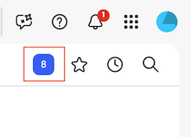
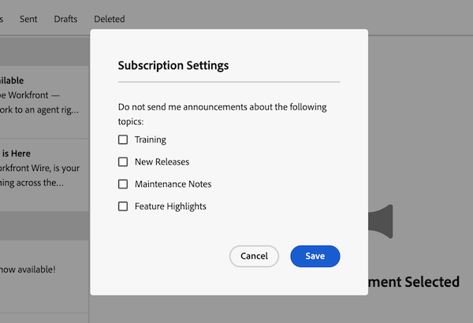

# Abo von Nachrichten im Ankündigungscenter kündigen

Nachrichten aus dem Ankündigungs-Center werden von Adobe Workfront an den Workfront-Kundenstamm gesendet. Sie können das Abonnement für die folgenden Arten von Nachrichten im Announcement Center kündigen:

* Ankündigungen zu Funktionen, die außerhalb dieser Hauptversionen nach Funktionen veröffentlicht werden.

  Die meisten neuen Funktionen, die in der Workfront-Plattform eingeführt werden, werden in Verbindung mit einer der vier Hauptversionen jedes Jahr veröffentlicht. Einige Funktionen werden jedoch außerhalb dieser Hauptversionen je Funktion veröffentlicht. Jedes Mal, wenn eine Funktion außerhalb einer Hauptversion veröffentlicht wird, erhalten Sie eine Nachricht über das Announcement Center. (Weitere Informationen zum Ankündigungscenter finden Sie unter [Ankündigungen senden](../../administration-and-setup/get-started-wf-administration/view-send-announcements.md).)

* Ankündigungen bevorstehender Schulungsangebote und Veranstaltungen.

Abmeldung vom Erhalt von Nachrichten des Ankündigungscenters:

1. Klicken Sie auf das nummerierte Symbol in der rechten oberen Ecke von Workfront, um Ihre Benachrichtigungsliste zu öffnen, und klicken **unten in der Liste** Alle Ankündigungen“.

   

1. Klicken **oben rechts** der Seite „Ankündigungen“ auf „Einstellungen“.

   

1. Deaktivieren Sie **Dialogfeld Einstellungen für Ankündigungscenter** das Kontrollkästchen für den Nachrichtentyp der Ankündigungszentrale, von dem Sie das Abonnement beenden möchten.

   

1. Klicken Sie **Einstellungen speichern**.

   Sie erhalten für diesen Ankündigungstyp keine Ankündigungscenter-Nachrichten mehr.
