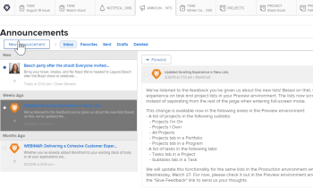

# Abmeldung von Nachrichten in Ankündigungs-Center

Nachrichten von Announcement Center sind Nachrichten, die von Adobe Workfront an die Workfront-Kundenbasis gesendet werden. Sie können sich von den folgenden Arten von Mitteilungen des Announcement-Zentrums abmelden:

* Mitteilungen zu Funktionen, die außerhalb dieser Hauptversionen für jede einzelne Funktion veröffentlicht werden.

   Die meisten neuen Funktionen, die in der Workfront-Plattform eingeführt wurden, werden jedes Jahr in Verbindung mit einer der vier Hauptversionen veröffentlicht. Einige Funktionen werden jedoch außerhalb dieser Hauptversionen nach Funktionen veröffentlicht. Jedes Mal, wenn eine Funktion außerhalb einer Hauptversion veröffentlicht wird, erhalten Sie über das Ankündigungszentrum eine Nachricht. (Weitere Informationen über das Ankündigungszentrum finden Sie unter [Mitteilungen senden](../../administration-and-setup/get-started-wf-administration/view-send-announcements.md).

* Ankündigungen zu bevorstehenden Schulungsangeboten und -veranstaltungen.

So melden Sie sich vom Empfang von Mitteilungen des Announcement Center ab:

1. Klicken Sie auf das nummerierte Symbol  in der oberen rechten Ecke von Workfront, um Ihre Benachrichtigungsliste zu öffnen.
1. Klicken **Alle Mitteilungen** am Ende der Liste.

   Die **Mitteilungen** angezeigt, auf der alle Ankündigungen aufgelistet werden.

   

1. Klicken **Einstellungen** in der oberen rechten Ecke der Seite &quot;Mitteilungen&quot;und wählen Sie **Neue Versionen** oder **Schulung**- abhängig vom Typ der Mitteilungen, die Sie nicht mehr erhalten möchten.

   

1. Klicken **Einstellungen speichern**.

   Sie erhalten für diese Art von Mitteilung keine Mitteilungen mehr vom Ankündigungszentrum.
