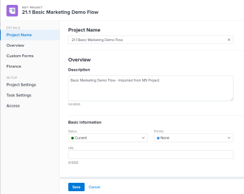

# 21.2 Projektverbesserungen

Auf dieser Seite werden alle mit Version 21.2 vorgenommenen Projektverbesserungen in der Vorschau-Umgebung beschrieben. Diese Verbesserungen werden in der Woche vom 10. Mai 2021 in der Produktionsumgebung verfügbar gemacht. Eine Liste aller mit Version 21.2 verfügbaren Änderungen finden Sie unter Übersicht über Version [21.2](../../../product-announcements/product-releases/21.2-release-activity/21-2-release-overview.md).

## Neue Benutzeroberfläche zum Erstellen und Bearbeiten wiederkehrender Aufgaben

>[!NOTE]
>
>Nur in der neuen Adobe Workfront-Version verfügbar.

Im Rahmen der Neugestaltung der Felder Neu und Aufgabe bearbeiten haben wir die Möglichkeit hinzugefügt, eine neue Aufgabe als wiederkehrende Aufgabe festzulegen und das übergeordnete Element einer wiederkehrenden Aufgabe zu bearbeiten. Diese Funktion war nicht in der Neugestaltung des Felds „Neue Aufgabe“ und „Aufgabe bearbeiten“ enthalten, die zuvor veröffentlicht wurde.

Weitere Informationen finden Sie unter [Wiederkehrende Aufgaben erstellen](../../../manage-work/tasks/create-tasks/create-recurring-tasks.md).

Diese Funktion ist jetzt in Teil 2: [ eines Projekts, Lernpfad ](https://one.workfront.com/s/learningpath3/planner-fundamentals-for-the-new-workfront-experience-part-2-plan-a-project-MCDUWIMXC3JRAAFGHX7QYIN2BVDI) Workfront One, „Grundlagen für die neue Workfront-Version“ enthalten.

## Neue Schaltflächen in der Kopfzeile Projekte verfügbar

>[!NOTE]
>
>Diese Funktion ist noch nicht in der Vorschau verfügbar. Sie wird am 29. April 2021 in der Vorschau-Umgebung veröffentlicht.

Damit Sie die Liste der Projekte auf der Seite „Projekte“ schnell filtern können, gibt es zwei neue Schaltflächen in der Kopfzeile, mit denen Sie die Filter „Projekte, an denen ich mitarbeite“ oder „Projekte, an denen ich mitarbeite“ schnell anwenden können.

Diese Funktion ist jetzt in den [Planergrundlagen für die neue Workfront-Version, Teil 1: Erstellen eines Projekts](https://one.workfront.com/s/learningpath5/planner-fundamentals-for-the-new-workfront-experience-MCTOONVRZDLRD3FAIX6SQYSUAHDE) Lernpfad in Workfront One enthalten.

## Verschieben oder Löschen einer Story oder eines Problems aus dem Scrum-Board

>[!NOTE]
>
>Nur in der neuen Adobe Workfront-Version verfügbar.

Sie können jetzt eine Story oder ein Problem aus Ihrem Scrum-Board verschieben, indem Sie auf das Mehr -Symbol auf einer Story oder Problemkarte klicken und Verschieben nach auswählen. Wenn Sie zukünftige Iterationen definiert haben, können Sie das Element in eine andere Iteration verschieben. Sie können das Element auch in den Rückstand Ihres Teams verschieben.

Sie haben auch die Möglichkeit, eine Story oder ein Problem direkt aus Ihrem Scrum-Board zu löschen, indem Sie auf das Mehr -Symbol auf einer Karte klicken und Löschen auswählen. Wenn Sie eine Story oder ein Problem löschen, wird diese für 30 Tage in den Papierkorb verschoben und kann nur vom Systemadministrator wiederhergestellt werden.

Weitere Informationen finden Sie unter [Verwalten von Storys und Problemen auf dem Scrum-Board](../../../agile/use-scrum-in-an-agile-team/scrum-board/manage-scrum-board.md).

## Neues Feld „Problem bearbeiten“

>[!NOTE]
>
>Nur in der neuen Adobe Workfront-Version verfügbar.

Im Zuge der Aktualisierung des Erscheinungsbilds des neuen Workfront-Erlebnisses haben wir das Feld „Problem bearbeiten“ neu gestaltet. Sie können das neue Feld „Problem bearbeiten“ über ein einzelnes Problem oder beim Bearbeiten eines einzelnen Problems über eine Liste aufrufen.

Zusätzlich zu einem aktualisierten Erscheinungsbild sind auch die folgenden Änderungen im Feld Problemaufgabe verfügbar:

* Sie können Ihre Layout-Vorlage einmal anpassen und diese Anpassungen sowohl auf der Detailseite als auch im Feld „Problem bearbeiten“ berücksichtigen.
* Einzelne benutzerdefinierte Formularnamen sind jetzt im linken Bereich innerhalb des Felds „Problem bearbeiten“ verfügbar und Sie können von dort aus schnell auf jedes Formular zugreifen.
* Wir haben das Feld „Geplante Stunden“ zum Abschnitt „Zuweisungen“ hinzugefügt, um die Aktualisierung der Zeit zu erleichtern, die Ressourcen zum Abschließen des Problems benötigen.
* Die Funktion zum Kommentieren von Problemen im Bildschirm „Problem bearbeiten“ wurde entfernt, um Redundanz beim Abschnitt „Aktualisierungen“ zu vermeiden.

## Die Schaltflächen Speichern und Abbrechen für die Felder Bearbeiten und Neues Objekt wurden verschoben

>[!NOTE]
>
>Nur in der neuen Adobe Workfront-Version verfügbar.

Basierend auf dem Feedback von Benutzern wurden die Schaltflächen Speichern und Abbrechen in die linke untere Ecke der Felder Objekt bearbeiten und Neues Objekt für Projekte und Aufgaben verschoben.

Vor dieser Verbesserung befanden sich diese Schaltflächen in der oberen rechten Ecke dieser Felder.

Informationen zum Bearbeiten von Projekten oder Aufgaben finden Sie in den folgenden Artikeln:

* [Bearbeiten von Projekten](../../../manage-work/projects/manage-projects/edit-projects.md)
* [Aufgaben bearbeiten](../../../manage-work/tasks/manage-tasks/edit-tasks.md)

## Verbesserungen bei benutzerdefinierten Formularen

>[!NOTE]
>
>Diese Funktion ist nur in der neuen Adobe Workfront-Version verfügbar.

Für ein besseres Benutzererlebnis beim Ausfüllen eines benutzerdefinierten Formulars haben wir die Anzeige langer benutzerdefinierter Feldbezeichnungen verbessert. Wenn ausreichend horizontaler Platz vorhanden ist, um sie vollständig anzuzeigen, werden diese Titel nicht mehr abgeschnitten.

Informationen zum Ausfüllen benutzerdefinierter Formulare finden Sie unter [Informationen in benutzerdefinierten Formularfeldern bearbeiten](../../../workfront-basics/work-with-custom-forms/edit-custom-forms.md).

## Der Primäre Kontakt einer Anfrage ist jetzt im Bereich Projektdetails sichtbar

>[!NOTE]
>
>Diese Funktion wurde am 10. März 2020 in der Produktionsumgebung veröffentlicht.

Beim Konvertieren eines Problems in ein Projekt wird der Anforderer des Problems an das Projekt übertragen und im Feld „Urheber des konvertierten Problems“ angezeigt. Dieses Feld können Sie im Bereich Projektdetails sowie in Projektberichten und -listen einsehen. Diese Informationen sind auch für Aufgaben sichtbar, nur in Berichten und Listen.

Sie müssen dieses Feld in Ihrer Layout-Vorlage aktivieren, damit Sie es in der neuen Adobe Workfront-Version für Projekte anzeigen können.

Informationen zu Konvertierungsproblemen finden Sie unter [Übersicht über die Konvertierung von Problemen in Adobe Workfront](../../../manage-work/issues/convert-issues/convert-issues.md).

## Informationen zu einer Gruppe anzeigen, die Sie einem Portfolio, Programm oder Team zuweisen möchten

>[!NOTE]
>
>Diese Funktion ist nur in der neuen Adobe Workfront-Version verfügbar.

Wenn Sie eine Gruppe einem Portfolio, Programm oder Team zuweisen, haben wir es Ihnen erleichtert, sicherzustellen, dass Sie die richtige Gruppe haben. Sie können auf das Informationssymbol neben dem Namen der Gruppe klicken, um eine QuickInfo mit der Hierarchie der darüber liegenden Gruppen sowie den Administratoren der Gruppe anzuzeigen. Je nach den für die Gruppe konfigurierten Details werden möglicherweise auch der Business Leader und die Beschreibung der Gruppe angezeigt.

Hierbei handelt es sich um dieselbe Funktion, die kürzlich veröffentlicht wurde, um Ihnen bei der Identifizierung einer Gruppe zu helfen, die Sie einem Projekt zuweisen müssen, wie unter [Projekte bearbeiten](../../../manage-work/projects/manage-projects/edit-projects.md) beschrieben.

Weitere Informationen finden Sie in den folgenden Artikeln:

* [Erstellen eines Portfolios](../../../manage-work/portfolios/create-and-manage-portfolios/create-portfolios.md)
* [Erstellen eines Programms](../../../manage-work/portfolios/create-and-manage-programs/create-program.md)
* [Erstellen eines Teams](../../../people-teams-and-groups/create-and-manage-teams/create-a-team.md)

## Textformatierung in benutzerdefinierten Feldern wird jetzt in allen Workfront Classic-Listen und -Berichten angezeigt

>[!NOTE]
>
>Diese Funktion ist nur in Adobe Workfront Classic verfügbar.

Benutzer können jetzt Textformatierungen wie fett, Aufzählungslisten und Hyperlinks in benutzerdefinierten Feldern sehen, wenn sie Listen und Berichte anzeigen.

Zuvor war die Textformatierung in Workfront Classic nur in den Listen „Projekt“, „Aufgabe“ und „Stunde“ sichtbar.

Informationen zum Formatieren von Text in einem benutzerdefinierten Feld finden Sie unter [Erstellen eines benutzerdefinierten Formulars](https://one.workfront.com/s/document-item?bundleId=workfront-classic&amp;topicId=Content%2FAdministration_and_Setup%2FCustomize_Workfront%2FCreate_manage_Custom_Forms%2Fcreate-a-custom-form.html).

Informationen zum Anzeigen von Informationen in Listen finden Sie unter [Erste Schritte mit Listen](https://one.workfront.com/s/document-item?bundleId=workfront-classic&amp;topicId=Content%2FWorkfront_basics%2FNavigate_Workfront%2FWorkfront_Navigation%2Fview-items-in-a-list.html&amp;_LANG=en).

## Neues Feld „Aufgabe bearbeiten“

>[!NOTE]
>
>Nur in der neuen Adobe Workfront-Version verfügbar.

Im Zuge der Aktualisierung des Erscheinungsbilds des neuen Workfront-Erlebnisses haben wir das Feld Aufgabe bearbeiten neu gestaltet. Sie können das neue Feld Aufgabe bearbeiten über eine einzelne Aufgabe oder beim Bearbeiten einer einzelnen Aufgabe über eine Liste aufrufen.

>[!NOTE]
>
>Im Rahmen dieser Aktualisierung wird das Feld Ressourcenumfang aus dem neuen Adobe Workfront-Erlebnis entfernt.

Neben einem aktualisierten Erscheinungsbild sind auch die folgenden Änderungen im Feld Aufgabe bearbeiten verfügbar:

* Sie können Ihre Layout-Vorlage einmal anpassen und diese Anpassungen sowohl auf der Detailseite als auch im Feld Aufgabe bearbeiten berücksichtigen.
* Einzelne benutzerdefinierte Formularnamen sind jetzt im linken Bereich innerhalb des Felds Aufgabe bearbeiten verfügbar und Sie können von dort aus schnell auf jedes Formular zugreifen.
* Wir haben die Felder Dauer, Dauertyp und Geplante Stunden zum Abschnitt Zuweisungen hinzugefügt, um Konsistenz bei der Aktualisierung von Zuweisungen über verschiedene Dauertypen hinweg und die Zeit oder Dauer, die sie für die Aufgabe aufwenden, zu gewährleisten.
* Die Funktion zum Kommentieren wurde aus dem Bildschirm „Aufgabe bearbeiten“ entfernt, um Redundanz beim Abschnitt „Aktualisierungen“ zu vermeiden.

Weitere Informationen über das neue Feld Aufgabe bearbeiten finden Sie unter [Aufgaben bearbeiten](../../../manage-work/tasks/manage-tasks/edit-tasks.md).

## Neues Aufgabenfeld

>[!NOTE]
>
>Nur in der neuen Adobe Workfront-Version verfügbar.

Im Zuge der Aktualisierung des Erscheinungsbilds des neuen Workfront-Erlebnisses haben wir das Feld Neue Aufgabe neu gestaltet. Sie können auf das Feld Neue Aufgabe zugreifen, wenn Sie eine Aufgabe zu einem Projekt hinzufügen, indem Sie oben in der Aufgabenliste auf Neue Aufgabe klicken.

>[!NOTE]
>
>Im Rahmen dieser Aktualisierung wird das Feld Ressourcenumfang aus dem neuen Adobe Workfront-Erlebnis entfernt.

Neben einem aktualisierten Erscheinungsbild sind auch die folgenden Änderungen im Workflow Neue Aufgabe verfügbar:

* Ein kleinerer Bildschirm Neue Aufgabe ist verfügbar, wenn Sie zum ersten Mal auf Neue Aufgabe in einer Projektliste mit einer begrenzten Anzahl von Feldern klicken, um Zeit zu sparen, wenn Sie Aufgaben schnell zu Projekten hinzufügen möchten. Sie können auf das vollständige neue Aufgabenformular zugreifen, das alle Aufgabenfelder enthält, die in Aufgabe erstellen umbenannt wurden.
* Sie können Ihre Layout-Vorlage einmal anpassen und diese Anpassungen sowohl auf der Detailseite als auch im Feld Neue Aufgabe berücksichtigen.
* Wir haben die Felder Dauer, Dauertyp und Geplante Stunden zum Abschnitt Zuweisungen hinzugefügt, um Konsistenz bei der Aktualisierung von Zuweisungen und der Zeit oder Dauer, die sie für die Aufgabe aufwenden, zu gewährleisten.

Weitere Informationen über das Feld Neue Aufgabe finden Sie unter [Aufgaben in einem Projekt erstellen](../../../manage-work/tasks/create-tasks/create-tasks-in-project.md).

## Nicht mehr verwendete Teams deaktivieren

>[!NOTE]
>
>Diese Funktion wird am 15. April 2021, also vor Version 21.2, in der Produktionsumgebung veröffentlicht.

Sie können jetzt nicht mehr verwendete Teams deaktivieren. Wenn Sie ein Team deaktivieren, wird es in den meisten Textvervollständigungs-, Suchfeldern oder allgemeinen Menüs in Workfront nicht mehr angezeigt. Die mit dem Team verknüpften historischen Daten werden jedoch beibehalten.

Weitere Informationen finden Sie unter [Team deaktivieren](../../../people-teams-and-groups/create-and-manage-teams/deactivate-a-team.md).

## Aktualisierung der Einstellung , mit der Benutzer Aufgaben und Probleme mit protokollierten Stunden löschen können

>[!NOTE]
>
>Nur in der neuen Adobe Workfront-Version verfügbar.

Um Ihnen ein einheitliches Erlebnis für alle Objekte zu bieten, haben wir die Funktionsweise der Einstellung „Löschen von Aufgaben und Problemen mit protokollierten Stunden durch Benutzer zulassen“ in Workfront geändert. Wenn Ihr Workfront- oder Gruppen-Administrator jetzt die Voreinstellung für Aufgaben und Probleme deaktiviert, können Sie keine Projekte mehr löschen, die Aufgaben oder Probleme mit protokollierten Stunden enthalten.

Vor dieser Änderung hinderte das Deaktivieren der Einstellung Benutzer daran, nur Aufgaben oder Probleme, nicht aber Projekte zu löschen.

Weitere Informationen finden Sie unter [Systemweite Aufgaben- und Problemeinstellungen konfigurieren](../../../administration-and-setup/set-up-workfront/configure-system-defaults/set-task-issue-preferences.md).

