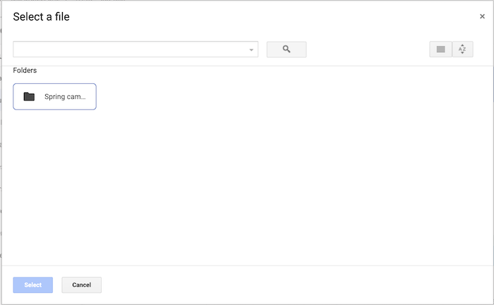

# Lookand-Feel-Updates im zweiten Quartal 2025

Auf dieser Seite werden kleinere Aktualisierungen des Erscheinungsbilds verschiedener Bereiche des Adobe Workfront-Programms beschrieben, die innerhalb des Zeitrahmens des zweiten Quartals 2025 vorgenommen wurden.

Eine Liste aller Änderungen, die mit der Version aus dem zweiten Quartal 2025 verfügbar sind, finden Sie unter [Übersicht über die Version aus dem zweiten Quartal 2025](/help/quicksilver/product-announcements/product-releases/25-q2-release-activity/25-q2-release-overview.md).

## Berichte mit neuem Stil aktualisiert

>[!NOTE]
>
>Vorschau und Produktion für alle Kunden: 9. April 2025

Das Erscheinungsbild mehrerer Berichte wurde entsprechend dem Design anderer Bereiche von Workfront aktualisiert.

Dieses Update enthält visuelle Änderungen an den Listen und Symbolleisten der folgenden Berichte. Die Funktionalität wurde nicht geändert.

* Parameter
* Parametergruppe
* Benutzerdefinierte Formulare
* Freizeit

Weitere Informationen finden Sie unter [Erstellen eines benutzerdefinierten Berichts](/help/quicksilver/reports-and-dashboards/reports/creating-and-managing-reports/create-custom-report.md).

## Aktualisierung des Erscheinungsbilds im Dialogfeld für die Dokumentintegration in Google Drive

>[!NOTE]
>
>Vorschau-Version: 26. März 2025; Produktionsversion für alle Kunden: Mit Version 25.4 (10. April 2025)

Das Erscheinungsbild bei Verwendung der Google Drive-Dokumentintegration zum Erstellen einer neuen Dokumentversion wurde aktualisiert. Durch dieses Update wird das Dialogfeld „Version“ > „Von Google-Laufwerk“ mit dem Dialogfeld „Neu hinzufügen“ > „Von Google-Laufwerk“ paritätisch aktualisiert.

Zuvor hatten Sie die Möglichkeit, zwischen Mein Laufwerk oder einem freigegebenen Laufwerk zu wählen, wenn Ihr Konto mit einem verknüpft war. Jetzt wird das Dialogfeld direkt im Bereich Mein Laufwerk Ihres Google-Laufwerks angezeigt.

+++ Erweitern, um diese Änderung anzuzeigen

<table>
 <thead>
    <tr>
        <th>Zurück</th>
        <th>Neu</th>
    </tr>
  </thead>
 <tr>
        <td></td>
         <td></td>
    </tr>
</table>

+++

## Aktualisiertes Erlebnis im Bereich „Zugriffsebenen“ im Setup

>[!NOTE]
>
>Vorschau-Version: 27. März 2025; Produktionsversion für alle Kunden: Mit Version 25.4 (10. April 2025)

Um die Leistung zu verbessern, haben wir im Bereich Zugriffsebenen von Setup einige visuelle Aktualisierungen vorgenommen.

Eine kleine Funktionsänderung wurde auf die Liste Zugriffsebenen angewendet. Um eine Zugriffsebene zu kopieren, zu bearbeiten oder zu löschen, wählen Sie die entsprechende Ebene aus und klicken Sie auf das entsprechende Symbol.

## Aktualisierungen des Erscheinungsbilds der Dialogfelder „Ausgabentypen“

>[!NOTE]
>
>Vorschau-Version: 27. März 2025; Produktionsversion für alle Kunden: Mit Version 25.4 (10. April 2025)

Das Erscheinungsbild der Dialogfelder zum Hinzufügen und Bearbeiten von Ausgabentypen im Bereich „Setup“ wurde aktualisiert, damit es dem Design anderer Bereiche von Workfront entspricht.

Weitere Informationen finden Sie [Erstellen benutzerdefinierter Ausgabentypen](/help/quicksilver/administration-and-setup/set-up-workfront/configure-system-defaults/create-custom-expense-types.md).

## Lookand-Feel-Aktualisierungen für das Feld Risikotyp bearbeiten

>[!NOTE]
>
>Vorschau-Version: 27. März 2025; Produktionsversion für alle Kunden: Mit Version 25.4 (10. April 2025)

Das Erscheinungsbild des Felds Risikotyp bearbeiten wurde aktualisiert, wenn Sie einen bestehenden Risikotyp im Bereich Setup von Workfront aktualisieren. Das neue Design passt nun zu anderen Bereichen von Workfront.

Weitere Informationen finden Sie [Risikotypen bearbeiten und erstellen](/help/quicksilver/administration-and-setup/set-up-workfront/configure-system-defaults/edit-create-risk-types.md).

## Aktualisierungen des Erscheinungsbilds für das Feld „Neuer Risikotyp“

>[!NOTE]
>
>Vorschau-Version: 27. März 2025; Produktionsversion für alle Kunden: Mit Version 25.4 (10. April 2025)

Das Erscheinungsbild des Felds Neuer Risikotyp wurde aktualisiert, wenn Sie im Bereich Setup von Workfront einen neuen Risikotyp hinzufügen. Das neue Design passt nun zu anderen Bereichen von Workfront.

Weitere Informationen finden Sie [Risikotypen bearbeiten und erstellen](/help/quicksilver/administration-and-setup/set-up-workfront/configure-system-defaults/edit-create-risk-types.md).

## Look-and-Feel-Aktualisierungen im Bereich Warteschlangendetails eines Projekts

>[!NOTE]
>
>Vorschau-Version: 27. März 2025; Produktionsversion für alle Kunden: Mit Version 25.4 (10. April 2025)

Das Erscheinungsbild des Bereichs Warteschlangendetails eines Projekts wurde entsprechend dem Design anderer Bereiche von Workfront aktualisiert.

Mit dieser Aktualisierung hat sich das Erscheinungsbild des Bereichs Warteschlangendetails einer Vorlage nicht geändert.

Weitere Informationen finden Sie unter [Erstellen einer Anfrage-Warteschlange](/help/quicksilver/manage-work/requests/create-and-manage-request-queues/create-request-queue.md).

## Avatare werden in bestimmten E-Mail-Benachrichtigungen nicht mehr angezeigt

>[!NOTE]
>
>Vorschau-Version: 13. März 2025; Produktionsversion für alle Kunden: 13. März 2025

Avatare werden in den folgenden E-Mail-Benachrichtigungen nicht mehr angezeigt:

* Alle Benachrichtigungen zu Kommunikationsereignissen
* Neue Zuweisungsbenachrichtigungen
* Alle Benachrichtigungen zum Abschluss von Vorgängeraufgaben

## Look-and-Feel-Aktualisierungen der Liste Meilensteinpfad

>[!NOTE]
>
>Vorschau-Version: 6. März 2025; Produktionsversion für alle Kunden: Mit Version 25.4 (10. April 2025)

Das Erscheinungsbild der Liste Meilensteinpfad im Bereich Setup wurde entsprechend dem Design anderer Bereiche von Workfront aktualisiert.

Weitere Informationen finden Sie unter [Meilensteinpfad erstellen](/help/quicksilver/administration-and-setup/customize-workfront/configure-approval-milestone-processes/create-milestone-path.md).

## Aktualisierte Ansicht eines Projekt-Meilensteinpfads in einer Projektansicht

>[!NOTE]
>
>Vorschau-Version: 13. März 2025; Produktionsversion für alle Kunden: Mit Version 25.4 (10. April 2025)

Beim Zugriff auf den Meilensteinpfad über eine Projektliste oder einen Bericht hat die Seite mit den Meilensteindetails jetzt ein neues Erscheinungsbild. Sie müssen das Feld Meilensteinpfadname zur Ansicht der Liste oder des Berichts hinzufügen, um auf die Detailseite des Meilensteinpfads zugreifen zu können.

Mit diesem Update haben wir auch Informationen über die Farben und Farbcodes jedes Meilensteins hinzugefügt.

Weitere Informationen finden Sie unter [Meilensteinpfad erstellen](/help/quicksilver/administration-and-setup/customize-workfront/configure-approval-milestone-processes/create-milestone-path.md).

## Temporäre Änderungen des Erscheinungsbilds von Dokument-E-Mails

>[!NOTE]
>
>Vorschau-Version: 13. Februar 2025; Produktionsversion für alle Kunden: 13. Februar 2025

E-Mails, die sich auf das Hinzufügen oder Freigeben von Dokumenten beziehen, haben im E-Mail-Textkörper kein Miniaturbild mehr.

Einige Kunden sehen auch die alte E-Mail mit der Aufgaben- und Problemzuweisung, die nur den Avatar des Verantwortlichen anzeigt.

Diese Änderungen sind temporär, da wir E-Mail-Verzögerungen untersuchen.

## Neues Erscheinungsbild für das Dialogfeld Freigeben

>[!NOTE]
>
>Vorschau-Version: 13. Februar 2025; Produktionsversion für alle Kunden: Mit Version 25.4 (10. April 2025)

Das Erscheinungsbild des Dialogfelds Freigeben wurde auf ein modernes Design aktualisiert, das mit anderen Bereichen von Workfront konsistent ist. Es gibt leichte visuelle Unterschiede, darunter:

* Die Option „Systemweit sichtbar“ zeigt jetzt „Jeder im System kann anzeigen“. Diese Option funktioniert weiterhin wie zuvor.
* Über ein neues Symbol können Sie auf erweiterte Freigabeeinstellungen zugreifen.

Weitere Informationen darüber, wo das Dialogfeld „Freigeben“ zu finden ist, finden Sie unter [Gewähren und Anfordern von Berechtigungen für Objekte](/help/quicksilver/workfront-basics/grant-and-request-access-to-objects/grant-and-request-access-to-objects.md)
