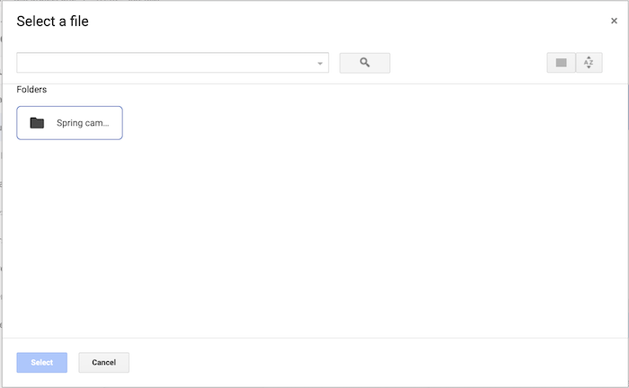

# Look-and-Feel-Updates während des Veröffentlichungszeitraums für das zweite Quartal 2025

Auf dieser Seite werden kleinere Aktualisierungen des Erscheinungsbilds verschiedener Bereiche der Adobe Workfront-Anwendung beschrieben, die innerhalb des Veröffentlichungszeitrahmens für das zweite Quartal 2025 vorgenommen wurden.

Eine Liste aller in der Version für das zweite Quartal 2025 verfügbaren Änderungen finden Sie unter [Überblick über die Version für das zweite Quartal 2025](/help/quicksilver/product-announcements/product-releases/25-q2-release-activity/25-q2-release-overview.md).

## Berichte mit neuem Stil aktualisiert

>[!NOTE]
>
>Vorschau und Produktion für alle Kunden: 9. April 2025

Das Erscheinungsbild mehrerer Berichte wurde entsprechend dem Design anderer Bereiche von Workfront aktualisiert.

Dieses Update enthält visuelle Änderungen an den Listen und Symbolleisten der folgenden Berichte. Die Funktionalität wurde nicht geändert.

* Parameter
* Parametergruppe
* Benutzerdefinierte Formulare
* Freizeit

Weitere Informationen finden Sie unter [Erstellen eines benutzerdefinierten Berichts](/help/quicksilver/reports-and-dashboards/reports/creating-and-managing-reports/create-custom-report.md).

## Aktualisierung des Erscheinungsbilds im Dialogfeld für die Dokumentintegration in Google Drive

>[!NOTE]
>
>Preview-Version: 26. März 2025; Produktionsversion für alle Kunden: Mit der Version 25.4 (10. April 2025)

Wir haben das Erscheinungsbild aktualisiert, wenn Sie die Dokumentintegration von Google Drive verwenden, um eine neue Version eines Dokuments zu erstellen. Dieses Update stellt das Dialogfeld Version > Aus Google Drive mit dem Dialogfeld Neu hinzufügen > Aus Google Drive in Einklang.

Früher hatten Sie die Möglichkeit, aus &quot;Mein Laufwerk&quot; oder &quot;Freigegebenes Laufwerk&quot; auszuwählen, wenn Ihr Konto damit verknüpft war. Jetzt wird das Dialogfeld direkt in den Bereich &quot;Mein Laufwerk&quot; Ihres Google-Laufwerks verschoben.

+++ Erweitern, um diese Änderung anzuzeigen

<table>
 <thead>
    <tr>
        <th>Zurück</th>
        <th>Neu</th>
    </tr>
  </thead>
 <tr>
        <td></td>
         <td></td>
    </tr>
</table>

+++

## Aktualisierte Erfahrung im Bereich &quot;Zugriffsebenen&quot; im Setup

>[!NOTE]
>
>Preview-Version: 27. März 2025; Produktionsversion für alle Kunden: Mit der Version 25.4 (10. April 2025)

Um die Leistung zu verbessern, haben wir im Bereich Zugriffsebenen von Setup einige visuelle Aktualisierungen vorgenommen.

Eine kleine Funktionsänderung wurde auf die Liste Zugriffsebenen angewendet. Um eine Zugriffsebene zu kopieren, zu bearbeiten oder zu löschen, wählen Sie die entsprechende Ebene aus und klicken Sie auf das entsprechende Symbol.

## Aktualisierungen des Erscheinungsbilds der Dialogfelder „Ausgabentypen“

>[!NOTE]
>
>Vorschau-Version: 27. März 2025; Produktionsversion für alle Kunden: Mit Version 25.4 (10. April 2025)

Das Erscheinungsbild der Dialogfelder zum Hinzufügen und Bearbeiten von Ausgabentypen im Bereich „Setup“ wurde aktualisiert, damit es dem Design anderer Bereiche von Workfront entspricht.

Weitere Informationen finden Sie [Erstellen benutzerdefinierter Ausgabentypen](/help/quicksilver/administration-and-setup/set-up-workfront/configure-system-defaults/create-custom-expense-types.md).

## Lookand-Feel-Aktualisierungen für das Feld Risikotyp bearbeiten

>[!NOTE]
>
>Vorschau-Version: 27. März 2025; Produktionsversion für alle Kunden: Mit Version 25.4 (10. April 2025)

Das Erscheinungsbild des Felds Risikotyp bearbeiten wurde aktualisiert, wenn Sie einen bestehenden Risikotyp im Bereich Setup von Workfront aktualisieren. Das neue Design passt nun zu anderen Bereichen von Workfront.

Weitere Informationen finden Sie [Risikotypen bearbeiten und erstellen](/help/quicksilver/administration-and-setup/set-up-workfront/configure-system-defaults/edit-create-risk-types.md).

## Look-and-Feel-Aktualisierungen für das Feld Neuer Risikotyp

>[!NOTE]
>
>Preview-Version: 27. März 2025; Produktionsversion für alle Kunden: Mit der Version 25.4 (10. April 2025)

Das Erscheinungsbild des Felds Neuer Risikotyp wurde aktualisiert, wenn Sie im Bereich Setup von Workfront einen neuen Risikotyp hinzufügen. Das neue Design passt nun zu anderen Bereichen von Workfront.

Weitere Informationen finden Sie [Risikotypen bearbeiten und erstellen](/help/quicksilver/administration-and-setup/set-up-workfront/configure-system-defaults/edit-create-risk-types.md).

## Look-and-Feel-Aktualisierungen im Bereich Warteschlangendetails eines Projekts

>[!NOTE]
>
>Vorschau-Version: 27. März 2025; Produktionsversion für alle Kunden: Mit Version 25.4 (10. April 2025)

Wir haben das Look-and-Feel des Bereichs &quot;Warteschlangendetails&quot; für ein Projekt aktualisiert, um das Design der anderen Bereiche von Workfront anzupassen.

Mit diesem Update hat sich das Erscheinungsbild des Bereichs &quot;Warteschlangendetails&quot; einer Vorlage nicht geändert.

Weitere Informationen finden Sie unter [Erstellen einer Anforderungswarteschlange](/help/quicksilver/manage-work/requests/create-and-manage-request-queues/create-request-queue.md).

## Avatare werden in bestimmten E-Mail-Benachrichtigungen nicht mehr angezeigt

>[!NOTE]
>
>Preview-Version: 13. März 2025; Produktionsversion für alle Kunden: 13. März 2025

Avatare werden in den folgenden E-Mail-Benachrichtigungen nicht mehr angezeigt:

* Alle Benachrichtigungen zu Kommunikationsereignissen
* Neue Zuweisungsbenachrichtigungen
* Alle Benachrichtigungen zum Abschluss von Vorgängeraufgaben

## Look-and-Feel-Aktualisierungen der Liste Meilensteinpfad

>[!NOTE]
>
>Vorschauversion: 6. März 2025; Produktionsversion für alle Kunden: Mit der Version 25.4 (10. April 2025)

Wir haben das Erscheinungsbild der Liste &quot;Meilensteinpfad&quot; im Bereich &quot;Einrichtung&quot; aktualisiert, um sie dem Design anderer Bereiche von Workfront anzupassen.

Weitere Informationen finden Sie unter [Meilensteinpfad erstellen](/help/quicksilver/administration-and-setup/customize-workfront/configure-approval-milestone-processes/create-milestone-path.md).

## Aktualisierte Ansicht eines Projektmeilensteinpfads in einer Projektansicht

>[!NOTE]
>
>Vorschauversion: 13. März 2025; Produktionsversion für alle Kunden: Mit der Version 25.4 (10. April 2025)

Beim Zugriff auf den Meilensteinpfad über eine Projektliste oder einen Bericht hat die Seite mit den Meilensteindetails jetzt ein neues Erscheinungsbild. Sie müssen das Feld Meilensteinpfadname zur Ansicht der Liste oder des Berichts hinzufügen, um auf die Detailseite des Meilensteinpfads zugreifen zu können.

Mit diesem Update haben wir auch Informationen über die Farben und Farbcodes jedes Meilensteins hinzugefügt.

Weitere Informationen finden Sie unter [Meilensteinpfad erstellen](/help/quicksilver/administration-and-setup/customize-workfront/configure-approval-milestone-processes/create-milestone-path.md).

## Temporäre Änderungen am Erscheinungsbild von Dokument-E-Mails

>[!NOTE]
>
>Vorschauversion: 13. Februar 2025; Produktionsversion für alle Kunden: 13. Februar 2025

In E-Mails, die sich auf das Hinzufügen oder Freigeben von Dokumenten beziehen, wird kein Miniaturbild mehr im Haupttext der E-Mail angezeigt.

Einige Kunden sehen auch die alte E-Mail mit der Aufgaben- und Problemzuweisung, die nur den Avatar des Verantwortlichen anzeigt.

Diese Änderungen sind temporär, da wir E-Mail-Verzögerungen untersuchen.

## Neues Erscheinungsbild für das Dialogfeld Freigeben

>[!NOTE]
>
>Vorschau-Version: 13. Februar 2025; Produktionsversion für alle Kunden: Mit Version 25.4 (10. April 2025)

Das Erscheinungsbild des Dialogfelds Freigeben wurde auf ein modernes Design aktualisiert, das mit anderen Bereichen von Workfront konsistent ist. Es gibt leichte visuelle Unterschiede, darunter:

* Die Option „Systemweit sichtbar“ zeigt jetzt „Jeder im System kann anzeigen“. Diese Option funktioniert weiterhin wie zuvor.
* Über ein neues Symbol können Sie auf erweiterte Freigabeeinstellungen zugreifen.

Weitere Informationen darüber, wo das Dialogfeld „Freigeben“ zu finden ist, finden Sie unter [Gewähren und Anfordern von Berechtigungen für Objekte](/help/quicksilver/workfront-basics/grant-and-request-access-to-objects/grant-and-request-access-to-objects.md)
