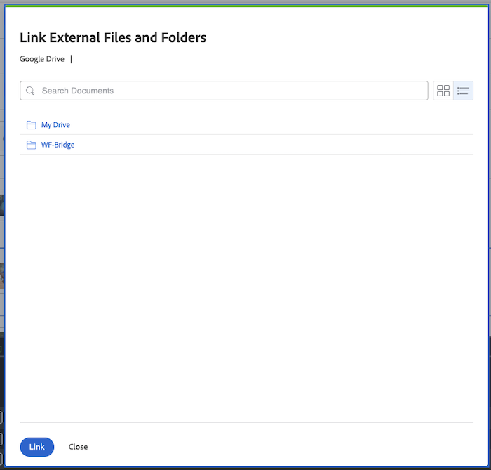

# Lookand-Feel-Updates im zweiten Quartal 2025

In diesem Seite werden kleinere Aktualisierungen der Look-and-Feel verschiedener Bereiche der Adobe Systems Workfront Applikation beschrieben, die im Release des zweiten Quartals 2025 Zeitrahmen vorgenommen wurden.

Eine Liste aller Änderungen, die mit der Version des zweiten Quartals 2025 verfügbar sind, finden Sie in [der Übersicht über](/help/quicksilver/product-announcements/product-releases/25-q2-release-activity/25-q2-release-overview.md) die Version des zweiten Quartals 2025.

## Aktualisierung des Erscheinungsbilds im Dialogfeld für die Dokumentintegration in Google Drive

>[!NOTE]
>
>Vorschau-Version: 26. März 2025; Produktionsversion für alle Kunden: Mit Version 25.4 (10. April 2025)

Das Erscheinungsbild bei Verwendung der Google Drive-Dokumentintegration zum Erstellen einer neuen Dokumentversion wurde aktualisiert. Durch dieses Update wird das Dialogfeld „Version“ > „Von Google-Laufwerk“ mit dem Dialogfeld „Neu hinzufügen“ > „Von Google-Laufwerk“ paritätisch aktualisiert.

Zuvor hatten Sie die Möglichkeit, zwischen Mein Laufwerk oder einem freigegebenen Laufwerk zu wählen, wenn Ihr Konto mit einem verknüpft war. Jetzt wird das Dialogfeld direkt im Bereich Mein Laufwerk Ihres Google-Laufwerks angezeigt.

+++ Erweitern, um diese Änderung anzuzeigen

<table>
 <thead>
    <tr>
        <th>Zurück</th>
        <th>Neu</th>
    </tr>
  </thead>
 <tr>
        <td></td>
         <td></td>
    </tr>
</table>

+++

## Aktualisiertes Erlebnis im Bereich „Zugriffsebenen“ im Setup

>[!NOTE]
>
>Vorschau Veröffentlichung: 27. März 2025; Produktionsfreigabe für alle Kunden: Mit der Version 25.4 (10. April 2025)

Um die Leistung zu verbessern, haben wir einige visuelle Aktualisierungen am Bereich &quot;Access Ebenen&quot; in Setup vorgenommen.

Eine kleine Funktionen Änderung wurde auf die Liste &quot;Access Ebenen&quot; angewendet. Um eine Zugriffsebene zu kopieren, zu bearbeiten oder zu löschen, wählen Sie die Ebene aus und klicken Sie auf das entsprechende Symbol.

## Look-and-Feel-Aktualisierungen in den Dialogfeldern &quot;Spesenarten&quot;

>[!NOTE]
>
>Vorschau-Version: 27. März 2025; Produktionsversion für alle Kunden: Mit Version 25.4 (10. April 2025)

Das Erscheinungsbild der Dialogfelder zum Hinzufügen und Bearbeiten von Ausgabentypen im Bereich „Setup“ wurde aktualisiert, damit es dem Design anderer Bereiche von Workfront entspricht.

Weitere Informationen finden Sie [Erstellen benutzerdefinierter Ausgabentypen](/help/quicksilver/administration-and-setup/set-up-workfront/configure-system-defaults/create-custom-expense-types.md).

## Lookand-Feel-Aktualisierungen für das Feld Risikotyp bearbeiten

>[!NOTE]
>
>Vorschau Veröffentlichung: 27. März 2025; Produktionsfreigabe für alle Kunden: Mit der Version 25.4 (10. April 2025)

Wir haben die Look-and-Feel des Felds Bearbeiten Risikotyp aktualisiert, wenn Sie einen vorhandenen Risikotyp im Bereich Einrichtung von Workfront aktualisieren. Die neue Design passt jetzt zu anderen Bereichen von Workfront.

Weitere Informationen finden Sie [Risikotypen bearbeiten und erstellen](/help/quicksilver/administration-and-setup/set-up-workfront/configure-system-defaults/edit-create-risk-types.md).

## Aktualisierungen des Erscheinungsbilds für das Feld „Neuer Risikotyp“

>[!NOTE]
>
>Vorschau-Version: 27. März 2025; Produktionsversion für alle Kunden: Mit Version 25.4 (10. April 2025)

Das Erscheinungsbild des Felds Neuer Risikotyp wurde aktualisiert, wenn Sie im Bereich Setup von Workfront einen neuen Risikotyp hinzufügen. Das neue Design passt nun zu anderen Bereichen von Workfront.

Weitere Informationen finden Sie [Risikotypen bearbeiten und erstellen](/help/quicksilver/administration-and-setup/set-up-workfront/configure-system-defaults/edit-create-risk-types.md).

## Look-and-Feel-Aktualisierungen im Bereich Warteschlangendetails eines Projekts

>[!NOTE]
>
>Vorschau-Version: 27. März 2025; Produktionsversion für alle Kunden: Mit Version 25.4 (10. April 2025)

Das Erscheinungsbild des Bereichs Warteschlangendetails eines Projekts wurde entsprechend dem Design anderer Bereiche von Workfront aktualisiert.

Mit dieser Aktualisierung hat sich das Erscheinungsbild des Bereichs Warteschlangendetails einer Vorlage nicht geändert.

Weitere Informationen finden Sie unter [Erstellen einer Anfrage-Warteschlange](/help/quicksilver/manage-work/requests/create-and-manage-request-queues/create-request-queue.md).

## Avatare werden nicht mehr in bestimmten E-Mail-Benachrichtigungen angezeigt

>[!NOTE]
>
>Vorschau Veröffentlichung: 13. März 2025; Produktionsfreigabe für alle Kunden: 13. März 2025

Avatare werden nicht mehr in den folgenden E-Mail-Benachrichtigungen angezeigt:

* Alle Communication Ereignis Benachrichtigungen
* Neu Zuweisungsbenachrichtigungen
* Alle Benachrichtigungen zum Abschluss von Vorgängeraufgaben

## Look-and-Feel-Aktualisierungen der Liste Meilensteinpfad

>[!NOTE]
>
>Vorschau Veröffentlichung: 6. März 2025; Produktionsfreigabe für alle Kunden: Mit der Version 25.4 (10. April 2025)

Wir haben die Look-and-Feel der Pfad Liste &quot;Meilensteine&quot; im Bereich &quot;Einstellungen&quot; aktualisiert, um sie an die Design anderer Bereiche von Workfront anzupassen.

Weitere Informationen finden Sie unter [Erstellen einer Meilenstein-Pfad](/help/quicksilver/administration-and-setup/customize-workfront/configure-approval-milestone-processes/create-milestone-path.md).

## Die Ansicht eines Projektmeilensteins Pfad in einer Projekt-Ansicht wurde aktualisiert.

>[!NOTE]
>
>Vorschau-Version: 13. März 2025; Produktionsversion für alle Kunden: Mit Version 25.4 (10. April 2025)

Beim Zugriff auf den Meilensteinpfad über eine Projektliste oder einen Bericht hat die Seite mit den Meilensteindetails jetzt ein neues Erscheinungsbild. Sie müssen das Feld Meilensteinpfadname zur Ansicht der Liste oder des Berichts hinzufügen, um auf die Detailseite des Meilensteinpfads zugreifen zu können.

Mit diesem Update haben wir auch Informationen über die Farben und Farbcodes jedes Meilensteins hinzugefügt.

Weitere Informationen finden Sie unter [Meilensteinpfad erstellen](/help/quicksilver/administration-and-setup/customize-workfront/configure-approval-milestone-processes/create-milestone-path.md).

## Temporäre Änderungen des Erscheinungsbilds von Dokument-E-Mails

>[!NOTE]
>
>Vorschau Veröffentlichung: 13. Februar 2025; Produktionsfreigabe für alle Kunden: 13. Februar 2025

E-Mails, die im Zusammenhang mit dem Hinzufügen oder Teilen von Dokumente stehen, enthalten im E-Mail-Text keine Miniaturansicht mehr.

Einige Kunden sehen auch die veraltete Aufgabe und stellen die Zuweisungs-E-Mail aus, in der nur der Avatar des Bevollmächtigten angezeigt wird.

Diese Änderungen sind vorübergehend, da wir E-Mail-Verzögerungen untersuchen.

## Neu Look-and-Feel für das Dialogfeld &quot;Freigeben&quot;

>[!NOTE]
>
>Vorschau-Version: 13. Februar 2025; Produktionsversion für alle Kunden: Mit Version 25.4 (10. April 2025)

Das Erscheinungsbild des Dialogfelds Freigeben wurde auf ein modernes Design aktualisiert, das mit anderen Bereichen von Workfront konsistent ist. Es gibt leichte visuelle Unterschiede, darunter:

* Die Option „Systemweit sichtbar“ zeigt jetzt „Jeder im System kann anzeigen“. Diese Option funktioniert weiterhin wie zuvor.
* Über ein neues Symbol können Sie auf erweiterte Freigabeeinstellungen zugreifen.

Weitere Informationen dazu, wo Sie das Dialogfeld &quot;Freigeben&quot; finden, finden Sie unter [Erteilen und Anfrage von Berechtigungen für Objekte](/help/quicksilver/workfront-basics/grant-and-request-access-to-objects/grant-and-request-access-to-objects.md)
