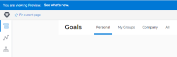

# Adobe Workfront Goals-Version 21.1: Woche vom 16. November 2020

Auf dieser Seite werden alle Verbesserungen beschrieben, die mit der Version 21.1 für Adobe Workfront-Ziele in der Vorschau-Umgebung in der Woche vom 30. November 2020 vorgenommen wurden. Diese Verbesserungen werden im ersten Quartal 21.1 in der Produktionsumgebung verfügbar gemacht.

Eine Liste aller Änderungen, die für Workfront-Ziele zu diesem Zeitpunkt im Versionszyklus 21.1 verfügbar sind, finden Sie unter [Adobe Workfront-Ziele mit Version 21.1](../../../../product-announcements/product-releases/goals-release-activity/goals-release-21-1.md).

Eine Liste aller Änderungen, die für alle Bereiche von Workfront zu diesem Zeitpunkt im Versionszyklus 21.1 verfügbar sind, finden Sie unter [Übersicht über die Version 21.1](../../../../product-announcements/product-releases/21.1-release-activity/21-1-release-overview.md).

## Workfront Goals-Lizenzanzahl im Setup-Bereich visualisieren

Als Workfront-Administrator können Sie jetzt die Anzahl der Workfront Goals-Lizenzen im Systembereich von Setup anzeigen. Sie können die folgenden Informationen anzeigen:

Gesamtanzahl der Workfront Goals-Lizenzen, die Ihr Unternehmen erworben hat

Die Anzahl der Workfront Goals-Lizenzen, die mit Benutzern verknüpft sind. Dies ist die Anzahl der Benutzer, denen in ihrer Zugriffsebene mindestens Zugriff auf Ziele anzeigen gewährt werden soll.

Informationen zur Verwaltung der Lizenzanzahl finden Sie unter [Verwalten der verfügbaren Lizenzen in Ihrem System](../../../../administration-and-setup/get-started-wf-administration/manage-available-licenses-in-your-system.md).

## Eliminieren Sie die Registerkarte &quot;Meine Teams&quot;für Benutzer ohne Teams

Um die Verwirrung bei der Anzeige eines leeren Tabs zu vermeiden, haben wir den Tab &quot;Meine Teams&quot;aus Benutzern entfernt, die keinem Team zugewiesen sind. Wenn vor dieser Änderung ein Benutzer keinem Team angehört, war die Registerkarte &quot;Meine Teams&quot;leer.

Informationen dazu, welche Informationen in den Workfront-Zielen angezeigt werden, finden Sie unter [Informationen in Adobe Workfront-Zielen filtern](../../../../workfront-goals/goal-management/filter-information-wf-goals.md).

