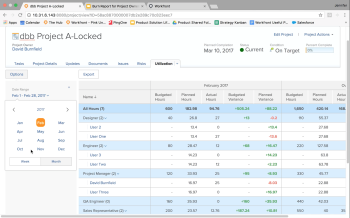

# Workfront R1-Version

## ALLE ENGAGIERTEN UND EFFIZIENTEN

Workfront gibt drei Mal im Jahr neue Produktfunktionen für alle Produktlinien frei (Version 1, Version 2 und Version 3). In der ersten Version des Jahres 2017 (R1,) ermöglichen mehrere Verbesserungen der Kernfunktionalität in Workfront, ProofHQ und Workfront DAM es Wissensarbeitern, produktiver zu sein, sich zu engagieren und weniger Zeit für die Arbeitsverwaltung und mehr für die Umsetzung der Aufgaben zu verwenden.

## WAS IST NEUES IN DER NEUESTEN VERSION?

* [WORKFRONT-VERBESSERUNGEN](#workfront-enhancements)
* [PROOFHQ-VERBESSERUNGEN](#proofhq-enhancements)
* [WORKFRONT DAM-VERBESSERUNGEN](#workfront-dam-enhancements)

## WORKFRONT-VERBESSERUNGEN {#workfront-enhancements}

\
**Verwalten der Arbeit direkt in Ihrer E-Mail**
Durch die direkte Integration in Outlook 365 können Sie doppelte Arbeit vermeiden, wenn Sie Workfront direkt über Outlook 365 aktualisieren. Konvertieren Sie E-Mails in Aufgaben, versenden Sie E-Mail-Konversationen und Anhänge als Updates und antworten Sie auf Kommentare - ohne Outlook verlassen zu müssen.

Weitere Informationen:  [In der Vorschau 2016 verfügbare Funktionen](../../../../product-announcements/product-releases/quarterly-release-archive/r1-release-activity/available-in-preview-in-2016.md)

\
**Projekte auf Kurs halten und Budget beibehalten**
Verwalten Sie Ihre Ressourcen und deren Nutzung, halten Sie die Projekte mit dem neuen Auslastungsbericht auf Kurs und sparen Sie das Budget. Sehen Sie sich geplante und tatsächliche Stunden pro Projekt und Rolle an und vergleichen Sie regelmäßig Ressourcen und Abteilungen.

Weitere Informationen:  [R1 Vorschau 3](../../../../product-announcements/product-releases/quarterly-release-archive/r1-release-activity/r1-preview-3.md)

\
**Anpassung von Terminologie und Benachrichtigungen**
Machen Sie Workfront für Ihr Team relevanter, indem Sie die benutzerdefinierte Terminologiefunktion nutzen, um Begriffe wie &quot;Portfolio&quot;oder &quot;Projekt&quot;so zu ändern, dass sie unabhängig von der Branche auf Ihr bevorzugtes Gebietsschema passen. Darüber hinaus kann jeder Benutzer nun die Benachrichtigungstypen anpassen, die er erhält, indem er die Digest-Häufigkeit regelt.

Weitere Informationen:  [R1 Vorschau 3](../../../../product-announcements/product-releases/quarterly-release-archive/r1-release-activity/r1-preview-3.md)

**Milestone-Ansicht**
Neue Statussymbole ermöglichen es Ihnen, Ihre Meilensteinberichte optimal zu nutzen. Außerdem können Sie nun den Prozentsatz &quot;vollständig&quot;direkt in der Meilensteinansicht bearbeiten.

Weitere Informationen:  [R1 Vorschau 5](../../../../product-announcements/product-releases/quarterly-release-archive/r1-release-activity/r1-preview-5.md)

**Workfront Recycle-Container**
Der neue Workfront-Papierkorb unterstützt Sie beim Wiederherstellen von Projekten, Aufgaben, Problemen sowie allen zugehörigen Dokumenten, Formularen und Aktualisierungen innerhalb von 30 Tagen nach dem Löschen.

Weitere Informationen:  [R1 Vorschau 1 und 2](../../../../product-announcements/product-releases/quarterly-release-archive/r1-release-activity/r1-peview-1-and-2.md)

### PROOFHQ-VERBESSERUNGEN {#proofhq-enhancements}

\
**Testversand-Suche und Suchen**
Die neue Suchfunktion in ProofHQ ermöglicht es Ihnen, schnell und einfach alle Instanzen eines Wortes oder einer Wortgruppe direkt in den Testsendungen zu suchen und zu finden, während Sie sie überprüfen. Dies gilt für alle textbasierten Dokumente, einschließlich PDF- und Microsoft Word-Dateien.

Weitere Informationen:  [R1 Endgültige](../../../../product-announcements/product-releases/quarterly-release-archive/r1-release-activity/r1-final.md)

\
**Visuelle Berichterstellung und erweiterte benutzerdefinierte Ansichten**
Neue Berichtsmetriken in ProofHQ ermöglichen es Ihnen, die Umlaufzeit, verspätete Prozentsätze, die Anzahl der Kommentare und die Zeit bis zur ersten Aktivität zu verfolgen. Neue benutzerdefinierte Ansichten erstellen eine erweiterte Filterlogik, sodass Sie die exakten Daten direkt bei Bedarf erhalten.

Weitere Informationen:  [R1 Endgültige](../../../../product-announcements/product-releases/quarterly-release-archive/r1-release-activity/r1-final.md)

**Vorschau von ProofHQ**
Mit ProofHQ können Sie jetzt neue Funktionen in einer Vorschau-Umgebung testen, bevor sie für alle Benutzer freigegeben werden.

## WORKFRONT DAM-VERBESSERUNGEN {#workfront-dam-enhancements}

\
**Eingebettete DAM-Links**
Für Marketing-Teams, die eine bessere Verwaltung, Veröffentlichung und Verfolgung der Nutzung digitaler Assets auf externen Plattformen benötigen, bietet die Funktion für eingebettete Links die nötige Steuerung, um den Prozess der Freigabe der richtigen Inhalte zum richtigen Zeitpunkt zu verwalten.

**DAM-erforderliche Metadatenfelder**
Verbessern Sie die Kategorisierung digitaler Assets mit den erforderlichen Metadatenfeldern, die eine bessere Steuerung der Asset-Freigabe ermöglichen.

**Halten Sie alle mit Workfront in Kontakt und arbeiten Sie effizient.**
Workfront ist eine Enterprise Work Management-Lösung, die es modernen Fachkräften und Führungskräften ermöglicht,

* Anpassen der Arbeit an individuelle und organisatorische Präferenzen und Erhöhung der Akzeptanz
* Effizientere Arbeit von überall aus
* eine bessere und aussagekräftigere Sichtbarkeit der Ressourcen, sowohl der Budgets als auch der Menschen
* Die richtige Arbeit leisten - schneller als zuvor

**WEITERE INFORMATIONEN**

* Laden Sie das R1 Datenblatt hier herunter:  [https://resources.workfront.com/data-sheets/r1-release-datasheet](https://resources.workfront.com/data-sheets/r1-release-datasheet)
* Laden Sie die FAQ zur R1-Version hier herunter: [https://resources.workfront.com/data-sheets/r1-faq-for-customers](https://resources.workfront.com/data-sheets/r1-faq-for-customers)
* Für eine vollständige Liste der in R1 verfügbaren Verbesserungen: [Übersicht über die Release-Aktivität R1](../../../../product-announcements/product-releases/quarterly-release-archive/r1-release-activity/r1-release-activity-overview.md)

Workfront. Weil Arbeit wichtig ist.
