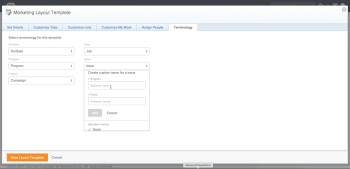

# Die Workfront R1-Version

## INTERAKTION UND EFFIZIENZ FÜR ALLE

Workfront veröffentlicht dreimal jährlich neue Produktfunktionen für alle Produktlinien (Version 1, Version 2 und Version 3). In der ersten Version des Jahres 2017 (R1) ermöglichen mehrere Verbesserungen der Kernfunktionen in Workfront, ProofHQ und Workfront DAM es Wissensarbeitern, produktiver zu sein, engagierter zu sein und weniger Zeit mit der Verwaltung von Aufgaben zu verbringen und mehr Dinge zu erledigen.

## NEUE FUNKTIONEN IN DER NEUESTEN VERSION?

* [WORKFRONT-VERBESSERUNGEN](#workfront-enhancements)
* [PROOFHQ - VERBESSERUNGEN](#proofhq-enhancements)
* [WORKFRONT-DAM-VERBESSERUNGEN](#workfront-dam-enhancements)

## WORKFRONT-VERBESSERUNGEN {#workfront-enhancements}

\
**Arbeit direkt aus Ihrer E-Mail verwalten**
Durch die direkte Integration in Outlook 365 können Sie doppelte Arbeit vermeiden, wenn Sie Workfront direkt von Outlook 365 aktualisieren. Konvertieren Sie E-Mails in Aufgaben, senden Sie E-Mail-Unterhaltungen und Anhänge als Aktualisierungen und antworten Sie auf Kommentare - ohne Outlook verlassen zu müssen.

Weitere Informationen finden Sie unter [Funktion wurde in der Vorschau 2016 verfügbar gemacht](../../../../product-announcements/product-releases/quarterly-release-archive/r1-release-activity/available-in-preview-in-2016.md)

\
**Projekte planmäßig und im Budget halten**
Verwalten Sie Ihre Ressourcen und deren Nutzung, sodass Projekte mit dem neuen Auslastungsbericht im Zeitplan und im Budget bleiben. Geplante und tatsächliche Stunden pro Projekt und Rolle anzeigen und Ressourcen und Abteilungen regelmäßig vergleichen.

Weitere Informationen finden Sie unter [R1 Vorschau 3](../../../../product-announcements/product-releases/quarterly-release-archive/r1-release-activity/r1-preview-3.md)

\
**Anpassung von Terminologie und Benachrichtigungen**
Machen Sie Workfront für Ihr Team relevanter, indem Sie die benutzerdefinierte Terminologiefunktion nutzen, um Begriffe wie &quot;Portfolio&quot; oder „Projekt“ unabhängig von der Branche an Ihr bevorzugtes Lingo anzupassen. Darüber hinaus kann jeder Benutzer jetzt die Arten von Benachrichtigungen, die er erhält, anpassen, indem er ihre Digest-Häufigkeit reguliert.

Weitere Informationen finden Sie unter [R1 Vorschau 3](../../../../product-announcements/product-releases/quarterly-release-archive/r1-release-activity/r1-preview-3.md)

**Meilensteinansicht**
Mit den neuen Fortschrittsstatus-Symbolen können Sie Ihre Meilenstein-Berichte besser nutzen. Außerdem können Sie jetzt „Prozent abgeschlossen“ direkt über die Ansicht „Meilenstein“ bearbeiten.

Weitere Informationen finden Sie unter: [R1 Preview 5](../../../../product-announcements/product-releases/quarterly-release-archive/r1-release-activity/r1-preview-5.md)

**Workfront-Papierkorb**
Mit dem neuen Workfront-Papierkorb können Sie Projekte, Aufgaben, Probleme und alle zugehörigen Dokumente, Formulare und Aktualisierungen innerhalb von 30 Tagen nach dem Löschen wiederherstellen.

Weitere Informationen finden Sie unter [R1 - Vorschau 1 und 2](../../../../product-announcements/product-releases/quarterly-release-archive/r1-release-activity/r1-peview-1-and-2.md)

### PROOFHQ VERBESSERUNGEN {#proofhq-enhancements}

\
**Testversand suchen und suchen**
Neue Suchfunktionen in ProofHQ ermöglichen es Ihnen, alle Instanzen eines Worts oder einer Phrase schnell und einfach direkt in den Testsendungen zu suchen und zu finden, wenn Sie sie überprüfen. Dies gilt für alle textbasierten Dokumente, einschließlich PDFs und Microsoft Word-Dateien.

Weitere Informationen finden Sie unter: [R1 Final](../../../../product-announcements/product-releases/quarterly-release-archive/r1-release-activity/r1-final.md)

\
**Visuelles Reporting und erweiterte benutzerdefinierte Ansichten**
Mit den neuen Berichtsmetriken in ProofHQ können Sie die Durchlaufzeit, die späten Prozentsätze, die Anzahl der Kommentare und die Zeit bis zur ersten Aktivität verfolgen. Neue benutzerdefinierte Ansichten erstellen eine erweiterte Filterlogik, damit Sie die exakten Daten genau dann erhalten, wenn Sie sie benötigen.

Weitere Informationen finden Sie unter: [R1 Final](../../../../product-announcements/product-releases/quarterly-release-archive/r1-release-activity/r1-final.md)

**ProofHQ Preview**
Mit ProofHQ können Sie jetzt neue Funktionen in einer Vorschau-Umgebung testen, bevor sie für alle Benutzer freigegeben werden.

## WORKFRONT-DAM-VERBESSERUNGEN {#workfront-dam-enhancements}

\
**DAM-eingebettete Links**
Marketing-Teams, die eine bessere Möglichkeit benötigen, die Verwendung digitaler Assets auf externen Plattformen zu verwalten, zu veröffentlichen und zu verfolgen, können mit der Funktion für eingebettete Links die Kontrolle erhalten, die Sie für die Verwaltung des Prozesses der Freigabe der richtigen Inhalte zur richtigen Zeit benötigen.

**DAM - Erforderliche Metadatenfelder**
Die Kategorisierung digitaler Assets mit erforderlichen Metadatenfeldern verbessern, was eine bessere Kontrolle der Asset-Freigabe ermöglicht.

**Alle mit Workfront interagieren und effizient arbeiten können.**
Workfront ist eine Enterprise Work-Management-Lösung, mit der moderne Wissensarbeiter und Führungskräfte:

* Maßgeschneiderte Arbeit entsprechend den individuellen und organisatorischen Vorlieben und steigern die Akzeptanz
* Effizienter von überall aus arbeiten
* Bessere und aussagekräftigere Sichtbarkeit der Ressourcen, sowohl der Haushalte als auch der Menschen
* Die richtige Arbeit schneller als zuvor leisten

**ERFAHREN SIE MEHR**

* Eine vollständige Liste der in R1 verfügbaren Verbesserungen finden Sie unter [R1-Versionsaktivität - Übersicht](../../../../product-announcements/product-releases/quarterly-release-archive/r1-release-activity/r1-release-activity-overview.md)

Workfront. Denn Arbeit ist wichtig.
