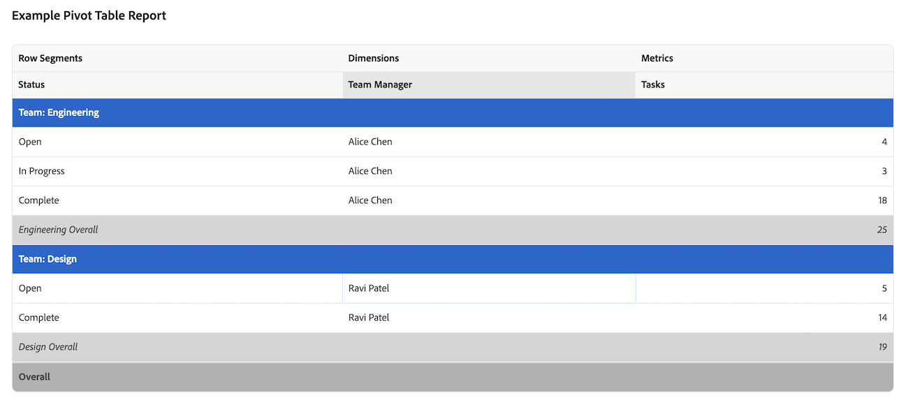

# Erstellen eines Pivot-Tabellenberichts in einem Arbeitsflächen-Dashboard

>[!IMPORTANT]
>
>Die Funktion Canvas-Dashboards ist derzeit nur für Benutzer verfügbar, die an der Beta-Phase teilnehmen. Teile der Funktion sind in dieser Phase möglicherweise nicht vollständig oder funktionieren nicht wie vorgesehen. Bitte senden Sie Feedback zu Ihrem Erlebnis, indem Sie die Anweisungen im Abschnitt [Feedback geben](/help/quicksilver/product-announcements/betas/canvas-dashboards-beta/canvas-dashboards-beta-information.md#provide-feedback) im Artikel Beta-Übersicht für Arbeitsflächen-Dashboards befolgen. 
>Wenn Sie Feedback zu einem möglichen Fehler oder einem technischen Problem haben, senden Sie bitte ein Ticket an den Workfront-Support. Weitere Informationen finden Sie unter [Kontaktieren des Kunden-Supports](/help/quicksilver/workfront-basics/tips-tricks-and-troubleshooting/contact-customer-support.md). 
>Beachten Sie, dass diese Beta-Version bei den folgenden Cloud-Anbietern nicht verfügbar ist:
>
>* Eigene Schlüssel für Amazon Web Services mitbringen
>* Azure
>* Google Cloud Platform

Sie können einen Pivot-Tabellenbericht zu einem Arbeitsflächen-Dashboard hinzufügen, um aggregierte Summen für Ihre Daten - wie Summen, Zahlen und Durchschnittswerte - in einem Tabellenformat anzuzeigen. Pivot-Tabellen sind nützlich, wenn mehrere aggregierte Werte oder Zahlen mit mehreren Dimensionen verglichen werden.

## Zugriffsanforderungen

+++ Erweitern, um die Zugriffsanforderungen für die in diesem Artikel beschriebene Funktionalität anzuzeigen.

<table style="table-layout:auto"> 
<col> 
</col> 
<col> 
</col> 
<tbody> 
<tr> 
   <td role="rowheader">
Adobe Workfront-Paket
</td> 
   <td> 

Beliebig 
 
   </td> 
<tr> 
 <tr> 
   <td role="rowheader">
Adobe Workfront-Lizenz
</td> 
   <td> 

Standard
 

Abo
 
   </td> 
   </tr> 
  </tr> 
  <tr> 
   <td role="rowheader">
Konfigurationen der Zugriffsebene
</td> 
   <td>
Zugriff auf Berichte, Dashboards und Kalender bearbeiten

  </td> 
  </tr>  
</tbody> 
</table>

Weitere Details zu den Informationen in dieser Tabelle finden Sie unter [Zugriffsanforderungen in der Dokumentation zu Workfront](/help/quicksilver/administration-and-setup/add-users/access-levels-and-object-permissions/access-level-requirements-in-documentation.md).
+++

## Voraussetzungen

Sie müssen ein Dashboard erstellen, bevor Sie einen Pivot-Tabellenbericht erstellen können. Weitere Informationen finden Sie unter [Erstellen eines Arbeitsflächen-Dashboards](/help/quicksilver/reports-and-dashboards/canvas-dashboards/create-dashboards/create-dashboards.md).

## Erstellen eines Pivot-Tabellenberichts in einem Arbeitsflächen-Dashboard

Es stehen viele Konfigurationsoptionen zum Erstellen eines Pivot-Tabellenberichts zur Verfügung. In diesem Abschnitt führen wir Sie durch den allgemeinen Prozess der Erstellung eines solchen.

{{step1-to-dashboards}}

1. Klicken Sie im linken Bedienfeld auf **Arbeitsflächen-Dashboards** und klicken Sie dann auf den Namen des Dashboards, dem Sie den Bericht hinzufügen möchten.

1. Klicken **oben rechts** der Seite auf „Bericht hinzufügen“.

1. Wählen Sie im **Bericht hinzufügen** die Option **Bericht erstellen** aus.

1. Wählen Sie auf der linken Seite **Pivot-Tabelle** aus.

1. Klicken Sie oben rechts auf **Bericht erstellen**.

1. (Optional) Gehen Sie wie folgt vor, um den Abschnitt **Details** zu konfigurieren:

   1. Wählen Sie die **Stammentität** für den Bericht.

      >[!NOTE]
      >
      > Die Stammentität legt fest, von welchem Objekt Ihre Felder stammen. Nach der Auswahl beginnt jeder Feldselektor, den Sie später in diesem Bericht verwenden, mit diesem Objekt, sodass Sie direkt zu dem gewünschten Feld gehen können.

   1. Einen Bericht eingeben **Name**.

   1. Einen Bericht eingeben **Beschreibung**.

   1. (Optional) Geben Sie **Feld „Diesen Bericht mit Zugriffsrechten ausführen von** den Namen des Benutzers ein, dessen Berechtigungen Sie für den Bericht verwenden möchten, und wählen Sie dann den Benutzer aus, wenn er in der Liste angezeigt wird. Wenn Sie einen Bericht so konfigurieren, dass er als ein anderer Benutzer ausgeführt wird, sehen alle Betrachter des Dashboards dieselben Daten, unabhängig von ihrer eigenen Zugriffsebene. Wenn Sie keinen Benutzer auswählen, sieht jeder Viewer Daten, die auf seinen eigenen Berechtigungen basieren.

      >[!IMPORTANT]
      >
      >Wenn der ausgewählte Benutzer deaktiviert ist oder den Zugriff auf die relevanten Arbeitsbereiche oder Datensatztypen verliert, kann der Bericht unvollständige Daten anzeigen oder nicht gerendert werden.

1. Gehen Sie wie folgt vor, um den Abschnitt **Metriken** zu konfigurieren:

   1. Klicken Sie im linken Bedienfeld auf das Symbol **Metriken anzeigen**  .

   1. Klicken Sie **Metrik hinzufügen** und wählen Sie dann das gewünschte Feld aus. Das Feld wird als Spalte im Vorschauabschnitt auf der rechten Seite angezeigt.

      >[!NOTE]
      >
      > Eine Metrik (auch Kennzahl genannt) ist ein Zahlenfeld, das Sie addieren oder summieren möchten. Sie können beispielsweise alle Kosten addieren oder zählen, wie viele Aufgaben es gibt.

   1. Geben Sie einen **Spaltentitel“**.

   1. Wählen Sie in **Dropdown-Liste** Aggregationstyp) aus, wie die Daten für dieses Feld aggregiert werden. Die Optionen in diesem Feld variieren je nach ausgewähltem Feldtyp.

   1. Wiederholen Sie die beiden obigen Schritte für jede Metrik, die Sie hinzufügen möchten.

1. Gehen Sie wie folgt vor, um den Abschnitt **Segmente** zu konfigurieren:

   1. Klicken Sie im linken Bedienfeld auf das Symbol **Segmente**  .

   1. Klicken Sie **Segment hinzufügen** und wählen Sie dann das gewünschte Segment aus. Das Feld wird als Spalte im Vorschauabschnitt auf der rechten Seite angezeigt.

      >[!NOTE]
      >
      >Ein Segment ist die Kategorie, in der Sie Ihre Daten gruppieren, z. B. Aufgaben nach Status oder Inhaber gruppieren. So werden Ihre Metriken sortiert und zusammengefasst.

   1. Wiederholen Sie die beiden oben genannten Schritte, um bis zu 2 Segmente hinzuzufügen.

1. Gehen Sie wie folgt vor, um den Abschnitt **Filter** zu konfigurieren:

   1. Klicken Sie im linken Bedienfeld auf das Symbol **Filter** .

   1. Wählen Sie **Filter bearbeiten** aus.

   1. Klicken Sie **Bedingung hinzufügen** und geben Sie dann das Feld an, nach dem Sie filtern möchten, sowie den Modifikator, der definiert, welche Art von Bedingung das Feld erfüllen muss.

   1. (Optional) Klicken Sie auf **Filtergruppe hinzufügen**, um einen weiteren Satz von Filterkriterien hinzuzufügen. Der Standardoperator zwischen den Sätzen ist UND. Klicken Sie auf den Operator, um ihn in ODER zu ändern.

1. Gehen Sie wie folgt vor, um den Abschnitt **Spalteneinstellungen** zu konfigurieren:

   1. Klicken Sie im linken Bedienfeld auf das Symbol **Drilldown-**.

   1. Klicken Sie **Spalte hinzufügen** und wählen Sie dann das Feld aus, das Sie als Spalte in der Drilldown-Tabelle anzeigen möchten. Wiederholen Sie diesen Vorgang für jede Spalte, die Sie hinzufügen möchten.

1. Klicken Sie **Speichern**, um den Bericht zu erstellen und zum Dashboard hinzuzufügen.

## Beispiel zum Erstellen eines Pivot-Tabellenberichts

In diesem Abschnitt werden die Schritte zum Erstellen eines Pivot-Tabellenberichts erläutert, der die Daten zum Abschluss der Aufgabe zusammenfasst.

{{step1-to-dashboards}}

1. Klicken Sie im linken Bedienfeld auf **Arbeitsflächen-Dashboards** und klicken Sie dann auf den Namen des Dashboards, dem Sie den Bericht hinzufügen möchten.

1. Klicken **oben rechts** der Seite auf „Bericht hinzufügen“.

1. Wählen Sie im **Bericht hinzufügen** die Option **Bericht erstellen** aus.

1. Wählen Sie auf der linken Seite **Pivot-Tabelle** aus.

1. Klicken Sie oben rechts auf **Bericht erstellen**.

1. Gehen Sie wie folgt vor, um den Abschnitt **Details** zu konfigurieren:

   1. Wählen Sie **Aufgabe** als **Stammentität**.
   1. Geben Sie *Feld **Name**„Aufgabe geplant vs.* Stunden nach Portfolio und Projekt“ ein.
   1. Geben Sie eine Beschreibung in das Feld **Beschreibung** ein.

1. Gehen Sie wie folgt vor, um den Abschnitt **Metriken** zu konfigurieren:

   1. Klicken Sie im linken Bedienfeld auf das Symbol **Metriken anzeigen**  .
   1. Klicken Sie **Metrik hinzufügen** und wählen Sie dann **Name** aus. Geben Sie *Aufgabenzahl* in das Feld **Spaltenbezeichnung** ein. Wählen **in der Dropdown** Liste Aggregationstyp die Option **Anzahl** aus.
   1. Klicken Sie **Metrik hinzufügen** und wählen Sie dann **Tatsächliche Stunden** aus. Geben Sie *Feld **Spaltenbeschriftung* „Tatsächliche Stunden** ein. Wählen **in der Dropdown** Liste Aggregationstyp &quot;**&quot;**.
   1. Klicken Sie **Metrik hinzufügen** und wählen Sie dann **Geplante Stunden** aus. Geben Sie *Feld **Spaltenbeschriftung* „Insgesamt geplante Stunden** ein. Wählen **in der Dropdown** Liste Aggregationstyp &quot;**&quot;**.

1. Gehen Sie wie folgt vor, um den Abschnitt **Segmente** zu konfigurieren:

   1. Klicken Sie im linken Bedienfeld auf das Symbol **Segmente**  .
   1. Klicken Sie **Segment hinzufügen** und wählen Sie dann **Projekt** > **Portfolio** > **Name**.
   1. Klicken Sie **Segment hinzufügen** und wählen Sie dann **Projekt** > **Name**.

1. Gehen Sie wie folgt vor, um den Abschnitt **Filter** zu konfigurieren:

   1. Klicken Sie im linken Bedienfeld auf das Symbol **Filter** .
   1. Wählen Sie **Filter bearbeiten** und dann **Bedingung hinzufügen**.
   1. Klicken Sie auf den leeren Bedingungsfilter und dann auf **Feld auswählen**.
   1. Wählen Sie **Status** aus.
   1. Ändern Sie den Operator in **Gleich** und wählen Sie dann *In Bearbeitung*.

1. Gehen Sie wie folgt vor, um den Abschnitt **Spalteneinstellungen** zu konfigurieren:

   1. Klicken Sie im linken Bedienfeld auf das Symbol **Drilldown-**.
   1. Klicken Sie **Spalte hinzufügen** und wählen Sie dann **Name** aus.
   1. Klicken Sie **Spalte hinzufügen** und wählen Sie dann **Zugewiesen an** > **Name**.
   1. Klicken Sie **Spalte hinzufügen** und wählen Sie dann **Geplantes Abschlussdatum** aus.

1. Klicken **oben** auf dem Bildschirm auf „Speichern“.

## Überlegungen beim Erstellen eines Pivot-Tabellenberichts

### Berichte mit Finanzdaten

Benutzer mit der Zugriffsebene Anzeigen oder Bearbeiten von Finanzdaten sehen weiterhin Finanzdaten in den Visualisierungen des Arbeitsflächen-Dashboards, auch wenn die Berechtigung zum Anzeigen von Finanzdaten auf der Aufgaben- oder Projektebene entfernt wurde.

* Benutzende ohne Rechte für Finanzdaten auf der Zugriffsebene sehen keine Finanzdaten in Berichten.
* Benutzende, die Finanzdaten sehen, sind auf Einträge beschränkt, für die sie bereits über Anzeigeberechtigungen verfügen (Projekte, Aufgaben, Probleme usw.). Sie sehen keine finanziellen Werte für Einträge, auf die sie nicht zugreifen können.
* Erstellende von Berichten sollten Vorsicht walten lassen, wenn sie Finanzdaten in Dashboards einbeziehen, und darauf achten, mit wem sie Dashboards teilen, um unbeabsichtigten Zugriff zu verhindern.

Dies ist eine bekannte Grenze, und wir planen, sie in Zukunft anzugehen.

### Verwenden der Feldauswahl

Die **Abschnitte** Dropdown-Liste im Abschnitt **Pivot-Tabelle erstellen** dient zur Eingrenzung der Optionen in einer Feldauswahl, damit ein Objekt beim Erstellen eines Pivot-Tabellenberichts leichter zu finden ist. Wählen Sie zunächst ein Basiseinheitsobjekt aus.

* **Alle Abschnitte**: Alle Objekttypen in Workfront und Workfront Planning.
* **Workfront-Objekte**: Native Workfront-Objekte.
* **Planning-Datensatztypen**: Benutzerdefinierte Datensatztypen, die in Workfront Planning definiert sind.

Nachdem das Basisobjekt für die Entität ausgewählt wurde, wird **Dropdown-** „Abschnitte“ mit den entsprechenden Feldtypoptionen aktualisiert, aus denen Sie auswählen können.

* **Alle Abschnitte**: Native Felder, benutzerdefinierte Felder und verwandte Objekte.
* **Alle Felder**: Sowohl native als auch benutzerdefinierte Felder (ohne Beziehungen).
* **Benutzerdefinierte Felder**: Kundendefinierte Felder in einem benutzerdefinierten Formular oder einem Planungsdatensatz.
* **Workfront-**: Nur native Felder.
* **Beziehungen**: Verbundene Datensätze.

### Verweisen auf verwandte Objekte

Wir beschränken den Zugriff auf die Auswahl von untergeordneten Objekten als Segmente einer Pivot-Tabelle. Segmentoptionen können Attribute des Datensatzes selbst oder andere verwandte Datensätze sein, die keine 1- oder :many-Beziehung :many.

Wir beschränken den Zugriff auch darauf, auf ein übergeordnetes oder untergeordnetes Attribut als Metrik zu verweisen, um das Potenzial für eine Doppelzählung oder Doppelzusammenfassung von Werten zu reduzieren, was zu einer falschen Darstellung der tatsächlichen Daten führt.

