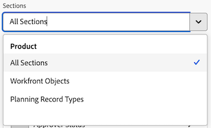

# Erstellen eines Tabellenberichts in einem Arbeitsflächen-Dashboard

>[!IMPORTANT]
>
>Die Funktion Canvas-Dashboards ist derzeit nur für Benutzer verfügbar, die an der Beta-Phase teilnehmen. Teile der Funktion sind in dieser Phase möglicherweise nicht vollständig oder funktionieren nicht wie vorgesehen. Bitte senden Sie Feedback zu Ihrem Erlebnis, indem Sie die Anweisungen im Abschnitt [Feedback geben](/help/quicksilver/product-announcements/betas/canvas-dashboards-beta/canvas-dashboards-beta-information.md#provide-feedback) im Artikel Beta-Übersicht für Canvas-Dashboards befolgen. 
>>Wenn Sie Feedback zu einem möglichen Fehler oder einem technischen Problem haben, senden Sie bitte ein Ticket an den Workfront-Support. Weitere Informationen finden Sie unter [Kundensupport kontaktieren](/help/quicksilver/workfront-basics/tips-tricks-and-troubleshooting/contact-customer-support.md). 
>>Beachten Sie, dass diese Beta-Version bei den folgenden Cloud-Anbietern nicht verfügbar ist:
>
>* Eigene Schlüssel für Amazon Web Services mitbringen
>* Azure
>* Google Cloud Platform

Sie können einen Tabellenbericht zu einem Arbeitsflächen-Dashboard hinzufügen, um Ihre Daten in einem Tabellenformat zu visualisieren.

## Zugriffsanforderungen

+++ Erweitern Sie , um die Zugriffsanforderungen für die -Funktion in diesem Artikel anzuzeigen.

<table style="table-layout:auto"> 
<col> 
</col> 
<col> 
</col> 
<tbody> 
<tr> 
   <td role="rowheader">
Adobe Workfront-Paket
</td> 
   <td> 

Beliebig 
 
   </td> 
<tr> 
 <tr> 
   <td role="rowheader">
Adobe Workfront-Lizenz
</td> 
   <td> 

Standard 
 

Plan
 
   </td> 
   </tr> 
  </tr> 
  <tr> 
   <td role="rowheader">
Konfigurationen der Zugriffsebene
</td> 
   <td>
Zugriff auf Berichte, Dashboards und Kalender bearbeiten

  </td> 
  </tr>  
</tbody> 
</table>

Weitere Informationen zu den Informationen in dieser Tabelle finden Sie unter [Zugriffsanforderungen in der Dokumentation zu Workfront](/help/quicksilver/administration-and-setup/add-users/access-levels-and-object-permissions/access-level-requirements-in-documentation.md).
+++

## Voraussetzungen

Sie müssen ein Dashboard erstellen, bevor Sie einen Tabellenbericht erstellen können.

## Erstellen eines Tabellenberichts in einem Arbeitsflächen-Dashboard

Es stehen viele Konfigurationsoptionen zum Erstellen eines Tabellenberichts zur Verfügung. In diesem Abschnitt führen wir Sie durch den allgemeinen Prozess der Erstellung eines solchen.

{{step1-to-dashboards}}

1. Klicken Sie im linken Bedienfeld auf **Arbeitsflächen-Dashboards**.

1. Klicken **oben rechts auf** Neues Dashboard“.

1. Geben Sie in das Feld **Dashboard erstellen** den **** Namen“ und die **Beschreibung** des Dashboards ein.

1. Klicken Sie auf **Erstellen**.

1. Wählen Sie im **Bericht hinzufügen** die Option **Bericht erstellen** aus.

1. Klicken Sie auf der linken Seite auf **Tabelle**.

1. Klicken Sie oben rechts auf **Bericht erstellen**.

1. (Optional) Gehen Sie wie folgt vor, um den Abschnitt **Details** zu konfigurieren:

   1. Einen Bericht eingeben **Name**.

   1. Einen Bericht eingeben **Beschreibung**.

1. Gehen Sie wie folgt vor, um den Abschnitt **Tabelle erstellen** zu konfigurieren:

   1. Klicken Sie im linken Bedienfeld auf das Symbol **Tabellenspalten**  .

   1. Klicken Sie **Spalte hinzufügen** und wählen Sie dann das Feld aus, das als Spalte in der Tabelle angezeigt werden soll. Die Spalte wird im Vorschaubereich auf der rechten Seite angezeigt.

   1. Wiederholen Sie die obigen Schritte für jede Spalte, die Sie hinzufügen möchten.

1. Gehen Sie wie folgt vor, um den Abschnitt **Filter** zu konfigurieren:

   1. Klicken Sie im linken Bedienfeld auf das Symbol **Filter** .

   1. Wählen Sie **Filter bearbeiten** aus.

   1. Klicken Sie **Bedingung hinzufügen** und geben Sie dann das Feld an, nach dem Sie filtern möchten, sowie den Modifikator, der definiert, welche Art von Bedingung das Feld erfüllen muss. Die Spalte wird im Vorschaubereich auf der rechten Seite angezeigt.

1. (Optional) Klicken Sie auf **Filtergruppe hinzufügen**, um einen weiteren Satz von Filterkriterien hinzuzufügen. Der Standardoperator zwischen den Sätzen ist UND. Klicken Sie auf den Operator, um ihn in ODER zu ändern.

1. Gehen Sie wie folgt vor, um den Abschnitt **Drilldown-Gruppeneinstellungen** zu konfigurieren:

   1. Klicken Sie im linken Bedienfeld auf das Symbol **Gruppeneinstellungen**  .

   1. Klicken Sie auf **Gruppierung hinzufügen** und wählen Sie dann das Feld aus, das Sie als Gruppierung erstellen möchten. Die Gruppierungsspalte wird im Vorschaubereich auf der rechten Seite angezeigt.

1. Klicken Sie **Speichern**, um den Bericht zu erstellen und zum Dashboard hinzuzufügen.

## Beispiel für einen Tabellenbericht erstellen

In diesem Abschnitt werden die Schritte zum Erstellen eines Tabellenberichts erläutert, der ausstehende Dokumentgenehmigungen ausgibt.

Weitere Informationen zu Beispielen für Tabellenberichte finden Sie unter [Erstellen eines Berichts-Dashboards zur Überprüfung und Genehmigung](/help/quicksilver/review-and-approve-work/document-reviews-and-approvals/create-review-and-approval-dashboard.md).

{{step1-to-dashboards}}

1. Klicken Sie im linken Bedienfeld auf **Arbeitsflächen-Dashboards**.

1. Klicken **oben rechts auf** Neues Dashboard“.

1. Geben Sie in das Feld **Dashboard erstellen** den **** Namen“ und die **Beschreibung** des Dashboards ein.

1. Klicken Sie auf **Erstellen**.

1. Wählen Sie im **Bericht hinzufügen** die Option **Bericht erstellen** aus.

1. Klicken Sie auf der linken Seite auf **Tabelle**.

1. Klicken Sie oben rechts auf **Bericht erstellen**.

1. Gehen Sie wie folgt vor, um den Abschnitt **Details** zu konfigurieren:

   1. Geben Sie _Ausstehende_) in das Feld **Name** ein.
   1. Geben Sie eine Beschreibung in das Feld **Beschreibung** ein. Dieser Text wird als QuickInfo neben dem Diagrammnamen angezeigt.

1. Gehen Sie wie folgt vor, um den Abschnitt **Tabelle erstellen** zu konfigurieren:

   1. Klicken Sie im linken Bereich auf das Symbol **Tabellenspalten**  .
   1. Klicken Sie **Spalte hinzufügen**.
   1. Scrollen Sie nach unten und wählen Sie **Dokumentgenehmigungen** > **Status** aus.
   1. Die folgenden Spalten hinzufügen:

   <table>
    <tr>
    <td><strong>Projektname</strong></td>
    <td>Dokumentversion &gt; Dokument &gt; Projekt &gt; Name</td>
    </tr>
    <tr>
    <td><strong>Dokumentname</strong></td>
    <td>Dokumentversion &gt; Dokument &gt; Typ <em>Name</em> in das Suchfeld.</td>
    </tr>
    <tr>
    <td><strong>Dokumentversion</strong></td>
    <td>Dokumentversion &gt; Dokument &gt; Version</td>
    </tr>
    <tr>
    <td><strong>Frist</strong></td>
    <td>Dokumentengenehmigung &gt; Genehmigungsphase &gt; Frist</td>
    </tr>
    <tr>
    <td><strong>Anfrage von</strong></td>
    <td>Dokumentgenehmigung &gt; Genehmigungsphase &gt; Teilnehmer der Genehmigungsphase* &gt; Anforderer &gt; Typ <em>Name</em> im Suchfeld.</td>
    </tr>
    <tr>
    <td><strong>Angefordertes Datum</strong></td>
    <td>Dokumentengenehmigung &gt; Genehmigungsphase &gt; Genehmigungsphase &gt; Teilnehmer der Genehmigungsphase* &gt; Erstellt in</td>
    </tr>
    <tr>
    <td><strong>Genehmigende Person</strong></td>
    <td>Dokumentgenehmigung &gt; Genehmigungsphase &gt; Teilnehmer an Genehmigungsphase* &gt; Teilnehmer &gt; Typ <em>Name</em> im Suchfeld.</td>
    </tr>
    </table>

   *Teilnehmer der Genehmigungsphase werden auf _Genehmigungsphase PA.._ gekürzt

1. Gehen Sie wie folgt vor, um den Abschnitt **Filter** zu konfigurieren:
   1. Klicken Sie im linken Bedienfeld auf das Symbol **Filter** &quot;.
   1. Klicken Sie **Filter bearbeiten** und dann **Bedingung hinzufügen**.
   1. Klicken Sie auf den leeren Bedingungsfilter und dann auf **Feld auswählen**.
   1. Wählen Sie **Status** aus.
   1. Ändern Sie den Operator in **Gleich** und geben Sie dann _Ausstehende_) in das Textfeld ein.
      
   1. (Optional) Fügen Sie zusätzliche Filter hinzu, wie im Abschnitt **Optionale Filter** unten beschrieben.
1. Klicken **oben** auf dem Bildschirm auf „Speichern“.

## Überlegungen beim Erstellen eines Tabellenberichts

### Verwenden der Feldauswahl

Die **Abschnitte** Dropdown-Liste im Abschnitt **Tabelle erstellen** dient zur Eingrenzung der Optionen in einer Feldauswahl, damit ein Objekt beim Erstellen eines Tabellenberichts leichter zu finden ist. Wählen Sie zunächst ein Basiseinheitsobjekt aus.

* **Alle Abschnitte**: Alle Objekttypen in Workfront Workflow und Workfront Planning.
* **Workfront-Objekte**: Native Workfront-Workflow-Objekte.
* **Planning-Datensatztypen**: Benutzerdefinierte Datensatztypen, die in Workfront Planning definiert sind.

Nachdem das Basisobjekt für die Entität ausgewählt wurde, wird **Dropdown-** „Abschnitte“ mit den entsprechenden Feldtypoptionen aktualisiert, aus denen Sie auswählen können.

* **Alle Abschnitte**: Native Felder, benutzerdefinierte Felder und verwandte Objekte.
* **Alle Felder**: Sowohl native als auch benutzerdefinierte Felder (ohne Beziehungen).
* **Benutzerdefinierte Felder**: Kundendefinierte Felder in einem benutzerdefinierten Formular oder einem Planungsdatensatz.
* **Workfront-**: Nur native Felder.
* **Beziehungen**: Verbundene Datensätze.

### Verweisen auf untergeordnete Objekte

Verfügbare Beziehungen für zusätzliche Spalten, Filteroptionen und Gruppierungsattribute sind im Allgemeinen auf Objekte beschränkt, die höher in der Workfront-Objekthierarchie stehen oder die ansonsten eine einzige Auswahl im Basisobjekt der Entität des Berichts aufweisen. Hiervon gibt es einige Ausnahmen, darunter die folgenden:

* Projekt > Aufgaben
* Dokumentengenehmigung > Dokumentengenehmigungsphasen
* Phasen der Dokumentgenehmigung > Teilnehmer an der Dokumentgenehmigungsphase

Bei Verwendung einer der oben aufgeführten hierarchischen Beziehungen wird in der Tabelle für jeden untergeordneten Datensatz eine Zeile angezeigt, die mit dem übergeordneten Objekt verbunden ist.
