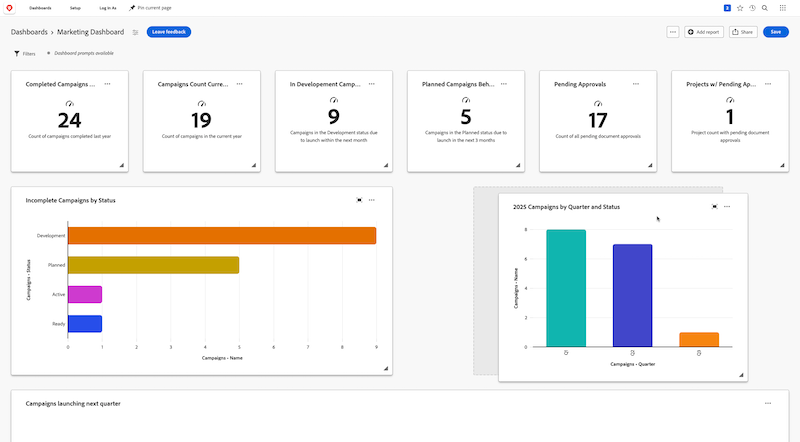

# Anordnen von Berichten in einem Arbeitsflächen-Dashboard

>[!IMPORTANT]
>
>Die Funktion Canvas-Dashboards ist derzeit nur für Benutzer verfügbar, die an der Beta-Phase teilnehmen. Teile der Funktion sind in dieser Phase möglicherweise nicht vollständig oder funktionieren nicht wie vorgesehen. Bitte senden Sie Feedback zu Ihrem Erlebnis, indem Sie die Anweisungen im Abschnitt [Feedback geben](/help/quicksilver/product-announcements/betas/canvas-dashboards-beta/canvas-dashboards-beta-information.md#provide-feedback) im Artikel Beta-Übersicht für Canvas-Dashboards befolgen. 
>&#x200B;>Beachten Sie, dass diese Beta-Version bei den folgenden Cloud-Anbietern nicht verfügbar ist:
>
>* Eigene Schlüssel für Amazon Web Services mitbringen
>* Azure
>* Google Cloud Platform

Nachdem ein Bericht zu einem Arbeitsflächen-Dashboard hinzugefügt wurde, wird er als Berichts-Widget im Dashboard angezeigt, damit Sie seine Daten schnell auf einen Blick visualisieren können. Nachdem mehrere Berichte hinzugefügt wurden, können Sie die Größe der einzelnen Widgets so einstellen, dass sie am besten zum Inhalt des Berichts im Dashboard passen, und dann die Position der einzelnen Widgets anpassen, um die Daten effektiver anzuzeigen.

## Zugriffsanforderungen

+++ Erweitern Sie , um die Zugriffsanforderungen anzuzeigen. 

<table style="table-layout:auto"> 
<col> 
</col> 
<col> 
</col> 
<tbody> 
<tr> 
   <td role="rowheader">
Adobe Workfront-Plan
</td> 
   <td> 

Beliebig 
 
   </td> 
<tr> 
 <tr> 
   <td role="rowheader">
Adobe Workfront-Lizenz
</td> 
   <td> 

Aktuell: Plan 
 

Neu: Standard
 
   </td> 
   </tr> 
  </tr> 
  <tr> 
   <td role="rowheader">
Konfigurationen der Zugriffsebene
</td> 
   <td>
Zugriff auf Berichte, Dashboards und Kalender bearbeiten

  </td> 
  </tr>  
        <tr> 
   <td role="rowheader">
Objektberechtigungen
</td> 
   <td>
Berechtigungen für das Dashboard verwalten

  </td> 
  </tr>
</tbody> 
</table>

Weitere Informationen zu den Informationen in dieser Tabelle finden Sie unter [Zugriffsanforderungen in der Dokumentation zu Workfront](/help/quicksilver/administration-and-setup/add-users/access-levels-and-object-permissions/access-level-requirements-in-documentation.md).
+++

## Voraussetzungen

Berichte müssen zu einem Dashboard hinzugefügt werden, bevor sie neu angeordnet werden können.

## Berichte in einem Dashboard anordnen

{{step1-to-dashboards}}

1. Klicken Sie im linken Bedienfeld auf **Arbeitsflächen-Dashboards**.

1. Wählen Sie auf **Seite** Arbeitsflächen-Dashboards **oben rechts** Layout bearbeiten“ aus. Die Berichts-Widgets können nun bearbeitet werden.

1. Klicken und ziehen Sie ein Berichts-Widget an eine neue Position auf der Seite.

   

1. (Optional) Um die Länge und Breite eines Berichts-Widgets anzupassen, klicken Sie auf das Symbol **Resize**  in der rechten unteren Ecke des Widgets und halten Sie es gedrückt. Passen Sie dann die Größe nach Bedarf an.

1. Wiederholen Sie die Schritte 4 bis 5 für jedes Widget, das Sie neu anordnen möchten.

1. Klicken **oben** auf „Speichern“.
