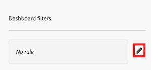

# Filtern eines Arbeitsflächen-Dashboards

>[!IMPORTANT]
>
>Die Funktion Canvas-Dashboards ist derzeit nur für Benutzer verfügbar, die an der Beta-Phase teilnehmen. Teile der Funktion sind in dieser Phase möglicherweise nicht vollständig oder funktionieren nicht wie vorgesehen. Bitte senden Sie Feedback zu Ihrem Erlebnis, indem Sie die Anweisungen im Abschnitt [Feedback geben](/help/quicksilver/product-announcements/betas/canvas-dashboards-beta/canvas-dashboards-beta-information.md#provide-feedback) im Artikel Beta-Übersicht für Arbeitsflächen-Dashboards befolgen.Wenn Sie Feedback zu einem möglichen Fehler oder einem technischen Problem haben, senden Sie bitte ein Ticket an den Workfront-Support. Weitere Informationen finden Sie unter [Kontaktieren des Kunden-Supports](/help/quicksilver/workfront-basics/tips-tricks-and-troubleshooting/contact-customer-support.md).Beachten Sie, dass diese Beta-Version bei den folgenden Cloud-Anbietern nicht verfügbar ist:
>
>* Eigene Schlüssel für Amazon Web Services mitbringen
>* Azure
>* Google Cloud Platform

<!--
Take Preview and production mentions out at release
-->

Die hervorgehobenen Informationen auf dieser Seite beziehen sich auf Funktionen, die noch nicht allgemein verfügbar sind. Sie ist nur in der Vorschau -Umgebung für alle Kunden verfügbar. Nach der Veröffentlichung in der Vorschau sind dieselben Funktionen auch monatlich in der Produktionsumgebung für Kunden verfügbar, die schnelle Versionen aktiviert haben. 

Informationen zu Schnellversionen finden Sie unter [Aktivieren oder Deaktivieren von Schnellversionen für Ihre Organisation](/help/quicksilver/administration-and-setup/set-up-workfront/configure-system-defaults/enable-fast-release-process.md). 

Sie können einen Filter auf ein Arbeitsflächen-Dashboard anwenden, das Eingabeaufforderungen enthält. Eine Eingabeaufforderung dient als Filtermodifikator, der zusätzliche Filterkriterien anwendet, sodass Sie Ihre Ergebnisse noch weiter eingrenzen können. Diese Eingabeaufforderungen können bei jeder Anwendung des Filters geändert werden, sodass Sie die angezeigten Ergebnisse anpassen können, ohne die wichtigsten Filterkriterien des Dashboards oder jeden einzelnen Bericht bearbeiten zu müssen.

## Zugriffsanforderungen

+++ Erweitern, um die Zugriffsanforderungen für die in diesem Artikel beschriebene Funktionalität anzuzeigen. 

<table style="table-layout:auto"> 
<col> 
</col> 
<col> 
</col> 
<tbody> 
<tr> 
   <td role="rowheader">
Adobe Workfront-Paket
</td> 
   <td> 

Beliebig 
 
   </td> 
<tr> 
 <tr> 
   <td role="rowheader">
Adobe Workfront-Lizenz
</td> 
   <td> 

Standard
 

Abo
 
   </td> 
   </tr> 
  </tr> 
  <tr> 
   <td role="rowheader">
Konfigurationen der Zugriffsebene
</td> 
   <td>
Zugriff auf Berichte, Dashboards und Kalender bearbeiten

  </td> 
  </tr> 
    </tr>  
        <tr> 
   <td role="rowheader">
Objektberechtigungen
</td> 
   <td>
Berechtigungen für das Dashboard verwalten

  </td> 
  </tr> 
</tbody> 
</table>

Weitere Details zu den Informationen in dieser Tabelle finden Sie unter [Zugriffsanforderungen in der Dokumentation zu Workfront](/help/quicksilver/administration-and-setup/add-users/access-levels-and-object-permissions/access-level-requirements-in-documentation.md).
+++

## Voraussetzungen

Sie müssen ein Dashboard erstellen, bevor es gefiltert werden kann.

Weitere Informationen finden Sie unter [Erstellen eines Arbeitsflächen-Dashboards](/help/quicksilver/reports-and-dashboards/canvas-dashboards/create-dashboards/create-dashboards.md).

## Dashboard filtern

Führen Sie die folgenden Schritte in der angegebenen Reihenfolge aus, um ein Dashboard zu filtern:

* [Teil 1: Erstellen eines Dashboard-Filters](#part-1-create-a-dashboard-filter)
* [Teil 2: Erstellen einer Dashboard-Eingabeaufforderung](#part-2-define-a-dashboard-prompt)
* [Teil 3: Anwenden einer Dashboard-Eingabeaufforderung](#step-3-apply-a-dashboard-prompt)

>[!NOTE]
>
>Der Dashboard-Filter wird auf alle Berichte angewendet, in denen Filter auf Dashboard-Ebene nicht deaktiviert sind.  Sie können einzelne Berichte von der Anwendung von Filtern auf Dashboard-Ebene ausschließen, indem Sie das Aktionsmenü für jeden Bericht erweitern und die Option **Filter deaktivieren** auswählen.

### Teil 1: Erstellen eines Dashboard-Filters

Mit einem Dashboard-Filter können Sie einen gemeinsamen Filter auf alle Berichte anwenden, die in einem Dashboard verfügbar sind, ohne die Filter für jeden einzelnen Bericht ändern zu müssen.

>[!NOTE]
>
>Diese Filter können nur von einem Benutzer mit Verwaltungszugriff auf das Dashboard konfiguriert werden.

{{step1-to-dashboards}}

1. Klicken Sie im linken Bedienfeld auf **Arbeitsflächen-Dashboards**.

1. Wählen Sie auf der **Arbeitsflächen** Dashboards“ das Dashboard aus, auf das Sie einen Filter anwenden möchten.

1. Klicken Sie oben links auf der Detailseite des Dashboards auf **Filter**. Das seitliche Bedienfeld „Filter“ wird geöffnet.

1. (Bedingt) Klicken Sie in der Produktionsumgebung auf **Filter bearbeiten** oder in der Vorschauumgebung klicken Sie auf das **Mehr** Menü  und dann auf **Filter bearbeiten**. Das **Dashboard-Filter** Dialogfeld wird geöffnet.

1. (Optional) Gehen Sie wie folgt vor, um eine Regel hinzuzufügen:

   1. Wählen Sie **Symbol** Bearbeiten“ rechts neben dem Regelfeld aus.

      

   1. Klicken Sie **Bedingung hinzufügen** und fügen Sie dann die folgenden Informationen hinzu:
      * Klicken Sie **Feld auswählen**, um ein Feld auszuwählen, nach dem Sie filtern möchten.
      * Wählen Sie eine Option (oder einen Filtermodifikator) aus, um festzulegen, welche Art von Bedingung das Feld erfüllen muss.

   1. (Optional) Klicken Sie auf **Filtergruppe hinzufügen**, um einen weiteren Satz von Filterkriterien hinzuzufügen. Der Standardoperator zwischen den Sätzen ist UND. Klicken Sie auf den Operator, um ihn in ODER zu ändern.

1. Fahren Sie mit [Teil 2: Erstellen einer Dashboard-Eingabeaufforderung](#part-2-define-a-dashboard-prompt) fort.

### Teil 2: Dashboard-Eingabeaufforderung definieren

In einer Dashboard-Eingabeaufforderung haben Benutzer die Möglichkeit, zusätzliche benutzerdefinierte Filter auf im Dashboard verfügbare Berichte anzuwenden.

>[!NOTE]
>
>Die Dashboard-Eingabeaufforderungsoptionen können nur von einem Benutzer mit Verwaltungszugriff auf das Dashboard konfiguriert werden.

1. Gehen Sie wie folgt vor, um eine Eingabeaufforderung hinzuzufügen:

   1. Klicken Sie **Eingabeaufforderung hinzufügen**. Neue Felder werden auf der rechten Seite des Bildschirms angezeigt.

   1. Geben Sie einen Titel in das Feld **Bezeichnung anpassen** ein.

   1. Wählen Sie das Feld aus, auf dem die Eingabeaufforderung basieren soll, indem Sie den Namen des Felds eingeben und es dann auswählen, wenn es in der Liste angezeigt wird. 

1. Gehen Sie wie folgt vor, um eine benutzerdefinierte Eingabeaufforderung hinzuzufügen:

   1. Wählen Sie **Benutzerdefinierte Eingabeaufforderung hinzufügen** aus. Neue Felder werden auf der rechten Seite des Bildschirms angezeigt.

   1. (Optional) Geben Sie im Feld **Bezeichnung anpassen** eine neue Bezeichnung ein. Standardmäßig wird die Bezeichnung *Neue benutzerdefinierte Eingabeaufforderung* zugewiesen.

   1. Klicken Sie **Neue Option hinzufügen**.

   1. Geben Sie den Namen der Eingabeaufforderung in das Feld **Optionswert** ein.

   1. Klicken Sie **Bedingung hinzufügen** und geben Sie dann das Feld an, nach dem Sie filtern möchten, sowie den Modifikator, der definiert, welche Art von Bedingung das Feld erfüllen muss.

      >[!NOTE]
      >
      >Die Bedingung einer benutzerdefinierten Eingabeaufforderung kann nur im Textmodus bearbeitet werden. Auf diese Weise können mehrere Bedingungen in einem einzigen Feld angewendet werden.

   1. (Optional) Klicken Sie auf **Filtergruppe hinzufügen**, um einen weiteren Satz von Filterkriterien hinzuzufügen. Der Standardoperator zwischen den Sätzen ist UND. Klicken Sie auf den Operator, um ihn in ODER zu ändern.

1. Klicken Sie **Speichern**, um den Filter auf das Dashboard anzuwenden.

1. Um Eingabeaufforderungen standardmäßig zu speichern, gehen Sie nach dem Speichern der Eingabeaufforderung wie folgt vor: 

   

   1. (Optional) Klicken Sie auf das **Mehr** Menü  und dann auf **Als Standardaufforderungen speichern**.

      Der Eingabeaufforderungsfilter wird immer dann angewendet, wenn das Dashboard für alle Benutzer geladen wird, die über die Berechtigung „Anzeigen“ oder eine höhere Berechtigung dafür verfügen.

      >[!TIP]
      >
      >Wenn Sie die Eingabeaufforderung nicht erstellt haben und keinen Zugriff auf die zugehörigen Felder haben, werden die Feldnamen nicht angezeigt. Ändern Sie die Eingabeaufforderung, um den Bericht zu füllen.

   1. (Bedingt) Wenn Sie auf ein Dashboard mit einer standardmäßig angewendeten Eingabeaufforderung zugreifen, können Sie den Filter ändern und Ihre Änderungen werden als persönliche Voreinstellung gespeichert. Die folgenden Szenarien sind vorhanden:

      * Wenn Sie über Verwaltungsberechtigungen für das Dashboard verfügen, klicken Sie auf **Als Standardaufforderungen speichern**, um Ihre Änderungen als Standardfilter zu speichern. Dadurch werden die ursprünglichen Standardwerte ersetzt.
      * Wenn Sie über Anzeigeberechtigungen für das Dashboard verfügen, werden Ihre Änderungen nur für Sie angezeigt. Beim Aktualisieren der Seite bleiben Ihre Einstellungen erhalten.

   1. (Bedingt) Wenn Sie die Einstellungen der Standardaufforderung geändert haben, klicken Sie auf das Menü **Mehr**  und dann auf **Dashboard-Standardeinstellungen anwenden**, um zu den Standardfilterergebnissen zurückzukehren.
   1. (Optional) Klicken Sie auf **Standardeinstellungen zurücksetzen**, um die ursprünglichen Standardeinstellungen durch Ihre Änderungen zu ersetzen. Diese Option steht nur Dashboard-Managern zur Verfügung.

   

1. Fahren Sie mit [Teil 3: Anwenden einer Dashboard-Eingabeaufforderung](#step-3-apply-a-dashboard-prompt) fort.

### Schritt 3: Dashboard-Eingabeaufforderung anwenden

Alle Benutzer mit Zugriff auf ein Dashboard können eine Dashboard-Eingabeaufforderung auf ein Canvas-Dashboard anwenden, sobald der Filter und die Eingabeaufforderungen erstellt wurden.

{{step1-to-dashboards}}

1. Klicken Sie im linken Bedienfeld auf **Arbeitsflächen-Dashboards**.

1. Wählen Sie auf der **Arbeitsflächen** Dashboards“ das Dashboard aus, auf das Sie die Eingabeaufforderung anwenden möchten.

1. Klicken Sie oben links auf der Detailseite des Dashboards auf **Filter**. Das seitliche Bedienfeld „Filter“ wird geöffnet.

1. Wählen Sie **Abschnitt Datensätze anzeigen, bei denen…** eine Bedingung für eine oder alle angezeigten Eingabeaufforderungen aus. Die Eingabeaufforderung wird angewendet und ein **Dashboard prompt applied**-Tag wird in der Ecke des Berichts-Widgets angezeigt.   

1. Klicken Sie auf **Schließen**-Symbol  in der oberen rechten Ecke, um das Bedienfeld auszublenden.

