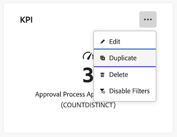

# Duplizieren eines Berichts in einem Arbeitsflächen-Dashboard

>[!IMPORTANT]
>
>Die Funktion Canvas-Dashboards ist derzeit nur für Benutzer verfügbar, die an der Beta-Phase teilnehmen. Teile der Funktion sind in dieser Phase möglicherweise nicht vollständig oder funktionieren nicht wie vorgesehen. Bitte senden Sie Feedback zu Ihrem Erlebnis, indem Sie die Anweisungen im Abschnitt [Feedback geben](/help/quicksilver/product-announcements/betas/canvas-dashboards-beta/canvas-dashboards-beta-information.md#provide-feedback) im Artikel Beta-Übersicht für Canvas-Dashboards befolgen. 
>Wenn Sie Feedback zu einem möglichen Fehler oder einem technischen Problem haben, senden Sie bitte ein Ticket an den Workfront-Support. Weitere Informationen finden Sie unter [Kundensupport kontaktieren](/help/quicksilver/workfront-basics/tips-tricks-and-troubleshooting/contact-customer-support.md). 
>Beachten Sie, dass diese Beta-Version bei den folgenden Cloud-Anbietern nicht verfügbar ist:
>
>* Eigene Schlüssel für Amazon Web Services mitbringen
>* Azure
>* Google Cloud Platform

Sie können einen KPI-, Tabellen- oder Diagrammbericht in einem Arbeitsflächen-Dashboard duplizieren, nachdem er erstellt wurde. Nach dem Duplizieren können Sie den Bericht nach Bedarf bearbeiten, bevor Sie ihn speichern.

## Zugriffsanforderungen

+++ Erweitern, um die Zugriffsanforderungen für die in diesem Artikel beschriebene Funktionalität anzuzeigen. 

<table style="table-layout:auto"> 
<col> 
</col> 
<col> 
</col> 
<tbody> 
<tr> 
   <td role="rowheader">
Adobe Workfront-Paket
</td> 
   <td> 

Beliebig 
 
   </td> 
<tr> 
 <tr> 
   <td role="rowheader">
Adobe Workfront-Lizenz
</td> 
   <td> 

Standard 
 

Abo
 
   </td> 
   </tr> 
  </tr> 
  <tr> 
   <td role="rowheader">
Konfigurationen der Zugriffsebene
</td> 
   <td>
Zugriff auf Berichte, Dashboards und Kalender bearbeiten

  </td> 
  </tr>  
      <tr> 
   <td role="rowheader">
Objektberechtigungen
</td> 
   <td>
Berechtigungen für das Dashboard verwalten

  </td> 
  </tr>
</tbody> 
</table>

Weitere Details zu den Informationen in dieser Tabelle finden Sie unter [Zugriffsanforderungen in der Dokumentation zu Workfront](/help/quicksilver/administration-and-setup/add-users/access-levels-and-object-permissions/access-level-requirements-in-documentation.md).
+++

## Voraussetzungen

Ein Bericht muss einem Dashboard hinzugefügt werden, bevor er dupliziert werden kann.

Weitere Informationen finden Sie unter [Erstellen eines Arbeitsflächen-Dashboards](/help/quicksilver/reports-and-dashboards/canvas-dashboards/create-dashboards/create-dashboards.md).

## Duplizieren eines Berichts

{{step1-to-dashboards}}

1. Klicken Sie im linken Bedienfeld auf **Arbeitsflächen-Dashboards**.
1. Klicken Sie auf **Seite** Arbeitsflächen-Dashboards“ auf das Symbol **Mehr**  in der oberen rechten Ecke des Berichts, den Sie duplizieren möchten, und wählen Sie dann **Duplizieren**.

   

1. (Optional) Geben Sie im **Konfigurieren** angezeigten Feld auf der Registerkarte **Details** einen neuen Bericht **Name** ein.

1. (Optional) Nehmen Sie über die Registerkarten auf der linken Seite die erforderlichen Anpassungen an den Konfigurationen vor.

   >[!NOTE]
   >
   >Diese Registerkarten variieren je nachdem, ob Sie einen KPI-, Tabellen- oder Diagrammbericht dupliziert haben.  Weitere Informationen finden Sie unter [Erstellen eines KPI-Berichts in einem &#x200B;](/help/quicksilver/reports-and-dashboards/canvas-dashboards/add-reports/build-kpi-report.md)-Dashboard[, Erstellen eines Diagrammberichts in einem Arbeitsflächen-Dashboard](/help/quicksilver/reports-and-dashboards/canvas-dashboards/add-reports/build-chart-report.md) und [Erstellen eines Tabellenberichts in einem Arbeitsflächen-Dashboard](/help/quicksilver/reports-and-dashboards/canvas-dashboards/add-reports/build-table-report.md).

1. Klicken Sie auf **Speichern**. Der duplizierte Bericht wird im Dashboard angezeigt.
