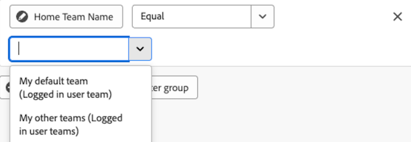

# Bearbeiten von Berichtsfiltern in einem Arbeitsflächen-Dashboard

>[!IMPORTANT]
>
>Die Funktion Canvas-Dashboards ist derzeit nur für Benutzer verfügbar, die an der Beta-Phase teilnehmen. Teile der Funktion sind in dieser Phase möglicherweise nicht vollständig oder funktionieren nicht wie vorgesehen. Bitte senden Sie Feedback zu Ihrem Erlebnis, indem Sie die Anweisungen im Abschnitt [Feedback geben](/help/quicksilver/product-announcements/betas/canvas-dashboards-beta/canvas-dashboards-beta-information.md#provide-feedback) im Artikel Beta-Übersicht für Canvas-Dashboards befolgen. 
>&#x200B;>Beachten Sie, dass diese Beta-Version bei den folgenden Cloud-Anbietern nicht verfügbar ist:
>
>* Eigene Schlüssel für Amazon Web Services mitbringen
>* Azure
>* Google Cloud Platform

Sie können Berichtsfilter bearbeiten, nachdem Sie sie auf ein Arbeitsflächen-Dashboard angewendet haben, um die Daten zu aktualisieren, die im Verlauf eines Projekts angezeigt werden.

## Zugriffsanforderungen

+++ Erweitern Sie , um die Zugriffsanforderungen anzuzeigen. 

<table style="table-layout:auto"> 
<col> 
</col> 
<col> 
</col> 
<tbody> 
<tr> 
   <td role="rowheader">
Adobe Workfront-Plan
</td> 
   <td> 

Beliebig 
 
   </td> 
<tr> 
 <tr> 
   <td role="rowheader">
Adobe Workfront-Lizenz
</td> 
   <td> 

Aktuell: Plan 
 

Neu: Standard
 
   </td> 
   </tr> 
  </tr> 
  <tr> 
   <td role="rowheader">
Konfigurationen der Zugriffsebene
</td> 
   <td>
Zugriff auf Berichte, Dashboards und Kalender bearbeiten

  </td> 
  </tr>  
        <tr> 
   <td role="rowheader">
Objektberechtigungen
</td> 
   <td>
Berechtigungen für das Dashboard verwalten

  </td> 
  </tr>
</tbody> 
</table>

Weitere Informationen zu den Informationen in dieser Tabelle finden Sie unter [Zugriffsanforderungen in der Dokumentation zu Workfront](/help/quicksilver/administration-and-setup/add-users/access-levels-and-object-permissions/access-level-requirements-in-documentation.md).
+++

## Voraussetzungen

Sie müssen einen Filter zu einem Bericht hinzufügen, bevor er bearbeitet werden kann.

## Bearbeiten eines Berichtsfilters

>[!NOTE]
>
>Es gibt viele verfügbare Konfigurations-Tools zum Erstellen und Bearbeiten eines Berichtsfilters. Weitere Informationen zu diesen Tools finden Sie im folgenden Abschnitt in diesem Artikel: [Überlegungen beim Bearbeiten eines Berichtsfilters](#considerations-when-editing-a-report-filter).

{{step1-to-dashboards}}

1. Klicken Sie im linken Bedienfeld auf **Arbeitsflächen-Dashboards**.

1. Klicken Sie auf **Seite** Arbeitsflächen-Dashboards“ auf das Symbol **Mehr**  in der oberen rechten Ecke des Berichts, der den Filter enthält, den Sie bearbeiten möchten, und wählen Sie dann **Bearbeiten**.

   

1. Wählen Sie auf der linken Seite des **Konfigurieren**-Dialogfelds das Bedienfeld **Filter** aus.

1. Klicken Sie **Filter bearbeiten**.

1. Wählen Sie das Feld oder den Modifikator aus, das bzw. den Sie bearbeiten möchten, und passen Sie dann die aktuelle Auswahl nach Bedarf an.

   

1. (Optional) Klicken Sie auf **Filtergruppe hinzufügen**, um einen weiteren Satz von Filterkriterien hinzuzufügen. Der Standardoperator zwischen den Sätzen ist UND. Klicken Sie auf den Operator, um ihn in ODER zu ändern.

1. Klicken Sie auf **Speichern**.

## Überlegungen beim Bearbeiten eines Berichtsfilters

### Datumsbasierte Platzhalterfilter-Variablen

Datumsbasierte Platzhalteroptionen können in Kombination mit einem beliebigen Datumsfilterattribut verwendet werden. Informationen zum Hinzufügen eines datumsbasierten Platzhalters zu einem Bericht finden Sie im Artikel [Verwenden von datumsbasierten Platzhaltern zum Verallgemeinern von Berichten](../../../reports-and-dashboards/reports/reporting-elements/use-date-based-wildcards-generalize-reports.md).

>[!NOTE]
>
>Wenn Sie eine Datums- und Uhrzeitberechnung erstellen, die keinen Zeitanteil enthält oder die Datums-Platzhalter $$TODAY oder $$NOW verwendet, verwendet das System das Datum in der UTC-Zone (Coordinated Universal Time) und nicht in der Zeitzone Ihrer lokalen Zeitzone. Dies kann zu einem unerwarteten Datumsergebnis führen.

Sie können aus den folgenden datumsbasierten Platzhaltern auswählen:

<table style="table-layout:auto"> 
 <col> 
 <col> 
 <tbody> 
  <tr valign="top"> 
   <td width="100" role="rowheader"> 
<strong>$$TODAY</strong> 
 </td> 
   <td> 
Es wird empfohlen, datumsabhängige Filter mit diesem Platzhalter zu erstellen, damit der Filter nicht morgen, in der nächsten Woche oder im nächsten Monat erneut erstellt wird.
 
Wenn Sie beispielsweise alle vor dem heutigen Tag fälligen Aufgaben anzeigen möchten, können Sie die folgende Regel in einem Aufgabenfilter verwenden: <em>Geplantes Startdatum weniger als $$TODAY</em>.
 
$$TODAY ist immer gleich Mitternacht für den aktuellen Tag.
 </td> 
  </tr> 
  <tr valign="top"> 
   <td width="100" role="rowheader"> 
<strong>$$NOW</strong> 
 </td> 
   <td> 
Dies ähnelt dem $$TODAY-Platzhalter, enthält jedoch das aktuelle Datum und die aktuelle Uhrzeit. $$NOW ist gleich dem aktuellen Datum und der aktuellen Uhrzeit.
 
Wenn Sie beispielsweise alle Stundeneinträge anzeigen möchten, die bis zur aktuellen Zeit bereitgestellt wurden, können Sie dies tun, indem Sie die folgende Regel in einem Stundenfilter verwenden: <em>Geplantes Startdatum weniger als $$NOW</em>.
 
Hinweis: Dieser Platzhalter wird im Ressourcenplaner nicht unterstützt.
 </td> 
  </tr> 
 </tbody> 
</table>

Um verschiedene Zeiträume und verschiedene Zeitpunkte (zukünftig oder vergangen) anzugeben, können Sie die oben genannten Platzhalter mit folgenden Elementen kombinieren:

| Attribute |   |
|---|---|
| **q** | Kalenderquartal |
| **h** | hour |
| **d** | day |
| **W** | Woche |
| **m** | month |
| **J** | year |

{style="table-layout:auto"}

| **Kennungen** | |
|---|---|
| **b** | Beginn des Zeitraums (ohne angegebenes Attribut, standardmäßig der Beginn der Woche: Sonntag) |
| **E** | Ende des Zeitraums (ohne angegebenes Attribut, standardmäßig am Ende der Woche: Samstag) |

{style="table-layout:auto"}

| **Benutzer** | |
|---|---|
| **+** | Wert zum Platzhalterwert hinzufügen |
| **-** | Wert vom Platzhalterwert subtrahieren |

{style="table-layout:auto"}

Beispiel: Der Platzhalter `$$TODAYb+2w` bezieht sich auf „2 Wochen ab Beginn dieser Woche“. Der Platzhalter *`$$NOW+2h` bezieht sich auf „in 2 Stunden“.

### Angemeldete Benutzer-Platzhalterfiltervariablen

* Beim Filtern nach dem Attribut `name` zeigen Sie die Option **Ich (angemeldeter Benutzer)** an.

  

* Beim Filtern nach einem `name` für eine Gruppe zeigen Sie die Optionen **Meine Hauptgruppe (angemeldete Benutzergruppe)** und **Meine anderen Gruppen (angemeldete Benutzergruppen)** an, die in einer Filterbedingung verwendet werden können.

  

* Beim Filtern nach einem Team `name`-Attribut sehen Sie die Optionen **Mein Standardteam (angemeldetes Benutzerteam)** und **Meine anderen Teams (angemeldete Benutzerteams)** aus denen Sie in der Filterbedingung auswählen können.

  

### Verweisen auf untergeordnete Objekte

Verfügbare Beziehungen für zusätzliche Spalten, Filteroptionen und Gruppierungsattribute sind im Allgemeinen auf Objekte beschränkt, die höher in der Workfront-Objekthierarchie stehen oder die ansonsten eine einzige Auswahl im Basisobjekt der Entität des Berichts aufweisen. Hiervon gibt es einige Ausnahmen, darunter die folgenden:

* Projekt > Aufgaben
* Dokumentengenehmigung > Dokumentengenehmigungsphasen
* Phasen der Dokumentgenehmigung > Teilnehmer an der Dokumentgenehmigungsphase

Bei Verwendung einer der oben aufgeführten hierarchischen Beziehungen wird in der Tabelle für jeden untergeordneten Datensatz eine Zeile angezeigt, die mit dem übergeordneten Objekt verbunden ist.

### Feldoperatoren nach Feldtyp

+++ Erweitern Sie , um die Liste der Feldoperatoren nach Feldtyp anzuzeigen. 

<table>
    <tr>
        <td><b>Feldtyp</b></td>
        <td><b>Beispiel</b></td>
       <td><b>Operatoren</b></td>
        <td><b>Platzhalter</b></td>
    </tr>
    <tr>
        <td>Objekt-/Referenzname</td>
        <td>Beliebiges natives Namensattribut oder benutzerdefinierte Suche</td>
              <td><ul>
        <li>Equal</li>
        <li>Not Equal</li>
        <li>Enthält</li>
          <li>Enthält nicht</li>
            <li>Ist null</li>
              <li>Ist nicht null</li>
        </ul></td>
        <td>Benutzername:
        <ul>
        <li>Ich (angemeldete Benutzerin bzw. angemeldeter Benutzer)</li>
        </ul>
        Gruppe: Name
        <ul>
          <li>Meine Hauptgruppe (angemeldete Benutzergruppe)</li>
            <li>Meine anderen Gruppen (angemeldete Benutzergruppen)</li>
          </ul>
          Team: name
                  <ul>
          <li>Mein Standard-Team (angemeldetes Benutzer-Team)</li>
            <li>Meine anderen Teams (angemeldete Benutzer-Teams)</li>
          </ul>
        </td>
    </tr>
    <tr>
        <td>Zeichenfolge/Texteingabe </td>
                <td>Projekt: Beschreibung</td>
                      <td><ul>
             <li>Equal</li>
        <li>Not Equal</li>
        <li>Enthält</li>
          <li>Enthält nicht</li>
            <li>Ist null</li>
              <li>Ist nicht null</li>
        </ul></td>
        <td></td>
    </tr>
    <tr>
        <td>Ganze Zahl/Dublette</td>
             <td>Projekt: Geplante Stunden
         Aufgabe: Prozent abgeschlossen</td>
              <td><ul>
        <li>Equal</li>
        <li>Not Equal</li>
        <li>Greater Than</li>
          <li>Greater Than or Equal</li>
          <li>Less Than</li>
          <li>Less Than or Equal</li>
            <li>Ist null</li>
              <li>Ist nicht null</li>
        </ul></td>
        <td></td>
    </tr>
       <tr>
        <td> Datum/Datum/Uhrzeit </td>
                    <td>Projekt: Geplantes Startdatum
         Stunde: Eingabedatum</td>
              <td><ul>
        <li>Equal</li>
        <li>Not Equal</li>
        </ul></td>
        <td>Durch Aktivieren der Option <b>Relatives Datum festlegen</b> können Sie relative Datums-Platzhalter anwenden, um den Bericht dynamischer zu gestalten und basierend auf allgemeinen Datumsbereichen selbst anzupassen. 
         <ul><li>$$TODAY</li>
         <li>$$NOW</li>
         </ul>
        </td>
    </tr>
       <tr>
        <td>Boolesch </td>
                  <td>Projekt: Hat Dokumente
         Aufgabe: Ist kritisch
         : Ist aktiv</td>
        <td><ul>
        <li>Equal</li>
        <li>Not Equal</li>
        </ul></td>
        <td> </td>
    </tr>
   </table>

+++
