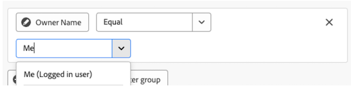

# Referenz zum Berichtsfilter für Canvas-Dashboards

>[!IMPORTANT]
>
>Die Funktion Canvas-Dashboards ist derzeit nur für Benutzer verfügbar, die an der Beta-Phase teilnehmen. Teile der Funktion sind in dieser Phase möglicherweise nicht vollständig oder funktionieren nicht wie vorgesehen. Bitte senden Sie Feedback zu Ihrem Erlebnis, indem Sie die Anweisungen im Abschnitt [Feedback geben](/help/quicksilver/product-announcements/betas/canvas-dashboards-beta/canvas-dashboards-beta-information.md#provide-feedback) im Artikel Beta-Übersicht für Arbeitsflächen-Dashboards befolgen. 
>Wenn Sie Feedback zu einem möglichen Fehler oder einem technischen Problem haben, senden Sie bitte ein Ticket an den Workfront-Support. Weitere Informationen finden Sie unter [Kontaktieren des Kunden-Supports](/help/quicksilver/workfront-basics/tips-tricks-and-troubleshooting/contact-customer-support.md). 
>Beachten Sie, dass diese Beta-Version bei den folgenden Cloud-Anbietern nicht verfügbar ist:
>
>* Eigene Schlüssel für Amazon Web Services mitbringen
>* Azure
>* Google Cloud Platform

In diesem Artikel werden die Felder, Operatoren, Platzhalter und speziellen Regeln beschrieben, die beim Filtern eines Berichts verfügbar sind. Die Schritte zum Erstellen oder Bearbeiten eines Filters finden Sie unter [Filtern eines Berichts in einem Arbeitsflächen-Dashboard](/help/quicksilver/reports-and-dashboards/canvas-dashboards/manage-reports/filter-a-report.md).

## Feldoperatoren nach Feldtyp

+++ Erweitern Sie , um die Liste der Feldoperatoren nach Feldtyp anzuzeigen. 

<table>
    <tr>
        <td><b>Feldtyp</b></td>
        <td><b>Beispiel</b></td>
       <td><b>Operatoren</b></td>
        <td><b>Platzhalter</b></td>
    </tr>
    <tr>
        <td>Objekt-/Referenzname</td>
        <td>Beliebiges natives Namensattribut oder benutzerdefinierte Suche</td>
              <td><ul>
        <li>Equal</li>
        <li>Not Equal</li>
        <li>Enthält</li>
          <li>Enthält nicht</li>
            <li>Ist null</li>
              <li>Ist nicht null</li>
        </ul></td>
        <td>Benutzername:
        <ul>
        <li>Ich (angemeldete Benutzerin bzw. angemeldeter Benutzer)</li>
        </ul>
        Gruppe: Name
        <ul>
          <li>Meine Hauptgruppe (angemeldete Benutzergruppe)</li>
            <li>Meine anderen Gruppen (angemeldete Benutzergruppen)</li>
          </ul>
          Team: name
                  <ul>
          <li>Mein Standard-Team (angemeldetes Benutzer-Team)</li>
            <li>Meine anderen Teams (angemeldete Benutzer-Teams)</li>
          </ul>
        </td>
    </tr>
    <tr>
        <td>Zeichenfolge/Texteingabe </td>
                <td>Projekt: Beschreibung</td>
                      <td><ul>
             <li>Equal</li>
        <li>Not Equal</li>
        <li>Enthält</li>
          <li>Enthält nicht</li>
            <li>Ist null</li>
              <li>Ist nicht null</li>
        </ul></td>
        <td></td>
    </tr>
    <tr>
        <td>Ganze Zahl/Dublette</td>
             <td>Projekt: Geplante Stunden
         Aufgabe: Prozent abgeschlossen</td>
              <td><ul>
        <li>Equal</li>
        <li>Not Equal</li>
        <li>Greater Than</li>
          <li>Greater Than or Equal</li>
          <li>Less Than</li>
          <li>Less Than or Equal</li>
            <li>Ist null</li>
              <li>Ist nicht null</li>
        </ul></td>
        <td></td>
    </tr>
       <tr>
        <td> Datum/Datum/Uhrzeit </td>
                    <td>Projekt: Geplantes Startdatum
         Stunde: Eingabedatum</td>
              <td><ul>
        <li>Equal</li>
        <li>Not Equal</li>
        </ul></td>
        <td>Durch Aktivieren der Option <b>Relatives Datum festlegen</b> können Sie relative Datums-Platzhalter anwenden, um den Bericht dynamischer zu gestalten und basierend auf allgemeinen Datumsbereichen selbst anzupassen. 
         <ul><li>$$TODAY</li>
         <li>$$NOW</li>
         </ul>
        </td>
    </tr>
       <tr>
        <td>Boolesch </td>
                  <td>Projekt: Hat Dokumente
         Aufgabe: Ist kritisch
         : Ist aktiv</td>
        <td><ul>
        <li>Equal</li>
        <li>Not Equal</li>
        </ul></td>
        <td> </td>
    </tr>
   </table>

+++

## Datumsbasierte Platzhalterfiltervariablen

Datumsbasierte Platzhalteroptionen können in Kombination mit einem beliebigen Datumsfilterattribut verwendet werden. Informationen zum Hinzufügen eines datumsbasierten Platzhalters zu einem Bericht finden Sie unter [Verwenden von datumsbasierten Platzhaltern zum Verallgemeinern von Berichten](/help/quicksilver/reports-and-dashboards/reports/reporting-elements/use-date-based-wildcards-generalize-reports.md).

>[!NOTE]
>
>Wenn Sie eine Datums- und Uhrzeitberechnung erstellen, die keinen Zeitanteil enthält oder bei der Datumsplatzhalter $$TODAY oder $$NOW verwendet werden, verwendet das System das Datum in der UTC-Zone (Coordinated Universal Time) und nicht in Ihrer lokalen Zeitzone. Dies kann zu einem unerwarteten Datumsergebnis führen.

Sie können unter den folgenden datumsbasierten Platzhaltern wählen:

<table style="table-layout:auto"> 
 <col> 
 <col> 
 <tbody> 
  <tr valign="top"> 
   <td width="100" role="rowheader"> 
<strong>$$TODAY</strong> 
 </td> 
   <td> 
Es wird empfohlen, datumsabhängige Filter mit diesem Platzhalter zu erstellen, damit der Filter nicht morgen, in der nächsten Woche oder im nächsten Monat erneut erstellt wird.
 
Wenn Sie beispielsweise alle vor dem heutigen Tag fälligen Aufgaben anzeigen möchten, können Sie die folgende Regel in einem Aufgabenfilter verwenden: <em>Geplantes Startdatum kleiner als $$TODAY</em>.
 
$$TODAY ist immer gleich Mitternacht für den aktuellen Tag.
 </td> 
  </tr> 
  <tr valign="top"> 
   <td width="100" role="rowheader"> 
<strong>$$NOW</strong> 
 </td> 
   <td> 
Dieser Platzhalter ähnelt $$TODAY, enthält jedoch das aktuelle Datum und die aktuelle Uhrzeit. $$NOW ist gleich dem aktuellen Datum und der aktuellen Uhrzeit.
 
Wenn Sie beispielsweise alle Stundeneinträge anzeigen möchten, die bis zur aktuellen Uhrzeit bereitgestellt wurden, können Sie hierfür die folgende Regel in einem Stundenfilter verwenden: <em>Geplantes Startdatum kleiner als $$NOW</em>.
 
Hinweis: Dieser Platzhalter wird im Ressourcenplaner nicht unterstützt.
 </td> 
  </tr> 
 </tbody> 
</table>

Um verschiedene Zeiträume und verschiedene Zeitpunkte (zukünftig oder vergangen) anzugeben, können Sie die oben genannten Platzhalter mit folgenden Elementen kombinieren:

| Attribute |   |
|---|---|
| **q** | Kalenderquartal |
| **h** | Stunde |
| **d** | Tag |
| **w** | Woche |
| **m** | Monat |
| **y** | Jahr |

{style="table-layout:auto"}

| **Kennungen** |   |
|---|---|
| **b** | Beginn des Zeitraums (ohne angegebenes Attribut, standardmäßig der Beginn der Woche: Sonntag) |
| **e** | Ende des Zeitraums (ohne angegebenes Attribut, standardmäßig das Ende der Woche: Samstag) |

{style="table-layout:auto"}

| **Operatoren** |   |
|---|---|
| **+** | Wert zum Platzhalterwert hinzufügen |
| **-** | Wert vom Platzhalterwert subtrahieren |

{style="table-layout:auto"}

Beispiel: Der Platzhalter `$$TODAYb+2w` bezieht sich auf „2 Wochen ab Beginn dieser Woche“. Der Platzhalter `$$NOW+2h` bezieht sich auf „in 2 Stunden“.

## Angemeldete Benutzer-Platzhalterfiltervariablen

* Beim Filtern nach dem Attribut `name` zeigen Sie die Option **Ich (angemeldeter Benutzer)** an.

  

* Beim Filtern nach einem `name` für eine Gruppe zeigen Sie die Optionen **Meine Hauptgruppe (angemeldete Benutzergruppe)** und **Meine anderen Gruppen (angemeldete Benutzergruppen)** an, die in einer Filterbedingung verwendet werden können.

  

* Beim Filtern nach einem Team `name`-Attribut sehen Sie die Optionen **Mein Standardteam (angemeldetes Benutzerteam)** und **Meine anderen Teams (angemeldete Benutzerteams)** aus denen Sie in der Filterbedingung auswählen können.

  

## Verweisen auf untergeordnete Objekte

Verfügbare Beziehungen für zusätzliche Spalten, Filteroptionen und Gruppierungsattribute sind im Allgemeinen auf Objekte beschränkt, die höher in der Workfront-Objekthierarchie stehen oder die ansonsten eine einzige Auswahl im Basisobjekt der Entität des Berichts aufweisen. Hiervon gibt es einige Ausnahmen, darunter die folgenden:

* Projekt > Aufgaben
* Dokumentengenehmigung > Dokumentengenehmigungsphasen
* Phasen der Dokumentgenehmigung > Teilnehmer an der Dokumentgenehmigungsphase

Bei Verwendung einer der oben aufgeführten hierarchischen Beziehungen wird in der Tabelle für jeden untergeordneten Datensatz eine Zeile angezeigt, die mit dem übergeordneten Objekt verbunden ist.

## Filtern von Sammlungsbeziehungen in der Vorschau

Eine Sammlung ist ein Feld, das nicht mit einem einzelnen Datensatz, sondern mit einer Gruppe verwandter Datensätze verknüpft ist. Beispielsweise sind die Teilnehmer an den Genehmigungsphasen eines Projekts eine Sammlung. Wenn Sie einen Filter erstellen, können Sie Sammlungen direkt filtern, ohne in den Textmodus zu wechseln.

Um nach einer Sammlung zu filtern, öffnen Sie das Bedienfeld Feld auswählen und wählen Sie dann Sammlungen aus. In diesem Abschnitt werden nur Sammlungsbeziehungen aufgelistet. Beziehungen mit einem Datensatz bleiben unter „Beziehungen“.

Nachdem Sie eine Sammlung ausgewählt haben, können Sie zwei Dinge tun:

* Filtern Sie nach den eigenen Feldern der Sammlung. Beispielsweise können Sie aus den Projekten eines Portfolios nach dem Projektstatus filtern.
* Einer einzelnen Datensatzbeziehung aus der Sammlung folgen. Beispielsweise können Sie über die Projekte eines Portfolios den Projektinhaber erreichen.

Sammlungen unterstützen keine tiefere Navigation. Sie können keine Sammlung öffnen, die in einer anderen Sammlung verschachtelt ist, mehr als einer Beziehung folgen oder die Beziehung auswählen, die zu dem führt, wo Sie begonnen haben.

Der Abschnitt Sammlungen wird nur angezeigt, wenn Sie einen Filter erstellen. Er wird nicht in anderen Feldauswahlen angezeigt, z. B. für Tabellenspalten, Gruppierungen oder Diagrammfelder.

## Persönliche Projekte, Aufgaben und Bot-Benutzer ausschließen

>[!NOTE]
>
>Wenn ein Bericht zu Arbeitsflächen-Dashboards mehr Ergebnisse zurückgibt als erwartet, können im Vergleich zu einem ähnlichen klassischen Bericht standardmäßig persönliche Projekte, persönliche Aufgaben oder Bot-Benutzer einbezogen werden. Fügen Sie eine Filterbedingung hinzu, um sie auszuschließen.

In Projekt- und Aufgabenberichten zu Arbeitsflächen-Dashboards wird der `isPersonal` nicht automatisch angewendet, sodass persönliche Projekte und persönliche Aufgaben standardmäßig in den Ergebnissen enthalten sind. Um sie auszuschließen, fügen Sie eine Filterbedingung wie `isPersonal=false` hinzu.

Gleichermaßen enthalten die Benutzerberichte der Arbeitsflächen-Dashboards standardmäßig alle Benutzer, einschließlich der KI-Mitwirkenden (Bot-Benutzer). Um beide Benutzer auszuschließen, fügen Sie eine Filterbedingung wie `isBot=false` hinzu.

Klassische Projekt- und Aufgabenberichte schließen automatisch persönliche Projekte und persönliche Aufgaben aus, während klassische Benutzerberichte automatisch beide Benutzer ausschließen. Um sie stattdessen in einen klassischen Bericht aufzunehmen, fügen Sie eine Filterbedingung hinzu, z. B. `isPersonal=true` (nur persönliche Elemente) oder `isPersonal_Mod=notnull` (persönliche und nicht persönliche Elemente).
