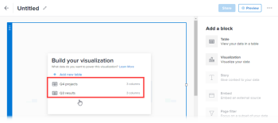

# Hinzufügen oder Bearbeiten eines Visualisierungsblocks auf der Reporting-Arbeitsfläche

Eine Visualisierung kann Ihnen helfen, eine Geschichte mit Ihren Daten zu erzählen, indem wichtige Informationen auf leicht verständliche Weise hervorgehoben werden.

Sie können die folgenden Arten von Visualisierungen zu einem Bericht hinzufügen:

* Balken
* Spalte
* Kreis
* KPI

## Voraussetzungen

Bevor Sie beginnen, müssen Sie sich für die Betaversion der Reporting-Arbeitsfläche registrieren. Weitere Informationen finden Sie unter [Reporting-Arbeitsfläche - Betaversion: Übersicht](/help/quicksilver/product-announcements/betas/canvas-dashboards-beta/reporting-canvas-beta-overview.md).

## Hinzufügen oder Bearbeiten von Visualisierungsblöcken

>[!TIP]
>
>Alle Ihre Änderungen werden automatisch gespeichert, wenn Sie die Blöcke in Ihrem Bericht erstellen und bearbeiten.

1. Klicken Sie auf das **Hauptmenü**-Symbol  in der oberen rechten Ecke von Adobe Workfront und dann auf **Reporting**.
1. Klicken Sie auf **Neuer Bericht** und erstellen Sie dann einen Bericht mit Tabellen, die Daten enthalten, wie in [Erstellen eines Berichts auf der Reporting-Arbeitsfläche](../../../reports-and-dashboards/reporting-canvas/manage-reports/build-report.md) und [Hinzufügen oder Bearbeiten eines Tabellenblocks auf der Reporting-Arbeitsfläche](../../../reports-and-dashboards/reporting-canvas/table-blocks/add-or-edit-report-table.md) beschrieben.

   Oder

   Klicken Sie in einem vorhandenen Bericht mit Tabellen, die Daten enthalten, auf das Symbol **Mehr Menü** Symbol  in der Berichtskopfzeile und wählen Sie dann **Bearbeiten**.

1. Klicken Sie auf der rechten Seite des Bildschirms unter **Block hinzufügen** entweder auf:

   Ziehen Sie das Symbol **Visualisierung** **** direkt an die gewünschte Position auf der Arbeitsfläche.

   Oder

   Doppelklicken Sie auf die **** **Visualisierung**, um oben auf der Arbeitsfläche eine Visualisierung hinzuzufügen.

   Oder

   Wählen Sie das **Visualisieren**-Symbol **** oben in einer vorhandenen Tabelle auf der Arbeitsfläche aus.

   >[!TIP]
   >
   >Sie können die Größe des Blocks nach der Platzierung durch Ziehen an den Eckgriffen ändern.

1. (Bedingt) Wenn der Bericht mehr als eine Tabelle enthält, wählen Sie im angezeigten Feld **Visualisierung erstellen** die Quelltabelle für die Visualisierung aus.

   

   >[!NOTE]
   >
   >Wenn Sie **+ Neue Tabelle hinzufügen auswählen** wird unter dem Visualisierungsblock ein neuer Tabellenblock erstellt. Sie müssen die Tabelle mit Daten füllen, bevor Sie eine Visualisierung dafür hinzufügen können. Weitere Informationen zum Erstellen und Bearbeiten von Tabellen finden Sie unter [ [Hinzufügen oder Bearbeiten eines Tabellenblocks auf der Reporting-Arbeitsfläche](../../../reports-and-dashboards/reporting-canvas/table-blocks/add-or-edit-report-table.md)](../../../reports-and-dashboards/reporting-canvas/table-blocks/add-or-edit-report-table.md)

1. Wählen Sie den Visualisierungstyp aus, den Sie hinzufügen möchten.

   

   Ihre Visualisierung wird angezeigt und stellt die Daten der ausgewählten Tabelle dar.

   >[!TIP]
   >
   >Die Farben der Punkte neben dem Visualisierungstitel und dem Quelltabellentitel stimmen überein. In einem Bericht mit mehreren Tabellen können Sie auf diese Weise Visualisierungen einfach mit den zugehörigen Tabellen abgleichen.

1. Fahren Sie mit der Konfiguration Ihrer Visualisierung fort:

   * **Balkenvisualisierung** Anweisungen finden Sie unter [Konfigurieren einer Balkenvisualisierung auf der Reporting-Arbeitsfläche](../../../reports-and-dashboards/reporting-canvas/visualization-blocks/configure-bar-visualization.md#bar).
   * **Spalte** Visualisierung: Anweisungen finden Sie unter [Konfigurieren einer Spaltenvisualisierung auf der Reporting-Arbeitsfläche](../../../reports-and-dashboards/reporting-canvas/visualization-blocks/configure-column-visualization.md).
   * **Kreis**-Visualisierung: Anweisungen finden Sie unter [Konfigurieren der Kreisvisualisierung auf der Reporting-Arbeitsfläche](../../../reports-and-dashboards/reporting-canvas/visualization-blocks/configure-pie-visualization.md).
   * **KPI**-Visualisierung: Anweisungen finden Sie unter [Konfigurieren einer KPI-Visualisierung auf der Reporting-Arbeitsfläche](../../../reports-and-dashboards/reporting-canvas/visualization-blocks/configure-kpi-visualization.md).
