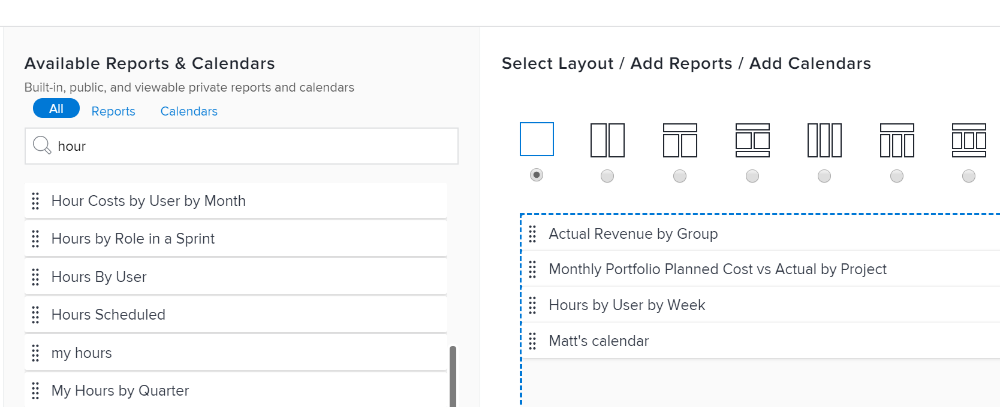

# Dashboard erstellen

<!--Audited: 01/2024-->

Sie können Dashboards erstellen, um schnell auf Informationen in Adobe Workfront zugreifen zu können. Berichte, Kalender und externe Seiten können zu Dashboards hinzugefügt werden, die Sie für eine optimale Zusammenarbeit mit anderen freigeben können.

Weitere Informationen zu Dashboards finden Sie unter [Erste Schritte mit Dashboards](../../../reports-and-dashboards/dashboards/understanding-dashboards/get-started-dashboards.md).

## Zugriffsanforderungen

+++ Erweitern Sie , um die Zugriffsanforderungen für die Funktionalität in diesem Artikel anzuzeigen.

Sie müssen über Folgendes verfügen:

<table style="table-layout:auto">
 <col> 
 </col> 
 <col> 
 </col> 
 <tbody> 
  <tr> 
   <td> 
<strong>Adobe Workfront-Abo</strong>
 </td> 
   <td>Alle</td> 
  </tr> 
  <tr> 
   <td> 
<strong>Adobe Workfront-Lizenz*</strong>
 </td> 
   <td> 
Aktuell: Plan 

   Oder
   
Neu: Standard 
 </td> 
  </tr> 
  <tr> 
   <td><strong>Konfigurationen auf Zugriffsebene</strong> </td> 
   <td> 
Zugriff auf Berichte, Dashboards und Kalender bearbeiten
 </td> 
  </tr> 
  <tr> 
   <td> 
<strong>Objektberechtigungen</strong> 
 </td> 
   <td> 
Sie erhalten Verwaltungsberechtigungen für die erstellten Dashboards
 </td> 
  </tr> 
 </tbody> 
</table>

*Wenden Sie sich an Ihren Workfront-Administrator, um zu erfahren, welchen Plan, welchen Lizenztyp oder welchen Zugriff Sie haben. Weitere Informationen finden Sie unter [Zugriffsanforderungen in der Dokumentation zu Workfront](/help/quicksilver/administration-and-setup/add-users/access-levels-and-object-permissions/access-level-requirements-in-documentation.md).

+++

## Voraussetzungen

Sie müssen eines der folgenden Objekte erstellen, bevor Sie sie zu einem Dashboard hinzufügen können:

* **Berichte**: Informationen zum Erstellen von Berichten finden Sie unter [Benutzerdefinierten Bericht erstellen](../../../reports-and-dashboards/reports/creating-and-managing-reports/create-custom-report.md).

* **Kalender**: Informationen zum Erstellen von Kalendern finden Sie unter [Kalenderberichte - Übersicht](../../../reports-and-dashboards/reports/calendars/calendar-reports-overview.md).

Sie können vorhandene externe Seiten zu einem Dashboard hinzufügen oder eine aus dem neuen Dashboard erstellen. Informationen zum Erstellen externer Seiten finden Sie unter [Einbetten einer externen Webseite in ein Dashboard](../../../reports-and-dashboards/dashboards/creating-and-managing-dashboards/embed-external-web-page-dashboard.md).

## Dashboard erstellen

{{step1-to-dashboards}}

1. Klicks **Neues Dashboard**.\
   Das Dialogfeld Neues Dashboard wird angezeigt.

1. Geben Sie Folgendes an:

   <table style="table-layout:auto">
    <col>
    <col>
    <tbody>
     <tr>
      <td role="rowheader"><strong>Name</strong></td>
      <td>
Dies ist der Name Ihres Dashboards.

Wenn Sie keinen Namen angeben, wird der Name des ersten Berichts im Dashboard standardmäßig zum Namen des Dashboards.
</td>
     </tr>
     <tr>
      <td role="rowheader"><strong>Beschreibung (optional)</strong></td>
      <td>Dies ist eine Beschreibung Ihres Dashboards.</td>
     </tr>
    </tbody>
   </table>

1. Wählen Sie ein Layout aus, indem Sie oben im **Layout auswählen/Berichte hinzufügen/Kalender hinzufügen** Abschnitt. Dies ist das Layout, in dem die Berichte, Kalender oder externen Seiten im Dashboard angezeigt werden.

   Standardmäßig wird das einspaltige Layout verwendet.

   Informationen zum Layout von Berichten in Dashboards finden Sie unter [So werden Berichte in einem Dashboard angezeigt](../../../reports-and-dashboards/dashboards/understanding-dashboards/understand-how-reports-display-dashboard.md).

   <!--
   Consider adding the information from this article above here, at some point, instead of linking to it.)
   -->

1. Suchen Sie nach Berichten, Kalendern oder externen Seiten im **Suche nach Name oder Typ ...** und ziehen Sie sie in den Layout-Bereich, sobald sie in der Liste angezeigt werden.

   >[!NOTE]
   >
   >Bei der Suche nach einem Element gibt die Suche einen der 2.000 zuletzt erstellten Berichte zurück. Berichtsnamen, die Unicode-Zeichen enthalten, werden in den Suchergebnissen nicht zurückgegeben. Es empfiehlt sich, beim Benennen von Objekten in Workfront nicht Unicode-Zeichen einzuschließen, indem Sie Namen eingeben, anstatt Namen aus einer anderen Quelle zu kopieren und einzufügen.

   

1. (Optional) Klicken Sie auf **Externe Seite hinzufügen** , um dem Dashboard eine neue externe Seite hinzuzufügen.

   Weitere Informationen zum Erstellen externer Seiten und zum Einbetten in Dashboards finden Sie unter [Einbetten einer externen Webseite in ein Dashboard](../../../reports-and-dashboards/dashboards/creating-and-managing-dashboards/embed-external-web-page-dashboard.md).

1. Klicken Sie auf **Speichern + schließen**.

   In der oberen rechten Ecke des Dashboards wird ein Zeitstempel angezeigt. Der Zeitstempel enthält Datum, Uhrzeit und Zeitzone, zu der das Dashboard zuletzt aktualisiert wurde.
