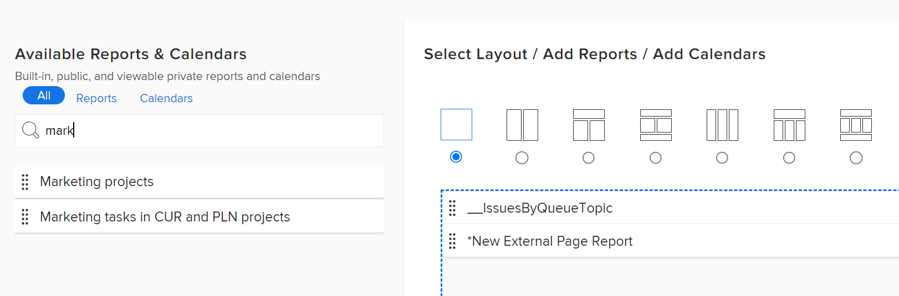

# Dashboard erstellen

Sie können Dashboards erstellen, um schnell auf Informationen in Berichten, Kalendern und externen Seiten zugreifen zu können.

Weitere Informationen zu Dashboards finden Sie unter [Erste Schritte mit Dashboards](../../../reports-and-dashboards/dashboards/understanding-dashboards/get-started-dashboards.md).

## Zugriffsanforderungen

Sie müssen über Folgendes verfügen:

<table style="table-layout:auto">
 <col> 
 </col> 
 <col> 
 </col> 
 <tbody> 
  <tr> 
   <td> 
<strong>Adobe Workfront-Plan*</strong>
 </td> 
   <td>Beliebig</td> 
  </tr> 
  <tr> 
   <td> 
<strong>Adobe Workfront-Lizenz*</strong>
 </td> 
   <td> 
Plan 
 </td> 
  </tr> 
  <tr> 
   <td><strong>Konfigurationen auf Zugriffsebene*</strong> </td> 
   <td> 
Zugriff auf Berichte, Dashboards und Kalender bearbeiten
 
Hinweis: Wenn Sie immer noch keinen Zugriff haben, fragen Sie Ihren Workfront-Administrator, ob er zusätzliche Zugriffsbeschränkungen für Ihre Zugriffsebene festlegt. Informationen dazu, wie ein Workfront-Administrator Ihre Zugriffsstufe ändern kann, finden Sie unter <a href="../../../administration-and-setup/add-users/configure-and-grant-access/create-modify-access-levels.md" class="MCXref xref">Benutzerdefinierte Zugriffsebenen erstellen oder ändern</a>.
 </td> 
  </tr> 
  <tr> 
   <td> 
<strong>Objektberechtigungen</strong> 
 </td> 
   <td> 
Sie erhalten Verwaltungsberechtigungen für das neue Dashboard
 
Informationen zum Anfordern von zusätzlichem Zugriff finden Sie unter <a href="../../../workfront-basics/grant-and-request-access-to-objects/request-access.md" class="MCXref xref">Zugriff auf Objekte anfordern </a>. Weitere Informationen zu Berechtigungen für Dashboards finden Sie unter <a href="../../../workfront-basics/grant-and-request-access-to-objects/permissions-reports-dashboards-calendars.md" class="MCXref xref">Berichte, Dashboards und Kalender freigeben </a>.
 </td> 
  </tr> 
 </tbody> 
</table>

&#42;Wenden Sie sich an Ihren Workfront-Administrator, um zu erfahren, welchen Plan, welchen Lizenztyp oder welchen Zugriff Sie haben.

## Voraussetzungen

Sie müssen eines der folgenden Objekte erstellen, bevor Sie sie zu einem Dashboard hinzufügen können:

* **Berichte**: Informationen zum Erstellen von Berichten finden Sie unter [Benutzerdefinierten Bericht erstellen](../../../reports-and-dashboards/reports/creating-and-managing-reports/create-custom-report.md).

* **Kalender**: Informationen zum Erstellen von Kalendern finden Sie unter [Kalenderberichte - Übersicht](../../../reports-and-dashboards/reports/calendars/calendar-reports-overview.md).

* **Externe Seiten**: Informationen zum Erstellen externer Seiten finden Sie unter [Einbetten einer externen Webseite in ein Dashboard](../../../reports-and-dashboards/dashboards/creating-and-managing-dashboards/embed-external-web-page-dashboard.md).

## Dashboard erstellen

1. Klicken Sie auf das Symbol Hauptmenü . Klicken Sie auf **Dashboards.**
1. Klicken **Neues Dashboard**.\
   Das Dialogfeld Neues Dashboard wird angezeigt.

1. Geben Sie Folgendes an:

   <table style="table-layout:auto">
    <col>
    <col>
    <tbody>
     <tr>
      <td role="rowheader"><strong>Name</strong></td>
      <td>
Dies ist der Name Ihres Dashboards.

Wenn Sie keinen Namen angeben, wird der Name des ersten Berichts im Dashboard standardmäßig zum Namen des Dashboards.
</td>
     </tr>
     <tr>
      <td role="rowheader"><strong>Beschreibung (optional)</strong></td>
      <td>Dies ist eine Beschreibung Ihres Dashboards.</td>
     </tr>
    </tbody>
   </table>

1. Wählen Sie ein Layout aus, indem Sie auf das entsprechende Optionsfeld klicken.

   Standardmäßig wird das einspaltige Layout verwendet.

   Informationen zum Layout von Berichten in Dashboards finden Sie unter [So werden Berichte in einem Dashboard angezeigt](../../../reports-and-dashboards/dashboards/understanding-dashboards/understand-how-reports-display-dashboard.md).

   <!--
   <MadCap:conditionalText data-mc-conditions="QuicksilverOrClassic.Draft mode">
   (NOTE: Consider adding the information from this article here, at some point, instead of linking to it.)
   </MadCap:conditionalText>
   -->

1. Fügen Sie vorhandene Berichte, Kalender oder externe Seiten hinzu, indem Sie in der **Suche nach Name oder Typ ...** und ziehen Sie sie in den Layout-Bereich, sobald sie in der Liste angezeigt werden.

   >[!NOTE]
   >
   >Bei der Suche nach einem Element gibt die Suche einen der 2.000 zuletzt erstellten Berichte zurück. Berichtsnamen, die Unicode-Zeichen enthalten, werden in den Suchergebnissen nicht zurückgegeben. Es empfiehlt sich, beim Benennen von Objekten in Workfront nicht Unicode-Zeichen einzuschließen, indem Sie Namen eingeben, anstatt Namen aus einer anderen Quelle zu kopieren und einzufügen.

   

1. (Optional) Klicken Sie auf **Externe Seite hinzufügen** , um dem Dashboard eine externe Seite hinzuzufügen.\
   Weitere Informationen zum Erstellen externer Seiten und zum Einbetten in Dashboards finden Sie unter [Einbetten einer externen Webseite in ein Dashboard](../../../reports-and-dashboards/dashboards/creating-and-managing-dashboards/embed-external-web-page-dashboard.md).

1. Klicken **Speichern und schließen**.\
   In der rechten oberen Ecke des Dashboards wird ein Zeitstempel angezeigt. Der Zeitstempel enthält Datum, Uhrzeit und Zeitzone, zu der das Dashboard zuletzt aktualisiert wurde.
