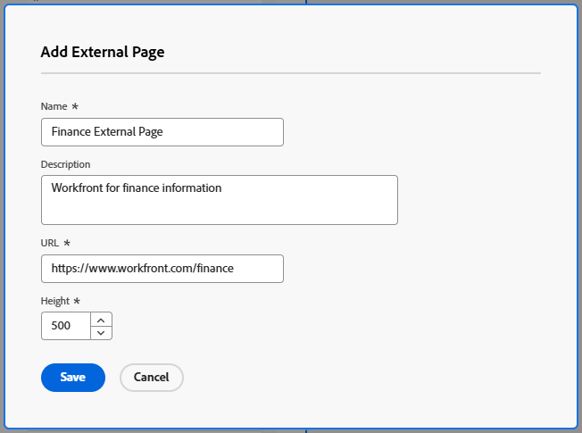

# Einbetten einer externen Web-Seite in ein Dashboard

<!--Audited: 01/2025-->

Sie können eine externe Web-Seite in ein Dashboard einbetten, um Zugriff auf zugehörige Informationen von anderen Systemen oder aus Adobe Workfront zu ermöglichen.

Wenn Ihr Unternehmen beispielsweise über ein Web-basiertes Dokument-Repository, ein Wiki oder ein anderes Content-Management-System verfügt, das Projektinformationen enthält, auf die regelmäßig über eine URL zugegriffen wird, können Sie diese Informationen in Workfront anzeigen, indem Sie eine externe Seite in einem Dashboard erstellen.

>[!IMPORTANT]
>
>* Aus Sicherheitsgründen erlauben einige Websites nicht, Web-Seiten als iframe einzubetten. Wenn die Web-Seite, die Sie in ein Dashboard einbetten möchten, dies nicht zulässt, wird die Seite nicht im Dashboard angezeigt. Sie können jedoch weiterhin auf die externe Seite zugreifen, indem Sie auf den Namen des Dashboards klicken.\
>\
>Um das Einbetten einer Website zu ermöglichen, für die Sie verantwortlich sind, wenden Sie sich an Ihren Webadministrator, um die Einstellung **X-Frame-Options** anzupassen. Weitere Informationen finden Sie unter [X-Frame-Options](https://developer.mozilla.org/en-US/docs/Web/HTTP/Headers/X-Frame-Options).
>
>
>* Dashboard-Seiten werden nicht mehr als eingebettete externe Seiten in Dashboards unterstützt. Vorhandene Dashboards werden zwar nicht automatisch geändert, um diese externen Seiten zu entfernen, aber Änderungen an einem Dashboard, das einen solchen Verweis enthält, können erst gespeichert werden, wenn der Verweis entfernt oder geändert wird.
> Insbesondere werden die folgenden Workfront.com-Subdomains nicht mehr unterstützt:
>
>     * /dashboards&#x200B;
>     * /dashboard/:ID&#x200B;
>     * /portfolio/:ID/content-dashboard__:dashboardID&#x200B;
>     * /program/:ID/content-dashboard__:dashboardID&#x200B;
>     * /project/:ID/content-dashboard__:dashboardID&#x200B;
>     * /task/:ID/content-dashboard__:dashboardID&#x200B;
>     * /template/:ID/content-dashboard__:dashboardID&#x200B;
>     * /templatetask/:ID/content-dashboard__:dashboardID&#x200B;
>     * /resourceManagement/:ID/
>     * content-dashboard__:dashboardID&#x200B;
>     * /team/:ID/content-dashboard__:dashboardID&#x200B;
>     * /iteration/:ID/content-dashboard__:dashboardID&#x200B;
>     * /requests/:ID/content-dashboard__:dashboardID&#x200B;
>     * /group/:ID/content-dashboard__:dashboardID&#x200B;
>     * /billingrecord/:ID/content-dashboard__:dashboardID
>
>Als alternative Lösung sollten Sie einen Listenbericht in Ihr Dashboard aufnehmen, wie unter [Hinzufügen eines Berichts zu einem Dashboard](/help/quicksilver/reports-and-dashboards/dashboards/creating-and-managing-dashboards/add-report-dashboard.md) beschrieben

## Zugriffsanforderungen

+++ Erweitern Sie , um die Zugriffsanforderungen für die -Funktion in diesem Artikel anzuzeigen.

Sie müssen über Folgendes verfügen:

<table style="table-layout:auto"> 
 <col> 
 <col> 
 <tbody> 
  <tr> 
   <td role="rowheader"><strong>Adobe Workfront-Plan</strong></td> 
   <td> 
Beliebig
 </td> 
  </tr> 
  <tr> 
   <td role="rowheader"><strong>Adobe Workfront-Lizenz</strong></td> 
   <td> 
      
Neu:

         <ul>
         <li>
Standard
</li>
         </ul>
      
Aktuell:

         <ul>
         <li>
Plan
</li>
         </ul>
   </td>
  </tr> 
  <tr> 
   <td role="rowheader"><strong>Konfigurationen der Zugriffsebene</strong></td> 
   <td> 
Zugriff auf Berichte, Dashboards und Kalender bearbeiten
 </td> 
  </tr> 
  <tr> 
   <td role="rowheader"><strong>Objektberechtigungen</strong></td> 
   <td> 
Zugriff auf das Dashboard bearbeiten
 </td> 
  </tr> 
 </tbody> 
</table>

Weitere Informationen finden Sie unter [Zugriffsanforderungen in der Dokumentation zu Workfront](/help/quicksilver/administration-and-setup/add-users/access-levels-and-object-permissions/access-level-requirements-in-documentation.md).

+++

## Voraussetzungen

Sie müssen ein Dashboard erstellen, bevor Sie eine externe Seite darin einbetten können.

Informationen zum Erstellen von Dashboards finden Sie unter [Erstellen eines Dashboards](../../../reports-and-dashboards/dashboards/creating-and-managing-dashboards/create-dashboard.md).

## Einbetten einer externen Seite in ein Dashboard

>[!IMPORTANT]
>
>Sie können eine externe Seite aus einem Dashboard entfernen, wenn sie nicht mehr benötigt wird. Sie können eine externe Seite jedoch nicht löschen, nachdem sie in Workfront erstellt wurde. Eine externe Seite kann nur mithilfe der API gelöscht werden. Weitere Informationen finden Sie unter [Entfernen einer externen Seite aus einem Dashboard](../../../reports-and-dashboards/dashboards/creating-and-managing-dashboards/remove-external-page-from-dashboard.md).

1. Suchen Sie die URL der Seite, die in Workfront angezeigt werden soll, und kopieren Sie die URL aus der Adressleiste.

   >[!NOTE]
   >
   >Wenn Sie URLs für Workfront-Objekte freigeben, denken Sie daran, dass einige URLs im Laufe der Zeit ablaufen. Beispielsweise laufen Dokument-URLs ab, nachdem sie geöffnet wurden. Dies ist eine Sicherheitsmaßnahme, die nicht als statische URLs betrachtet wird und nicht freigegeben werden sollte.

{{step1-to-dashboards}}

1. Um ein vorhandenes Dashboard zu bearbeiten, wählen Sie das Dashboard aus, in das Sie die Website-Seite einbetten möchten, klicken Sie dann auf **Dashboard-Aktionen** und klicken Sie dann auf **Bearbeiten**
oder\
   Um ein neues Dashboard zu erstellen, klicken Sie auf **Neues Dashboard**.\
   Weitere Informationen zum Erstellen eines Dashboards finden Sie unter [Dashboard erstellen](../../../reports-and-dashboards/dashboards/creating-and-managing-dashboards/create-dashboard.md).

1. Klicken Sie **Externe Seite hinzufügen** unter dem Bereich **Layout auswählen/Berichte hinzufügen/Kalender**.

   

   Das **„Externe Seite hinzufügen** wird angezeigt.

1. Geben Sie folgende Informationen zur externen Seite an:

   * **Name**: Fügen Sie einen Namen für das Dashboard hinzu.
   * **Beschreibung**: Fügen Sie weitere Informationen über das Dashboard hinzu, um die darin enthaltenen Informationen zu identifizieren. Die Beschreibung wird nach dem Speichern im Dashboard für alle angezeigt, die Zugriff auf sie haben.
   * **URL**: Fügen Sie die zuvor kopierte URL in dieses Feld ein.

     Sie können die folgenden URL-Typen angeben:

      * Eine (verschlüsselte) HTTPS-URL zu einer Web-Seite.\
        Nur HTTPS-Seiten (verschlüsselt) werden mit der URL geladen.\
        

      * Eine Vorlagen-URL, die Sitzungsinformationen für eine bestimmte Website enthält.\
        Beispiel: *https://localhost/?session={!$$SESSION}*
Sie müssen bei der angegebenen Website angemeldet sein, um die externe Seite anzuzeigen.\
        Informationen zum Abrufen einer Sitzungs-ID aus Workfront finden Sie unter [API-Grundlagen](../../../wf-api/general/api-basics.md).\
        Ihr Workfront-Administrator kann Ihre Systemeinstellungen aus Sicherheitsgründen so konfigurieren, dass die Verwendung von Sitzungsinformationen auf Ihren externen Seiten nicht zulässig ist. In diesem Fall wird die externe Seite nicht in das Dashboard geladen.\
        Weitere Informationen zu den Systemsicherheitseinstellungen finden Sie unter [Systemsicherheitseinstellungen konfigurieren](../../../administration-and-setup/manage-workfront/security/configure-security-preferences.md).\
        

     >[!WARNING]
     >
     >Die Verwendung der Sitzungs-ID ist unsicher und wird nicht empfohlen.
     >

   * **Höhe**: Geben Sie eine Zahl größer als 0 ein, um den Platz zu definieren, den die externe Seite im Dashboard belegt. Die Standardhöhe ist 500.

1. Klicken Sie auf **Speichern**.

   Die Seite wird dem Dashboard automatisch hinzugefügt.

   Wenn Sie zusätzliche Dashboards erstellen, können Sie diese externe Seite finden und zu anderen Dashboards hinzufügen. Alle vorhandenen externen Seiten finden Sie in der Liste der verfügbaren Berichte und Kalender beim Erstellen oder Bearbeiten eines Dashboards.

   <!--
    *** This is linked to: Creating Dashboards, and Editing Dashboards.
   -->

## Aktualisieren einer externen Seite in einem Dashboard

So aktualisieren Sie die Informationen für eine externe Seite, die in einem Dashboard verwendet wird:

{{step1-to-dashboards}}

1. Klicken Sie auf den Namen des Dashboards, das Sie aktualisieren möchten, um es zu öffnen, und klicken Sie auf **Dashboard-Aktionen** dann auf **Bearbeiten**.

   Das **Dashboard Details** wird geöffnet.

1. Suchen Sie im Bereich **Layout auswählen/Berichte hinzufügen** des Felds **Dashboard-Details** die externe Seite, die Sie aktualisieren möchten, bewegen Sie den Mauszeiger darüber und klicken Sie auf das Symbol **Bearbeiten**.\
   

1. Aktualisieren Sie im Feld **Externe Seite bearbeiten** die Felder, die Sie ändern möchten, und klicken Sie dann auf **Speichern**.
1. (Optional) Klicken Sie auf das Symbol **Löschen**,  die externe Seite aus dem Dashboard zu entfernen. Weitere Informationen finden Sie unter [Entfernen einer externen Seite aus einem Dashboard](../../../reports-and-dashboards/dashboards/creating-and-managing-dashboards/remove-external-page-from-dashboard.md).
1. Klicken Sie auf **Speichern + schließen**.

## Anzeigen externer Seiten in einem Bericht

Sie können alle externen Seiten in Workfront in einem externen Seitenbericht anzeigen.

{{step1-to-reports}}

1. Klicken Sie **Neuer Bericht** und wählen Sie **Externer Abschnitt**.

   

1. (Optional) Aktualisieren Sie die Registerkarten Ansicht, Filter oder Gruppierungen des Berichts.

   Weitere Informationen finden Sie unter [Erstellen eines benutzerdefinierten Berichts](../../../reports-and-dashboards/reports/creating-and-managing-reports/create-custom-report.md).

1. Klicken Sie auf **Speichern + schließen**.

   Sie können den Namen und die URL, die mit externen Seiten in Ihrem System verknüpft sind, im neuen Bericht anzeigen.

