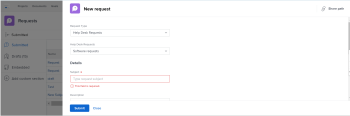
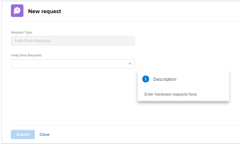

# Einbetten einer Anfrage-Warteschlange in ein Dashboard

<!-- Audited: 1/2025 -->

Sie können eine neue Anfrage-Warteschlange in ein Dashboard einbetten, um Ihren Benutzern direkten Zugriff auf die Anfrage-Warteschlange zu ermöglichen, ohne den Bereich Anfragen aufrufen zu müssen.

Wenn Sie beispielsweise über eine Anfrage-Warteschlange verfügen, die für Ihr gesamtes Unternehmen offen ist, z. B. eine Helpdesk-Warteschlange oder eine PTO-Anfrage-Warteschlange, auf die alle Benutzer regelmäßig zugreifen müssen, kann es praktisch sein, die Anfrage-Warteschlange direkt in eines ihrer Dashboards einzufügen, um einen schnellen und einfachen Zugriff zu ermöglichen. Das Einrichten ähnelt dem Erstellen einer externen Seite in einem Dashboard.

Zuerst müssen Sie eine URL zur Anforderungswarteschlange abrufen. Zweitens können Sie die URL in ein Dashboard einbetten, indem Sie eine externe Seite hinzufügen.

## Zugriffsanforderungen

+++ Erweitern, um die Zugriffsanforderungen für die in diesem Artikel beschriebene Funktionalität anzuzeigen. 

<table style="table-layout:auto"> 
 <col> 
 <col> 
 <tbody> 
  <tr> 
   <td role="rowheader">Adobe Workfront-Paket</td> 
   <td> 
Beliebig
 </td> 
  </tr> 
  <tr> 
   <td role="rowheader">Adobe Workfront-Lizenz</td> 
   <td> 
      
Standard

      
Abo

   </td> 
  </tr> 
  <tr> 
   <td role="rowheader">Konfigurationen der Zugriffsebene</td> 
   <td> 
Zugriff auf Berichte, Dashboards und Kalender bearbeiten
</td> 
  </tr>  
  <tr> 
   <td role="rowheader">Objektberechtigungen</td> 
   <td> 
Verwalten von Berechtigungen für das Dashboard
 </td> 
  </tr> 
 </tbody> 
</table>

Weitere Details zu den Informationen in dieser Tabelle finden Sie unter [Zugriffsanforderungen in der Dokumentation zu Workfront](/help/quicksilver/administration-and-setup/add-users/access-levels-and-object-permissions/access-level-requirements-in-documentation.md).

+++

## Voraussetzungen

Beide der folgenden Schritte müssen erstellt werden, bevor Sie eine Anfrage-Warteschlange in ein Dashboard einbetten können:

* **Das Dashboard**: Informationen zum Erstellen von Dashboards finden Sie unter [Erstellen eines Dashboards](../../../reports-and-dashboards/dashboards/creating-and-managing-dashboards/create-dashboard.md).

* **Die Anforderungswarteschlange**: Informationen zum Erstellen von Anforderungswarteschlangen finden Sie unter [Erstellen einer Anforderungswarteschlange](../../../manage-work/requests/create-and-manage-request-queues/create-request-queue.md)

## URL der Anforderungswarteschlange abrufen {#obtain-the-url-of-the-request-queue}

Sie können die URL einer Anfrage-Warteschlange auf verschiedene Arten abrufen, je nachdem, welchen Teil der Anfrage-Warteschlange Sie den Benutzern bereitstellen möchten, wenn sie über ein Dashboard darauf zugreifen.

* [Erhalten Sie einen Link zu einem bestimmten Warteschlangen-Thema mit der Möglichkeit, den Anfragetyp zu ändern](#obtain-a-link-to-a-specific-queue-topic-with-ability-to-change-the-request-type)

* [Erhalten Sie einen Link zu einer Anfrage-Warteschlange und die Möglichkeit, den Anfragetyp zu ändern](#obtain-a-link-to-a-request-queue-and-ability-to-change-the-request-type)

* [Abrufen eines Links zu einer Anforderungswarteschlange ohne Möglichkeit, den Anforderungstyp zu ändern](#obtain-a-link-to-a-request-queue-with-no-ability-to-change-the-request-type)

### Abrufen eines Links zu einem bestimmten Warteschlangenthema mit der Möglichkeit, den Anforderungstyp zu ändern {#obtain-a-link-to-a-specific-queue-topic-with-ability-to-change-the-request-type}

Wenn Sie einen Link zu einem bestimmten Warteschlangenthema für andere Benutzer freigeben, wird das Anfrageformular mit genau dem Warteschlangenthema geöffnet, das sie zum Senden der Anfrage verwenden müssen. Dies ist hilfreich, wenn Benutzer sich möglicherweise nicht sicher sind, welches Warteschlangenthema beim Protokollieren von Anforderungen für eine bestimmte Anforderungswarteschlange ausgewählt werden soll.

Benutzer können den Anforderungstyp ändern oder ein anderes Thema auswählen, falls erforderlich. Die Navigation im Bereich &quot;Anforderungen&quot; wird ebenfalls angezeigt.

1. Klicken Sie auf **Hauptmenü** > **Anfragen** > **Neue Anfrage**.
1. Wählen Sie weiterhin Themengruppen und Warteschlangenthemen aus, bis Sie die Warteschlange erreichen, die Sie im Dashboard freigeben möchten, falls Sie eine bestimmte Warteschlange freigeben möchten. Informationen zum Senden von Anfragen finden Sie unter [Erstellen und Senden von Adobe Workfront-Anfragen](../../../manage-work/requests/create-requests/create-submit-requests.md).

   >[!TIP]
   >
   >Die Auswahl von Themengruppen und Warteschlangenthemen ist optional.

1. Klicken Sie **Freigabepfad** in der oberen rechten Ecke des Bereichs Neue Anfrage .

   Dadurch wird der Link in die Anfrage-Warteschlange oder das Warteschlangen-Thema so kopiert, wie Sie es auf dem Bildschirm anzeigen. Benutzer können den Anfragetyp oder eine beliebige Themengruppe und Warteschlangenthemen aktualisieren, die verfügbar sind.

   

### Anforderungswarteschlange und Möglichkeit zum Ändern des Anforderungstyps verknüpfen {#obtain-a-link-to-a-request-queue-and-ability-to-change-the-request-type}

Wenn Sie einen Link für einen Anfragetyp freigeben, wird der Anfragetyp für den Benutzer ausgewählt. Dies ist hilfreich, wenn Benutzende aus mehreren Themengruppen oder Warteschlangenthemen für denselben Anfragetyp auswählen müssen. Benutzer können den Anfragetyp ändern und einen anderen auswählen. Die Navigation im Bereich Anfragen wird ebenfalls angezeigt.

1. Zu einem Projekt gehen, das als Anfrage-Warteschlange bezeichnet wird.

   Informationen zum Erstellen einer Anforderungswarteschlange aus einem Projekt finden Sie unter [Anforderungswarteschlange erstellen](../../../manage-work/requests/create-and-manage-request-queues/create-request-queue.md).

1. Navigieren Sie zu **Warteschlangendetails**.
1. Kopieren Sie den Code, den Sie im Feld **URL für den direkten Zugriff** finden.

   Der Code sollte etwa wie folgt aussehen:

   `https://<yourdomain>.my.workfront.com/requests/new?activeTab=tab-new-helpRequest&projectID=50062d6f000849c95ab3513c0e84a51e&path=`

   Dies ist der Link zur Anfrage-Warteschlange, die mit dem ausgewählten Projekt verknüpft ist. Der Anfragetyp ist vorausgewählt.

   Benutzende können eine beliebige Themengruppe oder ein Warteschlangen-Thema auswählen oder einen anderen Anfragetyp auswählen.

   

### Abrufen eines Links zu einer Anfrage-Warteschlange ohne Möglichkeit, den Anfragetyp zu ändern {#obtain-a-link-to-a-request-queue-with-no-ability-to-change-the-request-type}

Wenn Sie einen Link für einen vorab ausgewählten Anfragetyp freigeben, ist der Anfragetyp für den Benutzer ausgewählt und kann nicht geändert werden (er ist abgeblendet). Benutzer können die Themengruppen oder Warteschlangenthemen auswählen, die sie benötigen. Dies ist hilfreich, wenn Sie nicht möchten, dass Benutzer andere Anfragetypen anzeigen und auswählen. Die Navigation im Bereich Anfragen wird nicht angezeigt.

1. Zu einem Projekt gehen, das als Anfrage-Warteschlange bezeichnet wird.

   Informationen zum Erstellen einer Anfrage-Warteschlange aus einem Projekt finden Sie unter [Erstellen einer Anfrage-](../../../manage-work/requests/create-and-manage-request-queues/create-request-queue.md).

1. Navigieren Sie zu **Warteschlangendetails**.
1. Kopieren Sie den Code, den Sie im Feld **Eingebetteter Code** finden.

   Der Code sollte etwa wie folgt aussehen:

   `<iframe src="https://<yourdomain>my.workfront.com/requests/newRequestEmbedded?projectID=612518c7000404462d3bc9a0bc09fa71" frameborder="0" width="500" height="600"></iframe>`

1. Bearbeiten Sie den Code, um nur die folgenden Informationen beizubehalten:

   `https://<yourdomain>.my.workfront.com/requests/newRequestEmbedded?projectID=612518c7000404462d3bc9a0bc09fa71`

   >[!TIP]
   >
   >Sie können beim Einbetten des Codes in eine andere Anwendung als Workfront ein `<samp>iframe </samp>`-Tag hinzufügen.

   Dies ist der Link zur Anforderungswarteschlange, die dem ausgewählten Projekt zugeordnet ist. Der Anforderungstyp ist vorab ausgewählt und kann nicht geändert werden.

   Benutzer können eine beliebige Themengruppe oder ein beliebiges Warteschlangenthema für den ausgewählten Anfragetyp auswählen. Benutzende können keinen anderen Anfragetyp auswählen.

   

## Einbetten einer Anfrage-Warteschlange in ein Dashboard

Sie können einen Link zur Anforderungswarteschlange oder zu einem Warteschlangenthema, das unter einer Anforderungswarteschlange verschachtelt ist, in ein Dashboard einbetten, um Benutzern direkten Zugriff auf die Eingabe von Anforderungen zu ermöglichen.

1. Rufen Sie eine Anforderungswarteschlangen-URL mit einer der im Abschnitt [URL der Anforderungswarteschlange abrufen](#obtain-the-url-of-the-request-queue) dieses Artikels beschriebenen Methoden ab.

1. Klicken Sie auf das **Hauptmenü** > **Dashboards** > **Neues Dashboard**.

1. Geben Sie einen **Namen** für das Dashboard ein. Dies ist ein Pflichtfeld.

1. Klicken Sie **Externe Seite hinzufügen**.

   

1. Bearbeiten **im Feld** Externe Seite hinzufügen“ die folgenden Felder:

   * **Name**: Geben Sie den Namen der Anfrage-Warteschlange ein, wie er im Dashboard angezeigt werden soll. Dies ist ein Pflichtfeld.

   * **Beschreibung**: Geben Sie eine Beschreibung ein, über die diese externe Seite angezeigt wird. Dies ist kein Pflichtfeld und nur für Berichtszwecke wichtig. Er wird nicht im Dashboard angezeigt.

   * **URL**: Fügen Sie die URL ein, die Sie mit einer der in Schritt 1 beschriebenen Methoden erhalten haben.

   * **Höhe**: Geben Sie die Höhe der externen Seite ein. Dadurch wird festgelegt, wie viel Platz die externe Seite, die die Anfrage-Warteschlange enthält, im Dashboard belegt. Dies ist ein Pflichtfeld und der Standardwert ist 500.

1. Klicken Sie auf **Speichern**.

1. Klicken Sie auf **Speichern + schließen**.

   Die Anforderungswarteschlange wird im Dashboard als separate Dashboard-Komponente angezeigt.

1. (Optional) Klicken Sie auf **Dashboard-Aktionen** und anschließend auf **Bearbeiten**, um dem gleichen Dashboard Berichte, Kalender oder zusätzliche externe Seiten hinzuzufügen.

   Informationen zum Hinzufügen von Komponenten zu einem Dashboard finden Sie unter [Erstellen eines Dashboards](../../../reports-and-dashboards/dashboards/creating-and-managing-dashboards/create-dashboard.md).

<!--
<ol data-mc-conditions="QuicksilverOrClassic.Draft mode">
<li value="1"> 
Click the <strong>Main Menu</strong> > Requests >&nbsp;<strong>New Request</strong>. 
 </li>
<li class="preview" value="2" data-mc-conditions="QuicksilverOrClassic.Quicksilver"> 
Continue entering the request.&nbsp;For information about submitting requests, see <a href="../../../manage-work/requests/create-requests/create-submit-requests.md" class="MCXref xref">Create and submit Adobe Workfront requests</a>. 
 </li>
<li value="3"> 
Select the <strong>Request Type</strong> for the queue you would like added to the dashboard.
 </li>
<li value="4"> 
(Optional) Select a Queue Topic and a Topic Group. Depending on how the project manager set up the request queue, the names of these fields are different in each Workfront instance.
 </li>
<li class="preview" value="5" data-mc-conditions="QuicksilverOrClassic.Quicksilver"> 
Click <strong>Share path</strong> to obtain a shared link from the request queue you want to embed on a dashboard.
 
For information about sharing a request queue, see <a href="../../../manage-work/requests/create-requests/share-link-to-request-queue.md" class="MCXref xref">Share a link to a request queue</a>
 </li>
<li value="6"> 
For example, enter a URL similar to one of the following: 
 </li>
</ol>
-->
