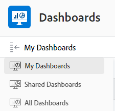

# Erste Schritte mit Dashboards

<!-- Audited: 1/2024 -->

Ein Dashboard ermöglicht einen schnellen Zugriff auf Informationen, die aus mehreren Berichten stammen. Zunächst können Sie Informationen in Berichten sammeln und dann mehrere Berichte in Dashboards platzieren, um den Zugriff auf diese Informationen zu vereinfachen.

## Zugriffsanforderungen

+++ Erweitern Sie , um die Zugriffsanforderungen für die Funktionalität in diesem Artikel anzuzeigen.

Sie müssen über Folgendes verfügen:

<table style="table-layout:auto">
 <col> 
 </col> 
 <col> 
 </col> 
 <tbody> 
  <tr> 
   <td> 
<strong>Adobe Workfront-Abo</strong>
 </td> 
   <td>Alle</td> 
  </tr> 
  <tr> 
   <td> 
<strong>Adobe Workfront-Lizenz</strong>
 </td> 
   <td> 
Neu: Mitarbeiter oder höher

Oder

Aktuell: Überprüfen oder höher
 </td> 
  </tr> 
  <tr> 
   <td><strong>Zugriffsstufe</strong> </td> 
   <td> 
Zugriff auf Berichte, Dashboards und Kalender anzeigen oder höher
 </td> 
  </tr> 
  <tr> 
   <td> 
<strong>Objektberechtigungen</strong> 
 </td> 
   <td> 
Berechtigungen für das Dashboard anzeigen
  </td> 
  </tr> 
 </tbody> 
</table>

Weitere Informationen zu den Informationen in dieser Tabelle finden Sie unter [Zugriffsanforderungen in der Dokumentation zu Workfront](/help/quicksilver/administration-and-setup/add-users/access-levels-and-object-permissions/access-level-requirements-in-documentation.md).

+++

## Objekte, die Sie einem Dashboard hinzufügen können

Sie können ein Dashboard mit den folgenden Elementen in Adobe Workfront füllen:

* Berichte\
  Weitere Informationen zum Erstellen von Berichten finden Sie unter [Benutzerdefinierten Bericht erstellen](../../../reports-and-dashboards/reports/creating-and-managing-reports/create-custom-report.md).

* Kalender\
  Weitere Informationen zum Erstellen von Kalendern finden Sie unter [Kalenderberichte - Übersicht](../../../reports-and-dashboards/reports/calendars/calendar-reports-overview.md).

* Externe Seiten\
  Weitere Informationen zum Erstellen externer Seiten finden Sie unter [Einbetten einer externen Webseite in ein Dashboard](../../../reports-and-dashboards/dashboards/creating-and-managing-dashboards/embed-external-web-page-dashboard.md).

Weitere Informationen zum Erstellen eines Dashboards finden Sie unter [Dashboard erstellen](../../../reports-and-dashboards/dashboards/creating-and-managing-dashboards/create-dashboard.md).

## Dashboards freigeben

Sie können ein Dashboard wie folgt für Benutzer freigeben:

* Einzelne Freigabe.\
  Weitere Informationen zum Freigeben von Dashboards finden Sie unter [Berichte, Dashboards und Kalender freigeben](../../../workfront-basics/grant-and-request-access-to-objects/permissions-reports-dashboards-calendars.md) und [Dashboard freigeben](../../../reports-and-dashboards/dashboards/creating-and-managing-dashboards/share-dashboard.md).

* Fügen Sie jedem Bereich oder Objekt in Workfront mit einem benutzerdefinierten Bereich ein Dashboard hinzu.\
  Weitere Informationen zum Erstellen benutzerdefinierter Abschnitte finden Sie unter [Linke Navigation in Adobe Workfront](../../../workfront-basics/the-new-workfront-experience/simplified-left-navigation.md).

* Platzieren Sie die Dashboards in Layout-Vorlagen, die Sie für Benutzer freigeben können.\
  Weitere Informationen zum Freigeben von Dashboards über Layoutvorlagen finden Sie unter [Anpassen des linken Bedienfelds mithilfe einer Layoutvorlage](../../../administration-and-setup/customize-workfront/use-layout-templates/customize-left-panel.md).

* Drucken Sie eine Kopie davon, um sie für Benutzer freizugeben.\
  Weitere Informationen zum Drucken von Dashboards finden Sie unter [Drucken eines Dashboards](../../../reports-and-dashboards/dashboards/creating-and-managing-dashboards/print-dashboard.md).

* Exportieren Sie sie als PDF-Datei, damit Sie sie per E-Mail an Benutzer senden können.\
  Weitere Informationen zum Exportieren eines Dashboards in eine PDF-Datei finden Sie unter [Dashboard exportieren](../../../reports-and-dashboards/dashboards/creating-and-managing-dashboards/export-dashboard.md).

Wenn Sie ein Dashboard für Benutzer freigeben, werden alle Berichte, Kalender und externen Seiten, die sich im Dashboard befinden, standardmäßig auch für dieselben Benutzer freigegeben.

>[!IMPORTANT]
>
>Wenn ein Benutzer gelöscht wird, können die von ihm erstellten Dashboards nicht mehr aufgerufen werden. Weitere Informationen finden Sie unter [Benutzer löschen](../../../administration-and-setup/add-users/create-and-manage-users/delete-a-user.md).

## Anzeigen von Dashboards

Sie können ein Dashboard wie folgt anzeigen:

* Greifen Sie auf den benutzerdefinierten Abschnitt zu, in dem das Dashboard platziert wird.\
  Weitere Informationen zum Platzieren von Dashboards in benutzerdefinierten Abschnitten finden Sie unter [Linke Navigation in Adobe Workfront](../../../workfront-basics/the-new-workfront-experience/simplified-left-navigation.md).

* Suchen Sie nach dem Dashboard und greifen Sie manuell auf es zu.

## Zugriff auf ein Dashboard

1. Klicken Sie auf **[!UICONTROL Hauptmenü]** icon  in der oberen rechten Ecke von Adobe Workfront oder (falls verfügbar) klicken Sie auf das **[!UICONTROL Hauptmenü]** icon  in der oberen linken Ecke auf **Dashboards**.
1. Bewegen Sie den Mauszeiger über die linke Seitenleiste und wählen Sie eine der folgenden Optionen aus:

   * **Meine Dashboards**: Hier werden die von Ihnen erstellten Dashboards aufgelistet.

     >[!TIP]
     >
     >Wenn Sie auf Ihrer Zugriffsebene keinen Zugriff auf Berichte, Dashboards und Kalender bearbeiten haben, können Sie keine Dashboards erstellen. In diesem Fall ist die Liste Meine Dashboards leer.

   * **Freigegebene Dashboards**: Dashboards, die von anderen Benutzern erstellt und für Sie freigegeben werden, sind hier aufgeführt.
   * **Alle Dashboards**: Hier werden sowohl Ihre Dashboards als auch Dashboards aufgelistet, die andere Benutzer für Sie freigegeben haben.

   

1. Klicken Sie auf den Namen eines Dashboards, um es anzuzeigen.\
   Das Dashboard zeigt die Informationen an, die in den Berichten, Kalendern oder externen Seiten enthalten sind, auf denen die Daten gespeichert sind.
1. (Optional und bedingt) Klicken Sie auf die **Neu laden** rechts oben im Dashboard angezeigt, um die Informationen im Dashboard zu aktualisieren.\
   Die Informationen im Dashboard werden beim ersten Zugriff in Echtzeit synchronisiert. Wenn Sie das Dashboard bereits seit einiger Zeit im Browser angezeigt haben, sind die Informationen in den Berichten im Dashboard möglicherweise veraltet. Das Datum und die Uhrzeit der letzten Aktualisierung des Dashboards werden links neben diesem Symbol angezeigt.\
   

## Dashboards löschen

Wenn Sie ein Dashboard aus Workfront entfernen möchten, können Sie es löschen.

Weitere Informationen finden Sie unter [Dashboard löschen](../../../reports-and-dashboards/dashboards/creating-and-managing-dashboards/delete-dashboard.md).
