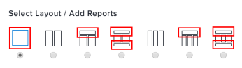

# Grundlegendes zur Anzeige von Berichten in einem Dashboard

<!-- Audited: 1/2025 -->

Sie können verwalten, wie zu Dashboards hinzugefügte Berichte angezeigt werden. Beim Erstellen oder Bearbeiten eines Dashboards können Sie eine von sieben Layout-Optionen auswählen, die die Bereiche angeben, in denen Berichte im Dashboard platziert werden können. Beachten Sie die Auswahl des Dashboard-Layouts sorgfältig, da sich zu viele Spalten oder bestimmte Bedienfelder wie der KI-Assistent auf den verfügbaren Anzeigebereich auswirken und die Anzeige Ihres Dashboards erschweren können.

Informationen zum Bearbeiten des Layouts von Berichten in einem Dashboard finden Sie unter [Erstellen eines Dashboards](../../../reports-and-dashboards/dashboards/creating-and-managing-dashboards/create-dashboard.md).

## Standardmäßige Berichtsspalten in Dashboard-Layout-Bereichen

Bestimmte Layout-Optionen verfügen über Berichtplatzierungsbereiche, die die Anzahl der standardmäßig angezeigten Berichtsspalten begrenzen. Sie können manuell auswählen, welche Berichtsspalten in diesen Bereichen eines Dashboards angezeigt werden sollen, wenn Sie einen Bericht erstellen oder bearbeiten, indem Sie auf [!UICONTROL **Erweiterte Optionen**] in [!UICONTROL **Spalteneinstellungen**] klicken. Wenn Sie alle Spalten des Berichts in einem Dashboard anzeigen möchten, stellen Sie sicher, dass Sie dies für jede Spalte des Berichts angeben oder den Bericht in einem Bereich platzieren, der standardmäßig alle Berichtsspalten anzeigt.

Weitere Informationen dazu, welche Spalten eines Berichts in einem Dashboard angezeigt werden sollen, finden Sie unter [Erstellen eines benutzerdefinierten Berichts](../../../reports-and-dashboards/reports/creating-and-managing-reports/create-custom-report.md).

### Bereiche, die standardmäßig alle Spalten eines Berichts anzeigen

Wenn der Bericht für einen Bereich des Dashboards ausgewählt wird, der die gesamte Breite des Dashboards einnimmt, werden standardmäßig alle Spalten des Berichts im Dashboard angezeigt.\

### Bereiche, die standardmäßig nur die erste Spalte eines Berichts anzeigen

Wenn der Bericht für einen Bereich des Dashboards ausgewählt wird, der weniger als die gesamte Breite des Dashboards einnimmt, wird standardmäßig nur die erste Spalte des Berichts im Dashboard angezeigt.\

