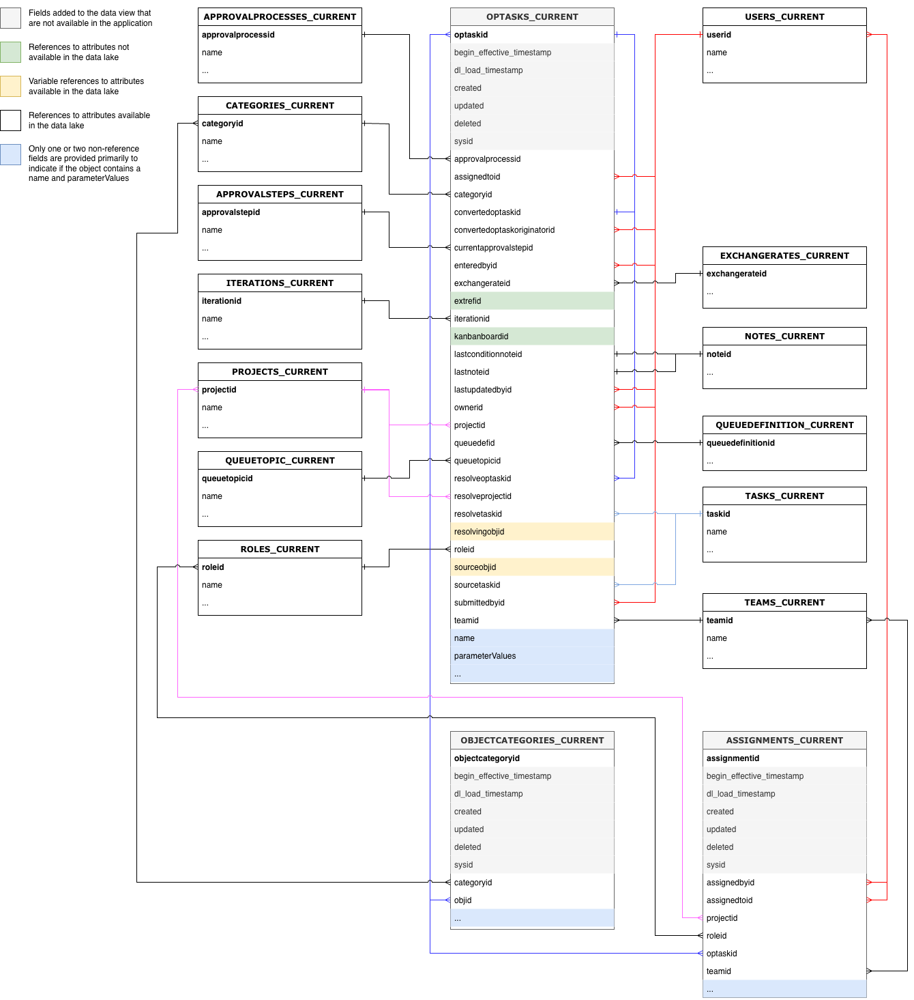

# Datenwörterbuch für Workfront Data Connect

Diese Seite enthält Informationen zur Struktur und zum Inhalt der Daten in Workfront Data Connect.

>[!NOTE]
>
>Die Daten in Data Connect werden alle 4 Stunden aktualisiert, sodass die letzten Änderungen möglicherweise nicht sofort angezeigt werden.

## Typen anzeigen

Es gibt eine Reihe von Ansichtstypen, die Sie in Data Connect verwenden können, um Ihre Workfront-Daten auf eine Weise anzuzeigen, die den meisten insight bietet.

* **Aktuelle Ansicht**

  Die aktuelle Ansicht spiegelt Daten ähnlich wie in Workfront wider, jedes Objekt und seinen aktuellen Status. Sie kann jedoch mit einer viel geringeren Latenz als innerhalb von Workfront navigiert werden.

* **Ereignisansicht**

  Die Ereignisansicht verfolgt jede Änderung in Workfront: d. h. jedes Mal, wenn ein Objekt den Status ändert, wird ein Datensatz erstellt, der anzeigt, wann die Änderung stattgefunden hat, wer die Änderung vorgenommen hat und was geändert wurde. Daher ist diese Ansicht für Point-in-Time-Vergleiche nützlich. Diese Ansicht enthält nur Datensätze aus den letzten drei Jahren.

* **Tägliche Verlaufsansicht**

  Die tägliche Verlaufsansicht bietet eine gekürzte Version der Ereignisansicht, da sie den Status jedes Objekts auf täglicher Basis anzeigt und nicht den Zeitpunkt, zu dem jedes einzelne Ereignis aufgetreten ist. Daher ist diese Ansicht für die Trendanalyse nützlich.

<!-- Custom view -->

## Entitätsbeziehungsdiagramme

Objekte in Workfront (und daher im Data Connect-Data Lake) werden nicht nur durch ihre individuellen Werte definiert, sondern auch durch ihre Beziehungen zu anderen Objekten.

Die folgenden Entitätsbeziehungsdiagramme (Entity Relationship Diagrams, ERDs) bieten eine allgemeine Zuordnung von Objektbeziehungen in Data Connect für zentrale Workfront-Objekte.

>[!IMPORTANT]
>
>Die Diagramme sind um einzelne Objekte zentriert und stellen kein vollständiges Entitätsbeziehungsdiagramm für die gesamte Workfront-Anwendung dar.  
>Diese Diagramme sollen Beispiele dafür liefern, wie die Beziehungen verwendet werden können, um Daten mit benachbarten Objekten zu verbinden.

### Beispiel für Entitätsbeziehungsdiagramme

+++ Erweitern Sie , um die Beispieldiagramme anzuzeigen

>[!TIP]
>
>Um ein Diagramm detaillierter anzuzeigen, klicken Sie mit der rechten Maustaste auf das Bild und wählen Sie **Bild in neuer Registerkarte öffnen**.

### Arbeitsaufträge

### Dokumente und Dokumentengenehmigungen

### Stunden und Arbeitszeittabellen

### Probleme

### Projekte

### Aufgaben

### Benutzende

+++

## Datentypen

Es gibt eine Reihe von Datumsobjekten, die Informationen darüber liefern, wann bestimmte Ereignisse auftreten.

* `DL_LOAD_TIMESTAMP`: Dieses Datum wird nach Abschluss einer erfolgreichen Datenaktualisierung aktualisiert und enthält den Zeitstempel, an dem der Aktualisierungsauftrag begann, der die neueste Version eines Datensatzes bereitgestellt hat.
* `CALENDAR_DATE`: Dieses Datum ist nur in der Ansicht Täglicher Verlauf vorhanden. Die tägliche Verlaufsansicht bietet einen Datensatz darüber, wie die Daten um 11:59 UTC für jedes in `CALENDAR_DATE` angegebene Datum aussahen.
* `BEGIN_EFFECTIVE_TIMESTAMP`: Dieses Datum ist sowohl in der Ereignis- als auch in der Tagesverlaufsansicht vorhanden und stellt den Zeitpunkt dar, zu dem ein Datensatz zum aktuellen Wert in der Anwendung wird.
* `END_EFFECTIVE_TIMESTAMP`: Dieses Datum ist sowohl in der Ereignis- als auch in der Tagesverlaufsansicht vorhanden und zeichnet genau auf, wann ein Datensatz _von_ den Wert in der aktuellen Zeile auf einen Wert in einer anderen Zeile geändert hat. Um zwischen Abfragen von `BEGIN_EFFECTIVE_TIMESTAMP` und `END_EFFECTIVE_TIMESTAMP` zu ermöglichen, ist dieser Wert nie null, auch wenn kein neuer Wert vorhanden ist. Wenn ein Datensatz weiterhin gültig ist (d. h., wenn sich der Wert nicht geändert hat), haben `END_EFFECTIVE_TIMESTAMP` den Wert 2300-01-01.

## Terminologietabelle und Beschreibungen zu Workfront

In der folgenden Tabelle werden die Objektnamen in Workfront (sowie deren Namen in der Benutzeroberfläche und API) mit den entsprechenden Namen in Data Connect korreliert. Außerdem enthält diese Tabelle Referenzfelder für jedes Objekt zu anderen Workfront-Objekten.

>[!NOTE]
>
>Neue Felder können den Objektansichten ohne vorherige Ankündigung hinzugefügt werden, um die sich verändernden Datenanforderungen des Workfront-Programms zu unterstützen. Wir raten zur Verwendung von „SELECT“-Abfragen, bei denen der nachgelagerte Datenempfänger nicht darauf vorbereitet ist, zusätzliche Spalten zu verarbeiten, wenn sie hinzugefügt werden. 
>Wenn ein Umbenennen oder Entfernen einer Spalte erforderlich ist, werden wir diese Änderungen im Voraus bekannt geben.

### Zugriffsebene

<table>
    <thead>
        <tr>
            <th>Workfront-Entitätsname</th>
            <th>Schnittstellenverweise</th>
            <th>API-Referenz</th>
            <th>API-Kennzeichnung</th>
            <th>Data Lake-Ansichten</th>
        </tr>
      </thead>
      <tbody>
        <tr>
            <td>Zugriffsebene</td>
            <td>Zugriffsebene</td>
            <td>GENEHMIGEN</td>
            <td>Zugriffsebene</td>
            <td>ACCESSLEVELS_CURRENT ACCESSLEVELS_DAILY_HISTORY ACCESSLEVELS_EVENT</td>
        </tr>
      </tbody>
</table>
<table>
    <thead>
        <tr>
            <th>Primärer/Fremdschlüssel</th>
            <th>Typ</th>
            <th>Verwandte Tabelle</th>
            <th>Verwandtes Feld</th>
        </tr>
    </thead>
    <tbody>
        <tr>
             <td>ACCESSLEVELID</td>
             <td>PK</td>
             <td>–</td>
             <td>–</td>
        </tr>
        <tr>
             <td>APPGLOBALID</td>
             <td>–</td>
             <td colspan="2">Keine Beziehung; wird für interne Anwendungszwecke verwendet</td>
        </tr>
        <tr>
             <td>LASTUPDATEDBYID</td>
             <td>FK</td>
             <td>USERS_CURRENT</td>
             <td>BENUTZER-ID</td>
        </tr>
        <tr>
             <td>LEGACYACCESSLEVELID</td>
             <td>–</td>
             <td colspan="2">Keine Beziehung; wird für interne Anwendungszwecke verwendet</td>
        </tr>
        <tr>
             <td>OBJID</td>
             <td>FK</td>
             <td>Variable, basierend auf OBJCODE</td>
             <td>Der Primärschlüssel/die ID des im Feld OBJCODE identifizierten Objekts</td>
        </tr>
        <tr>
             <td>SYSID</td>
             <td>–</td>
             <td colspan="2">Keine Beziehung; wird für interne Anwendungszwecke verwendet</td>
        </tr>
    </tbody>
</table>

### Zugriffsregel

<table>
    <thead>
        <tr>
            <th>Workfront-Entitätsname</th>
            <th>Schnittstellenverweise</th>
            <th>API-Referenz</th>
            <th>API-Kennzeichnung</th>
            <th>Data Lake-Ansichten</th>
        </tr>
      </thead>
      <tbody>
        <tr>
            <td>Zugriffsregel</td>
            <td>Freigeben</td>
            <td>VERSIERT</td>
            <td>Freigeben</td>
            <td>ACCESSRULES_CURRENT ACCESSRULES_DAILY_HISTORY ACCESSRULES_EVENT</td>
        </tr>
      </tbody>
</table>
<table>
    <thead>
        <tr>
            <th>Primärer/Fremdschlüssel</th>
            <th>Typ</th>
            <th>Verwandte Tabelle</th>
            <th>Verwandtes Feld</th>
        </tr>
    </thead>
    <tbody>
        <tr>
             <td>ACCESSORID</td>
             <td>FK</td>
             <td>Variable, basierend auf ACCESSOROBJCODE</td>
             <td>Der Primärschlüssel/die ID des Objekts, das im ACCESSOROBJCODE-Feld identifiziert wird</td>
        </tr>
        <tr>
             <td>ACCESSRULEID</td>
             <td>PK</td>
             <td>–</td>
             <td>–</td>
        </tr>
        <tr>
             <td>URSPRÜNGLICH</td>
             <td>PK</td>
             <td>Variable, basierend auf ANCESTOROBJCODE</td>
             <td>Der Primärschlüssel/die ID des im Feld ANCESTOROBJCODE identifizierten Objekts</td>
        </tr>
        <tr>
             <td>LASTUPDATEDBYID</td>
             <td>FK</td>
             <td>USERS_CURRENT</td>
             <td>BENUTZER-ID</td>
        </tr>
        <tr>
             <td>SECURITYOBJID</td>
             <td>FK</td>
             <td>Variable, basierend auf SECURITYBOJCODE</td>
             <td>Der Primärschlüssel/die ID des im Feld SECURITYOBJCODE identifizierten Objekts</td>
        </tr>
        <tr>
             <td>SYSID</td>
             <td>–</td>
             <td colspan="2">Keine Beziehung; wird für interne Anwendungszwecke verwendet</td>
        </tr>
    </tbody>
</table>

### Genehmigungspfad

<table>
    <thead>
        <tr>
            <th>Workfront-Entitätsname</th>
            <th>Schnittstellenverweise</th>
            <th>API-Referenz</th>
            <th>API-Kennzeichnung</th>
            <th>Data Lake-Ansichten</th>
        </tr>
      </thead>
      <tbody>
        <tr>
            <td>Genehmigungspfad</td>
            <td>Genehmigungspfad</td>
            <td>ARVPTH</td>
            <td>Genehmigung</td>
            <td>APPROVALPATHS_CURRENT APPROVALPATHS_DAILY_HISTORY APPROVALPATHS_EVENT</td>
        </tr>
      </tbody>
</table>
<table>
    <thead>
        <tr>
            <th>Primärer/Fremdschlüssel</th>
            <th>Typ</th>
            <th>Verwandte Tabelle</th>
            <th>Verwandtes Feld</th>
        </tr>
    </thead>
    <tbody>
        <tr>
             <td>APPROVALPATHID</td>
             <td>PK</td>
             <td>–</td>
             <td>–</td>
        </tr>
        <tr>
             <td>APPROVALPROCESSID</td>
             <td>FK</td>
             <td>APPROVALPROCESSES_CURRENT</td>
             <td>APPROVALPROCESSID</td>
        </tr>
        <tr>
             <td>ENTEREDBYID</td>
             <td>FK</td>
             <td>USERS_CURRENT</td>
             <td>BENUTZER-ID</td>
        </tr>
        <tr>
             <td>GLOBALPATHID</td>
             <td>–</td>
             <td colspan="2">Keine Beziehung; wird für interne Anwendungszwecke verwendet</td>
        </tr>
        <tr>
             <td>LASTUPDATEDBYID</td>
             <td>FK</td>
             <td>USERS_CURRENT</td>
             <td>BENUTZER-ID</td>
        </tr>
        <tr>
             <td>SYSID</td>
             <td>–</td>
             <td colspan="2">Keine Beziehung; wird für interne Anwendungszwecke verwendet</td>
        </tr>
    </tbody>
</table>

### Genehmigungsprozess

<table>
    <thead>
        <tr>
            <th>Workfront-Entitätsname</th>
            <th>Schnittstellenverweise</th>
            <th>API-Referenz</th>
            <th>API-Kennzeichnung</th>
            <th>Data Lake-Ansichten</th>
        </tr>
      </thead>
      <tbody>
        <tr>
            <td>Genehmigungsprozess</td>
            <td>Genehmigungsprozess</td>
            <td>ARVPRC</td>
            <td>Genehmigungsprozess</td>
            <td>APPROVALPROCESSES_CURRENT APPROVALPROCESSES_DAILY_HISTORY_ _EVENT</td>
        </tr>
      </tbody>
</table>
<table>
    <thead>
        <tr>
            <th>Primärer/Fremdschlüssel</th>
            <th>Typ</th>
            <th>Verwandte Tabelle</th>
            <th>Verwandtes Feld</th>
        </tr>
    </thead>
    <tbody>
        <tr>
             <td>APPROVALPROCESSID</td>
             <td>PK</td>
             <td>–</td>
             <td>–</td>
        </tr>
        <tr>
             <td>ENTEREDBYID</td>
             <td>FK</td>
             <td>USERS_CURRENT</td>
             <td>BENUTZER-ID</td>
        </tr>
        <tr>
             <td>LASTUPDATEDBYID</td>
             <td>FK</td>
             <td>USERS_CURRENT</td>
             <td>BENUTZER-ID</td>
        </tr>
        <tr>
             <td>SYSID</td>
             <td>–</td>
             <td colspan="2">Keine Beziehung; wird für interne Anwendungszwecke verwendet</td>
        </tr>
    </tbody>
</table>

### Genehmigungsschritt

<table>
    <thead>
        <tr>
            <th>Workfront-Entitätsname</th>
            <th>Schnittstellenverweise</th>
            <th>API-Referenz</th>
            <th>API-Kennzeichnung</th>
            <th>Data Lake-Ansichten</th>
        </tr>
      </thead>
      <tbody>
        <tr>
            <td>Genehmigungsschritt</td>
            <td>Genehmigungsschritt</td>
            <td>ARVSTP</td>
            <td>Genehmigungsphase</td>
            <td>APPROVALSTEPS_CURRENT APPROVALSTEPS_DAILY_HISTORY APPROVALSTEPS_EVENT</td>
        </tr>
      </tbody>
</table>
<table>
    <thead>
        <tr>
            <th>Primärer/Fremdschlüssel</th>
            <th>Typ</th>
            <th>Verwandte Tabelle</th>
            <th>Verwandtes Feld</th>
        </tr>
    </thead>
    <tbody>
        <tr>
             <td>APPROVALPATHID</td>
             <td>FK</td>
             <td>APPROVALPATHS_CURRENT</td>
             <td>APPROVALPATHID</td>
        </tr>
        <tr>
             <td>APPROVALSTEPID</td>
             <td>PK</td>
             <td>–</td>
             <td>–</td>
        </tr>
        <tr>
             <td>SYSID</td>
             <td>–</td>
             <td colspan="2">Keine Beziehung; wird für interne Anwendungszwecke verwendet</td>
        </tr>
    </tbody>
</table>

### Status der genehmigenden Person

<table>
    <thead>
        <tr>
            <th>Workfront-Entitätsname</th>
            <th>Schnittstellenverweise</th>
            <th>API-Referenz</th>
            <th>API-Kennzeichnung</th>
            <th>Data Lake-Ansichten</th>
        </tr>
      </thead>
      <tbody>
        <tr>
            <td>Status der genehmigenden Person</td>
            <td>Status der genehmigenden Person</td>
            <td>ARVSTS</td>
            <td>Status der genehmigenden Person</td>
            <td>APPROVERSTATUSES_CURRENT APPROVERSTATUSES_DAILY_HISTORY_ _EVENT</td>
        </tr>
      </tbody>
</table>
<table>
    <thead>
        <tr>
            <th>Primärer/Fremdschlüssel</th>
            <th>Typ</th>
            <th>Verwandte Tabelle</th>
            <th>Verwandtes Feld</th>
        </tr>
    </thead>
    <tbody>
        <tr>
             <td>APPROVERSTATUSID</td>
             <td>PK</td>
             <td>–</td>
             <td>–</td>
        </tr>
        <tr>
             <td>APPROVABLEOBJID</td>
             <td>FK</td>
             <td>Variable, basierend auf APPROVABLEOBJCODE</td>
             <td>Der Primärschlüssel/die ID des Objekts, das im Feld APPROVABLEOBJCODE identifiziert wird</td>
        </tr>
        <tr>
             <td>APPROVALSTEPID</td>
             <td>FK</td>
             <td>APPROVALSTEPS_CURRENT</td>
             <td>APPROVALSTEPID</td>
        </tr>
        <tr>
             <td>APPROVEDBYID</td>
             <td>FK</td>
             <td>USERS_CURRENT</td>
             <td>BENUTZER-ID</td>
        </tr>
        <tr>
             <td>DELEGATEUSERID</td>
             <td>FK</td>
             <td>USERS_CURRENT</td>
             <td>BENUTZER-ID</td>
        </tr>
        <tr>
             <td>LASTUPDATEDBYID</td>
             <td>FK</td>
             <td>USERS_CURRENT</td>
             <td>BENUTZER-ID</td>
        </tr>
        <tr>
             <td>OPTASKID</td>
             <td>FK</td>
             <td>OPTASKS_CURRENT</td>
             <td>OPTASKID</td>
        </tr>
        <tr>
             <td>OVERRIDDENUSERID</td>
             <td>FK</td>
             <td>USERS_CURRENT</td>
             <td>BENUTZER-ID</td>
        </tr>
        <tr>
             <td>PROJEKT-ID</td>
             <td>FK</td>
             <td>PROJECTS_CURRENT</td>
             <td>PROJEKT-ID</td>
        </tr>
        <tr>
             <td>STEPAPPROVERID</td>
             <td>FK</td>
             <td>USERS_CURRENT</td>
             <td>BENUTZER-ID</td>
        </tr>
        <tr>
             <td>SYSYSYID</td>
             <td>–</td>
             <td colspan="2">Keine Beziehung; wird für interne Anwendungszwecke verwendet</td>
        </tr>
        <tr>
             <td>AUFGABEN-ID</td>
             <td>FK</td>
             <td>TASKS_CURRENT</td>
             <td>AUFGABEN-ID</td>
        </tr>
        <tr>
             <td>WILDCARDUSERID</td>
             <td>FK</td>
             <td>USERS_CURRENT</td>
             <td>BENUTZER-ID</td>
        </tr>
    </tbody>
</table>

### Zuweisung

<table>
    <thead>
        <tr>
            <th>Workfront-Entitätsname</th>
            <th>Schnittstellenverweise</th>
            <th>API-Referenz</th>
            <th>API-Kennzeichnung</th>
            <th>Data Lake-Ansichten</th>
        </tr>
      </thead>
      <tbody>
        <tr>
            <td>Zuweisung</td>
            <td>Zuweisung</td>
            <td>ASSGN</td>
            <td>Zuweisung</td>
            <td>ASSIGNMENTS_CURRENT ASSIGNMENTS_DAILY_HISTORY ASSIGNMENTS_EVENT</td>
        </tr>
      </tbody>
</table>
<table>
    <thead>
        <tr>
            <th>Primärer/Fremdschlüssel</th>
            <th>Typ</th>
            <th>Verwandte Tabelle</th>
            <th>Verwandtes Feld</th>
        </tr>
    </thead>
    <tbody>
        <tr>
             <td>ASSIGNEDBYID</td>
             <td>FK</td>
             <td>USERS_CURRENT</td>
             <td>BENUTZER-ID</td>
        </tr>
        <tr>
             <td>ASSIGNEDTOID</td>
             <td>FK</td>
             <td>USERS_CURRENT</td>
             <td>BENUTZER-ID</td>
        </tr>
        <tr>
             <td>ZUWEISUNGS-ID</td>
             <td>PK</td>
             <td>–</td>
             <td>–</td>
        </tr>
        <tr>
             <td>CATEGORYID</td>
             <td>FK</td>
             <td>CATEGORIES_CURRENT</td>
             <td>CATEGORYID</td>
        </tr>
        <tr>
             <td>CLASSIFIERID</td>
             <td>FK</td>
             <td>CLASSIFIER_CURRENT</td>
             <td>CLASSIFIERID</td>
        </tr>
      <tr>
             <td>LASTUPDATEDBYID</td>
             <td>FK</td>
             <td>USERS_CURRENT</td>
             <td>BENUTZER-ID</td>
        </tr>
        <tr>
             <td>OPTASKID</td>
             <td>FK</td>
             <td>OPTASKS_CURRENT</td>
             <td>OPTASKID</td>
        </tr>
        <tr>
             <td>PRIVATERATECARDID</td>
             <td>FK</td>
             <td>RATECARD_CURRENT</td>
             <td>RATECARDID</td>
        </tr>
        <tr>
             <td>PROJEKT-ID</td>
             <td>FK</td>
             <td>PROJECTS_CURRENT</td>
             <td>PROJEKT-ID</td>
        </tr>
        <tr>
             <td>ROLEID</td>
             <td>FK</td>
             <td>ROLES_CURRENT</td>
             <td>ROLEID</td>
        </tr>
        <tr>
             <td>AUFGABEN-ID</td>
             <td>FK</td>
             <td>TASKS_CURRENT</td>
             <td>AUFGABEN-ID</td>
        </tr>
        <tr>
             <td>TEAMFÄNGER</td>
             <td>FK</td>
             <td>TEAMS_CURRENT</td>
             <td>TEAMFÄNGER</td>
        </tr>
    </tbody>
</table>

### Warten auf Genehmigungen

<table>
    <thead>
        <tr>
            <th>Workfront-Entitätsname</th>
            <th>Schnittstellenverweise</th>
            <th>API-Referenz</th>
            <th>API-Kennzeichnung</th>
            <th>Data Lake-Ansichten</th>
        </tr>
      </thead>
      <tbody>
        <tr>
            <td>Warten auf Genehmigungen</td>
            <td>Warten auf Genehmigungen</td>
            <td>AWAPVL</td>
            <td>Warten auf Genehmigungen</td>
            <td>AWAITINGAPPROVALS_CURRENT AWAITINGAPPROVALS_DAILY_HISTORY AWAITINGAPPROVALS_EVENT</td>
        </tr>
      </tbody>
</table>
<table>
    <thead>
        <tr>
            <th>Primärer/Fremdschlüssel</th>
            <th>Typ</th>
            <th>Verwandte Tabelle</th>
            <th>Verwandtes Feld</th>
        </tr>
    </thead>
    <tbody>
        <tr>
             <td>ACCESSREQUESTID</td>
             <td>–</td>
             <td colspan="2">Tabelle für Zugriffsanfragen wird derzeit nicht unterstützt</td>
        </tr>
        <tr>
             <td>APPROVABLEID</td>
             <td>FK</td>
             <td>–</td>
             <td colspan="2">Keine Beziehung; wird für interne Anwendungszwecke verwendet</td>
        </tr>
        <tr>
             <td>GENEHMIGER-ID</td>
             <td>FK</td>
             <td>USERS_CURRENT</td>
             <td>BENUTZER-ID</td>
        </tr>
        <tr>
             <td>WARTEN AUF VALIDIERUNG</td>
             <td>PK</td>
             <td>–</td>
             <td>–</td>
        </tr>
        <tr>
             <td>DOCUMENTID</td>
             <td>FK</td>
             <td>DOCUMENTS_CURRENT</td>
             <td>DOCUMENTID</td>
        </tr>
        <tr>
             <td>DOCUMENTVERSIONID</td>
             <td>FK</td>
             <td>DOCUMENTVERSIONS_CURRENT</td>
             <td>DOCUMENTVERSIONID</td>
        </tr>
        <tr>
             <td>OPTASKID</td>
             <td>FK</td>
             <td>OPTASKS_CURRENT</td>
             <td>OPTASKID</td>
        </tr>
        <tr>
             <td>PROJEKT-ID</td>
             <td>FK</td>
             <td>PROJECTS_CURRENT</td>
             <td>PROJEKT-ID</td>
        </tr>
        <tr>
             <td>ROLEID</td>
             <td>FK</td>
             <td>ROLES_CURRENT</td>
             <td>ROLEID</td>
        </tr>
        <tr>
             <td>SUBMITTEDBYID</td>
             <td>FK</td>
             <td>USERS_CURRENT</td>
             <td>BENUTZER-ID</td>
        </tr>
        <tr>
             <td>SYSID</td>
             <td>–</td>
             <td colspan="2">Keine Beziehung; wird für interne Anwendungszwecke verwendet</td>
        </tr>
        <tr>
             <td>AUFGABEN-ID</td>
             <td>FK</td>
             <td>TASKS_CURRENT</td>
             <td>AUFGABEN-ID</td>
        </tr>
        <tr>
             <td>TEAMFÄNGER</td>
             <td>FK</td>
             <td>TEAMS_CURRENT</td>
             <td>TEAMFÄNGER</td>
        </tr>
        <tr>
             <td>ARBEITSZEITTABELLEN-ID</td>
             <td>FK</td>
             <td>TIMESHEETS_CURRENT</td>
             <td>ARBEITSZEITTABELLEN-ID</td>
        </tr>
        <tr>
             <td>BENUTZER-ID</td>
             <td>FK</td>
             <td>USERS_CURRENT</td>
             <td>BENUTZER-ID</td>
        </tr>
    </tbody>
</table>

### Ausgangsbasis

<table>
    <thead>
        <tr>
            <th>Workfront-Entitätsname</th>
            <th>Schnittstellenverweise</th>
            <th>API-Referenz</th>
            <th>API-Kennzeichnung</th>
            <th>Data Lake-Ansichten</th>
        </tr>
      </thead>
      <tbody>
        <tr>
            <td>Ausgangsbasis</td>
            <td>Ausgangsbasis</td>
            <td>BLIND</td>
            <td>Ausgangsbasis</td>
            <td>BASELINES_CURRENT_ _DAILY_HISTORY BASELINES_EVENT</td>
        </tr>
      </tbody>
</table>
<table>
    <thead>
        <tr>
            <th>Primärer/Fremdschlüssel</th>
            <th>Typ</th>
            <th>Verwandte Tabelle</th>
            <th>Verwandtes Feld</th>
        </tr>
    </thead>
    <tbody>
        <tr>
             <td>BASELINE-ID</td>
             <td>PK</td>
             <td>–</td>
             <td>–</td>
        </tr>
        <tr>
             <td>EXCHANGERATEID</td>
             <td>FK</td>
             <td>EXCHANGERATES_CURRENT</td>
             <td>EXCHANGERATEID</td>
        </tr>
        <tr>
             <td>PROJEKT-ID</td>
             <td>FK</td>
             <td>PROJECTS_CURRENT</td>
             <td>PROJEKT-ID</td>
        </tr>
        <tr>
             <td>SYSID</td>
             <td>–</td>
             <td colspan="2">Keine Beziehung; wird für interne Anwendungszwecke verwendet</td>
        </tr>
    </tbody>
</table>

### Baseline-Aufgabe

<table>
    <thead>
        <tr>
            <th>Workfront-Entitätsname</th>
            <th>Schnittstellenverweise</th>
            <th>API-Referenz</th>
            <th>API-Kennzeichnung</th>
            <th>Data Lake-Ansichten</th>
        </tr>
      </thead>
      <tbody>
        <tr>
            <td>Baseline-Aufgabe</td>
            <td>Baseline-Aufgabe</td>
            <td>BSTSK</td>
            <td>Baseline-Aufgabe</td>
            <td>BASELINETASKS_CURRENT BASELINETASKS_DAILY_HISTORY BASELINETASKS_EVENT</td>
        </tr>
      </tbody>
</table>
<table>
    <thead>
        <tr>
            <th>Primärer/Fremdschlüssel</th>
            <th>Typ</th>
            <th>Verwandte Tabelle</th>
            <th>Verwandtes Feld</th>
        </tr>
    </thead>
    <tbody>
        <tr>
             <td>BASELINE-ID</td>
             <td>FK</td>
             <td>BASELINES_CURRENT</td>
             <td>BASELINE-ID</td>
        </tr>
        <tr>
             <td>BASELINETASKID</td>
             <td>PK</td>
             <td>–</td>
             <td>–</td>
        </tr>
        <tr>
             <td>EXCHANGERATEID</td>
             <td>FK</td>
             <td>EXCHANGERATES_CURRENT</td>
             <td>EXCHANGERATEID</td>
        </tr>
        <tr>
             <td>PROJEKT-ID</td>
             <td>FK</td>
             <td>PROJECTS_CURRENT</td>
             <td>PROJEKT-ID</td>
        </tr>
        <tr>
             <td>SYSID</td>
             <td>–</td>
             <td colspan="2">Keine Beziehung; wird für interne Anwendungszwecke verwendet</td>
        </tr>
        <tr>
             <td>AUFGABEN-ID</td>
             <td>FK</td>
             <td>TASKS_CURRENT</td>
             <td>AUFGABEN-ID</td>
        </tr>
    </tbody>
</table>

### Abrechnungssatz

<table>
    <thead>
        <tr>
            <th>Workfront-Entitätsname</th>
            <th>Schnittstellenverweise</th>
            <th>API-Referenz</th>
            <th>API-Kennzeichnung</th>
            <th>Data Lake-Ansichten</th>
        </tr>
      </thead>
      <tbody>
        <tr>
            <td>Abrechnungssatz</td>
            <td>Abrechnungssatz</td>
            <td>RATE</td>
            <td>Abrechnungssatz</td>
            <td>RATES_CURRENT RATES_DAILY_HISTORY RATES_EVENT</td>
        </tr>
      </tbody>
</table>
<table>
    <thead>
        <tr>
            <th>Primärer/Fremdschlüssel</th>
            <th>Typ</th>
            <th>Verwandte Tabelle</th>
            <th>Verwandtes Feld</th>
        </tr>
    </thead>
    <tbody>
        <tr>
             <td>ZUWEISUNGS-ID</td>
             <td>FK</td>
             <td>ASSIGNMENTS_CURRENT</td>
             <td>ZUWEISUNGS-ID</td>
        </tr>
        <tr>
             <td>CLASSIFIERID</td>
             <td>FK</td>
             <td>CLASSIFIER_CURRENT</td>
             <td>CLASSIFIERID</td>
        </tr>
        <tr>
             <td>EXCHANGERATEID</td>
             <td>FK</td>
             <td>EXCHANGERATES_CURRENT</td>
             <td>EXCHANGERATEID</td>
        </tr>
        <tr>
             <td>NLBRCATEGORYID</td>
             <td>FK</td>
             <td>NLBRCATEGORIES_CURRENT</td>
             <td>NLBRCATEGORYID</td>
        </tr>
        <tr>
             <td>NONLABORRESOURCEID</td>
             <td>FK</td>
             <td>NONLABORRESOURCES_CURRENT</td>
             <td>NONLABORRESOURCEID</td>
        </tr>
        <tr>
             <td>OBJID</td>
             <td>FK</td>
             <td>Variable, basierend auf OBJCODE</td>
             <td>Der Primärschlüssel/die ID des im Feld OBJCODE identifizierten Objekts</td>
        </tr>
        <tr>
             <td>PROJEKT-ID</td>
             <td>FK</td>
             <td>PROJECTS_CURRENT</td>
             <td>PROJEKT-ID</td>
        </tr>
        <tr>
             <td>RATECARDID</td>
             <td>FK</td>
             <td>RATECARD_CURRENT</td>
             <td>RATECARDID</td>
        </tr>
        <tr>
             <td>RATEID</td>
             <td>PK</td>
             <td>–</td>
             <td>–</td>
        </tr>
        <tr>
             <td>ROLEID</td>
             <td>FK</td>
             <td>ROLES_CURRENT</td>
             <td>ROLEID</td>
        </tr>
        <tr>
             <td>SOURCERATECARDID</td>
             <td>FK</td>
             <td>RATECARD_CURRENT</td>
             <td>RATECARDID</td>
        </tr>
        <tr>
             <td>SYSID</td>
             <td>–</td>
             <td colspan="2">Keine Beziehung; wird für interne Anwendungszwecke verwendet</td>
        </tr>
        <tr>
             <td>TEMPLATEID</td>
             <td>FK</td>
             <td>TEMPLATES_CURRENT</td>
             <td>TEMPLATEID</td>
        </tr>
        <tr>
             <td>BENUTZER-ID</td>
             <td>FK</td>
             <td>USERS_CURRENT</td>
             <td>BENUTZER-ID</td>
        </tr>
    </tbody>
</table>

### Abrechnungseintrag

<table>
    <thead>
        <tr>
            <th>Workfront-Entitätsname</th>
            <th>Schnittstellenverweise</th>
            <th>API-Referenz</th>
            <th>API-Kennzeichnung</th>
            <th>Data Lake-Ansichten</th>
        </tr>
      </thead>
      <tbody>
        <tr>
            <td>Abrechnungseintrag</td>
            <td>Abrechnungseintrag</td>
            <td>RECHNUNG</td>
            <td>Abrechnungseintrag</td>
            <td>BILLINGRECORDS_CURRENT BILLINGRECORDS_DAILY_HISTORY BILLINGRECORDS_EVENT</td>
        </tr>
      </tbody>
</table>
<table>
    <thead>
        <tr>
            <th>Primärer/Fremdschlüssel</th>
            <th>Typ</th>
            <th>Verwandte Tabelle</th>
            <th>Verwandtes Feld</th>
        </tr>
    </thead>
    <tbody>
        <tr>
             <td>BILLINGRECORDID</td>
             <td>PK</td>
             <td>–</td>
             <td>–</td>
        </tr>
        <tr>
             <td>CATEGORYID</td>
             <td>FK</td>
             <td>CATEGORIES_CURRENT</td>
             <td>CATEGORYID</td>
        </tr>
        <tr>
             <td>EXCHANGERATEID</td>
             <td>FK</td>
             <td>EXCHANGERATES_CURRENT</td>
             <td>EXCHANGERATEID</td>
        </tr>
        <tr>
             <td>RECHNUNGS-ID</td>
             <td>–</td>
             <td colspan="2">Rechnungstabelle wird derzeit nicht unterstützt</td>
        </tr>
        <tr>
             <td>LASTUPDATEDBYID</td>
             <td>FK</td>
             <td>USERS_CURRENT</td>
             <td>BENUTZER-ID</td>
        </tr>
        <tr>
             <td>PROJEKT-ID</td>
             <td>FK</td>
             <td>PROJECTS_CURRENT</td>
             <td>PROJEKT-ID</td>
        </tr>
        <tr>
             <td>SYSID</td>
             <td>–</td>
             <td colspan="2">Keine Beziehung; wird für interne Anwendungszwecke verwendet</td>
        </tr>
    </tbody>
</table>

### Buchung

<table>
    <thead>
        <tr>
            <th>Workfront-Entitätsname</th>
            <th>Schnittstellenverweise</th>
            <th>API-Referenz</th>
            <th>API-Kennzeichnung</th>
            <th>Data Lake-Ansichten</th>
        </tr>
      </thead>
      <tbody>
        <tr>
            <td>Buchung</td>
            <td>Buchung</td>
            <td>BUCHUNG</td>
            <td>Buchung</td>
            <td>BOOKINGS_CURRENT_ _DAILY_HISTORY BOOKINGS_EVENT</td>
        </tr>
      </tbody>
</table>
<table>
    <thead>
        <tr>
            <th>Primärer/Fremdschlüssel</th>
            <th>Typ</th>
            <th>Verwandte Tabelle</th>
            <th>Verwandtes Feld</th>
        </tr>
    </thead>
    <tbody>
        <tr>
             <td>BOOKINGID</td>
             <td>PK</td>
             <td>–</td>
             <td>–</td>
        </tr>
        <tr>
             <td>ENTEREDBYID</td>
             <td>FK</td>
             <td>USERS_CURRENT</td>
             <td>BENUTZER-ID</td>
        </tr>
        <tr>
             <td>LASTUPDATEDBYID</td>
             <td>FK</td>
             <td>USERS_CURRENT</td>
             <td>BENUTZER-ID</td>
        </tr>
        <tr>
             <td>NLBRCATEGORYID</td>
             <td>FK</td>
             <td>NLBRCATEGORIES_CURRENT</td>
             <td>NLBRCATEGORYID</td>
        </tr>
        <tr>
             <td>NONLABORRESOURCEID</td>
             <td>FK</td>
             <td>NONLABORRESOURCES_CURRENT</td>
             <td>NONLABORRESOURCEID</td>
        </tr>
        <tr>
             <td>OBJID</td>
             <td>FK</td>
             <td>Variable, basierend auf OBJCODE</td>
             <td>Der Primärschlüssel/die ID des im Feld OBJCODE identifizierten Objekts</td>
        </tr>
        <tr>
             <td>PROJEKT-ID</td>
             <td>FK</td>
             <td>PROJECTS_CURRENT</td>
             <td>PROJEKT-ID</td>
        </tr>
        <tr>
             <td>SYSID</td>
             <td>–</td>
             <td colspan="2">Keine Beziehung; wird für interne Anwendungszwecke verwendet</td>
        </tr>
        <tr>
             <td>AUFGABEN-ID</td>
             <td>FK</td>
             <td>TASKS_CURRENT</td>
             <td>AUFGABEN-ID</td>
        </tr>
        <tr>
             <td>TEMPLATEID</td>
             <td>FK</td>
             <td>TEMPLATES_CURRENT</td>
             <td>TEMPLATEID</td>
        </tr>
        <tr>
             <td>TEMPLATETASKID</td>
             <td>FK</td>
             <td>TEMPLATETASKS_CURRENT</td>
             <td>TEMPLATETASKID</td>
        </tr>
        <tr>
             <td>TOPOBJID</td>
             <td>FK</td>
             <td>Variable, basierend auf TOPOBJCODE</td>
             <td>Der Primärschlüssel/die ID des im Feld TOPOBJCODE identifizierten Objekts</td>
        </tr>
    </tbody>
</table>

### Unternehmensprofil

<table>
    <thead>
        <tr>
            <th>Workfront-Entitätsname</th>
            <th>Schnittstellenverweise</th>
            <th>API-Referenz</th>
            <th>API-Kennzeichnung</th>
            <th>Data Lake-Ansichten</th>
        </tr>
      </thead>
      <tbody>
        <tr>
            <td>Unternehmensprofil</td>
            <td>Unternehmensprofil</td>
            <td>BSNPRF</td>
            <td>Geschäftsprofil</td>
            <td>BUSINESSPROFILE_CURRENT BUSINESSPROFILE_DAILY_HISTORY BUSINESSPROFILE_EVENT</td>
        </tr>
      </tbody>
</table>
<table>
    <thead>
        <tr>
            <th>Primärer/Fremdschlüssel</th>
            <th>Typ</th>
            <th>Verwandte Tabelle</th>
            <th>Verwandtes Feld</th>
        </tr>
    </thead>
    <tbody>
        <tr>
             <td>ACCESSLEVELID</td>
             <td>FK</td>
             <td>ACCESSLEVELS_CURRENT</td>
             <td>ACCESSLEVELID</td>
        </tr>
        <tr>
             <td>BUSINESSPROFILEID</td>
             <td>PK</td>
             <td>–</td>
             <td>–</td>
        </tr>
        <tr>
             <td>ENTEREDBYID</td>
             <td>FK</td>
             <td>USERS_CURRENT</td>
             <td>BENUTZER-ID</td>
        </tr>
        <tr>
             <td>GROUPID</td>
             <td>FK</td>
             <td>GROUPS_CURRENT</td>
             <td>GROUPID</td>
        </tr>
        <tr>
             <td>LASTUPDATEDBYID</td>
             <td>FK</td>
             <td>USERS_CURRENT</td>
             <td>BENUTZER-ID</td>
        </tr>
        <tr>
             <td>SYSID</td>
             <td>–</td>
             <td colspan="2">Keine Beziehung; wird für interne Anwendungszwecke verwendet</td>
        </tr>
    </tbody>
</table>

### Geschäftsregel

<table>
    <thead>
        <tr>
            <th>Workfront-Entitätsname</th>
            <th>Schnittstellenverweise</th>
            <th>API-Referenz</th>
            <th>API-Kennzeichnung</th>
            <th>Data Lake-Ansichten</th>
        </tr>
      </thead>
      <tbody>
        <tr>
            <td>Geschäftsregel</td>
            <td>Geschäftsregel</td>
            <td>SCHLECHT</td>
            <td>Geschäftsregel</td>
            <td>BUSINESSRULE_CURRENT BUSINESSRULE_DAILY_HISTORY BUSINESSRULE_EVENT</td>
        </tr>
      </tbody>
</table>
<table>
    <thead>
        <tr>
            <th>Primärer/Fremdschlüssel</th>
            <th>Typ</th>
            <th>Verwandte Tabelle</th>
            <th>Verwandtes Feld</th>
        </tr>
    </thead>
    <tbody>
        <tr>
             <td>BUSINESSRULEID</td>
             <td>PK</td>
             <td>–</td>
             <td>–</td>
        </tr>
        <tr>
             <td>ENTEREDBYID</td>
             <td>FK</td>
             <td>USERS_CURRENT</td>
             <td>BENUTZER-ID</td>
        </tr>
        <tr>
             <td>LASTUPDATEDBYID</td>
             <td>FK</td>
             <td>USERS_CURRENT</td>
             <td>BENUTZER-ID</td>
        </tr>
        <tr>
             <td>SYSID</td>
             <td>–</td>
             <td colspan="2">Keine Beziehung; wird für interne Anwendungszwecke verwendet</td>
        </tr>
    </tbody>
</table>

### Kategorie

<table>
    <thead>
        <tr>
            <th>Workfront-Entitätsname</th>
            <th>Schnittstellenverweise</th>
            <th>API-Referenz</th>
            <th>API-Kennzeichnung</th>
            <th>Data Lake-Ansichten</th>
        </tr>
      </thead>
      <tbody>
        <tr>
            <td>Kategorie</td>
            <td>Benutzerdefiniertes Formular</td>
            <td>CTGY</td>
            <td>Kategorie</td>
            <td>CATEGORIES_CURRENT CATEGORIES_DAILY_HISTORY CATEGORIES_EVENT</td>
        </tr>
      </tbody>
</table>
<table>
    <thead>
        <tr>
            <th>Primärer/Fremdschlüssel</th>
            <th>Typ</th>
            <th>Verwandte Tabelle</th>
            <th>Verwandtes Feld</th>
        </tr>
    </thead>
    <tbody>
        <tr>
             <td>CATEGORYID</td>
             <td>PK</td>
             <td>–</td>
             <td>–</td>
        </tr>
        <tr>
             <td>ENTEREDBYID</td>
             <td>FK</td>
             <td>USERS_CURRENT</td>
             <td>BENUTZER-ID</td>
        </tr>
        <tr>
             <td>GROUPID</td>
             <td>FK</td>
             <td>GROUPS_CURRENT</td>
             <td>GROUPID</td>
        </tr>
        <tr>
             <td>LASTUPDATEDBYID</td>
             <td>FK</td>
             <td>USERS_CURRENT</td>
             <td>BENUTZER-ID</td>
        </tr>
        <tr>
             <td>SYSID</td>
             <td>–</td>
             <td colspan="2">Keine Beziehung; wird für interne Anwendungszwecke verwendet</td>
        </tr>
    </tbody>
</table>

### Kategorieparameter

<table>
    <thead>
        <tr>
            <th>Workfront-Entitätsname</th>
            <th>Schnittstellenverweise</th>
            <th>API-Referenz</th>
            <th>API-Kennzeichnung</th>
            <th>Data Lake-Ansichten</th>
        </tr>
      </thead>
      <tbody>
        <tr>
            <td>Kategorieparameter</td>
            <td>Benutzerdefinierte Formularfelder</td>
            <td>CTGYPA</td>
            <td>Kategorieparameter</td>
            <td>CATEGORIESPARAMETERS_CURRENT CATEGORIESPARAMETERS_DAILY_HISTORY CATEGORIESPARAMETERS_EVENT</td>
        </tr>
      </tbody>
</table>
<table>
    <thead>
        <tr>
            <th>Primärer/Fremdschlüssel</th>
            <th>Typ</th>
            <th>Verwandte Tabelle</th>
            <th>Verwandtes Feld</th>
        </tr>
    </thead>
    <tbody>
        <tr>
             <td>CATEGORIESPARAMETERID</td>
             <td>PK</td>
             <td>–</td>
             <td>–</td>
        </tr>
        <tr>
             <td>CATEGORYID</td>
             <td>FK</td>
             <td>CATEGORIES_CURRENT</td>
             <td>CATEGORYID</td>
        </tr>
        <tr>
             <td>PARAMETERGROUPID</td>
             <td>FK</td>
             <td>PARAMETERGROUPS_CURRENT</td>
             <td>PARAMETERGROUPID</td>
        </tr>
        <tr>
             <td>PARAMETERID</td>
             <td>FK</td>
             <td>PARAMETERS_CURRENT</td>
             <td>PARAMETERID</td>
        </tr>
        <tr>
             <td>SYSID</td>
             <td>–</td>
             <td colspan="2">Keine Beziehung; wird für interne Anwendungszwecke verwendet</td>
        </tr>
    </tbody>
</table>

### Klassifikator

<table>
    <thead>
        <tr>
            <th>Workfront-Entitätsname</th>
            <th>Schnittstellenverweise</th>
            <th>API-Referenz</th>
            <th>API-Kennzeichnung</th>
            <th>Data Lake-Ansichten</th>
        </tr>
      </thead>
      <tbody>
        <tr>
            <td>Klassifikator</td>
            <td>Standort</td>
            <td>CLSF</td>
            <td>Standort</td>
            <td>CLASSIFIER_CURRENT CLASSIFIER_DAILY_HISTORY CLASSIFIER_EVENT</td>
        </tr>
      </tbody>
</table>
<table>
    <thead>
        <tr>
            <th>Primärer/Fremdschlüssel</th>
            <th>Typ</th>
            <th>Verwandte Tabelle</th>
            <th>Verwandtes Feld</th>
        </tr>
    </thead>
    <tbody>
        <tr>
             <td>CLASSIFIERID</td>
             <td>PK</td>
             <td>–</td>
             <td>–</td>
        </tr>
        <tr>
             <td>ENTEREDBYID</td>
             <td>FK</td>
             <td>USERS_CURRENT</td>
             <td>BENUTZER-ID</td>
        </tr>
        <tr>
             <td>LASTUPDATEDBYID</td>
             <td>FK</td>
             <td>USERS_CURRENT</td>
             <td>BENUTZER-ID</td>
        </tr>
        <tr>
             <td>PARENTID</td>
             <td>FK</td>
             <td>CLASSIFIER_CURRENT</td>
             <td>CLASSIFIERID</td>
        </tr>
        <tr>
             <td>SYSID</td>
             <td>–</td>
             <td colspan="2">Keine Beziehung; wird für interne Anwendungszwecke verwendet</td>
        </tr>
    </tbody>
</table>

### Firma

<table>
    <thead>
        <tr>
            <th>Workfront-Entitätsname</th>
            <th>Schnittstellenverweise</th>
            <th>API-Referenz</th>
            <th>API-Kennzeichnung</th>
            <th>Data Lake-Ansichten</th>
        </tr>
      </thead>
      <tbody>
        <tr>
            <td>Firma</td>
            <td>Firma</td>
            <td>CMPY</td>
            <td>Firma</td>
            <td>COMPANIES_CURRENT COMPANIES_DAILY_HISTORY COMPANIES_EVENT</td>
        </tr>
      </tbody>
</table>
<table>
    <thead>
        <tr>
            <th>Primärer/Fremdschlüssel</th>
            <th>Typ</th>
            <th>Verwandte Tabelle</th>
            <th>Verwandtes Feld</th>
        </tr>
    </thead>
    <tbody>
        <tr>
             <td>CATEGORYID</td>
             <td>FK</td>
             <td>CATEGORIES_CURRENT</td>
             <td>CATEGORYID</td>
        </tr>
        <tr>
             <td>COMPANYID</td>
             <td>PK</td>
             <td>–</td>
             <td>–</td>
        </tr>
        <tr>
             <td>ENTEREDBYID</td>
             <td>FK</td>
             <td>USERS_CURRENT</td>
             <td>BENUTZER-ID</td>
        </tr>
        <tr>
             <td>GROUPID</td>
             <td>FK</td>
             <td>GROUPS_CURRENT</td>
             <td>GROUPID</td>
        </tr>
        <tr>
             <td>LASTUPDATEDBYID</td>
             <td>FK</td>
             <td>USERS_CURRENT</td>
             <td>BENUTZER-ID</td>
        </tr>
        <tr>
             <td>PRIVATERATECARDID</td>
             <td>FK</td>
             <td>RATECARD_CURRENT</td>
             <td>RATECARDID</td>
        </tr>
        <tr>
             <td>SYSID</td>
             <td>–</td>
             <td colspan="2">Keine Beziehung; wird für interne Anwendungszwecke verwendet</td>
        </tr>
    </tbody>
</table>

### Benutzerdefiniertes Quartal

<table>
    <thead>
        <tr>
            <th>Workfront-Entitätsname</th>
            <th>Schnittstellenverweise</th>
            <th>API-Referenz</th>
            <th>API-Kennzeichnung</th>
            <th>Data Lake-Ansichten</th>
        </tr>
      </thead>
      <tbody>
        <tr>
            <td>Benutzerdefiniertes Quartal</td>
            <td>Benutzerdefiniertes Quartal</td>
            <td>CSTART</td>
            <td>Benutzerdefiniertes Quartal</td>
            <td>CUSTOMQUARTERS_CURRENT CUSTOMQUARTERS_DAILY_HISTORY CUSTOMQUARTERS_EVENT</td>
        </tr>
      </tbody>
</table>
<table>
    <thead>
        <tr>
            <th>Primärer/Fremdschlüssel</th>
            <th>Typ</th>
            <th>Verwandte Tabelle</th>
            <th>Verwandtes Feld</th>
        </tr>
    </thead>
    <tbody>
        <tr>
             <td>CUSTOMQUARTERID</td>
             <td>PK</td>
             <td>–</td>
             <td>–</td>
        </tr>
        <tr>
             <td>SYSID</td>
             <td>–</td>
             <td colspan="2">Keine Beziehung; wird für interne Anwendungszwecke verwendet</td>
        </tr>
    </tbody>
</table>

### Benutzerdefinierte Aufzählung

<table>
    <thead>
        <tr>
            <th>Workfront-Entitätsname</th>
            <th>Schnittstellenverweise</th>
            <th>API-Referenz</th>
            <th>API-Kennzeichnung</th>
            <th>Data Lake-Ansichten</th>
        </tr>
      </thead>
      <tbody>
        <tr>
            <td>Benutzerdefinierte Enumeration</td>
            <td>Bedingung, Priorität, Schweregrad, Status</td>
            <td>SYSTEM</td>
            <td>Benutzerdefinierte Aufzählung</td>
            <td>CUSTOMENUMS_CURRENT CUSTOMENUMS_DAILY_HISTORY_ _EVENT</td>
        </tr>
      </tbody>
</table>
<table>
    <thead>
        <tr>
            <th>Primärer/Fremdschlüssel</th>
            <th>Typ</th>
            <th>Verwandte Tabelle</th>
            <th>Verwandtes Feld</th>
        </tr>
    </thead>
    <tbody>
        <tr>
             <td>CUSTOMENUMID</td>
             <td>PK</td>
             <td>–</td>
             <td>–</td>
        </tr>
        <tr>
             <td>ENTEREDBYID</td>
             <td>FK</td>
             <td>USERS_CURRENT</td>
             <td>BENUTZER-ID</td>
        </tr>
        <tr>
             <td>GROUPID</td>
             <td>FK</td>
             <td>GROUPS_CURRENT</td>
             <td>GROUPID</td>
        </tr>
        <tr>
             <td>LASTUPDATEDBYID</td>
             <td>FK</td>
             <td>USERS_CURRENT</td>
             <td>BENUTZER-ID</td>
        </tr>
        <tr>
             <td>SYSID</td>
             <td>–</td>
             <td colspan="2">Keine Beziehung; wird für interne Anwendungszwecke verwendet</td>
        </tr>
    </tbody>
</table>

>[!NOTE]
>
>Der Typ des Datensatzes wird durch die `enumClass`-Eigenschaft identifiziert. Es werden folgende Typen erwartet: 
><ul><li>CONDITION_OPTASK</li>
>&gt;<li>CONDITION_PROJ</li>
>&gt;<li>CONDITION_TASK</li>
>&gt;<li>PRIORITY_OPTASK</li>
>&gt;<li>PRIORITY_PROJ</li>
>&gt;<li>PRIORITY_TASK</li>
>&gt;<li>SEVERITY_OPTASK</li>
>&gt;<li>STATUS_OPTASK</li>
>&gt;<li>STATUS_PROJ</li>
>&gt;<li>STATUS_TASK</li></ul>

### Dokument

<table>
    <thead>
        <tr>
            <th>Workfront-Entitätsname</th>
            <th>Schnittstellenverweise</th>
            <th>API-Referenz</th>
            <th>API-Kennzeichnung</th>
            <th>Data Lake-Ansichten</th>
        </tr>
      </thead>
      <tbody>
        <tr>
            <td>Dokument</td>
            <td>Dokument</td>
            <td>DOCU</td>
            <td>Dokument</td>
            <td>DOCUMENTS_CURRENT DOCUMENTS_DAILY_HISTORY DOCUMENTS_EVENT</td>
        </tr>
      </tbody>
</table>
<table>
    <thead>
        <tr>
            <th>Primärer/Fremdschlüssel</th>
            <th>Typ</th>
            <th>Verwandte Tabelle</th>
            <th>Verwandtes Feld</th>
        </tr>
    </thead>
    <tbody>
        <tr>
             <td>CATEGORYID</td>
             <td>FK</td>
             <td>CATEGORIES_CURRENT</td>
             <td>CATEGORYID</td>
        </tr>
        <tr>
             <td>CHECKEDOUTBYID</td>
             <td>FK</td>
             <td>USERS_CURRENT</td>
             <td>BENUTZER-ID</td>
        </tr>
        <tr>
             <td>DOCUMENTID</td>
             <td>PK</td>
             <td>–</td>
             <td>–</td>
        </tr>
        <tr>
             <td>DOCUMENTREQUESTID</td>
             <td>–</td>
             <td colspan="2">Dokumentanforderungstabelle wird derzeit nicht unterstützt</td>
        </tr>
        <tr>
             <td>EXCHANGERATEID</td>
             <td>FK</td>
             <td>EXCHANGERATES_CURRENT</td>
             <td>EXCHANGERATEID</td>
        </tr>
        <tr>
             <td>ITERATIONID</td>
             <td>FK</td>
             <td>ITERATIONS_CURRENT</td>
             <td>ITERATIONID</td>
        </tr>
        <tr>
             <td>LASTNOTEID</td>
             <td>FK</td>
             <td>NOTES_CURRENT</td>
             <td>NOTEID</td>
        </tr>
        <tr>
             <td>LASTUPDATEDBYID</td>
             <td>FK</td>
             <td>USERS_CURRENT</td>
             <td>BENUTZER-ID</td>
        </tr>
        <tr>
             <td>NOTEID</td>
             <td>FK</td>
             <td>NOTES_CURRENT</td>
             <td>NOTEID</td>
        </tr>
        <tr>
             <td>OBJID</td>
             <td>FK</td>
             <td>Variable, basierend auf OBJCODE</td>
             <td>Der Primärschlüssel/die ID des im Feld OBJCODE identifizierten Objekts</td>
        </tr>
        <tr>
             <td>OPTASKID</td>
             <td>FK</td>
             <td>OPTASKS_CURRENT</td>
             <td>OPTASKID</td>
        </tr>
        <tr>
             <td>EIGENTÜMER-ID</td>
             <td>FK</td>
             <td>USERS_CURRENT</td>
             <td>BENUTZER-ID</td>
        </tr>
        <tr>
             <td>PORTFOLIOID</td>
             <td>FK</td>
             <td>PORTFOLIOS_CURRENT</td>
             <td>PORTFOLIOID</td>
        </tr>
        <tr>
             <td>PROGRAMM-ID</td>
             <td>FK</td>
             <td>PROGRAMS_CURRENT</td>
             <td>PROGRAMM-ID</td>
        </tr>
        <tr>
             <td>PROJEKT-ID</td>
             <td>FK</td>
             <td>PROJECTS_CURRENT</td>
             <td>PROJEKT-ID</td>
        </tr>
        <tr>
             <td>RELEASEVERSIONID</td>
             <td>–</td>
             <td colspan="2">Versionstabelle wird derzeit nicht unterstützt</td>
        </tr>
        <tr>
             <td>SYSID</td>
             <td>–</td>
             <td colspan="2">Keine Beziehung; wird für interne Anwendungszwecke verwendet</td>
        </tr>
        <tr>
             <td>AUFGABEN-ID</td>
             <td>FK</td>
             <td>TASKS_CURRENT</td>
             <td>AUFGABEN-ID</td>
        </tr>
        <tr>
             <td>TEMPLATEID</td>
             <td>FK</td>
             <td>TEMPLATES_CURRENT</td>
             <td>TEMPLATEID</td>
        </tr>
        <tr>
             <td>TEMPLATETASKID</td>
             <td>FK</td>
             <td>TEMPLATETASKS_CURRENT</td>
             <td>TEMPLATETASKID</td>
        </tr>
        <tr>
             <td>TOPOBJID</td>
             <td>FK</td>
             <td>Variable, basierend auf TOPOBJCODE</td>
             <td>Der Primärschlüssel/die ID des im Feld TOPOBJCODE identifizierten Objekts</td>
        </tr>
        <tr>
             <td>BENUTZER-ID</td>
             <td>FK</td>
             <td>USERS_CURRENT</td>
             <td>BENUTZER-ID</td>
        </tr>
    </tbody>
</table>

### Dokumentengenehmigung

<table>
    <thead>
        <tr>
            <th>Workfront-Entitätsname</th>
            <th>Schnittstellenverweise</th>
            <th>API-Referenz</th>
            <th>API-Kennzeichnung</th>
            <th>Data Lake-Ansichten</th>
        </tr>
      </thead>
      <tbody>
        <tr>
            <td>Dokumentengenehmigung</td>
            <td>Dokumentengenehmigung</td>
            <td>DOCAPL</td>
            <td>Dokumentengenehmigung</td>
            <td>DOCAPPROVALS_CURRENT DOCAPPROVALS_DAILY_HISTORY DOCAPPROVALS_EVENT</td>
        </tr>
      </tbody>
</table>
<table>
    <thead>
        <tr>
            <th>Primärer/Fremdschlüssel</th>
            <th>Typ</th>
            <th>Verwandte Tabelle</th>
            <th>Verwandtes Feld</th>
        </tr>
    </thead>
    <tbody>
        <tr>
             <td>GENEHMIGER-ID</td>
             <td>FK</td>
             <td>USERS_CURRENT</td>
             <td>BENUTZER-ID</td>
        </tr>
        <tr>
             <td>DOCAPPROVALID</td>
             <td>PK</td>
             <td>–</td>
             <td>–</td>
        </tr>
        <tr>
             <td>DOCUMENTID</td>
             <td>FK</td>
             <td>DOCUMENTS_CURRENT</td>
             <td>DOCUMENTID</td>
        </tr>
        <tr>
             <td>NOTEID</td>
             <td>FK</td>
             <td>NOTES_CURRENT</td>
             <td>NOTEID</td>
        </tr>
        <tr>
             <td>REQUESTORID</td>
             <td>FK</td>
             <td>USERS_CURRENT</td>
             <td>BENUTZER-ID</td>
        </tr>
        <tr>
             <td>SYSID</td>
             <td>–</td>
             <td colspan="2">Keine Beziehung; wird für interne Anwendungszwecke verwendet</td>
        </tr>
    </tbody>
</table>

### Dokumentengenehmigung (NEU)

Eingeschränkte Kundenverfügbarkeit

<table>
    <thead>
        <tr>
            <th>Workfront-Entitätsname</th>
            <th>Schnittstellenverweise</th>
            <th>API-Referenz</th>
            <th>API-Kennzeichnung</th>
            <th>Data Lake-Ansichten</th>
        </tr>
      </thead>
      <tbody>
        <tr>
            <td>Dokumentengenehmigung</td>
            <td>Genehmigung</td>
            <td>K. A.</td>
            <td>K. A.</td>
            <td>APPROVAL_CURRENT APPROVAL_DAILY_HISTORY APPROVAL_EVENT</td>
        </tr>
      </tbody>
</table>
<table>
    <thead>
        <tr>
            <th>Primärer/Fremdschlüssel</th>
            <th>Typ</th>
            <th>Verwandte Tabelle</th>
            <th>Verwandtes Feld</th>
        </tr>
    </thead>
    <tbody>
        <tr>
             <td class="key">VALIDIEREN</td>
             <td>PK</td>
             <td>–</td>
             <td>HINWEIS: Dies ist auch die ID des DOCUMENTVERSION-Objekts, mit dem die Genehmigung verknüpft ist.</td>
        </tr>
        <tr>
             <td class="key">ASSET-ID</td>
             <td>FK</td>
             <td>Variable, basierend auf ASSETTYPE</td>
             <td>Der Primärschlüssel/die ID des im Feld ASSETTYPE identifizierten Objekts</td>
        </tr>
        <tr>
             <td class="key">CREATORID</td>
             <td>FK</td>
             <td>USERS_CURRENT</td>
             <td>BENUTZER-ID</td>
        </tr>
        <tr>
             <td class="key">EAUTHTENANTID</td>
             <td>–</td>
             <td colspan="2">Keine Beziehung; wird für interne Anwendungszwecke verwendet</td>
        </tr>
        <tr>
             <td class="key">PRODUCTID</td>
             <td>–</td>
             <td colspan="2">Keine Beziehung; wird für interne Anwendungszwecke verwendet</td>
        </tr>
        <tr>
             <td class="key">REALCREATORID</td>
             <td>FK</td>
             <td>USERS_CURRENT</td>
             <td>BENUTZER-ID</td>
        </tr>
    </tbody>
</table>

### Dokumentengenehmigungsphase (NEU)

Eingeschränkte Kundenverfügbarkeit

<table>
    <thead>
        <tr>
            <th>Workfront-Entitätsname</th>
            <th>Schnittstellenverweise</th>
            <th>API-Referenz</th>
            <th>API-Kennzeichnung</th>
            <th>Data Lake-Ansichten</th>
        </tr>
      </thead>
      <tbody>
        <tr>
            <td>Dokumentengenehmigungsphase</td>
            <td>Genehmigungsphase</td>
            <td>K. A.</td>
            <td>K. A.</td>
            <td>APPROVAL_STAGE_CURRENT APPROVAL_STAGE_DAILY_HISTORY APPROVAL_STAGE_EVENT</td>
        </tr>
      </tbody>
</table>
<table>
    <thead>
        <tr>
            <th>Primärer/Fremdschlüssel</th>
            <th>Typ</th>
            <th>Verwandte Tabelle</th>
            <th>Verwandtes Feld</th>
        </tr>
    </thead>
    <tbody>
        <tr>
             <td class="key">VALIDIEREN</td>
             <td>FK</td>
             <td>APPROVAL_CURRENT</td>
             <td>VALIDIEREN</td>
        </tr>
        <tr>
             <td class="key">APPROVALSTAGEID</td>
             <td>PK</td>
             <td>–</td>
             <td>–</td>
        </tr>
        <tr>
             <td class="key">CREATORID</td>
             <td>FK</td>
             <td>USERS_CURRENT</td>
             <td>BENUTZER-ID</td>
        </tr>
        <tr>
             <td class="key">OBJID</td>
             <td class="type">FK</td>
             <td class="relatedtable">Variable, basierend auf OBJCODE</td>
             <td>Der Primärschlüssel/die ID des im Feld OBJCODE identifizierten Objekts</td>
        </tr>
    </tbody>
</table>

### Teilnehmer an der Dokumentengenehmigungsphase (NEU)

Eingeschränkte Kundenverfügbarkeit

<table>
    <thead>
        <tr>
            <th>Workfront-Entitätsname</th>
            <th>Schnittstellenverweise</th>
            <th>API-Referenz</th>
            <th>API-Kennzeichnung</th>
            <th>Data Lake-Ansichten</th>
        </tr>
      </thead>
      <tbody>
        <tr>
            <td>Teilnehmerin oder Teilnehmer der Dokumentengenehmigungsphase</td>
            <td>Genehmigungsentscheidungen</td>
            <td>K. A.</td>
            <td>K. A.</td>
            <td>APPROVAL_STAGE_PARTICIPANT_CURRENT APPROVAL_STAGE_PARTICIPANT_DAILY_HISTORY APPROVAL_STAGE_PARTICIPANT_EVENT</td>
        </tr>
      </tbody>
</table>
<table>
    <thead>
        <tr>
            <th>Primärer/Fremdschlüssel</th>
            <th>Typ</th>
            <th>Verwandte Tabelle</th>
            <th>Verwandtes Feld</th>
        </tr>
    </thead>
    <tbody>
        <tr>
             <td class="key">VALIDIEREN</td>
             <td>FK</td>
             <td>APPROVAL_CURRENT</td>
             <td>VALIDIEREN</td>
        </tr>
        <tr>
             <td class="key">APPROVALSTAGEPARTICIPANTID/td&gt;
             <td>PK</td>
             <td>–</td>
             <td>–</td>
        </tr>
        <tr>
             <td class="key">ASSET-ID</td>
             <td>FK</td>
             <td>Variable, basierend auf ASSETTYPE</td>
             <td>Der Primärschlüssel/die ID des im Feld ASSETTYPE identifizierten Objekts</td>
        </tr>
        <tr>
             <td class="key">DECISIONUSERID</td>
             <td>FK</td>
             <td>USERS_CURRENT</td>
             <td>BENUTZER-ID</td>
        </tr>
        <tr>
             <td class="key">OBJID</td>
             <td class="type">FK</td>
             <td class="relatedtable">Variable, basierend auf OBJCODE</td>
             <td>Der Primärschlüssel/die ID des im Feld OBJCODE identifizierten Objekts</td>
        </tr>
        <tr>
             <td class="key">PARTICIPANTID</td>
             <td>FK</td>
             <td class="relatedtable">Variable, basierend auf PARTICIPANTTYPE</td>
             <td>Der Primärschlüssel/die ID des im Feld PARTICIPANTTYPE identifizierten Objekts</td>
        </tr>
        <tr>
             <td class="key">REALREQUESTORID</td>
             <td>FK</td>
             <td>USERS_CURRENT</td>
             <td>BENUTZER-ID</td>
        </tr>
        <tr>
             <td class="key">REALUSERID</td>
             <td>FK</td>
             <td>USERS_CURRENT</td>
             <td>BENUTZER-ID</td>
        </tr>
        <tr>
             <td class="key">REQUESTORID</td>
             <td>FK</td>
             <td>USERS_CURRENT</td>
             <td>BENUTZER-ID</td>
        </tr>
        <tr>
             <td class="key">STAGEID</td>
             <td>FK</td>
             <td>APPROVAL_STAGE_CURRENT</td>
             <td>STAGEID</td>
        </tr>
    </tbody>
</table>

### Dokumentenordner

<table>
    <thead>
        <tr>
            <th>Workfront-Entitätsname</th>
            <th>Schnittstellenverweise</th>
            <th>API-Referenz</th>
            <th>API-Kennzeichnung</th>
            <th>Data Lake-Ansichten</th>
        </tr>
      </thead>
      <tbody>
        <tr>
            <td>Dokumentenordner</td>
            <td>Dokumentenordner</td>
            <td>DOCFLD</td>
            <td>DocsFolders</td>
            <td>DOCFOLDERS_CURRENT DOCFOLDERS_DAILY_HISTORY DOCFOLDERS_EVENT</td>
        </tr>
      </tbody>
</table>
<table>
    <thead>
        <tr>
            <th>Primärer/Fremdschlüssel</th>
            <th>Typ</th>
            <th>Verwandte Tabelle</th>
            <th>Verwandtes Feld</th>
        </tr>
    </thead>
    <tbody>
        <tr>
             <td>DOCFOLDERID</td>
             <td>PK</td>
             <td>–</td>
             <td>–</td>
        </tr>
        <tr>
             <td>ENTEREDBYID</td>
             <td>FK</td>
             <td>USERS_CURRENT</td>
             <td>BENUTZER-ID</td>
        </tr>
        <tr>
             <td>PROBLEM-ID</td>
             <td>FK</td>
             <td>OPTASKS_CURRENT</td>
             <td>OPTASKID</td>
        </tr>
        <tr>
             <td>ITERATIONID</td>
             <td>FK</td>
             <td>ITERATIONS_CURRENT</td>
             <td>ITERATIONID</td>
        </tr>
        <tr>
             <td>LINKEDFOLDERID</td>
             <td>FK</td>
             <td>LINKEDFOLDERS_CURRENT</td>
             <td>LINKEDFOLDERID</td>
        </tr>
        <tr>
             <td>PARENTID</td>
             <td>FK</td>
             <td>DOCFOLDERS_CURRENT</td>
             <td>DOCFOLDERID</td>
        </tr>
        <tr>
             <td>PORTFOLIOID</td>
             <td>FK</td>
             <td>PORTFOLIOS_CURRENT</td>
             <td>PORTFOLIOID</td>
        </tr>
        <tr>
             <td>PROGRAMM-ID</td>
             <td>FK</td>
             <td>PROGRAMS_CURRENT</td>
             <td>PROGRAMM-ID</td>
        </tr>
        <tr>
             <td>PROJEKT-ID</td>
             <td>FK</td>
             <td>PROJECTS_CURRENT</td>
             <td>PROJEKT-ID</td>
        </tr>
        <tr>
             <td>SYSID</td>
             <td>–</td>
             <td colspan="2">Keine Beziehung; wird für interne Anwendungszwecke verwendet</td>
        </tr>
        <tr>
             <td>AUFGABEN-ID</td>
             <td>FK</td>
             <td>TASKS_CURRENT</td>
             <td>AUFGABEN-ID</td>
        </tr>
        <tr>
             <td>TEMPLATEID</td>
             <td>FK</td>
             <td>TEMPLATES_CURRENT</td>
             <td>TEMPLATEID</td>
        </tr>
        <tr>
             <td>TEMPLATETASKID</td>
             <td>FK</td>
             <td>TEMPLATETASKS_CURRENT</td>
             <td>TEMPLATETASKID</td>
        </tr>
        <tr>
             <td>BENUTZER-ID</td>
             <td>FK</td>
             <td>USERS_CURRENT</td>
             <td>BENUTZER-ID</td>
        </tr>
    </tbody>
</table>

### Metadaten des Dokumentanbieters

<table>
    <thead>
        <tr>
            <th>Workfront-Entitätsname</th>
            <th>Schnittstellenverweise</th>
            <th>API-Referenz</th>
            <th>API-Kennzeichnung</th>
            <th>Data Lake-Ansichten</th>
        </tr>
      </thead>
      <tbody>
        <tr>
            <td>Metadaten des Dokumentanbieters</td>
            <td>Metadaten des Dokumentanbieters</td>
            <td>DOKUMENT</td>
            <td>DocumentProviderMetadata</td>
            <td>DOCPROVIDERMETA_CURRENT DOCPROVIDERMETA_DAILY_HISTORY DOCPROVIDERMETA_EVENT</td>
        </tr>
      </tbody>
</table>
<table>
    <thead>
        <tr>
            <th>Primärer/Fremdschlüssel</th>
            <th>Typ</th>
            <th>Verwandte Tabelle</th>
            <th>Verwandtes Feld</th>
        </tr>
    </thead>
    <tbody>
        <tr>
             <td>DOCPROVIDERMETAID</td>
             <td>PK</td>
             <td>–</td>
             <td>–</td>
        </tr>
        <tr>
             <td>SYSID</td>
             <td>–</td>
             <td colspan="2">Keine Beziehung; wird für interne Anwendungszwecke verwendet</td>
        </tr>
    </tbody>
</table>

### Dokumentanbieter

<table>
    <thead>
        <tr>
            <th>Workfront-Entitätsname</th>
            <th>Schnittstellenverweise</th>
            <th>API-Referenz</th>
            <th>API-Kennzeichnung</th>
            <th>Data Lake-Ansichten</th>
        </tr>
      </thead>
      <tbody>
        <tr>
            <td>Dokumentanbieter</td>
            <td>Dokumentanbieter</td>
            <td>DOCPRO</td>
            <td>Dokumentanbieter</td>
            <td>DOCPROVIDERS_CURRENT DOCPROVIDERS_DAILY_HISTORY DOCPROVIDERS_EVENT</td>
        </tr>
      </tbody>
</table>
<table>
    <thead>
        <tr>
            <th>Primärer/Fremdschlüssel</th>
            <th>Typ</th>
            <th>Verwandte Tabelle</th>
            <th>Verwandtes Feld</th>
        </tr>
    </thead>
    <tbody>
        <tr>
             <td>DOCPROVIDERCONFIGID</td>
             <td>FK</td>
             <td>DOCPROVIDERCONFIG_CURRENT</td>
             <td>DOCPROVIDERCONFIGID</td>
        </tr>
        <tr>
             <td>DOCPROVIDERID</td>
             <td>PK</td>
             <td>–</td>
             <td>–</td>
        </tr>
        <tr>
             <td>EIGENTÜMER-ID</td>
             <td>FK</td>
             <td>USERS_CURRENT</td>
             <td>BENUTZER-ID</td>
        </tr>
        <tr>
             <td>SYSID</td>
             <td>–</td>
             <td colspan="2">Keine Beziehung; wird für interne Anwendungszwecke verwendet</td>
        </tr>
    </tbody>
</table>

### Konfiguration des Dokumentanbieters

<table>
    <thead>
        <tr>
            <th>Workfront-Entitätsname</th>
            <th>Schnittstellenverweise</th>
            <th>API-Referenz</th>
            <th>API-Kennzeichnung</th>
            <th>Data Lake-Ansichten</th>
        </tr>
      </thead>
      <tbody>
        <tr>
            <td>Konfiguration des Dokumentanbieters</td>
            <td>Konfiguration des Dokumentanbieters</td>
            <td>DOCCFG</td>
            <td>DocumentProviderConfig</td>
            <td>DOCPROVIDERCONFIG_CURRENT DOCPROVIDERCONFIG_DAILY_HISTORY DOCPROVIDERCONFIG_EVENT</td>
        </tr>
      </tbody>
</table>
<table>
    <thead>
        <tr>
            <th>Primärer/Fremdschlüssel</th>
            <th>Typ</th>
            <th>Verwandte Tabelle</th>
            <th>Verwandtes Feld</th>
        </tr>
    </thead>
    <tbody>
        <tr>
             <td>DOCPROVIDERCONFIGID</td>
             <td>PK</td>
             <td>–</td>
             <td>–</td>
        </tr>
        <tr>
             <td>SYSID</td>
             <td>–</td>
             <td colspan="2">Keine Beziehung; wird für interne Anwendungszwecke verwendet</td>
        </tr>
    </tbody>
</table>

### Dokumentversion

<table>
    <thead>
        <tr>
            <th>Workfront-Entitätsname</th>
            <th>Schnittstellenverweise</th>
            <th>API-Referenz</th>
            <th>API-Kennzeichnung</th>
            <th>Data Lake-Ansichten</th>
        </tr>
      </thead>
      <tbody>
        <tr>
            <td>Dokumentversion</td>
            <td>Dokumentversion</td>
            <td>DOCV</td>
            <td>Dokumentversion</td>
            <td>DOCUMENTVERSIONS_CURRENT DOCUMENTVERSIONS_DAILY_HISTORY DOCUMENTVERSIONS_EVENT</td>
        </tr>
      </tbody>
</table>
<table>
    <thead>
        <tr>
            <th>Primärer/Fremdschlüssel</th>
            <th>Typ</th>
            <th>Verwandte Tabelle</th>
            <th>Verwandtes Feld</th>
        </tr>
    </thead>
    <tbody>
        <tr>
             <td>DOCUMENTID</td>
             <td>FK</td>
             <td>DOCUMENTS_CURRENT</td>
             <td>DOCUMENTID</td>
        </tr>
        <tr>
             <td>DOCUMENTPROVIDERID</td>
             <td>FK</td>
             <td>DOCPROVIDERS_CURRENT</td>
             <td>DOCUMENTPROVIDERID</td>
        </tr>
        <tr>
             <td>DOCUMENTVERSIONID</td>
             <td>PK</td>
             <td>–</td>
             <td>–</td>
        </tr>
        <tr>
             <td>ENTEREDBYID</td>
             <td>FK</td>
             <td>USERS_CURRENT</td>
             <td>BENUTZER-ID</td>
        </tr>
        <tr>
             <td>EXTERNALSTORAGEID</td>
             <td>–</td>
             <td colspan="2">Die externe ID im externen Speichersystem</td>
        </tr>
        <tr>
             <td>PROOFAPPROVALSTATUSID</td>
             <td>–</td>
             <td colspan="2">Tabelle des Korrekturabzugs-Genehmigungsstatus wird derzeit nicht unterstützt</td>
        </tr>
        <tr>
             <td>PROOFEDBYUSERID</td>
             <td>FK</td>
             <td>USERS_CURRENT</td>
             <td>BENUTZER-ID</td>
        </tr>
        <tr>
             <td>PROFID</td>
             <td>–</td>
             <td colspan="2">Korrekturabzugstabelle wird derzeit nicht unterstützt</td>
        </tr>
        <tr>
             <td>PROOFOWNERID</td>
             <td>FK</td>
             <td>USERS_CURRENT</td>
             <td>BENUTZER-ID</td>
        </tr>
        <tr>
             <td>PROOFSTAGEID</td>
             <td>FK</td>
             <td>–</td>
             <td colspan="2">Die Tabelle Korrekturabzugsschritt wird derzeit nicht unterstützt</td>
        </tr>
        <tr>
             <td>SYSID</td>
             <td>–</td>
             <td colspan="2">Keine Beziehung; wird für interne Anwendungszwecke verwendet</td>
        </tr>
    </tbody>
</table>

### Wechselkurs

<table>
    <thead>
        <tr>
            <th>Workfront-Entitätsname</th>
            <th>Schnittstellenverweise</th>
            <th>API-Referenz</th>
            <th>API-Kennzeichnung</th>
            <th>Data Lake-Ansichten</th>
        </tr>
      </thead>
      <tbody>
        <tr>
            <td>Wechselkurs</td>
            <td>Wechselkurs</td>
            <td>EXTRAHIEREN</td>
            <td>Wechselkurs</td>
            <td>EXCHANGERATES_CURRENT EXCHANGERATES_DAILY_HISTORY EXCHANGERATES_EVENT</td>
        </tr>
      </tbody>
</table>
<table>
    <thead>
        <tr>
            <th>Primärer/Fremdschlüssel</th>
            <th>Typ</th>
            <th>Verwandte Tabelle</th>
            <th>Verwandtes Feld</th>
        </tr>
    </thead>
    <tbody>
        <tr>
             <td>EXCHANGERATEID</td>
             <td>PK</td>
             <td>–</td>
             <td>–</td>
        </tr>
        <tr>
             <td>PROJEKT-ID</td>
             <td>FK</td>
             <td>PROJECTS_CURRENT</td>
             <td>PROJEKT-ID</td>
        </tr>
        <tr>
             <td>SYSID</td>
             <td>–</td>
             <td colspan="2">Keine Beziehung; wird für interne Anwendungszwecke verwendet</td>
        </tr>
        <tr>
             <td>TEMPLATEID</td>
             <td>FK</td>
             <td>TEMPLATES_CURRENT</td>
             <td>TEMPLATEID</td>
        </tr>
    </tbody>
</table>

### Ausgabe

<table>
    <thead>
        <tr>
            <th>Workfront-Entitätsname</th>
            <th>Schnittstellenverweise</th>
            <th>API-Referenz</th>
            <th>API-Kennzeichnung</th>
            <th>Data Lake-Ansichten</th>
        </tr>
      </thead>
      <tbody>
        <tr>
            <td>Ausgabe</td>
            <td>Ausgabe</td>
            <td>EXPNS</td>
            <td>Ausgabe</td>
            <td>EXPENSES_CURRENT EXPENSES_DAILY_HISTORY EXPENSES_EVENT</td>
        </tr>
      </tbody>
</table>
<table>
    <thead>
        <tr>
            <th>Primärer/Fremdschlüssel</th>
            <th>Typ</th>
            <th>Verwandte Tabelle</th>
            <th>Verwandtes Feld</th>
        </tr>
    </thead>
    <tbody>
        <tr>
             <td>BILLINGRECORDID</td>
             <td>FK</td>
             <td>BILLINGRECORDS_CURRENT</td>
             <td>BILLINGRECORDID</td>
        </tr>
        <tr>
             <td>CATEGORYID</td>
             <td>FK</td>
             <td>CATEGORIES_CURRENT</td>
             <td>CATEGORYID</td>
        </tr>
        <tr>
             <td>ENTEREDBYID</td>
             <td>FK</td>
             <td>USERS_CURRENT</td>
             <td>BENUTZER-ID</td>
        </tr>
        <tr>
             <td>EXCHANGERATEID</td>
             <td>FK</td>
             <td>EXCHANGERATES_CURRENT</td>
             <td>EXCHANGERATEID</td>
        </tr>
        <tr>
             <td>AUSGABEN-ID</td>
             <td>PK</td>
             <td>–</td>
             <td>–</td>
        </tr>
        <tr>
             <td>EXPENSETYPEID</td>
             <td>FK</td>
             <td>EXPENSETYPES_CURRENT</td>
             <td>EXPENSETYPEID</td>
        </tr>
        <tr>
             <td>LASTUPDATEDBYID</td>
             <td>FK</td>
             <td>USERS_CURRENT</td>
             <td>BENUTZER-ID</td>
        </tr>
        <tr>
             <td>OBJID</td>
             <td>FK</td>
             <td>Variable, basierend auf OBJCODE</td>
             <td>Der Primärschlüssel/die ID des im Feld OBJCODE identifizierten Objekts</td>
        </tr>
        <tr>
             <td>PROJEKT-ID</td>
             <td>FK</td>
             <td>PROJECTS_CURRENT</td>
             <td>PROJEKT-ID</td>
        </tr>
        <tr>
             <td>SYSID</td>
             <td>–</td>
             <td colspan="2">Keine Beziehung; wird für interne Anwendungszwecke verwendet</td>
        </tr>
        <tr>
             <td>AUFGABEN-ID</td>
             <td>FK</td>
             <td>TASKS_CURRENT</td>
             <td>AUFGABEN-ID</td>
        </tr>
        <tr>
             <td>TEMPLATEID</td>
             <td>FK</td>
             <td>TEMPLATES_CURRENT</td>
             <td>TEMPLATEID</td>
        </tr>
        <tr>
             <td>TEMPLATETASKID</td>
             <td>FK</td>
             <td>TEMPLATETASKS_CURRENT</td>
             <td>TEMPLATETASKID</td>
        </tr>
        <tr>
             <td>TOPOBJID</td>
             <td>FK</td>
             <td>Variable, basierend auf TOPBJCODE</td>
             <td>Der Primärschlüssel/die ID des im Feld TOPBJCODE identifizierten Objekts</td>
        </tr>
    </tbody>
</table>

### Ausgabentyp

<table>
    <thead>
        <tr>
            <th>Workfront-Entitätsname</th>
            <th>Schnittstellenverweise</th>
            <th>API-Referenz</th>
            <th>API-Kennzeichnung</th>
            <th>Data Lake-Ansichten</th>
        </tr>
      </thead>
      <tbody>
        <tr>
            <td>Ausgabentyp</td>
            <td>Ausgabentyp</td>
            <td>EXPTYP</td>
            <td>Ausgabentyp</td>
            <td>EXPENSETYPES_CURRENT EXPENSETYPES_DAILY_HISTORY EXPENSETYPES_EVENT</td>
        </tr>
      </tbody>
</table>
<table>
    <thead>
        <tr>
            <th>Primärer/Fremdschlüssel</th>
            <th>Typ</th>
            <th>Verwandte Tabelle</th>
            <th>Verwandtes Feld</th>
        </tr>
    </thead>
    <tbody>
        <tr>
             <td>APPGLOBALID</td>
             <td>–</td>
             <td colspan="2">Keine Beziehung; wird für interne Anwendungszwecke verwendet</td>
        </tr>
        <tr>
             <td>EXPENSETYPEID</td>
             <td>PK</td>
             <td>–</td>
             <td>–</td>
        </tr>
        <tr>
             <td>OBJID</td>
             <td>FK</td>
             <td>Variable, basierend auf OBJCODE</td>
             <td>Der Primärschlüssel/die ID des im Feld OBJCODE identifizierten Objekts</td>
        </tr>
        <tr>
             <td>SYSID</td>
             <td>–</td>
             <td colspan="2">Keine Beziehung; wird für interne Anwendungszwecke verwendet</td>
        </tr>
    </tbody>
</table>

### Gruppe

<table>
    <thead>
        <tr>
            <th>Workfront-Entitätsname</th>
            <th>Schnittstellenverweise</th>
            <th>API-Referenz</th>
            <th>API-Kennzeichnung</th>
            <th>Data Lake-Ansichten</th>
        </tr>
      </thead>
      <tbody>
        <tr>
            <td>Gruppe</td>
            <td>Gruppe</td>
            <td>GRUPPE</td>
            <td>Gruppe</td>
            <td>GROUPS_CURRENT GROUPS_DAILY_HISTORY GROUPS_EVENT</td>
        </tr>
      </tbody>
</table>
<table>
    <thead>
        <tr>
            <th>Primärer/Fremdschlüssel</th>
            <th>Typ</th>
            <th>Verwandte Tabelle</th>
            <th>Verwandtes Feld</th>
        </tr>
    </thead>
    <tbody>
        <tr>
             <td>BUSINESSLEADERID</td>
             <td>FK</td>
             <td>USERS_CURRENT</td>
             <td>BENUTZER-ID</td>
        </tr>
        <tr>
             <td>CATEGORYID</td>
             <td>FK</td>
             <td>CATEGORIES_CURRENT</td>
             <td>CATEGORYID</td>
        </tr>
        <tr>
             <td>ENTEREDBYID</td>
             <td>FK</td>
             <td>USERS_CURRENT</td>
             <td>BENUTZER-ID</td>
        </tr>
        <tr>
             <td>GROUPID</td>
             <td>PK</td>
             <td>–</td>
             <td>–</td>
        </tr>
        <tr>
             <td>LAYOUTTEMPLATEID</td>
             <td>–</td>
             <td colspan="2">Keine Beziehung; wird für interne Anwendungszwecke verwendet</td>
        </tr>
        <tr>
             <td>PARENTID</td>
             <td>FK</td>
             <td>GROUPS_CURRENT</td>
             <td>GROUPID</td>
        </tr>
        <tr>
             <td>ROOTID</td>
             <td>FK</td>
             <td>GROUPS_CURRENT</td>
             <td>GROUPID</td>
        </tr>
        <tr>
             <td>SYSID</td>
             <td>–</td>
             <td colspan="2">Keine Beziehung; wird für interne Anwendungszwecke verwendet</td>
        </tr>
        <tr>
             <td>UITEMPLATEID</td>
             <td>FK</td>
             <td>UITEMPLATES_CURRENT</td>
             <td>UITEMPLATEID</td>
        </tr>
    </tbody>
</table>

### Stunde

<table>
    <thead>
        <tr>
            <th>Workfront-Entitätsname</th>
            <th>Schnittstellenverweise</th>
            <th>API-Referenz</th>
            <th>API-Kennzeichnung</th>
            <th>Data Lake-Ansichten</th>
        </tr>
      </thead>
      <tbody>
        <tr>
            <td>Stunde</td>
            <td>Stunde</td>
            <td>HOUR</td>
            <td>Stunde</td>
            <td>HOURS_CURRENT HOURS_DAILY_HISTORY HOURS_EVENT</td>
        </tr>
      </tbody>
</table>
<table>
    <thead>
        <tr>
            <th>Primärer/Fremdschlüssel</th>
            <th>Typ</th>
            <th>Verwandte Tabelle</th>
            <th>Verwandtes Feld</th>
        </tr>
    </thead>
    <tbody>
        <tr>
             <td>APPROVEDBYID</td>
             <td>FK</td>
             <td>USERS_CURRENT</td>
             <td>BENUTZER-ID</td>
        </tr>
        <tr>
             <td>BILLINGRECORDID</td>
             <td>FK</td>
             <td>BILLINGRECORDS_CURRENT</td>
             <td>BILLINGRECORDID</td>
        </tr>
        <tr>
             <td>CATEGORYID</td>
             <td>FK</td>
             <td>CATEGORIES_CURRENT</td>
             <td>CATEGORYID</td>
        </tr>
        <tr>
             <td>CLASSIFIERID</td>
             <td>FK</td>
             <td>CLASSIFIER_CURRENT</td>
             <td>CLASSIFIERID</td>
        </tr>
        <tr>
             <td>BLÖD</td>
             <td>–</td>
             <td colspan="2">Keine Beziehung; wird für interne Anwendungszwecke verwendet</td>
        </tr>
        <tr>
             <td>EXCHANGERATEID</td>
             <td>FK</td>
             <td>EXCHANGERATES_CURRENT</td>
             <td>EXCHANGERATEID</td>
        </tr>
        <tr>
             <td>EXTERNALTIMESHEETID</td>
             <td>–</td>
             <td colspan="2">Keine Workfront-Beziehung; wird für die Integration in externe Systeme verwendet
Selbst</td>
        </tr>
        <tr>
             <td>STUNDE</td>
             <td>PK</td>
             <td>–</td>
             <td>–</td>
        </tr>
        <tr>
             <td>HOURTYPEID</td>
             <td>FK</td>
             <td>HOURTYPES_CURRENT</td>
             <td>HOURTYPEID</td>
        </tr>
        <tr>
             <td>LASTUPDATEDBYID</td>
             <td>FK</td>
             <td>USERS_CURRENT</td>
             <td>BENUTZER-ID</td>
        </tr>
        <tr>
             <td>OPTASKID</td>
             <td>FK</td>
             <td>OPTASKS_CURRENT</td>
             <td>OPTASKID</td>
        </tr>
        <tr>
             <td>EIGENTÜMER-ID</td>
             <td>FK</td>
             <td>USERS_CURRENT</td>
             <td>BENUTZER-ID</td>
        </tr>
        <tr>
             <td>PROJEKT-ID</td>
             <td>FK</td>
             <td>PROJECTS_CURRENT</td>
             <td>PROJEKT-ID</td>
        </tr>
        <tr>
             <td>PROJEKTOVERHEADID</td>
             <td>–</td>
             <td colspan="2">Keine Beziehung; wird für interne Anwendungszwecke verwendet</td>
        </tr>
        <tr>
             <td>ROLEID</td>
             <td>FK</td>
             <td>ROLES_CURRENT</td>
             <td>ROLEID</td>
        </tr>
        <tr>
             <td>SYSID</td>
             <td>–</td>
             <td colspan="2">Keine Beziehung; wird für interne Anwendungszwecke verwendet</td>
        </tr>
        <tr>
             <td>AUFGABEN-ID</td>
             <td>FK</td>
             <td>TASKS_CURRENT</td>
             <td>AUFGABEN-ID</td>
        </tr>
        <tr>
             <td>ARBEITSZEITTABELLEN-ID</td>
             <td>FK</td>
             <td>TIMESHEETS_CURRENT</td>
             <td>ARBEITSZEITTABELLEN-ID</td>
        </tr>
    </tbody>
</table>

### Stundentyp

<table>
    <thead>
        <tr>
            <th>Workfront-Entitätsname</th>
            <th>Schnittstellenverweise</th>
            <th>API-Referenz</th>
            <th>API-Kennzeichnung</th>
            <th>Data Lake-Ansichten</th>
        </tr>
      </thead>
      <tbody>
        <tr>
            <td>Stundentyp</td>
            <td>Stundentyp</td>
            <td>STUNDE</td>
            <td>Stundentyp</td>
            <td>HOURTYPES_CURRENT HOURTYPES_DAILY_HISTORY HOURTYPES_EVENT</td>
        </tr>
      </tbody>
</table>
<table>
    <thead>
        <tr>
            <th>Primärer/Fremdschlüssel</th>
            <th>Typ</th>
            <th>Verwandte Tabelle</th>
            <th>Verwandtes Feld</th>
        </tr>
    </thead>
    <tbody>
        <tr>
             <td>APPGLOBALID</td>
             <td>–</td>
             <td colspan="2">Keine Beziehung; wird für interne Anwendungszwecke verwendet</td>
        </tr>
        <tr>
             <td>HOURTYPEID</td>
             <td>PK</td>
             <td>–</td>
             <td>–</td>
        </tr>
        <tr>
             <td>OBJID</td>
             <td>FK</td>
             <td>Variable, basierend auf OBJCODE</td>
             <td>Der Primärschlüssel/die ID des im Feld OBJCODE identifizierten Objekts</td>
        </tr>
        <tr>
             <td>SYSID</td>
             <td>–</td>
             <td colspan="2">Keine Beziehung; wird für interne Anwendungszwecke verwendet</td>
        </tr>
    </tbody>
</table>

### Wiederholung

<table>
    <thead>
        <tr>
            <th>Workfront-Entitätsname</th>
            <th>Schnittstellenverweise</th>
            <th>API-Referenz</th>
            <th>API-Kennzeichnung</th>
            <th>Data Lake-Ansichten</th>
        </tr>
      </thead>
      <tbody>
        <tr>
            <td>Wiederholung</td>
            <td>Wiederholung</td>
            <td>ZURÜCK</td>
            <td>Wiederholung</td>
            <td>ITERATIONS_CURRENT ITERATIONS_DAILY_HISTORY ITERATIONS_EVENT</td>
        </tr>
      </tbody>
</table>
<table>
    <thead>
        <tr>
            <th>Primärer/Fremdschlüssel</th>
            <th>Typ</th>
            <th>Verwandte Tabelle</th>
            <th>Verwandtes Feld</th>
        </tr>
    </thead>
    <tbody>
        <tr>
             <td>CATEGORYID</td>
             <td>FK</td>
             <td>CATEGORIES_CURRENT</td>
             <td>CATEGORYID</td>
        </tr>
        <tr>
             <td>ENTEREDBYID</td>
             <td>FK</td>
             <td>USERS_CURRENT</td>
             <td>BENUTZER-ID</td>
        </tr>
        <tr>
             <td>ITERATIONID</td>
             <td>PK</td>
             <td>–</td>
             <td>–</td>
        </tr>
        <tr>
             <td>LASTUPDATEDBYID</td>
             <td>FK</td>
             <td>USERS_CURRENT</td>
             <td>BENUTZER-ID</td>
        </tr>
        <tr>
             <td>EIGENTÜMER-ID</td>
             <td>FK</td>
             <td>USERS_CURRENT</td>
             <td>BENUTZER-ID</td>
        </tr>
        <tr>
             <td>SYSID</td>
             <td>–</td>
             <td colspan="2">Keine Beziehung; wird für interne Anwendungszwecke verwendet</td>
        </tr>
        <tr>
             <td>TEAMFÄNGER</td>
             <td>FK</td>
             <td>TEAMS_CURRENT</td>
             <td>TEAMFÄNGER</td>
        </tr>
    </tbody>
</table>

### Journaleintrag

<table>
    <thead>
        <tr>
            <th>Workfront-Entitätsname</th>
            <th>Schnittstellenverweise</th>
            <th>API-Referenz</th>
            <th>API-Kennzeichnung</th>
            <th>Data Lake-Ansichten</th>
        </tr>
      </thead>
      <tbody>
        <tr>
            <td>Journaleintrag</td>
            <td>Journaleintrag</td>
            <td>KNURREN</td>
            <td>Journaleintrag</td>
            <td>JOURNALENTRIES_CURRENT JOURNALENTRIES_DAILY_HISTORY JOURNALENTRIES_EVENT</td>
        </tr>
      </tbody>
</table>
<table>
    <thead>
        <tr>
            <th>Primärer/Fremdschlüssel</th>
            <th>Typ</th>
            <th>Verwandte Tabelle</th>
            <th>Verwandtes Feld</th>
        </tr>
    </thead>
    <tbody>
        <tr>
             <td>APPROVERSTATUSID</td>
             <td>FK</td>
             <td>APPROVERSTATUSES_CURRENT</td>
             <td>APPROVERSTATUSID</td>
        </tr>
        <tr>
             <td>ZUWEISUNGS-ID</td>
             <td>FK</td>
             <td>ASSIGNMENTS_CURRENT</td>
             <td>ZUWEISUNGS-ID</td>
        </tr>
        <tr>
             <td>AUDITRECORDID</td>
             <td>–</td>
             <td colspan="2">Auditdatensatztabelle wird derzeit nicht unterstützt</td>
        </tr>
        <tr>
             <td>BASELINE-ID</td>
             <td>FK</td>
             <td>BASELINES_CURRENT</td>
             <td>BASELINE-ID</td>
        </tr>
        <tr>
             <td>BILLINGRECORDID</td>
             <td>FK</td>
             <td>BILLINGRECORDS_CURRENT</td>
             <td>BILLINGRECORDID</td>
        </tr>
        <tr>
             <td>COMPANYID</td>
             <td>FK</td>
             <td>COMPANIES_CURRENT</td>
             <td>COMPANYID</td>
        </tr>
        <tr>
             <td>DOCUMENTID</td>
             <td>FK</td>
             <td>DOCUMENTS_CURRENT</td>
             <td>DOCUMENTID</td>
        </tr>
        <tr>
             <td>DOCUMENTSHAREID</td>
             <td>–</td>
             <td colspan="2">Tabelle zur Dokumentfreigabe wird derzeit nicht unterstützt</td>
        </tr>
        <tr>
             <td>EDITEDBYID</td>
             <td>FK</td>
             <td>USERS_CURRENT</td>
             <td>BENUTZER-ID</td>
        </tr>
        <tr>
             <td>AUSGABEN-ID</td>
             <td>FK</td>
             <td>EXPENSES_CURRENT</td>
             <td>AUSGABEN-ID</td>
        </tr>
        <tr>
             <td>STUNDE</td>
             <td>FK</td>
             <td>HOURS_CURRENT</td>
             <td>STUNDE</td>
        </tr>
        <tr>
             <td>INITIATIVEID</td>
             <td>–</td>
             <td colspan="2">Initiativen-Tabelle wird derzeit nicht unterstützt</td>
        </tr>
        <tr>
             <td>JOURNALENTRIESID</td>
             <td>PK</td>
             <td>–</td>
             <td>–</td>
        </tr>
        <tr>
             <td>OBJID</td>
             <td>FK</td>
             <td>Variable, basierend auf OBJCODE</td>
             <td>Der Primärschlüssel/die ID des im Feld OBJCODE identifizierten Objekts</td>
        </tr>
        <tr>
             <td>OPTASKID</td>
             <td>FK</td>
             <td>OPTASKS_CURRENT</td>
             <td>OPTASKID</td>
        </tr>
        <tr>
             <td>PORTFOLIOID</td>
             <td>FK</td>
             <td>PORTFOLIOS_CURRENT</td>
             <td>PORTFOLIOID</td>
        </tr>
        <tr>
             <td>PROGRAMM-ID</td>
             <td>FK</td>
             <td>PROGRAMS_CURRENT</td>
             <td>PROGRAMM-ID</td>
        </tr>
        <tr>
             <td>PROJEKT-ID</td>
             <td>FK</td>
             <td>PROJECTS_CURRENT</td>
             <td>PROJEKT-ID</td>
        </tr>
        <tr>
             <td>SUBOBJID</td>
             <td>FK</td>
             <td>Variable, basierend auf SUBOBJCODE</td>
             <td>Der Primärschlüssel/die ID des im Feld SUBOBJCODE identifizierten Objekts</td>
        </tr>
        <tr>
             <td>SUBSCRIBEID</td>
             <td>–</td>
             <td colspan="2">Keine Beziehung; wird für interne Anwendungszwecke verwendet</td>
        </tr>
        <tr>
             <td>SYSID</td>
             <td>–</td>
             <td colspan="2">Keine Beziehung; wird für interne Anwendungszwecke verwendet</td>
        </tr>
        <tr>
             <td>AUFGABEN-ID</td>
             <td>FK</td>
             <td>TASKS_CURRENT</td>
             <td>AUFGABEN-ID</td>
        </tr>
        <tr>
             <td>TEMPLATEID</td>
             <td>FK</td>
             <td>TEMPLATES_CURRENT</td>
             <td>TEMPLATEID</td>
        </tr>
        <tr>
             <td>ARBEITSZEITTABELLEN-ID</td>
             <td>FK</td>
             <td>TIMESHEETS_CURRENT</td>
             <td>ARBEITSZEITTABELLEN-ID</td>
        </tr>
        <tr>
             <td>TOPOBJID</td>
             <td>FK</td>
             <td>Variable, basierend auf TOPOBJCODE</td>
             <td>Der Primärschlüssel/die ID des im Feld TOPOBJCODE identifizierten Objekts</td>
        </tr>
        <tr>
             <td>BENUTZER-ID</td>
             <td>FK</td>
             <td>USERS_CURRENT</td>
             <td>BENUTZER-ID</td>
        </tr>
    </tbody>
</table>

### Verknüpfter Ordner

<table>
    <thead>
        <tr>
            <th>Workfront-Entitätsname</th>
            <th>Schnittstellenverweise</th>
            <th>API-Referenz</th>
            <th>API-Kennzeichnung</th>
            <th>Data Lake-Ansichten</th>
        </tr>
      </thead>
      <tbody>
        <tr>
            <td>Verknüpfter Ordner</td>
            <td>Verknüpfter Ordner</td>
            <td>LINKFDR</td>
            <td>LinkedFolder</td>
            <td>LINKEDFOLDERS_CURRENT LINKEDFOLDERS_DAILY_HISTORY_ _EVENT</td>
        </tr>
      </tbody>
</table>
<table>
    <thead>
        <tr>
            <th>Primärer/Fremdschlüssel</th>
            <th>Typ</th>
            <th>Verwandte Tabelle</th>
            <th>Verwandtes Feld</th>
        </tr>
    </thead>
    <tbody>
        <tr>
             <td>DOCUMENTPROVIDERID</td>
             <td>FK</td>
             <td>DOCPROVIDERS_CURRENT</td>
             <td>DOCUMENTPROVIDERID</td>
        </tr>
        <tr>
             <td>EXTERNALSTORAGEID</td>
             <td>–</td>
             <td colspan="2">Die externe ID im externen Speichersystem</td>
        </tr>
        <tr>
             <td>ORDNER-ID</td>
             <td>FK</td>
             <td>DOCFOLDERS_CURRENT</td>
             <td>ORDNER-ID</td>
        </tr>
        <tr>
             <td>LINKEDBYID</td>
             <td>FK</td>
             <td>USERS_CURRENT</td>
             <td>BENUTZER-ID</td>
        </tr>
        <tr>
             <td>LINKEDFOLDERID</td>
             <td>PK</td>
             <td>–</td>
             <td>–</td>
        </tr>
        <tr>
             <td>SYSID</td>
             <td>–</td>
             <td colspan="2">Keine Beziehung; wird für interne Anwendungszwecke verwendet</td>
        </tr>
    </tbody>
</table>

### Meilenstein

<table>
    <thead>
        <tr>
            <th>Workfront-Entitätsname</th>
            <th>Schnittstellenverweise</th>
            <th>API-Referenz</th>
            <th>API-Kennzeichnung</th>
            <th>Data Lake-Ansichten</th>
        </tr>
      </thead>
      <tbody>
        <tr>
            <td>Meilenstein</td>
            <td>Meilenstein</td>
            <td>MEILE</td>
            <td>Meilenstein</td>
            <td>MILESTONES_CURRENT MILESTONES_DAILY_HISTORY_ _EVENT</td>
        </tr>
      </tbody>
</table>
<table>
    <thead>
        <tr>
            <th>Primärer/Fremdschlüssel</th>
            <th>Typ</th>
            <th>Verwandte Tabelle</th>
            <th>Verwandtes Feld</th>
        </tr>
    </thead>
    <tbody>
        <tr>
             <td>LASTUPDATEDBYID</td>
             <td>FK</td>
             <td>USERS_CURRENT</td>
             <td>BENUTZER-ID</td>
        </tr>
        <tr>
             <td>MEILENSTEIN-ID</td>
             <td>PK</td>
             <td>–</td>
             <td>–</td>
        </tr>
        <tr>
             <td>MEILENSTEINPFAD</td>
             <td>FK</td>
             <td>MILESTONEPATHS_CURRENT</td>
             <td>MEILENSTEINPFAD</td>
        </tr>
        <tr>
             <td>SYSID</td>
             <td>–</td>
             <td colspan="2">Keine Beziehung; wird für interne Anwendungszwecke verwendet</td>
        </tr>
    </tbody>
</table>

### Meilensteinpfad

<table>
    <thead>
        <tr>
            <th>Workfront-Entitätsname</th>
            <th>Schnittstellenverweise</th>
            <th>API-Referenz</th>
            <th>API-Kennzeichnung</th>
            <th>Data Lake-Ansichten</th>
        </tr>
      </thead>
      <tbody>
        <tr>
            <td>Meilensteinpfad</td>
            <td>Meilensteinpfad</td>
            <td>MPATH</td>
            <td>Meilensteinpfad</td>
            <td>MILESTONEPATHS_CURRENT MILESTONEPATHS_DAILY_HISTORY MILESTONEPATHS_EVENT</td>
        </tr>
      </tbody>
</table>
<table>
    <thead>
        <tr>
            <th>Primärer/Fremdschlüssel</th>
            <th>Typ</th>
            <th>Verwandte Tabelle</th>
            <th>Verwandtes Feld</th>
        </tr>
    </thead>
    <tbody>
        <tr>
             <td>ENTEREDBYID</td>
             <td>FK</td>
             <td>USERS_CURRENT</td>
             <td>BENUTZER-ID</td>
        </tr>
        <tr>
             <td>LASTUPDATEDBYID</td>
             <td>FK</td>
             <td>USERS_CURRENT</td>
             <td>BENUTZER-ID</td>
        </tr>
        <tr>
             <td>MEILENSTEINPFAD</td>
             <td>PK</td>
             <td>–</td>
             <td>–</td>
        </tr>
        <tr>
             <td>SYSID</td>
             <td>–</td>
             <td colspan="2">Keine Beziehung; wird für interne Anwendungszwecke verwendet</td>
        </tr>
    </tbody>
</table>

### Sonstige Ressource

<table>
    <thead>
        <tr>
            <th>Workfront-Entitätsname</th>
            <th>Schnittstellenverweise</th>
            <th>API-Referenz</th>
            <th>API-Kennzeichnung</th>
            <th>Data Lake-Ansichten</th>
        </tr>
      </thead>
      <tbody>
        <tr>
            <td>Sonstige Ressource</td>
            <td>Sonstige Ressource</td>
            <td>NLBR</td>
            <td>Sonstige Ressource</td>
            <td>NONLABORRESOURCES_CURRENT NONLABORRESOURCES_DAILY_HISTORY NONLABORRESOURCES_EVENT</td>
        </tr>
      </tbody>
</table>
<table>
    <thead>
        <tr>
            <th>Primärer/Fremdschlüssel</th>
            <th>Typ</th>
            <th>Verwandte Tabelle</th>
            <th>Verwandtes Feld</th>
        </tr>
    </thead>
    <tbody>
        <tr>
             <td>CATEGORYID</td>
             <td>FK</td>
             <td>CATEGORIES_CURRENT</td>
             <td>CATEGORYID</td>
        </tr>
        <tr>
             <td>NONLABORRESOURCEID</td>
             <td>PK</td>
             <td>–</td>
             <td>–</td>
        </tr>
        <tr>
             <td>ENTEREDBYID</td>
             <td>FK</td>
             <td>USERS_CURRENT</td>
             <td>BENUTZER-ID</td>
        </tr>
        <tr>
             <td>HOMEGROUPID</td>
             <td>FK</td>
             <td>GROUPS_CURRENT</td>
             <td>GROUPID</td>
        </tr>
        <tr>
             <td>LASTUPDATEDBYID</td>
             <td>FK</td>
             <td>USERS_CURRENT</td>
             <td>BENUTZER-ID</td>
        </tr>
        <tr>
             <td>NONLABORRESOURCECATEGORYID</td>
             <td>FK</td>
             <td>NLBRCATEGORIES_CURRENT</td>
             <td>NLBRCATEGORYID</td>
        </tr>
        <tr>
             <td>SYSID</td>
             <td>–</td>
             <td colspan="2">Keine Beziehung; wird für interne Anwendungszwecke verwendet</td>
        </tr>
    </tbody>
</table>

### Kategorie „Sonstige Ressource“

<table>
    <thead>
        <tr>
            <th>Workfront-Entitätsname</th>
            <th>Schnittstellenverweise</th>
            <th>API-Referenz</th>
            <th>API-Kennzeichnung</th>
            <th>Data Lake-Ansichten</th>
        </tr>
      </thead>
      <tbody>
        <tr>
            <td>Kategorie „Sonstige Ressource“</td>
            <td>Kategorie „Sonstige Ressource“</td>
            <td>NORMALERWEISE</td>
            <td>Kategorie „Sonstige Ressource“</td>
            <td>NLBRCATEGORIES_CURRENT NLBRCATEGORIES_DAILY_HISTORY NLBRCATEGORIES_EVENT</td>
        </tr>
      </tbody>
</table>
<table>
    <thead>
        <tr>
            <th>Primärer/Fremdschlüssel</th>
            <th>Typ</th>
            <th>Verwandte Tabelle</th>
            <th>Verwandtes Feld</th>
        </tr>
    </thead>
    <tbody>
        <tr>
             <td>CATEGORYID</td>
             <td>FK</td>
             <td>CATEGORIES_CURRENT</td>
             <td>CATEGORYID</td>
        </tr>
        <tr>
             <td>ENTEREDBYID</td>
             <td>FK</td>
             <td>USERS_CURRENT</td>
             <td>BENUTZER-ID</td>
        </tr>
        <tr>
             <td>LASTUPDATEDBYID</td>
             <td>FK</td>
             <td>USERS_CURRENT</td>
             <td>BENUTZER-ID</td>
        </tr>
        <tr>
             <td>NLBRCATEGORYID</td>
             <td>PK</td>
             <td>–</td>
             <td>–</td>
        </tr>
        <tr>
             <td>PRIVATERATECARDID</td>
             <td>FK</td>
             <td>RATECARD_CURRENT</td>
             <td>RATECARDID</td>
        </tr>
        <tr>
             <td>SCHEDULEID</td>
             <td>FK</td>
             <td>SCHEDULES_CURRENT</td>
             <td>SCHEDULEID</td>
        </tr>
        <tr>
             <td>SYSID</td>
             <td>–</td>
             <td colspan="2">Keine Beziehung; wird für interne Anwendungszwecke verwendet</td>
        </tr>
    </tbody>
</table>

### arbeitsfreier Tag

<table>
    <thead>
        <tr>
            <th>Workfront-Entitätsname</th>
            <th>Schnittstellenverweise</th>
            <th>API-Referenz</th>
            <th>API-Kennzeichnung</th>
            <th>Data Lake-Ansichten</th>
        </tr>
      </thead>
      <tbody>
        <tr>
            <td>arbeitsfreier Tag</td>
            <td>Zeitplanausnahme</td>
            <td>NONWKD</td>
            <td>Arbeitsfreier Tag</td>
            <td>NONWORKDAYS_CURRENT NONWORKDAYS_DAILY_HISTORY NONWORKDAYS_EVENT</td>
        </tr>
      </tbody>
</table>
<table>
    <thead>
        <tr>
            <th>Primärer/Fremdschlüssel</th>
            <th>Typ</th>
            <th>Verwandte Tabelle</th>
            <th>Verwandtes Feld</th>
        </tr>
    </thead>
    <tbody>
        <tr>
             <td>NONWORKDAYID</td>
             <td>PK</td>
             <td>–</td>
             <td>–</td>
        </tr>
        <tr>
             <td>OBJID</td>
             <td>FK</td>
             <td>Variable, basierend auf OBJCODE</td>
             <td>Der Primärschlüssel/die ID des im Feld OBJCODE identifizierten Objekts</td>
        </tr>
        <tr>
             <td>SCHEDULEID</td>
             <td>FK</td>
             <td>SCHEDULES_CURRENT</td>
             <td>SCHEDULEID</td>
        </tr>
        <tr>
             <td>SYSID</td>
             <td>–</td>
             <td colspan="2">Keine Beziehung; wird für interne Anwendungszwecke verwendet</td>
        </tr>
        <tr>
             <td>BENUTZER-ID</td>
             <td>FK</td>
             <td>USERS_CURRENT</td>
             <td>BENUTZER-ID</td>
        </tr>
    </tbody>
</table>

### Notiz

<table>
    <thead>
        <tr>
            <th>Workfront-Entitätsname</th>
            <th>Schnittstellenverweise</th>
            <th>API-Referenz</th>
            <th>API-Kennzeichnung</th>
            <th>Data Lake-Ansichten</th>
        </tr>
      </thead>
      <tbody>
        <tr>
            <td>Notiz</td>
            <td>Notiz</td>
            <td>HINWEIS</td>
            <td>Notiz</td>
            <td>NOTES_CURRENT NOTES_DAILY_HISTORY NOTES_EVENT</td>
        </tr>
      </tbody>
</table>
<table>
    <thead>
        <tr>
            <th>Primärer/Fremdschlüssel</th>
            <th>Typ</th>
            <th>Verwandte Tabelle</th>
            <th>Verwandtes Feld</th>
        </tr>
    </thead>
    <tbody>
        <tr>
             <td>ATTACHDOCUMENTID</td>
             <td>FK</td>
             <td>DOCUMENTS_CURRENT</td>
             <td>DOCUMENTID</td>
        </tr>
        <tr>
             <td>ATTACHOBJID</td>
             <td>FK</td>
             <td>Variable, basierend auf ATTACHOBJCODE</td>
             <td>Der Primärschlüssel/die ID des im OBJCODE ATTACHOBJCODE identifizierten Objekts</td>
        </tr>
        <tr>
             <td>ATTACHOPTASKID</td>
             <td>FK</td>
             <td>OPTASKS_CURRENT</td>
             <td>OPTASKID</td>
        </tr>
        <tr>
             <td>ATTACHWORKID</td>
             <td>FK</td>
             <td>WORKITEMS_CURRENT</td>
             <td>WORKITEMID</td>
        </tr>
        <tr>
             <td>ATTACHWORKUSERID</td>
             <td>FK</td>
             <td>USERS_CURRENT</td>
             <td>BENUTZER-ID</td>
        </tr>
        <tr>
             <td>AUDITRECORDID</td>
             <td>–</td>
             <td colspan="2">Auditdatensatztabelle wird derzeit nicht unterstützt</td>
        </tr>
        <tr>
             <td>COMPANYID</td>
             <td>FK</td>
             <td>COMPANIES_CURRENT</td>
             <td>COMPANYID</td>
        </tr>
        <tr>
             <td>DOCUMENTID</td>
             <td>FK</td>
             <td>DOCUMENTS_CURRENT</td>
             <td>DOCUMENTID</td>
        </tr>
        <tr>
             <td>EXTERNALSERVICEID</td>
             <td>–</td>
             <td colspan="2">Keine Workfront-Beziehung; wird für die Integration in externe Systeme verwendet</td>
        </tr>
        <tr>
             <td>ITERATIONID</td>
             <td>FK</td>
             <td>ITERATIONS_CURRENT</td>
             <td>ITERATIONID</td>
        </tr>
        <tr>
             <td>NOTEID</td>
             <td>PK</td>
             <td>–</td>
             <td>–</td>
        </tr>
        <tr>
             <td>OBJID</td>
             <td>FK</td>
             <td>Variable, basierend auf NOTEOBJCODE</td>
             <td>Der Primärschlüssel/die ID des im NOTEOBJCODE-Feld identifizierten Objekts</td>
        </tr>
        <tr>
             <td>OPTASKID</td>
             <td>FK</td>
             <td>OPTASKS_CURRENT</td>
             <td>OPTASKID</td>
        </tr>
        <tr>
             <td>EIGENTÜMER-ID</td>
             <td>FK</td>
             <td>USERS_CURRENT</td>
             <td>BENUTZER-ID</td>
        </tr>
        <tr>
             <td>PARENTENDORSEMENTID</td>
             <td>–</td>
             <td colspan="2">Empfehlungstabelle wird derzeit nicht unterstützt</td>
        </tr>
        <tr>
             <td>PARENTJOURNALENTRYID</td>
             <td>FK</td>
             <td>JOURNALENTRIES_CURRENT</td>
             <td>JOURNALENTRYID</td>
        </tr>
        <tr>
             <td>PARENTNOTEID</td>
             <td>FK</td>
             <td>NOTES_CURRENT</td>
             <td>NOTEID</td>
        </tr>
        <tr>
             <td>PORTFOLIOID</td>
             <td>FK</td>
             <td>PORTFOLIOS_CURRENT</td>
             <td>PORTFOLIOID</td>
        </tr>
        <tr>
             <td>PROGRAMM-ID</td>
             <td>FK</td>
             <td>PROGRAMS_CURRENT</td>
             <td>PROGRAMM-ID</td>
        </tr>
        <tr>
             <td>PROJEKT-ID</td>
             <td>FK</td>
             <td>PROJECTS_CURRENT</td>
             <td>PROJEKT-ID</td>
        </tr>
        <tr>
             <td>PROOFACTIONID</td>
             <td>–</td>
             <td colspan="2">Tabelle der Korrekturabzugsaktionen wird derzeit nicht unterstützt</td>
        </tr>
        <tr>
             <td>PROFID</td>
             <td>–</td>
             <td colspan="2">Korrekturabzugstabelle wird derzeit nicht unterstützt</td>
        </tr>
        <tr>
             <td>RICHTEXTNOTEID</td>
             <td>FK</td>
             <td>RESERVEDTEXTNOTES_CURRENT</td>
             <td>RICHTEXTNOTEID</td>
        </tr>
        <tr>
             <td>SYSID</td>
             <td>–</td>
             <td colspan="2">Keine Beziehung; wird für interne Anwendungszwecke verwendet</td>
        </tr>
        <tr>
             <td>AUFGABEN-ID</td>
             <td>FK</td>
             <td>TASKS_CURRENT</td>
             <td>AUFGABEN-ID</td>
        </tr>
        <tr>
             <td>TEMPLATEID</td>
             <td>FK</td>
             <td>TEMPLATES_CURRENT</td>
             <td>TEMPLATEID</td>
        </tr>
        <tr>
             <td>TEMPLATETASKID</td>
             <td>FK</td>
             <td>TEMPLATETASKS_CURRENT</td>
             <td>TEMPLATETASKID</td>
        </tr>
        <tr>
             <td>THREADID</td>
             <td>FK</td>
             <td>NOTES_CURRENT</td>
             <td>NOTEID</td>
        </tr>
        <tr>
             <td>ARBEITSZEITTABELLEN-ID</td>
             <td>FK</td>
             <td>TIMESHEETS_CURRENT</td>
             <td>ARBEITSZEITTABELLEN-ID</td>
        </tr>
        <tr>
             <td>TOPOBJID</td>
             <td>FK</td>
             <td>Variable, basierend auf TOPOBJCODE</td>
             <td>Der Primärschlüssel/die ID des im Feld TOPOBJCODE identifizierten Objekts</td>
        </tr>
        <tr>
             <td>BENUTZER-ID</td>
             <td>FK</td>
             <td>USERS_CURRENT</td>
             <td>BENUTZER-ID</td>
        </tr>

</table>

### Objektintegration

<table>
    <thead>
        <tr>
            <th>Workfront-Entitätsname</th>
            <th>Schnittstellenverweise</th>
            <th>API-Referenz</th>
            <th>API-Kennzeichnung</th>
            <th>Data Lake-Ansichten</th>
        </tr>
      </thead>
      <tbody>
        <tr>
            <td>Objektintegration</td>
            <td>Objektintegration</td>
            <td>EINWENDEN</td>
            <td>ObjectIntegration</td>
            <td>OBJECTINTEGRATION_CURRENT OBJECTINTEGRATION_DAILY_HISTORY OBJECTINTEGRATION_EVENT</td>
        </tr>
      </tbody>
</table>
<table>
    <thead>
        <tr>
            <th>Primärer/Fremdschlüssel</th>
            <th>Typ</th>
            <th>Verwandte Tabelle</th>
            <th>Verwandtes Feld</th>
        </tr>
    </thead>
    <tbody>
        <tr>
             <td>LINKEDOBJECTID</td>
             <td>FK</td>
             <td>Variable, basierend auf LINKEDOBJECTCODE</td>
             <td>Der Primärschlüssel/die ID des im Feld LINKEDOBJECTCODE identifizierten Objekts</td>
        </tr>
        <tr>
             <td>OBJECTINTEGRATIONID</td>
             <td>PK</td>
             <td>–</td>
             <td>–</td>
        </tr>
        <tr>
             <td>OBJID</td>
             <td>FK</td>
             <td>Variable, basierend auf OBJCODE</td>
             <td>Der Primärschlüssel/die ID des im Feld OBJCODE identifizierten Objekts</td>
        </tr>
        <tr>
             <td>SYSID</td>
             <td>–</td>
             <td colspan="2">Keine Beziehung; wird für interne Anwendungszwecke verwendet</td>
        </tr>

</table>

### Objektkategorie

<table>
    <thead>
        <tr>
            <th>Workfront-Entitätsname</th>
            <th>Schnittstellenverweise</th>
            <th>API-Referenz</th>
            <th>API-Kennzeichnung</th>
            <th>Data Lake-Ansichten</th>
        </tr>
      </thead>
      <tbody>
        <tr>
            <td>Objektkategorie</td>
            <td>Objektkategorien</td>
            <td>OBJEKT</td>
            <td>Objektkategorie</td>
            <td>OBJECTSCATEGORIES_CURRENT OBJECTSCATEGORIES_DAILY_HISTORY OBJECTSCATEGORIES_EVENT</td>
        </tr>
      </tbody>
</table>
<table>
    <thead>
        <tr>
            <th>Primärer/Fremdschlüssel</th>
            <th>Typ</th>
            <th>Verwandte Tabelle</th>
            <th>Verwandtes Feld</th>
        </tr>
    </thead>
    <tbody>
        <tr>
             <td>CATEGORYID</td>
             <td>FK</td>
             <td>CATEGORIES_CURRENT</td>
             <td>CATEGORYID</td>
        </tr>
        <tr>
             <td>OBJECTSCATEGORYID</td>
             <td>PK</td>
             <td>–</td>
             <td>–</td>
        </tr>
        <tr>
             <td>OBJID</td>
             <td>FK</td>
             <td>Variable, basierend auf OBJCODE</td>
             <td>Der Primärschlüssel/die ID des im Feld OBJCODE identifizierten Objekts</td>
        </tr>
        <tr>
             <td>SYSID</td>
             <td>–</td>
             <td colspan="2">Keine Beziehung; wird für interne Anwendungszwecke verwendet</td>
        </tr>
    </tbody>
</table>

### Opportunity/Problem

<table>
    <thead>
        <tr>
            <th>Workfront-Entitätsname</th>
            <th>Schnittstellenverweise</th>
            <th>API-Referenz</th>
            <th>API-Kennzeichnung</th>
            <th>Data Lake-Ansichten</th>
        </tr>
      </thead>
      <tbody>
        <tr>
            <td>OpTask</td>
            <td>Problem, Anfrage</td>
            <td>OPTASK</td>
            <td>Problem</td>
            <td>OPTASKS_CURRENT OPTASKS_DAILY_HISTORY OPTASKS_EVENT</td>
        </tr>
      </tbody>
</table>
<table>
    <thead>
        <tr>
            <th>Primärer/Fremdschlüssel</th>
            <th>Typ</th>
            <th>Verwandte Tabelle</th>
            <th>Verwandtes Feld</th>
        </tr>
    </thead>
    <tbody>
        <tr>
             <td>APPROVALPROCESSID</td>
             <td>FK</td>
             <td>APPROVALPROCESSES_CURRENT</td>
             <td>APPROVALPROCESSID</td>
        </tr>
        <tr>
             <td>ASSIGNEDTOID</td>
             <td>FK</td>
             <td>USERS_CURRENT</td>
             <td>BENUTZER-ID</td>
        </tr>
        <tr>
             <td>CATEGORYID</td>
             <td>FK</td>
             <td>CATEGORIES_CURRENT</td>
             <td>CATEGORYID</td>
        </tr>
        <tr>
             <td>CURRENTAPPROVALSTEPID</td>
             <td>FK</td>
             <td>APPROVALSTEPS_CURRENT</td>
             <td>APPROVALSTEPID</td>
        </tr>
        <tr>
             <td>ENTEREDBYID</td>
             <td>FK</td>
             <td>USERS_CURRENT</td>
             <td>BENUTZER-ID</td>
        </tr>
        <tr>
             <td>EXCHANGERATEID</td>
             <td>FK</td>
             <td>EXCHANGERATES_CURRENT</td>
             <td>EXCHANGERATEID</td>
        </tr>
        <tr>
             <td>ITERATIONID</td>
             <td>FK</td>
             <td>ITERATIONS_CURRENT</td>
             <td>ITERATIONID</td>
        </tr>
        <tr>
             <td>KANBANBOARDID</td>
             <td>–</td>
             <td colspan="2">Kanban-Board-Tabelle wird derzeit nicht unterstützt</td>
        </tr>
        <tr>
             <td>LASTCONDITIONNOTEID</td>
             <td>FK</td>
             <td>NOTES_CURRENT</td>
             <td>NOTEID</td>
        </tr>
        <tr>
             <td>LASTNOTEID</td>
             <td>FK</td>
             <td>NOTES_CURRENT</td>
             <td>NOTEID</td>
        </tr>
        <tr>
             <td>LASTUPDATEDBYID</td>
             <td>FK</td>
             <td>USERS_CURRENT</td>
             <td>BENUTZER-ID</td>
        </tr>
        <tr>
             <td>OPTASKID</td>
             <td>PK</td>
             <td>–</td>
             <td>–</td>
        </tr>
        <tr>
             <td>EIGENTÜMER-ID</td>
             <td>FK</td>
             <td>USERS_CURRENT</td>
             <td>BENUTZER-ID</td>
        </tr>
        <tr>
             <td>PROJEKT-ID</td>
             <td>FK</td>
             <td>PROJECTS_CURRENT</td>
             <td>PROJEKT-ID</td>
        </tr>
        <tr>
             <td>QUEUEDEFID</td>
             <td>–</td>
             <td colspan="2">Warteschlangendefinitionstabelle wird derzeit nicht unterstützt</td>
        </tr>
        <tr>
             <td>QUEUETOPICID</td>
             <td>–</td>
             <td colspan="2">Warteschlangenthema-Tabelle wird derzeit nicht unterstützt</td>
        </tr>
        <tr>
             <td>RESOLVEOPTASKID</td>
             <td>FK</td>
             <td>OPTASKS_CURRENT</td>
             <td>OPTASKID</td>
        </tr>
        <tr>
             <td>RESOLVEPROJECTID</td>
             <td>FK</td>
             <td>PROJECTS_CURRENT</td>
             <td>PROJEKT-ID</td>
        </tr>
        <tr>
             <td>RESOLVETASKID</td>
             <td>FK</td>
             <td>TASKS_CURRENT</td>
             <td>AUFGABEN-ID</td>
        </tr>
        <tr>
             <td>RESOLVINGOBJID</td>
             <td>FK</td>
             <td>Variable, basierend auf RESOLVINGOBJCODE</td>
             <td>Der Primärschlüssel/die ID des Objekts, das im Feld „RESOLVINGOBJCODE“ identifiziert wird</td>
        </tr>
        <tr>
             <td>ROLEID</td>
             <td>FK</td>
             <td>ROLES_CURRENT</td>
             <td>ROLEID</td>
        </tr>
        <tr>
             <td>SOURCEOBJID</td>
             <td>FK</td>
             <td>Variable, basierend auf SOURCEOBJCODE</td>
             <td>Der Primärschlüssel/die ID des im Feld SOURCEOBJCODE identifizierten Objekts</td>
        </tr>
        <tr>
             <td>SOURCETASKID</td>
             <td>FK</td>
             <td>TASKS_CURRENT</td>
             <td>AUFGABEN-ID</td>
        </tr>
        <tr>
             <td>SUBMITTEDBYID</td>
             <td>FK</td>
             <td>USERS_CURRENT</td>
             <td>BENUTZER-ID</td>
        </tr>
        <tr>
             <td>SYSID</td>
             <td>–</td>
             <td colspan="2">Keine Beziehung; wird für interne Anwendungszwecke verwendet</td>
        </tr>
        <tr>
             <td>TEAMFÄNGER</td>
             <td>FK</td>
             <td>TEAMS_CURRENT</td>
             <td>TEAMFÄNGER</td>
        </tr>
    </tbody>
</table>

### Parameter

<table>
    <thead>
        <tr>
            <th>Workfront-Entitätsname</th>
            <th>Schnittstellenverweise</th>
            <th>API-Referenz</th>
            <th>API-Kennzeichnung</th>
            <th>Data Lake-Ansichten</th>
        </tr>
      </thead>
      <tbody>
        <tr>
            <td>Parameter</td>
            <td>Benutzerdefiniertes Feld</td>
            <td>PARAMETER</td>
            <td>Parameter</td>
            <td>PARAMETERS_CURRENT PARAMETERS_DAILY_HISTORY_ _EVENT</td>
        </tr>
      </tbody>
</table>
<table>
    <thead>
        <tr>
            <th>Primärer/Fremdschlüssel</th>
            <th>Typ</th>
            <th>Verwandte Tabelle</th>
            <th>Verwandtes Feld</th>
        </tr>
    </thead>
    <tbody>
        <tr>
             <td>LASTUPDATEDBYID</td>
             <td>FK</td>
             <td>USERS_CURRENT</td>
             <td>BENUTZER-ID</td>
        </tr>
        <tr>
             <td>PARAMETERFILTERID</td>
             <td>–</td>
             <td colspan="2">Parameterfiltertabelle wird derzeit nicht unterstützt</td>
        </tr>
        <tr>
             <td>PARAMETERID</td>
             <td>PK</td>
             <td>–</td>
             <td>–</td>
        </tr>
        <tr>
             <td>SYSID</td>
             <td>–</td>
             <td colspan="2">Keine Beziehung; wird für interne Anwendungszwecke verwendet</td>
        </tr>
    </tbody>
</table>

### Parametergruppe

<table>
    <thead>
        <tr>
            <th>Workfront-Entitätsname</th>
            <th>Schnittstellenverweise</th>
            <th>API-Referenz</th>
            <th>API-Kennzeichnung</th>
            <th>Data Lake-Ansichten</th>
        </tr>
      </thead>
      <tbody>
        <tr>
            <td>Parametergruppe</td>
            <td>Formularabschnitt</td>
            <td>PARAMETER</td>
            <td>Parametergruppe</td>
            <td>PARAMETERGROUPS_CURRENT PARAMETERGROUPS_DAILY_HISTORY_ _EVENT</td>
        </tr>
      </tbody>
</table>
<table>
    <thead>
        <tr>
            <th>Primärer/Fremdschlüssel</th>
            <th>Typ</th>
            <th>Verwandte Tabelle</th>
            <th>Verwandtes Feld</th>
        </tr>
    </thead>
    <tbody>
        <tr>
             <td>LASTUPDATEDBYID</td>
             <td>FK</td>
             <td>USERS_CURRENT</td>
             <td>BENUTZER-ID</td>
        </tr>
        <tr>
             <td>PARAMETERGROUPID</td>
             <td>PK</td>
             <td>–</td>
             <td>–</td>
        </tr>
        <tr>
             <td>SYSID</td>
             <td>–</td>
             <td colspan="2">Keine Beziehung; wird für interne Anwendungszwecke verwendet</td>
        </tr>
    </tbody>
</table>

### Parameteroption

<table>
    <thead>
        <tr>
            <th>Workfront-Entitätsname</th>
            <th>Schnittstellenverweise</th>
            <th>API-Referenz</th>
            <th>API-Kennzeichnung</th>
            <th>Data Lake-Ansichten</th>
        </tr>
      </thead>
      <tbody>
        <tr>
            <td>Parameteroption</td>
            <td>Parameteroption</td>
            <td>POPT</td>
            <td>Parameteroption</td>
            <td>PARAMETEROPTIONS_CURRENT PARAMETEROPTIONS_DAILY_HISTORY PARAMETEROPTIONS_EVENT</td>
        </tr>
      </tbody>
</table>
<table>
    <thead>
        <tr>
            <th>Primärer/Fremdschlüssel</th>
            <th>Typ</th>
            <th>Verwandte Tabelle</th>
            <th>Verwandtes Feld</th>
        </tr>
    </thead>
    <tbody>
        <tr>
             <td>PARAMETERID</td>
             <td>FK</td>
             <td>PARAMETERS_CURRENT</td>
             <td>PARAMETERID</td>
        </tr>
        <tr>
             <td>PARAMETEROPTIONID</td>
             <td>PK</td>
             <td>–</td>
             <td>–</td>
        </tr>
        <tr>
             <td>SYSID</td>
             <td>–</td>
             <td colspan="2">Keine Beziehung; wird für interne Anwendungszwecke verwendet</td>
        </tr>
    </tbody>
</table>

### Portalabschnitt/-bericht

<table>
    <thead>
        <tr>
            <th>Workfront-Entitätsname</th>
            <th>Schnittstellenverweise</th>
            <th>API-Referenz</th>
            <th>API-Kennzeichnung</th>
            <th>Data Lake-Ansichten</th>
        </tr>
      </thead>
      <tbody>
        <tr>
            <td>Portalabschnitt</td>
            <td>Bericht</td>
            <td>PTLSEC</td>
            <td>Bericht</td>
            <td>PORTALSECTIONS_CURRENT PORTALSECTIONS_DAILY_HISTORY PORTALSECTIONS_EVENT</td>
        </tr>
      </tbody>
</table>
<table>
    <thead>
        <tr>
            <th>Primärer/Fremdschlüssel</th>
            <th>Typ</th>
            <th>Verwandte Tabelle</th>
            <th>Verwandtes Feld</th>
        </tr>
    </thead>
    <tbody>
        <tr>
             <td>APPGLOBALID</td>
             <td>–</td>
             <td colspan="2">Keine Beziehung; wird für interne Anwendungszwecke verwendet</td>
        </tr>
        <tr>
             <td>ENTEREDBYID</td>
             <td>FK</td>
             <td>USERS_CURRENT</td>
             <td>BENUTZER-ID</td>
        </tr>
        <tr>
             <td>FILTERID</td>
             <td>FK</td>
             <td>UIFILTERS_CURRENT</td>
             <td>FILTERID</td>
        </tr>
        <tr>
             <td>GROUPBYID</td>
             <td>FK</td>
             <td>UIGROUPBYS_CURRENT</td>
             <td>GROUPBYID</td>
        </tr>
        <tr>
             <td>LASTUPDATEDBYID</td>
             <td>FK</td>
             <td>USERS_CURRENT</td>
             <td>BENUTZER-ID</td>
        </tr>
        <tr>
             <td>LASTVIEWEDBYID</td>
             <td>FK</td>
             <td>USERS_CURRENT</td>
             <td>BENUTZER-ID</td>
        </tr>
        <tr>
             <td>OBJID</td>
             <td>FK</td>
             <td>Variable, basierend auf OBJCODE</td>
             <td>Der Primärschlüssel/die ID des im Feld OBJCODE identifizierten Objekts</td>
        </tr>
        <tr>
             <td>PORTALSECTIONID</td>
             <td>PK</td>
             <td>–</td>
             <td>–</td>
        </tr>
        <tr>
             <td>PREFERENCEID</td>
             <td>FK</td>
             <td>PREFERENCES_CURRENT</td>
             <td>PREFERENCEID</td>
        </tr>
        <tr>
             <td>PUBLICRUNASUSERID</td>
             <td>FK</td>
             <td>USERS_CURRENT</td>
             <td>BENUTZER-ID</td>
        </tr>
        <tr>
             <td>REPORTFOLDERID</td>
             <td>FK</td>
             <td>REPORTFOLDERS_CURRENT</td>
             <td>REPORTFOLDERID</td>
        </tr>
        <tr>
             <td>RUNASUSERID</td>
             <td>FK</td>
             <td>USERS_CURRENT</td>
             <td>BENUTZER-ID</td>
        </tr>
        <tr>
             <td>SCHEDULEDREPORTID</td>
             <td>–</td>
             <td colspan="2">Tabelle für geplante Berichte wird derzeit nicht unterstützt</td>
        </tr>
        <tr>
             <td>SYSID</td>
             <td>–</td>
             <td colspan="2">Keine Beziehung; wird für interne Anwendungszwecke verwendet</td>
        </tr>
        <tr>
             <td>VIEWID</td>
             <td>FK</td>
             <td>UIVIEWS_CURRENT</td>
             <td>VIEWID</td>
        </tr>
    </tbody>
</table>

### Registerkarte „Portal“/„Dashboard“

<table>
    <thead>
        <tr>
            <th>Workfront-Entitätsname</th>
            <th>Schnittstellenverweise</th>
            <th>API-Referenz</th>
            <th>API-Kennzeichnung</th>
            <th>Data Lake-Ansichten</th>
        </tr>
      </thead>
      <tbody>
        <tr>
            <td>Registerkarte „Portal“</td>
            <td>Dashboard</td>
            <td>PTLTAB</td>
            <td>Dashboard</td>
            <td>PORTALTABS_CURRENT PORTALTABS_DAILY_HISTORY PORTALTABS_EVENT</td>
        </tr>
      </tbody>
</table>
<table>
    <thead>
        <tr>
            <th>Primärer/Fremdschlüssel</th>
            <th>Typ</th>
            <th>Verwandte Tabelle</th>
            <th>Verwandtes Feld</th>
        </tr>
    </thead>
    <tbody>
        <tr>
             <td>DOCID</td>
             <td>–</td>
             <td colspan="2">Keine Beziehung; wird für interne Anwendungszwecke verwendet</td>
        </tr>
        <tr>
             <td>LASTUPDATEDBYID</td>
             <td>FK</td>
             <td>USERS_CURRENT</td>
             <td>BENUTZER-ID</td>
        </tr>
        <tr>
             <td>PORTALPROFILEID</td>
             <td>–</td>
             <td colspan="2">Keine Beziehung; wird für interne Anwendungszwecke verwendet</td>
        </tr>
        <tr>
             <td>PORTALTABID</td>
             <td>PK</td>
             <td>–</td>
             <td>–</td>
        </tr>
        <tr>
             <td>SYSID</td>
             <td>–</td>
             <td colspan="2">Keine Beziehung; wird für interne Anwendungszwecke verwendet</td>
        </tr>
        <tr>
             <td>BENUTZER-ID</td>
             <td>FK</td>
             <td>USERS_CURRENT</td>
             <td>BENUTZER-ID</td>
        </tr>
    </tbody>
</table>

### Portal-Registerkarten-Abschnitt

<table>
    <thead>
        <tr>
            <th>Workfront-Entitätsname</th>
            <th>Schnittstellenverweise</th>
            <th>API-Referenz</th>
            <th>API-Kennzeichnung</th>
            <th>Data Lake-Ansichten</th>
        </tr>
      </thead>
      <tbody>
        <tr>
            <td>Portal-Registerkarten-Abschnitt</td>
            <td>Dashboard-Abschnitt</td>
            <td>PRTBSC</td>
            <td>Portal-Registerkarten-Abschnitt</td>
            <td>PORTALTABSPORTALSECTIONS_CURRENT PORTALTABSPORTALSECTIONS_DAILY_HISTORY PORTALTABSPORTALSECTIONS_EVENT</td>
        </tr>
      </tbody>
</table>
<table>
    <thead>
        <tr>
            <th>Primärer/Fremdschlüssel</th>
            <th>Typ</th>
            <th>Verwandte Tabelle</th>
            <th>Verwandtes Feld</th>
        </tr>
    </thead>
    <tbody>
        <tr>
             <td>CALENDARPORTALSECTIONID</td>
             <td>–</td>
             <td colspan="2">Kalenderportal-Abschnitt wird derzeit nicht unterstützt</td>
        </tr>
        <tr>
             <td>EXTERNALSECTIONID</td>
             <td>–</td>
             <td colspan="2">Tabelle mit externen Abschnitten wird derzeit nicht unterstützt</td>
        </tr>
        <tr>
             <td>INTERNALSECTIONID</td>
             <td>FK</td>
             <td>PORTALSECTIONS_CURRENT</td>
             <td>PORTALSECTIONID</td>
        </tr>
        <tr>
             <td>PORTALSECTIONOBJID</td>
             <td>FK</td>
             <td>Variable, basierend auf PORTALSECTIONOBJCODE</td>
             <td>Der Primärschlüssel/die ID des im PORTALSECTIONOBJCODE-Feld identifizierten Objekts</td>
        </tr>
        <tr>
             <td>PORTALTABID</td>
             <td>FK</td>
             <td>PORTALTABS_CURRENT</td>
             <td>PORTALTABID</td>
        </tr>
        <tr>
             <td>PORTALTABSECTIONID</td>
             <td>PK</td>
             <td>–</td>
             <td>–</td>
        </tr>
        <tr>
             <td>SYSID</td>
             <td>–</td>
             <td colspan="2">Keine Beziehung; wird für interne Anwendungszwecke verwendet</td>
        </tr>
    </tbody>
</table>

### Letzter Betrachter des Portalabschnitts

<table>
    <thead>
        <tr>
            <th>Workfront-Entitätsname</th>
            <th>Schnittstellenverweise</th>
            <th>API-Referenz</th>
            <th>API-Kennzeichnung</th>
            <th>Data Lake-Ansichten</th>
        </tr>
      </thead>
      <tbody>
        <tr>
            <td>PortalSectionLastViewer</td>
            <td>Letzte Betrachter des Berichts</td>
            <td>PLSV</td>
            <td>PortalSectionLastViewer</td>
            <td>REPORTLASTVIEWERS_CURRENT REPORTLASTVIEWERS_DAILY_HISTORY REPORTLASTVIEWERS_EVENT</td>
        </tr>
      </tbody>
</table>
<table>
    <thead>
        <tr>
            <th>Primärer/Fremdschlüssel</th>
            <th>Typ</th>
            <th>Verwandte Tabelle</th>
            <th>Verwandtes Feld</th>
        </tr>
    </thead>
    <tbody>
        <tr>
             <td>REPORTID</td>
             <td>FK</td>
             <td>PORTALSECTIONS_CURRENT</td>
             <td>REPORTID</td>
        </tr>
        <tr>
             <td>REPORTLASTVIEWERID</td>
             <td>PK</td>
             <td>–</td>
             <td>–</td>
        </tr>
        <tr>
             <td>SYSID</td>
             <td>–</td>
             <td colspan="2">Keine Beziehung; wird für interne Anwendungszwecke verwendet</td>
        </tr>
        <tr>
             <td>VIEWERID</td>
             <td>FK</td>
             <td>USERS_CURRENT</td>
             <td>BENUTZER-ID</td>
        </tr>
    </tbody>
</table>

### Portfolio

<table>
    <thead>
        <tr>
            <th>Workfront-Entitätsname</th>
            <th>Schnittstellenverweise</th>
            <th>API-Referenz</th>
            <th>API-Kennzeichnung</th>
            <th>Data Lake-Ansichten</th>
        </tr>
      </thead>
      <tbody>
        <tr>
            <td>Portfolio</td>
            <td>Portfolio</td>
            <td>PORT</td>
            <td>Portfolio</td>
            <td>PORTFOLIOS_CURRENT PORTFOLIOS_DAILY_HISTORY PORTFOLIOS_EVENT</td>
        </tr>
      </tbody>
</table>
<table>
    <thead>
        <tr>
            <th>Primärer/Fremdschlüssel</th>
            <th>Typ</th>
            <th>Verwandte Tabelle</th>
            <th>Verwandtes Feld</th>
        </tr>
    </thead>
    <tbody>
        <tr>
             <td>ALIGNMENTSCORECARD</td>
             <td>–</td>
             <td colspan="2">Scorecard-Tabelle wird derzeit nicht unterstützt</td>
        </tr>
        <tr>
             <td>CATEGORYID</td>
             <td>FK</td>
             <td>CATEGORIES_CURRENT</td>
             <td>CATEGORYID</td>
        </tr>
        <tr>
             <td>ENTEREDBYID</td>
             <td>FK</td>
             <td>USERS_CURRENT</td>
             <td>BENUTZER-ID</td>
        </tr>
        <tr>
             <td>GROUPID</td>
             <td>FK</td>
             <td>GROUPS_CURRENT</td>
             <td>GROUPID</td>
        </tr>
        <tr>
             <td>LASTUPDATEDBYID</td>
             <td>FK</td>
             <td>USERS_CURRENT</td>
             <td>BENUTZER-ID</td>
        </tr>
        <tr>
             <td>EIGENTÜMER-ID</td>
             <td>FK</td>
             <td>USERS_CURRENT</td>
             <td>BENUTZER-ID</td>
        </tr>
        <tr>
             <td>PORTFOLIOID</td>
             <td>PK</td>
             <td>–</td>
             <td>–</td>
        </tr>
        <tr>
             <td>SYSID</td>
             <td>–</td>
             <td colspan="2">Keine Beziehung; wird für interne Anwendungszwecke verwendet</td>
        </tr>
    </tbody>
</table>

### Voreinstellung

<table>
    <thead>
        <tr>
            <th>Workfront-Entitätsname</th>
            <th>Schnittstellenverweise</th>
            <th>API-Referenz</th>
            <th>API-Kennzeichnung</th>
            <th>Data Lake-Ansichten</th>
        </tr>
      </thead>
      <tbody>
        <tr>
            <td>Voreinstellung</td>
            <td>Anzeigen, Filtern, Gruppieren, Berichtsdefinition</td>
            <td>PROSET</td>
            <td>Voreinstellung</td>
            <td>PREFERENCES_CURRENT PREFERENCES_DAILY_HISTORY PREFERENCES_EVENT</td>
        </tr>
      </tbody>
</table>
<table>
    <thead>
        <tr>
            <th>Primärer/Fremdschlüssel</th>
            <th>Typ</th>
            <th>Verwandte Tabelle</th>
            <th>Verwandtes Feld</th>
        </tr>
    </thead>
    <tbody>
        <tr>
             <td>APPGLOBALID</td>
             <td>–</td>
             <td colspan="2">Keine Beziehung; wird für interne Anwendungszwecke verwendet</td>
        </tr>
        <tr>
             <td>PREFERENCEID</td>
             <td>PK</td>
             <td>–</td>
             <td>–</td>
        </tr>
        <tr>
             <td>SYSID</td>
             <td>–</td>
             <td colspan="2">Keine Beziehung; wird für interne Anwendungszwecke verwendet</td>
        </tr>
    </tbody>
</table>

### Programm

<table>
    <thead>
        <tr>
            <th>Workfront-Entitätsname</th>
            <th>Schnittstellenverweise</th>
            <th>API-Referenz</th>
            <th>API-Kennzeichnung</th>
            <th>Data Lake-Ansichten</th>
        </tr>
      </thead>
      <tbody>
        <tr>
            <td>Programm</td>
            <td>Programm</td>
            <td>PRGM</td>
            <td>Programm</td>
            <td>PROGRAMS_CURRENT PROGRAMS_DAILY_HISTORY PROGRAMS_EVENT</td>
        </tr>
      </tbody>
</table>
<table>
    <thead>
        <tr>
            <th>Primärer/Fremdschlüssel</th>
            <th>Typ</th>
            <th>Verwandte Tabelle</th>
            <th>Verwandtes Feld</th>
        </tr>
    </thead>
    <tbody>
        <tr>
             <td>CATEGORYID</td>
             <td>FK</td>
             <td>CATEGORIES_CURRENT</td>
             <td>CATEGORYID</td>
        </tr>
        <tr>
             <td>ENTEREDBYID</td>
             <td>FK</td>
             <td>USERS_CURRENT</td>
             <td>BENUTZER-ID</td>
        </tr>
        <tr>
             <td>GROUPID</td>
             <td>FK</td>
             <td>GROUPS_CURRENT</td>
             <td>GROUPID</td>
        </tr>
        <tr>
             <td>LASTUPDATEDBYID</td>
             <td>FK</td>
             <td>USERS_CURRENT</td>
             <td>BENUTZER-ID</td>
        </tr>
        <tr>
             <td>EIGENTÜMER-ID</td>
             <td>FK</td>
             <td>USERS_CURRENT</td>
             <td>BENUTZER-ID</td>
        </tr>
        <tr>
             <td>PORTFOLIOID</td>
             <td>FK</td>
             <td>PORTFOLIOS_CURRENT</td>
             <td>PORTFOLIOID</td>
        </tr>
        <tr>
             <td>PROGRAMM-ID</td>
             <td>PK</td>
             <td>–</td>
             <td>–</td>
        </tr>
        <tr>
             <td>SYSID</td>
             <td>–</td>
             <td colspan="2">Keine Beziehung; wird für interne Anwendungszwecke verwendet</td>
        </tr>
    </tbody>
</table>

### Projekt

<table>
    <thead>
        <tr>
            <th>Workfront-Entitätsname</th>
            <th>Schnittstellenverweise</th>
            <th>API-Referenz</th>
            <th>API-Kennzeichnung</th>
            <th>Data Lake-Ansichten</th>
        </tr>
      </thead>
      <tbody>
        <tr>
            <td>Projekt</td>
            <td>Projekt</td>
            <td>PROJ</td>
            <td>Projekt</td>
            <td>PROJECTS_CURRENT PROJECTS_DAILY_HISTORY PROJECTS_EVENT</td>
        </tr>
      </tbody>
</table>
<table>
    <thead>
        <tr>
            <th>Primärer/Fremdschlüssel</th>
            <th>Typ</th>
            <th>Verwandte Tabelle</th>
            <th>Verwandtes Feld</th>
        </tr>
    </thead>
    <tbody>
        <tr>
             <td>ALEMANTIVEFOLDERTREESREFID</td>
             <td>–</td>
             <td colspan="2">Keine Beziehung; wird für interne Anwendungszwecke verwendet</td>
        </tr>
        <tr>
             <td>ALIGNMENTSCORECARD</td>
             <td>–</td>
             <td colspan="2">Scorecard-Tabelle wird derzeit nicht unterstützt</td>
        </tr>
        <tr>
             <td>APPROVALPROCESSID</td>
             <td>FK</td>
             <td>APPROVALPROCESSES_CURRENT</td>
             <td>APPROVALPROCESSID</td>
        </tr>
        <tr>
             <td>ATTACHEDRATECARDID</td>
             <td>FK</td>
             <td>RATECARD_CURRENT</td>
             <td>RATECARDID</td>
        </tr>
        <tr>
             <td>CATEGORYID</td>
             <td>FK</td>
             <td>CATEGORIES_CURRENT</td>
             <td>CATEGORYID</td>
        </tr>
        <tr>
             <td>COMPANYID</td>
             <td>FK</td>
             <td>COMPANIES_CURRENT</td>
             <td>COMPANYID</td>
        </tr>
        <tr>
             <td>CONVERTEDOPTASKID</td>
             <td>FK</td>
             <td>OPTASKS_CURRENT</td>
             <td>OPTASKID</td>
        </tr>
        <tr>
             <td>CONVERTEDOPTASKORIGINATORID</td>
             <td>FK</td>
             <td>USERS_CURRENT</td>
             <td>BENUTZER-ID</td>
        </tr>
        <tr>
             <td>CURRENTAPPROVALSTEPID</td>
             <td>FK</td>
             <td>APPROVALSTEPS_CURRENT</td>
             <td>APPROVALSTEPID</td>
        </tr>
        <tr>
             <td>DELIVERABLESCORECARD</td>
             <td>–</td>
             <td colspan="2">Scorecard-Tabelle wird derzeit nicht unterstützt</td>
        </tr>
        </tr>
        <tr>
             <td>ENTEREDBYID</td>
             <td>FK</td>
             <td>USERS_CURRENT</td>
             <td>BENUTZER-ID</td>
        </tr>
        <tr>
             <td>GROUPID</td>
             <td>FK</td>
             <td>GROUPS_CURRENT</td>
             <td>GROUPID</td>
        </tr>
        <tr>
             <td>LASTCONDITIONNOTEID</td>
             <td>FK</td>
             <td>NOTES_CURRENT</td>
             <td>NOTEID</td>
        </tr>
        <tr>
             <td>LASTNOTEID</td>
             <td>FK</td>
             <td>NOTES_CURRENT</td>
             <td>NOTEID</td>
        </tr>
        <tr>
             <td>LASTUPDATEDBYID</td>
             <td>FK</td>
             <td>USERS_CURRENT</td>
             <td>BENUTZER-ID</td>
        </tr>
        <tr>
             <td>MEILENSTEINPFAD</td>
             <td>FK</td>
             <td>MILESTONEPATHS_CURRENT</td>
             <td>MEILENSTEINPFAD</td>
        </tr>
        <tr>
             <td>EIGENTÜMER-ID</td>
             <td>FK</td>
             <td>USERS_CURRENT</td>
             <td>BENUTZER-ID</td>
        </tr>
        <tr>
             <td>POPACCOUNTID</td>
             <td>–</td>
             <td colspan="2">POP-Kontotabelle wird derzeit nicht unterstützt</td>
        </tr>
        <tr>
             <td>PORTFOLIOID</td>
             <td>FK</td>
             <td>PORTFOLIOS_CURRENT</td>
             <td>PORTFOLIOID</td>
        </tr>
        <tr>
             <td>PRIVATERATECARDID</td>
             <td>FK</td>
             <td>RATECARD_CURRENT</td>
             <td>RATECARDID</td>
        </tr>
        <tr>
             <td>PROGRAMM-ID</td>
             <td>FK</td>
             <td>PROGRAMS_CURRENT</td>
             <td>PROGRAMM-ID</td>
        </tr>
        <tr>
             <td>PROJEKT-ID</td>
             <td>PK</td>
             <td>–</td>
             <td>–</td>
        </tr>
        <tr>
             <td>QUEUEDEFID</td>
             <td>–</td>
             <td colspan="2">Warteschlangendefinitionstabelle wird derzeit nicht unterstützt</td>
        </tr>
        <tr>
             <td>REJECTIONISSUEID</td>
             <td>FK</td>
             <td>OPTASKS_CURRENT</td>
             <td>OPTASKID</td>
        </tr>
        <tr>
             <td>RESOURCEPOOLID</td>
             <td>FK</td>
             <td>RESOURCEPOOLS_CURRENT</td>
             <td>RESOURCEPOOLID</td>
        </tr>
        <tr>
             <td>SCHEDULEID</td>
             <td>FK</td>
             <td>SCHEDULES_CURRENT</td>
             <td>SCHEDULEID</td>
        </tr>
        <tr>
             <td>SPONSORID</td>
             <td>FK</td>
             <td>USERS_CURRENT</td>
             <td>BENUTZER-ID</td>
        </tr>
        <tr>
             <td>SUBMITTEDBYID</td>
             <td>FK</td>
             <td>USERS_CURRENT</td>
             <td>BENUTZER-ID</td>
        </tr>
        <tr>
             <td>SYSID</td>
             <td>–</td>
             <td colspan="2">Keine Beziehung; wird für interne Anwendungszwecke verwendet</td>
        </tr>
        <tr>
             <td>TEAMFÄNGER</td>
             <td>FK</td>
             <td>TEAMS_CURRENT</td>
             <td>TEAMFÄNGER</td>
        </tr>
        <tr>
             <td>TEMPLATEID</td>
             <td>FK</td>
             <td>TEMPLATES_CURRENT</td>
             <td>TEMPLATEID</td>
        </tr>
    </tbody>
</table>

### Projektteambenutzer

<table>
    <thead>
        <tr>
            <th>Workfront-Entitätsname</th>
            <th>Schnittstellenverweise</th>
            <th>API-Referenz</th>
            <th>API-Kennzeichnung</th>
            <th>Data Lake-Ansichten</th>
        </tr>
      </thead>
      <tbody>
        <tr>
            <td>Projektteambenutzer</td>
            <td>Projektteambenutzer</td>
            <td>PRTU</td>
            <td>Projektbenutzerin bzw. -benutzer</td>
            <td>PROJECTSUSERS_CURRENT PROJECTSUSERS_DAILY_HISTORY PROJECTSUSERS_EVENT</td>
        </tr>
      </tbody>
</table>
<table>
    <thead>
        <tr>
            <th>Primärer/Fremdschlüssel</th>
            <th>Typ</th>
            <th>Verwandte Tabelle</th>
            <th>Verwandtes Feld</th>
        </tr>
    </thead>
    <tbody>
        <tr>
             <td>PROJEKT-ID</td>
             <td>FK</td>
             <td>PROJECTS_CURRENT</td>
             <td>PROJEKT-ID</td>
        </tr>
        <tr>
             <td>PROJEKTBENUTZER-ID</td>
             <td>PK</td>
             <td>–</td>
             <td>–</td>
        </tr>
        <tr>
             <td>SYSID</td>
             <td>–</td>
             <td colspan="2">Keine Beziehung; wird für interne Anwendungszwecke verwendet</td>
        </tr>
        <tr>
             <td>TMPUSERID</td>
             <td>–</td>
             <td colspan="2">Keine Beziehung; wird für interne Anwendungszwecke verwendet</td>
        </tr>
        <tr>
             <td>BENUTZER-ID</td>
             <td>FK</td>
             <td>USERS_CURRENT</td>
             <td>BENUTZER-ID</td>
        </tr>
    </tbody>
</table>

### Projektteam-Benutzerrolle

<table>
    <thead>
        <tr>
            <th>Workfront-Entitätsname</th>
            <th>Schnittstellenverweise</th>
            <th>API-Referenz</th>
            <th>API-Kennzeichnung</th>
            <th>Data Lake-Ansichten</th>
        </tr>
      </thead>
      <tbody>
        <tr>
            <td>Projektteam-Benutzerrolle</td>
            <td>Projektteam-Benutzerrolle</td>
            <td>TEAM</td>
            <td>ProjectUserRole</td>
            <td>PROJECTSUSERSROLES_CURRENT PROJECTSUSERSROLES_DAILY_HISTORY PROJECTSUSERSROLES_EVENT</td>
        </tr>
      </tbody>
</table>
<table>
    <thead>
        <tr>
            <th>Primärer/Fremdschlüssel</th>
            <th>Typ</th>
            <th>Verwandte Tabelle</th>
            <th>Verwandtes Feld</th>
        </tr>
    </thead>
    <tbody>
        <tr>
             <td>PROJEKT-ID</td>
             <td>FK</td>
             <td>PROJECTS_CURRENT</td>
             <td>PROJEKT-ID</td>
        </tr>
        <tr>
             <td>PROJEKTBENUTZERROLLE-ID</td>
             <td>PK</td>
             <td>–</td>
             <td>–</td>
        </tr>
        <tr>
             <td>ROLEID</td>
             <td>FK</td>
             <td>ROLES_CURRENT</td>
             <td>ROLEID</td>
        </tr>
        <tr>
             <td>SYSID</td>
             <td>–</td>
             <td colspan="2">Keine Beziehung; wird für interne Anwendungszwecke verwendet</td>
        </tr>
        <tr>
             <td>BENUTZER-ID</td>
             <td>FK</td>
             <td>USERS_CURRENT</td>
             <td>BENUTZER-ID</td>
        </tr>
    </tbody>
</table>

### Tarifkarte

<table>
    <thead>
        <tr>
            <th>Workfront-Entitätsname</th>
            <th>Schnittstellenverweise</th>
            <th>API-Referenz</th>
            <th>API-Kennzeichnung</th>
            <th>Data Lake-Ansichten</th>
        </tr>
      </thead>
      <tbody>
        <tr>
            <td>Tarifkarte</td>
            <td>Tarifkarte</td>
            <td>RTCRD</td>
            <td>Tarifkarte</td>
            <td>RATECARD_CURRENT RATECARD_DAILY_HISTORY_ _EVENT</td>
        </tr>
      </tbody>
</table>
<table>
    <thead>
        <tr>
            <th>Primärer/Fremdschlüssel</th>
            <th>Typ</th>
            <th>Verwandte Tabelle</th>
            <th>Verwandtes Feld</th>
        </tr>
    </thead>
    <tbody>
        <tr>
             <td>CATEGORYID</td>
             <td>FK</td>
             <td>CATEGORIES_CURRENT</td>
             <td>CATEGORYID</td>
        </tr>
        <tr>
             <td>ENTEREDBYID</td>
             <td>FK</td>
             <td>USERS_CURRENT</td>
             <td>BENUTZER-ID</td>
        </tr>
        <tr>
             <td>LASTUPDATEDBYID</td>
             <td>FK</td>
             <td>USERS_CURRENT</td>
             <td>BENUTZER-ID</td>
        </tr>
        <tr>
             <td>RATECARDID</td>
             <td>PK</td>
             <td>–</td>
             <td>–</td>
        </tr>
        <tr>
             <td>SECURITYROOTID</td>
             <td>FK</td>
             <td>Variable, basierend auf SECURITYBOJCODE</td>
             <td>Der Primärschlüssel/die ID des im Feld SECURITYOBJCODE identifizierten Objekts</td>
        </tr>
        <tr>
             <td>SOURCEID</td>
             <td>FK</td>
             <td>Variable, basierend auf SOURCEOBJCODE</td>
             <td>Der Primärschlüssel/die ID des im Feld SOURCEOBJCODE identifizierten Objekts</td>
        </tr>
        <tr>
             <td>SYSID</td>
             <td>–</td>
             <td colspan="2">Keine Beziehung; wird für interne Anwendungszwecke verwendet</td>
        </tr>

</table>

### Berichtordner

<table>
    <thead>
        <tr>
            <th>Workfront-Entitätsname</th>
            <th>Schnittstellenverweise</th>
            <th>API-Referenz</th>
            <th>API-Kennzeichnung</th>
            <th>Data Lake-Ansichten</th>
        </tr>
      </thead>
      <tbody>
        <tr>
            <td>Berichtordner</td>
            <td>Berichtordner</td>
            <td>RPTFDR</td>
            <td>Berichtordner</td>
            <td>REPORTFOLDERS_CURRENT REPORTFOLDERS_DAILY_HISTORY_ _EVENT</td>
        </tr>
      </tbody>
</table>
<table>
    <thead>
        <tr>
            <th>Primärer/Fremdschlüssel</th>
            <th>Typ</th>
            <th>Verwandte Tabelle</th>
            <th>Verwandtes Feld</th>
        </tr>
    </thead>
    <tbody>
        <tr>
             <td>REPORTFOLDERID</td>
             <td>PK</td>
             <td>–</td>
             <td>–</td>
        </tr>
        <tr>
             <td>SYSID</td>
             <td>–</td>
             <td colspan="2">Keine Beziehung; wird für interne Anwendungszwecke verwendet</td>
        </tr>
    </tbody>
</table>

### Statistische Anzahl der Berichtsansichten

<table>
    <thead>
        <tr>
            <th>Workfront-Entitätsname</th>
            <th>Schnittstellenverweise</th>
            <th>API-Referenz</th>
            <th>API-Kennzeichnung</th>
            <th>Data Lake-Ansichten</th>
        </tr>
      </thead>
      <tbody>
        <tr>
            <td>Statistische Anzahl der Berichtsansichten</td>
            <td>Statistische Anzahl der Berichtsansichten</td>
            <td>PLSVST</td>
            <td>PortalSectionStatisticInfo</td>
            <td>REPORTVIEWSTATISTICCOUNTS_CURRENT REPORTVIEWSTATISTICCOUNTS_DAILY_HISTORY REPORTVIEWSTATISTICCOUNTS_EVENT</td>
        </tr>
      </tbody>
</table>
<table>
    <thead>
        <tr>
            <th>Primärer/Fremdschlüssel</th>
            <th>Typ</th>
            <th>Verwandte Tabelle</th>
            <th>Verwandtes Feld</th>
        </tr>
    </thead>
    <tbody>
        <tr>
             <td>REPORTID</td>
             <td>FK</td>
             <td>PORTALSECTIONS_CURRENT</td>
             <td>PORTALSECTIONID</td>
        </tr>
        <tr>
             <td>REPORTVIEWSTATISTICCOUNTID</td>
             <td>PK</td>
             <td>–</td>
             <td>–</td>
        </tr>
        <tr>
             <td>SYSID</td>
             <td>–</td>
             <td colspan="2">Keine Beziehung; wird für interne Anwendungszwecke verwendet</td>
        </tr>
    </tbody>
</table>

### Berichterstellbare budgetierte Stunden

<table>
    <thead>
        <tr>
            <th>Workfront-Entitätsname</th>
            <th>Schnittstellenverweise</th>
            <th>API-Referenz</th>
            <th>API-Kennzeichnung</th>
            <th>Data Lake-Ansichten</th>
        </tr>
      </thead>
      <tbody>
        <tr>
            <td>Berichterstellbare budgetierte Stunden</td>
            <td>Berichterstellbare budgetierte Stunden</td>
            <td>RPBGHR</td>
            <td>Budgetierte Stunde</td>
            <td>REPORTABLEBUDGETEDHOURS_CURRENT REPORTABLEBUDGETEDHOURS_DAILY_HISTORY REPORTABLEBUDGETEDHOURS_EVENT</td>
        </tr>
      </tbody>
</table>
<table>
    <thead>
        <tr>
            <th>Primärer/Fremdschlüssel</th>
            <th>Typ</th>
            <th>Verwandte Tabelle</th>
            <th>Verwandtes Feld</th>
        </tr>
    </thead>
    <tbody>
        <tr>
             <td>PROJEKT-ID</td>
             <td>FK</td>
             <td>PROJECTS_CURRENT</td>
             <td>PROJEKT-ID</td>
        </tr>
        <tr>
             <td>REPORTABLEBUDGETEDHOURID</td>
             <td>PK</td>
             <td>–</td>
             <td>–</td>
        </tr>
        <tr>
             <td>ROLEID</td>
             <td>FK</td>
             <td>ROLES_CURRENT</td>
             <td>ROLEID</td>
        </tr>
        <tr>
             <td>SYSID</td>
             <td>–</td>
             <td colspan="2">Keine Beziehung; wird für interne Anwendungszwecke verwendet</td>
        </tr>
        <tr>
             <td>BENUTZER-ID</td>
             <td>FK</td>
             <td>USERS_CURRENT</td>
             <td>BENUTZER-ID</td>
        </tr>
    </tbody>
</table>

### Reservierte Zeit/PTO

<table>
    <thead>
        <tr>
            <th>Workfront-Entitätsname</th>
            <th>Schnittstellenverweise</th>
            <th>API-Referenz</th>
            <th>API-Kennzeichnung</th>
            <th>Data Lake-Ansichten</th>
        </tr>
      </thead>
      <tbody>
        <tr>
            <td>Reservierte Zeit</td>
            <td>(Privat) Ausfallzeit</td>
            <td>RESVT</td>
            <td>Freizeit</td>
            <td>RESERVEDTIMES_CURRENT RESERVEDTIMES_DAILY_HISTORY RESERVEDTIMES_EVENT</td>
        </tr>
      </tbody>
</table>
<table>
    <thead>
        <tr>
            <th>Primärer/Fremdschlüssel</th>
            <th>Typ</th>
            <th>Verwandte Tabelle</th>
            <th>Verwandtes Feld</th>
        </tr>
    </thead>
    <tbody>
        <tr>
             <td>RESERVEDTIMEID</td>
             <td>PK</td>
             <td>–</td>
             <td>–</td>
        </tr>
        <tr>
             <td>SYSID</td>
             <td>–</td>
             <td colspan="2">Keine Beziehung; wird für interne Anwendungszwecke verwendet</td>
        </tr>
        <tr>
             <td>AUFGABEN-ID</td>
             <td>FK</td>
             <td>TASKS_CURRENT</td>
             <td>AUFGABEN-ID</td>
        </tr>
        <tr>
             <td>BENUTZER-ID</td>
             <td>FK</td>
             <td>USERS_CURRENT</td>
             <td>BENUTZER-ID</td>
        </tr>
    </tbody>
</table>

### Ressourcenmanager

<table>
    <thead>
        <tr>
            <th>Workfront-Entitätsname</th>
            <th>Schnittstellenverweise</th>
            <th>API-Referenz</th>
            <th>API-Kennzeichnung</th>
            <th>Data Lake-Ansichten</th>
        </tr>
      </thead>
      <tbody>
        <tr>
            <td>Ressourcenmanager</td>
            <td>Ressourcenmanager</td>
            <td>RESMGR</td>
            <td>Ressourcenmanager</td>
            <td>RESOURCEMANAGERS_CURRENT RESOURCEMANAGERS_DAILY_HISTORY RESOURCEMANAGERS_EVENT</td>
        </tr>
      </tbody>
</table>
<table>
    <thead>
        <tr>
            <th>Primärer/Fremdschlüssel</th>
            <th>Typ</th>
            <th>Verwandte Tabelle</th>
            <th>Verwandtes Feld</th>
        </tr>
    </thead>
    <tbody>
        <tr>
             <td>ID</td>
             <td>PK</td>
             <td>–</td>
             <td>–</td>
        </tr>
        <tr>
             <td>PROJEKT-ID</td>
             <td>FK</td>
             <td>PROJECTS_CURRENT</td>
             <td>PROJEKT-ID</td>
        </tr>
        <tr>
             <td>RESOURCEMANAGERID</td>
             <td>FK</td>
             <td>USERS_CURRENT</td>
             <td>BENUTZER-ID</td>
        </tr>
        <tr>
             <td>SYSID</td>
             <td>–</td>
             <td colspan="2">Keine Beziehung; wird für interne Anwendungszwecke verwendet</td>
        </tr>
        <tr>
             <td>TEMPLATEID</td>
             <td>FK</td>
             <td>TEMPLATES_CURRENT</td>
             <td>TEMPLATEID</td>
        </tr>
    </tbody>
</table>

### Ressourcen-Pool

<table>
    <thead>
        <tr>
            <th>Workfront-Entitätsname</th>
            <th>Schnittstellenverweise</th>
            <th>API-Referenz</th>
            <th>API-Kennzeichnung</th>
            <th>Data Lake-Ansichten</th>
        </tr>
      </thead>
      <tbody>
        <tr>
            <td>Ressourcen-Pool</td>
            <td>Ressourcen-Pool</td>
            <td>RSPL</td>
            <td>Ressourcen-Pool</td>
            <td>RSRCPOOLS_CURRENT RSRCPOOLS_DAILY_HISTORY RSRCPOOLS_EVENT</td>
        </tr>
      </tbody>
</table>
<table>
    <thead>
        <tr>
            <th>Primärer/Fremdschlüssel</th>
            <th>Typ</th>
            <th>Verwandte Tabelle</th>
            <th>Verwandtes Feld</th>
        </tr>
    </thead>
    <tbody>
        <tr>
             <td>ENTEREDBYID</td>
             <td>FK</td>
             <td>USERS_CURRENT</td>
             <td>BENUTZER-ID</td>
        </tr>
        <tr>
             <td>LASTUPDATEDBYID</td>
             <td>FK</td>
             <td>USERS_CURRENT</td>
             <td>BENUTZER-ID</td>
        </tr>
        <tr>
             <td>RESOURCEPOOLID</td>
             <td>PK</td>
             <td>–</td>
             <td>–</td>
        </tr>
        <tr>
             <td>SYSID</td>
             <td>–</td>
             <td colspan="2">Keine Beziehung; wird für interne Anwendungszwecke verwendet</td>
        </tr>
    </tbody>
</table>

### Rich-Text-Notiz

<table>
    <thead>
        <tr>
            <th>Workfront-Entitätsname</th>
            <th>Schnittstellenverweise</th>
            <th>API-Referenz</th>
            <th>API-Kennzeichnung</th>
            <th>Data Lake-Ansichten</th>
        </tr>
      </thead>
      <tbody>
        <tr>
            <td>Rich-Text-Notiz</td>
            <td>Rich-Text-Notiz</td>
            <td>RHNOTE</td>
            <td>Rich-Text-Notiz</td>
            <td>RESERVEDTEXTNOTES_CURRENT RESERVEDTEXTNOTES_DAILY_HISTORY RESERVEDTEXTNOTES_EVENT</td>
        </tr>
      </tbody>
</table>
<table>
    <thead>
        <tr>
            <th>Primärer/Fremdschlüssel</th>
            <th>Typ</th>
            <th>Verwandte Tabelle</th>
            <th>Verwandtes Feld</th>
        </tr>
    </thead>
    <tbody>
        <tr>
             <td>RICHTEXTNOTEID</td>
             <td>PK</td>
             <td>–</td>
             <td>–</td>
        </tr>
        <tr>
             <td>SYSID</td>
             <td>–</td>
             <td colspan="2">Keine Beziehung; wird für interne Anwendungszwecke verwendet</td>
        </tr>
    </tbody>
</table>

### Rich-Text-Parameterwert

<table>
    <thead>
        <tr>
            <th>Workfront-Entitätsname</th>
            <th>Schnittstellenverweise</th>
            <th>API-Referenz</th>
            <th>API-Kennzeichnung</th>
            <th>Data Lake-Ansichten</th>
        </tr>
      </thead>
      <tbody>
        <tr>
            <td>Rich-Text-Parameterwert</td>
            <td>Rich-Text-Parameterwert</td>
            <td>ARCHVAL</td>
            <td>RichTextParameterValue</td>
            <td>RICHTEXTPARAMETERVALUES_CURRENT RICHTEXTPARAMETERVALUES_DAILY_HISTORY RICHTEXTPARAMETERVALUES_EVENT</td>
        </tr>
      </tbody>
</table>
<table>
    <thead>
        <tr>
            <th>Primärer/Fremdschlüssel</th>
            <th>Typ</th>
            <th>Verwandte Tabelle</th>
            <th>Verwandtes Feld</th>
        </tr>
    </thead>
    <tbody>
        <tr>
             <td>PARAMETERVALUEID</td>
             <td>–</td>
             <td colspan="2">Parameterwerttabelle wird derzeit nicht unterstützt</td>
        </tr>
        <tr>
             <td>RICHTEXTPARAMETERVALUEID</td>
             <td>PK</td>
             <td>–</td>
             <td>–</td>
        </tr>
        <tr>
             <td>SYSID</td>
             <td>–</td>
             <td colspan="2">Keine Beziehung; wird für interne Anwendungszwecke verwendet</td>
        </tr>
    </tbody>
</table>

### Risiko

<table>
    <thead>
        <tr>
            <th>Workfront-Entitätsname</th>
            <th>Schnittstellenverweise</th>
            <th>API-Referenz</th>
            <th>API-Kennzeichnung</th>
            <th>Data Lake-Ansichten</th>
        </tr>
      </thead>
      <tbody>
        <tr>
            <td>Risiko</td>
            <td>Risiko</td>
            <td>RISIKO</td>
            <td>Risiko</td>
            <td>RISKS_CURRENT RISKS_DAILY_HISTORY RISKS_EVENT</td>
        </tr>
      </tbody>
</table>
<table>
    <thead>
        <tr>
            <th>Primärer/Fremdschlüssel</th>
            <th>Typ</th>
            <th>Verwandte Tabelle</th>
            <th>Verwandtes Feld</th>
        </tr>
    </thead>
    <tbody>
        <tr>
             <td>ENTEREDBYID</td>
             <td>FK</td>
             <td>USERS_CURRENT</td>
             <td>BENUTZER-ID</td>
        </tr>
        <tr>
             <td>EXCHANGERATEID</td>
             <td>FK</td>
             <td>EXCHANGERATES_CURRENT</td>
             <td>EXCHANGERATEID</td>
        </tr>
        <tr>
             <td>LASTUPDATEDBYID</td>
             <td>FK</td>
             <td>USERS_CURRENT</td>
             <td>BENUTZER-ID</td>
        </tr>
        <tr>
             <td>PROJEKT-ID</td>
             <td>FK</td>
             <td>PROJECTS_CURRENT</td>
             <td>PROJEKT-ID</td>
        </tr>
        <tr>
             <td>RISKANT</td>
             <td>PK</td>
             <td>–</td>
             <td>–</td>
        </tr>
        <tr>
             <td>RISKTYPEID</td>
             <td>FK</td>
             <td>RISKTYPES_CURRENT</td>
             <td>RISKTYPEID</td>
        </tr>
        <tr>
             <td>SYSID</td>
             <td>–</td>
             <td colspan="2">Keine Beziehung; wird für interne Anwendungszwecke verwendet</td>
        </tr>
        <tr>
             <td>TEMPLATEID</td>
             <td>FK</td>
             <td>TEMPLATES_CURRENT</td>
             <td>TEMPLATEID</td>
        </tr>
    </tbody>
</table>

### Risikotyp

<table>
    <thead>
        <tr>
            <th>Workfront-Entitätsname</th>
            <th>Schnittstellenverweise</th>
            <th>API-Referenz</th>
            <th>API-Kennzeichnung</th>
            <th>Data Lake-Ansichten</th>
        </tr>
      </thead>
      <tbody>
        <tr>
            <td>Risikotyp</td>
            <td>Risikotyp</td>
            <td>RSKTYP</td>
            <td>Risikotyp</td>
            <td>RISKTYPES_CURRENT RISKTYPES_DAILY_HISTORY RISKTYPES_EVENT</td>
        </tr>
      </tbody>
</table>
<table>
    <thead>
        <tr>
            <th>Primärer/Fremdschlüssel</th>
            <th>Typ</th>
            <th>Verwandte Tabelle</th>
            <th>Verwandtes Feld</th>
        </tr>
    </thead>
    <tbody>
        <tr>
             <td>RISKTYPEID</td>
             <td>PK</td>
             <td>–</td>
             <td>–</td>
        </tr>
        <tr>
             <td>SYSID</td>
             <td>–</td>
             <td colspan="2">Keine Beziehung; wird für interne Anwendungszwecke verwendet</td>
        </tr>
    </tbody>
</table>

### Rolle

<table>
    <thead>
        <tr>
            <th>Workfront-Entitätsname</th>
            <th>Schnittstellenverweise</th>
            <th>API-Referenz</th>
            <th>API-Kennzeichnung</th>
            <th>Data Lake-Ansichten</th>
        </tr>
      </thead>
      <tbody>
        <tr>
            <td>Rolle</td>
            <td>Aufgabengebiet</td>
            <td>ROLLE</td>
            <td>Aufgabengebiet</td>
            <td>ROLES_CURRENT ROLES_DAILY_HISTORY ROLES_EVENT</td>
        </tr>
      </tbody>
</table>
<table>
    <thead>
        <tr>
            <th>Primärer/Fremdschlüssel</th>
            <th>Typ</th>
            <th>Verwandte Tabelle</th>
            <th>Verwandtes Feld</th>
        </tr>
    </thead>
    <tbody>
        <tr>
             <td>ENTEREDBYID</td>
             <td>FK</td>
             <td>USERS_CURRENT</td>
             <td>BENUTZER-ID</td>
        </tr>
        <tr>
             <td>LAYOUTTEMPLATEID</td>
             <td>–</td>
             <td colspan="2">Layoutvorlagentabelle wird nicht unterstützt</td>
        </tr>
        <tr>
             <td>PRIVATERATECARDID</td>
             <td>FK</td>
             <td>RATECARD_CURRENT</td>
             <td>RATECARDID</td>
        </tr>
        <tr>
             <td>ROLEID</td>
             <td>PK</td>
             <td>–</td>
             <td>–</td>
        </tr>
        <tr>
             <td>SYSID</td>
             <td>–</td>
             <td colspan="2">Keine Beziehung; wird für interne Anwendungszwecke verwendet</td>
        </tr>
        <tr>
             <td>UITEMPLATEID</td>
             <td>FK</td>
             <td>UITEMPLATES_CURRENT</td>
             <td>UITEMPLATEID</td>
        </tr>
    </tbody>
</table>

### Zeitplan

<table>
    <thead>
        <tr>
            <th>Workfront-Entitätsname</th>
            <th>Schnittstellenverweise</th>
            <th>API-Referenz</th>
            <th>API-Kennzeichnung</th>
            <th>Data Lake-Ansichten</th>
        </tr>
      </thead>
      <tbody>
        <tr>
            <td>Zeitplan</td>
            <td>Zeitplan</td>
            <td>SCHEDEN</td>
            <td>Zeitplan</td>
            <td>SCHEDULES_CURRENT SCHEDULES_DAILY_HISTORY SCHEDULES_EVENT</td>
        </tr>
      </tbody>
</table>
<table>
    <thead>
        <tr>
            <th>Primärer/Fremdschlüssel</th>
            <th>Typ</th>
            <th>Verwandte Tabelle</th>
            <th>Verwandtes Feld</th>
        </tr>
    </thead>
    <tbody>
        <tr>
             <td>ENTEREDBYID</td>
             <td>FK</td>
             <td>USERS_CURRENT</td>
             <td>BENUTZER-ID</td>
        </tr>
        <tr>
             <td>GROUPID</td>
             <td>FK</td>
             <td>GROUPS_CURRENT</td>
             <td>GROUPID</td>
        </tr>
        <tr>
             <td>HOMEGROUPID</td>
             <td>FK</td>
             <td>GROUPS_CURRENT</td>
             <td>GROUPID</td>
        </tr>
        <tr>
             <td>SCHEDULEID</td>
             <td>PK</td>
             <td>–</td>
             <td>–</td>
        </tr>
        <tr>
             <td>SYSID</td>
             <td>–</td>
             <td colspan="2">Keine Beziehung; wird für interne Anwendungszwecke verwendet</td>
        </tr>
    </tbody>
</table>

### Personalplan

Eingeschränkte Kundenverfügbarkeit

<table>
    <thead>
        <tr>
            <th>Workfront-Entitätsname</th>
            <th>Schnittstellenverweise</th>
            <th>API-Referenz</th>
            <th>API-Kennzeichnung</th>
            <th>Data Lake-Ansichten</th>
        </tr>
      </thead>
      <tbody>
        <tr>
            <td>Personalplan</td>
            <td>Personalplan</td>
            <td>STAFFP</td>
            <td>Personalplan</td>
            <td>STAFFING_PLAN_CURRENT STAFFING_PLAN_DAILY_HISTORY STAFFING_PLAN_EVENT</td>
        </tr>
      </tbody>
</table>
<table>
    <thead>
        <tr>
            <th>Primärer/Fremdschlüssel</th>
            <th>Typ</th>
            <th>Verwandte Tabelle</th>
            <th>Verwandtes Feld</th>
        </tr>
    </thead>
    <tbody>
        <tr>
             <td>ATTACHEDRATECARDID</td>
             <td>FK</td>
             <td>RATECARD_CURRENT</td>
             <td>RATECARDID</td>
        </tr>
        <tr>
             <td>CATEGORYID</td>
             <td>FK</td>
             <td>CATEGORIES_CURRENT </td>
             <td>CATEGORYID</td>
        </tr>
        <tr>
             <td>COMPANYID</td>
             <td>FK</td>
             <td>COMPANIES_CURRENT</td>
             <td>COMPANYID</td>
        </tr>        
        <tr>
             <td>GROUPID</td>
             <td>FK</td>
             <td>GROUPS_CURRENT</td>
             <td>GROUPID</td>
        </tr>        
        <tr>
             <td>LASTUPDATEDBYID</td>
             <td>FK</td>
             <td>USERS_CURRENT</td>
             <td>BENUTZER-ID</td>
        </tr>        
        <tr>
             <td>EIGENTÜMER-ID</td>
             <td>FK</td>
             <td>USERS_CURRENT</td>
             <td>BENUTZER-ID</td>
        </tr>       
         <tr>
             <td>PRIVATERATECARDID</td>
             <td>FK</td>
             <td>RATECARD_CURRENT</td>
             <td>RATECARDID
</td>
        </tr>        
        <tr>
             <td>SCHEDULEID</td>
             <td>FK</td>
             <td>SCHEDULES_CURRENT</td>
             <td>SCHEDULEID
</td>
        </tr>        
        <tr>
             <td>PERSONALPLANUNG</td>
             <td>PK</td>
             <td>–</td>
             <td>–</td>
        </tr>
    </tbody>
</table>

### Personalplanressource

Eingeschränkte Kundenverfügbarkeit

<table>
    <thead>
        <tr>
            <th>Workfront-Entitätsname</th>
            <th>Schnittstellenverweise</th>
            <th>API-Referenz</th>
            <th>API-Kennzeichnung</th>
            <th>Data Lake-Ansichten</th>
        </tr>
      </thead>
      <tbody>
        <tr>
            <td>Personalplanressource</td>
            <td>Personalplanressource</td>
            <td>STAFFR</td>
            <td>Personalplanressource</td>
            <td>STAFFING_PLAN_RESOURCE_CURRENT STAFFING_PLAN_RESOURCE_DAILY_HISTORY STAFFING_PLAN_RESOURCE_EVENT</td>
        </tr>
      </tbody>
</table>
<table>
    <thead>
        <tr>
            <th>Primärer/Fremdschlüssel</th>
            <th>Typ</th>
            <th>Verwandte Tabelle</th>
            <th>Verwandtes Feld</th>
        </tr>
    </thead>
    <tbody>
        <tr>
             <td>ASSIGNEDBYID</td>
             <td>FK</td>
             <td>USERS_CURRENT</td>
             <td>BENUTZER-ID</td>
        </tr>
        <tr>
             <td>ASSIGNEDTOID</td>
             <td>FK</td>
             <td>USERS_CURRENT</td>
             <td>BENUTZER-ID</td>
        </tr>
        <tr>
             <td>CATEGORYID</td>
             <td>FK</td>
             <td>CATEGORIES_CURRENT</td>
             <td>CATEGORYID</td>
        </tr>        
        <tr>
             <td>LASTUPDATEDBYID</td>
             <td>FK</td>
             <td>USERS_CURRENT</td>
             <td>BENUTZER-ID</td>
        </tr>        
        <tr>
             <td>ROLEID</td>
             <td>FK</td>
             <td>ROLES_CURRENT</td>
             <td>ROLEID</td>
        </tr>        
        <tr>
             <td>PERSONALPLANUNG</td>
             <td>FK</td>
             <td>PERSONAL_PLAN_CURRENT</td>
             <td>PERSONALPLANUNG</td>
        </tr>       
         <tr>
             <td>PERSONALPLANRESOURCEID</td>
             <td>PK</td>
             <td>–</td>
             <td>–</td>
        </tr>        
    </tbody>
</table>

### Genehmigende Person für Schritt

<table>
    <thead>
        <tr>
            <th>Workfront-Entitätsname</th>
            <th>Schnittstellenverweise</th>
            <th>API-Referenz</th>
            <th>API-Kennzeichnung</th>
            <th>Data Lake-Ansichten</th>
        </tr>
      </thead>
      <tbody>
        <tr>
            <td>Genehmigende Person für Schritt</td>
            <td>Genehmigende Person für Schritt</td>
            <td>SPAPER</td>
            <td>Genehmigende Person für Phase</td>
            <td>STEPAPPROVERS_CURRENT STEPAPPROVERS_DAILY_HISTORY STEPAPPROVERS_EVENT</td>
        </tr>
      </tbody>
</table>
<table>
    <thead>
        <tr>
            <th>Primärer/Fremdschlüssel</th>
            <th>Typ</th>
            <th>Verwandte Tabelle</th>
            <th>Verwandtes Feld</th>
        </tr>
    </thead>
    <tbody>
        <tr>
             <td>APPROVALSTEPID</td>
             <td>FK</td>
             <td>APPROVALSTEPS_CURRENT</td>
             <td>APPROVALSTEPID</td>
        </tr>
        <tr>
             <td>ROLEID</td>
             <td>FK</td>
             <td>ROLES_CURRENT</td>
             <td>ROLEID</td>
        </tr>
        <tr>
             <td>STEPAPPROVERID</td>
             <td>PK</td>
             <td>–</td>
             <td>–</td>
        </tr>
        <tr>
             <td>SYSID</td>
             <td>–</td>
             <td colspan="2">Keine Beziehung; wird für interne Anwendungszwecke verwendet</td>
        </tr>
        <tr>
             <td>TEAMFÄNGER</td>
             <td>FK</td>
             <td>TEAMS_CURRENT</td>
             <td>TEAMFÄNGER</td>
        </tr>
        <tr>
             <td>BENUTZER-ID</td>
             <td>FK</td>
             <td>USERS_CURRENT</td>
             <td>BENUTZER-ID</td>
        </tr>
    </tbody>
</table>

### Aufgabe

<table>
    <thead>
        <tr>
            <th>Workfront-Entitätsname</th>
            <th>Schnittstellenverweise</th>
            <th>API-Referenz</th>
            <th>API-Kennzeichnung</th>
            <th>Data Lake-Ansichten</th>
        </tr>
      </thead>
      <tbody>
        <tr>
            <td>Aufgabe</td>
            <td>Aufgabe</td>
            <td>TASK</td>
            <td>Aufgabe</td>
            <td>TASKS_CURRENT TASKS_DAILY_HISTORY TASKS_EVENT</td>
        </tr>
      </tbody>
</table>
<table>
    <thead>
        <tr>
            <th>Primärer/Fremdschlüssel</th>
            <th>Typ</th>
            <th>Verwandte Tabelle</th>
            <th>Verwandtes Feld</th>
        </tr>
    </thead>
    <tbody>
        <tr>
             <td>APPROVALPROCESSID</td>
             <td>FK</td>
             <td>APPROVALPROCESSES_CURRENT</td>
             <td>APPROVALPROCESSID</td>
        </tr>
        <tr>
             <td>ASSIGNEDTOID</td>
             <td>FK</td>
             <td>USERS_CURRENT</td>
             <td>BENUTZER-ID</td>
        </tr>
        <tr>
             <td>BILLINGRECORDID</td>
             <td>FK</td>
             <td>BILLINGRECORDS_CURRENT</td>
             <td>BILLINGRECORDID</td>
        </tr>
        <tr>
             <td>CATEGORYID</td>
             <td>FK</td>
             <td>CATEGORIES_CURRENT</td>
             <td>CATEGORYID</td>
        </tr>
        <tr>
             <td>CONVERTEDOPTASKID</td>
             <td>FK</td>
             <td>OPTASKS_CURRENT</td>
             <td>OPTASKID</td>
        </tr>
        <tr>
             <td>CONVERTEDOPTASKORIGINATORID</td>
             <td>FK</td>
             <td>USERS_CURRENT</td>
             <td>BENUTZER-ID</td>
        </tr>
        <tr>
             <td>CURRENTAPPROVALSTEPID</td>
             <td>FK</td>
             <td>APPROVALSTEPS_CURRENT</td>
             <td>APPROVALSTEPID</td>
        </tr>
        <tr>
             <td>ENTEREDBYID</td>
             <td>FK</td>
             <td>USERS_CURRENT</td>
             <td>BENUTZER-ID</td>
        </tr>
        <tr>
             <td>EXCHANGERATEID</td>
             <td>FK</td>
             <td>EXCHANGERATES_CURRENT</td>
             <td>EXCHANGERATEID</td>
        </tr>
        <tr>
             <td>GROUPID</td>
             <td>FK</td>
             <td>GROUPS_CURRENT</td>
             <td>GROUPID</td>
        </tr>
        <tr>
             <td>ITERATIONID</td>
             <td>FK</td>
             <td>ITERATIONS_CURRENT</td>
             <td>ITERATIONID</td>
        </tr>
        <tr>
             <td>KANBANBOARDID</td>
             <td>–</td>
             <td colspan="2">Kanban-Board-Tabelle wird derzeit nicht unterstützt</td>
        </tr>
        <tr>
             <td>LASTCONDITIONNOTEID</td>
             <td>FK</td>
             <td>NOTES_CURRENT</td>
             <td>NOTEID</td>
        </tr>
        <tr>
             <td>LASTNOTEID</td>
             <td>FK</td>
             <td>NOTES_CURRENT</td>
             <td>NOTEID</td>
        </tr>
        <tr>
             <td>LASTUPDATEDBYID</td>
             <td>FK</td>
             <td>USERS_CURRENT</td>
             <td>BENUTZER-ID</td>
        </tr>
        <tr>
             <td>MEILENSTEIN-ID</td>
             <td>FK</td>
             <td>MILESTONES_CURRENT</td>
             <td>MEILENSTEIN-ID</td>
        </tr>
        <tr>
             <td>PARENTID</td>
             <td>FK</td>
             <td>TASKS_CURRENT</td>
             <td>AUFGABEN-ID</td>
        </tr>
        <tr>
             <td>PROJEKT-ID</td>
             <td>FK</td>
             <td>PROJECTS_CURRENT</td>
             <td>PROJEKT-ID</td>
        </tr>
        <tr>
             <td>RECURRENCERULEID</td>
             <td>–</td>
             <td colspan="2">Tabelle der Wiederholungsregeln wird derzeit nicht unterstützt</td>
        </tr>
        <tr>
             <td>REJECTIONISSUEID</td>
             <td>FK</td>
             <td>OPTASKS_CURRENT</td>
             <td>OPTASKID</td>
        </tr>
        <tr>
             <td>RESERVEDTIMEID</td>
             <td>FK</td>
             <td>RESERVEDTIMES_CURRENT</td>
             <td>RESERVEDTIMEID</td>
        </tr>
        <tr>
             <td>ROLEID</td>
             <td>FK</td>
             <td>ROLES_CURRENT</td>
             <td>ROLEID</td>
        </tr>
        <tr>
             <td>SUBMITTEDBYID</td>
             <td>FK</td>
             <td>USERS_CURRENT</td>
             <td>SUBMITTEDBYID</td>
        </tr>
        <tr>
             <td>SYSID</td>
             <td>–</td>
             <td colspan="2">Keine Beziehung; wird für interne Anwendungszwecke verwendet</td>
        </tr>
        <tr>
             <td>AUFGABEN-ID</td>
             <td>PK</td>
             <td>–</td>
             <td>–</td>
        </tr>
        <tr>
             <td>TEAMFÄNGER</td>
             <td>FK</td>
             <td>TEAMS_CURRENT</td>
             <td>TEAMFÄNGER</td>
        </tr>
        <tr>
             <td>TEMPLATETASKID</td>
             <td>FK</td>
             <td>TEMPLATETASKS_CURRENT</td>
             <td>TEMPLATETASKID</td>
        </tr>
    </tbody>
</table>

### Vorgänger der Aufgabe

<table>
    <thead>
        <tr>
            <th>Workfront-Entitätsname</th>
            <th>Schnittstellenverweise</th>
            <th>API-Referenz</th>
            <th>API-Kennzeichnung</th>
            <th>Data Lake-Ansichten</th>
        </tr>
      </thead>
      <tbody>
        <tr>
            <td>Vorgänger der Aufgabe</td>
            <td>Vorgänger</td>
            <td>PRED</td>
            <td>Vorgänger</td>
            <td>PREDECESSORS_CURRENT PREDECESSORS_DAILY_HISTORY PREDECESSORS_EVENT</td>
        </tr>
      </tbody>
</table>
<table>
    <thead>
        <tr>
            <th>Primärer/Fremdschlüssel</th>
            <th>Typ</th>
            <th>Verwandte Tabelle</th>
            <th>Verwandtes Feld</th>
        </tr>
    </thead>
    <tbody>
        <tr>
             <td>ID</td>
             <td>PK</td>
             <td>–</td>
             <td>–</td>
        </tr>
        <tr>
             <td>PREDECESSORID</td>
             <td>FK</td>
             <td>TASKS_CURRENT</td>
             <td>AUFGABEN-ID</td>
        </tr>
        <tr>
             <td>SUCCESSORID</td>
             <td>FK</td>
             <td>TASKS_CURRENT</td>
             <td>AUFGABEN-ID</td>
        </tr>
        <tr>
             <td>SYSID</td>
             <td>–</td>
             <td colspan="2">Keine Beziehung; wird für interne Anwendungszwecke verwendet</td>
        </tr>
    </tbody>
</table>

### Team

<table>
    <thead>
        <tr>
            <th>Workfront-Entitätsname</th>
            <th>Schnittstellenverweise</th>
            <th>API-Referenz</th>
            <th>API-Kennzeichnung</th>
            <th>Data Lake-Ansichten</th>
        </tr>
      </thead>
      <tbody>
        <tr>
            <td>Team</td>
            <td>Team</td>
            <td>MANNSCHAFT</td>
            <td>Team</td>
            <td>TEAMS_CURRENT TEAMS_DAILY_HISTORY TEAMS_EVENT</td>
        </tr>
      </tbody>
</table>
<table>
    <thead>
        <tr>
            <th>Primärer/Fremdschlüssel</th>
            <th>Typ</th>
            <th>Verwandte Tabelle</th>
            <th>Verwandtes Feld</th>
        </tr>
    </thead>
    <tbody>
        <tr>
             <td>ENTEREDBYID</td>
             <td>FK</td>
             <td>USERS_CURRENT</td>
             <td>BENUTZER-ID</td>
        </tr>
        <tr>
             <td>GROUPID</td>
             <td>FK</td>
             <td>GROUPS_CURRENT</td>
             <td>GROUPID</td>
        </tr>
        <tr>
             <td>LAYOUTTEMPLATEID</td>
             <td>–</td>
             <td colspan="2">Layoutvorlagentabelle wird nicht unterstützt</td>
        </tr>
        <tr>
             <td>MYWORKVIEWID</td>
             <td>FK</td>
             <td>UIVIEWS_CURRENT</td>
             <td>UIVIEWID</td>
        </tr>
        <tr>
             <td>EIGENTÜMER-ID</td>
             <td>FK</td>
             <td>USERS_CURRENT</td>
             <td>BENUTZER-ID</td>
        </tr>
        <tr>
             <td>REQUESTSVIEWID</td>
             <td>FK</td>
             <td>UIVIEWS_CURRENT</td>
             <td>UIVIEWID</td>
        </tr>
        <tr>
             <td>SCHEDULEID</td>
             <td>FK</td>
             <td>SCHEDULES_CURRENT</td>
             <td>SCHEDULEID</td>
        </tr>
        <tr>
             <td>TEAMFÄNGER</td>
             <td>PK</td>
             <td>–</td>
             <td>–</td>
        </tr>
        <tr>
             <td>SYSID</td>
             <td>–</td>
             <td colspan="2">Keine Beziehung; wird für interne Anwendungszwecke verwendet</td>
        </tr>
        <tr>
             <td>UITEMPLATEID</td>
             <td>FK</td>
             <td>UITEMPLATES_CURRENT</td>
             <td>UITEMPLATEID</td>
        </tr>
    </tbody>
</table>

>[!NOTE]
>
>Es gibt 3 Team-Typen, die in den Team-Objekttabellen gespeichert sind: PROJEKT, VORLAGE und ADHOC.  
>Jeder dieser Team-Typen wird zusammen in den Data Connect Data Lake-Ansichten dargestellt. Um den spezifischen Team-Typ zu isolieren, den Sie zurückgeben möchten, müssen Sie nach der Spalte `teamtype` filtern. Wenn Sie beispielsweise nur die herkömmlichen Teams wünschen, die Teil Ihrer Organisationsstrukturen sind, die im Bereich Teams der Anwendung konfiguriert sind, können Sie eine Abfrage haben, die in etwa wie folgt aussieht: <code>select * from teams_current where teamtype = &#39;ADHOC&#39;;</code>

### Teammitglied

<table>
    <thead>
        <tr>
            <th>Workfront-Entitätsname</th>
            <th>Schnittstellenverweise</th>
            <th>API-Referenz</th>
            <th>API-Kennzeichnung</th>
            <th>Data Lake-Ansichten</th>
        </tr>
      </thead>
      <tbody>
        <tr>
            <td>Teammitglied</td>
            <td>Andere Teams, Teammitglied</td>
            <td>TEAM</td>
            <td>Teammitglied</td>
            <td>TEAMMEMBERS_CURRENT TEAMMEMBERS_DAILY_HISTORY TEAMMEMBERS_EVENT</td>
        </tr>
      </tbody>
</table>
<table>
    <thead>
        <tr>
            <th>Primärer/Fremdschlüssel</th>
            <th>Typ</th>
            <th>Verwandte Tabelle</th>
            <th>Verwandtes Feld</th>
        </tr>
    </thead>
    <tbody>
        <tr>
             <td>SYSID</td>
             <td>–</td>
             <td colspan="2">Keine Beziehung; wird für interne Anwendungszwecke verwendet</td>
        </tr>
        <tr>
             <td>TEAMFÄNGER</td>
             <td>FK</td>
             <td>TEAMS_CURRENT</td>
             <td>TEAMFÄNGER</td>
        </tr>
        <tr>
             <td>TEAMMITGLIED-ID</td>
             <td>PK</td>
             <td>–</td>
             <td>–</td>
        </tr>
        <tr>
             <td>BENUTZER-ID</td>
             <td>FK</td>
             <td>USERS_CURRENT</td>
             <td>BENUTZER-ID</td>
        </tr>
    </tbody>
</table>

### Teammitglied-Funktion

<table>
    <thead>
        <tr>
            <th>Workfront-Entitätsname</th>
            <th>Schnittstellenverweise</th>
            <th>API-Referenz</th>
            <th>API-Kennzeichnung</th>
            <th>Data Lake-Ansichten</th>
        </tr>
      </thead>
      <tbody>
        <tr>
            <td>Teammitglied-Funktion</td>
            <td>Teammitglied-Funktion</td>
            <td>TEAM</td>
            <td>Teammitglied-Funktion</td>
            <td>TEAMMEMBERROLES_CURRENT TEAMMEMBERROLES_DAILY_HISTORY TEAMMEMBERROLES_EVENT</td>
        </tr>
      </tbody>
</table>
<table>
    <thead>
        <tr>
            <th>Primärer/Fremdschlüssel</th>
            <th>Typ</th>
            <th>Verwandte Tabelle</th>
            <th>Verwandtes Feld</th>
        </tr>
    </thead>
    <tbody>
        <tr>
             <td>ROLEID</td>
             <td>FK</td>
             <td>ROLES_CURRENT</td>
             <td>ROLEID</td>
        </tr>
        <tr>
             <td>SYSID</td>
             <td>–</td>
             <td colspan="2">Keine Beziehung; wird für interne Anwendungszwecke verwendet</td>
        </tr>
        <tr>
             <td>TEAMFÄNGER</td>
             <td>FK</td>
             <td>TEAMS_CURRENT</td>
             <td>TEAMFÄNGER</td>
        </tr>
        <tr>
             <td>TEAMMITGLIED-ROLEID</td>
             <td>PK</td>
             <td>–</td>
             <td>–</td>
        </tr>
        <tr>
             <td>BENUTZER-ID</td>
             <td>FK</td>
             <td>USERS_CURRENT</td>
             <td>BENUTZER-ID</td>
        </tr>
    </tbody>
</table>

### Vorlage

<table>
    <thead>
        <tr>
            <th>Workfront-Entitätsname</th>
            <th>Schnittstellenverweise</th>
            <th>API-Referenz</th>
            <th>API-Kennzeichnung</th>
            <th>Data Lake-Ansichten</th>
        </tr>
      </thead>
      <tbody>
        <tr>
            <td>Vorlage</td>
            <td>Vorlage, Projektvorlage</td>
            <td>TMPL</td>
            <td>Vorlage</td>
            <td>TEMPLATES_CURRENT TEMPLATES_DAILY_HISTORY TEMPLATES_EVENT</td>
        </tr>
      </tbody>
</table>
<table>
    <thead>
        <tr>
            <th>Primärer/Fremdschlüssel</th>
            <th>Typ</th>
            <th>Verwandte Tabelle</th>
            <th>Verwandtes Feld</th>
        </tr>
    </thead>
    <tbody>
        <tr>
             <td>APPROVALPROCESSID</td>
             <td>FK</td>
             <td>APPROVALPROCESSES_CURRENT</td>
             <td>APPROVALPROCESSID</td>
        </tr>
        <tr>
             <td>CATEGORYID</td>
             <td>FK</td>
             <td>CATEGORIES_CURRENT</td>
             <td>CATEGORYID</td>
        </tr>
        <tr>
             <td>COMPANYID</td>
             <td>FK</td>
             <td>COMPANIES_CURRENT</td>
             <td>COMPANYID</td>
        </tr>
        <tr>
             <td>DELIVERABLESCORECARD</td>
             <td>–</td>
             <td colspan="2">Leistung: Scorecard-Tabelle wird derzeit nicht unterstützt</td>
        </tr>
        <tr>
             <td>ENTEREDBYID</td>
             <td>FK</td>
             <td>USERS_CURRENT</td>
             <td>BENUTZER-ID</td>
        </tr>
        <tr>
             <td>GROUPID</td>
             <td>FK</td>
             <td>GROUPS_CURRENT</td>
             <td>GROUPID</td>
        </tr>
        <tr>
             <td>LASTNOTEID</td>
             <td>FK</td>
             <td>NOTES_CURRENT</td>
             <td>NOTEID</td>
        </tr>
        <tr>
             <td>LASTUPDATEDBYID</td>
             <td>FK</td>
             <td>USERS_CURRENT</td>
             <td>BENUTZER-ID</td>
        </tr>
        <tr>
             <td>MEILENSTEINPFAD</td>
             <td>FK</td>
             <td>MILESTONEPATHS_CURRENT</td>
             <td>MEILENSTEINPFAD</td>
        </tr>
        <tr>
             <td>EIGENTÜMER-ID</td>
             <td>FK</td>
             <td>USERS_CURRENT</td>
             <td>BENUTZER-ID</td>
        </tr>
        <tr>
             <td>PRIVATERATECARDID</td>
             <td>FK</td>
             <td>RATECARD_CURRENT</td>
             <td>RATECARDID</td>
        </tr>
        <tr>
             <td>PROGRAMM-ID</td>
             <td>FK</td>
             <td>PROGRAMS_CURRENT</td>
             <td>PROGRAMM-ID</td>
        </tr>
        <tr>
             <td>QUEUEDEFID</td>
             <td>–</td>
             <td colspan="2">Warteschlangendefinitionstabelle wird derzeit nicht unterstützt</td>
        </tr>
        <tr>
             <td>SCHEDULEID</td>
             <td>FK</td>
             <td>SCHEDULES_CURRENT</td>
             <td>SCHEDULEID</td>
        </tr>
        <tr>
             <td>SYSID</td>
             <td>–</td>
             <td colspan="2">Keine Beziehung; wird für interne Anwendungszwecke verwendet</td>
        </tr>
        <tr>
             <td>TEAMFÄNGER</td>
             <td>FK</td>
             <td>TEAMS_CURRENT</td>
             <td>TEAMFÄNGER</td>
        </tr>
        <tr>
             <td>TEMPLATEID</td>
             <td>PK</td>
             <td>–</td>
             <td>–</td>
        </tr>
    </tbody>
</table>

### Zuweisung von Vorlagenaufgaben

<table>
    <thead>
        <tr>
            <th>Workfront-Entitätsname</th>
            <th>Schnittstellenverweise</th>
            <th>API-Referenz</th>
            <th>API-Kennzeichnung</th>
            <th>Data Lake-Ansichten</th>
        </tr>
      </thead>
      <tbody>
        <tr>
            <td>Zuweisung von Vorlagenaufgaben</td>
            <td>Vorlagenzuweisung</td>
            <td>TAG-TAG</td>
            <td>Vorlagenzuweisung</td>
            <td>TEMPLATEASSIGNMENTS_CURRENT TEMPLATEASSIGNMENTS_DAILY_HISTORY TEMPLATEASSIGNMENTS_EVENT</td>
        </tr>
      </tbody>
</table>
<table>
    <thead>
        <tr>
            <th>Primärer/Fremdschlüssel</th>
            <th>Typ</th>
            <th>Verwandte Tabelle</th>
            <th>Verwandtes Feld</th>
        </tr>
    </thead>
    <tbody>
        <tr>
             <td>ASSIGNEDTOID</td>
             <td>FK</td>
             <td>USERS_CURRENT</td>
             <td>BENUTZER-ID</td>
        </tr>
        <tr>
             <td>CATEGORYID</td>
             <td>FK</td>
             <td>CATEGORIES_CURRENT</td>
             <td>CATEGORYID</td>
        </tr>
        <tr>
             <td>LASTUPDATEDBYID</td>
             <td>FK</td>
             <td>USERS_CURRENT</td>
             <td>BENUTZER-ID</td>
        </tr>
        <tr>
             <td>OBJID</td>
             <td>FK</td>
             <td>Variable, basierend auf OBJCODE</td>
             <td>Der Primärschlüssel/die ID des im Feld OBJCODE identifizierten Objekts</td>
        </tr>
        <tr>
             <td>ROLEID</td>
             <td>FK</td>
             <td>ROLES_CURRENT</td>
             <td>ROLEID</td>
        </tr>
        <tr>
             <td>SYSID</td>
             <td>–</td>
             <td colspan="2">Keine Beziehung; wird für interne Anwendungszwecke verwendet</td>
        </tr>
        <tr>
             <td>TEAMFÄNGER</td>
             <td>FK</td>
             <td>TEAMS_CURRENT</td>
             <td>TEAMFÄNGER</td>
        </tr>
        <tr>
             <td>TEAMTIMELINEABLEID</td>
             <td>–</td>
             <td colspan="2">Tabelle für Teamzeitpläne wird derzeit nicht unterstützt</td>
        </tr>
        <tr>
             <td>TEMPLATEASSIGNMENTID</td>
             <td>PK</td>
             <td>–</td>
             <td>–</td>
        </tr>
        <tr>
             <td>TEMPLATETASKID</td>
             <td>FK</td>
             <td>TEMPLATETASKS_CURRENT</td>
             <td>TEMPLATETASKID</td>
        </tr>
    </tbody>
</table>

### Vorlagenaufgabe

<table>
    <thead>
        <tr>
            <th>Workfront-Entitätsname</th>
            <th>Schnittstellenverweise</th>
            <th>API-Referenz</th>
            <th>API-Kennzeichnung</th>
            <th>Data Lake-Ansichten</th>
        </tr>
      </thead>
      <tbody>
        <tr>
            <td>Vorlagenaufgabe</td>
            <td>Vorlagenaufgabe</td>
            <td>TTSK</td>
            <td>Vorlagenaufgabe</td>
            <td>TEMPLATETASKS_CURRENT TEMPLATETASKS_DAILY_HISTORY TEMPLATETASKS_EVENT</td>
        </tr>
      </tbody>
</table>
<table>
    <thead>
        <tr>
            <th>Primärer/Fremdschlüssel</th>
            <th>Typ</th>
            <th>Verwandte Tabelle</th>
            <th>Verwandtes Feld</th>
        </tr>
    </thead>
    <tbody>
        <tr>
             <td>APPROVALPROCESSID</td>
             <td>FK</td>
             <td>APPROVALPROCESSES_CURRENT</td>
             <td>APPROVALPROCESSID</td>
        </tr>
        <tr>
             <td>ASSIGNEDTOID</td>
             <td>FK</td>
             <td>USERS_CURRENT</td>
             <td>BENUTZER-ID</td>
        </tr>
        <tr>
             <td>CATEGORYID</td>
             <td>FK</td>
             <td>CATEGORIES_CURRENT</td>
             <td>CATEGORYID</td>
        </tr>
        <tr>
             <td>ENTEREDBYID</td>
             <td>FK</td>
             <td>USERS_CURRENT</td>
             <td>BENUTZER-ID</td>
        </tr>
        <tr>
             <td>EXCHANGERATEID</td>
             <td>FK</td>
             <td>EXCHANGERATES_CURRENT</td>
             <td>EXCHANGERATEID</td>
        </tr>
        <tr>
             <td>LASTNOTEID</td>
             <td>FK</td>
             <td>NOTES_CURRENT</td>
             <td>NOTEID</td>
        </tr>
        <tr>
             <td>LASTUPDATEDBYID</td>
             <td>FK</td>
             <td>USERS_CURRENT</td>
             <td>BENUTZER-ID</td>
        </tr>
        <tr>
             <td>MEILENSTEIN-ID</td>
             <td>FK</td>
             <td>MILESTONES_CURRENT</td>
             <td>MEILENSTEIN-ID</td>
        </tr>
        <tr>
             <td>PARENTID</td>
             <td>FK</td>
             <td>TEMPLATETASKS_CURRENT</td>
             <td>TEMPLATETASKID</td>
        </tr>
        <tr>
             <td>RECURRENCERULEID</td>
             <td>–</td>
             <td colspan="2">Tabelle der Wiederholungsregeln wird derzeit nicht unterstützt</td>
        </tr>
        <tr>
             <td>ROLEID</td>
             <td>FK</td>
             <td>ROLES_CURRENT</td>
             <td>ROLEID</td>
        </tr>
        <tr>
             <td>SYSID</td>
             <td>–</td>
             <td colspan="2">Keine Beziehung; wird für interne Anwendungszwecke verwendet</td>
        </tr>
        <tr>
             <td>TEAMFÄNGER</td>
             <td>FK</td>
             <td>TEAMS_CURRENT</td>
             <td>TEAMFÄNGER</td>
        </tr>
        <tr>
             <td>TEAMTIMELINEABLEID</td>
             <td>–</td>
             <td colspan="2">Tabelle für Teamzeitpläne wird derzeit nicht unterstützt</td>
        </tr>
        <tr>
             <td>TEMPLATEID</td>
             <td>FK</td>
             <td>TEMPLATES_CURRENT</td>
             <td>TEMPLATEID</td>
        </tr>
        <tr>
             <td>TEMPLATETASKID</td>
             <td>PK</td>
             <td>–</td>
             <td>–</td>
        </tr>
    </tbody>
</table>

### Vorlagenaufgabe - Vorgänger

<table>
    <thead>
        <tr>
            <th>Workfront-Entitätsname</th>
            <th>Schnittstellenverweise</th>
            <th>API-Referenz</th>
            <th>API-Kennzeichnung</th>
            <th>Data Lake-Ansichten</th>
        </tr>
      </thead>
      <tbody>
        <tr>
            <td>Vorlagenaufgabe - Vorgänger</td>
            <td>Vorgängervorlage</td>
            <td>TPRED</td>
            <td>Vorgänger</td>
            <td>TEMPLATEPREDECESSORS_CURRENT TEMPLATEPREDECESSORS_DAILY_HISTORY TEMPLATEPREDECESSORS_EVENT</td>
        </tr>
      </tbody>
</table>
<table>
    <thead>
        <tr>
            <th>Primärer/Fremdschlüssel</th>
            <th>Typ</th>
            <th>Verwandte Tabelle</th>
            <th>Verwandtes Feld</th>
        </tr>
    </thead>
    <tbody>
        <tr>
             <td>PREDECESSORID</td>
             <td>FK</td>
             <td>TEMPLATETASKS_CURRENT</td>
             <td>TEMPLATETASKID</td>
        </tr>
        <tr>
             <td>SUCCESSORID</td>
             <td>FK</td>
             <td>TEMPLATETASKS_CURRENT</td>
             <td>TEMPLATETASKID</td>
        </tr>
        <tr>
             <td>TEMPLATEPREDECESSORID</td>
             <td>PK</td>
             <td>–</td>
             <td>–</td>
        </tr>
        <tr>
             <td>SYSID</td>
             <td>–</td>
             <td colspan="2">Keine Beziehung; wird für interne Anwendungszwecke verwendet</td>
        </tr>
    </tbody>
</table>

### Zeitphasen-KPI kombiniert

Eingeschränkte Kundenverfügbarkeit

<table>
    <thead>
        <tr>
            <th>Workfront-Entitätsname</th>
            <th>Schnittstellenverweise</th>
            <th>API-Referenz</th>
            <th>API-Kennzeichnung</th>
            <th>Data Lake-Ansichten</th>
        </tr>
      </thead>
      <tbody>
        <tr>
            <td>Zeitphasen-KPI kombiniert</td>
            <td>Zeitphasen-KPI</td>
            <td>TMPH</td>
            <td>TimePhasedKPI</td>
            <td>TIMEPHASED_COMBINED_CURRENT TIMEPHASED_COMBINED_DAILY_HISTORY TIMEPHASED_COMBINED_EVENT</td>
        </tr>
      </tbody>
</table>
<table>
    <thead>
        <tr>
            <th>Primärer/Fremdschlüssel</th>
            <th>Typ</th>
            <th>Verwandte Tabelle</th>
            <th>Verwandtes Feld</th>
        </tr>
    </thead>
    <tbody>
        <tr>
             <td>ZUWEISUNGS-ID</td>
             <td>FK</td>
             <td>ASSIGNMENTS_CURRENT</td>
             <td>ZUWEISUNGS-ID</td>
        </tr>
                <tr>
             <td>EVENT_ID    </td>
             <td>PK</td>
             <td>Dies ist ein natürlicher Schlüssel für den Zeitphasen-KPI-Eintrag</td>
             <td>–</td>
        </tr>
                        <tr>
             <td>GROUPID</td>
             <td>FK</td>
             <td>GROUPS_CURRENT</td>
             <td>GROUPID</td>
        </tr>
                        <tr>
             <td>LOCATIONID</td>
             <td>FK</td>
             <td>CLASSIFIER_CURRENT</td>
             <td>CLASSIFIERID</td>
        </tr>
                        <tr>
             <td>METADATAID</td>
             <td>FK</td>
             <td>Die METADATA-Tabelle wird nicht bereitgestellt</td>
             <td>–</td>
        </tr>
                        <tr>
             <td>OPTASKID</td>
             <td>FK</td>
             <td>OPTASKS_CURRENT</td>
             <td>OPTASKID</td>
        </tr>
                        <tr>
             <td>PORTFOLIOID</td>
             <td>FK</td>
             <td>PORTFOLIOS_CURRENT</td>
             <td>PORTFOLIOID</td>
        </tr>
                        <tr>
             <td>PROGRAMM-ID</td>
             <td>FK</td>
             <td>PROGRAMS_CURRENT</td>
             <td>PROGRAMM-ID</td>
        </tr>
                        <tr>
             <td>PROJEKT-ID</td>
             <td>FK</td>
             <td>PROJECTS_CURRENT</td>
             <td>PROJEKT-ID</td>
        </tr>
                        <tr>
             <td>REFERENCEID</td>
             <td>FK</td>
             <td>Variable, basierend auf OBJCODE</td>
             <td>Der Primärschlüssel/die ID des im Feld OBJCODE identifizierten Objekts
</td>
        </tr>
                        <tr>
             <td>ROLEID</td>
             <td>FK</td>
             <td>ROLES_CURRENT</td>
             <td>ROLEID</td>
        </tr>
                        <tr>
             <td>SCHEMAID</td>
             <td>FK</td>
             <td>Die SCHEMA-Tabelle wird nicht bereitgestellt. Der Wert aus dieser Tabelle wird in der Spalte SCHEMANAME bereitgestellt. SCHEMANAME identifiziert den KPI (z. B. scheduledHours, estimatedHours und actualHours), mit dem der Datensatz verbunden ist.</td>
             <td>–</td>
        </tr>
                                <tr>
             <td>SOURCETASKID</td>
             <td>FK</td>
             <td>TASKS_CURRENT</td>
             <td>AUFGABEN-ID</td>
        </tr>
                                <tr>
             <td>PERSONALPLANUNG</td>
             <td>FK</td>
             <td>PERSONAL_PLAN_CURRENT</td>
             <td>PERSONALPLANUNG</td>
        </tr>
                                <tr>
             <td>PERSONALPLANRESOURCEID</td>
             <td>FK</td>
             <td>PERSONAL_PLAN_RESOURCE_CURRENT</td>
             <td>PERSONALPLANRESOURCEID</td>
        </tr>
                                <tr>
             <td>AUFGABEN-ID</td>
             <td>FK</td>
             <td>TASKS_CURRENT</td>
             <td>AUFGABEN-ID</td>
        </tr>
                                <tr>
             <td>BENUTZER-ID</td>
             <td>FK</td>
             <td>USERS_CURRENT</td>
             <td>BENUTZER-ID</td>
        </tr>
    </tbody>
</table>

### Währung des zeitgesteuerten KPIs

Eingeschränkte Kundenverfügbarkeit

<table>
    <thead>
        <tr>
            <th>Workfront-Entitätsname</th>
            <th>Schnittstellenverweise</th>
            <th>API-Referenz</th>
            <th>API-Kennzeichnung</th>
            <th>Data Lake-Ansichten</th>
        </tr>
      </thead>
      <tbody>
        <tr>
            <td>Währung des zeitgesteuerten KPIs</td>
            <td>Zeitphasen-KPI</td>
            <td>TMPH</td>
            <td>TimePhasedKPI</td>
            <td>TIMEPHASED_CURRENCY_CURRENT TIMEPHASED_CURRENCY_DAILY_HISTORY TIMEPHASED_CURRENCY_EVENT</td>
        </tr>
      </tbody>
</table>
<table>
    <thead>
        <tr>
            <th>Primärer/Fremdschlüssel</th>
            <th>Typ</th>
            <th>Verwandte Tabelle</th>
            <th>Verwandtes Feld</th>
        </tr>
    </thead>
    <tbody>
        <tr>
             <td>ZUWEISUNGS-ID</td>
             <td>FK</td>
             <td>ASSIGNMENTS_CURRENT</td>
             <td>ZUWEISUNGS-ID</td>
        </tr>
        <tr>
             <td>GROUPID</td>
             <td>FK</td>
             <td>GROUPS_CURRENT</td>
             <td>GROUPID</td>
        </tr>
        <tr>
             <td>LOCATIONID</td>
             <td>FK</td>
             <td>CLASSIFIER_CURRENT</td>
             <td>CLASSIFIERID</td>
        </tr>
                <tr>
             <td>METADATAID</td>
             <td>FK</td>
             <td>Die METADATA-Tabelle wird nicht bereitgestellt</td>
             <td>–</td>
        </tr>
        <tr>
             <td>OPTASKID</td>
             <td>FK</td>
             <td>OPTASKS_CURRENT</td>
             <td>OPTASKID</td>
        </tr>
        <tr>
             <td>PORTFOLIOID</td>
             <td>FK</td>
             <td>PORTFOLIOS_CURRENT</td>
             <td>PORTFOLIOID</td>
        </tr>
        <tr>
             <td>PROGRAMM-ID</td>
             <td>FK</td>
             <td>PROGRAMS_CURRENT</td>
             <td>PROGRAMM-ID</td>
        </tr>
        <tr>
             <td>PROJEKT-ID</td>
             <td>FK</td>
             <td>PROJECTS_CURRENT</td>
             <td>PROJEKT-ID</td>
        </tr>
        <tr>
             <td>REFERENCEID</td>
             <td>FK</td>
             <td>Variable, basierend auf OBJCODE</td>
             <td>Der Primärschlüssel/die ID des im Feld OBJCODE identifizierten Objekts</td>
        </tr>
        <tr>
             <td>ROLEID</td>
             <td>FK</td>
             <td>ROLES_CURRENT</td>
             <td>ROLEID</td>
        </tr>
        <tr>
             <td>SCHEMAID</td>
             <td>FK</td>
             <td>Die SCHEMA-Tabelle wird nicht bereitgestellt. Der Wert aus dieser Tabelle wird in der Spalte SCHEMANAME bereitgestellt. SCHEMANAME identifiziert den KPI (z. B. scheduledRevenueRate, scheduledCostRate, actualRevenue usw.) dass der Datensatz mit verbunden ist.</td>
             <td>SCHEMAID</td>
        </tr>
        <tr>
             <td>SOURCETASKID</td>
             <td>FK</td>
             <td>TASKS_CURRENT</td>
             <td>AUFGABEN-ID</td>
        </tr>
                <tr>
             <td>PERSONALPLANUNG</td>
             <td>FK</td>
             <td>PERSONAL_PLAN_CURRENT</td>
             <td>PERSONALPLANUNG</td>
        </tr>
          <tr>
             <td>PERSONALPLANRESOURCEID</td>
             <td>FK</td>
             <td>PERSONAL_PLAN_RESOURCE_CURRENT</td>
             <td>PERSONALPLANRESOURCEID</td>
        </tr>
        <tr>
             <td>SYSID</td>
             <td>–</td>
             <td colspan="2">Keine Beziehung; wird für interne Anwendungszwecke verwendet</td>
        </tr>
        <tr>
             <td>AUFGABEN-ID</td>
             <td>FK</td>
             <td>TASKS_CURRENT</td>
             <td>AUFGABEN-ID</td>
        </tr>
        <tr>
             <td>TIMEPHASEDCURRENCYID</td>
             <td>PK</td>
             <td>–</td>
             <td>–</td>
        </tr>
        <tr>
             <td>BENUTZER-ID</td>
             <td>FK</td>
             <td>USERS_CURRENT</td>
             <td>BENUTZER-ID</td>
        </tr>
    </tbody>
</table>

### Dauer des Zeitphasen-KPI

Eingeschränkte Kundenverfügbarkeit

<table>
    <thead>
        <tr>
            <th>Workfront-Entitätsname</th>
            <th>Schnittstellenverweise</th>
            <th>API-Referenz</th>
            <th>API-Kennzeichnung</th>
            <th>Data Lake-Ansichten</th>
        </tr>
      </thead>
      <tbody>
        <tr>
            <td>Dauer des Zeitphasen-KPI</td>
            <td>Zeitphasen-KPI</td>
            <td>TMPH</td>
            <td>TimePhasedKPI</td>
            <td>TIMEPHASED_DURATION_CURRENT TIMEPHASED_DURATION_DAILY_HISTORY TIMEPHASED_DURATION_EVENT</td>
        </tr>
      </tbody>
</table>
<table>
    <thead>
        <tr>
            <th>Primärer/Fremdschlüssel</th>
            <th>Typ</th>
            <th>Verwandte Tabelle</th>
            <th>Verwandtes Feld</th>
        </tr>
    </thead>
    <tbody>
        <tr>
             <td>ZUWEISUNGS-ID</td>
             <td>FK</td>
             <td>ASSIGNMENTS_CURRENT</td>
             <td>ZUWEISUNGS-ID</td>
        </tr>
        <tr>
             <td>GROUPID</td>
             <td>FK</td>
             <td>GROUPS_CURRENT</td>
             <td>GROUPID</td>
        </tr>
        <tr>
             <td>LOCATIONID</td>
             <td>FK</td>
             <td>CLASSIFIER_CURRENT</td>
             <td>CLASSIFIERID</td>
        </tr>
                <tr>
             <td>METADATAID</td>
             <td>FK</td>
             <td>Die METADATA-Tabelle wird nicht bereitgestellt</td>
             <td>–</td>
        </tr>
        <tr>
             <td>OPTASKID</td>
             <td>FK</td>
             <td>OPTASKS_CURRENT</td>
             <td>OPTASKID</td>
        </tr>
        <tr>
             <td>PORTFOLIOID</td>
             <td>FK</td>
             <td>PORTFOLIOS_CURRENT</td>
             <td>PORTFOLIOID</td>
        </tr>
        <tr>
             <td>PROGRAMM-ID</td>
             <td>FK</td>
             <td>PROGRAMS_CURRENT</td>
             <td>PROGRAMM-ID</td>
        </tr>
        <tr>
             <td>PROJEKT-ID</td>
             <td>FK</td>
             <td>PROJECTS_CURRENT</td>
             <td>PROJEKT-ID</td>
        </tr>
        <tr>
             <td>REFERENCEID</td>
             <td>FK</td>
             <td>Variable, basierend auf OBJCODE</td>
             <td>Der Primärschlüssel/die ID des im Feld OBJCODE identifizierten Objekts</td>
        </tr>
        <tr>
             <td>ROLEID</td>
             <td>FK</td>
             <td>ROLES_CURRENT</td>
             <td>ROLEID</td>
        </tr>
        <tr>
             <td>SCHEMAID</td>
             <td>FK</td>
             <td>Die SCHEMA-Tabelle wird nicht bereitgestellt. Der Wert aus dieser Tabelle wird in der Spalte SCHEMANAME bereitgestellt. SCHEMANAME identifiziert den KPI (z. B. scheduledHours, estimatedHours und actualHours), mit dem der Datensatz verbunden ist.</td>
             <td>SCHEMAID</td>
        </tr>
        <tr>
             <td>SOURCETASKID</td>
             <td>FK</td>
             <td>TASKS_CURRENT</td>
             <td>AUFGABEN-ID</td>
        </tr>
                <tr>
             <td>PERSONALPLANUNG </td>
             <td>FK</td>
             <td>PERSONAL_PLAN_CURRENT</td>
             <td>PERSONALPLANUNG</td>
        </tr>
           <tr>
             <td>PERSONALPLANRESOURCEID</td>
             <td>FK</td>
             <td>PERSONAL_PLAN_RESOURCE_CURRENT</td>
             <td>PERSONALPLANRESOURCEID</td>
        </tr>
        <tr>
             <td>SYSID</td>
             <td>–</td>
             <td colspan="2">Keine Beziehung; wird für interne Anwendungszwecke verwendet</td>
        </tr>
        <tr>
             <td>AUFGABEN-ID</td>
             <td>FK</td>
             <td>TASKS_CURRENT</td>
             <td>AUFGABEN-ID</td>
        </tr>
        <tr>
             <td>TIMEPHASEDDURATIONID</td>
             <td>PK</td>
             <td>–</td>
             <td>–</td>
        </tr>
        <tr>
             <td>BENUTZER-ID</td>
             <td>FK</td>
             <td>USERS_CURRENT</td>
             <td>BENUTZER-ID</td>
        </tr>
    </tbody>
</table>

### Zeitphasen-KPI-Zahlen

Eingeschränkte Kundenverfügbarkeit

<table>
    <thead>
        <tr>
            <th>Workfront-Entitätsname</th>
            <th>Schnittstellenverweise</th>
            <th>API-Referenz</th>
            <th>API-Kennzeichnung</th>
            <th>Data Lake-Ansichten</th>
        </tr>
      </thead>
      <tbody>
        <tr>
            <td>Zeitphasen-KPI-Zahlen</td>
            <td>Zeitphasen-KPI</td>
            <td>TMPH</td>
            <td>TimePhasedKPI</td>
            <td>TIMEPHASED_NUMBERS_CURRENT TIMEPHASED_NUMBERS_DAILY_HISTORY_ _NUMBERS_EVENT</td>
        </tr>
      </tbody>
</table>
<table>
    <thead>
        <tr>
            <th>Primärer/Fremdschlüssel</th>
            <th>Typ</th>
            <th>Verwandte Tabelle</th>
            <th>Verwandtes Feld</th>
        </tr>
    </thead>
    <tbody>
        <tr>
             <td>ZUWEISUNGS-ID</td>
             <td>FK</td>
             <td>ASSIGNMENTS_CURRENT</td>
             <td>ZUWEISUNGS-ID</td>
        </tr>
        <tr>
             <td>EVENT_ID</td>
             <td>PK</td>
             <td>Dies ist ein natürlicher Schlüssel für den Zeitphasen-KPI-Eintrag</td>
             <td>–</td>
        </tr>
        <tr>
             <td>GROUPID</td>
             <td>FK</td>
             <td>GROUPS_CURRENT</td>
             <td>GROUPID</td>
        </tr>
        <tr>
             <td>LOCATIONID</td>
             <td>FK</td>
             <td>CLASSIFIER_CURRENT</td>
             <td>CLASSIFIERID</td>
        </tr>
        <tr>
             <td>METADATAID</td>
             <td>FK</td>
             <td>Die METADATA-Tabelle wird nicht bereitgestellt</td>
             <td>–</td>
        </tr>
        <tr>
             <td>OPTASKID</td>
             <td>FK</td>
             <td>OPTASKS_CURRENT</td>
             <td>OPTASKID</td>
        </tr>
        <tr>
             <td>PORTFOLIOID</td>
             <td>FK</td>
             <td>PORTFOLIOS_CURRENT</td>
             <td>PORTFOLIOID</td>
        </tr>
                <tr>
             <td>PROGRAMM-ID</td>
             <td>FK</td>
             <td>PROGRAMS_CURRENT</td>
             <td>PROGRAMM-ID</td>
        </tr>
                <tr>
             <td>PROJEKT-ID</td>
             <td>FK</td>
             <td>PROJECTS_CURRENT</td>
             <td>PROJEKT-ID</td>
        </tr>
                <tr>
             <td>REFERENCEID</td>
             <td>FK</td>
             <td>Variable, basierend auf OBJCODE</td>
             <td>Der Primärschlüssel/die ID des im Feld OBJCODE identifizierten Objekts</td>
        </tr>
                <tr>
             <td>ROLEID</td>
             <td>FK</td>
             <td>ROLES_CURRENT</td>
             <td>ROLEID</td>
        </tr>
                <tr>
             <td>SCHEMAID</td>
             <td>FK</td>
             <td>Die SCHEMA-Tabelle wird nicht bereitgestellt. Der Wert aus dieser Tabelle wird in der Spalte SCHEMANAME bereitgestellt. SCHEMANAME identifiziert den KPI (z. B. scheduledHours, estimatedHours und actualHours), mit dem der Datensatz verbunden ist.</td>
             <td>–</td>
        </tr>
                <tr>
             <td>SOURCETASKID</td>
             <td>FK</td>
             <td>TASKS_CURRENT</td>
             <td>AUFGABEN-ID</td>
        </tr>
                <tr>
             <td>PERSONALPLANUNG</td>
             <td>FK</td>
             <td>PERSONAL_PLAN_CURRENT</td>
             <td>PERSONALPLANUNG</td>
        </tr>
                <tr>
             <td>PERSONALPLANRESOURCEID</td>
             <td>FK</td>
             <td>PERSONAL_PLAN_RESOURCE_CURRENT</td>
             <td>PERSONALPLANRESOURCEID</td>
        </tr>
                <tr>
             <td>AUFGABEN-ID</td>
             <td>FK</td>
             <td>TASKS_CURRENT</td>
             <td>AUFGABEN-ID</td>
        </tr>
                <tr>
             <td>TIMEPHASEDNUMBERSID</td>
             <td>PK</td>
             <td>–</td>
             <td>–</td>
        </tr>
                <tr>
             <td>BENUTZER-ID</td>
             <td>FK</td>
             <td>USERS_CURRENT</td>
             <td>BENUTZER-ID</td>
        </tr>
    </tbody>
</table>

### Arbeitszeittabelle

<table>
    <thead>
        <tr>
            <th>Workfront-Entitätsname</th>
            <th>Schnittstellenverweise</th>
            <th>API-Referenz</th>
            <th>API-Kennzeichnung</th>
            <th>Data Lake-Ansichten</th>
        </tr>
      </thead>
      <tbody>
        <tr>
            <td>Arbeitszeittabelle</td>
            <td>Arbeitszeittabelle</td>
            <td>TSHET</td>
            <td>Arbeitszeittabelle</td>
            <td>TIMESHEETS_CURRENT TIMESHEETS_DAILY_HISTORY TIMESHEETS_EVENT</td>
        </tr>
      </tbody>
</table>
<table>
    <thead>
        <tr>
            <th>Primärer/Fremdschlüssel</th>
            <th>Typ</th>
            <th>Verwandte Tabelle</th>
            <th>Verwandtes Feld</th>
        </tr>
    </thead>
    <tbody>
        <tr>
             <td>GENEHMIGER-ID</td>
             <td>FK</td>
             <td>USERS_CURRENT</td>
             <td>BENUTZER-ID</td>
        </tr>
        <tr>
             <td>LASTNOTEID</td>
             <td>FK</td>
             <td>NOTES_CURRENT</td>
             <td>NOTEID</td>
        </tr>
        <tr>
             <td>LASTUPDATEDBYID</td>
             <td>FK</td>
             <td>USERS_CURRENT</td>
             <td>BENUTZER-ID</td>
        </tr>
        <tr>
             <td>SYSID</td>
             <td>–</td>
             <td colspan="2">Keine Beziehung; wird für interne Anwendungszwecke verwendet</td>
        </tr>
        <tr>
             <td>ARBEITSZEITTABELLEN-ID</td>
             <td>PK</td>
             <td>–</td>
             <td>–</td>
        </tr>
        <tr>
             <td>ARBEITSZEITTABELLEN-PROFILEID</td>
             <td>FK</td>
             <td>TIMESHEETPROFILES_CURRENT</td>
             <td>ARBEITSZEITTABELLEN-PROFILEID</td>
        </tr>
        <tr>
             <td>BENUTZER-ID</td>
             <td>FK</td>
             <td>USERS_CURRENT</td>
             <td>BENUTZER-ID</td>
        </tr>
    </tbody>
</table>

### Arbeitszeittabellenprofil

<table>
    <thead>
        <tr>
            <th>Workfront-Entitätsname</th>
            <th>Schnittstellenverweise</th>
            <th>API-Referenz</th>
            <th>API-Kennzeichnung</th>
            <th>Data Lake-Ansichten</th>
        </tr>
      </thead>
      <tbody>
        <tr>
            <td>Arbeitszeittabellenprofil</td>
            <td>Arbeitszeittabellenprofil</td>
            <td>TSPRO</td>
            <td>Arbeitszeittabellenprofil</td>
            <td>TIMESHEETPROFILES_CURRENT TIMESHEETPROFILES_DAILY_HISTORY TIMESHEETPROFILES_EVENT</td>
        </tr>
      </tbody>
</table>
<table>
    <thead>
        <tr>
            <th>Primärer/Fremdschlüssel</th>
            <th>Typ</th>
            <th>Verwandte Tabelle</th>
            <th>Verwandtes Feld</th>
        </tr>
    </thead>
    <tbody>
        <tr>
             <td>GENEHMIGER-ID</td>
             <td>FK</td>
             <td>USERS_CURRENT</td>
             <td>BENUTZER-ID</td>
        </tr>
        <tr>
             <td>ENTEREDBYID</td>
             <td>FK</td>
             <td>USERS_CURRENT</td>
             <td>BENUTZER-ID</td>
        </tr>
        <tr>
             <td>GROUPID</td>
             <td>FK</td>
             <td>GROUPS_CURRENT</td>
             <td>GROUPID</td>
        </tr>
        <tr>
             <td>SYSID</td>
             <td>–</td>
             <td colspan="2">Keine Beziehung; wird für interne Anwendungszwecke verwendet</td>
        </tr>
        <tr>
             <td>ARBEITSZEITTABELLEN-PROFILEID</td>
             <td>PK</td>
             <td>–</td>
             <td>–</td>
        </tr>
    </tbody>
</table>

### UI-Filter

<table>
    <thead>
        <tr>
            <th>Workfront-Entitätsname</th>
            <th>Schnittstellenverweise</th>
            <th>API-Referenz</th>
            <th>API-Kennzeichnung</th>
            <th>Data Lake-Ansichten</th>
        </tr>
      </thead>
      <tbody>
        <tr>
            <td>UI-Filter</td>
            <td>Filter</td>
            <td>VERSCHIEBEN</td>
            <td>Filter</td>
            <td>UIFILTERS_CURRENT UIFILTERS_DAILY_HISTORY_ _EVENT</td>
        </tr>
      </tbody>
</table>
<table>
    <thead>
        <tr>
            <th>Primärer/Fremdschlüssel</th>
            <th>Typ</th>
            <th>Verwandte Tabelle</th>
            <th>Verwandtes Feld</th>
        </tr>
    </thead>
    <tbody>
        <tr>
             <td>APPGLOBALID</td>
             <td>–</td>
             <td colspan="2">Keine Beziehung; wird für interne Anwendungszwecke verwendet</td>
        </tr>
        <tr>
             <td>ENTEREDBYID</td>
             <td>FK</td>
             <td>USERS_CURRENT</td>
             <td>BENUTZER-ID</td>
        </tr>
        <tr>
             <td>LASTUPDATEDBYID</td>
             <td>FK</td>
             <td>USERS_CURRENT</td>
             <td>BENUTZER-ID</td>
        </tr>
        <tr>
             <td>OBJID</td>
             <td>FK</td>
             <td>Variable, basierend auf OBJCODE</td>
             <td>Der Primärschlüssel/die ID des im Feld OBJCODE identifizierten Objekts</td>
        </tr>
        <tr>
             <td>PREFERENCEID</td>
             <td>FK</td>
             <td>PREFERENCES_CURRENT</td>
             <td>PREFERENCEID</td>
        </tr>
        <tr>
             <td>SYSID</td>
             <td>–</td>
             <td colspan="2">Keine Beziehung; wird für interne Anwendungszwecke verwendet</td>
        </tr>
        <tr>
             <td>UIFILTERID</td>
             <td>PK</td>
             <td>–</td>
             <td>–</td>
        </tr>
    </tbody>
</table>

### Benutzeroberfläche gruppieren nach

<table>
    <thead>
        <tr>
            <th>Workfront-Entitätsname</th>
            <th>Schnittstellenverweise</th>
            <th>API-Referenz</th>
            <th>API-Kennzeichnung</th>
            <th>Data Lake-Ansichten</th>
        </tr>
      </thead>
      <tbody>
        <tr>
            <td>Benutzeroberfläche gruppieren nach</td>
            <td>Gruppierung</td>
            <td>UIGB</td>
            <td>Gruppierung</td>
            <td>UIGROUPBYS_CURRENT UIGROUPBYS_DAILY_HISTORY UIGROUPBYS_EVENT</td>
        </tr>
      </tbody>
</table>
<table>
    <thead>
        <tr>
            <th>Primärer/Fremdschlüssel</th>
            <th>Typ</th>
            <th>Verwandte Tabelle</th>
            <th>Verwandtes Feld</th>
        </tr>
    </thead>
    <tbody>
        <tr>
             <td>APPGLOBALID</td>
             <td>–</td>
             <td colspan="2">Keine Beziehung; wird für interne Anwendungszwecke verwendet</td>
        </tr>
        <tr>
             <td>ENTEREDBYID</td>
             <td>FK</td>
             <td>USERS_CURRENT</td>
             <td>BENUTZER-ID</td>
        </tr>
        <tr>
             <td>LASTUPDATEDBYID</td>
             <td>FK</td>
             <td>USERS_CURRENT</td>
             <td>BENUTZER-ID</td>
        </tr>
        <tr>
             <td>OBJID</td>
             <td>FK</td>
             <td>Variable, basierend auf OBJCODE</td>
             <td>Der Primärschlüssel/die ID des im Feld OBJCODE identifizierten Objekts</td>
        </tr>
        <tr>
             <td>PREFERENCEID</td>
             <td>FK</td>
             <td>PREFERENCES_CURRENT</td>
             <td>PREFERENCEID</td>
        </tr>
        <tr>
             <td>SYSID</td>
             <td>–</td>
             <td colspan="2">Keine Beziehung; wird für interne Anwendungszwecke verwendet</td>
        </tr>
        <tr>
             <td>UIGROUPBYID</td>
             <td>PK</td>
             <td>–</td>
             <td>–</td>
        </tr>
    </tbody>
</table>

### UI-Vorlage

<table>
    <thead>
        <tr>
            <th>Workfront-Entitätsname</th>
            <th>Schnittstellenverweise</th>
            <th>API-Referenz</th>
            <th>API-Kennzeichnung</th>
            <th>Data Lake-Ansichten</th>
        </tr>
      </thead>
      <tbody>
        <tr>
            <td>UI-Vorlage</td>
            <td>Layoutvorlage</td>
            <td>UTIMPL</td>
            <td>Layoutvorlage</td>
            <td>UITEMPLATES_CURRENT UITEMPLATES_DAILY_HISTORY UITEMPLATES_EVENT</td>
        </tr>
      </tbody>
</table>
<table>
    <thead>
        <tr>
            <th>Primärer/Fremdschlüssel</th>
            <th>Typ</th>
            <th>Verwandte Tabelle</th>
            <th>Verwandtes Feld</th>
        </tr>
    </thead>
    <tbody>
        <tr>
             <td>ENTEREDBYID</td>
             <td>FK</td>
             <td>USERS_CURRENT</td>
             <td>BENUTZER-ID</td>
        </tr>
        <tr>
             <td>GROUPID</td>
             <td>FK</td>
             <td>GROUPS_CURRENT</td>
             <td>GROUPID</td>
        </tr>
        <tr>
             <td>LASTUPDATEDBYID</td>
             <td>FK</td>
             <td>USERS_CURRENT</td>
             <td>BENUTZER-ID</td>
        </tr>
        <tr>
             <td>SYSID</td>
             <td>–</td>
             <td colspan="2">Keine Beziehung; wird für interne Anwendungszwecke verwendet</td>
        </tr>
        <tr>
             <td>UITEMPLATEID</td>
             <td>PK</td>
             <td>–</td>
             <td>–</td>
        </tr>
    </tbody>
</table>

### UI-Ansicht

<table>
    <thead>
        <tr>
            <th>Workfront-Entitätsname</th>
            <th>Schnittstellenverweise</th>
            <th>API-Referenz</th>
            <th>API-Kennzeichnung</th>
            <th>Data Lake-Ansichten</th>
        </tr>
      </thead>
      <tbody>
        <tr>
            <td>UI-Ansicht</td>
            <td>Ansicht</td>
            <td>UIVIEW</td>
            <td>Ansicht</td>
            <td>UIVIEWS_CURRENT UIVIEWS_DAILY_HISTORY UIVIEWS_EVENT</td>
        </tr>
      </tbody>
</table>
<table>
    <thead>
        <tr>
            <th>Primärer/Fremdschlüssel</th>
            <th>Typ</th>
            <th>Verwandte Tabelle</th>
            <th>Verwandtes Feld</th>
        </tr>
    </thead>
    <tbody>
        <tr>
             <td>APPGLOBALID</td>
             <td>–</td>
             <td colspan="2">Keine Beziehung; wird für interne Anwendungszwecke verwendet</td>
        </tr>
        <tr>
             <td>ENTEREDBYID</td>
             <td>FK</td>
             <td>USERS_CURRENT</td>
             <td>BENUTZER-ID</td>
        </tr>
        <tr>
             <td>LASTUPDATEDBYID</td>
             <td>FK</td>
             <td>USERS_CURRENT</td>
             <td>BENUTZER-ID</td>
        </tr>
        <tr>
             <td>OBJID</td>
             <td>FK</td>
             <td>Variable, basierend auf OBJCODE</td>
             <td>Der Primärschlüssel/die ID des im Feld OBJCODE identifizierten Objekts</td>
        </tr>
        <tr>
             <td>PREFERENCEID</td>
             <td>FK</td>
             <td>PREFERENCES_CURRENT</td>
             <td>PREFERENCEID</td>
        </tr>
        <tr>
             <td>SYSID</td>
             <td>–</td>
             <td colspan="2">Keine Beziehung; wird für interne Anwendungszwecke verwendet</td>
        </tr>
        <tr>
             <td>UIVIEWID</td>
             <td>PK</td>
             <td>–</td>
             <td>–</td>
        </tr>
    </tbody>
</table>

### Benutzerin oder Benutzer

<table>
    <thead>
        <tr>
            <th>Workfront-Entitätsname</th>
            <th>Schnittstellenverweise</th>
            <th>API-Referenz</th>
            <th>API-Kennzeichnung</th>
            <th>Data Lake-Ansichten</th>
        </tr>
      </thead>
      <tbody>
        <tr>
            <td>Benutzerin oder Benutzer</td>
            <td>Benutzerin oder Benutzer</td>
            <td>USER</td>
            <td>Benutzerin oder Benutzer</td>
            <td>USERS_CURRENT USERS_DAILY_HISTORY USERS_EVENT</td>
        </tr>
      </tbody>
</table>
<table>
    <thead>
        <tr>
            <th>Primärer/Fremdschlüssel</th>
            <th>Typ</th>
            <th>Verwandte Tabelle</th>
            <th>Verwandtes Feld</th>
        </tr>
    </thead>
    <tbody>
        <tr>
             <td>ACCESSLEVELID</td>
             <td>FK</td>
             <td>ACCESSLEVELS_CURRENT</td>
             <td>ACCESSLEVELID</td>
        </tr>
        <tr>
             <td>CATEGORYID</td>
             <td>FK</td>
             <td>CATEGORIES_CURRENT</td>
             <td>CATEGORYID</td>
        </tr>
        <tr>
             <td>COMPANYID</td>
             <td>FK</td>
             <td>COMPANIES_CURRENT</td>
             <td>COMPANYID</td>
        </tr>
        <tr>
             <td>DEFAULTHOURTYPEID</td>
             <td>FK</td>
             <td>HOURTYPES_CURRENT</td>
             <td>HOURTYPEID</td>
        </tr>
        <tr>
             <td>DELEGATIONTOID</td>
             <td>FK</td>
             <td>USERS_CURRENT</td>
             <td>BENUTZER-ID</td>
        </tr>
        <tr>
             <td>EAUTHUSERID</td>
             <td>–</td>
             <td colspan="2">Keine Beziehung; wird für interne Anwendungszwecke verwendet</td>
        </tr>
        <tr>
             <td>ENTEREDBYID</td>
             <td>FK</td>
             <td>USERS_CURRENT</td>
             <td>BENUTZER-ID</td>
        </tr>
        <tr>
             <td>HOMEGROUPID</td>
             <td>FK</td>
             <td>GROUPS_CURRENT</td>
             <td>GROUPID</td>
        </tr>
        <tr>
             <td>HEIMKIND</td>
             <td>FK</td>
             <td>TEAMS_CURRENT</td>
             <td>TEAMFÄNGER</td>
        </tr>
        <tr>
             <td>LASTENTEREDNOTEID</td>
             <td>FK</td>
             <td>NOTES_CURRENT</td>
             <td>NOTEID</td>
        </tr>
        <tr>
             <td>LASTUPDATEDBYID</td>
             <td>FK</td>
             <td>USERS_CURRENT</td>
             <td>BENUTZER-ID</td>
        </tr>
        <tr>
             <td>LATESTUPDATENOTEID</td>
             <td>FK</td>
             <td>NOTES_CURRENT</td>
             <td>NOTEID</td>
        </tr>
        <tr>
             <td>LAYOUTTEMPLATEID</td>
             <td>–</td>
             <td colspan="2">Layoutvorlagentabelle wird nicht unterstützt</td>
        </tr>
        <tr>
             <td>MANAGERID</td>
             <td>FK</td>
             <td>USERS_CURRENT</td>
             <td>BENUTZER-ID</td>
        </tr>
        <tr>
             <td>PORTALPROFILEID</td>
             <td>–</td>
             <td colspan="2">Portalprofiltabelle wird nicht unterstützt</td>
        </tr>
        <tr>
             <td>VORFLÜSSIG</td>
             <td>–</td>
             <td colspan="2">Keine Beziehung; wird für interne Anwendungszwecke verwendet</td>
        </tr>
        <tr>
             <td>PRIVATERATECARDID</td>
             <td>FK</td>
             <td>RATECARD_CURRENT</td>
             <td>RATECARDID</td>
        </tr>
        <tr>
             <td>RESOURCEPOOLID</td>
             <td>FK</td>
             <td>RESOURCEPOOLS_CURRENT</td>
             <td>RESOURCEPOOLID</td>
        </tr>
        <tr>
             <td>ROLEID</td>
             <td>FK</td>
             <td>ROLES_CURRENT</td>
             <td>ROLEID</td>
        </tr>
        <tr>
             <td>SCHEDULEID</td>
             <td>FK</td>
             <td>SCHEDULES_CURRENT</td>
             <td>SCHEDULEID</td>
        </tr>
        <tr>
             <td>SYSID</td>
             <td>–</td>
             <td colspan="2">Keine Beziehung; wird für interne Anwendungszwecke verwendet</td>
        </tr>
        <tr>
             <td>ARBEITSZEITTABELLEN-PROFILEID</td>
             <td>FK</td>
             <td>TIMESHEETPROFILES_CURRENT</td>
             <td>ARBEITSZEITTABELLEN-PROFILEID</td>
        </tr>
        <tr>
             <td>UITEMPLATEID</td>
             <td>FK</td>
             <td>UITEMPLATES_CURRENT</td>
             <td>UITEMPLATEID</td>
        </tr>
        <tr>
             <td>BENUTZER-ID</td>
             <td>PK</td>
             <td>–</td>
             <td>–</td>
        </tr>
        <tr>
             <td>UUMUSERID</td>
             <td>–</td>
             <td colspan="2">Keine Beziehung; wird für interne Anwendungszwecke verwendet</td>
        </tr>
    </tbody>
</table>

### Benutzerdelegierung

<table>
    <thead>
        <tr>
            <th>Workfront-Entitätsname</th>
            <th>Schnittstellenverweise</th>
            <th>API-Referenz</th>
            <th>API-Kennzeichnung</th>
            <th>Data Lake-Ansichten</th>
        </tr>
      </thead>
      <tbody>
        <tr>
            <td>Benutzerdelegierung</td>
            <td>Benutzerdelegierung</td>
            <td>USRDEL</td>
            <td>Benutzerdelegierung</td>
            <td>USERDELEGATIONS_CURRENT USERDELEGATIONS_DAILY_HISTORY USERDELEGATIONS_EVENT</td>
        </tr>
      </tbody>
</table>
<table>
    <thead>
        <tr>
            <th>Primärer/Fremdschlüssel</th>
            <th>Typ</th>
            <th>Verwandte Tabelle</th>
            <th>Verwandtes Feld</th>
        </tr>
    </thead>
    <tbody>
        <tr>
             <td>VON BENUTZER-ID</td>
             <td>FK</td>
             <td>USERS_CURRENT</td>
             <td>BENUTZER-ID</td>
        </tr>
        <tr>
             <td>SYSID</td>
             <td>–</td>
             <td colspan="2">Keine Beziehung; wird für interne Anwendungszwecke verwendet</td>
        </tr>
        <tr>
             <td>TOUSERID</td>
             <td>FK</td>
             <td>USERS_CURRENT</td>
             <td>BENUTZER-ID</td>
        </tr>
        <tr>
             <td>USERDELEGATIONID</td>
             <td>PK</td>
             <td>–</td>
             <td>–</td>
        </tr>
    </tbody>
</table>

### Benutzergruppe

<table>
    <thead>
        <tr>
            <th>Workfront-Entitätsname</th>
            <th>Schnittstellenverweise</th>
            <th>API-Referenz</th>
            <th>API-Kennzeichnung</th>
            <th>Data Lake-Ansichten</th>
        </tr>
      </thead>
      <tbody>
        <tr>
            <td>Benutzergruppe</td>
            <td>Andere Gruppen</td>
            <td>USRGPS</td>
            <td>Benutzergruppe</td>
            <td>USERSGROUPS_CURRENT USERSGROUPS_DAILY_HISTORY USERSGROUPS_EVENT</td>
        </tr>
      </tbody>
</table>
<table>
    <thead>
        <tr>
            <th>Primärer/Fremdschlüssel</th>
            <th>Typ</th>
            <th>Verwandte Tabelle</th>
            <th>Verwandtes Feld</th>
        </tr>
    </thead>
    <tbody>
        <tr>
             <td>GROUPID</td>
             <td>FK</td>
             <td>GROUPS_CURRENT</td>
             <td>GROUPID</td>
        </tr>
        <tr>
             <td>SYSID</td>
             <td>–</td>
             <td colspan="2">Keine Beziehung; wird für interne Anwendungszwecke verwendet</td>
        </tr>
        <tr>
             <td>BENUTZER-ID</td>
             <td>FK</td>
             <td>USERS_CURRENT</td>
             <td>BENUTZER-ID</td>
        </tr>
        <tr>
             <td>USERSGROUPID</td>
             <td>PK</td>
             <td>–</td>
             <td>–</td>
        </tr>
    </tbody>
</table>

### Benutzerstandort

<table>
    <thead>
        <tr>
            <th>Workfront-Entitätsname</th>
            <th>Schnittstellenverweise</th>
            <th>API-Referenz</th>
            <th>API-Kennzeichnung</th>
            <th>Data Lake-Ansichten</th>
        </tr>
      </thead>
      <tbody>
        <tr>
            <td>Benutzerstandort</td>
            <td>Benutzerstandort</td>
            <td>USRLOC</td>
            <td>Benutzerstandort</td>
            <td>USERLOCATIONS_CURRENT USERLOCATIONS_DAILY_HISTORY USERLOCATIONS_EVENT</td>
        </tr>
      </tbody>
</table>
<table>
    <thead>
        <tr>
            <th>Primärer/Fremdschlüssel</th>
            <th>Typ</th>
            <th>Verwandte Tabelle</th>
            <th>Verwandtes Feld</th>
        </tr>
    </thead>
    <tbody>
        <tr>
             <td>CLASSIFIERID</td>
             <td>FK</td>
             <td>CLASSIFIER_CURRENT</td>
             <td>CLASSIFIERID</td>
        </tr>
        <tr>
             <td>SYSID</td>
             <td>–</td>
             <td colspan="2">Keine Beziehung; wird für interne Anwendungszwecke verwendet</td>
        </tr>
        <tr>
             <td>BENUTZER-ID</td>
             <td>FK</td>
             <td>USERS_CURRENT</td>
             <td>BENUTZER-ID</td>
        </tr>
        <tr>
             <td>USERLOCATIONID</td>
             <td>PK</td>
             <td>–</td>
             <td>–</td>
        </tr>
    </tbody>
</table>

### Benutzerrolle

<table>
    <thead>
        <tr>
            <th>Workfront-Entitätsname</th>
            <th>Schnittstellenverweise</th>
            <th>API-Referenz</th>
            <th>API-Kennzeichnung</th>
            <th>Data Lake-Ansichten</th>
        </tr>
      </thead>
      <tbody>
        <tr>
            <td>Benutzerrolle</td>
            <td>Weitere Funktionen</td>
            <td>USRROL</td>
            <td>Benutzerrolle</td>
            <td>USERSROLES_CURRENT USERSROLES_DAILY_HISTORY USERSROLES_EVENT</td>
        </tr>
      </tbody>
</table>
<table>
    <thead>
        <tr>
            <th>Primärer/Fremdschlüssel</th>
            <th>Typ</th>
            <th>Verwandte Tabelle</th>
            <th>Verwandtes Feld</th>
        </tr>
    </thead>
    <tbody>
        <tr>
             <td>ROLEID</td>
             <td>FK</td>
             <td>ROLES_CURRENT</td>
             <td>ROLEID</td>
        </tr>
        <tr>
             <td>SYSID</td>
             <td>–</td>
             <td colspan="2">Keine Beziehung; wird für interne Anwendungszwecke verwendet</td>
        </tr>
        <tr>
             <td>BENUTZER-ID</td>
             <td>FK</td>
             <td>USERS_CURRENT</td>
             <td>BENUTZER-ID</td>
        </tr>
        <tr>
             <td>USERROLESETID</td>
             <td>FK</td>
             <td>USERROLESET_CURRENT</td>
             <td>USERROLESETID</td>
        </tr>
        <tr>
             <td>USERLOCATIONID</td>
             <td>PK</td>
             <td>–</td>
             <td>–</td>
        </tr>
    </tbody>
</table>

### Wert der Benutzerpräferenz

<table>
    <thead>
        <tr>
            <th>Workfront-Entitätsname</th>
            <th>Schnittstellenverweise</th>
            <th>API-Referenz</th>
            <th>API-Kennzeichnung</th>
            <th>Data Lake-Ansichten</th>
        </tr>
      </thead>
      <tbody>
        <tr>
            <td>Wert der Benutzereinstellung</td>
            <td>Benutzervoreinstellung</td>
            <td>USERPF</td>
            <td>Benutzervoreinstellung</td>
            <td>USERPREFVALUES_CURRENT USERPREFVALUES_DAILY_HISTORY_ _EVENT</td>
        </tr>
      </tbody>
</table>
<table>
    <thead>
        <tr>
            <th>Primärer/Fremdschlüssel</th>
            <th>Typ</th>
            <th>Verwandte Tabelle</th>
            <th>Verwandtes Feld</th>
        </tr>
    </thead>
    <tbody>
        <tr>
             <td>SYSID</td>
             <td>–</td>
             <td colspan="2">Keine Beziehung; wird für interne Anwendungszwecke verwendet</td>
        </tr>
        <tr>
             <td>BENUTZER-ID</td>
             <td>FK</td>
             <td>USERS_CURRENT</td>
             <td>BENUTZER-ID</td>
        </tr>
        <tr>
             <td>USERPREFVALUEID</td>
             <td>PK</td>
             <td>–</td>
             <td>–</td>
        </tr>
    </tbody>
</table>

### Benutzerrollensatz

<table>
    <thead>
        <tr>
            <th>Workfront-Entitätsname</th>
            <th>Schnittstellenverweise</th>
            <th>API-Referenz</th>
            <th>API-Kennzeichnung</th>
            <th>Data Lake-Ansichten</th>
        </tr>
      </thead>
      <tbody>
        <tr>
            <td>UserRoleSet</td>
            <td>Benutzerrollensatz</td>
            <td>MISSBRAUCH</td>
            <td>UserRoleSet</td>
            <td>USERROLESET_CURRENT USERROLESET_DAILY_HISTORY USERROLESET_EVENT</td>
        </tr>
      </tbody>
</table>
<table>
    <thead>
        <tr>
            <th>Primärer/Fremdschlüssel</th>
            <th>Typ</th>
            <th>Verwandte Tabelle</th>
            <th>Verwandtes Feld</th>
        </tr>
    </thead>
    <tbody>
        <tr>
             <td>PRIMARYROLEID</td>
             <td>FK</td>
             <td>ROLES_CURRENT</td>
             <td>ROLEID</td>
        </tr>
        <tr>
             <td>SYSID</td>
             <td>–</td>
             <td colspan="2">Keine Beziehung; wird für interne Anwendungszwecke verwendet</td>
        </tr>
        <tr>
             <td>BENUTZER-ID</td>
             <td>FK</td>
             <td>USERS_CURRENT</td>
             <td>BENUTZER-ID</td>
        </tr>
        <tr>
             <td>USERROLESETID</td>
             <td>PK</td>
             <td>–</td>
             <td>–</td>
        </tr>
    </tbody>
</table>

### Benutzerentscheidungen

<table>
    <thead>
        <tr>
            <th>Workfront-Entitätsname</th>
            <th>Schnittstellenverweise</th>
            <th>API-Referenz</th>
            <th>API-Kennzeichnung</th>
            <th>Data Lake-Ansichten</th>
        </tr>
      </thead>
      <tbody>
        <tr>
            <td>Benutzerentscheidungen</td>
            <td>Benutzerentscheidungen</td>
            <td>USRDEC</td>
            <td>Benutzerentscheidungen</td>
            <td>USERSDECISIONS_CURRENT USERSDECISIONS_DAILY_HISTORY USERSDECISIONS_EVENT</td>
        </tr>
      </tbody>
</table>
<table>
    <thead>
        <tr>
            <th>Primärer/Fremdschlüssel</th>
            <th>Typ</th>
            <th>Verwandte Tabelle</th>
            <th>Verwandtes Feld</th>
        </tr>
    </thead>
    <tbody>
        <tr>
             <td>USERDECISIONID</td>
             <td>PK</td>
             <td>–</td>
             <td>–</td>
        </tr>
        <tr>
             <td>SYSID</td>
             <td>–</td>
             <td colspan="2">Keine Beziehung; wird für interne Anwendungszwecke verwendet</td>
        </tr>
        <tr>
             <td>BENUTZER-ID</td>
             <td>FK</td>
             <td>USERS_CURRENT</td>
             <td>BENUTZER-ID</td>
        </tr>
    </tbody>
</table>

### Arbeitselement

<table>
    <thead>
        <tr>
            <th>Workfront-Entitätsname</th>
            <th>Schnittstellenverweise</th>
            <th>API-Referenz</th>
            <th>API-Kennzeichnung</th>
            <th>Data Lake-Ansichten</th>
        </tr>
      </thead>
      <tbody>
        <tr>
            <td>Arbeitselement</td>
            <td>Arbeitselement</td>
            <td>WORKITM</td>
            <td>Arbeitselement</td>
            <td>WORKITEMS_CURRENT_ _DAILY_HISTORY WORKITEMS_EVENT</td>
        </tr>
      </tbody>
</table>
<table>
    <thead>
        <tr>
            <th>Primärer/Fremdschlüssel</th>
            <th>Typ</th>
            <th>Verwandte Tabelle</th>
            <th>Verwandtes Feld</th>
        </tr>
    </thead>
    <tbody>
        <tr>
             <td>ZUWEISUNGS-ID</td>
             <td>FK</td>
             <td>ASSIGNMENTS_CURRENT</td>
             <td>ZUWEISUNGS-ID</td>
        </tr>
        <tr>
             <td>OBJID</td>
             <td>FK</td>
             <td>Variable, basierend auf OBJCODE</td>
             <td>Der Primärschlüssel/die ID des im Feld OBJCODE identifizierten Objekts</td>
        </tr>
        <tr>
             <td>OPTASKID</td>
             <td>FK</td>
             <td>OPTASKS_CURRENT</td>
             <td>OPTASKID</td>
        </tr>
        <tr>
             <td>PROJEKT-ID</td>
             <td>FK</td>
             <td>PROJECTS_CURRENT</td>
             <td>PROJEKT-ID</td>
        </tr>
        <tr>
             <td>SYSID</td>
             <td>–</td>
             <td colspan="2">Keine Beziehung; wird für interne Anwendungszwecke verwendet</td>
        </tr>
        <tr>
             <td>AUFGABEN-ID</td>
             <td>FK</td>
             <td>TASKS_CURRENT</td>
             <td>AUFGABEN-ID</td>
        </tr>
        <tr>
             <td>BENUTZER-ID</td>
             <td>FK</td>
             <td>USERS_CURRENT</td>
             <td>BENUTZER-ID</td>
        </tr>
        <tr>
             <td>WORKITEMID</td>
             <td>PK</td>
             <td>–</td>
             <td>–</td>
        </tr>
    </tbody>
</table>

## Planungsansicht - Beschreibungen und Beziehungen

In den folgenden Tabellen werden die Datenansichten beschrieben, die im Planungsschema in Data Connect verfügbar sind. Im Gegensatz zu den Workflow-Datenansichten enthalten die Planning-Datenansichten eine vollständige spaltenweise Beschreibung für jede Ansicht.

Planungsdaten sind in den folgenden Ansichten verfügbar:

* **FIELD\_CURRENT** - Die aktuellen Definitionen aller Felder, die in Planning-Datensatztypen konfiguriert sind.
* **FIELD\_DAILY\_HISTORY** - Ein täglicher Schnappschuss der Felddefinitionen, der für die Verfolgung von Feldkonfigurationsänderungen im Zeitverlauf nützlich ist.
* **FIELD\_EVENT** - Ein Änderungsprotokoll für jedes Ereignis, das eine Felddefinition ändert.
* **PLANNINGRECORD\_CURRENT** - Der aktuelle Status aller Planungsdatensätze über alle Arbeitsbereiche und Datensatztypen hinweg.
* **PLANNINGRECORD\_DAILY\_HISTORY** - Eine tägliche Momentaufnahme des Status des Planungsdatensatzes, nützlich für die Trendanalyse.
* **PLANNINGRECORD\_EVENT** - Ein Änderungsprotokoll für jedes Ereignis, das einen Planungsdatensatz ändert, nützlich für Point-in-Time-Vergleiche.
* **RECORDTYPE\_CURRENT** - Die aktuellen Definitionen aller in Planning Workspace konfigurierten Datensatztypen.
* **RECORDTYPE\_DAILY\_HISTORY** - Ein täglicher Schnappschuss der Definitionen des Datensatztyps, der für die Verfolgung von Konfigurationsänderungen des Datensatztyps im Laufe der Zeit nützlich ist.
* **RECORDTYPE\_EVENT** - Ein Änderungsprotokoll für jedes Ereignis, das eine Datensatztypdefinition ändert.
* **REFERENCE\_CURRENT** - Der aktuelle Status aller objektübergreifenden Referenzverbindungen zwischen Planning-Datensätzen und Workfront (oder anderen externen Objekten).
* **WORKSPACE\_CURRENT** - Die aktuellen Definitionen aller Planning-Arbeitsbereiche.
* **WORKSPACE\_DAILY\_HISTORY** - Ein täglicher Schnappschuss der Arbeitsbereich-Definitionen, der für die Verfolgung von Arbeitsbereich-Konfigurationsänderungen im Laufe der Zeit nützlich ist.
* **WORKSPACE\_EVENT** - Ein Änderungsprotokoll für jedes Ereignis, das eine Workspace-Definition ändert.

>[!NOTE]
>
>Die folgenden Ansichten sind im Planungsschema verfügbar, werden hier jedoch nicht detailliert beschrieben. Sie folgen denselben Spaltenmustern wie die entsprechenden CURRENT-Ansichten, mit dem Hinzufügen von Standardverlaufs- und Ereignisüberwachungsfeldern.
>
>Die Ansichten sind:
>
>* DAILY\_HISTORY views
>
>* EREIGNISANSICHTEN (FIELD\_DAILY\_HISTORY, FIELD\_EVENT, PLANNINGRECORD\_DAILY\_HISTORY, PLANNINGRECORD\_EVENT, RECORDTYPE\_DAILY\_HISTORY, RECORDTYPE\_EVENT, WORKSPACE\_DAILY\_HISTORY UND WORKSPACE\_EVENT)

### FIELD\_CURRENT

Enthält die aktuellen Definitionen aller Felder, die für Workfront Planning-Datensatztypen konfiguriert sind. Jede Zeile stellt ein Feld dar, einschließlich des Anzeigenamens, des Typs und der typspezifischen Konfiguration, die in Spalten der strukturierten Variante (JSON) gespeichert sind. Verwenden Sie diese Ansicht, um Feld-IDs aus PLANNINGRECORD\_CURRENT in für Menschen lesbare Feldnamen und Metadaten aufzulösen.

<table>
    <tr>
        <td>Spaltenname</td>
        <td>Typ</td>
        <td>Beschreibung</td>
        <td>Verwandte Tabelle</td>
        <td>Verwandtes Feld</td>
    </tr>
    <tr>
        <td>`ID`</td>
        <td>varchar</td>
        <td>Die eindeutige Kennung für die Felddefinition. Primärer Schlüssel für diese Ansicht.</td>
        <td>–</td>
        <td>–</td>
    </tr>
    <tr>
        <td>`RECORDTYPEID`</td>
        <td>varchar</td>
        <td>Die eindeutige Kennung des Datensatztyps, zu dem dieses Feld gehört. Verwenden Sie mit RECORDTYPE\_CURRENT, um Details zum Datensatztyp nachzuschlagen.</td>
        <td>RECORDTYPE\_CURRENT</td>
        <td>ID</td>
    </tr>
    <tr>
        <td>`DISPLAYNAME`</td>
        <td>varchar</td>
        <td>Der Anzeigename des Felds, wie in der Planning-Benutzeroberfläche angezeigt.</td>
        <td>–</td>
        <td>–</td>
    </tr>
    <tr>
        <td>`ALIASNAME`</td>
        <td>varchar</td>
        <td>Eine URL-sichere Kleinbuchstabenversion des Anzeigenamens des Felds, die für die Identifizierung auf Systemebene und den API-Zugriff verwendet wird (z. B. wird „end date“ zu „end_date“, „percent_complete“ zu „percent_complete„).</td>
        <td>–</td>
        <td>–</td>
    </tr>
    <tr>
        <td>`DESCRIPTION`</td>
        <td>varchar</td>
        <td>Eine vom Benutzer bereitgestellte Beschreibung des Zwecks des Felds.</td>
        <td>–</td>
        <td>–</td>
    </tr>
    <tr>
        <td>`FIELDTYPE`</td>
        <td>varchar</td>
        <td>Der Datentyp oder die Feldkategorie. Mögliche Werte sind: „text“, „long-text“, „number“, „percentage“, „currency“, „date“, „boolean“, „single-select“, „multi-select“, „reference“, „lookup“, „Formula“, „user“, „created-at“ und „created-by“.</td>
        <td>–</td>
        <td>–</td>
    </tr>
    <tr>
        <td>`HASERROR`</td>
        <td>varchar</td>
        <td>Gibt an, ob das Feld derzeit einen Konfigurations- oder Synchronisierungsfehler aufweist. Werte sind die Zeichenfolgen „true“ oder „false“. Der Wert „true“ bedeutet, dass das Feld einen Fehlerstatus aufweist und möglicherweise keine korrekten Daten zurückgibt.</td>
        <td>–</td>
        <td>–</td>
    </tr>
    <tr>
        <td>`LINKEDFIELD`</td>
        <td>Variante</td>
        <td>Ein JSON-Objekt, das die vollständige Felddefinition des Quellfelds enthält, mit dem dieses Feld verknüpft ist. Vorhanden für die Feldtypen „Verweis“ und „Suche“; umfasst Eigenschaften wie „alias“, „displayName“, „fieldType“ und „createdAt“. Null für nicht verknüpfte Felder.</td>
        <td>FIELD\_CURRENT</td>
        <td>ID</td>
    </tr>
    <tr>
        <td>`OPTIONS`</td>
        <td>Variante</td>
        <td>Ein JSON-Array von Auswahlobjekten für die Felder „single-select“ und „multi-select“. Jedes Auswahlobjekt enthält „color“ (eine benannte Farbkennzeichnung), „displayName“ (die in der Benutzeroberfläche angezeigte Kennzeichnung) und „name“ (der interne API-Name). Null für nicht ausgewählte Feldtypen.</td>
        <td>–</td>
        <td>–</td>
    </tr>
    <tr>
        <td>`DATEOPTIONS`</td>
        <td>Variante</td>
        <td>Ein JSON-Objekt, das eine datumsspezifische Anzeigekonfiguration für Datumsfelder enthält. Enthält „dateFormat“ (z. B. „locale„) und „timeFormat“ (null, wenn die Zeit nicht angezeigt wird). Null für Nicht-Datum-Feldtypen.</td>
        <td>–</td>
        <td>–</td>
    </tr>
    <tr>
        <td>`FORMULAOPTIONS`</td>
        <td>Variante</td>
        <td>Ein JSON-Objekt, das die Formelkonfiguration für Felder vom Typ „Formel“ enthält. Enthält `Formula` (den von Menschen lesbaren Formelausdruck), `returnType` (z. B. `PERCENTAGE`, `NUMBER`), `numberOptions` (Präzision, Visualisierung) und `dateOptions`. Null für Nicht-Formelfelder.</td>
        <td>–</td>
        <td>–</td>
    </tr>
    <tr>
        <td>`REFERENCEOPTIONS`</td>
        <td>Variante</td>
        <td>Ein JSON-Objekt, das die Verbindungskonfiguration für „Referenz“-Felder enthält, die mit anderen Planungs-Datensatztypen verknüpft sind. Enthält „backField“ (die Definition des Rückwärtsverweisfelds auf dem verbundenen Datensatztyp) und „linkedRecordTypeId“. Null für Nicht-Referenz-Felder.</td>
        <td>–</td>
        <td>–</td>
    </tr>
    <tr>
        <td>`LOOKUPOPTIONS`</td>
        <td>Variante</td>
        <td>Ein JSON-Objekt, das die Suchkonfiguration für „lookup“-Felder enthält, die Werte von einem verbundenen Datensatztyp abrufen. Enthält „referenceFieldId“ (die ID des Referenzfelds, das die Suche steuert), „rollup“ (Aggregationsmethode oder null für keine Datenaggregation) und „sourceField“ (ein Objekt mit der „id“ des gesuchten Felds). Null für Nicht-Such-Felder.</td>
        <td>–</td>
        <td>–</td>
    </tr>
    <tr>
        <td>`NUMBEROPTIONS`</td>
        <td>Variante</td>
        <td>Ein JSON-Objekt, das numerische Formatierungsoptionen für die Felder „number“, „percentage“ und „currency“ enthält. Enthält `allowNegatives` (boolesch), `currency` (Währungs-Code oder null), `precision` (Dezimalstellen) und `visualizationType` (Anzeigestil oder null für einfachen Text). Null für nicht numerische Feldtypen.</td>
        <td>–</td>
        <td>–</td>
    </tr>
    <tr>
        <td>`EXTERNALOPTIONS`</td>
        <td>Variante</td>
        <td>Ein JSON-Objekt, das Konfigurationen für Felder enthält, die außerhalb von Planning mit externen Systemen verbunden sind. Normalerweise null für nativ erstellte Felder; wird für Felder in extern verbundenen Datensatztypen ausgefüllt.</td>
        <td>–</td>
        <td>–</td>
    </tr>
    <tr>
        <td>`CREATEDAT`</td>
        <td>timestamp\_NTZ</td>
        <td>Der Zeitstempel (keine Zeitzone) des Zeitpunkts der Erstellung dieses Felds.</td>
        <td>–</td>
        <td>–</td>
    </tr>
    <tr>
        <td>`CREATEDBY`</td>
        <td>varchar</td>
        <td>Die Kennung des Benutzers, der dieses Feld erstellt hat.</td>
        <td>WF.USERS\_CURRENT</td>
        <td>EAUTHUSERID</td>
    </tr>
    <tr>
        <td>`UPDATEDAT`</td>
        <td>timestamp\_NTZ</td>
        <td>Der Zeitstempel (keine Zeitzone), wann dieses Feld zuletzt aktualisiert wurde.</td>
        <td>–</td>
        <td>–</td>
    </tr>
    <tr>
        <td>`UPDATEDBY`</td>
        <td>varchar</td>
        <td>Die Kennung des Benutzers, der dieses Feld zuletzt aktualisiert hat.</td>
        <td>WF.USERS\_CURRENT</td>
        <td>EAUTHUSERID</td>
    </tr>
    <tr>
        <td>`USERID`</td>
        <td>varchar</td>
        <td>Die Kennung des Benutzers, der diesem Feld zugeordnet ist, normalerweise der Feldbesitzer.</td>
        <td>WF.USERS\_CURRENT</td>
        <td>EAUTHUSERID</td>
    </tr>
    <tr>
        <td>`CREATED`</td>
        <td>Zahl</td>
        <td>Eine Markierung, die den letzten Vorgangstyp angibt, der sich auf diesen Felddatensatz ausgewirkt hat. Der Wert 1 gibt an, dass der Datensatz im letzten Datenaktualisierungszyklus erstellt wurde; 0 gibt an, dass dies nicht der Fall war. Siehe CREATEDAT für den tatsächlichen Erstellungszeitstempel.</td>
        <td>–</td>
        <td>–</td>
    </tr>
    <tr>
        <td>`AKTUALISIERT`</td>
        <td>Zahl</td>
        <td>Eine Markierung, die den letzten Vorgangstyp angibt, der sich auf diesen Felddatensatz ausgewirkt hat. Der Wert 1 bedeutet, dass der Datensatz im letzten Datenaktualisierungszyklus aktualisiert wurde; 0 bedeutet, dass dies nicht der Fall war. Siehe UPDATEDAT für den tatsächlichen Zeitstempel der letzten Aktualisierung.</td>
        <td>–</td>
        <td>–</td>
    </tr>
    <tr>
        <td>`DELETED`</td>
        <td>Zahl</td>
        <td>Eine Markierung, die angibt, ob dieses Feld vorläufig gelöscht wurde. Der Wert 1 bedeutet „gelöscht“, 0 bedeutet „aktiv“.</td>
        <td>–</td>
        <td>–</td>
    </tr>
    <tr>
        <td>`RESTORED`</td>
        <td>Zahl</td>
        <td>Eine Markierung, die angibt, ob dieses Feld nach dem Löschen wiederhergestellt wurde.</td>
        <td>–</td>
        <td>–</td>
    </tr>
    <tr>
        <td>`TRIGGEREDBYSERVICE`</td>
        <td>varchar</td>
        <td>Der Name des Services oder der Integration, die die letzte Änderung an diesem Felddatensatz ausgelöst hat. Der Wert „Unbekannt“ bedeutet, dass der ursprüngliche Service nicht ermittelt werden konnte.</td>
        <td>–</td>
        <td>–</td>
    </tr>
    <tr>
        <td>`ISFUSION`</td>
        <td>Boolesch</td>
        <td>Eine Markierung, die angibt, ob dieses Feld über eine Workfront Fusion-Integration erstellt oder verwaltet wurde. Der Wert „true“ bedeutet Fusion-Management; „false“ oder ein leerer Wert bedeutet, dass es sich um ein nativ erstelltes Feld handelt.</td>
        <td>–</td>
        <td>–</td>
    </tr>
    <tr>
        <td>`DL_LOAD_TIMESTAMP`</td>
        <td>timestamp\_NTZ</td>
        <td>Der Zeitstempel des Datenaktualisierungsauftrags, der diesen Felddatensatz zuletzt in den Data Lake geladen hat. Wird nach jedem erfolgreichen Datenaktualisierungszyklus aktualisiert.</td>
        <td>–</td>
        <td>–</td>
    </tr>
</table>

### PLANNINGRECORD\_CURRENT

Enthält den aktuellen Status aller in Workfront Planning erstellten Datensätze für alle Arbeitsbereiche und Datensatztypen. Jede Zeile stellt einen Planning-Datensatz dar, wobei die Feldwerte in JSON-Spalten (Structured Variant) gespeichert sind, die die dynamische, schemaflexible Natur der Planning-Daten widerspiegeln.

<table>
    <tr>
        <td>Spaltenname</td>
        <td>Typ</td>
        <td>Beschreibung</td>
        <td>Verwandte Tabelle</td>
        <td>Verwandtes Feld</td>
    </tr>
    <tr>
        <td>`RECORDID`</td>
        <td>varchar</td>
        <td>Die eindeutige Kennung für den Planungsdatensatz. Primärer Schlüssel für diese Ansicht.</td>
        <td>WF.PLANNINGRECORDS\_CURRENT</td>
        <td>RECORDID</td>
    </tr>
    <tr>
        <td>`WORKSPACEID`</td>
        <td>varchar</td>
        <td>Die eindeutige Kennung für den Arbeitsbereich „Planung“, die diesen Datensatz enthält.</td>
        <td>WORKSPACE_CURRENT</td>
        <td>ID</td>
    </tr>
    <tr>
        <td>`WORKSPACENAME`</td>
        <td>varchar</td>
        <td>Der Anzeigename des Planungsarbeitsbereichs, der diesen Datensatz enthält.</td>
        <td>–</td>
        <td>–</td>
    </tr>
    <tr>
        <td>`RECORDTYPEID`</td>
        <td>varchar</td>
        <td>Die eindeutige Kennung für den Datensatztyp (z. B. Kampagne, Initiative), zu dem dieser Datensatz gehört.</td>
        <td>RECORDTYPE\_CURRENT</td>
        <td>ID</td>
    </tr>
    <tr>
        <td>`RECORDTYPENAME`</td>
        <td>varchar</td>
        <td>Der Anzeigename des Datensatztyps, zu dem dieser Datensatz gehört.</td>
        <td>–</td>
        <td>–</td>
    </tr>
    <tr>
        <td>`FIELD_IDS`</td>
        <td>Variante</td>
        <td>Ein JSON-Objekt, das den Anzeigenamen jedes Felds seiner Feld-ID zuordnet (z. B. "{„Status“: „F69bc…“, „Enddatum“: „F69bc…“}„). Hier können Sie für Menschen lesbare Feldnamen den IDs zuordnen, die in FIELDID\_VALUES und FIELDID\_VALUES\_RAW verwendet werden.</td>
        <td>–</td>
        <td>–</td>
    </tr>
    <tr>
        <td>`FIELD_VALUES_RAW`</td>
        <td>Variante</td>
        <td>Ein JSON-Objekt, das den Anzeigenamen jedes Felds dem rohen (unformatierten) Wert zuordnet. Bei Referenzfeldern ist der Wert ein Array verbundener Datensatzobjekte; bei Zahl- und Formelfeldern ist er ein einfacher numerischer Wert; bei Langtextfeldern ist er ein Rich-Text-Inhaltsobjekt. Nach Anzeigename des Feldes eingegeben, mit FIELD\_IDS übereinstimmen.</td>
        <td>–</td>
        <td>–</td>
    </tr>
    <tr>
        <td>`FIELD_VALUES`</td>
        <td>Variante</td>
        <td>Ein JSON-Objekt, das den Anzeigenamen jedes Felds dem anzeigeformten Zeichenfolgenwert zuordnet. Nach Anzeigename des Feldes eingegeben, mit FIELD\_IDS übereinstimmen.</td>
        <td>–</td>
        <td>–</td>
    </tr>
    <tr>
        <td>`FIELD_TYPES`</td>
        <td>Variante</td>
        <td>Ein JSON-Objekt, das den Anzeigenamen jedes Felds seinem Feldtyp-String zuordnet (z. B. „text“, „number“, „date“, „single-select“, „reference“, „Formel„). Nach Anzeigename des Feldes eingegeben, mit FIELD\_IDS übereinstimmen.</td>
        <td>–</td>
        <td>–</td>
    </tr>
    <tr>
        <td>`FIELDID_VALUES`</td>
        <td>Variante</td>
        <td>Ein JSON-Objekt, das jede Feld-ID ihrem anzeigeformten Wert zuordnet. Bei einfachen Feldtypen ist der Wert eine Zeichenfolge oder Zahl. Bei Langtextfeldern ist er ein Objekt, das sowohl die Eigenschaften „content“ (Nur Text) als auch „contentHTML“ (HTML-formatiert) enthält. Verwenden Sie FIELD\_IDS, um den Anzeigenamen für die einzelnen Feld-IDs nachzuschlagen.</td>
        <td>–</td>
        <td>–</td>
    </tr>
    <tr>
        <td>`FIELDID_VALUES_RAW`</td>
        <td>Variante</td>
        <td>Ein JSON-Objekt, das jede Feld-ID ihrem (unformatierten) Rohwert zuordnet. Bei den meisten Feldtypen sind Werte einfache Zeichenfolgen, Zahlen oder Epochenmillisekunden-Zeitstempel. Langtextfelder geben den Textinhalt als Zeichenfolge zurück. Verwenden Sie FIELD\_IDS, um den Anzeigenamen für die einzelnen Feld-IDs nachzuschlagen.</td>
        <td>–</td>
        <td>–</td>
    </tr>
    <tr>
        <td>`FIELDID_FIELDID`</td>
        <td>Variante</td>
        <td>Ein JSON-Objekt, das alle Feld-IDs auflistet, die in diesem Datensatz als Selbstzuordnung vorhanden sind (jede Feld-ID wird sich selbst zugeordnet). Hiermit können Sie auflisten, welche Felder für einen bestimmten Datensatz ausgefüllt sind, oder einen Querverweis mit FIELD\_CURRENT erstellen.</td>
        <td>–</td>
        <td>–</td>
    </tr>
    <tr>
        <td>`REFERENCE_IDS`</td>
        <td>Variante</td>
        <td>Ein JSON-Objekt, das den Anzeigenamen jedes Referenzfelds der ID des Verbindungsdatensatzes zuordnet (z. B. "{„Projekt“: „Ref8b471aa…“}„). In Verbindung mit REFERENCE\_CURRENT verwenden, um verbundene externe Objekte für diesen Datensatz aufzulösen.</td>
        <td>–</td>
        <td>–</td>
    </tr>
    <tr>
        <td>`CREATED`</td>
        <td>Zahl</td>
        <td>Eine Markierung, die den letzten Vorgangstyp angibt, der diesen Datensatz beeinflusst hat. Der Wert 1 gibt an, dass der Datensatz im letzten Datenaktualisierungszyklus erstellt wurde; 0 gibt an, dass dies nicht der Fall war. Siehe CREATEDAT für den tatsächlichen Erstellungszeitstempel.</td>
        <td>–</td>
        <td>–</td>
    </tr>
    <tr>
        <td>`AKTUALISIERT`</td>
        <td>Zahl</td>
        <td>Eine Markierung, die den letzten Vorgangstyp angibt, der diesen Datensatz beeinflusst hat. Der Wert 1 bedeutet, dass der Datensatz im letzten Datenaktualisierungszyklus aktualisiert wurde; 0 bedeutet, dass dies nicht der Fall war. Siehe UPDATEDAT für den tatsächlichen Zeitstempel der letzten Aktualisierung.</td>
        <td>–</td>
        <td>–</td>
    </tr>
    <tr>
        <td>`DELETED`</td>
        <td>Zahl</td>
        <td>Eine Markierung, die angibt, ob dieser Datensatz vorläufig gelöscht wurde. Der Wert 1 bedeutet, dass der Datensatz gelöscht wird, 0 bedeutet, dass er aktiv ist.</td>
        <td>–</td>
        <td>–</td>
    </tr>
    <tr>
        <td>`CREATEDAT`</td>
        <td>timestamp\_NTZ</td>
        <td>Der Zeitstempel (keine Zeitzone), zu dem dieser Datensatz erstellt wurde.</td>
        <td>–</td>
        <td>–</td>
    </tr>
    <tr>
        <td>`CREATEDBY`</td>
        <td>varchar</td>
        <td>Die Kennung des Benutzers, der diesen Datensatz erstellt hat.</td>
        <td>WF.USERS\_CURRENT</td>
        <td>EAUTHUSERID</td>
    </tr>
    <tr>
        <td>`UPDATEDAT`</td>
        <td>timestamp\_NTZ</td>
        <td>Der Zeitstempel (keine Zeitzone), wann dieser Datensatz zuletzt aktualisiert wurde.</td>
        <td>–</td>
        <td>–</td>
    </tr>
    <tr>
        <td>`UPDATEDBY`</td>
        <td>varchar</td>
        <td>Die Kennung des Benutzers, der diesen Datensatz zuletzt aktualisiert hat.</td>
        <td>WF.USERS\_CURRENT</td>
        <td>EAUTHUSERID</td>
    </tr>
    <tr>
        <td>`DL_LOAD_TIMESTAMP`</td>
        <td>timestamp\_NTZ</td>
        <td>Der Zeitstempel des Datenaktualisierungsauftrags, der diesen Datensatz zuletzt in den Data Lake geladen hat. Wird nach jedem erfolgreichen Datenaktualisierungszyklus aktualisiert.</td>
        <td>–</td>
        <td>–</td>
    </tr>
</table>

### RECORDTYPE\_CURRENT

Enthält die aktuellen Definitionen aller in Workfront Planning-Arbeitsbereichen konfigurierten Datensatztypen. Jede Zeile stellt einen Datensatztyp dar, einschließlich des Anzeigenamens, der Workspace-Zuordnung, des primären Felds und der Konfigurationsmetadaten. Verwenden Sie diese Ansicht, um IDs vom Typ „PLANNINGRECORD\_CURRENT“ und „FIELD\_CURRENT“ in menschenlesbare Namen aufzulösen.

<table>
    <tr>
        <td>Spaltenname</td>
        <td>Typ</td>
        <td>Beschreibung</td>
        <td>Verwandte Tabelle</td>
        <td>Verwandtes Feld</td>
        <td></td>
        <td></td>
        <td></td>
        <td></td>
        <td></td>
        <td></td>
    </tr>
    <tr>
        <td>`ID`</td>
        <td>varchar</td>
        <td>Die eindeutige Kennung für den Datensatztyp. Primärer Schlüssel für diese Ansicht.</td>
        <td>–</td>
        <td>–</td>
        <td></td>
        <td></td>
        <td></td>
        <td></td>
        <td></td>
        <td></td>
    </tr>
    <tr>
        <td>`CREATED`</td>
        <td>Zahl</td>
        <td>Eine Markierung, die den letzten Vorgangstyp angibt, der diesen Datensatztyp beeinflusst hat. Der Wert 1 gibt an, dass der Datensatztyp im letzten Datenaktualisierungszyklus erstellt wurde; 0 gibt an, dass dies nicht der Fall war. Siehe CREATEDAT für den tatsächlichen Erstellungszeitstempel.</td>
        <td>–</td>
        <td>–</td>
        <td></td>
        <td></td>
        <td></td>
        <td></td>
        <td></td>
        <td></td>
    </tr>
    <tr>
        <td>`AKTUALISIERT`</td>
        <td>Zahl</td>
        <td>Eine Markierung, die den letzten Vorgangstyp angibt, der diesen Datensatztyp beeinflusst hat. Der Wert 1 gibt an, dass der Datensatztyp im letzten Datenaktualisierungszyklus aktualisiert wurde; 0 gibt an, dass dies nicht der Fall war. Siehe UPDATEDAT für den tatsächlichen Zeitstempel der letzten Aktualisierung.</td>
        <td>–</td>
        <td>–</td>
        <td></td>
        <td></td>
        <td></td>
        <td></td>
        <td></td>
        <td></td>
    </tr>
    <tr>
        <td>`DELETED`</td>
        <td>Zahl</td>
        <td>Eine Markierung, die angibt, ob dieser Datensatztyp vorläufig gelöscht wurde. Der Wert 1 bedeutet „gelöscht“, 0 bedeutet „aktiv“.</td>
        <td>–</td>
        <td>–</td>
        <td></td>
        <td></td>
        <td></td>
        <td></td>
        <td></td>
        <td></td>
    </tr>
    <tr>
        <td>`DL_LOAD_TIMESTAMP`</td>
        <td>timestamp\_NTZ</td>
        <td>Der Zeitstempel des Datenaktualisierungsauftrags, der diesen Datensatztyp zuletzt in den Data Lake geladen hat. Wird nach jedem erfolgreichen Datenaktualisierungszyklus aktualisiert.</td>
        <td>–</td>
        <td>–</td>
        <td></td>
        <td></td>
        <td></td>
        <td></td>
        <td></td>
        <td></td>
    </tr>
    <tr>
        <td>`CREATEDBY`</td>
        <td>varchar</td>
        <td>Die Kennung des Benutzers, der diesen Datensatztyp erstellt hat.</td>
        <td>WF.USERS\_CURRENT</td>
        <td>EAUTHUSERID</td>
        <td></td>
        <td></td>
        <td></td>
        <td></td>
        <td></td>
        <td></td>
    </tr>
    <tr>
        <td>`CREATEDAT`</td>
        <td>timestamp\_NTZ</td>
        <td>Der Zeitstempel (keine Zeitzone), zu dem dieser Datensatztyp erstellt wurde.</td>
        <td>–</td>
        <td>–</td>
        <td></td>
        <td></td>
        <td></td>
        <td></td>
        <td></td>
        <td></td>
    </tr>
    <tr>
        <td>`UPDATEDBY`</td>
        <td>varchar</td>
        <td>Die Kennung des Benutzers, der diesen Datensatztyp zuletzt aktualisiert hat.</td>
        <td>WF.USERS\_CURRENT</td>
        <td>EAUTHUSERID</td>
        <td></td>
        <td></td>
        <td></td>
        <td></td>
        <td></td>
        <td></td>
    </tr>
    <tr>
        <td>`UPDATEDAT`</td>
        <td>timestamp\_NTZ</td>
        <td>Der Zeitstempel (keine Zeitzone), wann dieser Datensatztyp zuletzt aktualisiert wurde.</td>
        <td>–</td>
        <td>–</td>
        <td></td>
        <td></td>
        <td></td>
        <td></td>
        <td></td>
        <td></td>
    </tr>
    <tr>
        <td>`USERID`</td>
        <td>varchar</td>
        <td>Die Kennung des Benutzers, der diesem Datensatztyp zugeordnet ist, normalerweise der Eigentümer.</td>
        <td>WF.USERS\_CURRENT</td>
        <td>EAUTHUSERID</td>
        <td></td>
        <td></td>
        <td></td>
        <td></td>
        <td></td>
        <td></td>
    </tr>
    <tr>
        <td>`WORKSPACEID`</td>
        <td>varchar</td>
        <td>Die eindeutige Kennung des Arbeitsbereichs, zu dem dieser Datensatztyp gehört. Verwenden Sie mit WORKSPACE\_CURRENT, um Details zum Arbeitsbereich nachzuschlagen.</td>
        <td>WORKSPACE_CURRENT</td>
        <td>ID</td>
        <td></td>
        <td></td>
        <td></td>
        <td></td>
        <td></td>
        <td></td>
    </tr>
    <tr>
        <td>`DISPLAYNAME`</td>
        <td>varchar</td>
        <td>Anzeigename des Datensatztyps, wie er in der Planungsoberfläche angezeigt wird (z. B. „Kampagne“, „Initiative„).</td>
        <td>–</td>
        <td>–</td>
        <td></td>
        <td></td>
        <td></td>
        <td></td>
        <td></td>
        <td></td>
    </tr>
    <tr>
        <td>`DESCRIPTION`</td>
        <td>varchar</td>
        <td>Eine vom Benutzer bereitgestellte Beschreibung des Zwecks des Datensatztyps.</td>
        <td>–</td>
        <td>–</td>
        <td></td>
        <td></td>
        <td></td>
        <td></td>
        <td></td>
        <td></td>
    </tr>
    <tr>
        <td>`COLOR`</td>
        <td>varchar</td>
        <td>Eine benannte Farbkennzeichnung, die mit diesem Datensatztyp in der Planning-Oberfläche verknüpft ist (z. B. „blue“, „green“, „purple“, „magenta“, „chartreuse“, „dark-gray„). Kein Hexadezimalcode.</td>
        <td>–</td>
        <td>–</td>
        <td></td>
        <td></td>
        <td></td>
        <td></td>
        <td></td>
        <td></td>
    </tr>
    <tr>
        <td>`PERMISSION`</td>
        <td>varchar</td>
        <td>Die für den Zugriff auf diesen Datensatztyp konfigurierte Berechtigungsstufe (z. B. „VIEW“, „CONTRIBUTE“, „MANAGE„). Kann leer sein, wenn keine benutzerdefinierte Berechtigung festgelegt ist.</td>
        <td>–</td>
        <td>–</td>
        <td></td>
        <td></td>
        <td></td>
        <td></td>
        <td></td>
        <td></td>
    </tr>
    <tr>
        <td>`PRIMARYFIELDID`</td>
        <td>varchar</td>
        <td>Die Kennung des Feldes, das als primäres Feld (Titel) für diesen Datensatztyp festgelegt wurde. Fremdschlüssel an FIELD\_CURRENT.ID.</td>
        <td>FIELD\_CURRENT</td>
        <td>ID</td>
        <td></td>
        <td></td>
        <td></td>
        <td></td>
        <td></td>
        <td></td>
    </tr>
    <tr>
        <td>`ISTAXONOMY`</td>
        <td>varchar</td>
        <td>Gibt an, ob dieser Datensatztyp als Taxonomietyp klassifiziert ist, der zum Organisieren und Kategorisieren anderer Datensätze verwendet wird. Der Wert „true“ zeigt einen Taxonomietyp an. Kann für Datensatztypen ohne Taxonomie leer sein.</td>
        <td>–</td>
        <td>–</td>
        <td></td>
        <td></td>
        <td></td>
        <td></td>
        <td></td>
        <td></td>
    </tr>
    <tr>
        <td>`PERMISSION`</td>
        <td>varchar</td>
        <td>Die für den Zugriff auf diesen Datensatztyp konfigurierte Berechtigungsstufe (z. B. „VIEW“, „CONTRIBUTE“, „MANAGE„). Kann leer sein, wenn keine benutzerdefinierte Berechtigung festgelegt ist.</td>
        <td>–</td>
        <td>–</td>
        <td></td>
        <td>`PRIMARYFIELDID`</td>
        <td>varchar</td>
        <td>Die Kennung des Feldes, das als primäres Feld (Titel) für diesen Datensatztyp festgelegt wurde. Fremdschlüssel an FIELD\_CURRENT.ID.</td>
        <td>FIELD\_CURRENT</td>
        <td>ID</td>
    </tr>
    <tr>
        <td>`ISTAXONOMY`</td>
        <td>varchar</td>
        <td>Gibt an, ob dieser Datensatztyp als Taxonomietyp klassifiziert ist, der zum Organisieren und Kategorisieren anderer Datensätze verwendet wird. Der Wert „true“ zeigt einen Taxonomietyp an. Kann für Datensatztypen ohne Taxonomie leer sein.</td>
        <td>–</td>
        <td>–</td>
        <td></td>
        <td></td>
        <td></td>
        <td></td>
        <td></td>
        <td></td>
    </tr>
    <tr>
        <td>`ISEXTERNAL`</td>
        <td>Boolesch</td>
        <td>Ein Flag, das angibt, ob dieser Datensatztyp einen extern verbundenen Objekttyp darstellt und nicht einen nativen Planungsdatensatz.</td>
        <td>–</td>
        <td>–</td>
        <td></td>
        <td></td>
        <td></td>
        <td></td>
        <td></td>
        <td></td>
    </tr>
    <tr>
        <td>`EXTERNALOPTIONS`</td>
        <td>Variante</td>
        <td>Ein JSON-Objekt mit Konfigurationsdetails für Datensatztypen, die mit externen Systemen verbunden sind. Enthält `connectionName` (z. B. `Workfront`), `objectName` (den Workfront-API-Objektcode, z. B. `PROJ`) und `fields` (eine Zuordnung von Standardfeldaliasen zu Planning-Feld-IDs für die synchronisierten Felder). Null für nativ erstellte Datensatztypen.</td>
        <td>–</td>
        <td>–</td>
        <td></td>
        <td></td>
        <td></td>
        <td></td>
        <td></td>
        <td></td>
    </tr>
    <tr>
        <td>`RESTORED`</td>
        <td>Zahl</td>
        <td>Eine Markierung, die angibt, ob dieser Datensatztyp nach dem Soft-Löschen wiederhergestellt wurde.</td>
        <td>–</td>
        <td>–</td>
        <td></td>
        <td></td>
        <td></td>
        <td></td>
        <td></td>
        <td></td>
    </tr>
    <tr>
        <td>`ALIAS`</td>
        <td>varchar</td>
        <td>Ein interner Alias für den Datensatztyp, der für die Identifizierung auf Systemebene und den API-Zugriff verwendet wird. Kann für Datensatztypen, denen kein Alias zugewiesen wurde, leer sein.</td>
        <td>–</td>
        <td>–</td>
        <td></td>
        <td></td>
        <td></td>
        <td></td>
        <td></td>
        <td></td>
    </tr>
    <tr>
        <td>`TRIGGEREDBYSERVICE`</td>
        <td>varchar</td>
        <td>Der Name des Services oder der Integration, die die letzte Änderung an diesem Datensatztyp ausgelöst hat. Der Wert „Unbekannt“ bedeutet, dass der ursprüngliche Service nicht ermittelt werden konnte.</td>
        <td>–</td>
        <td>–</td>
        <td></td>
        <td></td>
        <td></td>
        <td></td>
        <td></td>
        <td></td>
    </tr>
    <tr>
        <td>`ISFUSION`</td>
        <td>Boolesch</td>
        <td>Eine Markierung, die angibt, ob dieser Datensatztyp über eine Workfront Fusion-Integration erstellt oder verwaltet wurde. Der Wert „true“ bedeutet Fusion-Management; „false“ oder ein leerer Wert bedeutet, dass es sich um einen nativ erstellten Datensatztyp handelt.</td>
        <td>–</td>
        <td>–</td>
        <td></td>
        <td></td>
        <td></td>
        <td></td>
        <td></td>
        <td></td>
    </tr>
    <tr>
        <td>`CREATEDAT`</td>
        <td>timestamp\_NTZ</td>
        <td>Der Zeitstempel (keine Zeitzone), zu dem dieser Datensatztyp erstellt wurde.</td>
        <td>–</td>
        <td>–</td>
        <td></td>
        <td></td>
        <td></td>
        <td></td>
        <td></td>
        <td></td>
    </tr>
    <tr>
        <td>`CREATEDBY`</td>
        <td>varchar</td>
        <td>Die Kennung des Benutzers, der diesen Datensatztyp erstellt hat.</td>
        <td>WF.USERS\_CURRENT</td>
        <td>EAUTHUSERID</td>
        <td></td>
        <td></td>
        <td></td>
        <td></td>
        <td></td>
        <td></td>
    </tr>
    <tr>
        <td>`UPDATEDAT`</td>
        <td>timestamp\_NTZ</td>
        <td>Der Zeitstempel (keine Zeitzone), wann dieser Datensatztyp zuletzt aktualisiert wurde.</td>
        <td>–</td>
        <td>–</td>
        <td></td>
        <td></td>
        <td></td>
        <td></td>
        <td></td>
        <td></td>
    </tr>
    <tr>
        <td>`UPDATEDBY`</td>
        <td>varchar</td>
        <td>Die Kennung des Benutzers, der diesen Datensatztyp zuletzt aktualisiert hat.</td>
        <td>WF.USERS\_CURRENT</td>
        <td>EAUTHUSERID</td>
        <td></td>
        <td></td>
        <td></td>
        <td></td>
        <td></td>
        <td></td>
    </tr>
    <tr>
        <td>`USERID`</td>
        <td>varchar</td>
        <td>Die Kennung des Benutzers, der diesem Datensatztyp zugeordnet ist, normalerweise der Eigentümer.</td>
        <td>WF.USERS\_CURRENT</td>
        <td>EAUTHUSERID</td>
        <td></td>
        <td></td>
        <td></td>
        <td></td>
        <td></td>
        <td></td>
    </tr>
    <tr>
        <td>`TO_RECORDID`</td>
        <td>varchar</td>
        <td>Die eindeutige Kennung des Planungsdatensatzes, dem diese Referenzverbindung gehört. Fremdschlüssel an PLANNINGRECORD\_CURRENT.RECORDID.</td>
        <td>PLANNINGRECORD\_CURRENT</td>
        <td>RECORDID</td>
        <td></td>
        <td></td>
        <td></td>
        <td></td>
        <td></td>
        <td></td>
    </tr>
    <tr>
        <td>`TO_EXTERNALID`</td>
        <td>varchar</td>
        <td>Die eindeutige Kennung des externen Objekts, auf das verwiesen wird (z. B. eine Workfront-Projekt-ID, Aufgaben-ID oder eine andere Objektkennung).</td>
        <td>–</td>
        <td>–</td>
        <td></td>
        <td></td>
        <td></td>
        <td></td>
        <td></td>
        <td></td>
    </tr>
    <tr>
        <td>`TO_EXTERNALCONNECTIONNAME`</td>
        <td>varchar</td>
        <td>Der Name der externen Verbindung, über die das referenzierte Objekt verbunden ist (z. B. der Name der in Planning konfigurierten Workfront-Verbindung).</td>
        <td>–</td>
        <td>–</td>
        <td></td>
        <td></td>
        <td></td>
        <td></td>
        <td></td>
        <td></td>
    </tr>
    <tr>
        <td>`TO_EXTERNALOBJECTNAME`</td>
        <td>varchar</td>
        <td>Der Workfront-API-Objektcode für den Typ des externen Objekts, auf das verwiesen wird (z. B. „PROJ“ für Projekt, „TASK“ für Aufgabe, „PORT“ für Portfolio). Verwenden Sie dies, um zu bestimmen, welche Workfront-Tabelle beim Suchen des referenzierten Objekts verbunden werden soll.</td>
        <td>–</td>
        <td>–</td>
        <td></td>
        <td></td>
        <td></td>
        <td></td>
        <td></td>
        <td></td>
    </tr>
    <tr>
        <td>`RECORDTYPEID`</td>
        <td>varchar</td>
        <td>Die eindeutige Kennung des Planungs-Datensatztyps, der mit dem Datensatz verknüpft ist, zu dem diese Referenz gehört. Fremdschlüssel an PLANNINGRECORD\_CURRENT.RECORDTYPEID.</td>
        <td>RECORDTYPE\_CURRENT</td>
        <td>ID</td>
        <td></td>
        <td></td>
        <td></td>
        <td></td>
        <td></td>
        <td></td>
    </tr>
    <tr>
        <td>`REFERENCEVALUE`</td>
        <td>varchar</td>
        <td>Der Anzeigename des referenzierten externen Objekts zum Zeitpunkt der letzten Datenaktualisierung (z. B. ein Workfront-Projektname wie "Beta" oder „Canvas-Dashboards-Projekt„). Dieser Wert spiegelt den Namen des Objekts zum Zeitpunkt der Aktualisierung wider und kann veralten, wenn das Objekt umbenannt wird.</td>
        <td>–</td>
        <td>–</td>
        <td></td>
        <td></td>
        <td></td>
        <td></td>
        <td></td>
        <td></td>
    </tr>
    <tr>
        <td>`CREATED`</td>
        <td>Zahl</td>
        <td>Ein Flag, das den letzten Vorgangstyp angibt, der sich auf diesen Referenzdatensatz ausgewirkt hat. Der Wert 1 gibt an, dass die Referenz im letzten Datenaktualisierungszyklus erstellt wurde; 0 gibt an, dass dies nicht der Fall war.</td>
        <td>–</td>
        <td>–</td>
        <td></td>
        <td></td>
        <td></td>
        <td></td>
        <td></td>
        <td></td>
    </tr>
    <tr>
        <td>`AKTUALISIERT`</td>
        <td>Zahl</td>
        <td>Ein Flag, das den letzten Vorgangstyp angibt, der sich auf diesen Referenzdatensatz ausgewirkt hat. Der Wert 1 gibt an, dass die Referenz im letzten Datenaktualisierungszyklus aktualisiert wurde; 0 gibt an, dass dies nicht der Fall war.</td>
        <td>–</td>
        <td>–</td>
        <td></td>
        <td></td>
        <td></td>
        <td></td>
        <td></td>
        <td></td>
    </tr>
    <tr>
        <td>`DELETED`</td>
        <td>Zahl</td>
        <td>Eine Markierung, die angibt, ob diese Referenzverbindung vorläufig gelöscht wurde. Der Wert 1 bedeutet, dass die Referenz gelöscht wird, 0 bedeutet, dass sie aktiv ist.</td>
        <td>–</td>
        <td>–</td>
        <td></td>
        <td></td>
        <td></td>
        <td></td>
        <td></td>
        <td></td>
    </tr>
    <tr>
        <td>`DL_LOAD_TIMESTAMP`</td>
        <td>timestamp\_NTZ</td>
        <td>Der Zeitstempel des Datenaktualisierungsauftrags, der diesen Referenzdatensatz zuletzt in den Data Lake geladen hat. Wird nach jedem erfolgreichen Datenaktualisierungszyklus aktualisiert.</td>
        <td>–</td>
        <td>–</td>
        <td></td>
        <td></td>
        <td></td>
        <td></td>
        <td></td>
        <td></td>
    </tr>
</table>

### WORKSPACE_CURRENT

Enthält die aktuellen Definitionen aller Workfront Planning-Arbeitsbereiche. Jede Zeile stellt einen Arbeitsbereich dar, einschließlich seines Namens, seiner Hierarchie und seiner Besitzermetadaten. Verwenden Sie diese Ansicht, um Workspace-IDs aus PLANNINGRECORD\_CURRENT und RECORDTYPE\_CURRENT in menschenlesbare Workspace-Namen aufzulösen.

<table>
    <tr>
        <td>Spaltenname</td>
        <td>Typ</td>
        <td>Beschreibung</td>
        <td>Verwandte Tabelle</td>
        <td>Verwandtes Feld</td>
    </tr>
    <tr>
        <td>`ID`</td>
        <td>varchar</td>
        <td>Die eindeutige Kennung für den Arbeitsbereich „Planung“. Primärer Schlüssel für diese Ansicht.</td>
        <td>WF.WORKSPACES\_CURRENT</td>
        <td>ID</td>
    </tr>
    <tr>
        <td>`CREATED`</td>
        <td>Zahl</td>
        <td>Eine Markierung, die den letzten Vorgangstyp angibt, der sich auf diesen Arbeitsbereichsdatensatz ausgewirkt hat. Der Wert 1 bedeutet, dass der Arbeitsbereich im letzten Datenaktualisierungszyklus erstellt wurde; 0 bedeutet, dass dies nicht der Fall war. Siehe CREATEDAT für den tatsächlichen Erstellungszeitstempel.</td>
        <td>–</td>
        <td>–</td>
    </tr>
    <tr>
        <td>`AKTUALISIERT`</td>
        <td>Zahl</td>
        <td>Eine Markierung, die den letzten Vorgangstyp angibt, der sich auf diesen Arbeitsbereichsdatensatz ausgewirkt hat. Der Wert 1 bedeutet, dass der Arbeitsbereich im letzten Datenaktualisierungszyklus aktualisiert wurde; 0 bedeutet, dass dies nicht der Fall war. Siehe UPDATEDAT für den tatsächlichen Zeitstempel der letzten Aktualisierung.</td>
        <td>–</td>
        <td>–</td>
    </tr>
    <tr>
        <td>`DELETED`</td>
        <td>Zahl</td>
        <td>Eine Markierung, die angibt, ob dieser Arbeitsbereich vorläufig gelöscht wurde. Der Wert 1 bedeutet „gelöscht“, 0 bedeutet „aktiv“.</td>
        <td>–</td>
        <td>–</td>
    </tr>
    <tr>
        <td>`DL_LOAD_TIMESTAMP`</td>
        <td>timestamp\_NTZ</td>
        <td>Der Zeitstempel des Datenaktualisierungsauftrags, der diesen Arbeitsbereichsdatensatz zuletzt in den Data Lake geladen hat. Wird nach jedem erfolgreichen Datenaktualisierungszyklus aktualisiert.</td>
        <td>–</td>
        <td>–</td>
    </tr>
    <tr>
        <td>`CREATEDBY`</td>
        <td>varchar</td>
        <td>Die Kennung des Benutzers, der diesen Arbeitsbereich erstellt hat.</td>
        <td>WF.USERS\_CURRENT</td>
        <td>EAUTHUSERID</td>
    </tr>
    <tr>
        <td>`CREATEDAT`</td>
        <td>timestamp\_NTZ</td>
        <td>Der Zeitstempel (keine Zeitzone) des Zeitpunkts, zu dem dieser Arbeitsbereich erstellt wurde.</td>
        <td>–</td>
        <td>–</td>
    </tr>
    <tr>
        <td>`UPDATEDBY`</td>
        <td>varchar</td>
        <td>Die Kennung des Benutzers, der diesen Arbeitsbereich zuletzt aktualisiert hat.</td>
        <td>WF.USERS\_CURRENT</td>
        <td>EAUTHUSERID</td>
    </tr>
    <tr>
        <td>`UPDATEDAT`</td>
        <td>timestamp\_NTZ</td>
        <td>Der Zeitstempel (keine Zeitzone), wann dieser Arbeitsbereich zuletzt aktualisiert wurde.</td>
        <td>–</td>
        <td>–</td>
    </tr>
    <tr>
        <td>`USERID`</td>
        <td>varchar</td>
        <td>Die Kennung des Benutzers, der mit diesem Arbeitsbereich verknüpft ist, normalerweise der Eigentümer des Arbeitsbereichs.</td>
        <td>WF.USERS\_CURRENT</td>
        <td>EAUTHUSERID</td>
    </tr>
    <tr>
        <td>`NAME`</td>
        <td>varchar</td>
        <td>Der Anzeigename des Arbeitsbereichs, wie in der Planning-Benutzeroberfläche angezeigt.</td>
        <td>–</td>
        <td>–</td>
    </tr>
    <tr>
        <td>`PARENTID`</td>
        <td>varchar</td>
        <td>Die Kennung des übergeordneten Workspace, wenn dieser Workspace in einer Workspace-Hierarchie verschachtelt ist. Leer, wenn dieser Arbeitsbereich kein übergeordnetes Element hat (d. h. ein Arbeitsbereich der obersten Ebene ist).</td>
        <td>WORKSPACE_CURRENT</td>
        <td>ID</td>
    </tr>
    <tr>
        <td>`RESTORED`</td>
        <td>Zahl</td>
        <td>Eine Markierung, die angibt, ob dieser Arbeitsbereich nach dem Löschen wiederhergestellt wurde.</td>
        <td>–</td>
        <td>–</td>
    </tr>
    <tr>
        <td>`TRIGGEREDBYSERVICE`</td>
        <td>varchar</td>
        <td>Der Name des Services oder der Integration, der/die die letzte Änderung an diesem Workspace-Datensatz ausgelöst hat. Der Wert „Unbekannt“ bedeutet, dass der ursprüngliche Service nicht ermittelt werden konnte.</td>
        <td>–</td>
        <td>–</td>
    </tr>
    <tr>
        <td>`ISFUSION`</td>
        <td>Boolesch</td>
        <td>Eine Markierung, die angibt, ob dieser Arbeitsbereich über eine Workfront Fusion-Integration erstellt oder verwaltet wurde. Der Wert „true“ bedeutet Fusion-Management; „false“ oder ein leerer Wert bedeutet, dass es sich um einen nativ erstellten Arbeitsbereich handelt.</td>
        <td>–</td>
        <td>—</td>
    </tr>
</table>
